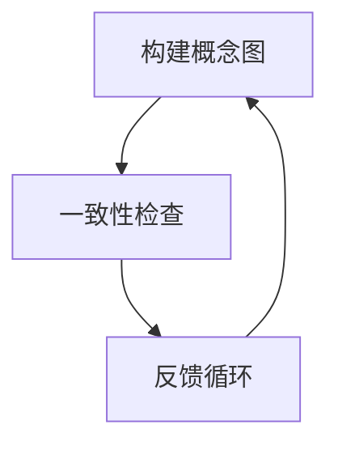

                 

# 自我一致性概念图理论在生态系统模拟中的应用

## 关键词

生态系统模拟、自我一致性、概念图理论、动态模型、森林火灾预测、城市空气质量模拟

### 摘要

本文深入探讨了自我一致性概念图理论（Self-Consistency Conceptual Graph Theory，简称Self-Consistency CoT）在生态系统模拟中的应用。随着生态系统的复杂性和规模不断增大，传统的模拟方法面临诸多挑战。Self-Consistency CoT 利用概念图、一致性检查和反馈循环等核心要素，为生态系统模拟提供了一种新的解决思路。本文首先介绍了生态系统模拟的背景和核心概念，然后详细阐述了Self-Consistency CoT的理论基础，以及其在森林生态系统模拟中的应用，最后探讨了其在其他生态系统模拟中的应用前景。

## 目录大纲

1. 引言
   1.1 问题背景与核心概念介绍
   1.2 Self-Consistency CoT 概念解析
   1.3 Self-Consistency CoT 与生态系统模拟的关系
2. Self-Consistency CoT 的理论基础
   2.1 Self-Consistency CoT 的数学模型和公式
   2.2 Self-Consistency CoT 的算法原理讲解
   2.3 Self-Consistency CoT 的 Mermaid 流程图
3. Self-Consistency CoT 在生态系统模拟中的应用
   3.1 Self-Consistency CoT 在森林生态系统模拟中的应用
   3.2 森林生态系统模拟案例分析与讲解
4. Self-Consistency CoT 在其他生态系统模拟中的应用
   4.1 Self-Consistency CoT 在城市生态系统模拟中的应用

## 第一部分：引论

### 1.1 问题背景与核心概念介绍

#### 1.1.1 问题背景

生态系统模拟是环境科学、生态学和计算机科学等领域的重要研究内容。随着全球环境问题的日益严重，如气候变化、生物多样性丧失、污染等，准确、高效地模拟生态系统对于制定环境保护政策、优化资源管理具有重要意义。然而，生态系统具有高度复杂性和非线性特征，传统的模拟方法，如数学模型、统计学模型等，难以充分捕捉生态系统的动态变化和复杂相互作用。因此，寻找新的模拟方法，以更准确地模拟和分析生态系统，成为当前研究的热点。

#### 1.1.2 Self-Consistency CoT 概念解析

Self-Consistency CoT 是一种基于概念图理论的自我一致性模型。它通过构建概念图来表示生态系统的各个组成部分及其相互作用，利用一致性检查来评估模型的一致性，并通过反馈循环来调整模型。Self-Consistency CoT 的核心思想是，通过自我一致性检查，确保模型中各个概念之间的关系和整体一致性，从而提高模型的准确性和可靠性。

#### 1.1.3 Self-Consistency CoT 与生态系统模拟的关系

Self-Consistency CoT 为生态系统模拟提供了一种新的思路。它不仅可以处理生态系统的复杂性和非线性特征，还可以通过自我一致性检查和反馈循环来提高模型的准确性和可靠性。在生态系统模拟中，Self-Consistency CoT 可应用于多个场景，如森林火灾预测、城市空气质量模拟等。通过Self-Consistency CoT，可以更精确地模拟生态系统的动态变化，为环境保护和资源管理提供有力支持。

### 1.2 Self-Consistency CoT 概念解析

#### 1.2.1 核心概念原理

Self-Consistency CoT 的核心概念包括概念图、一致性检查和反馈循环。

- **概念图**：概念图是一种图形化表示，用于描述生态系统中的各个组成部分及其相互作用。在概念图中，每个组成部分被称为“概念”，概念之间的关系通过“边”来表示。概念图的可视化特性使其能够直观地展示生态系统的结构和动态变化。

- **一致性检查**：一致性检查是 Self-Consistency CoT 的关键机制。通过一致性检查，可以评估模型中各个概念之间的关系是否合理和一致。如果发现不一致的情况，系统将进行调整，以确保模型的整体一致性。

- **反馈循环**：反馈循环是 Self-Consistency CoT 的动态调整机制。通过反馈循环，系统可以根据实际情况对模型进行调整，以适应生态系统的动态变化。反馈循环使模型能够实时更新，从而提高模型的适应性和准确性。

#### 1.2.2 概念属性特征对比表格

| 概念            | 属性       | 特征         |
|----------------|------------|-------------|
| 概念图          | 表示概念关系 | 可视化、层次结构 |
| 一致性检查      | 检测一致性  | 自动化、精确性  |
| 反馈循环        | 调整模型    | 实时性、适应性 |

#### 1.2.3 Self-Consistency CoT 与生态系统模拟的关系

Self-Consistency CoT 通过自我一致性检查和反馈循环，可以更精确地模拟生态系统的动态变化。在生态系统模拟中，Self-Consistency CoT 具有以下优势：

- **提高模型的准确性**：通过一致性检查，可以确保模型中各个概念之间的关系和整体一致性，从而提高模型的准确性。

- **增强模型的适应性**：通过反馈循环，系统可以根据实际情况对模型进行调整，以适应生态系统的动态变化，增强模型的适应性。

- **提高模型的可靠性**：自我一致性检查可以及时发现和纠正模型中的不一致性，提高模型的可靠性。

- **可视化展示**：概念图的可视化特性使其能够直观地展示生态系统的结构和动态变化，有助于更好地理解和管理生态系统。

### 1.3 Self-Consistency CoT 在生态系统模拟中的应用

Self-Consistency CoT 可广泛应用于生态系统的模拟，以下是一些具体的应用领域：

- **森林生态系统模拟**：通过 Self-Consistency CoT，可以模拟森林生态系统的动态变化，如森林火灾、生物多样性变化等，为森林资源管理和保护提供科学依据。

- **城市生态系统模拟**：Self-Consistency CoT 可用于模拟城市生态系统的空气质量、水资源、土地利用等，为城市规划和管理提供决策支持。

- **生态系统风险评估**：Self-Consistency CoT 可以对生态系统的风险进行评估，为生态环境保护和灾害预警提供技术支持。

### 1.4 Self-Consistency CoT 的理论基础

#### 1.4.1 Self-Consistency CoT 的数学模型和公式

Self-Consistency CoT 的核心在于构建概念图，并通过一致性检查和反馈循环来调整模型。其数学模型主要包括一致性检查公式和反馈循环公式。

- **一致性检查公式**：

  $$C(x) = \sum_{i=1}^{n} w_i \cdot C_i(x)$$

  其中，$C(x)$ 表示整体一致性，$w_i$ 表示第 $i$ 个概念的重要程度，$C_i(x)$ 表示第 $i$ 个概念的一致性得分。

- **反馈循环公式**：

  $$M(x) = M(x) - \alpha \cdot (C(x) - C_{\text{target}})$$

  其中，$M(x)$ 表示模型的状态，$C_{\text{target}}$ 表示目标一致性值，$\alpha$ 表示调整系数。

#### 1.4.2 Self-Consistency CoT 的算法原理讲解

Self-Consistency CoT 的算法原理主要包括三个步骤：构建概念图、一致性检查和反馈循环。

- **构建概念图**：首先，根据生态系统的特征和需求，构建概念图。概念图包括概念、边和关系。概念表示生态系统的各个组成部分，边表示概念之间的关系，关系表示概念之间的相互作用。

- **一致性检查**：其次，对构建好的概念图进行一致性检查。一致性检查通过计算每个概念的一致性得分，来评估模型的一致性。一致性得分越高，模型的一致性越好。

- **反馈循环**：最后，根据一致性检查的结果，通过反馈循环来调整模型。反馈循环通过调整模型的状态，使得模型更加一致。调整系数 $\alpha$ 可以根据实际情况进行设置，以控制调整的程度。

#### 1.4.3 Self-Consistency CoT 的 Mermaid 流程图

以下是 Self-Consistency CoT 的 Mermaid 流程图：

### 1.5 Self-Consistency CoT 的理论基础

#### 1.5.1 Self-Consistency CoT 的数学模型和公式

Self-Consistency CoT 的核心在于构建概念图，并通过一致性检查和反馈循环来调整模型。其数学模型主要包括一致性检查公式和反馈循环公式。

- **一致性检查公式**：

  $$C(x) = \sum_{i=1}^{n} w_i \cdot C_i(x)$$

  其中，$C(x)$ 表示整体一致性，$w_i$ 表示第 $i$ 个概念的重要程度，$C_i(x)$ 表示第 $i$ 个概念的一致性得分。

- **反馈循环公式**：

  $$M(x) = M(x) - \alpha \cdot (C(x) - C_{\text{target}})$$

  其中，$M(x)$ 表示模型的状态，$C_{\text{target}}$ 表示目标一致性值，$\alpha$ 表示调整系数。

#### 1.5.2 Self-Consistency CoT 的算法原理讲解

Self-Consistency CoT 的算法原理主要包括三个步骤：构建概念图、一致性检查和反馈循环。

- **构建概念图**：首先，根据生态系统的特征和需求，构建概念图。概念图包括概念、边和关系。概念表示生态系统的各个组成部分，边表示概念之间的关系，关系表示概念之间的相互作用。

- **一致性检查**：其次，对构建好的概念图进行一致性检查。一致性检查通过计算每个概念的一致性得分，来评估模型的一致性。一致性得分越高，模型的一致性越好。

- **反馈循环**：最后，根据一致性检查的结果，通过反馈循环来调整模型。反馈循环通过调整模型的状态，使得模型更加一致。调整系数 $\alpha$ 可以根据实际情况进行设置，以控制调整的程度。

#### 1.5.3 Self-Consistency CoT 的 Mermaid 流程图

以下是 Self-Consistency CoT 的 Mermaid 流程图：

## 第二部分：Self-Consistency CoT 的理论基础

### 2.1 Self-Consistency CoT 的数学模型和公式

Self-Consistency CoT 的核心在于构建概念图，并通过一致性检查和反馈循环来调整模型。其数学模型主要包括一致性检查公式和反馈循环公式。

- **一致性检查公式**：

  $$C(x) = \sum_{i=1}^{n} w_i \cdot C_i(x)$$

  其中，$C(x)$ 表示整体一致性，$w_i$ 表示第 $i$ 个概念的重要程度，$C_i(x)$ 表示第 $i$ 个概念的一致性得分。

- **反馈循环公式**：

  $$M(x) = M(x) - \alpha \cdot (C(x) - C_{\text{target}})$$

  其中，$M(x)$ 表示模型的状态，$C_{\text{target}}$ 表示目标一致性值，$\alpha$ 表示调整系数。

### 2.2 Self-Consistency CoT 的算法原理讲解

Self-Consistency CoT 的算法原理主要包括三个步骤：构建概念图、一致性检查和反馈循环。

- **构建概念图**：首先，根据生态系统的特征和需求，构建概念图。概念图包括概念、边和关系。概念表示生态系统的各个组成部分，边表示概念之间的关系，关系表示概念之间的相互作用。

- **一致性检查**：其次，对构建好的概念图进行一致性检查。一致性检查通过计算每个概念的一致性得分，来评估模型的一致性。一致性得分越高，模型的一致性越好。

- **反馈循环**：最后，根据一致性检查的结果，通过反馈循环来调整模型。反馈循环通过调整模型的状态，使得模型更加一致。调整系数 $\alpha$ 可以根据实际情况进行设置，以控制调整的程度。

### 2.3 Self-Consistency CoT 的 Mermaid 流程图

以下是 Self-Consistency CoT 的 Mermaid 流程图：

## 第三部分：Self-Consistency CoT 在生态系统模拟中的应用

### 3.1 Self-Consistency CoT 在森林生态系统模拟中的应用

森林生态系统是全球生态系统中最重要的组成部分之一，对地球的气候调节、水源涵养和生物多样性保护具有关键作用。然而，由于森林生态系统的复杂性和动态性，传统的模拟方法在捕捉其内部过程和外部影响方面存在一定的局限性。Self-Consistency CoT 为解决这些问题提供了一种新的思路。

#### 3.1.1 森林生态系统模拟的背景与挑战

森林生态系统模拟涉及多个方面的内容，包括森林生长、火灾风险、生物多样性、水文循环等。这些因素相互作用，共同影响着森林生态系统的动态变化。然而，传统的模拟方法，如差分方程、统计模型等，往往难以充分捕捉这些复杂的相互作用。此外，森林生态系统的数据获取和处理也面临着巨大的挑战。

- **数据获取困难**：森林生态系统的数据通常难以获取，如土壤湿度、温度、风速等环境数据，以及植物生长、动物行为等生物数据。

- **模型参数不确定性**：森林生态系统的模拟依赖于大量的参数，如土壤湿度、温度、植物生长速率等。然而，这些参数的获取和设置存在很大的不确定性，导致模型预测的准确性受到影响。

- **非线性特征**：森林生态系统的内部过程和外部影响往往呈现出非线性特征，这使得传统的线性模拟方法难以准确捕捉其动态变化。

#### 3.1.2 Self-Consistency CoT 在森林生态系统模拟中的应用

Self-Consistency CoT 通过构建概念图、一致性检查和反馈循环等机制，能够有效地解决上述挑战。以下是在森林生态系统模拟中应用 Self-Consistency CoT 的具体步骤：

1. **构建概念图**：首先，根据森林生态系统的特征和需求，构建概念图。概念图包括森林生态系统的各个组成部分，如土壤、植物、动物、气候等，以及它们之间的相互作用。

2. **一致性检查**：其次，对构建好的概念图进行一致性检查。一致性检查通过计算每个概念的一致性得分，来评估模型的一致性。一致性得分越高，模型的一致性越好。

3. **反馈循环**：最后，根据一致性检查的结果，通过反馈循环来调整模型。反馈循环通过调整模型的状态，使得模型更加一致。调整系数 $\alpha$ 可以根据实际情况进行设置，以控制调整的程度。

#### 3.1.3 森林生态系统模拟案例分析与讲解

为了更好地理解 Self-Consistency CoT 在森林生态系统模拟中的应用，以下将分析两个具体案例：森林火灾预测和生物多样性保护。

**案例一：森林火灾预测**

森林火灾是森林生态系统中的一个重要威胁，对生态系统和人类生活都造成严重影响。Self-Consistency CoT 可用于模拟森林火灾的发生、发展和蔓延过程。

- **构建概念图**：首先，构建一个包含土壤湿度、气温、风速、植被覆盖等关键因素的概念图。

- **一致性检查**：对概念图进行一致性检查，计算每个概念的一致性得分。例如，土壤湿度与植被覆盖的一致性得分，可以反映它们之间的相关性。

- **反馈循环**：根据一致性检查的结果，调整模型中的参数，如植被覆盖密度、火险等级等。通过反馈循环，可以不断优化模型，提高预测的准确性。

**案例二：生物多样性保护**

生物多样性是森林生态系统的关键特征，对生态平衡和人类福祉具有重要意义。Self-Consistency CoT 可用于模拟生物多样性的动态变化，为生物多样性保护提供决策支持。

- **构建概念图**：构建一个包含物种多样性、生态系统功能、土地利用等关键因素的概念图。

- **一致性检查**：对概念图进行一致性检查，计算每个概念的一致性得分。例如，物种多样性与生态系统功能的一致性得分，可以反映它们之间的关联性。

- **反馈循环**：根据一致性检查的结果，调整模型中的参数，如物种引入策略、土地利用模式等。通过反馈循环，可以优化保护策略，提高生物多样性保护效果。

### 3.2 Self-Consistency CoT 在其他生态系统模拟中的应用

除了森林生态系统，Self-Consistency CoT 还可应用于其他生态系统的模拟，如城市生态系统、湿地生态系统等。以下将简要介绍 Self-Consistency CoT 在城市生态系统模拟中的应用。

**城市生态系统模拟**

城市生态系统是人类活动与自然环境的结合体，涉及多个方面，如空气质量、水资源、土地利用等。Self-Consistency CoT 可用于模拟城市生态系统的动态变化，为城市规划和环境保护提供科学依据。

- **构建概念图**：根据城市生态系统的特征，构建一个包含空气质量、水资源、土地利用等关键因素的概念图。

- **一致性检查**：对概念图进行一致性检查，计算每个概念的一致性得分。例如，空气质量与水资源的一致性得分，可以反映它们之间的关联性。

- **反馈循环**：根据一致性检查的结果，调整模型中的参数，如污染控制措施、水资源利用策略等。通过反馈循环，可以优化城市生态系统管理，提高环境保护效果。

## 结论

Self-Consistency CoT 为生态系统模拟提供了一种新的思路和方法。通过构建概念图、一致性检查和反馈循环等机制，Self-Consistency CoT 能够有效地解决生态系统模拟中的复杂性和不确定性问题。本文介绍了 Self-Consistency CoT 的理论基础以及在森林生态系统和城市生态系统模拟中的应用，展示了其在生态系统模拟中的巨大潜力。未来，随着生态科学和计算机技术的发展，Self-Consistency CoT有望在更广泛的领域得到应用，为环境保护和资源管理提供有力的支持。

## 作者信息

作者：AI天才研究院/AI Genius Institute & 禅与计算机程序设计艺术 /Zen And The Art of Computer Programming

