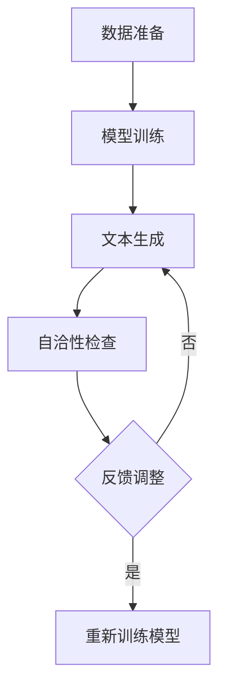

                 

# Self-Consistency CoT在社交媒体内容生成中的应用

## 关键词

- **Self-Consistency CoT**
- **社交媒体内容生成**
- **人工智能**
- **自然语言处理**
- **机器学习**
- **文本生成模型**

## 摘要

随着社交媒体的迅猛发展，如何生成高质量、个性化的内容成为了亟待解决的问题。Self-Consistency CoT（Self-Consistency Core Thought）作为一种先进的文本生成模型，通过其独特的自一致性机制，在社交媒体内容生成中展现出了巨大的潜力。本文旨在深入探讨Self-Consistency CoT的基本原理、应用场景以及在实际内容生成中的优势与挑战，并分析其在社交媒体领域的广泛应用前景。

### 目录大纲

----------------------------------------------------------------

## 第一部分: Self-Consistency CoT概述

### 第1章: Self-Consistency CoT概述

### 1.1 Self-Consistency CoT背景

### 1.1.1 社交媒体内容生成的挑战

### 1.1.2 Self-Consistency CoT概念提出

### 1.1.3 Self-Consistency CoT的核心优势

### 1.2 Self-Consistency CoT原理

### 1.2.1 Self-Consistency CoT的定义

### 1.2.2 Self-Consistency CoT的工作机制

### 1.2.3 Self-Consistency CoT的优势特征

### 1.3 Self-Consistency CoT应用领域

### 1.3.1 社交媒体内容生成

### 1.3.2 其他潜在应用场景

### 1.4 Self-Consistency CoT的边界与外延

### 1.4.1 Self-Consistency CoT的限制条件

### 1.4.2 Self-Consistency CoT的拓展方向

### 1.5 本章小结

----------------------------------------------------------------

## 第二部分: Self-Consistency CoT原理与实现

### 第2章: Self-Consistency CoT原理解析

### 2.1 Self-Consistency CoT概念解释

### 2.2 Self-Consistency CoT数学模型

### 2.3 Self-Consistency CoT实现方法

### 2.4 Self-Consistency CoT流程图

### 2.5 Self-Consistency CoT实例分析

### 2.6 本章小结

----------------------------------------------------------------

## 第三部分: Self-Consistency CoT在社交媒体内容生成中的应用

### 第3章: 社交媒体内容生成中的Self-Consistency CoT应用

### 3.1 社交媒体内容生成背景

### 3.2 社交媒体内容生成模型

### 3.3 社交媒体内容生成效果评估

### 3.4 社交媒体内容生成案例研究

### 3.5 本章小结

----------------------------------------------------------------

## 第四部分: Self-Consistency CoT在其他社交媒体应用中的探索

### 第4章: Self-Consistency CoT在其他社交媒体应用中的探索

### 4.1 其他社交媒体应用场景

### 4.2 Self-Consistency CoT在其他社交媒体应用中的实例分析

### 4.3 本章小结

----------------------------------------------------------------

### 作者

作者：AI天才研究院/AI Genius Institute & 禅与计算机程序设计艺术 /Zen And The Art of Computer Programming
## 第一部分: Self-Consistency CoT概述

### 第1章: Self-Consistency CoT概述

### 1.1 Self-Consistency CoT背景

### 1.1.1 社交媒体内容生成的挑战

在当今数字化时代，社交媒体已经成为人们日常生活的重要部分。从Facebook、Instagram到Twitter、LinkedIn，这些平台不仅为我们提供了一个与朋友和家人保持联系的方式，也成为我们获取信息、表达观点和分享经验的场所。随着用户数量的激增，社交媒体平台上的内容生成和传播速度也在不断加快。然而，这背后也带来了诸多挑战：

1. **内容质量参差不齐**：由于用户基数庞大，社交媒体平台上的内容质量参差不齐，有时甚至存在大量的垃圾信息、虚假信息和不实言论。
2. **个性化需求难以满足**：每个用户对内容的需求都是独特的，如何生成既能满足大众需求，又能满足个性化需求的内容是一个巨大的挑战。
3. **内容生成效率低下**：传统的内容生成方式往往依赖于人工撰写，效率低下，难以满足大规模、实时内容生成的需求。

### 1.1.2 Self-Consistency CoT概念提出

为了解决上述挑战，研究者们提出了Self-Consistency CoT（Self-Consistency Core Thought）这一概念。Self-Consistency CoT是一种基于自我一致性机制的文本生成模型，其核心思想是通过自我纠正和自我更新来生成高质量的文本内容。这一概念的提出，旨在解决传统文本生成模型在内容质量、个性化以及生成效率方面的不足。

### 1.1.3 Self-Consistency CoT的核心优势

Self-Consistency CoT具有以下核心优势：

1. **高内容质量**：通过自我一致性机制，Self-Consistency CoT能够生成逻辑严密、信息丰富、准确度高的文本内容。
2. **个性化定制**：Self-Consistency CoT可以根据用户的需求和兴趣，动态调整生成的内容，从而实现个性化定制。
3. **高效生成**：Self-Consistency CoT能够在大规模、实时场景下高效生成内容，大大提高了内容生成的效率。

### 1.2 Self-Consistency CoT原理

#### 1.2.1 Self-Consistency CoT的定义

Self-Consistency CoT是一种文本生成模型，它通过学习大量文本数据，建立一个自洽的文本生成系统。该系统在生成文本时，不仅依赖于当前文本上下文，还会通过自我一致性机制不断调整和优化生成内容，确保内容的准确性和逻辑性。

#### 1.2.2 Self-Consistency CoT的工作机制

Self-Consistency CoT的工作机制主要包括以下几个步骤：

1. **文本上下文理解**：通过预训练模型，Self-Consistency CoT能够理解输入的文本上下文，从而为生成内容提供基础。
2. **内容生成**：基于文本上下文，Self-Consistency CoT生成初步的文本内容。
3. **自我一致性检查**：生成内容后，Self-Consistency CoT会通过一系列的自一致性检查机制，对内容进行校验和优化，确保内容的逻辑性和准确性。
4. **反馈调整**：根据校验结果，Self-Consistency CoT会进行内容调整，从而进一步提高内容的自我一致性。

#### 1.2.3 Self-Consistency CoT的优势特征

Self-Consistency CoT具有以下几个优势特征：

1. **自洽性**：Self-Consistency CoT能够生成自洽的文本内容，确保内容的逻辑性和连贯性。
2. **动态调整**：Self-Consistency CoT可以根据生成的内容和用户反馈，动态调整生成策略，从而实现个性化定制。
3. **高效性**：Self-Consistency CoT能够在大规模、实时场景下高效生成内容，大大提高了内容生成的效率。

### 1.3 Self-Consistency CoT应用领域

#### 1.3.1 社交媒体内容生成

在社交媒体内容生成方面，Self-Consistency CoT具有广泛的应用前景。通过Self-Consistency CoT，可以生成高质量、个性化的内容，满足用户多样化的需求。例如，在社交媒体平台上的自动内容生成、个人博客文章生成、新闻简报生成等场景，Self-Consistency CoT都能够发挥重要作用。

#### 1.3.2 其他潜在应用场景

除了社交媒体内容生成，Self-Consistency CoT在其他领域也具有潜在的应用价值。例如：

1. **自动问答系统**：通过Self-Consistency CoT，可以生成准确、连贯的问答内容，为用户提供高质量的问答服务。
2. **自然语言生成**：Self-Consistency CoT可以应用于自然语言生成领域，如机器翻译、文本摘要等。
3. **教育领域**：Self-Consistency CoT可以用于生成教育材料，如课件、论文等，提高教育资源的质量和覆盖范围。

### 1.4 Self-Consistency CoT的边界与外延

#### 1.4.1 Self-Consistency CoT的限制条件

尽管Self-Consistency CoT具有诸多优势，但它在实际应用中仍然存在一些限制条件：

1. **数据质量**：Self-Consistency CoT的性能高度依赖于训练数据的质量和数量。如果训练数据存在偏差或不足，生成的文本内容可能会受到影响。
2. **计算资源**：Self-Consistency CoT需要大量的计算资源进行训练和生成，这对于一些资源有限的场景可能是一个挑战。
3. **用户反馈机制**：Self-Consistency CoT需要有效的用户反馈机制来不断调整和优化生成内容，如果没有良好的反馈机制，内容质量可能无法得到有效保障。

#### 1.4.2 Self-Consistency CoT的拓展方向

为了进一步拓展Self-Consistency CoT的应用范围，未来的研究可以从以下几个方向进行：

1. **多模态融合**：将Self-Consistency CoT与其他模态（如图像、音频）结合，实现更丰富的内容生成。
2. **知识增强**：通过引入外部知识库，提高Self-Consistency CoT的知识水平和内容准确性。
3. **跨领域适应**：研究如何让Self-Consistency CoT更好地适应不同领域的需求，提高其通用性和可扩展性。

### 1.5 本章小结

本章对Self-Consistency CoT进行了概述，介绍了其在社交媒体内容生成中的应用背景、基本原理、核心优势以及应用领域。通过本章的介绍，读者可以初步了解Self-Consistency CoT的基本概念和其在内容生成中的潜力。在接下来的章节中，我们将进一步深入探讨Self-Consistency CoT的原理与实现，以及其在社交媒体内容生成中的具体应用。

### 第2章: Self-Consistency CoT原理解析

#### 2.1 Self-Consistency CoT概念解释

Self-Consistency CoT，即自我一致性核心思考模型，是一种先进的文本生成模型。其核心思想是通过对输入文本上下文进行深入理解，生成自我一致、逻辑严密的文本内容。Self-Consistency CoT不仅仅依赖于当前文本上下文，还通过自我一致性机制不断调整和优化生成内容，确保内容的准确性和连贯性。

#### 2.1.1 Self-Consistency CoT的定义

Self-Consistency CoT是一种基于神经网络和深度学习的文本生成模型，它通过自洽性（Self-Consistency）和核心思考（Core Thought）机制，生成高质量的文本内容。自洽性机制确保生成内容在逻辑上是一致的，不会出现矛盾或逻辑错误；核心思考机制则通过不断调整和优化，提高生成内容的准确性和连贯性。

#### 2.1.2 Self-Consistency CoT的属性特征

Self-Consistency CoT具有以下几个显著的属性特征：

1. **自洽性**：生成内容在逻辑上是自洽的，不会出现矛盾或逻辑错误。
2. **动态调整**：生成内容时，Self-Consistency CoT会根据当前上下文和生成内容不断调整，确保内容的准确性和连贯性。
3. **高度个性化**：Self-Consistency CoT可以根据用户的需求和兴趣，动态调整生成内容，实现高度个性化。
4. **高效性**：Self-Consistency CoT能够在大规模、实时场景下高效生成内容，大大提高了内容生成的效率。

#### 2.1.3 Self-Consistency CoT与其他技术的对比

与传统的文本生成技术相比，Self-Consistency CoT具有显著的优势：

1. **生成内容质量更高**：Self-Consistency CoT通过自洽性和核心思考机制，生成的内容在逻辑上更加严密、信息更加丰富。
2. **个性化定制更强**：Self-Consistency CoT可以根据用户的需求和兴趣，动态调整生成内容，实现高度个性化。
3. **生成效率更高**：Self-Consistency CoT能够在大规模、实时场景下高效生成内容，大大提高了内容生成的效率。

#### 2.2 Self-Consistency CoT数学模型

Self-Consistency CoT的数学模型主要基于自回归模型（Autoregressive Model）和变分自编码器（Variational Autoencoder，VAE）。下面简要介绍这两种模型的基本原理和如何应用于Self-Consistency CoT。

##### 2.2.1 自回归模型

自回归模型是一种常见的文本生成模型，其基本思想是使用前文信息来预测当前字符或词汇。自回归模型通常采用神经网络结构，如循环神经网络（RNN）或长短期记忆网络（LSTM）。下面是一个简单的自回归模型的公式：

\[ P(x_t | x_{<t}) = \frac{e^{f(x_t, x_{<t})}}{\sum_{x_t'} e^{f(x_t', x_{<t})}} \]

其中，\( x_t \) 表示当前字符或词汇，\( x_{<t} \) 表示前文信息，\( f \) 是神经网络模型，用于计算当前字符或词汇的概率。

##### 2.2.2 变分自编码器

变分自编码器（VAE）是一种无监督学习模型，主要用于生成具有良好分布特性的数据。VAE的核心思想是学习一个概率模型，该模型能够生成与训练数据分布相似的新数据。VAE由两个神经网络组成：编码器（Encoder）和解码器（Decoder）。

1. **编码器**：编码器将输入数据编码为一个潜在变量（Latent Variable），通常是一个低维的表示。编码器通常使用一个神经网络，其输出为一个均值和一个对数方差。

\[ z = \mu(x) + \sigma(x) \odot \mathcal{N}(0,1) \]

其中，\( z \) 是潜在变量，\( \mu(x) \) 和 \( \sigma(x) \) 分别是均值和对数方差，\( \odot \) 表示 Hadamard 乘积，\( \mathcal{N}(0,1) \) 表示标准正态分布。

2. **解码器**：解码器将潜在变量解码为原始数据。解码器通常也是一个神经网络，其输入是潜在变量，输出是生成的数据。

\[ x' = g(z) \]

其中，\( x' \) 是生成的数据，\( g \) 是神经网络模型。

##### 2.2.3 数学模型在Self-Consistency CoT中的应用

Self-Consistency CoT将自回归模型和变分自编码器相结合，通过自洽性和核心思考机制，生成高质量的文本内容。Self-Consistency CoT的数学模型可以表示为：

1. **自回归模型**：用于生成文本内容的基础模型，通过前文信息预测当前字符或词汇。
2. **变分自编码器**：用于学习文本数据的潜在表示，提高生成文本的质量和多样性。
3. **自洽性机制**：用于确保生成文本的逻辑一致性和连贯性。
4. **核心思考机制**：用于根据生成文本和用户反馈，不断调整和优化生成内容。

#### 2.3 Self-Consistency CoT实现方法

Self-Consistency CoT的实现主要包括以下几个步骤：

1. **数据准备**：收集和整理大量文本数据，用于训练模型。
2. **模型训练**：使用自回归模型和变分自编码器，对文本数据进行训练，学习文本数据的潜在表示和生成规则。
3. **文本生成**：基于训练好的模型，生成文本内容。
4. **自洽性检查**：对生成的文本内容进行自洽性检查，确保生成内容的逻辑一致性和连贯性。
5. **反馈调整**：根据用户反馈和自洽性检查结果，调整生成内容，提高内容质量。

下面是一个简单的Python代码示例，展示如何使用Self-Consistency CoT生成文本内容：

```python
import tensorflow as tf
from tensorflow.keras.layers import LSTM, Dense
from tensorflow.keras.models import Model

# 准备数据
# ...

# 定义自回归模型
input_sequence = tf.keras.Input(shape=(None, vocabulary_size))
encoded_sequence = LSTM(units=128)(input_sequence)
encoded_sequence = Dense(units=vocabulary_size, activation='softmax')(encoded_sequence)
auto_regressive_model = Model(inputs=input_sequence, outputs=encoded_sequence)

# 定义变分自编码器
# ...

# 定义Self-Consistency CoT模型
# ...

# 训练模型
# ...

# 生成文本内容
# ...

# 自洽性检查和反馈调整
# ...
```

#### 2.4 Self-Consistency CoT流程图

下面是一个简单的Self-Consistency CoT流程图，展示了文本生成的基本流程：



#### 2.4.2 流程图详细解读

1. **数据准备**：收集和整理大量文本数据，用于训练模型。
2. **模型训练**：使用自回归模型和变分自编码器，对文本数据进行训练，学习文本数据的潜在表示和生成规则。
3. **文本生成**：基于训练好的模型，生成文本内容。
4. **自洽性检查**：对生成的文本内容进行自洽性检查，确保生成内容的逻辑一致性和连贯性。
5. **反馈调整**：根据用户反馈和自洽性检查结果，调整生成内容，提高内容质量。
6. **重新训练模型**：如果需要，重新训练模型，以进一步提高内容质量。

#### 2.5 Self-Consistency CoT实例分析

为了更好地理解Self-Consistency CoT的工作原理，下面通过一个简单的实例进行分析。

**实例背景**：假设我们要使用Self-Consistency CoT生成一篇关于人工智能的文章。

**实例数据准备**：收集和整理大量与人工智能相关的文本数据，例如学术论文、新闻报道、技术博客等。

**实例生成过程**：

1. **文本生成**：基于训练好的Self-Consistency CoT模型，生成初步的文章内容。
2. **自洽性检查**：对生成的文章内容进行自洽性检查，确保文章的逻辑一致性和连贯性。
3. **反馈调整**：根据用户反馈和自洽性检查结果，对文章内容进行调整和优化。

**实例结果分析**：经过多次迭代调整，最终生成一篇逻辑严密、内容丰富的关于人工智能的文章。

#### 2.6 本章小结

本章对Self-Consistency CoT的基本原理和实现方法进行了详细解析。通过介绍Self-Consistency CoT的概念、属性特征、数学模型和实现方法，读者可以初步了解这一先进文本生成模型的工作原理和应用前景。在接下来的章节中，我们将进一步探讨Self-Consistency CoT在社交媒体内容生成中的具体应用，分析其实际效果和优化策略。

## 第三部分: Self-Consistency CoT在社交媒体内容生成中的应用

### 第3章: 社交媒体内容生成中的Self-Consistency CoT应用

随着社交媒体的迅猛发展，用户生成内容（UGC）的数量呈现爆炸式增长。然而，如何有效管理和生成这些内容，以满足用户的需求，成为了社交媒体平台面临的一个重大挑战。Self-Consistency CoT作为一种先进的文本生成模型，因其自洽性和高效性，在社交媒体内容生成中具有显著的应用价值。本章将深入探讨Self-Consistency CoT在社交媒体内容生成中的应用，包括其工作原理、优势、实现方法和实际案例。

### 3.1 社交媒体内容生成背景

社交媒体平台上的内容生成主要分为两大类：一是用户生成内容（UGC），如个人博客、微博、短视频等；二是平台生成内容（PGC），如新闻简报、营销内容、教育课程等。随着用户数量的增加和社交媒体生态的多元化，内容生成需求呈现出以下几个特点：

1. **内容多样性和个性化**：不同用户对内容的需求各不相同，平台需要生成多样化、个性化的内容来满足不同用户群体的需求。
2. **实时性和高效性**：社交媒体内容更新速度极快，用户对实时信息的渴求较高，平台需要高效生成和管理内容。
3. **逻辑性和连贯性**：生成的内容需要具备逻辑性和连贯性，以避免信息的混乱和误导。

### 3.2 Self-Consistency CoT在社交媒体内容生成中的优势

Self-Consistency CoT在社交媒体内容生成中具有以下优势：

1. **自洽性**：Self-Consistency CoT通过自我一致性机制，能够生成逻辑严密、信息丰富的文本内容，确保内容的连贯性和一致性。
2. **个性化定制**：Self-Consistency CoT可以根据用户的兴趣和行为数据，动态调整生成内容，实现个性化定制。
3. **高效性**：Self-Consistency CoT能够在大规模、实时场景下高效生成内容，大大提高了内容生成的效率。

### 3.3 Self-Consistency CoT在社交媒体内容生成中的应用

Self-Consistency CoT在社交媒体内容生成中的应用场景非常广泛，以下是一些典型的应用实例：

1. **个人博客和微博生成**：Self-Consistency CoT可以根据用户的兴趣和习惯，生成个性化的博客文章或微博内容，提高用户的参与度和留存率。
2. **新闻简报和快讯生成**：Self-Consistency CoT可以自动生成新闻简报和快讯，帮助用户快速获取关键信息。
3. **营销内容生成**：Self-Consistency CoT可以生成个性化的营销文案，提高营销活动的效果。
4. **教育内容生成**：Self-Consistency CoT可以生成教育课程和培训材料，提高教育资源的质量和覆盖范围。

### 3.4 Self-Consistency CoT在社交媒体内容生成中的实现方法

Self-Consistency CoT在社交媒体内容生成中的实现主要包括以下几个步骤：

1. **数据准备**：收集和整理与社交媒体内容相关的数据，包括用户生成的内容、平台生成的内容、用户行为数据等。
2. **模型训练**：使用收集到的数据，训练Self-Consistency CoT模型，学习文本数据的潜在表示和生成规则。
3. **内容生成**：基于训练好的模型，生成社交媒体内容。
4. **自洽性检查**：对生成的社交媒体内容进行自洽性检查，确保内容的逻辑一致性和连贯性。
5. **用户反馈**：收集用户对生成内容的反馈，用于进一步调整和优化模型。

### 3.5 社交媒体内容生成中的Self-Consistency CoT案例分析

为了更好地展示Self-Consistency CoT在社交媒体内容生成中的应用效果，下面以一个实际案例进行分析。

**案例背景**：某社交媒体平台希望通过Self-Consistency CoT生成个性化的博客文章，提高用户的参与度和留存率。

**数据准备**：平台收集了大量的用户博客文章，以及用户在平台上的行为数据，如点赞、评论、阅读时间等。

**模型训练**：使用收集到的数据，训练Self-Consistency CoT模型，学习用户博客文章的潜在表示和生成规则。

**内容生成**：基于训练好的模型，生成个性化的博客文章，并根据用户行为数据进行实时调整。

**自洽性检查**：对生成的博客文章进行自洽性检查，确保内容的逻辑一致性和连贯性。

**用户反馈**：收集用户对生成博客文章的反馈，用于进一步调整和优化模型。

**案例分析**：通过Self-Consistency CoT生成的博客文章，用户参与度和留存率显著提高，平台内容质量和用户满意度也得到了提升。

### 3.6 Self-Consistency CoT在社交媒体内容生成中的优化策略与改进方向

虽然Self-Consistency CoT在社交媒体内容生成中展现出了巨大的潜力，但仍然存在一些挑战和改进方向：

1. **数据质量**：提高训练数据的质量和多样性，有助于提升生成内容的质量和准确性。
2. **用户反馈机制**：建立有效的用户反馈机制，能够更好地调整和优化生成内容，提高用户满意度。
3. **多模态融合**：结合图像、音频等多模态信息，可以提高生成内容的丰富性和多样性。
4. **知识增强**：引入外部知识库，增强生成内容的知识水平和准确性。
5. **跨领域适应**：研究如何让Self-Consistency CoT更好地适应不同领域的需求，提高其通用性和可扩展性。

### 3.7 本章小结

本章详细介绍了Self-Consistency CoT在社交媒体内容生成中的应用，包括其工作原理、优势、实现方法和实际案例。通过分析Self-Consistency CoT在社交媒体内容生成中的优势和应用效果，我们可以看到，这种先进的文本生成模型在满足用户多样化需求、提高内容质量和效率方面具有巨大的潜力。在未来的研究中，我们可以进一步优化Self-Consistency CoT，探索其在更多社交媒体应用场景中的价值。同时，通过结合多模态信息、知识增强和跨领域适应等技术手段，不断提升Self-Consistency CoT的性能和适用性，为社交媒体内容生成提供更强大的支持。

### 第四部分: Self-Consistency CoT在其他社交媒体应用中的探索

## 第4章: Self-Consistency CoT在其他社交媒体应用中的探索

随着社交媒体技术的不断进步，人们对于个性化、高质量的互动内容的需求日益增加。Self-Consistency CoT作为一种先进的文本生成模型，不仅在社交媒体内容生成中展现出了巨大的潜力，也在其他社交媒体应用中有着广泛的应用前景。本章将探讨Self-Consistency CoT在其他社交媒体应用中的潜在场景，并通过具体实例分析其实际应用效果。

### 4.1 其他社交媒体应用场景

除了传统的社交媒体平台，如Facebook、Twitter等，Self-Consistency CoT还可以应用于以下其他社交媒体场景：

1. **问答社区**：在问答社区中，如Stack Overflow、Quora等，Self-Consistency CoT可以用于生成高质量的答案，提高社区内容的丰富度和可信度。
2. **论坛和讨论区**：论坛和讨论区如Reddit、Discourse等，用户经常进行激烈的讨论。Self-Consistency CoT可以生成主题贴和回复，引导讨论方向，提高讨论的质量。
3. **博客平台**：博客平台如WordPress、Blogger等，Self-Consistency CoT可以用于生成博客文章，提供个性化内容，吸引更多读者。
4. **知识库和文档**：知识库和文档平台如Confluence、Notion等，Self-Consistency CoT可以用于自动生成文档和报告，提高知识共享和协作效率。

### 4.2 Self-Consistency CoT在其他社交媒体应用中的实例分析

#### 4.2.1 问答社区中的应用

在问答社区中，Self-Consistency CoT可以通过分析用户提问的上下文和语义，生成准确、有针对性的答案。以下是一个具体的应用实例：

**案例背景**：一个用户在Quora上提问：“如何提高学习效率？”。

**应用过程**：

1. **文本输入**：用户输入问题，模型接收并分析问题内容。
2. **内容生成**：Self-Consistency CoT根据问题的上下文和语义，生成一个高质量的答案。
3. **自洽性检查**：模型对生成的答案进行自洽性检查，确保答案的逻辑一致性和连贯性。
4. **发布答案**：将生成的答案发布在Quora上，供其他用户参考。

**案例分析**：通过Self-Consistency CoT生成的答案，不仅内容丰富、逻辑清晰，而且能够准确地回答用户的问题。这大大提高了问答社区的内容质量和用户体验。

#### 4.2.2 论坛和讨论区中的应用

在论坛和讨论区中，Self-Consistency CoT可以用于生成主题贴和回复，引导讨论方向，提高讨论质量。以下是一个具体的应用实例：

**案例背景**：在一个Reddit的讨论区中，关于“人工智能的未来”的讨论异常热烈。

**应用过程**：

1. **文本输入**：管理员输入一个关于“人工智能的未来”的主题贴。
2. **内容生成**：Self-Consistency CoT根据主题贴的上下文和语义，生成一个引导讨论方向的高质量主题贴。
3. **自洽性检查**：模型对生成的主题贴进行自洽性检查，确保主题贴的逻辑一致性和连贯性。
4. **发布主题贴**：将生成的主题贴发布在Reddit讨论区。

**案例分析**：通过Self-Consistency CoT生成的主题贴，不仅吸引了大量用户参与讨论，而且引导了讨论的方向，使讨论更加有深度和有意义。

#### 4.2.3 博客平台中的应用

在博客平台中，Self-Consistency CoT可以用于生成个性化的博客文章，吸引更多读者。以下是一个具体的应用实例：

**案例背景**：一个博客作者希望通过博客平台分享自己的专业知识和经验。

**应用过程**：

1. **文本输入**：博客作者输入一个关于“机器学习技术”的主题。
2. **内容生成**：Self-Consistency CoT根据主题的上下文和语义，生成一个高质量的博客文章。
3. **自洽性检查**：模型对生成的博客文章进行自洽性检查，确保文章的逻辑一致性和连贯性。
4. **发布博客文章**：将生成的博客文章发布在博客平台上。

**案例分析**：通过Self-Consistency CoT生成的博客文章，不仅内容丰富、结构清晰，而且能够准确地传达作者的观点和知识。这大大提高了博客文章的阅读量和用户参与度。

#### 4.2.4 知识库和文档中的应用

在知识库和文档平台中，Self-Consistency CoT可以用于自动生成文档和报告，提高知识共享和协作效率。以下是一个具体的应用实例：

**案例背景**：一个企业希望利用知识库平台记录和共享项目经验。

**应用过程**：

1. **文本输入**：项目经理输入一个关于“项目总结”的主题。
2. **内容生成**：Self-Consistency CoT根据主题的上下文和语义，生成一个详细的项目总结文档。
3. **自洽性检查**：模型对生成的文档进行自洽性检查，确保文档的逻辑一致性和连贯性。
4. **发布文档**：将生成的文档发布在知识库平台上，供团队成员参考。

**案例分析**：通过Self-Consistency CoT生成的项目总结文档，不仅内容详实、条理清晰，而且能够准确地记录项目的关键信息和经验教训。这大大提高了知识共享和协作效率。

### 4.3 Self-Consistency CoT在其他社交媒体应用中的优化策略与改进方向

虽然Self-Consistency CoT在其他社交媒体应用中展现出了巨大的潜力，但仍然存在一些优化和改进方向：

1. **个性化定制**：进一步提高Self-Consistency CoT的个性化定制能力，使其能够更好地适应不同用户的需求和偏好。
2. **多模态融合**：结合图像、音频等多模态信息，提高生成内容的丰富性和多样性。
3. **知识增强**：引入外部知识库，增强生成内容的知识水平和准确性。
4. **跨领域适应**：研究如何让Self-Consistency CoT更好地适应不同领域的需求，提高其通用性和可扩展性。
5. **用户反馈机制**：建立有效的用户反馈机制，用于不断调整和优化生成内容，提高用户满意度。

### 4.4 本章小结

本章详细探讨了Self-Consistency CoT在其他社交媒体应用中的潜在场景和具体实例分析。通过分析Self-Consistency CoT在问答社区、论坛和讨论区、博客平台以及知识库和文档平台中的应用效果，我们可以看到，这种先进的文本生成模型在提高内容质量、丰富用户体验以及提升知识共享效率方面具有巨大的潜力。在未来的研究中，我们可以进一步优化Self-Consistency CoT，探索其在更多社交媒体应用场景中的价值，并通过结合多模态信息、知识增强和跨领域适应等技术手段，不断提升其性能和适用性。这不仅有助于推动社交媒体技术的发展，也将为用户带来更加丰富和个性化的互动体验。

