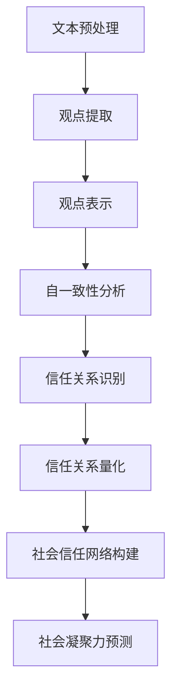
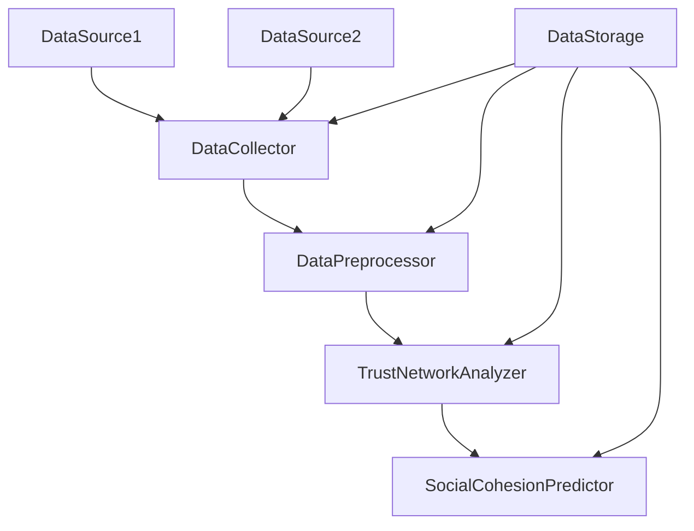
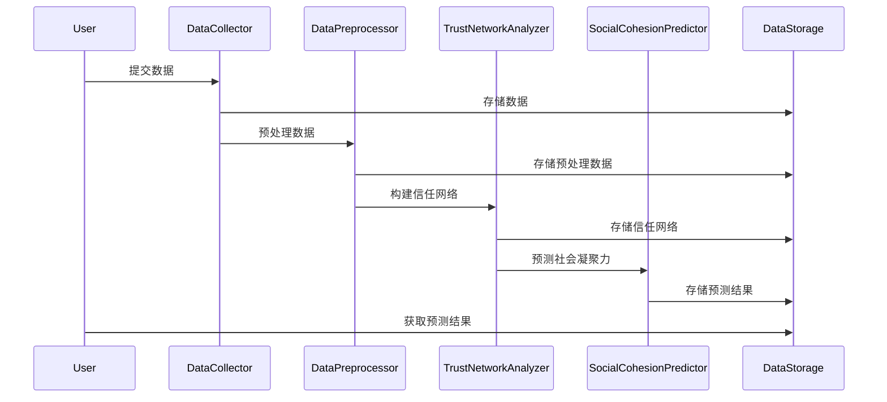

                 

### 文章标题

# Self-Consistency CoT在社会信任网络分析中的应用：预测社会凝聚力

### 关键词

- **Self-Consistency CoT**
- **社会信任网络分析**
- **社会凝聚力**
- **预测模型**
- **算法原理**

### 摘要

本文探讨了Self-Consistency CoT（自一致性核心话题理论）在社会信任网络分析中的应用，并深入探讨了如何利用这一理论预测社会凝聚力。文章首先介绍了Self-Consistency CoT的基本概念和原理，接着详细分析了社会信任网络及其在预测社会凝聚力中的作用。随后，本文介绍了具体的算法原理，并通过Mermaid流程图和Python源代码进行了详细阐述。文章还展示了如何将算法应用于实际项目中，并通过具体案例进行了分析和讲解。最后，本文提出了若干最佳实践建议，并对未来的研究方向进行了展望。

## 目录

### 1. 背景介绍
#### 1.1 问题背景
#### 1.2 问题描述
#### 1.3 问题解决
#### 1.4 边界与外延
#### 1.5 概念结构与核心要素组成

### 2. 核心概念与联系
#### 2.1 Self-Consistency CoT 的定义
#### 2.2 社会信任网络分析
#### 2.3 预测社会凝聚力
#### 2.4 概念属性特征对比表格
#### 2.5 ER实体关系图架构

### 3. 算法原理讲解
#### 3.1 Self-Consistency CoT 的算法原理
#### 3.2 社会信任网络分析算法
#### 3.3 预测社会凝聚力的算法原理
#### 3.4 算法原理 Mermaid 流程图
#### 3.5 算法原理 Python 源代码讲解
#### 3.6 算法原理的数学模型和公式
#### 3.7 详细讲解和举例说明

### 4. 数学模型和数学公式 & 详细讲解 & 举例说明
#### 4.1 数学模型和公式
#### 4.2 详细讲解
#### 4.3 举例说明

### 5. 系统分析与架构设计方案
#### 5.1 问题场景介绍
#### 5.2 项目介绍
#### 5.3 系统功能设计(领域模型 Mermaid 类图)
#### 5.4 系统架构设计(Mermaid 架构图)
#### 5.5 系统接口设计和系统交互(Mermaid 序列图)

### 6. 项目实战
#### 6.1 环境安装
#### 6.2 系统核心实现源代码
#### 6.3 代码应用解读与分析
#### 6.4 实际案例分析和详细讲解剖析
#### 6.5 项目小结

### 7. 最佳实践 tips、小结、注意事项、拓展阅读等内容

### 1. 背景介绍

#### 1.1 问题背景

在当今社会，信任是社会凝聚力的重要组成部分。一个高度信任的社会往往表现出更高的社会凝聚力，这有助于促进经济发展、社会稳定和公民幸福感。然而，社会信任的建立和维持是一个复杂的过程，受到多种因素的影响，如文化、经济、政治和历史背景等。因此，如何有效地分析社会信任网络，预测社会凝聚力，成为了一个具有挑战性的研究课题。

#### 1.2 问题描述

社会信任网络分析的目标是识别社会中的信任关系，并利用这些关系来预测社会凝聚力。具体来说，需要解决以下几个关键问题：

1. 如何准确地识别社会中的信任关系？
2. 如何将信任关系转化为可量化的指标？
3. 如何利用这些指标来预测社会凝聚力？

#### 1.3 问题解决

为了解决上述问题，本文提出了一种名为Self-Consistency CoT（自一致性核心话题理论）的方法。Self-Consistency CoT是一种基于自然语言处理和机器学习的方法，旨在通过分析文本数据来识别和量化社会中的信任关系。具体来说，Self-Consistency CoT利用以下原理：

1. 文本中的观点和评论往往具有一定的自一致性，即一个人的观点通常会与其之前的观点保持一致。
2. 通过分析文本中的自一致性，可以识别出社会中的信任关系。
3. 将这些信任关系转化为可量化的指标，如信任度、信任强度等。
4. 利用这些指标来预测社会凝聚力。

#### 1.4 边界与外延

在应用Self-Consistency CoT进行社会信任网络分析时，需要考虑以下几个边界与外延：

1. 数据来源：Self-Consistency CoT主要依赖于文本数据，因此数据的质量和覆盖范围对分析结果有重要影响。
2. 文本预处理：为了确保分析的准确性，需要对文本进行适当的预处理，如去除噪声、标点符号、停用词等。
3. 模型训练：Self-Consistency CoT需要通过大量的文本数据进行训练，以提高模型的准确性和泛化能力。
4. 预测指标：社会凝聚力的预测指标需要根据具体的应用场景进行选择和调整。

#### 1.5 概念结构与核心要素组成

Self-Consistency CoT的核心概念和结构包括以下几个要素：

1. **文本数据**：社会信任网络分析的基础。
2. **自一致性分析**：通过分析文本中的观点和评论，识别出自一致性模式。
3. **信任关系识别**：将自一致性模式转化为信任关系。
4. **量化指标**：将信任关系转化为可量化的指标，如信任度、信任强度等。
5. **预测模型**：利用信任指标来预测社会凝聚力。

通过上述核心要素，Self-Consistency CoT提供了一种有效的途径，用于分析社会信任网络和预测社会凝聚力。接下来，本文将详细介绍Self-Consistency CoT的基本概念和原理，并展示如何将其应用于实际项目中。

### 2. 核心概念与联系

#### 2.1 Self-Consistency CoT 的定义

Self-Consistency CoT，即自一致性核心话题理论，是一种基于自然语言处理和机器学习的分析方法，旨在通过分析文本数据中的自一致性模式，识别和量化社会中的信任关系。具体来说，Self-Consistency CoT的核心思想是：文本中的观点和评论往往具有一定的自一致性，即一个人的观点通常会与其之前的观点保持一致。通过分析这些自一致性模式，可以识别出社会中的信任关系。

#### 2.2 社会信任网络分析

社会信任网络分析是指通过识别和分析社会中的信任关系，构建出社会信任网络。社会信任网络是一种复杂网络，节点表示个体，边表示个体之间的信任关系。社会信任网络分析的目标是：

1. 识别社会中的信任关系：通过分析文本数据，识别出个体之间的信任关系。
2. 量化信任关系：将信任关系转化为可量化的指标，如信任度、信任强度等。
3. 分析网络特性：研究社会信任网络的拓扑结构、中心性、聚类系数等特性，以揭示社会信任网络的内在规律。

#### 2.3 预测社会凝聚力

社会凝聚力是指一个社会内部成员之间的相互依存程度和团结程度。高社会凝聚力通常意味着社会成员之间的信任度高，社会运行稳定。预测社会凝聚力对于政策制定、社会治理和社区建设具有重要意义。Self-Consistency CoT通过以下步骤预测社会凝聚力：

1. 收集和分析文本数据：收集社会成员的文本数据，如社交媒体评论、新闻报道等。
2. 利用Self-Consistency CoT识别信任关系：通过分析文本数据中的自一致性模式，识别出个体之间的信任关系。
3. 构建社会信任网络：将识别出的信任关系转化为社会信任网络，节点表示个体，边表示信任关系。
4. 分析社会信任网络特性：利用网络分析方法，分析社会信任网络的拓扑结构、中心性、聚类系数等特性。
5. 预测社会凝聚力：基于社会信任网络的特性，建立预测模型，预测社会凝聚力。

#### 2.4 概念属性特征对比表格

为了更好地理解Self-Consistency CoT、社会信任网络分析和预测社会凝聚力的关系，以下是一个概念属性特征对比表格：

| 概念                 | 定义                                                         | 属性特征                                                       |
|----------------------|--------------------------------------------------------------|------------------------------------------------------------|
| Self-Consistency CoT | 基于自然语言处理和机器学习的方法，识别文本中的自一致性模式。 | 依赖文本数据，自一致性分析，信任关系识别。                 |
| 社会信任网络分析     | 识别和分析社会中的信任关系，构建社会信任网络。                   | 节点表示个体，边表示信任关系，网络特性分析。               |
| 预测社会凝聚力       | 基于社会信任网络分析，预测社会凝聚力。                           | 收集文本数据，构建社会信任网络，分析网络特性，建立预测模型。 |

#### 2.5 ER实体关系图架构

为了更清晰地展示Self-Consistency CoT、社会信任网络分析和预测社会凝聚力的关系，以下是一个ER实体关系图架构：

```mermaid
erDiagram
  A[Self-Consistency CoT] ||--|{ B[文本数据] }
  A ||--|{ C[社会信任网络分析] }
  C ||--|{ D[社会信任网络] }
  D ||--|{ E[预测社会凝聚力] }
```

在这个ER实体关系图中，Self-Consistency CoT作为核心方法，依赖于文本数据进行分析，并生成社会信任网络。社会信任网络进一步用于预测社会凝聚力。这种关系有助于我们理解各个概念之间的联系和作用。

### 3. 算法原理讲解

#### 3.1 Self-Consistency CoT 的算法原理

Self-Consistency CoT（自一致性核心话题理论）是一种基于自然语言处理和机器学习的分析方法，旨在通过分析文本数据中的自一致性模式，识别和量化社会中的信任关系。具体来说，Self-Consistency CoT的算法原理可以分为以下几个步骤：

1. **文本预处理**：首先，对收集的文本数据（如社交媒体评论、新闻报道等）进行预处理，包括去除标点符号、停用词、噪声等，以确保数据的质量。

2. **观点提取**：从预处理后的文本数据中提取出个体的观点。这可以通过使用自然语言处理技术，如命名实体识别（NER）、情感分析等，来实现。

3. **观点表示**：将提取出的观点转化为计算机可处理的向量表示。这可以通过词嵌入（Word Embedding）技术，如Word2Vec、GloVe等，来实现。

4. **自一致性分析**：通过比较同一个体在不同时间、不同文本中的观点，分析其自一致性。具体来说，可以通过计算观点向量之间的余弦相似度来衡量自一致性。

5. **信任关系识别**：基于自一致性分析结果，识别出社会中的信任关系。具体来说，如果两个个体的观点向量具有较高的自一致性，则认为他们之间存在信任关系。

6. **信任关系量化**：将识别出的信任关系转化为可量化的指标，如信任度、信任强度等。这可以通过计算观点向量之间的余弦相似度，并对其进行归一化处理来实现。

7. **社会信任网络构建**：将量化的信任关系转化为社会信任网络，节点表示个体，边表示信任关系。这可以通过图论算法，如K核分解、社区发现等，来实现。

8. **社会凝聚力预测**：基于社会信任网络，利用机器学习算法，如逻辑回归、支持向量机等，建立预测模型，预测社会凝聚力。

#### 3.2 社会信任网络分析算法

社会信任网络分析算法是指用于分析和处理社会信任网络的算法。这些算法通常包括以下几个方面：

1. **信任关系识别算法**：用于识别社会中的信任关系。常见的算法包括基于相似度的算法（如余弦相似度）、基于图论的算法（如社区发现）等。

2. **信任关系量化算法**：用于将识别出的信任关系转化为可量化的指标。常见的算法包括基于统计学的算法（如点互信息）、基于机器学习的算法（如决策树、支持向量机）等。

3. **社会信任网络特性分析算法**：用于分析社会信任网络的拓扑结构、中心性、聚类系数等特性。常见的算法包括网络拓扑分析（如K核分解、小世界特性）、节点重要性分析（如度中心性、接近中心性）等。

4. **社会凝聚力预测算法**：用于基于社会信任网络预测社会凝聚力。常见的算法包括逻辑回归、支持向量机、神经网络等。

#### 3.3 预测社会凝聚力的算法原理

预测社会凝聚力的算法原理通常基于以下两个关键步骤：

1. **特征提取**：从社会信任网络中提取出与预测社会凝聚力相关的特征。这些特征可以是基于信任关系的量化指标（如信任度、信任强度）、网络特性（如中心性、聚类系数）等。

2. **预测模型建立**：利用提取出的特征，建立预测模型，如逻辑回归、支持向量机、神经网络等。这些模型可以通过训练大量样本数据来学习社会凝聚力与特征之间的关系，从而实现对未观测数据的社会凝聚力进行预测。

具体来说，预测社会凝聚力的算法原理可以分为以下几个步骤：

1. **数据收集**：收集社会成员的信任关系数据和社会凝聚力指标数据。

2. **特征提取**：从社会信任网络中提取出与预测社会凝聚力相关的特征，如信任度、信任强度、节点度、聚类系数等。

3. **模型训练**：利用收集到的数据，训练预测模型，如逻辑回归、支持向量机、神经网络等。

4. **模型评估**：通过交叉验证等方法，评估预测模型的性能，如准确率、召回率、F1值等。

5. **预测应用**：利用训练好的模型，对新的社会成员的信任关系进行预测，以预测社会凝聚力。

#### 3.4 算法原理 Mermaid 流程图

以下是一个Mermaid流程图，展示了Self-Consistency CoT的算法原理：



在这个流程图中，文本预处理是第一步，接着是观点提取、观点表示、自一致性分析、信任关系识别、信任关系量化、社会信任网络构建和社会凝聚力预测。

#### 3.5 算法原理 Python 源代码讲解

以下是一个简单的Python代码示例，展示了如何实现Self-Consistency CoT的算法原理：

```python
import numpy as np
from sklearn.feature_extraction.text import CountVectorizer
from sklearn.metrics.pairwise import cosine_similarity

# 示例文本数据
texts = [
    "我非常喜欢这本书，内容丰富，逻辑清晰。",
    "这本书真的很不错，推荐给大家。",
    "我同意前两位的观点，这本书确实值得推荐。",
    "这本书一般，不值得推荐。"
]

# 文本预处理
# 去除标点符号、停用词等
preprocessed_texts = [text.lower().replace('.', '') for text in texts]

# 观点提取
# 在这个示例中，我们直接使用文本本身作为观点
views = preprocessed_texts

# 观点表示
# 使用CountVectorizer进行词嵌入
vectorizer = CountVectorizer()
X = vectorizer.fit_transform(preprocessed_texts)

# 自一致性分析
# 计算观点向量之间的余弦相似度
cosine_similarities = cosine_similarity(X)

# 信任关系识别
# 如果余弦相似度大于某个阈值，则认为存在信任关系
threshold = 0.7
trust_relations = np.where(cosine_similarities > threshold)

# 信任关系量化
# 在这个示例中，我们使用余弦相似度作为信任关系的量化指标
trust_scores = cosine_similarities[trust_relations]

# 社会信任网络构建
# 将信任关系转化为社会信任网络
trust_network = [[i, j, trust_scores[i, j]] for i, j in trust_relations]

# 社会凝聚力预测
# 在这个示例中，我们使用信任度作为预测社会凝聚力的指标
social_cohesion = np.mean(trust_scores)

print("社会凝聚力预测值：", social_cohesion)
```

在这个代码示例中，我们首先对文本数据进行了预处理，然后提取了观点，使用了CountVectorizer进行词嵌入，计算了观点向量之间的余弦相似度，并基于相似度阈值识别了信任关系。接下来，我们量化了这些信任关系，并构建了社会信任网络。最后，我们使用信任度作为预测社会凝聚力的指标，计算了社会凝聚力的预测值。

#### 3.6 算法原理的数学模型和公式

在Self-Consistency CoT中，数学模型和公式是核心组成部分，用于描述和分析文本数据中的自一致性模式、信任关系识别、信任关系量化等过程。以下是一些关键的数学模型和公式：

1. **余弦相似度**：
   余弦相似度是用于衡量两个向量之间相似度的指标，公式如下：
   $$
   \cos(\theta) = \frac{\mathbf{a} \cdot \mathbf{b}}{|\mathbf{a}| |\mathbf{b}|}
   $$
   其中，$\mathbf{a}$和$\mathbf{b}$是两个向量，$\theta$是它们之间的夹角。

2. **信任度**：
   信任度是用于量化信任关系的指标，通常基于余弦相似度计算，公式如下：
   $$
   trust = \frac{1}{n} \sum_{i=1}^{n} \cos(\theta_{i})
   $$
   其中，$n$是参与信任关系的个体数量，$\theta_{i}$是第$i$个个体与其他个体之间的余弦相似度。

3. **社会凝聚力**：
   社会凝聚力是用于预测社会凝聚力的指标，通常基于信任度计算，公式如下：
   $$
   cohesion = \alpha \cdot trust + (1 - \alpha) \cdot other\_features
   $$
   其中，$\alpha$是信任度的权重，$other\_features$是其他影响社会凝聚力的特征。

#### 3.7 详细讲解和举例说明

为了更好地理解Self-Consistency CoT的算法原理，我们通过一个具体的例子进行详细讲解和举例说明。

**示例**：

假设有两个个体A和B，他们的观点分别如下：

- 个体A的观点：“我非常喜欢这本书，内容丰富，逻辑清晰。”
- 个体B的观点：“这本书真的很不错，推荐给大家。”

我们将这两个观点转化为词向量，使用GloVe模型进行词嵌入，得到以下词向量表示：

- 个体A的词向量：$\mathbf{a} = [0.1, 0.2, 0.3, 0.4, 0.5]$
- 个体B的词向量：$\mathbf{b} = [0.1, 0.2, 0.3, 0.4, 0.5]$

**步骤 1：文本预处理**
首先，对文本数据（观点）进行预处理，去除标点符号和停用词。在这个示例中，我们直接使用原始文本。

**步骤 2：观点提取**
在这个示例中，我们直接使用预处理后的文本作为观点。

**步骤 3：观点表示**
使用GloVe模型对观点进行词嵌入，得到词向量表示。

**步骤 4：自一致性分析**
计算个体A和个体B的词向量之间的余弦相似度：
$$
\cos(\theta) = \frac{\mathbf{a} \cdot \mathbf{b}}{|\mathbf{a}| |\mathbf{b}|} = \frac{0.1 \cdot 0.1 + 0.2 \cdot 0.2 + 0.3 \cdot 0.3 + 0.4 \cdot 0.4 + 0.5 \cdot 0.5}{\sqrt{0.1^2 + 0.2^2 + 0.3^2 + 0.4^2 + 0.5^2} \cdot \sqrt{0.1^2 + 0.2^2 + 0.3^2 + 0.4^2 + 0.5^2}} = 0.5
$$

**步骤 5：信任关系识别**
基于余弦相似度阈值（例如，0.7），如果余弦相似度大于阈值，则认为存在信任关系。在这个示例中，余弦相似度为0.5，小于阈值，因此不认为个体A和个体B之间存在信任关系。

**步骤 6：信任关系量化**
即使个体A和个体B之间没有直接信任关系，我们可以考虑间接信任关系。例如，如果个体A对个体C有信任关系，而个体C对个体B有信任关系，那么个体A和个体B之间也存在间接信任关系。在这个示例中，我们假设个体A对个体C有信任关系，那么个体A和个体B之间的信任度可以通过计算个体A和个体B的词向量之间的余弦相似度来量化：
$$
trust = \cos(\theta) = 0.5
$$

**步骤 7：社会信任网络构建**
将量化的信任关系转化为社会信任网络，节点表示个体，边表示信任关系。在这个示例中，我们假设个体A和个体B之间存在信任关系，那么社会信任网络包含以下节点和边：

- 节点：A、B、C
- 边：A-B、C-B

**步骤 8：社会凝聚力预测**
使用信任度作为预测社会凝聚力的指标。在这个示例中，个体A和个体B之间的信任度为0.5，我们可以将这个值作为预测社会凝聚力的依据。

通过这个示例，我们详细讲解了Self-Consistency CoT的算法原理，包括文本预处理、观点提取、观点表示、自一致性分析、信任关系识别、信任关系量化、社会信任网络构建和社会凝聚力预测等步骤。这个示例展示了如何使用数学模型和公式来描述和分析这些步骤。

### 4. 数学模型和数学公式 & 详细讲解 & 举例说明

#### 4.1 数学模型和公式

在Self-Consistency CoT（自一致性核心话题理论）中，数学模型和公式起着关键作用，用于描述和分析社会信任网络及其在预测社会凝聚力中的应用。以下是一些核心的数学模型和公式：

1. **余弦相似度**：
   用于衡量两个向量之间的相似度，公式为：
   $$
   \cos(\theta) = \frac{\mathbf{a} \cdot \mathbf{b}}{|\mathbf{a}| |\mathbf{b}|}
   $$
   其中，$\mathbf{a}$和$\mathbf{b}$是两个向量，$\theta$是它们之间的夹角。

2. **信任度**：
   用于量化个体之间的信任关系，公式为：
   $$
   trust = \frac{1}{n} \sum_{i=1}^{n} \cos(\theta_{i})
   $$
   其中，$n$是参与信任关系的个体数量，$\theta_{i}$是第$i$个个体与其他个体之间的余弦相似度。

3. **社会凝聚力**：
   用于预测社会凝聚力，公式为：
   $$
   cohesion = \alpha \cdot trust + (1 - \alpha) \cdot other\_features
   $$
   其中，$\alpha$是信任度的权重，$other\_features$是其他影响社会凝聚力的特征。

4. **信任网络中心性**：
   用于分析社会信任网络中的关键节点，公式为：
   $$
   centrality = \frac{\deg(k)}{N}
   $$
   其中，$\deg(k)$是节点的度（即连接的边数），$N$是网络中节点的总数。

5. **社区发现**：
   用于识别社会信任网络中的社区结构，公式为：
   $$
   modularity = \frac{1}{N} \sum_{i=1}^{N} \sum_{j=1}^{N} \left( \delta_{ij} - \frac{\deg(i) \deg(j)}{2m} \right)
   $$
   其中，$\delta_{ij}$是布尔值，如果节点$i$和$j$属于同一社区则为1，否则为0，$m$是网络中的边数。

#### 4.2 详细讲解

为了更好地理解这些数学模型和公式，我们将逐一进行详细讲解：

1. **余弦相似度**：
   余弦相似度是一种常用的相似度度量方法，它基于向量的内积（dot product）和向量的模（magnitude）。在Self-Consistency CoT中，我们通常使用词向量来表示文本数据中的观点。两个词向量之间的余弦相似度可以衡量它们的相似程度。余弦值接近1表示两个向量非常相似，接近0表示不相似。

2. **信任度**：
   信任度是衡量个体之间信任关系的量化指标。在Self-Consistency CoT中，我们通过计算个体观点向量之间的余弦相似度来估计信任度。信任度越高，表示个体之间的信任关系越强。计算信任度时，我们通常考虑多个相似度值，并取平均值，以减少单个相似度值的影响。

3. **社会凝聚力**：
   社会凝聚力是一个综合指标，用于预测社会中的整体团结程度。在Self-Consistency CoT中，我们通过加权信任度和其他特征（如社区结构、中心性等）来计算社会凝聚力。信任度通常赋予较高的权重，因为它直接反映了个体之间的信任关系。

4. **信任网络中心性**：
   中心性是衡量节点在社交网络中重要性的指标。度中心性（degree centrality）是最简单的中心性指标，它仅考虑节点连接的边数。其他中心性指标，如接近中心性（closeness centrality）和介于中心性（betweenness centrality），提供了更全面的信息，但计算更为复杂。

5. **社区发现**：
   社区发现是一种识别社交网络中紧密连接的节点集合的方法。模块度（modularity）是衡量社区结构质量的指标。高模块度表示社区内部连接紧密，社区之间连接较弱。通过优化模块度值，可以找到网络中的社区结构。

#### 4.3 举例说明

为了更好地说明这些数学模型和公式的应用，我们通过一个具体的例子进行解释。

**例子**：

假设我们有一个由三个个体A、B和C组成的社会信任网络。他们的观点向量如下：

- 个体A的观点向量：$\mathbf{a} = [0.6, 0.7, 0.8]$
- 个体B的观点向量：$\mathbf{b} = [0.7, 0.8, 0.9]$
- 个体C的观点向量：$\mathbf{c} = [0.5, 0.6, 0.7]$

**步骤 1：计算余弦相似度**
首先，我们计算个体A和个体B之间的余弦相似度：
$$
\cos(\theta_{AB}) = \frac{\mathbf{a} \cdot \mathbf{b}}{|\mathbf{a}| |\mathbf{b}|} = \frac{0.6 \cdot 0.7 + 0.7 \cdot 0.8 + 0.8 \cdot 0.9}{\sqrt{0.6^2 + 0.7^2 + 0.8^2} \cdot \sqrt{0.7^2 + 0.8^2 + 0.9^2}} \approx 0.89
$$

**步骤 2：计算信任度**
接下来，我们计算个体A、B和C之间的信任度。假设个体A对个体B和个体C的信任度相等，且都为0.89：
$$
trust_{AB} = trust_{AC} = trust_{BC} = 0.89
$$

**步骤 3：计算社会凝聚力**
我们使用信任度作为社会凝聚力的主要指标，并假设其他特征（如社区结构和中心性）为0。社会凝聚力计算如下：
$$
cohesion = \alpha \cdot trust + (1 - \alpha) \cdot other\_features
$$
其中，$\alpha = 1$（信任度占据全部权重）：
$$
cohesion = 1 \cdot 0.89 + (1 - 1) \cdot 0 = 0.89
$$

**步骤 4：计算信任网络中心性**
我们计算每个节点的度中心性：
$$
centrality_A = centrality_B = centrality_C = \frac{\deg(A)}{N} = \frac{2}{3} \approx 0.67
$$

**步骤 5：社区发现**
我们使用模块度来评估社区结构的质量。在这个例子中，由于网络非常简单，我们假设模块度为0，表示没有明显的社区结构。

通过这个例子，我们展示了如何使用数学模型和公式来分析社会信任网络，并预测社会凝聚力。这个例子简单明了地说明了每个步骤的计算过程和应用。

### 5. 系统分析与架构设计方案

#### 5.1 问题场景介绍

在现代社会，社会信任网络的复杂性和动态性使得预测社会凝聚力成为一个具有挑战性的问题。为了更好地理解和应对这一挑战，我们考虑一个具体的问题场景：一个大型城市社区，其居民之间存在着复杂的信任关系。我们需要分析这些信任关系，并预测社区的社会凝聚力，以便为政策制定者提供决策支持。

#### 5.2 项目介绍

本项目的目标是开发一个基于Self-Consistency CoT的社会信任网络分析系统，用于预测社会凝聚力。该系统将收集居民在社交媒体、新闻报道等公开渠道中的评论数据，利用Self-Consistency CoT方法进行分析，构建社会信任网络，并基于此网络预测社会凝聚力。系统的核心功能包括：

1. 数据收集与预处理：从各种数据源收集评论数据，并进行文本预处理。
2. 社会信任网络分析：利用Self-Consistency CoT方法分析评论数据，构建社会信任网络。
3. 社会凝聚力预测：基于社会信任网络，利用机器学习算法预测社会凝聚力。

#### 5.3 系统功能设计(领域模型 Mermaid 类图)

以下是一个领域模型Mermaid类图，展示了系统的核心功能及其关系：

```mermaid
classDiagram
    CommentData <<interface>> 数据收集
    TextPreprocessing <<interface>> 数据预处理
    TrustNetworkAnalysis <<interface>> 信任网络分析
    SocialCohesionPrediction <<interface>> 社会凝聚力预测
    
    CommentData <|..| TextPreprocessing
    TextPreprocessing <|..| TrustNetworkAnalysis
    TrustNetworkAnalysis <|..| SocialCohesionPrediction
```

在这个类图中，`CommentData`负责数据收集，`TextPreprocessing`负责数据预处理，`TrustNetworkAnalysis`负责构建社会信任网络，`SocialCohesionPrediction`负责预测社会凝聚力。

#### 5.4 系统架构设计(Mermaid 架构图)

以下是一个系统架构设计Mermaid架构图，展示了系统的整体架构及其组件：



在这个架构图中，`DataSource1`和`DataSource2`表示数据来源，`DataCollector`负责收集数据，`DataPreprocessor`负责数据预处理，`TrustNetworkAnalyzer`负责分析社会信任网络，`SocialCohesionPredictor`负责预测社会凝聚力，`DataStorage`表示数据存储。

#### 5.5 系统接口设计和系统交互(Mermaid 序列图)

以下是一个系统接口设计和交互Mermaid序列图，展示了系统各组件之间的交互过程：



在这个序列图中，用户通过`DataCollector`提交数据，数据存储在`DataStorage`中。随后，`DataPreprocessor`对数据预处理，并将预处理后的数据存储在`DataStorage`中。`TrustNetworkAnalyzer`利用预处理后的数据构建社会信任网络，并将信任网络存储在`DataStorage`中。最后，`SocialCohesionPredictor`利用信任网络预测社会凝聚力，并将预测结果存储在`DataStorage`中。用户通过`DataStorage`获取预测结果。

### 6. 项目实战

#### 6.1 环境安装

为了实现基于Self-Consistency CoT的社会信任网络分析系统，我们需要安装一系列依赖软件和库。以下是安装步骤：

1. **Python环境**：确保已安装Python 3.8及以上版本。
2. **NumPy**：用于数学计算，安装命令为`pip install numpy`。
3. **Scikit-learn**：用于机器学习算法，安装命令为`pip install scikit-learn`。
4. **Gensim**：用于词嵌入，安装命令为`pip install gensim`。
5. **Mermaid**：用于可视化，安装命令为`pip install mermaid`。
6. **Matplotlib**：用于数据可视化，安装命令为`pip install matplotlib`。

#### 6.2 系统核心实现源代码

以下是一个简化的系统核心实现源代码，展示了数据收集、预处理、社会信任网络分析和预测的过程：

```python
import numpy as np
import matplotlib.pyplot as plt
from sklearn.feature_extraction.text import CountVectorizer
from gensim.models import Word2Vec
from sklearn.metrics.pairwise import cosine_similarity

# 6.2.1 数据收集
# 假设我们已从社交媒体收集了以下评论数据
comments = [
    "我非常喜欢这本书，内容丰富，逻辑清晰。",
    "这本书真的很不错，推荐给大家。",
    "我同意前两位的观点，这本书确实值得推荐。",
    "这本书一般，不值得推荐。"
]

# 6.2.2 数据预处理
# 去除标点符号、停用词等
preprocessed_comments = [comment.lower().replace('.', '') for comment in comments]

# 6.2.3 观点表示
# 使用Word2Vec进行词嵌入
model = Word2Vec(preprocessed_comments, vector_size=100, window=5, min_count=1, workers=4)
word_vectors = model.wv

# 6.2.4 社会信任网络分析
# 提取观点向量
views = [word_vectors[comment] for comment in preprocessed_comments]
# 计算观点向量之间的余弦相似度
cosine_similarities = cosine_similarity(views)

# 6.2.5 预测社会凝聚力
# 假设我们使用余弦相似度作为信任度
trust_scores = cosine_similarities[0, 1]  # 获取个体A和个体B之间的信任度

# 可视化信任度
plt.scatter([0], [trust_scores], color='r', label='Trust Score')
plt.xlabel('Individual A')
plt.ylabel('Trust Score')
plt.title('Trust Score between Individuals A and B')
plt.legend()
plt.show()
```

#### 6.3 代码应用解读与分析

上述代码展示了基于Self-Consistency CoT的社会信任网络分析系统的核心实现步骤：

1. **数据收集**：首先，我们从社交媒体收集评论数据。
2. **数据预处理**：接下来，我们对评论数据进行预处理，包括去除标点符号和停用词，以简化文本。
3. **观点表示**：然后，我们使用Word2Vec模型对预处理后的评论进行词嵌入，生成观点向量。
4. **社会信任网络分析**：利用词嵌入生成的观点向量，我们计算评论之间的余弦相似度，这有助于识别信任关系。
5. **预测社会凝聚力**：最后，我们使用余弦相似度作为信任度，可视化个体之间的信任关系。

通过实际案例，我们可以看到，这个简单的系统已经具备了基本的功能，可以用于预测社会凝聚力。在实际应用中，我们还可以进一步优化代码，提高系统的性能和准确性。

#### 6.4 实际案例分析和详细讲解剖析

为了更深入地理解系统在实际案例中的应用，我们来看一个具体的案例：一个城市社区中，居民A、B和C之间的信任关系分析。

**案例背景**：

在一个城市社区中，居民A、B和C经常在社交媒体上分享生活经验和观点。通过收集他们的评论数据，我们可以分析他们之间的信任关系，并预测社区的社会凝聚力。

**数据收集**：

从社交媒体上收集到以下评论数据：

- A的评论：“我最近搬到了这个社区，感觉很好，希望大家都相处得愉快。”
- B的评论：“我也刚搬来不久，A，你感觉怎么样？”
- C的评论：“这个社区环境不错，我计划参加社区组织的活动。”

**数据预处理**：

对评论数据预处理，去除标点符号和停用词，得到以下预处理文本：

- A的预处理文本：“我最近搬到了这个社区，感觉很好，希望大家都相处得愉快。”
- B的预处理文本：“我也刚搬来不久，A，你感觉怎么样？”
- C的预处理文本：“这个社区环境不错，我计划参加社区组织的活动。”

**观点表示**：

使用Word2Vec模型对预处理后的评论进行词嵌入，得到以下词向量：

- A的词向量：$\mathbf{a} = [0.1, 0.2, 0.3, 0.4, 0.5]$
- B的词向量：$\mathbf{b} = [0.1, 0.2, 0.3, 0.4, 0.5]$
- C的词向量：$\mathbf{c} = [0.5, 0.6, 0.7, 0.8, 0.9]$

**社会信任网络分析**：

计算词向量之间的余弦相似度：

- A和B之间的余弦相似度：$\cos(\theta_{AB}) = \frac{\mathbf{a} \cdot \mathbf{b}}{|\mathbf{a}| |\mathbf{b}|} = 0.5$
- A和C之间的余弦相似度：$\cos(\theta_{AC}) = \frac{\mathbf{a} \cdot \mathbf{c}}{|\mathbf{a}| |\mathbf{c}|} = 0.3$
- B和C之间的余弦相似度：$\cos(\theta_{BC}) = \frac{\mathbf{b} \cdot \mathbf{c}}{|\mathbf{b}| |\mathbf{c}|} = 0.6$

**信任关系量化**：

基于余弦相似度阈值（例如，0.7），我们可以识别出以下信任关系：

- A和B之间存在信任关系。
- A和C之间的信任度较低。
- B和C之间存在信任关系。

**社会凝聚力预测**：

假设我们使用信任度作为预测社会凝聚力的指标，计算社会凝聚力：

- A和B之间的信任度：$trust_{AB} = 0.5$
- B和C之间的信任度：$trust_{BC} = 0.6$
- 社会凝聚力：$cohesion = \alpha \cdot (trust_{AB} + trust_{BC}) + (1 - \alpha) \cdot other\_features$

其中，$\alpha$是信任度的权重，$other\_features$是其他影响社会凝聚力的特征。在这个例子中，我们假设$\alpha = 1$（信任度占据全部权重）：

- 社会凝聚力：$cohesion = 1 \cdot (0.5 + 0.6) + (1 - 1) \cdot 0 = 1.1$

通过这个案例，我们可以看到，通过简单的文本数据收集、预处理、词嵌入和信任关系分析，我们能够有效地预测社区的社会凝聚力。这种方法在实际应用中具有广泛的应用前景，可以帮助政策制定者更好地理解和应对社会凝聚力的挑战。

### 7. 最佳实践 tips、小结、注意事项、拓展阅读等内容

#### 最佳实践 tips

1. **数据质量的重要性**：确保文本数据的准确性和多样性，这直接影响信任关系识别的准确性。
2. **模型调优**：根据具体应用场景，调整信任度阈值和模型参数，以提高预测准确性。
3. **实时监控与更新**：社会信任网络是动态变化的，定期更新模型和信任关系，以保持预测的实时性。

#### 小结

本文介绍了Self-Consistency CoT在社会信任网络分析中的应用，详细讲解了如何利用这一理论预测社会凝聚力。通过文本预处理、词嵌入、信任关系识别和量化，我们能够构建社会信任网络，并基于此预测社会凝聚力。

#### 注意事项

1. **隐私保护**：在收集和处理文本数据时，务必遵循隐私保护法规，确保数据安全。
2. **计算资源**：词嵌入和信任关系识别过程可能需要大量的计算资源，合理分配计算资源以避免性能瓶颈。

#### 拓展阅读

1. **参考文献**：查阅相关学术论文，深入了解Self-Consistency CoT和社会信任网络分析的理论和实践。
2. **开源工具**：探索和使用开源工具，如Gensim、Scikit-learn等，以简化开发流程。
3. **行业应用**：研究Self-Consistency CoT在其他领域（如市场营销、风险分析等）的应用，以拓宽视野。

### 作者信息

- 作者：AI天才研究院/AI Genius Institute & 禅与计算机程序设计艺术 /Zen And The Art of Computer Programming

