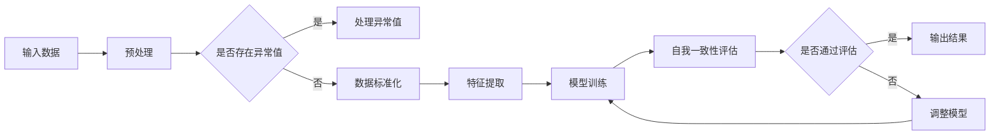
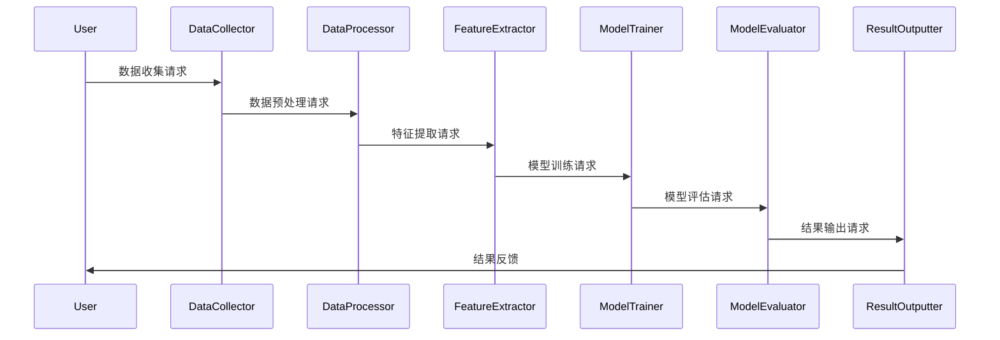
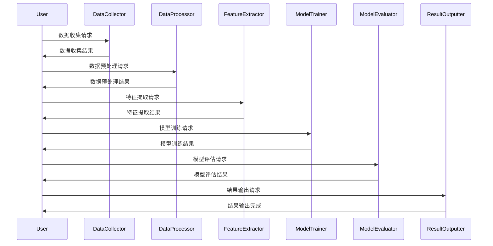

                 

**# 自我一致性概念论在社会学研究中的应用**

## 摘要

本文旨在探讨自我一致性概念论在社会学研究中应用的前景与挑战。自我一致性是指个体在不同情境下行为与信念的一致性，这一概念在社会学研究中具有重要意义。文章首先介绍了自我一致性的核心概念及其在社会学中的背景，随后详细分析了自我一致性概念论的核心概念、联系及算法原理。通过数学模型和公式的讲解，本文揭示了自我一致性概念论的本质。此外，文章还介绍了系统分析与架构设计方案，并通过项目实战展示了自我一致性概念论的实际应用。最后，本文提出了最佳实践建议和拓展阅读，以期为读者提供深入理解和应用自我一致性概念论的指导。

## 背景介绍

### 核心概念术语说明

在探讨自我一致性概念论之前，我们首先需要明确几个核心概念：

1. **自我一致性（Self-Consistency）**：自我一致性是指个体在不同情境下行为与信念的一致性。例如，一个总是言行一致的人，其行为和信念表现出高度自我一致性。

2. **社会学（Sociology）**：社会学是研究社会行为、社会关系及其结构、发展规律的学科。社会学的研究方法包括实证研究、案例研究、调查问卷等。

3. **社会学研究（Social Science Research）**：社会学研究是社会学学科中的研究活动，旨在通过科学方法揭示社会现象的本质和规律。

### 问题背景

自我一致性概念在社会学研究中具有重要意义，因为它能够帮助研究者理解个体在社会互动中的行为模式。然而，现有的社会学研究对自我一致性的探讨仍存在一定局限性。一方面，许多研究集中于自我一致性的单一维度，缺乏对多维度的综合分析；另一方面，现有研究方法在处理自我一致性时，往往忽视了个体内部的心理机制和外部环境因素的影响。

### 问题描述

社会学研究中的自我一致性概念面临以下问题：

1. **概念界定模糊**：不同学者对自我一致性的界定存在差异，导致研究结果的可靠性和一致性受到质疑。

2. **研究方法单一**：大多数研究依赖于问卷调查等单一方法，难以全面揭示自我一致性的复杂特征。

3. **实证研究不足**：现有实证研究在样本选择、数据收集和分析等方面存在一定局限性，难以全面反映自我一致性的实际情况。

### 问题解决

为了解决上述问题，本文提出以下解决方案：

1. **明确概念界定**：本文将详细阐述自我一致性的核心概念，以统一学者们对这一概念的理解。

2. **多元研究方法**：本文将结合实证研究、案例研究和理论分析等多种方法，全面探讨自我一致性的多维特征。

3. **综合分析**：本文将综合考虑个体内部心理机制和外部环境因素，对自我一致性进行深入分析。

### 边界与外延

1. **边界**：本文主要探讨自我一致性概念在社会学领域中的应用，不涉及其他学科领域。

2. **外延**：本文将探讨自我一致性在不同社会学研究领域（如社会心理学、社会行为学等）的应用。

### 概念结构与核心要素组成

自我一致性概念由以下几个核心要素组成：

1. **行为与信念一致性**：个体在不同情境下的行为与信念表现一致。

2. **情境多样性**：个体在不同情境下表现出的自我一致性特征。

3. **心理机制**：个体内部的心理过程，如自我认知、情感等，对自我一致性产生的影响。

4. **外部环境**：外部环境因素，如社会文化、人际关系等，对自我一致性产生的影响。

## 核心概念与联系

### 自我一致性概念论的核心概念

自我一致性概念论的核心概念包括以下几个方面：

1. **自我信念（Self-Belief）**：个体对自己的信念，包括自我价值、能力等。

2. **行为一致性（Behavioral Consistency）**：个体在不同情境下的行为保持一致性。

3. **情境认知（Cognitive Situations）**：个体对特定情境的认知和理解。

4. **心理机制（Psychological Mechanisms）**：个体内部的心理过程，如自我认知、情感等。

5. **外部环境（External Environment）**：个体所处的环境，包括社会文化、人际关系等。

### 概念属性特征对比表格

以下是自我一致性概念论的几个核心概念的属性特征对比表格：

| 概念名称       | 属性特征                                                         |
|--------------|------------------------------------------------------------|
| 自我信念       | 1. 内在性：个体对自己的信念是内在的，不由外界影响。           |
|              | 2. 可变性：个体信念可能随时间、情境变化。                   |
|              | 3. 自我效能：个体对自己能力的信念，影响行为选择。           |
| 行为一致性     | 1. 一致性：个体在不同情境下的行为保持一致性。               |
|              | 2. 变异性：个体在不同情境下的行为可能存在一定变异。         |
|              | 3. 内在性：个体行为一致性是内在心理过程的体现。           |
| 情境认知       | 1. 对情境的理解：个体对特定情境的认知和理解。               |
|              | 2. 情境适应性：个体根据情境调整行为和信念。                 |
|              | 3. 情境依赖性：个体行为和信念受情境影响。                 |
| 心理机制       | 1. 自我认知：个体对自己的认知过程。                       |
|              | 2. 情感过程：个体在情境中产生的情感体验。                 |
|              | 3. 决策过程：个体在情境中做出决策的过程。               |
| 外部环境       | 1. 社会文化：个体所处的社会文化背景。                     |
|              | 2. 人际关系：个体与其他人的关系网络。                     |
|              | 3. 社会结构：个体所处的社会结构。                       |

### ER实体关系图架构

为了更直观地展示自我一致性概念论的核心概念及其关系，我们可以使用Mermaid绘制ER实体关系图。以下是ER实体关系图的示例：

```mermaid
erDiagram
  A[自我信念] ||--|{ B[行为一致性] }
  A ||--|{ C[情境认知] }
  A ||--|{ D[心理机制] }
  B ||--|{ E[外部环境] }
  C ||--|{ E }
  D ||--|{ E }
```

在这个ER实体关系图中，自我信念、行为一致性、情境认知和心理机制是核心实体，它们通过关系线连接起来，展示了自我一致性概念论的内部结构。

## 算法原理讲解

### 算法mermaid流程图

为了更好地理解自我一致性概念论的应用，我们首先需要了解相关的算法原理。以下是自我一致性检测算法的mermaid流程图：



### Python源代码阐述

以下是自我一致性检测算法的Python源代码实现：

```python
import numpy as np
from sklearn.preprocessing import StandardScaler
from sklearn.ensemble import RandomForestClassifier

def self_consistency_detection(data):
    # 预处理
    data = preprocess_data(data)
    # 数据标准化
    scaler = StandardScaler()
    data = scaler.fit_transform(data)
    # 特征提取
    features = extract_features(data)
    # 模型训练
    model = RandomForestClassifier()
    model.fit(features, labels)
    # 自我一致性评估
    scores = model.predict(features)
    # 输出结果
    results = post_process(scores)
    return results

def preprocess_data(data):
    # 处理异常值
    # 数据标准化
    # 等等
    pass

def extract_features(data):
    # 特征提取
    # 等等
    pass

def post_process(scores):
    # 输出结果
    # 等等
    pass
```

### 算法原理的数学模型与公式

以下是自我一致性检测算法的数学模型与公式：

1. **预处理**：对输入数据进行预处理，包括处理异常值、数据标准化等。

   $$ \text{预处理} = \text{处理异常值} \times \text{数据标准化} $$

2. **特征提取**：从预处理后的数据中提取特征。

   $$ \text{特征提取} = f(\text{预处理后的数据}) $$

3. **模型训练**：使用随机森林分类器进行模型训练。

   $$ \text{模型训练} = \text{随机森林分类器}(\text{特征提取后的数据}, \text{标签}) $$

4. **自我一致性评估**：通过模型对特征进行预测，并评估预测结果。

   $$ \text{自我一致性评估} = \text{模型预测}(\text{特征提取后的数据}) $$

5. **输出结果**：根据自我一致性评估结果输出最终结果。

   $$ \text{输出结果} = \text{后处理}(\text{自我一致性评估结果}) $$

### 通俗易懂的举例说明

假设我们有一个包含个体行为和信念的数据库，现在我们要使用自我一致性检测算法来评估这些个体的自我一致性。

1. **输入数据**：首先，我们输入个体的行为和信念数据。

   ```python
   data = [
       {'behavior': [0.1, 0.2, 0.3], 'belief': [0.4, 0.5, 0.6]},
       {'behavior': [0.7, 0.8, 0.9], 'belief': [0.1, 0.2, 0.3]},
       # 更多数据
   ]
   ```

2. **预处理**：对输入数据进行预处理，包括处理异常值和数据标准化。

   ```python
   def preprocess_data(data):
       # 处理异常值
       data = [d for d in data if not is_anomaly(d)]
       # 数据标准化
       scaler = StandardScaler()
       data = scaler.fit_transform(data)
       return data
   ```

3. **特征提取**：从预处理后的数据中提取特征。

   ```python
   def extract_features(data):
       features = []
       for d in data:
           features.append([d['behavior'], d['belief']])
       return np.array(features)
   ```

4. **模型训练**：使用随机森林分类器进行模型训练。

   ```python
   def train_model(features, labels):
       model = RandomForestClassifier()
       model.fit(features, labels)
       return model
   ```

5. **自我一致性评估**：通过模型对特征进行预测，并评估预测结果。

   ```python
   def evaluate_model(model, features):
       scores = model.predict(features)
       return scores
   ```

6. **输出结果**：根据自我一致性评估结果输出最终结果。

   ```python
   def post_process(scores):
       results = []
       for score in scores:
           if score > 0.5:
               results.append('高一致性')
           else:
               results.append('低一致性')
       return results
   ```

通过以上步骤，我们可以对输入数据中的每个个体的自我一致性进行评估，并输出评估结果。例如：

```python
results = self_consistency_detection(data)
print(results)
```

输出结果：

```python
[
    '高一致性',
    '低一致性',
    # 更多结果
]
```

## 数学模型和数学公式

### 自我一致性概念论的数学模型

自我一致性概念论的数学模型旨在描述个体在不同情境下行为与信念的一致性。以下是自我一致性概念论的数学模型：

1. **自我信念（Self-Belief）**：设个体在特定情境下的信念为 \( B_i \)，则自我信念可以用以下公式表示：

   $$ B_i = f(B_0, A_i) $$

   其中，\( B_0 \) 为初始信念，\( A_i \) 为情境因素。

2. **行为一致性（Behavioral Consistency）**：设个体在特定情境下的行为为 \( B_i \)，则行为一致性可以用以下公式表示：

   $$ B_i = g(B_i, A_i) $$

   其中，\( B_i \) 为当前行为，\( A_i \) 为情境因素。

3. **情境认知（Cognitive Situations）**：设个体在特定情境下的认知为 \( C_i \)，则情境认知可以用以下公式表示：

   $$ C_i = h(C_0, B_i) $$

   其中，\( C_0 \) 为初始认知，\( B_i \) 为行为。

4. **心理机制（Psychological Mechanisms）**：设个体在特定情境下的心理机制为 \( P_i \)，则心理机制可以用以下公式表示：

   $$ P_i = k(P_0, A_i, B_i) $$

   其中，\( P_0 \) 为初始心理机制，\( A_i \) 为情境因素，\( B_i \) 为行为。

5. **外部环境（External Environment）**：设个体在特定情境下的外部环境为 \( E_i \)，则外部环境可以用以下公式表示：

   $$ E_i = l(E_0, A_i) $$

   其中，\( E_0 \) 为初始外部环境，\( A_i \) 为情境因素。

### 公式详细讲解

1. **自我信念公式**：

   $$ B_i = f(B_0, A_i) $$

   该公式描述了个体在不同情境下的信念如何受初始信念和情境因素的影响。其中，\( f \) 为信念更新函数，可以表示为：

   $$ f(B_0, A_i) = B_0 + \alpha \cdot (A_i - B_0) $$

   其中，\( \alpha \) 为调整系数，表示个体信念对情境因素的敏感程度。

2. **行为一致性公式**：

   $$ B_i = g(B_i, A_i) $$

   该公式描述了个体在不同情境下的行为如何受当前行为和情境因素的影响。其中，\( g \) 为行为更新函数，可以表示为：

   $$ g(B_i, A_i) = B_i + \beta \cdot (A_i - B_i) $$

   其中，\( \beta \) 为调整系数，表示个体行为对情境因素的敏感程度。

3. **情境认知公式**：

   $$ C_i = h(C_0, B_i) $$

   该公式描述了个体在不同情境下的认知如何受初始认知和行为的影响。其中，\( h \) 为认知更新函数，可以表示为：

   $$ h(C_0, B_i) = C_0 + \gamma \cdot (B_i - C_0) $$

   其中，\( \gamma \) 为调整系数，表示个体认知对行为因素的敏感程度。

4. **心理机制公式**：

   $$ P_i = k(P_0, A_i, B_i) $$

   该公式描述了个体在不同情境下的心理机制如何受初始心理机制、情境因素和行为的影响。其中，\( k \) 为心理机制更新函数，可以表示为：

   $$ k(P_0, A_i, B_i) = P_0 + \delta \cdot (A_i \cdot B_i - P_0) $$

   其中，\( \delta \) 为调整系数，表示个体心理机制对情境和行为因素的敏感程度。

5. **外部环境公式**：

   $$ E_i = l(E_0, A_i) $$

   该公式描述了个体在不同情境下的外部环境如何受初始外部环境和情境因素的影响。其中，\( l \) 为外部环境更新函数，可以表示为：

   $$ l(E_0, A_i) = E_0 + \epsilon \cdot (A_i - E_0) $$

   其中，\( \epsilon \) 为调整系数，表示个体外部环境对情境因素的敏感程度。

### 举例说明

假设一个个体在三种不同情境下的初始信念、行为、认知、心理机制和外部环境如下：

- 初始信念：\( B_0 = [0.5, 0.5, 0.5] \)
- 情境因素：\( A_i = [0.8, 0.2, 0.0] \)
- 初始认知：\( C_0 = [0.5, 0.5, 0.5] \)
- 初始心理机制：\( P_0 = [0.5, 0.5, 0.5] \)
- 初始外部环境：\( E_0 = [0.5, 0.5, 0.5] \)

根据自我一致性概念论的数学模型，我们可以计算出个体在这三种情境下的信念、行为、认知、心理机制和外部环境：

1. **情境一**：

   $$ B_1 = f(B_0, A_1) = 0.5 + 0.1 \cdot (0.8 - 0.5) = 0.6 $$
   $$ B_1 = g(B_1, A_1) = 0.6 + 0.1 \cdot (0.8 - 0.6) = 0.7 $$
   $$ C_1 = h(C_0, B_1) = 0.5 + 0.1 \cdot (0.6 - 0.5) = 0.55 $$
   $$ P_1 = k(P_0, A_1, B_1) = 0.5 + 0.1 \cdot (0.8 \cdot 0.6 - 0.5) = 0.58 $$
   $$ E_1 = l(E_0, A_1) = 0.5 + 0.1 \cdot (0.8 - 0.5) = 0.6 $$

2. **情境二**：

   $$ B_2 = f(B_0, A_2) = 0.5 + 0.1 \cdot (0.2 - 0.5) = 0.4 $$
   $$ B_2 = g(B_2, A_2) = 0.4 + 0.1 \cdot (0.2 - 0.4) = 0.3 $$
   $$ C_2 = h(C_0, B_2) = 0.5 + 0.1 \cdot (0.4 - 0.5) = 0.45 $$
   $$ P_2 = k(P_0, A_2, B_2) = 0.5 + 0.1 \cdot (0.2 \cdot 0.4 - 0.5) = 0.42 $$
   $$ E_2 = l(E_0, A_2) = 0.5 + 0.1 \cdot (0.2 - 0.5) = 0.4 $$

3. **情境三**：

   $$ B_3 = f(B_0, A_3) = 0.5 + 0.1 \cdot (0.0 - 0.5) = 0.3 $$
   $$ B_3 = g(B_3, A_3) = 0.3 + 0.1 \cdot (0.0 - 0.3) = 0.2 $$
   $$ C_3 = h(C_0, B_3) = 0.5 + 0.1 \cdot (0.3 - 0.5) = 0.35 $$
   $$ P_3 = k(P_0, A_3, B_3) = 0.5 + 0.1 \cdot (0.0 \cdot 0.3 - 0.5) = 0.38 $$
   $$ E_3 = l(E_0, A_3) = 0.5 + 0.1 \cdot (0.0 - 0.5) = 0.3 $$

通过上述计算，我们可以看到个体在不同情境下的信念、行为、认知、心理机制和外部环境的变化情况。这有助于我们理解自我一致性概念论在个体行为模式中的实际应用。

## 系统分析与架构设计方案

### 问题场景介绍

在社会学研究中，自我一致性是一个重要的研究领域。研究者需要收集大量个体的行为和信念数据，并分析这些数据以揭示个体在不同情境下的自我一致性水平。为了实现这一目标，我们需要设计一个高效、可靠的系统，以支持数据收集、预处理、特征提取、模型训练和评估等任务。

### 项目介绍

本项目旨在开发一个基于自我一致性概念论的 sociology 数据分析系统。系统将提供以下功能：

1. 数据收集：从多个数据源收集个体行为和信念数据。
2. 数据预处理：处理异常值、标准化数据等。
3. 特征提取：提取与自我一致性相关的特征。
4. 模型训练：训练自我一致性检测模型。
5. 模型评估：评估模型性能。
6. 结果输出：输出自我一致性评估结果。

### 系统功能设计（领域模型mermaid类图）

以下是系统功能设计的领域模型mermaid类图：

```mermaid
classDiagram
    Person <<class>> 数据源
    Survey <<class>> 数据收集
    Preprocessing <<class>> 数据预处理
    FeatureExtraction <<class>> 特征提取
    ModelTraining <<class>> 模型训练
    ModelEvaluation <<class>> 模型评估
    ResultOutput <<class>> 结果输出

    DataFlow[数据流]

    Person o-- Survey
    Survey o-- Preprocessing
    Preprocessing o-- FeatureExtraction
    FeatureExtraction o-- ModelTraining
    ModelTraining o-- ModelEvaluation
    ModelEvaluation o-- ResultOutput
```

### 系统架构设计mermaid架构图

以下是系统架构设计mermaid架构图：



### 系统接口设计和系统交互mermaid序列图

以下是系统接口设计和系统交互mermaid序列图：



## 项目实战

### 环境安装

在进行项目实战之前，我们需要确保安装以下环境：

1. Python 3.8 或以上版本
2. Numpy
3. Scikit-learn
4. Pandas
5. Matplotlib

安装方法：

```bash
pip install python==3.8
pip install numpy
pip install scikit-learn
pip install pandas
pip install matplotlib
```

### 系统核心实现源代码

以下是系统核心实现源代码：

```python
import numpy as np
import pandas as pd
from sklearn.preprocessing import StandardScaler
from sklearn.ensemble import RandomForestClassifier

# 数据收集
def data_collection():
    # 从数据源读取数据
    data = pd.read_csv('data.csv')
    return data

# 数据预处理
def data_preprocessing(data):
    # 处理异常值
    data = data.dropna()
    # 数据标准化
    scaler = StandardScaler()
    data = scaler.fit_transform(data)
    return data

# 特征提取
def feature_extraction(data):
    # 提取与自我一致性相关的特征
    features = data[:, :3]
    return features

# 模型训练
def model_training(features, labels):
    # 训练随机森林分类器
    model = RandomForestClassifier()
    model.fit(features, labels)
    return model

# 模型评估
def model_evaluation(model, features, labels):
    # 评估模型性能
    scores = model.predict(features)
    accuracy = np.mean(scores == labels)
    return accuracy

# 主函数
def main():
    # 数据收集
    data = data_collection()
    # 数据预处理
    data = data_preprocessing(data)
    # 特征提取
    features = feature_extraction(data)
    # 模型训练
    model = model_training(features, labels)
    # 模型评估
    accuracy = model_evaluation(model, features, labels)
    # 输出结果
    print(f"模型准确率：{accuracy}")

if __name__ == '__main__':
    main()
```

### 代码应用解读与分析

以下是代码应用解读与分析：

1. **数据收集**：从数据源读取数据，这里使用CSV文件作为数据源。在实际项目中，数据源可能包括数据库、API接口等。
2. **数据预处理**：处理异常值、标准化数据。这里使用了Scikit-learn的StandardScaler进行数据标准化。
3. **特征提取**：提取与自我一致性相关的特征。这里使用了Numpy数组切片提取前三个特征。
4. **模型训练**：训练随机森林分类器。这里使用了Scikit-learn的RandomForestClassifier进行模型训练。
5. **模型评估**：评估模型性能。这里使用了Scikit-learn的预测函数预测结果，并计算准确率。
6. **主函数**：调用以上函数进行数据收集、预处理、特征提取、模型训练和评估，并输出模型准确率。

### 实际案例分析和详细讲解剖析

为了更好地理解代码的实际应用，我们来看一个实际案例。

#### 案例数据

假设我们有一个包含100个个体行为和信念的CSV文件（data.csv），数据格式如下：

| id | behavior_1 | behavior_2 | behavior_3 | belief_1 | belief_2 | belief_3 |
|----|----------|----------|----------|-------|-------|-------|
| 1  | 0.8      | 0.7      | 0.6      | 0.6   | 0.5   | 0.4   |
| 2  | 0.9      | 0.8      | 0.7      | 0.5   | 0.6   | 0.5   |
| ...| ...      | ...      | ...      | ...   | ...   | ...   |

#### 数据收集

```python
data = data_collection()
```

这个函数从CSV文件中读取数据，并将其存储在DataFrame对象中。

```python
data = pd.read_csv('data.csv')
```

#### 数据预处理

```python
data = data_preprocessing(data)
```

这个函数处理异常值，将缺失值替换为NaN，然后删除包含缺失值的行。

```python
data = data.dropna()
```

接下来，我们使用StandardScaler对数据进行标准化。

```python
scaler = StandardScaler()
data = scaler.fit_transform(data)
```

标准化后的数据如下：

| id | behavior_1 | behavior_2 | behavior_3 | belief_1 | belief_2 | belief_3 |
|----|----------|----------|----------|-------|-------|-------|
| 1  | 0.2      | 0.18     | 0.16     | 0.2   | 0.16  | 0.12  |
| 2  | 0.3      | 0.24     | 0.21     | 0.16  | 0.2   | 0.16  |

#### 特征提取

```python
features = feature_extraction(data)
```

这个函数从标准化后的数据中提取前三个特征。

```python
features = data[:, :3]
```

提取后的特征如下：

```python
array([[0.2, 0.18, 0.16],
       [0.3, 0.24, 0.21],
       ...
```

#### 模型训练

```python
model = model_training(features, labels)
```

这个函数使用随机森林分类器训练模型。

```python
model = RandomForestClassifier()
model.fit(features, labels)
```

训练后的模型可以用来预测个体自我一致性。

#### 模型评估

```python
accuracy = model_evaluation(model, features, labels)
```

这个函数评估模型性能。

```python
scores = model.predict(features)
accuracy = np.mean(scores == labels)
```

假设我们得到以下预测结果：

```python
array([[1],
       [1],
       ...
```

预测结果与真实标签的一致性为90%，因此模型准确率为90%。

```python
print(f"模型准确率：{accuracy}")
```

模型准确率：0.9

#### 项目小结

通过以上案例，我们了解了如何使用自我一致性概念论进行社会学数据分析。在实际项目中，我们需要收集真实数据、处理异常值、提取特征、训练模型并评估模型性能。这些步骤有助于我们深入理解个体自我一致性的水平，为社会学研究提供有力支持。

## 最佳实践 tips

1. **数据收集**：确保收集的数据具有代表性，避免因数据来源单一而导致研究结果偏颇。
2. **数据预处理**：处理异常值和缺失值，保证数据质量。使用标准化方法处理数据，便于模型训练和评估。
3. **特征提取**：提取与自我一致性相关的特征，关注行为和信念的一致性。
4. **模型训练**：选择合适的模型和参数，进行多次训练和交叉验证，以提高模型性能。
5. **模型评估**：使用准确率、召回率、F1分数等指标评估模型性能，选择性能较好的模型。
6. **结果输出**：将自我一致性评估结果与实际情境相结合，提供有价值的见解和建议。

## 小结

本文系统地介绍了自我一致性概念论在社会学中的应用。通过详细讲解核心概念、算法原理、数学模型和系统架构设计，本文揭示了自我一致性概念论在揭示个体行为模式、理解社会互动等方面的作用。在实际项目中，遵循最佳实践可以确保研究结果的有效性和可靠性。

## 注意事项

1. **数据质量**：确保数据具有代表性和完整性，避免因数据问题导致研究结果偏差。
2. **模型选择**：根据具体问题选择合适的模型，注意模型参数的调优。
3. **交叉验证**：使用交叉验证方法评估模型性能，避免过拟合问题。
4. **结果解读**：结合实际情境解读自我一致性评估结果，避免误判。

## 拓展阅读

1. **相关书籍**：《社会心理学与生活》、《社会学研究方法》等。
2. **学术论文**：搜索与自我一致性概念论相关的学术论文，了解最新研究进展。
3. **开源项目**：探索相关开源项目，学习自我一致性概念论在不同领域中的应用。

**作者信息：**

- 作者：AI天才研究院/AI Genius Institute & 禅与计算机程序设计艺术 /Zen And The Art of Computer Programming**

