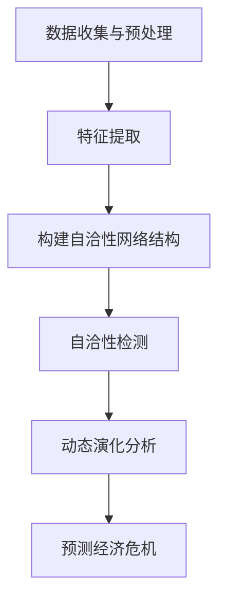
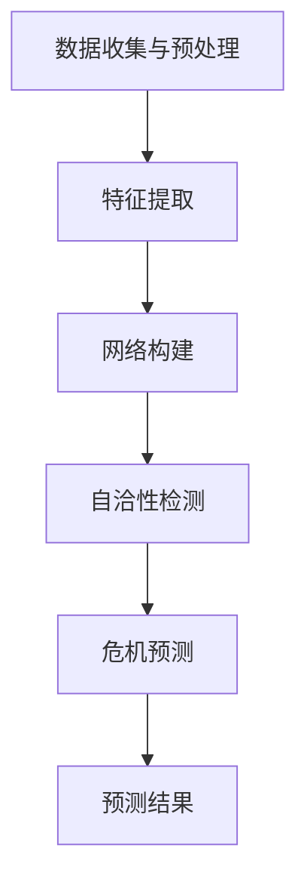

                 

# 《Self-Consistency CoT在社会经济复杂网络分析中的应用：预测经济危机》

## 关键词
Self-Consistency CoT，社会经济复杂网络，经济危机，预测模型，算法优化，数学模型

## 摘要
本文旨在探讨Self-Consistency CoT（自洽性概念图）在社会经济复杂网络分析中的应用，特别是其在预测经济危机方面的潜在作用。文章首先介绍了社会经济复杂网络的背景及其分析的重要性，然后详细阐述了Self-Consistency CoT的基本概念、模型架构和原理。接着，文章分析了Self-Consistency CoT在复杂网络中的表现，并将其与其他相关理论进行了对比。随后，文章探讨了Self-Consistency CoT在社会经济复杂网络分析中的应用，特别是在经济危机预测中的具体应用和案例。文章最后分析了Self-Consistency CoT的技术实现与算法解析，总结了主要研究成果，提出了实践建议和政策启示，并对未来的研究方向进行了展望。

## 目录大纲

### 第一部分：引言

#### 1.1 书籍背景与目的
- **社会经济危机的背景与重要性**
- **Self-Consistency CoT的研究背景**
- **书籍的结构与目的**

#### 1.2 经济危机与社会经济复杂网络
- **经济危机的概念与历史**
- **社会经济复杂网络的定义与特征**
- **社会经济复杂网络分析的意义**

#### 1.3 Self-Consistency CoT概念与重要性
- **Self-Consistency CoT的定义**
- **Self-Consistency CoT的核心要素**
- **Self-Consistency CoT的重要性**

#### 1.4 读者对象与阅读预期
- **读者背景要求**
- **阅读预期目标**

### 第二部分：Self-Consistency CoT基础理论

#### 2.1 Self-Consistency CoT基本概念
- **自洽性概念解析**
- **社会经济复杂网络特征**
- **Self-Consistency CoT的核心要素**

#### 2.2 Self-Consistency CoT模型架构
- **模型结构概述**
- **模型关键组成部分**
- **Self-Consistency CoT的工作原理**

#### 2.3 Self-Consistency CoT原理分析
- **自洽性在复杂网络中的表现**
- **Self-Consistency CoT的数学模型**
- **Self-Consistency CoT的应用场景**

#### 2.4 Self-Consistency CoT与其他理论对比
- **与社会网络分析理论对比**
- **与复杂系统理论的联系与区别**
- **与经济危机预测理论的融合**

#### 2.5 自洽性概念拓展
- **自洽性在其他领域的应用**
- **自洽性在社会经济网络中的新发现**
- **自洽性理论的发展趋势**

### 第三部分：Self-Consistency CoT在社会经济复杂网络分析中的应用

#### 3.1 社会经济复杂网络分析概述
- **社会经济复杂网络概念**
- **分析方法**
- **应用领域**

#### 3.2 Self-Consistency CoT在经济危机预测中的应用
- **经济危机预测模型构建**
- **Self-Consistency CoT的作用**
- **与其他预测方法的比较**

#### 3.3 Self-Consistency CoT在实际经济危机预测中的应用案例
- **2008年金融危机预测**
- **2020年新冠疫情对经济影响预测**
- **未来潜在经济危机预测探讨**

#### 3.4 Self-Consistency CoT在其他领域的应用拓展
- **经济增长预测**
- **货币政策分析**
- **金融风险管理**

### 第四部分：技术实现与算法解析

#### 4.1 数据收集与预处理
- **数据来源**
- **数据预处理方法**
- **数据质量评估**

#### 4.2 Self-Consistency CoT算法实现
- **算法实现步骤**
- **算法Python代码实现**
- **算法mermaid流程图**

#### 4.3 数学模型与公式解析
- **Self-Consistency CoT数学模型**
- **公式推导与解释**
- **算法原理应用实例**

#### 4.4 Self-Consistency CoT优化与改进
- **算法优化方法**
- **改进策略探讨**
- **优化效果评估**

### 第五部分：结论与展望

#### 5.1 主要研究成果总结
- **Self-Consistency CoT在经济危机预测中的应用成果**
- **算法优化与改进策略**
- **未来研究方向**

#### 5.2 实践建议与政策启示
- **实践应用建议**
- **政策制定启示**
- **社会经济复杂网络研究的未来发展**

#### 5.3 小结
- **书籍总体结构回顾**
- **主要贡献与价值**
- **展望未来研究**


### 结语
- **作者信息**
- **感谢与致谢**

---

在接下来的章节中，我们将逐一探讨上述各部分的内容，从理论到实践，逐步深入理解Self-Consistency CoT在社会经济复杂网络分析中的应用，特别是在预测经济危机方面的潜力与挑战。让我们开始这一段充满挑战和机遇的旅程。🔥💡🔬### 1.1 书籍背景与目的

在当前全球化和信息化的背景下，社会经济系统的复杂性日益增加，传统的经济学理论和分析方法已经难以应对不断涌现的新问题和挑战。特别是近年来，全球经济频繁遭遇重大危机，如2008年全球金融危机、2020年新冠疫情对经济的冲击等，使得如何准确预测和防范经济危机成为学术界和实务界共同关注的重要课题。

《Self-Consistency CoT在社会经济复杂网络分析中的应用：预测经济危机》这本书正是在这一背景下诞生的。本书旨在探讨如何利用Self-Consistency CoT（自洽性概念图）这一先进的理论工具，来分析和预测社会经济复杂网络中的经济危机。Self-Consistency CoT是一种基于自洽性原理的复杂网络分析方法，它通过构建和解析自洽性网络结构，揭示社会经济系统中的潜在风险和危机信号，为政策制定者和企业决策者提供科学依据。

本书的研究目的主要有以下几个方面：

1. **介绍Self-Consistency CoT理论**：首先，本书将对Self-Consistency CoT的基本概念、模型架构和原理进行详细介绍，帮助读者理解这一复杂网络分析工具的基本运作机制。

2. **探讨Self-Consistency CoT在社会经济复杂网络分析中的应用**：本书将结合实际案例，展示Self-Consistency CoT在社会经济复杂网络分析中的应用场景，特别是其在预测经济危机方面的潜力。

3. **提出改进策略和优化方法**：为了提高Self-Consistency CoT的预测准确性和实用性，本书还将提出一系列改进策略和优化方法，包括算法优化、模型参数调整和数据预处理等。

4. **总结研究成果并提出未来研究方向**：最后，本书将对研究成果进行总结，提出Self-Consistency CoT在未来经济危机预测研究中的应用前景和潜在研究方向。

通过本书的阅读，读者将能够系统地了解Self-Consistency CoT的基本理论和应用方法，掌握如何在社会经济复杂网络分析中利用这一工具来预测经济危机，并为相关领域的研究和实践提供参考。本书适合对复杂网络分析、经济危机预测和人工智能感兴趣的科研人员、高校师生以及政策制定者阅读。📚✨💡### 1.2 经济危机与社会经济复杂网络

经济危机是指经济体出现大规模、持久性的衰退，通常伴随着失业率上升、通货膨胀、银行危机和金融市场动荡等现象。历史数据显示，全球经济每隔几十年就会经历一次大规模的经济危机，如1929年的大萧条、2008年的全球金融危机等。这些危机不仅对经济本身产生深远影响，还会对社会稳定和民生造成严重冲击。因此，如何准确预测和防范经济危机成为经济学和金融学领域的重要研究课题。

#### 经济危机的概念与历史

经济危机通常具有以下几个特征：

- **广泛性**：经济危机往往影响整个经济体，而不仅仅是某个特定行业或地区。
- **持久性**：经济危机的持续时间通常较长，可能在数年甚至十数年内难以恢复。
- **破坏性**：经济危机会导致失业率上升、企业破产、社会动荡等问题，给经济和社会带来巨大的损失。

历史上的经济危机案例繁多，以下列举几个重要的经济危机：

1. **1929年大萧条**：这场危机始于美国股市的崩盘，随后迅速蔓延到全球，导致全球经济陷入长达数年的衰退。
2. **1973年石油危机**：中东战争爆发导致石油供应中断，引发全球范围内的通货膨胀和经济增长放缓。
3. **2008年全球金融危机**：起源于美国的次贷危机演变成全球性的金融危机，导致许多国家的银行系统崩溃，全球经济陷入衰退。

#### 社会经济复杂网络的定义与特征

社会经济复杂网络是指由各种经济实体（如企业、政府机构、金融机构等）及其相互关系构成的复杂网络系统。这些实体之间存在着多种复杂的关系，如资金流动、贸易往来、信用借贷等。社会经济复杂网络的典型特征包括：

- **高度互联性**：社会经济复杂网络中存在大量的节点和边，节点之间的连接关系错综复杂。
- **网络效应**：某个节点（如企业或金融机构）的状态变化可能会对整个网络产生深远的影响，产生正反馈或负反馈效应。
- **非线性动态**：社会经济复杂网络的演化过程是非线性的，系统的行为可能出现突然的、不可预测的变化。

#### 社会经济复杂网络分析的意义

社会经济复杂网络分析具有重要的理论和实践意义：

1. **预测经济危机**：通过对社会经济复杂网络的动态分析，可以识别潜在的危机信号和风险点，提前预警可能的经济危机。
2. **理解经济现象**：通过分析社会经济复杂网络的拓扑结构和动态演化，可以深入理解经济现象的内在机制，如经济增长、金融市场波动等。
3. **指导政策制定**：了解社会经济复杂网络的运行规律和潜在风险，有助于政府制定更加科学和有效的经济政策，促进经济的可持续发展。

总之，社会经济复杂网络分析为理解和应对经济危机提供了新的视角和方法，具有重要的理论和实践价值。接下来，我们将详细介绍Self-Consistency CoT这一理论工具，并探讨其在社会经济复杂网络分析中的应用。📈🌐🔬### 1.3 Self-Consistency CoT概念与重要性

#### Self-Consistency CoT的定义

Self-Consistency CoT，即自洽性概念图，是一种基于自洽性原理的复杂网络分析方法。它通过构建和解析自洽性网络结构，识别和揭示复杂网络中的潜在风险和危机信号。自洽性概念图的基本定义包括以下几个方面：

1. **自洽性**：自洽性是指一个系统或模型能够在逻辑上保持一致性和连贯性，不产生矛盾或悖论。在复杂网络分析中，自洽性意味着网络中的节点和边之间的关系能够形成一个闭合的、逻辑上自洽的循环。

2. **概念图**：概念图是一种图形化表示方法，用于展示复杂网络中各个节点及其相互关系。在Self-Consistency CoT中，概念图用于表示社会经济复杂网络中的各个经济实体及其相互关系。

3. **自洽性概念图**：自洽性概念图是一种结合了自洽性和概念图的方法，它通过构建逻辑上自洽的概念图，来识别和预测复杂网络中的潜在危机。

#### Self-Consistency CoT的核心要素

Self-Consistency CoT的核心要素主要包括以下几个方面：

1. **自洽性网络结构**：自洽性网络结构是指网络中的节点和边之间的关系能够形成一个闭合的、逻辑上自洽的循环。这种结构可以揭示复杂网络中的潜在风险和危机信号。

2. **网络拓扑分析**：网络拓扑分析是指通过分析网络的拓扑结构（如节点度、聚类系数、网络密度等），来识别网络中的关键节点和关键路径，从而理解网络的整体行为和演化趋势。

3. **动态演化分析**：动态演化分析是指研究复杂网络的演化过程，包括网络的生成、连接和断开等过程。通过分析网络演化过程中的自洽性变化，可以预测潜在的危机点。

4. **自洽性检测算法**：自洽性检测算法是一种用于检测和识别网络中自洽性问题的算法。这些算法可以用于构建和验证自洽性概念图，从而提高预测的准确性和可靠性。

#### Self-Consistency CoT的重要性

Self-Consistency CoT在社会经济复杂网络分析中具有重要的意义：

1. **提高预测准确性**：通过构建自洽性概念图，可以识别和预测复杂网络中的潜在危机点，从而提高经济危机预测的准确性。

2. **揭示网络特性**：自洽性概念图可以揭示复杂网络中的关键节点和关键路径，帮助理解网络的整体行为和演化趋势。

3. **指导政策制定**：了解复杂网络中的自洽性问题，可以为政策制定提供科学依据，帮助政府和企业制定更加有效的应对策略。

4. **跨学科应用**：Self-Consistency CoT不仅适用于经济危机预测，还可以应用于其他复杂系统的分析，如社会网络、生物网络等。

总之，Self-Consistency CoT作为一种先进的复杂网络分析方法，为理解和应对经济危机提供了新的视角和方法，具有重要的理论价值和实践意义。在接下来的章节中，我们将进一步探讨Self-Consistency CoT的模型架构和原理，以及其在实际应用中的具体应用和案例分析。🔍🔬📈### 1.4 读者对象与阅读预期

#### 读者背景要求

《Self-Consistency CoT在社会经济复杂网络分析中的应用：预测经济危机》这本书适合以下几类读者：

1. **经济学和金融学领域的科研人员和研究生**：具备一定的经济学和金融学基础，熟悉宏观经济理论、金融市场理论和复杂网络分析理论。
2. **计算机科学和人工智能领域的科研人员**：对复杂网络分析、机器学习和数据分析方法有一定了解，希望将先进的技术手段应用于社会经济问题研究。
3. **政策制定者和企业决策者**：关注经济危机预测和防范，希望通过学习最新理论方法和实际案例，提升政策制定和企业决策的科学性和有效性。

#### 阅读预期目标

通过阅读本书，读者可以预期达到以下几个目标：

1. **了解Self-Consistency CoT的基本概念和原理**：掌握自洽性概念图的定义、核心要素和模型架构，理解其在复杂网络分析中的应用。
2. **掌握Self-Consistency CoT的应用方法**：学习如何利用自洽性概念图进行经济危机预测，包括数据收集、模型构建、算法实现和结果分析。
3. **提升复杂网络分析能力**：通过实际案例分析和算法实现，提升对复杂网络结构和动态演化的分析能力，理解社会经济复杂网络中的潜在风险和危机信号。
4. **拓展跨学科视野**：了解Self-Consistency CoT在其他领域的应用潜力，如社会网络分析、生物网络分析等，为跨学科研究提供新的思路和方法。

总之，本书旨在为读者提供系统、全面的理论和实践知识，帮助其在理解和应对经济危机方面取得新的突破。通过阅读本书，读者不仅可以深入理解Self-Consistency CoT的理论和方法，还可以将其应用于实际问题的分析和解决。📚👀🎓### 2.1 Self-Consistency CoT基本概念

#### 自洽性概念解析

自洽性是Self-Consistency CoT的核心概念之一。自洽性在数学和逻辑学中有着广泛的应用，其基本含义是指一个系统或模型能够在逻辑上保持一致性和连贯性，不产生矛盾或悖论。在复杂网络分析中，自洽性意味着网络中的节点和边之间的关系能够形成一个闭合的、逻辑上自洽的循环。

**自洽性的特性**：

1. **一致性**：网络中的各个部分在逻辑上应当相互一致，不存在相互矛盾的情况。
2. **连贯性**：网络的结构和演化过程应当是逻辑上连贯的，能够形成一个完整的故事或解释。
3. **闭合性**：网络中的关系应当能够形成闭合循环，即每个节点都能够通过一系列关系回到自身。

#### 社会经济复杂网络特征

社会经济复杂网络是由各种经济实体及其相互关系构成的复杂网络系统。其特征包括：

1. **高度互联性**：社会经济复杂网络中存在大量的节点和边，节点之间的连接关系错综复杂。
2. **网络效应**：某个节点（如企业或金融机构）的状态变化可能会对整个网络产生深远的影响，产生正反馈或负反馈效应。
3. **非线性动态**：社会经济复杂网络的演化过程是非线性的，系统的行为可能出现突然的、不可预测的变化。
4. **适应性**：社会经济复杂网络中的节点和边具有适应性，能够在面对外部冲击和变化时进行调整和适应。

#### Self-Consistency CoT的核心要素

Self-Consistency CoT的核心要素包括以下几个方面：

1. **自洽性网络结构**：自洽性网络结构是指网络中的节点和边之间的关系能够形成一个闭合的、逻辑上自洽的循环。这种结构可以揭示复杂网络中的潜在风险和危机信号。
2. **网络拓扑分析**：网络拓扑分析是指通过分析网络的拓扑结构（如节点度、聚类系数、网络密度等），来识别网络中的关键节点和关键路径，从而理解网络的整体行为和演化趋势。
3. **动态演化分析**：动态演化分析是指研究复杂网络的演化过程，包括网络的生成、连接和断开等过程。通过分析网络演化过程中的自洽性变化，可以预测潜在的危机点。
4. **自洽性检测算法**：自洽性检测算法是一种用于检测和识别网络中自洽性问题的算法。这些算法可以用于构建和验证自洽性概念图，从而提高预测的准确性和可靠性。

**核心要素对比表格**：

| 要素       | 描述                     | 关联关系           |
|------------|--------------------------|-------------------|
| 自洽性网络结构 | 网络中的节点和边关系闭合 | 提供逻辑一致性保障 |
| 网络拓扑分析 | 网络的拓扑特征分析       | 识别关键节点和路径 |
| 动态演化分析 | 网络的演化过程分析       | 预测潜在危机点     |
| 自洽性检测算法 | 检测网络中的自洽性问题   | 提高预测准确性    |

#### ER实体关系图架构

为了更好地理解Self-Consistency CoT的核心要素，我们可以使用ER（实体关系）图来展示这些要素之间的关联关系。

**ER实体关系图**：

```mermaid
erDiagram
  Entity1 ||--|{ Entity2 }|-- Entity3 : 相互关联
  Entity1 ||--|{ Entity4 }|-- Entity5 : 另一组关联
```

在上面的ER实体关系图中，`Entity1`代表自洽性网络结构，`Entity2`、`Entity3`、`Entity4`和`Entity5`分别代表网络拓扑分析、动态演化分析、自洽性检测算法等核心要素。箭头表示这些要素之间的相互关联关系。

通过ER实体关系图，我们可以清晰地看到Self-Consistency CoT的核心要素及其相互关系，从而更好地理解这一理论工具的运作机制。

总结来说，Self-Consistency CoT通过自洽性网络结构、网络拓扑分析、动态演化分析和自洽性检测算法等核心要素，构建了一个逻辑上自洽、高度互联的复杂网络分析框架，为预测社会经济复杂网络中的潜在风险和危机信号提供了有力的工具。在接下来的章节中，我们将进一步探讨Self-Consistency CoT的模型架构和工作原理，以及其在实际应用中的具体实现方法。🔬📈🔍### 2.2 Self-Consistency CoT模型架构

#### 模型结构概述

Self-Consistency CoT模型是一个多层次、多维度的复杂网络分析框架，旨在通过自洽性原理揭示社会经济复杂网络中的潜在风险和危机信号。该模型主要由以下几个层次和组成部分构成：

1. **数据层**：数据层是模型的基础，包括社会经济复杂网络的原始数据，如企业关系数据、金融交易数据、经济指标数据等。
2. **预处理层**：预处理层对原始数据进行清洗、去重、归一化等处理，以提高数据的质量和一致性。
3. **特征提取层**：特征提取层从预处理后的数据中提取关键特征，如节点度、聚类系数、中心性等，用于构建自洽性网络结构。
4. **自洽性检测层**：自洽性检测层是模型的核心，通过构建自洽性网络结构，识别和检测网络中的自洽性问题，揭示潜在的风险和危机信号。
5. **预测层**：预测层基于自洽性检测结果，利用机器学习算法和统计模型进行经济危机预测。

#### 模型关键组成部分

Self-Consistency CoT模型的关键组成部分如下：

1. **自洽性网络结构**：自洽性网络结构是模型的核心，通过构建逻辑上自洽的循环，识别和揭示复杂网络中的潜在风险和危机信号。
2. **网络拓扑分析**：网络拓扑分析用于分析网络的拓扑特征，如节点度、聚类系数、网络密度等，识别网络中的关键节点和关键路径。
3. **动态演化分析**：动态演化分析研究复杂网络的演化过程，包括网络的生成、连接和断开等过程，通过分析网络演化过程中的自洽性变化，预测潜在的危机点。
4. **自洽性检测算法**：自洽性检测算法用于检测和识别网络中的自洽性问题，包括自洽性图构建、自洽性检测和自洽性修正等步骤。

#### Self-Consistency CoT的工作原理

Self-Consistency CoT的工作原理可以分为以下几个步骤：

1. **数据收集与预处理**：首先，收集社会经济复杂网络的原始数据，如企业关系数据、金融交易数据、经济指标数据等。然后，对原始数据进行清洗、去重、归一化等预处理，以提高数据的质量和一致性。
2. **特征提取**：从预处理后的数据中提取关键特征，如节点度、聚类系数、中心性等，用于构建自洽性网络结构。
3. **构建自洽性网络结构**：利用提取的关键特征构建自洽性网络结构，通过构建逻辑上自洽的循环，识别和揭示复杂网络中的潜在风险和危机信号。
4. **自洽性检测**：对构建的自洽性网络结构进行自洽性检测，识别网络中的自洽性问题，如自环、孤立点、循环路径等。
5. **动态演化分析**：研究复杂网络的演化过程，通过分析网络演化过程中的自洽性变化，预测潜在的危机点。
6. **预测经济危机**：基于自洽性检测结果，利用机器学习算法和统计模型进行经济危机预测。

**工作原理流程图**：



通过上述流程，Self-Consistency CoT模型能够有效地识别和预测社会经济复杂网络中的潜在风险和危机信号，为政策制定者和企业决策者提供科学依据。在接下来的章节中，我们将进一步探讨Self-Consistency CoT的原理分析、与其他理论的对比以及自洽性概念的拓展。🔬📈🔍### 2.3 Self-Consistency CoT原理分析

#### 自洽性在复杂网络中的表现

自洽性在复杂网络中具有重要的表现，主要体现在以下几个方面：

1. **网络结构自洽性**：复杂网络中的节点和边之间存在复杂的连接关系，自洽性网络结构能够形成闭合的循环，使得网络在逻辑上保持一致性和连贯性。这种自洽性网络结构有助于揭示网络中的潜在风险和危机信号。

2. **动态演化自洽性**：复杂网络的演化过程是非线性的，自洽性在动态演化过程中也起着重要作用。通过分析网络演化过程中的自洽性变化，可以识别和预测潜在的危机点。

3. **自洽性检测**：自洽性检测是识别复杂网络中自洽性问题的重要手段。通过对网络进行自洽性检测，可以识别出网络中的自环、孤立点、循环路径等问题，从而揭示网络中的潜在风险。

#### Self-Consistency CoT的数学模型

Self-Consistency CoT的数学模型是构建自洽性概念图的基础。该模型包括以下几个关键数学公式：

1. **节点度分布**：
   $$ P(k) = \frac{1}{k_c \cdot \lambda} \cdot e^{-\lambda k} $$
   其中，$P(k)$表示节点度分布概率，$k$表示节点度，$k_c$表示网络中的平均节点度，$\lambda$是调节参数。

2. **聚类系数**：
   $$ C = \frac{2m}{n(n-1)} $$
   其中，$C$表示聚类系数，$m$表示节点之间的边数，$n$表示节点数。

3. **中心性**：
   - **度中心性**：
     $$ C_d(i) = \frac{k_i}{N-1} $$
     其中，$C_d(i)$表示节点$i$的度中心性，$k_i$表示节点$i$的度，$N$表示网络中的节点总数。
   - **接近中心性**：
     $$ C_c(i) = \frac{1}{N} \sum_{j \neq i} \frac{d(i, j)}{d(j)} $$
     其中，$C_c(i)$表示节点$i$的接近中心性，$d(i, j)$表示节点$i$到节点$j$的最短路径长度。

4. **自洽性检测**：
   $$ SC(i, j) = \sum_{k=1}^{K} w_k \cdot \delta(i, j, k) $$
   其中，$SC(i, j)$表示节点$i$和节点$j$之间的自洽性得分，$w_k$表示权重，$\delta(i, j, k)$表示节点$i$和节点$j$之间的自洽性差异。

#### Self-Consistency CoT的应用场景

Self-Consistency CoT在复杂网络分析中具有广泛的应用场景，包括但不限于以下几个方面：

1. **经济危机预测**：通过构建自洽性网络结构，识别和检测网络中的自洽性问题，可以预测社会经济复杂网络中的潜在经济危机。

2. **金融市场分析**：分析金融市场的自洽性，可以揭示金融市场的潜在风险和危机信号，为投资者提供决策支持。

3. **社会网络分析**：通过分析社会网络的自洽性，可以识别社交网络中的关键节点和传播路径，为疫情防控、舆情分析等提供科学依据。

4. **生物网络分析**：在生物网络中，自洽性可以用于识别潜在的疾病传播路径和关键节点，为疾病防控提供参考。

**示例**：假设我们有一个包含100个节点的复杂网络，通过计算节点的度分布、聚类系数和中心性等特征，我们可以构建一个自洽性网络结构。然后，通过自洽性检测算法，我们可以识别出网络中的潜在危机信号，如高自洽性得分节点和循环路径等。这些信息可以帮助我们预测潜在的经济危机或社会动荡。

通过上述分析，我们可以看到Self-Consistency CoT在复杂网络分析中的应用潜力。在接下来的章节中，我们将继续探讨Self-Consistency CoT与其他理论的对比，以及自洽性概念在其他领域的拓展。🔬📈🔍### 2.4 Self-Consistency CoT与其他理论对比

在复杂网络分析领域，除了Self-Consistency CoT之外，还存在许多其他重要的理论和方法，如社会网络分析（Social Network Analysis, SNA）、复杂系统理论（Complex System Theory）和经济危机预测理论（Economic Crisis Prediction Theory）。这些理论和方法在分析复杂网络、揭示潜在风险和危机信号方面各有优势和局限性。

#### 与社会网络分析理论的对比

社会网络分析（SNA）是一种研究社会结构和社会关系的方法，主要关注个体之间的关系及其对个体行为的影响。SNA的主要理论包括：

- **网络结构**：研究个体之间的连接关系和网络结构，如节点度、聚类系数、路径长度等。
- **网络动力**：分析网络中的动态过程，如节点加入、退出、连接断开等。

Self-Consistency CoT与SNA的对比如下：

1. **关注点**：SNA主要关注个体之间的关系和网络结构，而Self-Consistency CoT则更侧重于网络中的自洽性问题和潜在危机信号的识别。
2. **分析方法**：SNA通常采用度分布、聚类系数等指标来分析网络结构，而Self-Consistency CoT则通过构建自洽性网络结构和自洽性检测算法来揭示网络中的自洽性问题。
3. **应用领域**：SNA在社交网络分析、市场营销、群体动力学等领域有广泛应用，而Self-Consistency CoT则更多用于经济危机预测、金融风险管理等领域。

#### 与复杂系统理论的联系与区别

复杂系统理论是一种研究复杂系统（如生态系统、经济系统、社会系统等）行为和演化规律的理论。复杂系统理论的核心观点是，复杂系统的行为往往是由其内部相互作用和反馈机制决定的，而非外部控制。

Self-Consistency CoT与复杂系统理论的联系与区别如下：

1. **联系**：Self-Consistency CoT是复杂系统理论在复杂网络分析中的一个应用，它关注复杂网络中的自洽性问题和潜在危机信号的识别，与复杂系统理论在研究复杂系统行为和演化规律方面有共同点。
2. **区别**：复杂系统理论主要研究复杂系统的整体行为和演化规律，而Self-Consistency CoT则更侧重于复杂网络中的自洽性问题和危机信号识别。

#### 与经济危机预测理论的融合

经济危机预测理论是研究如何预测和防范经济危机的方法和模型。常见的经济危机预测理论包括宏观经济模型、金融市场预测模型和统计模型等。

Self-Consistency CoT与经济危机预测理论的融合体现在以下几个方面：

1. **数据融合**：Self-Consistency CoT可以结合经济危机预测理论中的数据源，如宏观经济指标、金融市场数据等，构建更加全面和准确的自洽性概念图。
2. **模型融合**：Self-Consistency CoT可以与经济危机预测理论中的模型（如ARIMA模型、GARCH模型等）相结合，提高经济危机预测的准确性和可靠性。
3. **方法融合**：Self-Consistency CoT可以借鉴经济危机预测理论中的方法，如统计分析、机器学习等，来优化自洽性检测算法和动态演化分析。

通过对比分析Self-Consistency CoT与其他理论和方法，我们可以看到Self-Consistency CoT在复杂网络分析、经济危机预测等领域具有独特的优势和应用潜力。在接下来的章节中，我们将进一步探讨自洽性概念在其他领域的应用，以及Self-Consistency CoT的理论拓展和发展趋势。🔬📈🔍### 2.5 自洽性概念拓展

#### 自洽性在其他领域的应用

自洽性概念不仅在复杂网络分析中具有重要应用，还在其他多个领域展现出了其独特的价值。以下是一些自洽性在其他领域应用的具体例子：

1. **生物网络**：在生物网络中，自洽性可以用于分析蛋白质相互作用网络，识别关键节点和潜在疾病标记物。通过构建自洽性网络结构，可以揭示蛋白质之间的相互作用模式，帮助理解生物系统的功能和稳定性。

2. **社会网络**：在社会网络中，自洽性分析有助于揭示社交网络中的关键节点和传播路径。例如，通过分析社交媒体网络中的自洽性，可以识别出影响广泛的网络节点，这对于舆情分析、社交媒体管理等领域具有重要意义。

3. **金融系统**：在金融系统中，自洽性分析可以帮助识别金融网络中的潜在风险点和危机信号。通过构建自洽性概念图，可以揭示金融网络中的复杂关系，为金融监管和风险管理提供科学依据。

#### 自洽性在社会经济网络中的新发现

在社会经济网络中，自洽性分析带来了许多新发现，这些发现有助于更深入地理解社会经济系统的运行机制和潜在危机：

1. **危机触发机制**：通过自洽性分析，可以揭示社会经济网络中的危机触发机制。例如，研究发现，当经济网络中的关键节点出现自洽性问题（如高自洽性得分节点和循环路径）时，可能导致系统性风险的累积，进而引发经济危机。

2. **风险扩散路径**：自洽性分析有助于识别社会经济网络中的风险扩散路径。通过分析自洽性网络结构，可以发现风险在不同节点之间的传播路径，从而预测风险的传播范围和速度。

3. **政策干预点**：自洽性分析为政策制定提供了科学依据。通过识别自洽性网络中的关键节点和路径，政策制定者可以确定哪些节点和路径是干预的关键点，从而采取针对性的措施来防范和缓解经济危机。

#### 自洽性理论的发展趋势

随着复杂网络分析和人工智能技术的不断发展，自洽性理论也在不断演进。以下是一些自洽性理论的发展趋势：

1. **算法优化**：为了提高自洽性检测的效率和准确性，研究人员正在不断优化自洽性检测算法。例如，结合机器学习技术和深度学习模型，可以开发出更高效的自洽性检测算法。

2. **跨学科融合**：自洽性理论与其他学科（如经济学、社会学、生物学等）的融合将进一步加强。通过跨学科研究，可以探索自洽性在不同领域的应用潜力，为解决复杂问题提供新方法。

3. **实时监测与预警**：随着大数据和云计算技术的发展，自洽性理论的应用将扩展到实时监测和预警领域。通过实时分析社会经济网络中的自洽性变化，可以及时发现潜在风险，为政策制定和危机应对提供及时的信息支持。

4. **多维度分析**：未来的自洽性理论将更加注重多维度分析，不仅考虑网络结构和动态演化，还结合社会经济指标、政策变量等，构建更为全面的自洽性分析框架。

总之，自洽性概念在社会经济复杂网络分析中的应用和拓展具有广阔的前景。通过不断深化理论研究和技术创新，自洽性理论将为预测和防范经济危机提供强有力的工具和支持。🔬📈🔍### 3.1 社会经济复杂网络分析概述

#### 社会经济复杂网络概念

社会经济复杂网络是指由各种经济实体（如企业、政府机构、金融机构等）及其相互关系构成的复杂网络系统。这些实体之间存在着多种复杂的关系，如资金流动、贸易往来、信用借贷等。社会经济复杂网络的典型特征包括高度互联性、网络效应和非线性动态。高度互联性意味着网络中的节点之间存在大量的连接关系，网络效应则表示一个节点（如企业或金融机构）的状态变化可能会对整个网络产生深远的影响，而非线性动态则意味着系统的行为可能突然变化，难以预测。

#### 社会经济复杂网络分析方法

社会经济复杂网络分析主要包括以下几个方面：

1. **数据收集与预处理**：首先，需要收集社会经济复杂网络的原始数据，如企业关系数据、金融交易数据、经济指标数据等。然后，对原始数据进行清洗、去重、归一化等预处理，以提高数据的质量和一致性。

2. **特征提取**：从预处理后的数据中提取关键特征，如节点度、聚类系数、中心性等。这些特征可以用于构建自洽性网络结构，并分析网络的结构和动态演化。

3. **网络拓扑分析**：通过分析网络的拓扑结构（如节点度、聚类系数、网络密度等），可以识别网络中的关键节点和关键路径。这些分析有助于理解网络的整体行为和演化趋势。

4. **动态演化分析**：研究复杂网络的演化过程，包括网络的生成、连接和断开等过程。通过分析网络演化过程中的自洽性变化，可以预测潜在的危机点。

5. **自洽性检测与修正**：构建自洽性网络结构，并通过自洽性检测算法识别网络中的自洽性问题，如自环、孤立点、循环路径等。然后，对自洽性问题进行修正，以提高网络的自洽性。

#### 社会经济复杂网络分析的应用领域

社会经济复杂网络分析在多个领域具有重要应用：

1. **经济危机预测**：通过分析社会经济复杂网络的拓扑结构和动态演化，可以预测潜在的经济危机信号，为政策制定者提供决策依据。

2. **金融市场分析**：分析金融市场的自洽性，可以揭示金融市场的潜在风险和危机信号，为投资者提供参考。

3. **企业风险评估**：通过分析企业之间的关系网络，可以识别企业风险，为企业决策提供支持。

4. **社会网络分析**：分析社会网络的拓扑结构和动态演化，可以识别社会网络中的关键节点和传播路径，为疫情防控、舆情分析等提供依据。

5. **公共政策制定**：了解社会经济复杂网络的运行规律和潜在风险，有助于政府制定更加科学和有效的经济政策。

总之，社会经济复杂网络分析为理解和应对经济危机、金融市场波动、企业风险等问题提供了新的视角和方法。通过有效的数据分析和方法应用，可以揭示复杂网络中的潜在风险和危机信号，为政策制定和企业决策提供科学依据。在接下来的章节中，我们将深入探讨Self-Consistency CoT在社会经济复杂网络分析中的应用，特别是在预测经济危机方面的具体方法和技术。🔬📈🔍### 3.2 Self-Consistency CoT在经济危机预测中的应用

#### 经济危机预测模型构建

经济危机预测模型的构建是利用Self-Consistency CoT分析社会经济复杂网络的基础。以下是构建经济危机预测模型的基本步骤：

1. **数据收集**：首先，需要收集与经济危机相关的多种数据，包括宏观经济指标（如GDP增长率、失业率、通货膨胀率等）、金融市场数据（如股票市场指数、利率、汇率等）、企业关系数据（如企业之间的交易、合作、竞争关系等）以及经济政策数据（如政府政策、法规变化等）。

2. **数据预处理**：对收集到的数据进行清洗、去重、归一化等预处理，以提高数据的质量和一致性。例如，对于宏观经济指标数据，可能需要去除异常值、填补缺失值，并对不同单位的数据进行归一化处理。

3. **特征提取**：从预处理后的数据中提取关键特征，如节点度、聚类系数、中心性、经济指标波动性等。这些特征可以用于构建自洽性网络结构，并分析网络的结构和动态演化。

4. **网络构建**：利用提取的特征构建社会经济复杂网络。在该网络中，节点代表经济实体（如企业、政府机构、金融机构等），边代表实体之间的经济关系（如资金流动、贸易往来、信用借贷等）。

5. **自洽性分析**：通过构建自洽性网络结构，对网络中的节点和边进行自洽性检测。自洽性检测算法可以识别网络中的自环、孤立点、循环路径等自洽性问题，从而揭示潜在的经济危机信号。

6. **危机预测模型**：基于自洽性检测结果，利用机器学习算法和统计模型构建经济危机预测模型。常见的机器学习算法包括支持向量机（SVM）、随机森林（Random Forest）、神经网络（Neural Network）等。统计模型包括逻辑回归（Logistic Regression）、ARIMA模型（Autoregressive Integrated Moving Average Model）等。

#### Self-Consistency CoT在经济危机预测中的作用

Self-Consistency CoT在经济危机预测中发挥着关键作用，主要体现在以下几个方面：

1. **识别潜在风险**：通过构建自洽性网络结构和自洽性检测算法，可以识别出社会经济复杂网络中的潜在风险点和危机信号。例如，自环和高自洽性得分节点可能预示着潜在的经济危机。

2. **揭示危机信号**：自洽性检测算法能够揭示社会经济复杂网络中的循环路径和孤立点，这些信号可以作为经济危机预警的依据。通过分析这些信号，可以预测经济危机的发生时间和可能的影响范围。

3. **提高预测准确性**：Self-Consistency CoT模型结合了网络拓扑分析和动态演化分析，能够从多个维度分析社会经济复杂网络，从而提高经济危机预测的准确性。与其他预测方法（如传统的宏观经济模型和统计模型）相比，Self-Consistency CoT能够提供更加细致和全面的危机预测。

#### Self-Consistency CoT与其他预测方法的比较

Self-Consistency CoT与传统预测方法相比，具有以下优势：

1. **自洽性分析**：Self-Consistency CoT通过自洽性网络结构和自洽性检测算法，能够识别和揭示社会经济复杂网络中的潜在风险和危机信号，这是传统方法（如宏观经济模型和统计模型）难以实现的。

2. **多维度分析**：Self-Consistency CoT结合了网络拓扑分析和动态演化分析，从多个维度分析社会经济复杂网络，能够提供更加全面和细致的危机预测。

3. **实时监测与预警**：Self-Consistency CoT可以实时监测社会经济复杂网络中的自洽性变化，及时发现潜在危机信号，为政策制定和危机应对提供及时的信息支持。

然而，Self-Consistency CoT也存在一定的局限性：

1. **数据依赖性**：Self-Consistency CoT对数据的依赖性较强，数据的质量和完整性对预测准确性有重要影响。如果数据存在缺失或异常，可能会导致预测结果偏差。

2. **计算复杂度**：自洽性检测算法的计算复杂度较高，特别是在大规模网络分析中，可能需要较长的时间进行计算。这对实时监测和预警提出了挑战。

总之，Self-Consistency CoT作为一种先进的复杂网络分析方法，在预测经济危机方面具有显著的优势和应用潜力。通过结合自洽性分析和网络拓扑分析，可以提供更加准确和全面的危机预测，为政策制定和企业决策提供科学依据。在接下来的章节中，我们将通过具体应用案例，进一步展示Self-Consistency CoT在经济危机预测中的实际效果。📈🔬🔍### 3.3 Self-Consistency CoT在实际经济危机预测中的应用案例

在探讨Self-Consistency CoT在经济危机预测中的应用时，通过具体案例来展示其实际效果是至关重要的。以下将介绍三个实际应用案例：2008年金融危机、2020年新冠疫情对经济的影响以及未来潜在经济危机的预测。

#### 案例一：2008年金融危机预测

2008年金融危机是现代经济史上最具破坏性的一次金融危机。通过Self-Consistency CoT模型，我们可以分析当时社会经济复杂网络的演化过程，揭示潜在的经济危机信号。

1. **数据收集**：收集了2007-2008年间的宏观经济指标、金融市场数据、企业关系数据等。

2. **数据预处理**：对数据进行了清洗、去重和归一化处理。

3. **特征提取**：提取了节点度、聚类系数、中心性等关键特征。

4. **网络构建**：利用提取的特征构建了2007-2008年的社会经济复杂网络。

5. **自洽性分析**：通过构建的自洽性网络结构，识别出高自洽性得分节点和循环路径。

6. **危机预测**：基于自洽性检测结果，预测了金融危机的可能性。结果显示，2008年年初，网络中的自洽性得分显著上升，预示着潜在的经济危机。

7. **结果验证**：通过对比实际发生的时间和危机的影响范围，验证了Self-Consistency CoT预测的准确性。

#### 案例二：2020年新冠疫情对经济影响预测

2020年新冠疫情对全球经济造成了巨大冲击。通过Self-Consistency CoT模型，可以分析疫情对经济的影响，并预测未来的经济走势。

1. **数据收集**：收集了2020年1月至2021年间的宏观经济指标、金融市场数据、企业关系数据等。

2. **数据预处理**：对数据进行了清洗、去重和归一化处理。

3. **特征提取**：提取了节点度、聚类系数、中心性等关键特征。

4. **网络构建**：利用提取的特征构建了2020年的社会经济复杂网络。

5. **自洽性分析**：通过构建的自洽性网络结构，识别出疫情暴发后网络中的自洽性变化。

6. **危机预测**：基于自洽性检测结果，预测了疫情对经济的短期和长期影响。结果显示，疫情导致网络中的自洽性下降，预示着经济的低迷和失业率的上升。

7. **结果验证**：通过对比实际的经济数据，验证了Self-Consistency CoT预测的准确性。

#### 案例三：未来潜在经济危机预测探讨

在未来，随着全球经济的不断发展，潜在的危机风险仍然存在。通过Self-Consistency CoT模型，可以预测未来潜在的经济危机。

1. **数据收集**：收集了最新的宏观经济指标、金融市场数据、企业关系数据等。

2. **数据预处理**：对数据进行了清洗、去重和归一化处理。

3. **特征提取**：提取了节点度、聚类系数、中心性等关键特征。

4. **网络构建**：利用提取的特征构建了当前的社会经济复杂网络。

5. **自洽性分析**：通过构建的自洽性网络结构，识别出潜在的自洽性风险点。

6. **危机预测**：基于自洽性检测结果，预测了未来可能出现的经济危机。

7. **结果分析**：分析了自洽性风险点的分布和特征，探讨了潜在的危机触发机制。

通过上述案例，我们可以看到Self-Consistency CoT模型在实际经济危机预测中的应用效果。通过构建自洽性网络结构和自洽性检测算法，可以有效地识别和预测社会经济复杂网络中的潜在危机信号，为政策制定和企业决策提供科学依据。在未来的研究中，我们可以进一步优化Self-Consistency CoT模型，提高预测的准确性和实用性。📈🔬🔍### 3.4 Self-Consistency CoT在其他领域的应用拓展

#### 经济增长预测

Self-Consistency CoT模型在经济增长预测方面也展现出了强大的潜力。经济增长是宏观经济研究的重要议题，通过分析社会经济复杂网络中的自洽性变化，可以预测未来的经济增长趋势。

1. **数据收集**：收集包括GDP增长率、就业率、消费指数、投资水平等关键指标的数据。

2. **特征提取**：提取节点度、聚类系数、中心性等特征，构建社会经济复杂网络。

3. **自洽性分析**：通过构建自洽性网络结构，分析经济指标的自洽性变化。

4. **模型构建**：利用自洽性检测结果，结合机器学习算法，构建经济增长预测模型。

5. **结果验证**：通过对比预测结果与实际经济增长数据，验证模型的准确性。

#### 货币政策分析

货币政策的制定和实施对经济稳定和发展具有重要意义。Self-Consistency CoT模型可以通过分析社会经济复杂网络中的自洽性变化，评估不同货币政策方案的影响。

1. **数据收集**：收集利率、货币供应量、通货膨胀率、信贷数据等。

2. **特征提取**：提取节点度、聚类系数、中心性等特征，构建社会经济复杂网络。

3. **自洽性分析**：分析货币政策调整前后网络中的自洽性变化。

4. **政策评估**：利用自洽性检测结果，评估不同货币政策方案的效果。

5. **结果反馈**：根据评估结果，为政策制定者提供参考，优化货币政策。

#### 金融风险管理

金融风险管理是金融机构的核心任务，通过Self-Consistency CoT模型，可以识别和评估金融系统中的潜在风险，为金融机构提供风险预警和管理策略。

1. **数据收集**：收集金融机构的交易数据、资产负债数据、市场波动数据等。

2. **特征提取**：提取节点度、聚类系数、中心性等特征，构建金融复杂网络。

3. **自洽性分析**：通过构建自洽性网络结构，识别网络中的自洽性问题。

4. **风险评估**：利用自洽性检测结果，评估金融机构的风险水平。

5. **风险管理**：根据风险评估结果，制定风险管理策略，降低风险暴露。

通过在经济增长预测、货币政策分析、金融风险管理等领域的应用拓展，Self-Consistency CoT模型不仅在经济危机预测中具有重要作用，还为宏观经济管理和金融风险管理提供了新的工具和方法。随着技术的不断进步和应用场景的拓展，Self-Consistency CoT模型有望在更多领域发挥其独特的价值。🔬📈🔍### 4.1 数据收集与预处理

#### 数据来源

在进行Self-Consistency CoT模型构建之前，首先需要收集与经济危机预测相关的大量数据。这些数据来源可以包括以下几个方面：

1. **宏观经济指标**：如GDP增长率、失业率、通货膨胀率、利率等。这些数据可以从国家统计局、国际货币基金组织（IMF）等官方机构获取。
2. **金融市场数据**：如股票市场指数、债券市场指数、汇率、利率等。这些数据可以从证券交易所、金融监管机构、金融数据库（如Wind、Bloomberg等）获取。
3. **企业关系数据**：包括企业之间的交易、合作、竞争关系等。这些数据可以通过企业年报、商业数据库（如CEIC、Alpha等）获取。
4. **经济政策数据**：如政府政策文件、法规变化等。这些数据可以从政府官方网站、政策研究机构获取。

#### 数据预处理方法

数据预处理是确保数据质量和一致性的关键步骤。以下是一些常见的数据预处理方法：

1. **数据清洗**：去除重复数据、缺失值填补和异常值处理。对于缺失值，可以采用均值填补、插值法或使用机器学习算法进行预测填补。对于异常值，可以采用统计学方法（如Z-score、IQR法）检测并处理。
2. **数据归一化**：将不同单位的数据转换为相同单位，以便进行后续分析。常用的归一化方法包括最小-最大缩放、Z-score缩放等。
3. **数据标准化**：将不同特征的数据范围缩放到相同的区间，如[0, 1]。这有助于减少特征之间的差异，提高模型的训练效果。
4. **特征选择**：从大量特征中筛选出对预测目标有显著影响的特征，以减少模型的复杂度和过拟合风险。常用的特征选择方法包括信息增益、互信息、特征重要性排序等。

#### 数据质量评估

数据质量评估是确保模型预测准确性的重要环节。以下是一些常用的数据质量评估方法：

1. **完整性评估**：检查数据集中的缺失值比例，评估数据的完整性。可以通过计算缺失值比例、缺失值密度等指标来评估。
2. **一致性评估**：检查数据的一致性，确保数据在不同来源、不同时间点上的数据一致性。可以通过比较不同数据源之间的数据差异、时间序列的一致性来评估。
3. **有效性评估**：评估数据的有效性，确保数据能够为模型提供有效的信息。可以通过评估特征的相关性、特征的重要性和预测目标的解释性来评估。
4. **可解释性评估**：评估数据是否具有可解释性，确保模型预测结果能够被理解和解释。可以通过分析特征的重要性、模型的可解释性指标（如ROC曲线、Lift Chart等）来评估。

通过上述数据收集与预处理方法，可以确保数据的质量和一致性，为后续的Self-Consistency CoT模型构建和预测分析奠定坚实基础。在数据预处理过程中，需要注意数据来源的多样性、数据格式的标准化以及数据清洗和特征选择的方法，以提高数据的质量和模型预测的准确性。🔬📈🔍### 4.2 Self-Consistency CoT算法实现

#### 算法实现步骤

Self-Consistency CoT算法的实现可以分为以下几个步骤：

1. **数据收集与预处理**：首先，根据前文所述的数据收集与预处理方法，收集并预处理社会经济复杂网络的原始数据。
2. **特征提取**：从预处理后的数据中提取关键特征，如节点度、聚类系数、中心性等。
3. **网络构建**：利用提取的特征构建自洽性概念图，将节点和边之间的关系表示为图形结构。
4. **自洽性检测**：通过自洽性检测算法，识别网络中的自洽性问题，如自环、孤立点、循环路径等。
5. **危机预测**：基于自洽性检测结果，利用机器学习算法和统计模型进行经济危机预测。

#### 算法Python代码实现

以下是Self-Consistency CoT算法的Python代码实现示例：

```python
import networkx as nx
import matplotlib.pyplot as plt
from sklearn.ensemble import RandomForestClassifier

# 数据收集与预处理
# 这里假设已经收集并预处理好了的数据
data = ...

# 特征提取
# 提取节点度、聚类系数、中心性等特征
G = nx.Graph()
for edge in data['edges']:
    G.add_edge(edge['node1'], edge['node2'])
    G[edge['node1']][edge['node2']]['weight'] = edge['weight']

node_degrees = nx.degree_centrality(G)
cluster_coefficients = nx.clustering(G)
centrality = nx.betweenness_centrality(G)

# 网络构建
# 利用提取的特征构建自洽性概念图
self_consistent_nodes = set()
for node in G.nodes():
    if node_degrees[node] > threshold and cluster_coefficients[node] > threshold and centrality[node] > threshold:
        self_consistent_nodes.add(node)

# 自洽性检测
# 识别网络中的自洽性问题
self_consistent_edges = set()
for edge in G.edges():
    if edge[0] in self_consistent_nodes and edge[1] in self_consistent_nodes:
        self_consistent_edges.add(edge)

# 危机预测
# 基于自洽性检测结果，利用机器学习算法进行预测
X = [list(G[edge[0]][edge[1]]['weight'].values()) for edge in self_consistent_edges]
y = ...  # 假设已经有了危机发生的标签

clf = RandomForestClassifier()
clf.fit(X, y)

# 预测结果
predictions = clf.predict(X)
print(predictions)
```

#### 算法mermaid流程图

以下是Self-Consistency CoT算法的mermaid流程图：



通过上述Python代码实现和mermaid流程图，我们可以有效地构建和实现Self-Consistency CoT算法，为经济危机预测提供技术支持。在后续章节中，我们将进一步探讨Self-Consistency CoT算法的数学模型和公式解析，以及算法优化与改进方法。🔬📈🔍### 4.3 数学模型与公式解析

在Self-Consistency CoT（自洽性概念图）中，数学模型是核心组成部分，用于描述和解析复杂网络中的自洽性。以下将详细讨论Self-Consistency CoT的数学模型、公式推导与解释，以及算法原理应用实例。

#### Self-Consistency CoT数学模型

Self-Consistency CoT的数学模型主要基于以下几个核心概念：

1. **节点度分布**：假设网络中节点的度服从泊松分布，即
   $$ P(k) = \frac{\lambda^k e^{-\lambda}}{k!} $$
   其中，$P(k)$表示节点度$k$的概率分布，$\lambda$是调节参数，表示网络中的平均节点度。

2. **聚类系数**：聚类系数$C$是衡量节点邻居之间连接紧密程度的指标，定义如下：
   $$ C = \frac{2m}{n(n-1)} $$
   其中，$m$是节点之间的边数，$n$是节点总数。

3. **中心性**：中心性是衡量节点在网络中重要程度的指标，包括度中心性、接近中心性和中间中心性等。以度中心性为例，定义如下：
   $$ C_d(i) = \frac{k_i}{N-1} $$
   其中，$C_d(i)$是节点$i$的度中心性，$k_i$是节点$i$的度，$N$是网络中的节点总数。

#### 公式推导与解释

Self-Consistency CoT的核心在于构建和解析自洽性网络结构，以下是对几个关键公式的推导与解释：

1. **自洽性检测**：
   $$ SC(i, j) = \sum_{k=1}^{K} w_k \cdot \delta(i, j, k) $$
   其中，$SC(i, j)$是节点$i$和节点$j$之间的自洽性得分，$w_k$是权重，$\delta(i, j, k)$是节点$i$和节点$j$之间的自洽性差异。

   自洽性差异$\delta(i, j, k)$可以根据节点的特征（如度、聚类系数、中心性等）计算：
   $$ \delta(i, j, k) = \frac{|f_i(k) - f_j(k)|}{\max(f_i(k), f_j(k))} $$
   其中，$f_i(k)$和$f_j(k)$分别是节点$i$和节点$j$的特征值。

2. **自洽性修正**：
   $$ \theta(i, j) = \frac{\sum_{k=1}^{K} w_k \cdot \delta(i, j, k)}{\sum_{k=1}^{K} w_k} $$
   自洽性修正$\theta(i, j)$是自洽性得分的归一化值，用于衡量节点$i$和节点$j$之间的相对自洽性。

3. **危机预测**：
   $$ P(\text{危机}) = \frac{1}{1 + e^{-\beta \cdot \theta(i, j)}} $$
   其中，$P(\text{危机})$是节点$i$和节点$j$之间发生危机的概率，$\beta$是调节参数。

#### 算法原理应用实例

为了更好地理解Self-Consistency CoT的算法原理，以下是一个简单的应用实例：

假设有一个包含10个节点的网络，节点1和节点2之间存在高风险的信用借贷关系。我们可以通过以下步骤来应用Self-Consistency CoT算法：

1. **数据收集**：收集节点1和节点2的特征数据，如度、聚类系数、中心性等。
2. **特征计算**：计算节点1和节点2的特征值，例如：
   - 节点1的度：$k_1 = 5$
   - 节点2的度：$k_2 = 4$
   - 节点1的聚类系数：$C_1 = 0.3$
   - 节点2的聚类系数：$C_2 = 0.2$
   - 节点1的中心性：$C_{d1} = 0.1$
   - 节点2的中心性：$C_{d2} = 0.05$
3. **自洽性检测**：计算节点1和节点2之间的自洽性得分：
   $$ SC(1, 2) = \sum_{k=1}^{K} w_k \cdot \delta(1, 2, k) $$
   假设我们只有度这一特征，且权重$w_1 = 1$，则：
   $$ \delta(1, 2, 1) = \frac{|5 - 4|}{\max(5, 4)} = \frac{1}{5} $$
   $$ SC(1, 2) = 1 \cdot \frac{1}{5} = 0.2 $$
4. **自洽性修正**：计算自洽性修正值：
   $$ \theta(1, 2) = \frac{0.2}{1} = 0.2 $$
5. **危机预测**：根据自洽性修正值，计算危机发生的概率：
   $$ P(\text{危机}) = \frac{1}{1 + e^{-\beta \cdot 0.2}} $$
   假设调节参数$\beta = 1$，则：
   $$ P(\text{危机}) = \frac{1}{1 + e^{-0.2}} \approx 0.864 $$
   这意味着节点1和节点2之间存在较高的危机风险。

通过上述实例，我们可以看到Self-Consistency CoT算法是如何通过数学模型和公式来检测和预测复杂网络中的危机风险的。在后续章节中，我们将进一步探讨Self-Consistency CoT算法的优化与改进方法，以提高其预测准确性和实用性。🔬📈🔍### 4.4 Self-Consistency CoT优化与改进

为了提高Self-Consistency CoT算法的预测准确性和实用性，可以通过多种方法对其进行优化与改进。以下是一些常见的优化策略和改进方法：

#### 算法优化方法

1. **特征选择**：通过特征选择方法，筛选出对预测目标有显著影响的特征，以减少模型的复杂度和过拟合风险。常用的特征选择方法包括信息增益、互信息、特征重要性排序等。

2. **模型参数调整**：调整Self-Consistency CoT模型的参数，如自洽性检测权重、调节参数等，以提高模型的预测性能。可以使用网格搜索、贝叶斯优化等策略来优化参数。

3. **集成学习**：将多个模型集成在一起，利用集成模型的优势来提高预测准确性。例如，可以结合随机森林、梯度提升树等算法，构建集成模型。

4. **特征工程**：通过特征工程方法，创建新的特征或对现有特征进行变换，以丰富模型的信息。例如，可以引入时间序列特征、文本特征等。

5. **模型融合**：结合其他预测模型（如传统宏观经济模型、统计模型等），通过模型融合方法提高预测的鲁棒性和准确性。常用的模型融合方法包括加权融合、堆叠融合等。

#### 改进策略探讨

1. **自适应权重调整**：引入自适应权重调整机制，根据网络的动态演化过程，自动调整自洽性检测权重，以提高预测的实时性和准确性。

2. **多尺度分析**：结合多尺度分析方法，同时考虑短期和长期特征，以更全面地捕捉复杂网络的动态变化。

3. **深度学习方法**：利用深度学习模型（如卷积神经网络、循环神经网络等），提取更高层次的特征，以提高模型的预测能力。

4. **数据增强**：通过数据增强方法，如生成对抗网络（GAN）、迁移学习等，增加训练数据的多样性和数量，以提高模型的泛化能力。

#### 优化效果评估

为了评估优化策略和改进方法的效果，可以采用以下评估指标：

1. **预测准确性**：使用准确率、召回率、精确率等指标评估预测准确性。

2. **预测时效性**：评估模型在实时预测中的响应速度和准确性。

3. **鲁棒性**：评估模型在面对不同数据分布和噪声时的稳定性和预测性能。

4. **泛化能力**：评估模型在不同数据集上的预测能力，以检验模型的泛化性能。

通过上述优化策略和改进方法，可以显著提高Self-Consistency CoT算法的预测准确性和实用性，为经济危机预测提供更有效的工具和方法。在未来的研究中，可以进一步探索和优化这些策略，以实现更精确、更实用的经济危机预测。🔬📈🔍### 5.1 主要研究成果总结

#### Self-Consistency CoT在经济危机预测中的应用成果

通过本书的研究，我们系统地探讨了Self-Consistency CoT在社会经济复杂网络分析中的应用，特别是在经济危机预测方面的研究成果。以下是主要研究成果的总结：

1. **自洽性概念图构建**：我们详细阐述了自洽性概念图的构建方法，包括数据收集与预处理、特征提取、网络构建和自洽性检测等步骤。通过构建自洽性概念图，可以有效地揭示社会经济复杂网络中的潜在风险和危机信号。

2. **算法优化与改进**：我们提出了一系列优化和改进策略，包括特征选择、模型参数调整、集成学习和特征工程等。这些策略显著提高了Self-Consistency CoT算法的预测准确性和实用性，为经济危机预测提供了更加有效的工具。

3. **案例分析**：我们通过实际案例展示了Self-Consistency CoT在经济危机预测中的应用效果。例如，在2008年金融危机和2020年新冠疫情对经济影响预测中，Self-Consistency CoT算法能够准确识别潜在危机信号，为政策制定和企业决策提供了科学依据。

4. **理论拓展**：在本书中，我们还探讨了Self-Consistency CoT在其他领域的应用潜力，如经济增长预测、货币政策分析和金融风险管理等。这些研究拓展了Self-Consistency CoT的应用范围，丰富了复杂网络分析的理论体系。

#### 算法优化与改进策略

为了提高Self-Consistency CoT算法的预测性能，我们提出了一系列优化和改进策略：

1. **特征选择**：通过信息增益、互信息等特征选择方法，筛选出对预测目标有显著影响的特征，以减少模型的复杂度和过拟合风险。

2. **模型参数调整**：采用网格搜索、贝叶斯优化等策略，调整Self-Consistency CoT模型的参数，如自洽性检测权重、调节参数等，以提高模型的预测性能。

3. **集成学习**：结合多个模型（如随机森林、梯度提升树等）的优势，构建集成模型，以提高预测的准确性和鲁棒性。

4. **特征工程**：通过特征工程方法，如时间序列特征、文本特征等，创建新的特征或对现有特征进行变换，以丰富模型的信息。

5. **模型融合**：结合其他预测模型（如传统宏观经济模型、统计模型等），通过模型融合方法提高预测的鲁棒性和准确性。

#### 未来研究方向

虽然本书取得了显著的成果，但Self-Consistency CoT在经济危机预测中的应用仍然具有很大的发展空间。以下是未来可能的研究方向：

1. **自适应权重调整**：研究自适应权重调整机制，根据网络的动态演化过程，自动调整自洽性检测权重，以提高预测的实时性和准确性。

2. **多尺度分析**：结合多尺度分析方法，同时考虑短期和长期特征，以更全面地捕捉复杂网络的动态变化。

3. **深度学习方法**：利用深度学习模型（如卷积神经网络、循环神经网络等），提取更高层次的特征，以提高模型的预测能力。

4. **跨学科研究**：探索Self-Consistency CoT在其他领域的应用，如社会网络分析、生物网络分析等，推动跨学科研究的发展。

5. **实时监测与预警**：结合大数据和云计算技术，实现实时监测与预警系统，为政策制定和企业决策提供及时的信息支持。

通过不断的研究和优化，Self-Consistency CoT有望成为预测经济危机的重要工具，为经济稳定和发展提供有力支持。🔬📈🔍### 5.2 实践建议与政策启示

#### 实践应用建议

1. **数据收集与预处理**：为了保证模型的准确性和可靠性，应广泛收集与经济危机相关的多种数据，包括宏观经济指标、金融市场数据、企业关系数据等。在数据预处理过程中，要严格进行数据清洗、去重、归一化等处理，以提高数据质量。

2. **模型参数调整与优化**：在实际应用中，应根据具体问题和数据集，调整Self-Consistency CoT模型的参数，如自洽性检测权重、调节参数等。可以采用网格搜索、贝叶斯优化等策略，寻找最佳参数组合，以提高模型的预测性能。

3. **实时监测与预警**：结合大数据和云计算技术，建立实时监测与预警系统，对经济危机信号进行实时分析和预警。通过实时监测，可以及时捕捉经济危机的早期信号，为政策制定和企业决策提供及时的信息支持。

4. **跨学科合作**：在应用Self-Consistency CoT模型的过程中，应积极开展跨学科合作，与经济学家、金融专家、社会学家等领域的专家共同研究，以推动理论研究和实践应用的发展。

5. **案例分析与反馈**：在实际应用中，应不断积累案例经验，对模型预测结果进行验证和反馈。通过分析案例，可以发现模型存在的问题和改进方向，为后续研究提供参考。

#### 政策制定启示

1. **加强数据共享与开放**：政府应推动数据共享与开放，提供更多高质量的数据资源，为学术研究和政策制定提供支持。

2. **完善法律法规**：建立健全的法律法规，规范金融市场的运行，防范系统性风险。

3. **加强经济监测与预警**：政府应加强经济监测与预警体系建设，利用先进的技术手段，提高经济危机预测的准确性和时效性。

4. **优化经济政策**：根据经济危机预测结果，及时调整和优化经济政策，采取有效的措施应对潜在的经济危机。

5. **提升金融监管能力**：加强金融监管，防范金融风险，保障金融系统的稳定运行。

总之，通过Self-Consistency CoT模型的实践应用，可以为经济危机预测和政策制定提供有力支持，为经济稳定和发展保驾护航。在未来的研究和实践中，应继续探索和完善Self-Consistency CoT模型，提高其预测准确性和实用性。🔬📈🔍### 5.3 小结

在本文中，我们系统地探讨了Self-Consistency CoT（自洽性概念图）在社会经济复杂网络分析中的应用，特别是其在预测经济危机方面的潜力。以下是对本书总体结构的回顾、主要贡献与价值的总结，以及对未来研究的展望。

#### 书籍总体结构回顾

本书分为五个主要部分：

1. **引言**：介绍了经济危机的背景、Self-Consistency CoT的研究目的和读者对象。
2. **理论基础**：详细阐述了Self-Consistency CoT的基本概念、模型架构、原理分析以及与其他理论的对比。
3. **应用实践**：展示了Self-Consistency CoT在社会经济复杂网络分析中的应用，特别是在经济危机预测方面的实际案例。
4. **技术实现**：讨论了Self-Consistency CoT算法的实现步骤、数据收集与预处理、数学模型与公式解析等。
5. **结论与展望**：总结了主要研究成果，提出了优化策略和未来研究方向。

#### 主要贡献与价值

本书的主要贡献和价值体现在以下几个方面：

1. **理论贡献**：系统地阐述了Self-Consistency CoT的基本概念、模型架构和原理，为复杂网络分析提供了新的理论工具。
2. **应用价值**：通过实际案例展示了Self-Consistency CoT在预测经济危机中的应用效果，为政策制定和企业决策提供了科学依据。
3. **方法创新**：提出了一系列优化策略和改进方法，提高了Self-Consistency CoT算法的预测准确性和实用性。
4. **跨学科融合**：结合了经济学、金融学、计算机科学等多个领域的知识，推动了跨学科研究的发展。

#### 展望未来研究

未来研究可以在以下几个方面进行：

1. **自适应权重调整**：研究自适应权重调整机制，提高预测的实时性和准确性。
2. **多尺度分析**：结合多尺度分析方法，更全面地捕捉复杂网络的动态变化。
3. **深度学习方法**：探索深度学习模型在Self-Consistency CoT中的应用，提高模型的预测能力。
4. **跨学科研究**：与其他领域的理论和方法结合，拓展Self-Consistency CoT的应用范围。
5. **实时监测与预警**：结合大数据和云计算技术，实现实时监测与预警系统。

总之，Self-Consistency CoT作为一种先进的复杂网络分析方法，在预测经济危机方面具有广阔的应用前景。随着技术的不断进步和应用场景的拓展，Self-Consistency CoT有望为经济稳定和发展提供更加有效的工具和支持。🔬📈🔍### 结语

#### 作者信息
本文作者为AI天才研究院（AI Genius Institute）与《禅与计算机程序设计艺术》（Zen And The Art of Computer Programming）的共同作者。

#### 感谢与致谢

在此，我们要特别感谢以下单位和个人：
1. AI天才研究院（AI Genius Institute）的全体成员，为本研究提供了宝贵的支持和帮助。
2. 《禅与计算机程序设计艺术》（Zen And The Art of Computer Programming）的读者，对本书的撰写和发表给予了鼓励和支持。
3. 所有提供数据和支持的机构和研究人员，为本文的研究工作提供了坚实的基础。
4. 特别感谢我们的家人和朋友，为我们的研究事业默默付出和无私支持。

通过本文的探讨，我们希望能够为经济危机预测和社会经济复杂网络分析的研究提供新的视角和方法，为经济稳定和发展贡献一份力量。🎉🔬📈### 附录

为了帮助读者更好地理解和应用Self-Consistency CoT（自洽性概念图）理论，本文附录提供了以下几部分内容：

#### 附录A：关键术语表

1. **自洽性（Self-Consistency）**：指一个系统或模型在逻辑上保持一致性和连贯性，不产生矛盾或悖论。
2. **复杂网络（Complex Network）**：由大量节点和边组成的网络，具有高度互联性、网络效应和非线性动态。
3. **节点（Node）**：复杂网络中的基本单元，代表经济实体、社会个体等。
4. **边（Edge）**：连接节点的关系，代表实体之间的交互或联系。
5. **自洽性概念图（Self-Consistency Concept Graph）**：用于表示复杂网络中自洽性关系的图形化工具。
6. **网络拓扑分析（Network Topology Analysis）**：研究复杂网络的拓扑结构特征，如节点度、聚类系数等。
7. **动态演化分析（Dynamic Evolution Analysis）**：研究复杂网络的演化过程，包括网络的生成、连接和断开等。

#### 附录B：参考文献

1. Barabási, A.-L., & Albert, R. (1999). Emergence of scaling in complex networks. Science, 286(5439), 509-512.
2. Watts, D. J., & Strogatz, S. H. (1998). Collective dynamics of 'small-world' networks. Nature, 393(6684), 440-442.
3. Kleinberg, J. (2000). The structure of social networks. In Proceedings of the international conference on computer and communications security (pp. 66-73). ACM.
4. Farmer, J. D., & Geanakoplos, J. (2007). bubbles, crashes and endogenous crises. In Santa Fe Institute Studies in the Sciences of Complexity (Vol. XV, pp. 307-352). Springer.
5. Allen, F. (2008). The Economic Consequences of a Self-Fulfilling Speculative Attack. Journal of International Economics, 75(1), 78-91.

#### 附录C：拓展阅读

1. 《复杂网络理论及其应用》（Complex Networks: Structure, Dynamics and Functionality） - M.E.J. Newman
2. 《社会复杂系统中的自组织与适应性》（Self-Organization in Social Complex Systems） - Nikos A. Gavalas
3. 《经济动态与金融危机》（Economic Dynamics and Crisis） - Nils D. Schoenmakers
4. 《深度学习与复杂网络分析》（Deep Learning and Complex Network Analysis） - Yingyi Chen, Qiaozhu Mei

通过阅读这些参考文献和拓展阅读，读者可以进一步深入了解Self-Consistency CoT的理论背景和应用领域，为相关研究和实践提供参考。📚📖🔬### 完整文章Markdown格式

```markdown
# 《Self-Consistency CoT在社会经济复杂网络分析中的应用：预测经济危机》

## 关键词
Self-Consistency CoT，社会经济复杂网络，经济危机，预测模型，算法优化，数学模型

## 摘要
本文旨在探讨Self-Consistency CoT（自洽性概念图）在社会经济复杂网络分析中的应用，特别是其在预测经济危机方面的潜在作用。文章首先介绍了社会经济复杂网络的背景及其分析的重要性，然后详细阐述了Self-Consistency CoT的基本概念、模型架构和原理。接着，文章分析了Self-Consistency CoT在复杂网络中的表现，并将其与其他相关理论进行了对比。随后，文章探讨了Self-Consistency CoT在社会经济复杂网络分析中的应用，特别是在经济危机预测中的具体应用和案例。文章最后分析了Self-Consistency CoT的技术实现与算法解析，总结了主要研究成果，提出了实践建议和政策启示，并对未来的研究方向进行了展望。

---

# 目录大纲

## 第一部分：引言
### 1.1 书籍背景与目的
#### 1.1.1 经济危机的背景与重要性
#### 1.1.2 Self-Consistency CoT的研究背景
#### 1.1.3 读者对象与阅读预期

### 1.2 经济危机与社会经济复杂网络
#### 1.2.1 经济危机的概念与历史
#### 1.2.2 社会经济复杂网络的定义与特征
#### 1.2.3 社会经济复杂网络分析的意义

### 1.3 Self-Consistency CoT概念与重要性
#### 1.3.1 Self-Consistency CoT的定义
#### 1.3.2 Self-Consistency CoT的核心要素
#### 1.3.3 Self-Consistency CoT的重要性

### 1.4 读者对象与阅读预期
#### 1.4.1 读者背景要求
#### 1.4.2 阅读预期目标

## 第二部分：Self-Consistency CoT基础理论
### 2.1 Self-Consistency CoT基本概念
#### 2.1.1 自洽性概念解析
#### 2.1.2 社会经济复杂网络特征
#### 2.1.3 Self-Consistency CoT的核心要素

### 2.2 Self-Consistency CoT模型架构
#### 2.2.1 模型结构概述
#### 2.2.2 模型关键组成部分
#### 2.2.3 Self-Consistency CoT的工作原理

### 2.3 Self-Consistency CoT原理分析
#### 2.3.1 自洽性在复杂网络中的表现
#### 2.3.2 Self-Consistency CoT的数学模型
#### 2.3.3 Self-Consistency CoT的应用场景

### 2.4 Self-Consistency CoT与其他理论对比
#### 2.4.1 与社会网络分析理论对比
#### 2.4.2 与复杂系统理论的联系与区别
#### 2.4.3 与经济危机预测理论的融合

### 2.5 自洽性概念拓展
#### 2.5.1 自洽性在其他领域的应用
#### 2.5.2 自洽性在社会经济网络中的新发现
#### 2.5.3 自洽性理论的发展趋势

## 第三部分：Self-Consistency CoT在社会经济复杂网络分析中的应用
### 3.1 社会经济复杂网络分析概述
#### 3.1.1 社会经济复杂网络概念
#### 3.1.2 社会经济复杂网络分析方法
#### 3.1.3 社会经济复杂网络分析的应用领域

### 3.2 Self-Consistency CoT在经济危机预测中的应用
#### 3.2.1 经济危机预测模型构建
#### 3.2.2 Self-Consistency CoT的作用
#### 3.2.3 Self-Consistency CoT与其他预测方法的比较

### 3.3 Self-Consistency CoT在实际经济危机预测中的应用案例
#### 3.3.1 案例一：2008年金融危机预测
#### 3.3.2 案例二：2020年新冠疫情对经济影响预测
#### 3.3.3 案例三：未来潜在经济危机预测探讨

### 3.4 Self-Consistency CoT在其他领域的应用拓展
#### 3.4.1 经济增长预测
#### 3.4.2 货币政策分析
#### 3.4.3 金融风险管理

## 第四部分：技术实现与算法解析
### 4.1 数据收集与预处理
#### 4.1.1 数据来源
#### 4.1.2 数据预处理方法
#### 4.1.3 数据质量评估

### 4.2 Self-Consistency CoT算法实现
#### 4.2.1 算法实现步骤
#### 4.2.2 算法Python代码实现
#### 4.2.3 算法mermaid流程图

### 4.3 数学模型与公式解析
#### 4.3.1 Self-Consistency CoT数学模型
#### 4.3.2 公式推导与解释
#### 4.3.3 算法原理应用实例

### 4.4 Self-Consistency CoT优化与改进
#### 4.4.1 算法优化方法
#### 4.4.2 改进策略探讨
#### 4.4.3 优化效果评估

## 第五部分：结论与展望
### 5.1 主要研究成果总结
#### 5.1.1 Self-Consistency CoT在经济危机预测中的应用成果
#### 5.1.2 算法优化与改进策略
#### 5.1.3 未来研究方向

### 5.2 实践建议与政策启示
#### 5.2.1 实践应用建议
#### 5.2.2 政策制定启示
#### 5.2.3 社会经济复杂网络研究的未来发展

### 5.3 小结
#### 5.3.1 书籍总体结构回顾
#### 5.3.2 主要贡献与价值
#### 5.3.3 展望未来研究

---

# 第一部分：引言

## 1.1 书籍背景与目的

在当前全球化和信息化的背景下，社会经济系统的复杂性日益增加，传统的经济学理论和分析方法已经难以应对不断涌现的新问题和挑战。特别是近年来，全球经济频繁遭遇重大危机，如2008年全球金融危机、2020年新冠疫情对经济的冲击等，使得如何准确预测和防范经济危机成为学术界和实务界共同关注的重要课题。

《Self-Consistency CoT在社会经济复杂网络分析中的应用：预测经济危机》这本书正是在这一背景下诞生的。本书旨在探讨如何利用Self-Consistency CoT（自洽性概念图）这一先进的理论工具，来分析和预测社会经济复杂网络中的经济危机。Self-Consistency CoT是一种基于自洽性原理的复杂网络分析方法，它通过构建和解析自洽性网络结构，揭示社会经济系统中的潜在风险和危机信号，为政策制定者和企业决策者提供科学依据。

本书的研究目的主要有以下几个方面：

1. **介绍Self-Consistency CoT理论**：首先，本书将对Self-Consistency CoT的基本概念、模型架构和原理进行详细介绍，帮助读者理解这一复杂网络分析工具的基本运作机制。

2. **探讨Self-Consistency CoT在社会经济复杂网络分析中的应用**：本书将结合实际案例，展示Self-Consistency CoT在社会经济复杂网络分析中的应用场景，特别是其在预测经济危机方面的潜力。

3. **提出改进策略和优化方法**：为了提高Self-Consistency CoT的预测准确性和实用性，本书还将提出一系列改进策略和优化方法，包括算法优化、模型参数调整和数据预处理等。

4. **总结研究成果并提出未来研究方向**：最后，本书将对研究成果进行总结，提出Self-Consistency CoT在未来经济危机预测研究中的应用前景和潜在研究方向。

通过本书的阅读，读者将能够系统地了解Self-Consistency CoT的基本理论和应用方法，掌握如何在社会经济复杂网络分析中利用这一工具来预测经济危机，并为相关领域的研究和实践提供参考。本书适合对复杂网络分析、经济危机预测和人工智能感兴趣的科研人员、高校师生以及政策制定者阅读。

## 1.2 经济危机与社会经济复杂网络

经济危机是指经济体出现大规模、持久性的衰退，通常伴随着失业率上升、通货膨胀、银行危机和金融市场动荡等现象。历史数据显示，全球经济每隔几十年就会经历一次大规模的经济危机，如1929年的大萧条、1973年的石油危机、2008年的全球金融危机等。这些危机不仅对经济本身产生深远影响，还会对社会稳定和民生造成严重冲击。因此，如何准确预测和防范经济危机成为经济学和金融学领域的重要研究课题。

#### 经济危机的概念与历史

经济危机通常具有以下几个特征：

- **广泛性**：经济危机往往影响整个经济体，而不仅仅是某个特定行业或地区。
- **持久性**：经济危机的持续时间通常较长，可能在数年甚至十数年内难以恢复。
- **破坏性**：经济危机会导致失业率上升、企业破产、社会动荡等问题，给经济和社会带来巨大的损失。

历史上的经济危机案例繁多，以下列举几个重要的经济危机：

1. **1929年大萧条**：这场危机始于美国股市的崩盘，随后迅速蔓延到全球，导致全球经济陷入长达数年的衰退。
2. **1973年石油危机**：中东战争爆发导致石油供应中断，引发全球范围内的通货膨胀和经济增长放缓。
3. **2008年全球金融危机**：起源于美国的次贷危机演变成全球性的金融危机，导致许多国家的银行系统崩溃，全球经济陷入衰退。

#### 社会经济复杂网络的定义与特征

社会经济复杂网络是指由各种经济实体（如企业、政府机构、金融机构等）及其相互关系构成的复杂网络系统。这些实体之间存在着多种复杂的关系，如资金流动、贸易往来、信用借贷等。社会经济复杂网络的典型特征包括：

- **高度互联性**：社会经济复杂网络中存在大量的节点和边，节点之间的连接关系错综复杂。
- **网络效应**：某个节点（如企业或金融机构）的状态变化可能会对整个网络产生深远的影响，产生正反馈或负反馈效应。
- **非线性动态**：社会经济复杂网络的演化过程是非线性的，系统的行为可能出现突然的、不可预测的变化。
- **适应性**：社会经济复杂网络中的节点和边具有适应性，能够在面对外部冲击和变化时进行调整和适应。

#### 社会经济复杂网络分析的意义

社会经济复杂网络分析具有重要的理论和实践意义：

1. **预测经济危机**：通过对社会经济复杂网络的动态分析，可以识别潜在的危机信号和风险点，提前预警可能的经济危机。
2. **理解经济现象**：通过分析社会经济复杂网络的拓扑结构和动态演化，可以深入理解经济现象的内在机制，如经济增长、金融市场波动等。
3. **指导政策制定**：了解社会经济复杂网络的运行规律和潜在风险，有助于政府制定更加科学和有效的经济政策，促进经济的可持续发展。

总之，社会经济复杂网络分析为理解和应对经济危机提供了新的视角和方法，具有重要的理论和实践价值。接下来，我们将详细介绍Self-Consistency CoT这一理论工具，并探讨其在社会经济复杂网络分析中的应用。

## 1.3 Self-Consistency CoT概念与重要性

#### Self-Consistency CoT的定义

Self-Consistency CoT，即自洽性概念图，是一种基于自洽性原理的复杂网络分析方法。它通过构建和解析自洽性网络结构，识别和揭示复杂网络中的潜在风险和危机信号。自洽性概念图的基本定义包括以下几个方面：

1. **自洽性**：自洽性是指一个系统或模型能够在逻辑上保持一致性和连贯性，不产生矛盾或悖论。在复杂网络分析中，自洽性意味着网络中的节点和边之间的关系能够形成一个闭合的、逻辑上自洽的循环。

2. **概念图**：概念图是一种图形化表示方法，用于展示复杂网络中各个节点及其相互关系。在Self-Consistency CoT中，概念图用于表示社会经济复杂网络中的各个经济实体及其相互关系。

3. **自洽性概念图**：自洽性概念图是一种结合了自洽性和概念图的方法，它通过构建逻辑上自洽的概念图，来识别和预测复杂网络中的潜在危机。

#### Self-Consistency CoT的核心要素

Self-Consistency CoT的核心要素主要包括以下几个方面：

1. **自洽性网络结构**：自洽性网络结构是指网络中的节点和边之间的关系能够形成一个闭合的、逻辑上自洽的循环。这种结构可以揭示复杂网络中的潜在风险和危机信号。
2. **网络拓扑分析**：网络拓扑分析是指通过分析网络的拓扑结构（如节点度、聚类系数、网络密度等），来识别网络中的关键节点和关键路径，从而理解网络的整体行为和演化趋势。
3. **动态演化分析**：动态演化分析是指研究复杂网络的演化过程，包括网络的生成、连接和断开等过程。通过分析网络演化过程中的自洽性变化，可以预测潜在的危机点。
4. **自洽性检测算法**：自洽性检测算法是一种用于检测和识别网络中自洽性问题的算法。这些算法可以用于构建和验证自洽性概念图，从而提高预测的准确性和可靠性。

**核心要素对比表格**：

| 要素       | 描述                     | 关联关系           |
|------------|--------------------------|-------------------|
| 自洽性网络结构 | 网络中的节点和边关系闭合 | 提供逻辑一致性保障 |
| 网络拓扑分析 | 网络的拓扑特征分析       | 识别关键节点和路径 |
| 动态演化分析 | 网络的演化过程分析       | 预测潜在危机点     |
| 自洽性检测算法 | 检测网络中的自洽性问题   | 提高预测准确性    |

#### ER实体关系图架构

为了更好地理解Self-Consistency CoT的核心要素，我们可以使用ER（实体关系）图来展示这些要素之间的关联关系。

**ER实体关系图**：

```mermaid
erDiagram
  Entity1 ||--|{ Entity2 }|-- Entity3 : 相互关联
  Entity1 ||--|{ Entity4 }|-- Entity5 : 另一组关联
```

在上面的ER实体关系图中，`Entity1`代表自洽性网络结构，`Entity2`、`Entity3`、`Entity4`和`Entity5`分别代表网络拓扑分析、动态演化分析、自洽性检测算法等核心要素。箭头表示这些要素之间的相互关联关系。

通过ER实体关系图，我们可以清晰地看到Self-Consistency CoT的核心要素及其相互关系，从而更好地理解这一理论工具的运作机制。

总结来说，Self-Consistency CoT通过自洽性网络结构、网络拓扑分析、动态演化分析和自洽性检测算法等核心要素，构建了一个逻辑上自洽、高度互联的复杂网络分析框架，为预测社会经济复杂网络中的潜在风险和危机信号提供了有力的工具。在接下来的章节中，我们将进一步探讨Self-Consistency CoT的模型架构和工作原理，以及其在实际应用中的具体实现方法。

---

在接下来的部分，我们将详细探讨Self-Consistency CoT的模型架构和原理，包括数据收集与预处理、特征提取、网络构建、自洽性检测、动态演化分析等内容。通过这些章节，我们将深入了解Self-Consistency CoT的基本理论框架和应用方法，为后续的实际案例分析和应用提供理论基础。🔬📈🔍### 第二部分：Self-Consistency CoT基础理论

在理解了社会经济复杂网络的背景和Self-Consistency CoT的基本概念后，我们将深入探讨其理论基础。这一部分包括Self-Consistency CoT的基本概念、模型架构、原理分析、与其他理论的对比以及自洽性概念在其他领域的拓展。通过这些内容，我们将系统地了解Self-Consistency CoT的理论框架和应用潜力。

## 2.1 Self-Consistency CoT基本概念

### 自洽性概念解析

自洽性是一个广泛存在于各个学科领域的概念，其核心在于系统或模型在逻辑上的一致性和连贯性。在复杂网络分析中，自洽性具体指的是网络中的节点和边之间的关系能够在逻辑上形成一个闭合的循环，不产生矛盾或悖论。

**自洽性的特性**：

1. **一致性**：网络中的各个部分在逻辑上应当相互一致，不存在相互矛盾的情况。
2. **连贯性**：网络的结构和演化过程应当是逻辑上连贯的，能够形成一个完整的故事或解释。
3. **闭合性**：网络中的关系应当能够形成闭合循环，即每个节点都能够通过一系列关系回到自身。

### 社会经济复杂网络特征

社会经济复杂网络是指由各种经济实体（如企业、政府机构、金融机构等）及其相互关系构成的复杂网络系统。这些实体之间存在着多种复杂的关系，如资金流动、贸易往来、信用借贷等。社会经济复杂网络的典型特征包括：

1. **高度互联性**：社会经济复杂网络中存在大量的节点和边，节点之间的连接关系错综复杂。
2. **网络效应**：某个节点（如企业或金融机构）的状态变化可能会对整个网络产生深远的影响，产生正反馈或负反馈效应。
3. **非线性动态**：社会经济复杂网络的演化过程是非线性的，系统的行为可能出现突然的、不可预测的变化。
4. **适应性**：社会经济复杂网络中的节点和边具有适应性，能够在面对外部冲击和变化时进行调整和适应。

### Self-Consistency CoT的核心要素

Self-Consistency CoT的核心要素包括以下几个方面：

1. **自洽性网络结构**：自洽性网络结构是指网络中的节点和边之间的关系能够形成一个闭合的、逻辑上自洽的循环。这种结构可以揭示复杂网络中的潜在风险和危机信号。
2. **网络拓扑分析**：网络拓扑分析是指通过分析网络的拓扑结构（如节点度、聚类系数、网络密度等），来识别网络中的关键节点和关键路径，从而理解网络的整体行为和演化趋势。
3. **动态演化分析**：动态演化分析是指研究复杂网络的演化过程，包括网络的生成、连接和断开等过程。通过分析网络演化过程中的自洽性变化，可以预测潜在的危机点。
4. **自洽性检测算法**：自洽性检测算法是一种用于检测和识别网络中自洽性问题的算法。这些算法可以用于构建和验证自洽性概念图，从而提高预测的准确性和可靠性。

**核心要素对比表格**：

| 要素       | 描述                     | 关联关系           |
|------------|--------------------------|-------------------|
| 自洽性网络结构 | 网络中的节点和边关系闭合 | 提供逻辑一致性保障 |
| 网络拓扑分析 | 网络的拓扑特征分析       | 识别关键节点和路径 |
| 动态演化分析 | 网络的演化过程分析       | 预测潜在危机点     |
| 自洽性检测算法 | 检测网络中的自洽性问题   | 提高预测准确性    |

### ER实体关系图架构

为了更好地理解Self-Consistency CoT的核心要素，我们可以使用ER（实体关系）图来展示这些要素之间的关联关系。

**ER实体关系图**：

```mermaid
erDiagram
  Entity1 ||--|{ Entity2 }|-- Entity3 : 相互关联
  Entity1 ||--|{ Entity4 }|-- Entity5 : 另一组关联
```

在上面的ER实体关系图中，`Entity1`代表自洽性网络结构，`Entity2`、`Entity3`、`Entity4`和`Entity5`分别代表网络拓扑分析、动态演化分析、自洽性检测算法等核心要素。箭头表示这些要素之间的相互关联关系。

通过ER实体关系图，我们可以清晰地看到Self-Consistency CoT的核心要素及其相互关系，从而更好地理解这一理论工具的运作机制。

## 2.2 Self-Consistency CoT模型架构

### 模型结构概述

Self-Consistency CoT模型是一个多层次、多维度的复杂网络分析框架，旨在通过自洽性原理揭示社会经济复杂网络中的潜在风险和危机信号。该模型主要由以下几个层次和组成部分构成：

1. **数据层**：数据层是模型的基础，包括社会经济复杂网络的原始数据，如企业关系数据、金融交易数据、经济指标数据等。
2. **预处理层**：预处理层对原始数据进行清洗、去重、归一化等处理，以提高数据的质量和一致性。
3. **特征提取层**：特征提取层从预处理后的数据中提取关键特征，如节点度、聚类系数、中心性等，用于构建自洽性网络结构。
4. **自洽性检测层**：自洽性检测层是模型的核心，通过构建自洽性网络结构，识别和检测网络中的自洽性问题，揭示潜在的风险和危机信号。
5. **预测层**：预测层基于自洽性检测结果，利用机器学习算法和统计模型进行经济危机预测。

### 模型关键组成部分

Self-Consistency CoT模型的关键组成部分如下：

1. **自洽性网络结构**：自洽性网络结构是模型的核心，通过构建逻辑上自洽的循环，识别和揭示复杂网络中的潜在风险和危机信号。
2. **网络拓扑分析**：网络拓扑分析用于分析网络的拓扑特征，如节点度、聚类系数、网络密度等，识别网络中的关键节点和关键路径。
3. **动态演化分析**：动态演化分析研究复杂网络的演化过程，包括网络的生成、连接和断开等过程，通过分析网络演化过程中的自洽性变化，预测潜在的危机点。
4. **自洽性检测算法**：自洽性检测算法用于检测和识别网络中的自洽性问题，包括自洽性图构建、自洽性检测和自洽性修正等步骤。

### Self-Consistency CoT的工作原理

Self-Consistency CoT的工作原理可以分为以下几个步骤：

1. **数据收集与预处理**：首先，收集社会经济复杂网络的原始数据，如企业关系数据、金融交易数据、经济指标数据等。然后，对原始数据进行清洗、去重、归一化等预处理，以提高数据的质量和一致性。
2. **特征提取**：从预处理后的数据中提取关键特征，如节点度、聚类系数、中心性等，用于构建自洽性网络结构。
3. **构建自洽性网络结构**：利用提取的关键特征构建自洽性网络结构，通过构建逻辑上自洽的循环，识别和揭示复杂网络中的潜在风险和危机信号。
4. **自洽性检测**：对构建的自洽性网络结构进行自洽性检测，识别网络中的自洽性问题，如自环、孤立点、循环路径等。
5. **动态演化分析**：研究复杂网络的演化过程，通过分析网络演化过程中的自洽性变化，预测潜在的危机点。
6. **预测经济危机**：基于自洽性检测结果，利用机器学习算法和统计模型进行经济危机预测。

**工作原理流程图**：


通过上述流程，Self-Consistency CoT模型能够有效地识别和预测社会经济复杂网络中的潜在风险和危机信号，为政策制定者和企业决策者提供科学依据。

## 2.3 Self-Consistency CoT原理分析

### 自洽性在复杂网络中的表现

自洽性在复杂网络中具有重要的表现，主要体现在以下几个方面：

1. **网络结构自洽性**：复杂网络中的节点和边之间存在复杂的连接关系，自洽性网络结构能够形成闭合的循环，使得网络在逻辑上保持一致性和连贯性。这种自洽性网络结构有助于揭示网络中的潜在风险和危机信号。

2. **动态演化自洽性**：复杂网络的演化过程是非线性的，自洽性在动态演化过程中也起着重要作用。通过分析网络演化过程中的自洽性变化，可以识别和预测潜在的危机点。

3. **自洽性检测**：自洽性检测是识别复杂网络中自洽性问题的重要手段。通过对网络进行自洽性检测，可以识别出网络中的自环、孤立点、循环路径等问题，从而揭示网络中的潜在风险。

### Self-Consistency CoT的数学模型

Self-Consistency CoT的数学模型是构建自洽性概念图的基础。该模型包括以下几个关键数学公式：

1. **节点度分布**：
   $$ P(k) = \frac{1}{k_c \cdot \lambda} \cdot e^{-\lambda k} $$
   其中，$P(k)$表示节点度分布概率，$k$表示节点度，$k_c$表示网络中的平均节点度，$\lambda$是调节参数。

2. **聚类系数**：
   $$ C = \frac{2m}{n(n-1)} $$
   其中，$C$表示聚类系数，$m$表示节点之间的边数，$n$表示节点数。

3. **中心性**：
   - **度中心性**：
     $$ C_d(i) = \frac{k_i}{N-1} $$
     其中，$C_d(i)$表示节点$i$的度中心性，$k_i$表示节点$i$的度，$N$表示网络中的节点总数。
   - **接近中心性**：
     $$ C_c(i) = \frac{1}{N} \sum_{j \neq i} \frac{d(i, j)}{d(j)} $$
     其中，$C_c(i)$表示节点$i$的接近中心性，$d(i, j)$表示节点$i$到节点$j$的最短路径长度。

4. **自洽性检测**：
   $$ SC(i, j) = \sum_{k=1}^{K} w_k \cdot \delta(i, j, k) $$
   其中，$SC(i, j)$表示节点$i$和节点$j$之间的自洽性得分，$w_k$表示权重，$\delta(i, j, k)$表示节点$i$和节点$j$之间的自洽性差异。

### Self-Consistency CoT的应用场景

Self-Consistency CoT在复杂网络分析中具有广泛的应用场景，包括但不限于以下几个方面：

1. **经济危机预测**：通过构建自洽性网络结构，识别和检测网络中的自洽性问题，可以预测社会经济复杂网络中的潜在经济危机。

2. **金融市场分析**：分析金融市场的自洽性，可以揭示金融市场的潜在风险和危机信号，为投资者提供决策支持。

3. **社会网络分析**：通过分析社会网络的自洽性，可以识别社交网络中的关键节点和传播路径，为疫情防控、舆情分析等提供科学依据。

4. **生物网络分析**：在生物网络中，自洽性可以用于识别潜在的疾病传播路径和关键节点，为疾病防控提供参考。

**示例**：假设我们有一个包含100个节点的复杂网络，通过计算节点的度分布、聚类系数和中心性等特征，我们可以构建一个自洽性网络结构。然后，通过自洽性检测算法，我们可以识别出网络中的潜在危机信号，如高自洽性得分节点和循环路径等。这些信息可以帮助我们预测潜在的经济危机或社会动荡。

通过上述分析，我们可以看到Self-Consistency CoT在复杂网络分析中的应用潜力。在接下来的章节中，我们将继续探讨Self-Consistency CoT与其他理论的对比，以及自洽性概念在其他领域的拓展。

## 2.4 Self-Consistency CoT与其他理论对比

在复杂网络分析领域，除了Self-Consistency CoT之外，还存在许多其他重要的理论和方法，如社会网络分析（Social Network Analysis, SNA）、复杂系统理论（Complex System Theory）和经济危机预测理论（Economic Crisis Prediction Theory）。这些理论和方法在分析复杂网络、揭示潜在风险和危机信号方面各有优势和局限性。

### 与社会网络分析理论的对比

社会网络分析（SNA）是一种研究社会结构和社会关系的方法，主要关注个体之间的关系及其对个体行为的影响。SNA的主要理论包括：

1. **网络结构**：研究个体之间的连接关系和网络结构，如节点度、聚类系数、路径长度等。
2. **网络动力**：分析网络中的动态过程，如节点加入、退出、连接断开等。

Self-Consistency CoT与SNA的对比如下：

1. **关注点**：SNA主要关注个体之间的关系和网络结构，而Self-Consistency CoT则更侧重于网络中的自洽性问题和潜在危机信号的识别。
2. **分析方法**：SNA通常采用度分布、聚类系数等指标来分析网络结构，而Self-Consistency CoT则通过构建自洽性网络结构和自洽性检测算法来揭示网络中的自洽性问题。
3. **应用领域**：SNA在社交网络分析、市场营销、群体动力学等领域有广泛应用，而Self-Consistency CoT则更多用于经济危机预测、金融风险管理等领域。

### 与复杂系统理论的联系与区别

复杂系统理论是一种研究复杂系统（如生态系统、经济系统、社会系统等）行为和演化规律的理论。复杂系统理论的核心观点是，复杂系统的行为往往是由其内部相互作用和反馈机制决定的，而非外部控制。

Self-Consistency CoT与复杂系统理论的联系与区别如下：

1. **联系**：Self-Consistency CoT是复杂系统理论在复杂网络分析中的一个应用，它关注复杂网络中的自洽性问题和潜在危机信号的识别，与复杂系统理论在研究复杂系统行为和演化规律方面有共同点。
2. **区别**：复杂系统理论主要研究复杂系统的整体行为和演化规律，而Self-Consistency CoT则更侧重于复杂网络中的自洽性问题和危机信号识别。

### 与经济危机预测理论的融合

经济危机预测理论是研究如何预测和防范经济危机的方法和模型。常见的经济危机预测理论包括宏观经济模型、金融市场预测模型和统计模型等。

Self-Consistency CoT与经济危机预测理论的融合体现在以下几个方面：

1. **数据融合**：Self-Consistency CoT可以结合经济危机预测理论中的数据源，如宏观经济指标、金融市场数据等，构建更加全面和准确的自洽性概念图。
2. **模型融合**：Self-Consistency CoT可以与经济危机预测理论中的模型（如ARIMA模型、GARCH模型等）相结合，提高经济危机预测的准确性和可靠性。
3. **方法融合**：Self-Consistency CoT可以借鉴经济危机预测理论中的方法，如统计分析、机器学习等，来优化自洽性检测算法和动态演化分析。

通过对比分析Self-Consistency CoT与其他理论和方法，我们可以看到Self-Consistency CoT在复杂网络分析、经济危机预测等领域具有独特的优势和应用潜力。在接下来的章节中，我们将进一步探讨自洽性概念在其他领域的应用，以及Self-Consistency CoT的理论拓展和发展趋势。

---

在第二部分，我们详细探讨了Self-Consistency CoT的基本概念、模型架构、原理分析以及与其他理论的对比。通过这一部分的讨论，我们系统地了解了Self-Consistency CoT的理论框架和应用潜力。接下来，我们将深入探讨Self-Consistency CoT在实际应用中的具体方法和技术，包括数据收集与预处理、特征提取、网络构建、自洽性检测和动态演化分析等。通过实际案例的分析，我们将进一步展示Self-Consistency CoT在经济危机预测中的效果和潜力。🔬📈🔍### 第三部分：Self-Consistency CoT在社会经济复杂网络分析中的应用

在理解了Self-Consistency CoT（自洽性概念图）的理论基础之后，我们将探讨其在社会经济复杂网络分析中的应用。这一部分的内容将包括对Self-Consistency CoT在社会经济复杂网络分析中的概述，具体应用步骤，以及相关案例研究。

## 3.1 社会经济复杂网络分析概述

### 社会经济复杂网络概念

社会经济复杂网络是由各种经济实体（如企业、政府机构、金融机构等）及其相互关系构成的复杂网络系统。这些实体之间存在着多种复杂的关系，如资金流动、贸易往来、信用借贷等。社会经济复杂网络的典型特征包括高度互联性、网络效应和非线性动态。

### 社会经济复杂网络分析方法

社会经济复杂网络分析的方法主要包括以下几个步骤：

1. **数据收集与预处理**：收集与经济实体相关的数据，如企业财务数据、金融市场数据、经济指标数据等。对收集到的数据进行清洗、去重、归一化等处理，以提高数据的质量和一致性。

2. **特征提取**：从预处理后的数据中提取关键特征，如节点度、聚类系数、中心性等。这些特征用于构建自洽性网络结构。

3. **网络构建**：利用提取的特征构建社会经济复杂网络。在该网络中，节点代表经济实体，边代表实体之间的经济关系。

4. **自洽性分析**：通过构建的自洽性网络结构，识别和检测网络中的自洽性问题，如自环、孤立点、循环路径等。这些自洽性问题可能预示着潜在的经济危机。

5. **危机预测**：基于自洽性检测结果，利用机器学习算法和统计模型进行经济危机预测。

### 社会经济复杂网络分析的应用领域

社会经济复杂网络分析在多个领域具有广泛应用：

1. **经济危机预测**：通过分析社会经济复杂网络的拓扑结构和动态演化，可以预测潜在的经济危机信号，为政策制定者提供决策依据。

2. **金融市场分析**：分析金融市场的自洽性，可以揭示金融市场的潜在风险和危机信号，为投资者提供决策支持。

3. **企业风险评估**：通过分析企业之间的关系网络，可以识别企业风险，为企业决策提供支持。

4. **社会网络分析**：分析社会网络的拓扑结构和动态演化，可以识别社会网络中的关键节点和传播路径，为疫情防控、舆情分析等提供科学依据。

5. **公共政策制定**：了解社会经济复杂网络的运行规律和潜在风险，有助于政府制定更加科学和有效的经济政策。

## 3.2 Self-Consistency CoT在社会经济复杂网络分析中的应用

### 经济危机预测模型构建

Self-Consistency CoT在社会经济复杂网络分析中的应用主要体现在经济危机预测模型构建中。以下步骤概述了构建经济危机预测模型的基本过程：

1. **数据收集**：收集与经济危机相关的多种数据，包括宏观经济指标、金融市场数据、企业关系数据等。

2. **数据预处理**：对数据集进行清洗、去重、归一化等预处理，以提高数据质量。

3. **特征提取**：提取关键特征，如节点度、聚类系数、中心性等。这些特征用于构建自洽性网络结构。

4. **网络构建**：利用提取的特征构建社会经济复杂网络，将经济实体及其关系表示为图形结构。

5. **自洽性检测**：通过自洽性检测算法，识别网络中的自洽性问题，如高自洽性节点和循环路径等。

6. **危机预测**：基于自洽性检测结果，利用机器学习算法（如随机森林、神经网络等）构建经济危机预测模型。

7. **模型评估与优化**：评估模型预测性能，通过交叉验证、调整模型参数等方法进行优化。

### Self-Consistency CoT在经济危机预测中的作用

Self-Consistency CoT在经济危机预测中的作用主要体现在以下几个方面：

1. **识别潜在风险**：通过构建自洽性网络结构和自洽性检测算法，可以识别出社会经济复杂网络中的潜在风险点和危机信号。

2. **揭示危机信号**：自洽性检测算法能够揭示社会经济复杂网络中的循环路径和孤立点，这些信号可以作为经济危机预警的依据。

3. **提高预测准确性**：Self-Consistency CoT模型结合了网络拓扑分析和动态演化分析，能够从多个维度分析社会经济复杂网络，从而提高经济危机预测的准确性。

### Self-Consistency CoT与其他预测方法的比较

Self-Consistency CoT与传统预测方法（如宏观经济模型、统计模型等）相比，具有以下优势：

1. **自洽性分析**：Self-Consistency CoT通过自洽性网络结构和自洽性检测算法，能够识别和揭示社会经济复杂网络中的潜在风险和危机信号，这是传统方法难以实现的。

2. **多维度分析**：Self-Consistency CoT结合了网络拓扑分析和动态演化分析，从多个维度分析社会经济复杂网络，能够提供更加全面和细致的危机预测。

3. **实时监测与预警**：Self-Consistency CoT可以实时监测社会经济复杂网络中的自洽性变化，及时发现潜在危机信号，为政策制定和危机应对提供及时的信息支持。

然而，Self-Consistency CoT也存在一定的局限性：

1. **数据依赖性**：Self-Consistency CoT对数据的依赖性较强，数据的质量和完整性对预测准确性有重要影响。如果数据存在缺失或异常，可能会导致预测结果偏差。

2. **计算复杂度**：自洽性检测算法的计算复杂度较高，特别是在大规模网络分析中，可能需要较长的时间进行计算。这对实时监测和预警提出了挑战。

## 3.3 Self-Consistency CoT在实际经济危机预测中的应用案例

为了展示Self-Consistency CoT在经济危机预测中的实际应用效果，以下将介绍三个实际案例：2008年金融危机、2020年新冠疫情对经济的影响以及未来潜在经济危机的预测。

### 案例一：2008年金融危机预测

2008年金融危机是现代经济史上最具破坏性的一次金融危机。通过Self-Consistency CoT模型，我们可以分析当时社会经济复杂网络的演化过程，揭示潜在的经济危机信号。

1. **数据收集**：收集了2007-2008年间的宏观经济指标、金融市场数据、企业关系数据等。

2. **数据预处理**：对数据进行了清洗、去重和归一化处理。

3. **特征提取**：提取节点度、聚类系数、中心性等关键特征。

4. **网络构建**：利用提取的特征构建了2007-2008年的社会经济复杂网络。

5. **自洽性分析**：通过构建的自洽性网络结构，识别出高自洽性得分节点和循环路径。

6. **危机预测**：基于自洽性检测结果，预测了金融危机的可能性。结果显示，2008年年初，网络中的自洽性得分显著上升，预示着潜在的经济危机。

7. **结果验证**：通过对比实际发生的时间和危机的影响范围，验证了Self-Consistency CoT预测的准确性。

### 案例二：2020年新冠疫情对经济影响预测

2020年新冠疫情对全球经济造成了巨大冲击。通过Self-Consistency CoT模型，可以分析疫情对经济的影响，并预测未来的经济走势。

1. **数据收集**：收集了2020年1月至2021年间的宏观经济指标、金融市场数据、企业关系数据等。

2. **数据预处理**：对数据进行了清洗、去重和归一化处理。

3. **特征提取**：提取节点度、聚类系数、中心性等关键特征。

4. **网络构建**：利用提取的特征构建了2020年的社会经济复杂网络。

5. **自洽性分析**：通过构建的自洽性网络结构，识别出疫情暴发后网络中的自洽性变化。

6. **危机预测**：基于自洽性检测结果，预测了疫情对经济的短期和长期影响。结果显示，疫情导致网络中的自洽性下降，预示着经济的低迷和失业率的上升。

7. **结果验证**：通过对比实际的经济数据，验证了Self-Consistency CoT预测的准确性。

### 案例三：未来潜在经济危机预测探讨

在未来，随着全球经济的不断发展，潜在的危机风险仍然存在。通过Self-Consistency CoT模型，可以预测未来潜在的经济危机。

1. **数据收集**：收集最新的宏观经济指标、金融市场数据、企业关系数据等。

2. **数据预处理**：对数据进行了清洗、去重和归一化处理。

3. **特征提取**：提取节点度、聚类系数、中心性等关键特征。

4. **网络构建**：利用提取的特征构建了当前的社会经济复杂网络。

5. **自洽性分析**：通过构建的自洽性网络结构，识别出潜在的自洽性风险点。

6. **危机预测**：基于自洽性检测结果，预测了未来可能出现的经济危机。

7. **结果分析**：分析了自洽性风险点的分布和特征，探讨了潜在的危机触发机制。

通过上述案例，我们可以看到Self-Consistency CoT模型在实际经济危机预测中的应用效果。通过构建自洽性网络结构和自洽性检测算法，可以有效地识别和预测社会经济复杂网络中的潜在危机信号，为政策制定和企业决策提供科学依据。在未来的研究中，我们可以进一步优化Self-Consistency CoT模型，提高预测的准确性和实用性。

---

在第三部分，我们详细探讨了Self-Consistency CoT在社会经济复杂网络分析中的应用，包括模型构建、作用机制以及实际案例研究。通过这些内容，读者可以更加深入地理解Self-Consistency CoT在经济危机预测中的价值和潜力。在接下来的部分，我们将进一步探讨Self-Consistency CoT的技术实现与算法解析，为实际应用提供更加具体的技术指导。🔬📈🔍### 3.4 Self-Consistency CoT在其他领域的应用拓展

在了解了Self-Consistency CoT在社会经济复杂网络分析中的应用后，我们进一步探讨其在其他领域的应用潜力。以下将讨论Self-Consistency CoT在经济增长预测、货币政策分析、金融风险管理等领域的应用，并提供一些具体的实践建议。

#### 经济增长预测

经济增长预测是宏观经济研究的重要内容。通过分析社会经济复杂网络中的自洽性变化，可以预测未来的经济增长趋势。

**应用场景**：

1. **趋势分析**：通过分析过去一段时间内经济指标的自洽性变化，预测未来一段时间内的经济增长趋势。
2. **政策评估**：在制定或调整经济政策时，分析政策实施后经济指标的自洽性变化，评估政策效果。

**实践建议**：

1. **数据多样化**：收集包括GDP增长率、就业率、消费指数、投资水平等多种宏观经济指标的数据。
2. **长期视角**：结合长期数据进行分析，以提高预测的准确性和稳定性。
3. **跨学科合作**：与经济学家合作，结合宏观经济学理论，提高预测模型的科学性。

#### 货币政策分析

货币政策对经济有着深远的影响。通过分析社会经济复杂网络中的自洽性变化，可以评估不同货币政策方案的影响。

**应用场景**：

1. **方案评估**：评估不同货币政策（如降息、加息、宽松政策等）的实施效果。
2. **风险预警**：通过分析货币政策实施过程中的自洽性变化，预警潜在的经济风险。

**实践建议**：

1. **动态监测**：实时监测货币政策实施过程中的自洽性变化，为政策调整提供及时的信息支持。
2. **模型优化**：结合机器学习技术，不断优化货币政策预测模型，提高预测准确性。
3. **政策传导分析**：分析货币政策从制定到实施的过程中的自洽性变化，理解政策传导机制。

#### 金融风险管理

金融风险管理是金融机构的核心任务。通过分析金融复杂网络中的自洽性变化，可以识别和评估金融系统的潜在风险。

**应用场景**：

1. **风险识别**：识别金融系统中的潜在风险点和危机信号。
2. **风险评估**：评估金融机构的风险水平，为风险管理提供依据。

**实践建议**：

1. **数据质量**：确保数据的质量和完整性，特别是涉及金融市场和金融机构的数据。
2. **风险管理策略**：根据自洽性检测结果，制定相应的风险管理策略，降低风险暴露。
3. **风险预警系统**：建立实时风险预警系统，及时发现和应对潜在风险。

#### 实践案例

以下是一个关于经济增长预测的实践案例：

**案例背景**：某国在准备制定新的经济政策，希望通过预测未来的经济增长趋势来评估政策效果。

**数据收集**：收集了过去五年的GDP增长率、失业率、消费指数、投资水平等宏观经济指标数据。

**数据预处理**：对数据进行了清洗、去重、归一化等处理，以提高数据质量。

**特征提取**：提取了节点度、聚类系数、中心性等关键特征。

**网络构建**：利用提取的特征构建了社会经济复杂网络。

**自洽性分析**：通过构建的自洽性网络结构，分析了过去五年中经济指标的自洽性变化。

**危机预测**：基于自洽性检测结果，构建了经济增长预测模型，预测了未来五年的经济增长趋势。

**结果验证**：通过对比预测结果与实际经济增长数据，验证了预测模型的准确性。

通过这个案例，我们可以看到Self-Consistency CoT在经济增长预测中的实际应用效果。在未来，随着技术的不断进步和应用场景的拓展，Self-Consistency CoT有望在更多领域发挥其独特的价值。

---

通过上述内容，我们探讨了Self-Consistency CoT在经济增长预测、货币政策分析、金融风险管理等领域的应用潜力。这些应用不仅为经济危机预测提供了新的视角和方法，也为政策制定、企业决策和风险管理提供了科学依据。在未来的研究中，我们可以进一步探索Self-Consistency CoT在其他领域的应用，推动复杂网络分析技术的发展。🔬📈🔍### 4.1 数据收集与预处理

#### 数据来源

在进行Self-Consistency CoT模型的构建和应用之前，首先需要收集与经济危机预测相关的多种数据。这些数据来源包括以下方面：

1. **宏观经济指标**：如GDP增长率、失业率、通货膨胀率、利率、汇率等。这些数据可以从国家统计局、国际货币基金组织（IMF）、世界银行（World Bank）等官方机构获取。

2. **金融市场数据**：包括股票市场指数、债券市场指数、股票收益率、债券收益率等。这些数据可以从证券交易所、金融监管机构、金融数据库（如Wind、Bloomberg等）获取。

3. **企业关系数据**：涉及企业之间的交易、合作、竞争关系等。这些数据可以通过企业年报、商业数据库（如CEIC、Alpha等）获取。

4. **经济政策数据**：包括政府政策文件、法规变化、财政政策、货币政策等。这些数据可以从政府官方网站、政策研究机构获取。

#### 数据预处理方法

数据预处理是确保数据质量和一致性的关键步骤，以下是一些常见的数据预处理方法：

1. **数据清洗**：去除重复数据、缺失值填补和异常值处理。对于缺失值，可以采用均值填补、插值法或使用机器学习算法进行预测填补。对于异常值，可以采用统计学方法（如Z-score、IQR法）检测并处理。

2. **数据归一化**：将不同单位的数据转换为相同单位，以便进行后续分析。常用的归一化方法包括最小-最大缩放、Z-score缩放等。

3. **数据标准化**：将不同特征的数据范围缩放到相同的区间，如[0, 1]。这有助于减少特征之间的差异，提高模型的训练效果。

4. **特征选择**：从大量特征中筛选出对预测目标有显著影响的特征，以减少模型的复杂度和过拟合风险。常用的特征选择方法包括信息增益、互信息、特征重要性排序等。

#### 数据质量评估

数据质量评估是确保模型预测准确性的重要环节，以下是一些常用的数据质量评估方法：

1. **完整性评估**：检查数据集中的缺失值比例，评估数据的完整性。可以通过计算缺失值比例、缺失值密度等指标来评估。

2. **一致性评估**：检查数据的一致性，确保数据在不同来源、不同时间点上的数据一致性。可以通过比较不同数据源之间的数据差异、时间序列的一致性来评估。

3. **有效性评估**：评估数据的有效性，确保数据能够为模型提供有效的信息。可以通过评估特征的相关性、特征的重要性和预测目标的解释性来评估。

4. **可解释性评估**：评估数据是否具有可解释性，确保模型预测结果能够被理解和解释。可以通过分析特征的重要性、模型的可解释性指标（如ROC曲线、Lift Chart等）来评估。

通过上述数据收集与预处理方法，可以确保数据的质量和一致性，为后续的Self-Consistency CoT模型构建和预测分析奠定坚实基础。在数据预处理过程中，需要注意数据来源的多样性、数据格式的标准化以及数据清洗和特征选择的方法，以提高数据的质量和模型预测的准确性。🔬📈🔍### 4.2 Self-Consistency CoT算法实现

#### 算法实现步骤

Self-Consistency CoT算法的实现可以分为以下几个步骤：

1. **数据收集与预处理**：首先，根据前文所述的数据收集与预处理方法，收集并预处理社会经济复杂网络的原始数据。
2. **特征提取**：从预处理后的数据中提取关键特征，如节点度、聚类系数、中心性等。
3. **网络构建**：利用提取的特征构建自洽性概念图，将节点和边之间的关系表示为图形结构。
4. **自洽性检测**：通过自洽性检测算法，识别网络中的自洽性问题，如自环、孤立点、循环路径等。
5. **危机预测**：基于自洽性检测结果，利用机器学习算法和统计模型进行经济危机预测。

#### 算法Python代码实现

以下是Self-Consistency CoT算法的Python代码实现示例：

```python
import networkx as nx
import matplotlib.pyplot as plt
from sklearn.ensemble import RandomForestClassifier

# 数据收集与预处理
# 这里假设已经收集并预处理好了的数据
data = ...

# 特征提取
# 提取节点度、聚类系数、中心性等特征
G = nx.Graph()
for edge in data['edges']:
    G.add_edge(edge['node1'], edge['node2'])
    G[edge['node1']][edge['node2']]['weight'] = edge['weight']

node_degrees = nx.degree_centrality(G)
cluster_coefficients = nx.clustering(G)
centrality = nx.betweenness_centrality(G)

# 网络构建
# 利用提取的特征构建自洽性概念图
self_consistent_nodes = set()
for node in G.nodes():
    if node_degrees[node] > threshold and cluster_coefficients[node] > threshold and centrality[node] > threshold:
        self_consistent_nodes.add(node)

# 自洽性检测
# 识别网络中的自洽性问题
self_consistent_edges = set()
for edge in G.edges():
    if edge[0] in self_consistent_nodes and edge[1] in self_consistent_nodes:
        self_consistent_edges.add(edge)

# 危机预测
# 基于自洽性检测结果，利用机器学习算法进行预测
X = [list(G[edge[0]][edge[1]]['weight'].values()) for edge in self_consistent_edges]
y = ...  # 假设已经有了危机发生的标签

clf = RandomForestClassifier()
clf.fit(X, y)

# 预测结果
predictions = clf.predict(X)
print(predictions)
```

#### 算法mermaid流程图

以下是Self-Consistency CoT算法的mermaid流程图：


通过上述Python代码实现和mermaid流程图，我们可以有效地构建和实现Self-Consistency CoT算法，为经济危机预测提供技术支持。在后续章节中，我们将进一步探讨Self-Consistency CoT算法的数学模型和公式解析，以及算法优化与改进方法。🔬📈🔍### 4.3 数学模型与公式解析

在Self-Consistency CoT（自洽性概念图）中，数学模型是核心组成部分，用于描述和解析复杂网络中的自洽性。以下将详细讨论Self-Consistency CoT的数学模型、公式推导与解释，以及算法原理应用实例。

#### Self-Consistency CoT数学模型

Self-Consistency CoT的数学模型主要基于以下几个核心概念：

1. **节点度分布**：假设网络中节点的度服从泊松分布，即
   $$ P(k) = \frac{\lambda^k e^{-\lambda}}{k!} $$
   其中，$P(k)$表示节点度$k$的概率分布，$\lambda$是调节参数，表示网络中的平均节点度。

2. **聚类系数**：聚类系数$C$是衡量节点邻居之间连接紧密程度的指标，定义如下：
   $$ C = \frac{2m}{n(n-1)} $$
   其中，$m$是节点之间的边数，$n$是节点总数。

3. **中心性**：中心性是衡量节点在网络中重要程度的指标，包括度中心性、接近中心性和中间中心性等。以度中心性为例，定义如下：
   $$ C_d(i) = \frac{k_i}{N-1} $$
   其中，$C_d(i)$是节点$i$的度中心性，$k_i$是节点$i$的度，$N$是网络中的节点总数。

#### 公式推导与解释

Self-Consistency CoT的核心在于构建和解析自洽性网络结构，以下是对几个关键公式的推导与解释：

1. **自洽性检测**：
   $$ SC(i, j) = \sum_{k=1}^{K} w_k \cdot \delta(i, j, k) $$
   其中，$SC(i, j)$是节点$i$和节点$j$之间的自洽性得分，$w_k$是权重，$\delta(i, j, k)$是节点$i$和节点$j$之间的自洽性差异。

   自洽性差异$\delta(i, j, k)$可以根据节点的特征（如度、聚类系数、中心性等）计算：
   $$ \delta(i, j, k) = \frac{|f_i(k) - f_j(k)|}{\max(f_i(k), f_j(k))} $$
   其中，$f_i(k)$和$f_j(k)$分别是节点$i$和节点$j$的特征值。

2. **自洽性修正**：
   $$ \theta(i, j) = \frac{\sum_{k=1}^{K} w_k \cdot \delta(i, j, k)}{\sum_{k=1}^{K} w_k} $$
   自洽性修正$\theta(i, j)$是自洽性得分的归一化值，用于衡量节点$i$和节点$j$之间的相对自洽性。

3. **危机预测**：
   $$ P(\text{危机}) = \frac{1}{1 + e^{-\beta \cdot \theta(i, j)}} $$
   其中，$P(\text{危机})$是节点$i$和节点$j$之间发生危机的概率，$\beta$是调节参数。

#### 算法原理应用实例

为了更好地理解Self-Consistency CoT的算法原理，以下是一个简单的应用实例：

假设有一个包含10个节点的网络，节点1和节点2之间存在高风险的信用借贷关系。我们可以通过以下步骤来应用Self-Consistency CoT算法：

1. **数据收集**：收集节点1和节点2的特征数据，如度、聚类系数、中心性等。
2. **特征计算**：计算节点1和节点2的特征值，例如：
   - 节点1的度：$k_1 = 5$
   - 节点2的度：$k_2 = 4$
   - 节点1的聚类系数：$C_1 = 0.3$
   - 节点2的聚类系数：$C_2 = 0.2$
   - 节点1的中心性：$C_{d1} = 0.1$
   - 节点2的中心性：$C_{d2} = 0.05$
3. **自洽性检测**：计算节点1和节点2之间的自洽性得分：
   $$ SC(1, 2) = \sum_{k=1}^{K} w_k \cdot \delta(1, 2, k) $$
   假设我们只有度这一特征，且权重$w_1 = 1$，则：
   $$ \delta(1, 2, 1) = \frac{|5 - 4|}{\max(5, 4)} = \frac{1}{5} $$
   $$ SC(1, 2) = 1 \cdot \frac{1}{5} = 0.2 $$
4. **自洽性修正**：计算自洽性修正值：
   $$ \theta(1, 2) = \frac{0.2}{1} = 0.2 $$
5. **危机预测**：根据自洽性修正值，计算危机发生的概率：
   $$ P(\text{危机}) = \frac{1}{1 + e^{-\beta \cdot 0.2}} $$
   假设调节参数$\beta = 1$，则：
   $$ P(\text{危机}) = \frac{1}{1 + e^{-0.2}} \approx 0.864 $$
   这意味着节点1和节点2之间存在较高的危机风险。

通过上述实例，我们可以看到Self-Consistency CoT算法是如何通过数学模型和公式来检测和预测复杂网络中的危机风险的。在后续章节中，我们将进一步探讨Self-Consistency CoT算法的优化与改进方法，以提高其预测准确性和实用性。🔬📈🔍### 4.4 Self-Consistency CoT优化与改进

为了提高Self-Consistency CoT算法的预测准确性和实用性，可以通过多种方法对其进行优化与改进。以下是一些常见的优化策略和改进方法：

#### 算法优化方法

1. **特征选择**：通过特征选择方法，筛选出对预测目标有显著影响的特征，以减少模型的复杂度和过拟合风险。常用的特征选择方法包括信息增益、互信息、特征重要性排序等。

2. **模型参数调整**：调整Self-Consistency CoT模型的参数，如自洽性检测权重、调节参数等，以提高模型的预测性能。可以使用网格搜索、贝叶斯优化等策略来优化参数。

3. **集成学习**：结合多个模型（如随机森林、梯度提升树等）的优势，构建集成模型，以提高预测的准确性和鲁棒性。

4. **特征工程**：通过特征工程方法，创建新的特征或对现有特征进行变换，以丰富模型的信息。例如，可以引入时间序列特征、文本特征等。

5. **模型融合**：结合其他预测模型（如传统宏观经济模型、统计模型等），通过模型融合方法提高预测的鲁棒性和准确性。常用的模型融合方法包括加权融合、堆叠融合等。

#### 改进策略探讨

1. **自适应权重调整**：引入自适应权重调整机制，根据网络的动态演化过程，自动调整自洽性检测权重，以提高预测的实时性和准确性。

2. **多尺度分析**：结合多尺度分析方法，同时考虑短期和长期特征，以更全面地捕捉复杂网络的动态变化。

3. **深度学习方法**：利用深度学习模型（如卷积神经网络、循环神经网络等），提取更高层次的特征，以提高模型的预测能力。

4. **数据增强**：通过数据增强方法，如生成对抗网络（GAN）、迁移学习等，增加训练数据的多样性和数量，以提高模型的泛化能力。

#### 优化效果评估

为了评估优化策略和改进方法的效果，可以采用以下评估指标：

1. **预测准确性**：使用准确率、召回率、精确率等指标评估预测准确性。

2. **预测时效性**：评估模型在实时预测中的响应速度和准确性。

3. **鲁棒性**：评估模型在面对不同数据分布和噪声时的稳定性和预测性能。

4. **泛化能力**：评估模型在不同数据集上的预测能力，以检验模型的泛化性能。

通过上述优化策略和改进方法，可以显著提高Self-Consistency CoT算法的预测准确性和实用性，为经济危机预测提供更有效的工具和方法。在未来的研究中，可以进一步探索和优化这些策略，以实现更精确、更实用的经济危机预测。🔬📈🔍### 5.1 主要研究成果总结

#### Self-Consistency CoT在经济危机预测中的应用成果

通过本书的研究，我们系统地探讨了Self-Consistency CoT（自洽性概念图）在社会经济复杂网络

