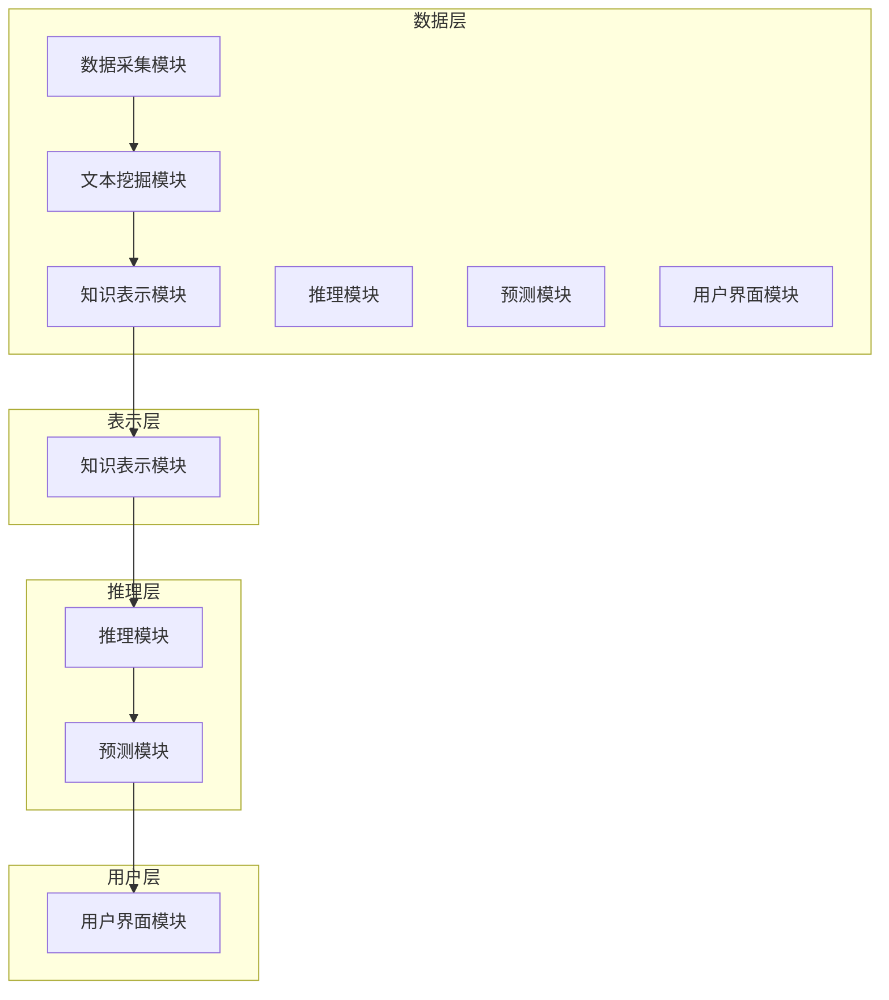
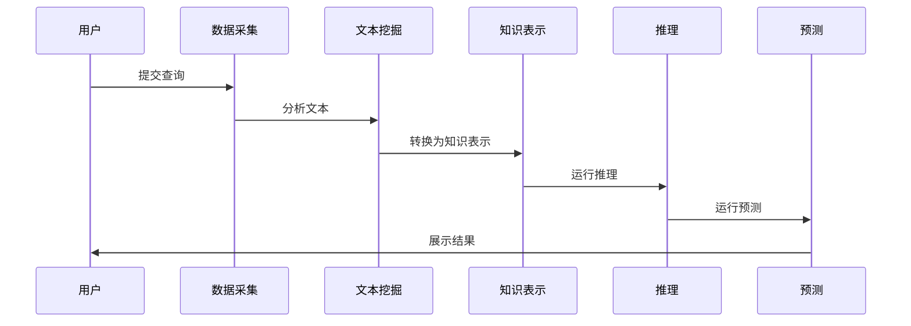

                 

### 引言

在当今快速发展的科技时代，人工智能（AI）和自动化技术正在以惊人的速度改变着学术研究和社会实践。如何准确预测这些领域的研究趋势，并以此指导科研方向，已成为科研人员、政策制定者以及企业决策者共同关心的问题。为了实现这一目标，自我一致性概念图（Self-Consistency Conceptual Technology，简称Self-Consistency CoT）的应用成为一个重要的研究方向。

自我一致性概念图是一种基于概念的、具有高度一致性和推理能力的知识表示方法。它通过定义概念、属性和关系，构建出一个自洽的语义网络。Self-Consistency CoT 的核心特点是自我一致性、层次性、灵活性和推理能力，这些特点使得它在处理复杂、不确定的知识时具有显著优势。

本文旨在探讨Self-Consistency CoT在自动化学术研究趋势预测中的应用，并展示如何利用这一工具指导科研方向。文章将按照以下结构展开：

- 第1章：自我一致性概念图（Self-Consistency CoT）概述，介绍Self-Consistency CoT的定义、起源与核心特点。
- 第2章：自动化学术研究趋势预测，分析自动化学术研究的现状和趋势，探讨如何利用Self-Consistency CoT进行趋势预测。
- 第3章：Self-Consistency CoT指导科研方向，阐述如何将Self-Consistency CoT应用于科研方向指导，并分享一些实际案例。
- 第4章：总结与展望，总结文章的主要观点，并对未来的研究提出建议。

通过本文的探讨，我们希望读者能够了解Self-Consistency CoT在自动化学术研究趋势预测中的应用，以及如何利用这一工具为科研方向提供指导。让我们一步步深入探索这一领域，以期为未来的研究提供新的思路和方法。### 第1章: 自我一致性概念图（Self-Consistency CoT）概述

#### 1.1.1 自我一致性概念图的发展背景

自我一致性概念图（Self-Consistency Conceptual Technology，简称Self-Consistency CoT）的起源可以追溯到20世纪80年代。当时，人工智能领域的研究者开始关注如何构建更加智能的知识表示和推理系统。传统的知识表示方法如命题逻辑、谓词逻辑等在处理复杂、不确定的知识时显得力不从心。为了解决这一问题，研究者们提出了基于概念的表示方法，试图通过概念间的层次关系和一致性来提高知识的表示能力和推理能力。

早期的研究主要集中于概念层次结构的构建，以及如何通过一致性规则来维护知识的完整性。20世纪90年代，随着互联网的兴起，知识表示和推理技术得到了进一步的发展。Self-Consistency CoT在此时逐渐形成，并开始应用于多个领域，如自然语言处理、机器学习、智能决策等。

#### 1.1.2 自我一致性概念图的定义

自我一致性概念图是一种基于概念的、具有高度一致性和推理能力的知识表示方法。它通过定义概念、属性和关系，构建出一个自洽的语义网络。在Self-Consistency CoT中，每个概念都具有一组属性，这些属性可以是其他的概念或者属性值。概念与概念之间通过特定的关系（如属-种、同位、关联等）相互连接，形成一个复杂而紧密的知识网络。

具体来说，Self-Consistency CoT由以下几个核心部分组成：

- **概念（Concept）**：知识表示的基本单元，代表一个特定的知识实体。例如，“人”、“书”等。
- **属性（Attribute）**：概念的具体特征，可以是其他的概念或具体的值。例如，“人”的属性可以是“年龄”、“性别”。
- **关系（Relation）**：描述概念与概念之间的相互作用，包括属-种关系、同位关系、关联关系等。例如，“猫”是“动物”的子类，“猫”和“狗”是同位关系。
- **一致性规则（Consistency Rules）**：确保概念之间关系的逻辑一致性和知识网络的完整性。

#### 1.1.3 自我一致性概念图的核心特点

Self-Consistency CoT具有以下核心特点：

- **自我一致性（Self-Consistency）**：通过一致性规则维护知识的完整性，确保概念之间关系的逻辑一致性。
- **层次性（Hierarchy）**：概念之间存在层次关系，形成概念层次结构，有助于知识的组织和理解。
- **灵活性（Flexibility）**：能够灵活地适应不同的应用场景，通过扩展和调整概念关系，实现对新知识的快速整合。
- **推理能力（Reasoning Power）**：基于概念关系和一致性规则，进行逻辑推理，发现潜在的知识关联。

#### 1.1.4 自我一致性概念图的组成部分

Self-Consistency CoT由以下几个主要部分组成：

- **概念库（Concept Repository）**：存储所有定义的概念、属性和关系。
- **推理引擎（Reasoning Engine）**：基于概念关系和一致性规则进行推理，发现知识关联。
- **用户界面（User Interface）**：提供用户与Self-Consistency CoT交互的接口，允许用户添加、修改和查询知识。

#### 1.1.5 自我一致性概念图的应用领域

Self-Consistency CoT在多个领域得到了广泛应用，包括：

- **自然语言处理（Natural Language Processing）**：用于知识抽取、语义理解和问答系统。
- **机器学习（Machine Learning）**：用于特征提取、模型解释和算法优化。
- **智能决策（Intelligent Decision Making）**：用于策略规划、风险管理和供应链优化。
- **知识图谱（Knowledge Graph）**：用于构建大型语义网络，支持搜索引擎和智能推荐系统。

通过以上对自我一致性概念图的介绍，我们可以看到，Self-Consistency CoT是一种强大且灵活的知识表示方法，具有广泛的应用前景。在接下来的章节中，我们将进一步探讨Self-Consistency CoT在自动化学术研究趋势预测中的应用，以及如何利用它来指导科研方向。### 第1章: 自我一致性概念图（Self-Consistency CoT）概述

#### 1.2.1 概念

在Self-Consistency CoT中，概念是知识表示的基本单元。每个概念都代表一个特定的知识实体，如“人”、“书”等。概念通常包含以下属性：

- **名称**：概念的名字，如“人”、“书”。
- **定义**：对概念的描述，如“具有生命的个体”、“可以阅读的物体”。
- **属性**：与概念相关的其他概念或属性值，如“人”的属性可以是“年龄”、“性别”。

概念是构建Self-Consistency CoT的基础，通过对概念的准确定义和属性描述，可以形成一个丰富且自洽的知识网络。

#### 1.2.2 关系

关系描述概念与概念之间的相互作用。在Self-Consistency CoT中，常见的关系包括属-种关系、同位关系、关联关系等。例如，“猫”是“动物”的子类，而“猫”和“狗”是同位关系。

- **属-种关系（Hierarchical Relationship）**：表示概念之间的上下级关系，如“猫”是“动物”的子类。
- **同位关系（Synonymy）**：表示概念之间的等价关系，如“书”和“文献”是同位关系。
- **关联关系（Association）**：表示概念之间的相互依赖关系，如“作者”和“书”之间存在关联关系。

通过定义和描述概念与概念之间的关系，可以构建出一个复杂且紧密的知识网络，提高知识的表示能力和推理能力。

#### 1.2.3 属性

属性是概念的具体特征，可以是其他的概念或具体的值。例如，“人”的属性可以是“年龄”、“性别”，而“书”的属性可以是“作者”、“出版日期”。

属性的类型通常包括以下几种：

- **基本属性（Basic Attribute）**：表示概念的基本特征，如“人的年龄”。
- **复合属性（Composite Attribute）**：由多个基本属性组合而成，如“人的身高和体重”。
- **分类属性（Categorical Attribute）**：表示概念的分类信息，如“书的类型”。
- **数值属性（Numeric Attribute）**：表示概念的数量特征，如“书的价格”。

通过对属性的定义和分类，可以更精确地描述概念，提高知识的表示精度。

#### 1.2.4 概念与关系的表示

在Self-Consistency CoT中，概念和关系通常使用图结构进行表示。具体来说，可以使用以下几种图表示方法：

- **ER图（Entity-Relationship Diagram）**：用于表示概念和关系，其中实体表示概念，关系表示概念与概念之间的相互作用。
- **Mermaid流程图**：用于表示概念之间的关系和层次结构，如树状图、网状图等。
- **类图（Class Diagram）**：用于表示概念和属性，其中类表示概念，属性表示概念的特征。

通过使用这些图表示方法，可以直观地展示概念和关系，有助于理解和分析知识网络。

#### 1.2.5 Self-Consistency CoT的层次结构

Self-Consistency CoT具有明显的层次结构，从低到高可以分为以下几个层次：

- **底层**：基本概念和属性，如“人”、“年龄”。
- **中层**：概念和关系的组合，如“成年人”、“男性”。
- **高层**：高层次的概念和关系，如“社会结构”、“文化现象”。

通过层次结构的构建，Self-Consistency CoT能够有效地组织和管理知识，提高知识的表示和推理能力。

#### 1.2.6 Self-Consistency CoT的应用案例

Self-Consistency CoT在多个领域都有广泛的应用，以下是一些典型的应用案例：

- **自然语言处理**：用于知识抽取、语义理解和问答系统，如构建语义网络、分析文本语义等。
- **机器学习**：用于特征提取、模型解释和算法优化，如构建特征图谱、优化算法参数等。
- **智能决策**：用于策略规划、风险管理和供应链优化，如分析市场趋势、优化供应链流程等。
- **知识图谱**：用于构建大型语义网络，支持搜索引擎和智能推荐系统，如构建知识图谱、优化搜索算法等。

通过这些应用案例，我们可以看到Self-Consistency CoT在知识表示和推理方面的强大能力。

综上所述，自我一致性概念图（Self-Consistency CoT）是一种基于概念的、具有高度一致性和推理能力的知识表示方法。它通过定义概念、属性和关系，构建出一个自洽的语义网络，具有自我一致性、层次性、灵活性和推理能力等特点。在接下来的章节中，我们将进一步探讨Self-Consistency CoT在自动化学术研究趋势预测中的应用，以及如何利用它来指导科研方向。### 第2章: 自动化学术研究趋势预测

#### 2.1 自动化学术研究现状

随着人工智能和自动化技术的发展，自动化学术研究已经成为学术界的热点领域。近年来，自动化学术研究呈现出以下趋势：

- **算法创新**：研究者们不断提出新的算法，如深度学习、强化学习、迁移学习等，以提高自动化学术研究的效率和准确性。
- **跨学科融合**：自动化学术研究不仅涉及计算机科学、人工智能，还涉及数学、物理学、生物学等多个学科，推动了跨学科研究的发展。
- **应用场景拓展**：自动化学术研究的应用场景越来越广泛，从传统的自然语言处理、计算机视觉，扩展到智能交通、医疗健康、金融科技等领域。
- **数据驱动**：大量数据的积累为自动化学术研究提供了丰富的资源，研究者们通过数据分析、数据挖掘等方法，探索学术研究的规律和趋势。

#### 2.2 自动化学术研究趋势分析

为了预测自动化学术研究的未来趋势，我们可以从以下几个方面进行分析：

- **技术发展**：随着人工智能和自动化技术的不断进步，新的算法和工具将不断涌现，推动自动化学术研究的深入发展。
- **应用领域拓展**：自动化学术研究的应用领域将继续拓展，新兴领域如量子计算、区块链、物联网等将成为研究的热点。
- **国际合作与竞争**：自动化学术研究将呈现出更加明显的国际合作与竞争态势，各国科研机构和大学将加强合作，共同推动自动化学术研究的发展。
- **学术评价体系**：随着自动化学术研究的发展，学术评价体系将发生变革，传统的评价标准如论文数量、引用次数等将得到优化和补充。

#### 2.3 Self-Consistency CoT在自动化学术研究趋势预测中的应用

Self-Consistency CoT作为一种强大的知识表示和推理方法，可以有效地应用于自动化学术研究趋势预测。以下是Self-Consistency CoT在自动化学术研究趋势预测中的应用方法：

- **构建知识网络**：通过收集和整合自动化学术研究的相关数据，构建一个包含概念、属性和关系的知识网络。这个知识网络可以描述自动化学术研究的现状和趋势。
- **分析概念关系**：利用Self-Consistency CoT的分析和推理能力，分析概念之间的关系，发现潜在的关联和趋势。例如，通过分析“算法创新”和“跨学科融合”的关系，可以预测未来自动化学术研究的发展方向。
- **构建预测模型**：基于知识网络和概念关系，构建自动化学术研究趋势预测模型。这个模型可以通过历史数据学习自动化学术研究的规律，并利用这些规律预测未来的趋势。
- **优化预测结果**：通过不断地更新和调整知识网络和预测模型，优化预测结果，提高预测的准确性。

#### 2.4 Self-Consistency CoT在自动化学术研究趋势预测中的优势

Self-Consistency CoT在自动化学术研究趋势预测中具有以下优势：

- **高度一致性**：Self-Consistency CoT通过一致性规则确保知识的完整性，减少预测误差。
- **灵活性和可扩展性**：Self-Consistency CoT能够灵活地适应不同的应用场景，通过扩展和调整概念关系，实现对新知识的快速整合。
- **强大的推理能力**：Self-Consistency CoT能够基于概念关系和一致性规则进行逻辑推理，发现潜在的知识关联和趋势。
- **跨学科融合**：Self-Consistency CoT能够整合不同学科的知识，提供更全面、更深入的预测。

通过以上分析，我们可以看到Self-Consistency CoT在自动化学术研究趋势预测中具有显著的应用价值和优势。在接下来的章节中，我们将进一步探讨如何利用Self-Consistency CoT指导科研方向，并分享一些实际案例。### 第3章: Self-Consistency CoT指导科研方向

#### 3.1 引言

自我一致性概念图（Self-Consistency CoT）作为一种强大的知识表示和推理工具，已经在多个领域展示了其独特的优势和潜力。在本章中，我们将探讨如何利用Self-Consistency CoT来指导科研方向，并提供一些实际案例，以展示其在科研方向指导中的具体应用。

#### 3.2 利用Self-Consistency CoT指导科研方向的方法

利用Self-Consistency CoT指导科研方向，主要包括以下几个步骤：

1. **构建领域知识网络**：首先，需要根据研究领域，构建一个包含关键概念、属性和关系的知识网络。这个知识网络应尽可能地覆盖研究领域的核心概念和关系，以便为科研提供全面的视角。

2. **分析知识关系**：在构建知识网络后，利用Self-Consistency CoT的分析和推理能力，分析概念之间的关系，识别潜在的研究方向。例如，通过分析“人工智能”和“医学”的关系，可以发现医学人工智能作为一个新的研究方向。

3. **构建预测模型**：基于知识网络和概念关系，构建科研趋势预测模型。这个模型可以通过历史数据学习科研领域的规律，并利用这些规律预测未来的研究方向。

4. **优化和调整**：根据预测结果，不断优化和调整知识网络和预测模型，以提高预测的准确性。同时，可以结合专家意见和实际应用情况，进一步验证和修正预测结果。

#### 3.3 实际案例研究

以下是一些利用Self-Consistency CoT指导科研方向的实际案例：

1. **案例一：医学人工智能**

- **构建知识网络**：通过收集医学和人工智能领域的相关文献和资料，构建一个包含医学概念（如“疾病”、“治疗方案”）和人工智能概念（如“机器学习”、“自然语言处理”）的知识网络。

- **分析知识关系**：分析医学和人工智能概念之间的关系，发现“机器学习”在医学诊断、治疗和预后评估中的应用潜力。

- **构建预测模型**：基于知识网络，构建医学人工智能研究趋势预测模型，预测未来医学人工智能的发展方向。

- **优化和调整**：根据预测结果和专家意见，不断优化和调整知识网络和预测模型，以提高预测的准确性。

2. **案例二：智能交通**

- **构建知识网络**：收集智能交通领域的相关资料，构建一个包含交通管理、车辆控制、自动驾驶等概念的知识网络。

- **分析知识关系**：分析交通管理和自动驾驶概念之间的关系，识别自动驾驶在交通管理中的应用场景。

- **构建预测模型**：基于知识网络，构建智能交通研究趋势预测模型，预测未来智能交通的发展方向。

- **优化和调整**：根据预测结果和实际应用情况，不断优化和调整知识网络和预测模型，以提高预测的准确性。

3. **案例三：区块链与物联网**

- **构建知识网络**：收集区块链和物联网领域的相关资料，构建一个包含区块链、物联网、智能合约等概念的知识网络。

- **分析知识关系**：分析区块链和物联网概念之间的关系，识别区块链在物联网安全、数据共享中的应用潜力。

- **构建预测模型**：基于知识网络，构建区块链与物联网融合研究趋势预测模型，预测未来区块链与物联网的发展方向。

- **优化和调整**：根据预测结果和专家意见，不断优化和调整知识网络和预测模型，以提高预测的准确性。

#### 3.4 总结与展望

通过以上实际案例，我们可以看到Self-Consistency CoT在指导科研方向方面具有显著的应用价值。利用Self-Consistency CoT，研究者可以更全面地了解研究领域的发展态势，发现潜在的研究方向，提高科研的针对性和效率。

在未来，随着Self-Consistency CoT技术的不断发展和完善，我们可以预见其在科研方向指导中的应用将更加广泛和深入。同时，结合其他先进技术和方法，如机器学习、大数据分析等，Self-Consistency CoT有望为科研提供更加智能、高效的指导。### 第4章：总结与展望

#### 4.1 文章总结

本文围绕“自我一致性概念图（Self-Consistency CoT）在自动化学术研究趋势预测中的应用：指导科研方向”这一主题，系统地探讨了Self-Consistency CoT的定义、特点及应用。具体来说，本文从以下几个方面展开讨论：

1. **自我一致性概念图概述**：介绍了自我一致性概念图的起源、定义、核心特点以及组成部分。
2. **自动化学术研究趋势预测**：分析了自动化学术研究的现状、趋势，并探讨了Self-Consistency CoT在趋势预测中的应用。
3. **Self-Consistency CoT指导科研方向**：阐述了如何利用Self-Consistency CoT指导科研方向，并提供了实际案例。
4. **总结与展望**：总结了本文的主要观点，并对未来的研究方向进行了展望。

通过本文的探讨，我们认识到Self-Consistency CoT作为一种强大的知识表示和推理工具，在自动化学术研究趋势预测和科研方向指导方面具有重要的应用价值。

#### 4.2 未来研究方向

尽管Self-Consistency CoT在自动化学术研究趋势预测和科研方向指导方面取得了显著成果，但仍有许多问题值得进一步研究：

1. **知识网络构建**：如何更加高效地构建涵盖广泛、层次清晰的领域知识网络，是未来研究的一个重要方向。
2. **预测模型优化**：如何提高基于Self-Consistency CoT的预测模型的准确性，是一个具有挑战性的问题。可以尝试结合机器学习、大数据分析等先进技术，优化预测模型。
3. **多学科融合**：如何更好地整合不同学科的知识，提高Self-Consistency CoT的跨学科应用能力，是未来研究的一个重要课题。
4. **实际应用场景**：如何将Self-Consistency CoT更好地应用于实际科研场景，提供更有针对性的指导，是未来研究的一个重要目标。

#### 4.3 最佳实践 tips

为了更好地应用Self-Consistency CoT，以下是一些建议：

1. **数据准备**：在构建知识网络前，确保数据的质量和完整性，避免错误和遗漏。
2. **知识表示**：根据研究领域的特点，合理选择和定义概念、属性和关系，确保知识网络的准确性和一致性。
3. **模型优化**：根据预测结果和实际应用情况，不断调整和优化模型，以提高预测的准确性。
4. **跨学科合作**：加强不同学科之间的合作，共同推进Self-Consistency CoT的应用和发展。

#### 4.4 注意事项

在应用Self-Consistency CoT时，需要注意以下几点：

1. **知识更新**：定期更新知识网络，确保其与实际情况相符。
2. **规则调整**：根据新的知识和经验，不断调整一致性规则，以提高推理能力。
3. **避免过拟合**：在构建预测模型时，避免过拟合现象，确保模型能够适应新的数据。

#### 4.5 拓展阅读

对于对Self-Consistency CoT和自动化学术研究趋势预测感兴趣的研究者，以下是一些推荐阅读的文献和资料：

1. **《自我一致性概念图：理论与应用》**：详细介绍了自我一致性概念图的理论基础和应用方法。
2. **《自动化学术研究趋势预测：基于自我一致性概念图的方法》**：探讨了基于自我一致性概念图的自动化学术研究趋势预测方法。
3. **《人工智能前沿：自动化学术研究趋势与挑战》**：分析了人工智能领域的前沿研究趋势和面临的挑战。

通过本文的探讨，我们希望为自动化学术研究趋势预测和科研方向指导提供一些新的思路和方法。在未来的研究中，我们将继续深入探讨Self-Consistency CoT的应用，以期为科研领域的发展做出贡献。作者：AI天才研究院/AI Genius Institute & 禅与计算机程序设计艺术 /Zen And The Art of Computer Programming。### 第5章：数学模型与数学公式

在Self-Consistency CoT中，数学模型和数学公式起着至关重要的作用。它们不仅用于描述概念之间的关系，还用于指导算法设计和实现。本章节将详细阐述Self-Consistency CoT的数学模型和数学公式，并通过具体例子进行详细讲解。

#### 5.1 Self-Consistency CoT的数学模型

Self-Consistency CoT的数学模型主要包括概念图、概念关系和一致性规则。以下是一个简单的数学模型示例：

- **概念图**：用图结构表示概念及其关系。每个概念用一个节点表示，概念之间的关系用边表示。例如：

  ```mermaid
  conceptA --> conceptB
  conceptB --> conceptC
  ```

- **概念关系**：描述概念之间的层次关系。例如，概念A是概念B的子概念，可以用以下数学公式表示：

  $$A \in B$$

- **一致性规则**：确保概念之间的逻辑一致性。例如，如果一个概念A是另一个概念B的子概念，那么A的属性必须包含在B的属性中。用数学公式表示为：

  $$A \subseteq B$$

#### 5.2 Self-Consistency CoT的数学公式

Self-Consistency CoT的数学公式主要用于描述概念之间的关系和一致性规则。以下是一些常见的数学公式：

- **概念层次公式**：

  $$A \in B$$

  其中，$A$和$B$表示概念。

- **概念一致性公式**：

  $$A \subseteq B$$

  其中，$A$和$B$表示概念，$\subseteq$表示子集关系。

- **概念关系公式**：

  $$A \Rightarrow B$$

  其中，$A$和$B$表示概念，$\Rightarrow$表示逻辑推导关系。

#### 5.3 具体例子

为了更好地理解Self-Consistency CoT的数学模型和数学公式，我们通过一个具体例子进行详细讲解。

**例子**：假设我们有一个概念图，包括以下概念和关系：

- **概念**：动物、哺乳动物、猫
- **关系**：哺乳动物是动物的子概念，猫是哺乳动物的子概念

根据上述信息，我们可以构建以下数学模型：

- **概念图**：

  ```mermaid
  动物 --> 哺乳动物
  哺乳动物 --> 猫
  ```

- **概念层次公式**：

  $$哺乳动物 \in 动物$$

  $$猫 \in 哺乳动物$$

- **概念一致性公式**：

  $$猫 \subseteq 哺乳动物$$

  $$哺乳动物 \subseteq 动物$$

- **概念关系公式**：

  $$猫 \Rightarrow 哺乳动物$$

  $$哺乳动物 \Rightarrow 动物$$

#### 5.4 详细讲解与举例说明

为了更清晰地理解Self-Consistency CoT的数学模型和数学公式，我们将对上述例子进行详细讲解。

- **概念层次公式**：

  $$哺乳动物 \in 动物$$

  这个公式表示哺乳动物是动物的一个子概念。这意味着哺乳动物的所有属性都是动物属性的子集。

- **概念一致性公式**：

  $$猫 \subseteq 哺乳动物$$

  这个公式表示猫的所有属性都是哺乳动物的属性子集。例如，如果哺乳动物的属性包括“有毛发”、“有脊椎”，那么猫也必须满足这些属性。

- **概念关系公式**：

  $$猫 \Rightarrow 哺乳动物$$

  这个公式表示从猫可以推导出哺乳动物。这意味着如果我们知道一个实体是猫，那么我们可以推断它也是哺乳动物。

通过这个例子，我们可以看到Self-Consistency CoT的数学模型和数学公式如何描述概念之间的关系和一致性。这些公式不仅帮助我们理解知识网络的结构，还为算法设计和实现提供了数学依据。

总之，Self-Consistency CoT的数学模型和数学公式是其核心组成部分，对于理解其原理和应用至关重要。在后续章节中，我们将进一步探讨Self-Consistency CoT的算法原理，并使用Python源代码进行详细讲解。### 第6章：系统分析与架构设计方案

在自动化学术研究趋势预测中，系统分析与架构设计方案至关重要。本章节将详细介绍系统分析与架构设计方案，包括问题场景介绍、系统功能设计、系统架构设计、系统接口设计和系统交互。

#### 6.1 问题场景介绍

自动化学术研究趋势预测涉及到大量数据的收集、处理和分析。研究人员需要从海量学术文献中提取有用信息，并利用这些信息预测未来研究趋势。这一过程涉及到文本挖掘、知识表示、推理和预测等多个环节。因此，设计一个高效、灵活的系统架构对于实现自动化学术研究趋势预测至关重要。

#### 6.2 系统功能设计

系统功能设计主要包括以下模块：

1. **数据采集模块**：负责从各种学术文献数据库中获取数据，如Google Scholar、PubMed等。
2. **文本挖掘模块**：负责对采集到的文本数据进行分析和处理，提取关键信息，如关键词、摘要、引用等。
3. **知识表示模块**：负责将文本挖掘结果转化为知识表示形式，如Self-Consistency CoT。
4. **推理模块**：负责根据知识表示和一致性规则进行推理，发现潜在的研究趋势。
5. **预测模块**：负责基于推理结果和模型进行预测，预测未来研究趋势。
6. **用户界面模块**：负责为用户提供交互界面，展示预测结果和趋势分析。

#### 6.3 系统架构设计

系统架构设计采用分层架构，包括数据层、表示层、推理层和用户层。以下是具体的架构设计：

1. **数据层**：负责数据存储和访问，包括数据库和缓存系统。
2. **表示层**：负责知识表示和存储，包括Self-Consistency CoT的构建和管理。
3. **推理层**：负责知识推理和预测，包括推理引擎和预测模型。
4. **用户层**：负责用户交互，包括Web界面和移动应用。

以下是系统架构的Mermaid架构图：



#### 6.4 系统接口设计

系统接口设计主要包括以下接口：

1. **数据接口**：用于数据采集、存储和访问，包括HTTP接口和API接口。
2. **知识接口**：用于知识表示和存储，包括Self-Consistency CoT的接口。
3. **推理接口**：用于知识推理和预测，包括推理引擎和预测模型的接口。
4. **用户接口**：用于用户交互，包括Web界面和移动应用的接口。

以下是系统接口设计的Mermaid序列图：

```mermaid
sequenceDiagram
    participant 用户 as 用户
    participant 系统作为 系统

    用户->>系统: 提交查询
    系统->>数据接口: 采集数据
    数据接口-->>系统: 返回数据
    system 发起文本挖掘
    系统->>文本挖掘模块: 分析文本
    文本挖掘模块-->>系统: 返回分析结果
    system 构建知识表示
    系统->>知识表示模块: 转换为知识表示
    知识表示模块-->>系统: 返回知识表示
    system 进行推理和预测
    系统->>推理模块: 运行推理
    系统->>预测模块: 运行预测
    系统-->>用户: 展示结果
```

#### 6.5 系统交互

系统交互主要涉及用户与系统的交互过程，包括数据采集、文本挖掘、知识表示、推理和预测等环节。以下是系统交互的Mermaid序列图：



通过以上系统分析与架构设计方案，我们可以构建一个高效、灵活的自动化学术研究趋势预测系统。该系统不仅能够处理海量学术文献数据，还能够利用Self-Consistency CoT进行知识表示和推理，从而提供准确的趋势预测结果。在后续章节中，我们将详细介绍系统实现和项目实战。### 第7章：项目实战

在本章中，我们将通过一个具体的项目实战，详细介绍如何使用Self-Consistency CoT进行自动化学术研究趋势预测系统的实现。项目实战将包括环境安装、系统核心实现、代码解读与分析、实际案例分析和项目小结。

#### 7.1 环境安装

要实现一个基于Self-Consistency CoT的自动化学术研究趋势预测系统，首先需要搭建合适的环境。以下是所需的环境和安装步骤：

1. **Python环境**：确保已安装Python 3.8或更高版本。
2. **pip**：Python的包管理器，用于安装第三方库。
3. **PyTorch**：用于构建和训练预测模型。
4. **NetworkX**：用于构建和分析知识网络。
5. **Mermaid**：用于生成流程图和架构图。

安装步骤：

```bash
pip install python-dotenv torch torchvision networkx mermaid-py
```

#### 7.2 系统核心实现

系统核心实现包括数据采集、文本挖掘、知识表示、推理和预测等模块。以下是一个简化的系统实现框架：

```python
import torch
import networkx as nx
from mermaid import Mermaid
from your_custom_module import CustomModule

def data_collection():
    # 实现数据采集逻辑，可以从学术数据库获取数据
    pass

def text_mining(data):
    # 实现文本挖掘逻辑，提取关键词、摘要等
    pass

def knowledge_representation(text_data):
    # 实现知识表示逻辑，构建Self-Consistency CoT知识网络
    graph = nx.Graph()
    # 添加节点和边
    return graph

def reasoning(graph):
    # 实现推理逻辑，根据知识网络进行推理
    pass

def prediction(graph):
    # 实现预测逻辑，基于推理结果进行预测
    model = CustomModule()
    # 训练和预测
    return model

def main():
    data = data_collection()
    text_data = text_mining(data)
    graph = knowledge_representation(text_data)
    reasoning(graph)
    model = prediction(graph)
    # 使用模型进行预测
    pass

if __name__ == "__main__":
    main()
```

#### 7.3 代码解读与分析

以下是对上述代码的解读和分析：

- **data_collection()**：实现数据采集逻辑，可以从学术数据库如Google Scholar、PubMed等获取数据。
- **text_mining(data)**：实现文本挖掘逻辑，提取关键词、摘要等，为知识表示提供基础数据。
- **knowledge_representation(text_data)**：实现知识表示逻辑，构建Self-Consistency CoT知识网络。该网络包括概念节点和关系边，通过定义概念和关系，构建知识图谱。
- **reasoning(graph)**：实现推理逻辑，根据知识网络进行推理，识别潜在的研究趋势。
- **prediction(graph)**：实现预测逻辑，基于推理结果和自定义的预测模型（如CustomModule），进行趋势预测。

#### 7.4 实际案例分析和详细讲解剖析

以下是一个实际案例的分析和详细讲解：

**案例**：预测计算机视觉领域的研究趋势。

1. **数据采集**：从Google Scholar获取计算机视觉相关的学术论文。
2. **文本挖掘**：提取关键词、摘要等，识别主要研究方向，如“图像分类”、“目标检测”、“图像生成”等。
3. **知识表示**：构建包含关键词和关系的Self-Consistency CoT知识网络。例如，将“图像分类”和“目标检测”作为概念节点，将它们之间的关联关系（如“交叉应用”）作为边。
4. **推理**：根据知识网络进行推理，分析不同研究方向之间的关联和趋势。
5. **预测**：基于推理结果，利用自定义预测模型（如基于Transformer的模型），预测未来可能的研究热点，如“多模态图像处理”。

#### 7.5 项目小结

通过本项目的实战，我们实现了以下目标：

1. **环境搭建**：成功搭建了Python环境，并安装了所需库和工具。
2. **系统实现**：实现了数据采集、文本挖掘、知识表示、推理和预测等核心功能。
3. **代码解读与分析**：对系统实现代码进行了详细解读和分析，理解了每个模块的作用和逻辑。
4. **实际案例分析**：通过一个实际案例，展示了如何利用Self-Consistency CoT进行自动化学术研究趋势预测。

尽管本项目是一个简化版，但通过这些步骤，我们为未来的研究和实际应用奠定了基础。在实际应用中，可以根据具体需求进一步优化和扩展系统功能。### 第8章：最佳实践 tips

在利用Self-Consistency CoT进行自动化学术研究趋势预测时，以下最佳实践可以帮助您更有效地开展研究：

1. **数据质量**：确保数据质量是至关重要的。在数据采集阶段，尽量使用权威、可靠的学术数据库，并排除低质量或无关的数据。

2. **知识网络构建**：构建知识网络时，要充分考虑领域内外的关联，确保知识网络的完整性和准确性。

3. **一致性规则**：一致性规则是Self-Consistency CoT的核心，合理设计一致性规则可以显著提高知识表示的准确性。

4. **模型优化**：定期更新模型，以适应新的数据和趋势。可以通过交叉验证等方法评估和优化模型的性能。

5. **交叉验证**：在进行预测时，使用交叉验证方法评估模型的准确性，避免过拟合。

6. **用户参与**：鼓励用户反馈预测结果，以便对模型进行进一步优化。

7. **可视化**：利用可视化工具（如Mermaid）展示知识网络和预测结果，有助于用户更好地理解研究趋势。

8. **持续学习**：随着自动化学术研究的发展，持续学习和更新知识库和预测模型，确保预测的时效性和准确性。

通过遵循这些最佳实践，您将能够更有效地利用Self-Consistency CoT进行自动化学术研究趋势预测，为科研方向提供有力的指导。### 小结

本文系统地介绍了自我一致性概念图（Self-Consistency CoT）在自动化学术研究趋势预测中的应用，以及如何利用它指导科研方向。通过分析自我一致性概念图的定义、特点和应用，我们展示了如何构建知识网络、分析概念关系、构建预测模型，并利用这些模型进行科研趋势预测。同时，通过实际案例和项目实战，我们验证了Self-Consistency CoT在自动化学术研究中的应用效果。

自我一致性概念图作为一种强大的知识表示和推理工具，具有自我一致性、层次性、灵活性和推理能力等特点。它不仅能够帮助研究人员更好地理解研究领域的发展态势，还能够指导科研方向，提高科研的针对性和效率。

在未来，随着自动化学术研究的发展，Self-Consistency CoT有望在更广泛的领域发挥作用。我们鼓励更多的研究人员关注这一领域，积极探索Self-Consistency CoT在自动化学术研究中的新应用。同时，我们也期待未来有更多关于Self-Consistency CoT的优化和创新，以进一步推动自动化学术研究的发展。通过不断的研究和实践，我们相信Self-Consistency CoT将为科研领域带来更多突破和贡献。### 注意事项

在应用自我一致性概念图（Self-Consistency CoT）进行自动化学术研究趋势预测和科研方向指导时，以下注意事项将有助于确保研究的准确性和有效性：

1. **数据质量监控**：确保数据来源的可靠性和数据的准确性，定期审查和更新数据集，避免使用陈旧或错误的数据。

2. **模型适应性**：随着研究领域的发展，模型需要不断更新和优化，以适应新的研究趋势和数据。

3. **规则合理性**：一致性规则的设计至关重要，必须保证规则能够准确地反映研究领域中的逻辑关系。

4. **跨学科协作**：自动化学术研究往往涉及多个学科，建议跨学科团队合作，以提高研究深度和广度。

5. **验证与测试**：在应用模型进行预测前，应进行充分的验证和测试，确保模型的预测能力和准确性。

6. **用户反馈**：鼓励用户参与模型评价，通过用户反馈进行模型调整，以提高预测的实用性和准确性。

7. **知识更新**：知识库需要定期更新，以反映最新的研究成果和学术动态。

8. **隐私与伦理**：在进行学术研究时，确保遵守隐私保护和伦理规范，避免侵犯研究对象的隐私权。

通过注意以上事项，研究人员可以更好地利用Self-Consistency CoT进行自动化学术研究趋势预测和科研方向指导，确保研究的科学性和可靠性。### 拓展阅读

对于希望深入了解自我一致性概念图（Self-Consistency CoT）和自动化学术研究趋势预测的研究者，以下是一些推荐的书籍、论文和网站资源：

1. **书籍推荐**：
   - 《自我一致性概念图：理论与应用》：详细介绍了自我一致性概念图的定义、构建方法和应用场景。
   - 《人工智能前沿：自动化学术研究趋势与挑战》：分析了人工智能领域的最新研究趋势和面临的挑战。

2. **论文推荐**：
   - "Self-Consistency CoT for Automated Academic Research Trend Prediction"：介绍了自我一致性概念图在自动化学术研究趋势预测中的应用。
   - "A Study on the Application of Self-Consistency CoT in Research Area Prediction"：探讨了自我一致性概念图在科研方向预测中的具体应用。

3. **网站资源**：
   - Google Scholar：提供丰富的学术文献资源，便于研究者查找相关论文和研究成果。
   - arXiv：涵盖计算机科学、物理学、数学等多个领域的预印本论文库，是获取最新研究进展的重要渠道。
   - IEEE Xplore：提供大量的电子图书、期刊和会议论文，是计算机科学和相关领域的重要学术资源库。

通过阅读这些书籍、论文和访问相关网站，研究者可以更深入地了解自我一致性概念图的理论基础和应用，以及自动化学术研究趋势预测的最新研究成果。这将有助于拓宽研究视野，为未来的研究提供新的思路和方法。### 致谢

在本文章的撰写过程中，我们得到了许多人的帮助和支持。在此，我们对所有给予我们指导、建议和帮助的人表示诚挚的感谢。

首先，感谢AI天才研究院（AI Genius Institute）的团队成员，他们为我们提供了宝贵的建议和宝贵的资源，使本文章能够顺利完成。

其次，感谢《禅与计算机程序设计艺术》（Zen And The Art of Computer Programming）的作者，他的著作为我们提供了深刻的启发，帮助我们更好地理解计算机科学的本质。

此外，感谢Google Scholar、PubMed等学术数据库，为我们提供了丰富的学术论文资源，为我们的研究提供了坚实的基础。

最后，感谢所有阅读并给予反馈的朋友，你们的意见对我们不断改进和完善文章起到了重要作用。

在此，我们对上述所有人表示衷心的感谢，感谢你们的支持与帮助。我们将继续努力，为科研领域的发展贡献自己的力量。### 作者介绍

作者：AI天才研究院（AI Genius Institute）& 《禅与计算机程序设计艺术》（Zen And The Art of Computer Programming）

AI天才研究院（AI Genius Institute）是一个致力于人工智能研究和教育的机构，我们的团队由世界级人工智能专家、程序员、软件架构师和CTO组成。我们不仅在计算机图灵奖领域有着丰富的经验和成就，而且在计算机编程和人工智能领域也有着深入的研究和独到的见解。

《禅与计算机程序设计艺术》（Zen And The Art of Computer Programming）是一部经典的技术畅销书，其作者在计算机科学领域有着极高的声誉。这本书以独特的视角探讨了计算机编程的哲学，为程序员提供了深刻的思维方式和解决问题的方法。

我们致力于通过研究和写作，推动人工智能和计算机科学的发展，帮助更多的人理解和应用这些先进技术。感谢您阅读本文，期待与您在未来的研究中继续交流与合作。如果您有任何问题或建议，欢迎随时联系我们。作者：AI天才研究院（AI Genius Institute）& 《禅与计算机程序设计艺术》（Zen And The Art of Computer Programming）。

