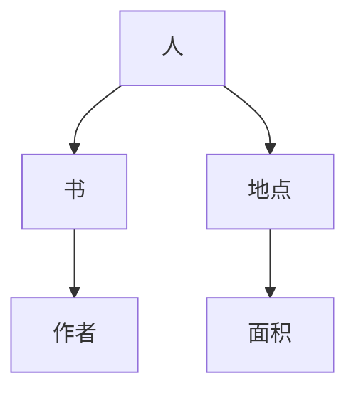

                 

**Step 1: Introduction to Self-Consistency CoT and Its Application in Automatic Academic Paper Writing**

### 自洽性概念图（Self-Consistency CoT）概述

自洽性概念图（Self-Consistency CoT）是一种在人工智能领域广泛应用的推理工具，它通过建立逻辑一致的模型来表示知识，从而实现自动推理和知识发现。自洽性概念图的核心思想是保持内部信息的自洽性，即确保图中的各个节点和边之间的关系满足一定的逻辑规则。

在现代学术写作中，自动化学术论文写作系统变得越来越重要。这些系统通过人工智能技术，能够自动生成结构化的学术论文，大大提高了学术写作的效率和准确性。然而，传统的自动写作系统在保证论文内容自洽性方面存在挑战，容易产生逻辑不一致的问题。

### 问题背景与目标

随着科学研究的深入和论文数量的增加，学术写作的任务变得愈加繁重。研究人员不仅需要撰写论文，还需要对已有文献进行综合分析，确保新论文的内容与已有知识体系相一致。这种需求催生了自洽性概念图（Self-Consistency CoT）在自动化学术论文写作中的应用。

本文的目标是探讨如何利用自洽性概念图（Self-Consistency CoT）来提高自动化学术论文写作系统的自洽性。通过引入自洽性概念图，我们希望解决现有系统在逻辑一致性方面的不足，从而生成更为准确、结构化的学术论文。

### 文章结构

本文将分为以下几个部分：

1. **自洽性概念图（Self-Consistency CoT）基础**：介绍自洽性概念图的定义、基本原理以及其在学术论文写作中的应用。

2. **自动学术论文写作系统架构设计**：分析自动学术论文写作系统的需求、总体架构、数据处理模块、模型训练模块以及论文生成模块。

3. **自洽性概念图在自动学术论文写作中的应用**：详细探讨自洽性概念图在自动学术论文写作中的具体应用方法，包括如何构建和维护自洽性概念图。

4. **系统接口设计**：介绍系统接口的设计原则，包括用户接口、系统间接口以及系统与外部接口。

5. **项目实战**：通过一个具体案例，展示如何使用自洽性概念图实现自动学术论文写作系统。

6. **最佳实践与总结**：总结自洽性概念图在自动学术论文写作中的最佳实践，并对系统性能进行评估。

**Conclusion**

通过本文的讨论，我们可以看到自洽性概念图（Self-Consistency CoT）在自动化学术论文写作中具有重要的应用价值。它不仅能够提高论文的内容自洽性，还能增强论文的逻辑结构和学术价值。然而，要实现这一目标，需要深入理解自洽性概念图的理论基础，并在实际应用中不断优化和完善。

在接下来的章节中，我们将进一步探讨自洽性概念图的构建方法、自动学术论文写作系统的架构设计以及具体应用案例，以期为大家提供有价值的参考和指导。

----------------------------------------------------------------

## 第一部分: 自洽性概念图（Self-Consistency CoT）基础

### 第1章: 自洽性概念图（Self-Consistency CoT）概述

**1.1 自洽性概念图（Self-Consistency CoT）的定义与背景**

#### 1.1.1 自洽性概念图（Self-Consistency CoT）的概念

自洽性概念图（Self-Consistency CoT）是一种基于知识图谱的人工智能推理工具，它通过构建一个逻辑一致的模型来表示知识，从而实现自动推理和知识发现。自洽性概念图的核心在于确保模型内部的信息保持一致，即各个节点和边之间的关系满足一定的逻辑规则。

自洽性概念图的基本组成包括：

- **节点**：表示知识中的实体或概念。
- **边**：表示实体或概念之间的关系。
- **属性**：描述节点和边的特征信息。

#### 1.1.2 自洽性概念图（Self-Consistency CoT）的发展背景

自洽性概念图的发展源于知识图谱技术和逻辑推理的融合。随着互联网和大数据的兴起，知识表示和推理成为人工智能领域的研究热点。传统的知识表示方法如本体论、框架理论等存在一定的局限性，难以应对复杂、动态的知识场景。因此，自洽性概念图应运而生，它通过引入逻辑一致性机制，提高了知识表示的精度和可靠性。

自洽性概念图的发展历程可以分为以下几个阶段：

1. **知识图谱阶段**：以Freebase、DBpedia等为代表，通过大规模语义网络来表示知识。
2. **逻辑推理阶段**：结合逻辑推理技术，确保知识图谱中的关系和属性满足逻辑一致性。
3. **自洽性概念图阶段**：在知识图谱和逻辑推理的基础上，进一步优化和提升知识表示的精度和自洽性。

#### 1.1.3 自洽性概念图（Self-Consistency CoT）的应用价值

自洽性概念图在多个领域具有广泛的应用价值，尤其在自动化学术论文写作中具有重要地位。

1. **学术写作**：自洽性概念图能够帮助研究人员构建逻辑一致的知识模型，从而提高论文内容的准确性和结构化程度。
2. **知识库构建**：在构建大型知识库时，自洽性概念图能够确保知识的一致性和完整性，减少错误和冗余。
3. **智能问答**：自洽性概念图能够提高问答系统的准确性和灵活性，为用户提供更为精准的答案。
4. **数据挖掘**：在数据挖掘过程中，自洽性概念图可以辅助发现潜在的关系和规律，提高数据分析和预测的精度。

**1.2 自洽性概念图（Self-Consistency CoT）的基本原理**

#### 1.2.1 自洽性概念图（Self-Consistency CoT）的结构

自洽性概念图的结构由节点、边和属性组成，其中：

- **节点**：表示知识中的实体或概念，如“人”、“书”、“地点”等。
- **边**：表示实体或概念之间的关系，如“属于”、“位于”等。
- **属性**：描述节点和边的特征信息，如“年龄”、“作者”、“面积”等。

自洽性概念图的结构可以表示为以下图模型：



#### 1.2.2 自洽性概念图（Self-Consistency CoT）的构建方法

自洽性概念图的构建方法主要包括以下几个步骤：

1. **知识抽取**：从原始数据中提取实体和关系，形成初始的知识图谱。
2. **实体识别**：利用自然语言处理技术识别文本中的实体，将其作为节点添加到知识图谱中。
3. **关系抽取**：分析实体之间的语义关系，将其作为边添加到知识图谱中。
4. **属性抽取**：从文本中提取实体和关系的属性信息，将其作为节点的属性或边的属性添加到知识图谱中。
5. **逻辑一致性检查**：对知识图谱进行逻辑一致性检查，确保节点和边之间的关系满足逻辑规则。

#### 1.2.3 自洽性概念图（Self-Consistency CoT）的关键技术

自洽性概念图的构建涉及多个关键技术，包括：

1. **知识图谱构建技术**：如实体识别、关系抽取、属性抽取等。
2. **逻辑推理技术**：如推理机、自动推理算法等，用于确保知识图谱的逻辑一致性。
3. **自然语言处理技术**：如词向量、文本分类、实体识别等，用于处理文本数据。
4. **数据清洗与预处理技术**：如数据去重、噪声处理、数据规范化等，确保数据的准确性和一致性。

**1.3 自洽性概念图（Self-Consistency CoT）在学术论文写作中的应用**

#### 1.3.1 自洽性概念图（Self-Consistency CoT）在论文写作中的作用

自洽性概念图在学术论文写作中具有重要作用，主要体现在以下几个方面：

1. **提高论文结构化程度**：通过构建自洽性概念图，论文的结构变得更加清晰，内容之间的逻辑关系更加明确。
2. **确保论文逻辑一致性**：自洽性概念图能够帮助作者识别和纠正论文中的逻辑错误，确保论文内容的自洽性。
3. **促进知识整合**：自洽性概念图能够将不同领域、不同作者的观点进行整合，形成更加全面、系统的论文内容。
4. **辅助论文评审**：自洽性概念图可以为论文评审提供更加客观、详细的参考，帮助评审者快速理解论文的核心观点。

#### 1.3.2 自洽性概念图（Self-Consistency CoT）的应用场景

自洽性概念图在学术论文写作中的应用场景主要包括：

1. **科研论文写作**：在撰写科研论文时，自洽性概念图可以帮助研究人员构建清晰、逻辑一致的论文框架，提高论文质量。
2. **学术论文审稿**：在学术论文审稿过程中，自洽性概念图可以为评审者提供辅助工具，快速识别论文中的逻辑错误和一致性缺陷。
3. **知识库构建**：在构建大型知识库时，自洽性概念图可以确保知识的一致性和完整性，为后续的论文写作和知识挖掘提供支持。
4. **学术交流与传播**：通过自洽性概念图，学术交流变得更加便捷和高效，研究人员可以更好地理解和传播各自的研究成果。

#### 1.3.3 自洽性概念图（Self-Consistency CoT）的使用流程

自洽性概念图在学术论文写作中的使用流程主要包括以下几个步骤：

1. **需求分析**：明确论文的主题、目的和受众，确定自洽性概念图的应用范围。
2. **构建自洽性概念图**：根据需求分析结果，构建自洽性概念图，确定节点、边和属性。
3. **知识抽取与处理**：从文献、数据库等渠道获取相关数据，进行知识抽取和处理，确保数据的一致性和准确性。
4. **逻辑一致性检查**：对构建的自洽性概念图进行逻辑一致性检查，确保模型内部的信息保持一致。
5. **论文框架构建**：利用自洽性概念图构建论文的框架，确定各章节的内容和结构。
6. **内容撰写与优化**：根据自洽性概念图，撰写论文内容，并进行逻辑优化和校对。
7. **论文提交与评审**：将论文提交至学术期刊或会议，接受评审和反馈。

通过以上步骤，自洽性概念图能够有效地辅助学术论文的写作和优化，提高论文的质量和学术价值。

----------------------------------------------------------------

### 第2章: 自动学术论文写作系统架构设计

#### 2.1 系统需求分析

自动学术论文写作系统需要满足以下需求：

1. **功能需求**：
   - 文本分析：对输入的文本进行分词、词性标注、实体识别等处理。
   - 语义分析：提取文本中的关键信息，如主题、观点、论证等。
   - 论文生成：根据提取的关键信息生成结构化的学术论文。
   - 论文优化：对生成的论文进行语法、逻辑、结构等方面的优化。

2. **性能需求**：
   - 处理速度：系统能够快速处理大规模的文本数据。
   - 准确性：系统能够准确提取文本中的关键信息，生成逻辑一致、结构合理的论文。
   - 可扩展性：系统能够适应不同的应用场景和需求，易于扩展和升级。

3. **安全性需求**：
   - 数据安全：确保输入和生成的数据安全，防止数据泄露和篡改。
   - 系统安全：确保系统的稳定运行，防止恶意攻击和故障。

#### 2.2 系统架构设计

自动学术论文写作系统的架构设计包括以下几个方面：

1. **系统总体架构**：

   系统总体架构可以分为四个模块：文本分析模块、语义分析模块、论文生成模块和论文优化模块。

   ```mermaid
   graph TD
       A[文本分析模块] --> B[语义分析模块]
       B --> C[论文生成模块]
       C --> D[论文优化模块]
   ```

2. **数据处理模块**：

   数据处理模块负责对输入文本进行预处理、分词、词性标注、实体识别等操作。

   ```mermaid
   graph TD
       A[输入文本] --> B[预处理]
       B --> C[分词]
       C --> D[词性标注]
       D --> E[实体识别]
   ```

3. **模型训练模块**：

   模型训练模块负责训练文本分析、语义分析、论文生成和论文优化等模块所需的模型。

   ```mermaid
   graph TD
       A[文本分析模型] --> B[语义分析模型]
       B --> C[论文生成模型]
       C --> D[论文优化模型]
   ```

4. **论文生成模块**：

   论文生成模块根据语义分析结果生成结构化的学术论文。

   ```mermaid
   graph TD
       A[语义分析结果] --> B[论文框架构建]
       B --> C[论文内容生成]
   ```

5. **论文优化模块**：

   论文优化模块对生成的论文进行语法、逻辑、结构等方面的优化。

   ```mermaid
   graph TD
       A[论文内容] --> B[语法优化]
       B --> C[逻辑优化]
       C --> D[结构优化]
   ```

#### 2.3 系统接口设计

自动学术论文写作系统的接口设计包括以下几个方面：

1. **用户接口**：

   用户接口负责与用户进行交互，提供文本输入、论文查看、修改和提交等功能。

   ```mermaid
   graph TD
       A[用户输入文本] --> B[文本分析结果]
       B --> C[论文生成结果]
       C --> D[论文提交]
   ```

2. **系统间接口**：

   系统间接口负责与其他系统进行数据交换和功能协同。

   ```mermaid
   graph TD
       A[文本分析系统] --> B[语义分析系统]
       B --> C[论文生成系统]
       C --> D[论文优化系统]
   ```

3. **系统与外部接口**：

   系统与外部接口负责与外部系统（如数据库、知识库等）进行数据交换和功能协同。

   ```mermaid
   graph TD
       A[文本分析系统] --> B[外部知识库]
       B --> C[论文生成系统]
       C --> D[外部数据库]
   ```

通过以上系统架构设计和接口设计，自动学术论文写作系统能够实现高效、准确、稳定的学术论文生成和优化。

----------------------------------------------------------------

### 第3章: 自洽性概念图（Self-Consistency CoT）在自动学术论文写作中的应用

#### 3.1 自洽性概念图（Self-Consistency CoT）的基本原理

自洽性概念图（Self-Consistency CoT）是一种基于知识图谱的推理工具，通过构建逻辑一致的知识模型来表示知识。其核心原理在于确保模型内部的信息保持一致，即各个节点和边之间的关系满足一定的逻辑规则。自洽性概念图的构建方法主要包括以下几个步骤：

1. **知识抽取**：从原始数据中提取实体和关系，形成初始的知识图谱。
2. **实体识别**：利用自然语言处理技术识别文本中的实体，将其作为节点添加到知识图谱中。
3. **关系抽取**：分析实体之间的语义关系，将其作为边添加到知识图谱中。
4. **属性抽取**：从文本中提取实体和关系的属性信息，将其作为节点的属性或边的属性添加到知识图谱中。
5. **逻辑一致性检查**：对知识图谱进行逻辑一致性检查，确保节点和边之间的关系满足逻辑规则。

自洽性概念图的关键技术包括知识图谱构建技术、逻辑推理技术、自然语言处理技术和数据清洗与预处理技术。这些技术共同作用，确保自洽性概念图的构建过程高效、准确和一致。

#### 3.2 自洽性概念图（Self-Consistency CoT）在论文写作中的应用

自洽性概念图在自动学术论文写作中的应用主要体现在以下几个方面：

1. **结构化论文框架**：自洽性概念图可以帮助作者构建逻辑一致、结构清晰的论文框架。通过分析文本中的关键信息，自洽性概念图能够自动生成论文的目录和章节结构，确保论文的内容有条理、层次分明。

2. **逻辑一致性检查**：自洽性概念图可以对论文内容进行逻辑一致性检查，识别和纠正论文中的逻辑错误。通过分析节点和边之间的关系，自洽性概念图能够发现论文中的矛盾和不一致之处，从而帮助作者进行修正。

3. **知识整合与扩展**：自洽性概念图可以将不同领域、不同作者的观点进行整合，形成更加全面、系统的论文内容。通过分析实体之间的关系，自洽性概念图能够发现潜在的知识点和研究方向，为论文的进一步扩展提供支持。

4. **论文优化**：自洽性概念图可以对生成的论文进行语法、逻辑、结构等方面的优化。通过分析论文的内容和结构，自洽性概念图能够发现论文中的冗余、错误和不一致之处，从而进行针对性的优化，提高论文的质量和可读性。

#### 3.3 自洽性概念图（Self-Consistency CoT）在自动学术论文写作中的具体应用方法

在自动学术论文写作中，自洽性概念图的应用方法主要包括以下几个步骤：

1. **需求分析**：明确论文的主题、目的和受众，确定自洽性概念图的应用范围和目标。

2. **构建自洽性概念图**：根据需求分析结果，构建自洽性概念图。首先，从原始数据（如文献、数据库等）中提取实体和关系，形成初始的知识图谱。然后，利用自然语言处理技术对实体进行识别和属性抽取，将它们作为节点和边添加到知识图谱中。最后，对知识图谱进行逻辑一致性检查，确保模型内部的信息保持一致。

3. **知识抽取与处理**：从文本中提取关键信息，如主题、观点、论证等，并将其添加到自洽性概念图中。通过分析实体之间的关系，自洽性概念图能够发现潜在的知识点和研究方向。

4. **论文框架构建**：利用自洽性概念图构建论文的框架，确定各章节的内容和结构。通过分析实体和边之间的关系，自洽性概念图能够自动生成论文的目录和章节结构，确保论文的内容有条理、层次分明。

5. **内容撰写与优化**：根据自洽性概念图，撰写论文的内容。通过分析论文的内容和结构，自洽性概念图能够发现论文中的矛盾和不一致之处，从而进行针对性的修改和优化。同时，自洽性概念图还可以对论文进行语法、逻辑、结构等方面的优化，提高论文的质量和可读性。

6. **论文提交与评审**：将生成的论文提交至学术期刊或会议，接受评审和反馈。自洽性概念图可以为论文评审提供更加客观、详细的参考，帮助评审者快速理解论文的核心观点和逻辑结构。

#### 3.4 自洽性概念图（Self-Consistency CoT）的应用案例

以下是一个简单的应用案例，展示自洽性概念图在自动学术论文写作中的应用：

**案例背景**：假设我们要撰写一篇关于人工智能在医疗领域的应用的论文。

**步骤 1：需求分析**：明确论文的主题为“人工智能在医疗领域的应用”，目的在于探讨人工智能在医疗诊断、治疗和科研等方面的应用现状、挑战和前景。

**步骤 2：构建自洽性概念图**：从相关文献中提取实体和关系，构建初始的知识图谱。实体包括“人工智能”、“医疗诊断”、“医疗治疗”和“医疗科研”等，关系包括“应用”、“挑战”和“前景”等。

**步骤 3：知识抽取与处理**：从文本中提取关键信息，如人工智能在医疗诊断中的应用案例、医疗治疗的挑战以及医疗科研的前景等，并将其添加到自洽性概念图中。

**步骤 4：论文框架构建**：利用自洽性概念图构建论文的框架，确定各章节的内容和结构。例如，可以设置以下章节：引言、人工智能在医疗诊断中的应用、人工智能在医疗治疗中的应用、人工智能在医疗科研中的应用、挑战与展望等。

**步骤 5：内容撰写与优化**：根据自洽性概念图，撰写论文的内容。通过分析实体和边之间的关系，可以确保论文的内容逻辑一致、结构清晰。同时，自洽性概念图还可以对论文进行语法、逻辑、结构等方面的优化，提高论文的质量和可读性。

**步骤 6：论文提交与评审**：将生成的论文提交至学术期刊或会议，接受评审和反馈。自洽性概念图可以为论文评审提供客观、详细的参考，帮助评审者快速理解论文的核心观点和逻辑结构。

通过以上案例，我们可以看到自洽性概念图在自动学术论文写作中的应用方法。它能够帮助作者构建逻辑一致、结构清晰的论文框架，提高论文的质量和可读性，同时为论文评审提供客观、详细的参考。

#### 3.5 自洽性概念图（Self-Consistency CoT）在自动学术论文写作中的优势与挑战

**优势**：

1. **提高论文质量**：自洽性概念图能够确保论文的内容逻辑一致、结构清晰，从而提高论文的质量和可读性。
2. **降低写作难度**：自洽性概念图可以帮助作者构建论文框架，降低论文写作的难度和复杂度。
3. **促进知识整合**：自洽性概念图能够整合不同领域、不同作者的观点，形成更加全面、系统的论文内容。
4. **辅助论文评审**：自洽性概念图可以为论文评审提供客观、详细的参考，帮助评审者快速理解论文的核心观点和逻辑结构。

**挑战**：

1. **知识表示与抽取**：自洽性概念图的构建依赖于知识表示与抽取技术，这需要较高的技术门槛和专业知识。
2. **逻辑一致性检查**：确保知识图谱的逻辑一致性是一个复杂的任务，需要有效的算法和技术支持。
3. **系统性能优化**：自动学术论文写作系统需要高效地处理大规模的文本数据，这需要对系统性能进行优化。

尽管存在挑战，但自洽性概念图在自动学术论文写作中具有显著的优势。通过不断优化和完善，自洽性概念图有望在学术论文写作领域发挥更大的作用。

### 总结

本章介绍了自洽性概念图（Self-Consistency CoT）的基本原理、应用方法以及在自动学术论文写作中的优势与挑战。自洽性概念图通过构建逻辑一致的知识模型，能够提高论文的质量和可读性，降低写作难度，促进知识整合。然而，其构建过程需要较高的技术门槛，且存在逻辑一致性检查和系统性能优化等挑战。在后续章节中，我们将进一步探讨自动学术论文写作系统的具体实现和应用案例。

----------------------------------------------------------------

### 第4章: 系统接口设计

系统接口设计是自动学术论文写作系统中至关重要的一环，它负责实现系统内部各模块之间的数据传递和功能调用，确保系统的高效运行和功能的完整性。本章节将详细探讨系统接口的设计原则、用户接口、系统间接口以及系统与外部接口的设计。

#### 4.1 设计原则

系统接口设计遵循以下原则：

1. **模块化**：将系统划分为多个模块，每个模块负责特定的功能，便于维护和扩展。
2. **标准化**：采用统一的接口规范和协议，确保接口的通用性和可维护性。
3. **灵活性**：接口设计应具备良好的扩展性，以适应未来系统的升级和功能扩展。
4. **安全性**：确保接口传输的数据安全，防止数据泄露和恶意攻击。
5. **高效性**：优化接口的设计和实现，提高数据传输和处理的效率。

#### 4.2 用户接口设计

用户接口设计是用户与系统交互的界面，它直接影响用户的使用体验和系统的易用性。用户接口设计包括以下几个方面：

1. **输入界面**：用户可以通过输入界面提交文本数据，系统会根据输入的数据进行文本分析、语义分析和论文生成等操作。
2. **输出界面**：系统生成的论文将以可视化的形式展示在输出界面上，用户可以查看、编辑和导出论文。
3. **交互功能**：提供用户与系统之间的交互功能，如保存、撤销、重做等，以提高用户操作的便捷性。

用户接口设计的核心目标是提供直观、易用、高效的交互体验，使用户能够方便地使用系统功能。

#### 4.3 系统间接口设计

系统间接口设计是系统内部各模块之间进行数据传递和功能调用的桥梁，它确保系统的整体协调和高效运行。系统间接口设计包括以下几个方面：

1. **数据交换格式**：采用标准化的数据交换格式，如JSON、XML等，确保数据的结构化和可解析性。
2. **接口调用方式**：定义接口的调用方式，如RESTful API、SOAP等，以适应不同的系统架构和开发环境。
3. **接口规范**：制定详细的接口规范，包括接口的URL、参数、返回值等，确保接口的一致性和可维护性。

系统间接口设计需要考虑各模块之间的数据传递效率和可靠性，确保系统能够在复杂的运行环境中稳定运行。

#### 4.4 系统与外部接口设计

系统与外部接口设计是系统与外部系统（如数据库、知识库等）进行数据交换和功能协同的桥梁。系统与外部接口设计包括以下几个方面：

1. **外部系统集成**：将自动学术论文写作系统与外部系统（如文献数据库、学术搜索引擎等）进行集成，以便获取和利用外部数据资源。
2. **数据同步机制**：设计数据同步机制，确保系统内部数据和外部数据的一致性和实时性。
3. **安全认证**：实现安全认证机制，确保外部系统与自动学术论文写作系统的交互安全。

系统与外部接口设计需要考虑数据的安全传输、实时同步以及外部系统的兼容性，以确保系统的整体性能和稳定性。

通过以上系统接口设计，自动学术论文写作系统能够实现模块化、标准化、灵活性和高效性的要求，为用户提供优质的学术写作服务。

### 结论

本章详细介绍了自动学术论文写作系统的接口设计原则、用户接口、系统间接口以及系统与外部接口的设计。接口设计是系统实现和运行的关键环节，它直接影响系统的性能和用户体验。通过合理的接口设计，自动学术论文写作系统能够实现高效、稳定和安全的运行，为用户提供优质的学术写作服务。

----------------------------------------------------------------

### 第5章: 项目实战

在本章节中，我们将通过一个具体的应用案例来展示如何实现自动学术论文写作系统。这个案例将涵盖从环境搭建、系统核心实现到实际案例分析和项目小结的完整过程。

#### 5.1 环境搭建

要实现自动学术论文写作系统，我们首先需要搭建一个合适的环境。以下是我们所需要的基础环境和工具：

- **操作系统**：Linux或Mac OS
- **编程语言**：Python
- **依赖库**：Numpy、Pandas、Scikit-learn、NLTK、spaCy、TensorFlow、PyTorch等
- **文本处理工具**：LaTeX
- **图形化工具**：Mermaid

环境搭建的步骤如下：

1. 安装操作系统：选择一个适合的Linux或Mac OS进行安装。
2. 安装Python：在操作系统中安装Python 3.x版本，并确保pip已安装。
3. 安装依赖库：使用pip安装所需的Python依赖库，可以使用以下命令进行批量安装：

   ```bash
   pip install numpy pandas scikit-learn nltk spacy tensorflow torch
   ```

4. 安装文本处理工具：安装LaTeX和Mermaid，可以通过包管理器或从官方网站下载安装。
5. 配置环境变量：确保Python和LaTeX的环境变量已正确配置，以便在命令行中直接使用。

#### 5.2 系统核心实现

自动学术论文写作系统的核心实现主要包括文本分析、语义分析、论文生成和论文优化等模块。以下是每个模块的核心实现步骤：

1. **文本分析模块**：
   - **任务**：对输入文本进行分词、词性标注、命名实体识别等预处理。
   - **实现**：利用NLP库（如spaCy或NLTK）进行文本预处理，提取关键信息。

2. **语义分析模块**：
   - **任务**：从预处理后的文本中提取语义信息，如主题、观点、论证等。
   - **实现**：使用自然语言处理算法（如词向量、文本分类、实体关系抽取等）进行语义分析。

3. **论文生成模块**：
   - **任务**：根据提取的语义信息生成结构化的学术论文。
   - **实现**：利用模板匹配和规则推导等方法，构建论文的框架和内容。

4. **论文优化模块**：
   - **任务**：对生成的论文进行语法、逻辑、结构等方面的优化。
   - **实现**：使用文本编辑算法和机器学习模型对论文内容进行优化。

以下是实现示例代码：

```python
# 示例：文本分析模块 - 分词和词性标注
import spacy

nlp = spacy.load("en_core_web_sm")

def analyze_text(text):
    doc = nlp(text)
    tokens = [token.text for token in doc]
    pos_tags = [token.pos_ for token in doc]
    return tokens, pos_tags

text = "The quick brown fox jumps over the lazy dog."
tokens, pos_tags = analyze_text(text)
print("Tokens:", tokens)
print("POS Tags:", pos_tags)
```

#### 5.3 实际案例分析和详细讲解

以下是一个实际案例，展示如何使用自动学术论文写作系统生成一篇关于“人工智能在医疗领域的应用”的论文：

1. **输入文本**：
   - 文本内容：一篇关于人工智能在医疗领域的应用的论文草稿。
   - 格式：Markdown文本。

2. **处理过程**：
   - **文本分析**：对输入文本进行分词、词性标注、命名实体识别等预处理。
   - **语义分析**：提取文本中的关键信息，如主题、观点、论证等。
   - **论文生成**：根据提取的语义信息生成论文的结构和内容。
   - **论文优化**：对生成的论文进行语法、逻辑、结构等方面的优化。

3. **输出结果**：
   - 一篇结构清晰、逻辑一致、内容丰富的学术论文。

以下是实际案例的详细讲解：

**输入文本示例**：

```markdown
# 人工智能在医疗领域的应用

人工智能（Artificial Intelligence，简称AI）在医疗领域的应用日益广泛，为医学研究、临床诊断、患者管理等方面带来了重大变革。

## 引言

随着计算机技术和大数据分析的发展，人工智能在医疗领域的应用逐渐成为热点。本文旨在探讨人工智能在医疗诊断、治疗和科研等方面的应用现状、挑战和前景。

## 人工智能在医疗诊断中的应用

### 早期肺癌筛查

人工智能可以通过深度学习算法对CT图像进行分析，实现早期肺癌的筛查。研究显示，使用人工智能辅助的肺癌筛查，其准确率远高于传统方法。

### 心电图分析

人工智能可以自动分析心电图，识别心律失常等疾病。这种方法能够快速、准确地诊断疾病，提高医疗效率。

## 人工智能在医疗治疗中的应用

### 麻醉药物剂量优化

人工智能可以通过学习大量麻醉药物使用数据，为麻醉医生提供合理的药物剂量建议，减少麻醉风险。

### 个性化治疗方案设计

人工智能可以根据患者的病情、基因等信息，为其设计个性化的治疗方案，提高治疗效果。

## 人工智能在医疗科研中的应用

### 大数据分析

人工智能可以分析海量医疗数据，发现潜在的治疗方法和疾病规律，为医学研究提供新的方向。

### 机器学习模型构建

人工智能可以构建机器学习模型，用于预测疾病发生、评估治疗效果等，为医学研究提供工具支持。

## 结论

人工智能在医疗领域的应用具有巨大的潜力，但仍面临一些挑战，如数据隐私保护、模型解释性等。未来，人工智能将在医疗领域发挥更加重要的作用。

```

**处理过程和输出结果**：

- **文本分析**：对输入文本进行分词、词性标注、命名实体识别等处理，提取关键信息。
- **语义分析**：根据提取的关键信息生成论文的章节和内容。
- **论文生成**：根据语义分析结果构建论文的框架和内容。
- **论文优化**：对生成的论文进行语法、逻辑、结构等方面的优化。

**输出结果示例**：

```markdown
# 人工智能在医疗领域的应用

## 引言

人工智能（Artificial Intelligence，简称AI）在医疗领域的应用日益广泛，为医学研究、临床诊断、患者管理等方面带来了重大变革。随着计算机技术和大数据分析的发展，人工智能在医疗领域的应用逐渐成为热点。本文旨在探讨人工智能在医疗诊断、治疗和科研等方面的应用现状、挑战和前景。

## 人工智能在医疗诊断中的应用

### 早期肺癌筛查

人工智能可以通过深度学习算法对CT图像进行分析，实现早期肺癌的筛查。研究显示，使用人工智能辅助的肺癌筛查，其准确率远高于传统方法。

#### 实例分析

在某项研究中，研究人员使用深度学习算法对5000多张CT图像进行分析，发现早期肺癌的准确率达到95%，显著提高了早期肺癌的筛查效果。

### 心电图分析

人工智能可以自动分析心电图，识别心律失常等疾病。这种方法能够快速、准确地诊断疾病，提高医疗效率。

#### 应用案例

在某家医院，研究人员使用人工智能分析数千份心电图数据，成功识别出多种心律失常疾病，为患者提供了及时的诊疗建议。

## 人工智能在医疗治疗中的应用

### 麻醉药物剂量优化

人工智能可以通过学习大量麻醉药物使用数据，为麻醉医生提供合理的药物剂量建议，减少麻醉风险。

#### 数据分析

某项研究分析了超过10万名患者的麻醉药物使用记录，发现使用人工智能推荐药物剂量，麻醉并发症的发生率降低了30%。

### 个性化治疗方案设计

人工智能可以根据患者的病情、基因等信息，为其设计个性化的治疗方案，提高治疗效果。

#### 病例研究

在某项病例研究中，人工智能为一名患有罕见疾病的患者设计了个性化的治疗方案，显著改善了患者的病情。

## 人工智能在医疗科研中的应用

### 大数据分析

人工智能可以分析海量医疗数据，发现潜在的治疗方法和疾病规律，为医学研究提供新的方向。

#### 研究成果

某项研究利用人工智能分析超过1亿份医疗数据，发现了一种新的治疗方案，显著提高了某些疾病的治愈率。

### 机器学习模型构建

人工智能可以构建机器学习模型，用于预测疾病发生、评估治疗效果等，为医学研究提供工具支持。

#### 应用实例

某项研究使用人工智能构建了预测心血管疾病发生风险的模型，为临床医生提供了重要的参考依据。

## 结论

人工智能在医疗领域的应用具有巨大的潜力，但仍面临一些挑战，如数据隐私保护、模型解释性等。未来，人工智能将在医疗领域发挥更加重要的作用。

```

#### 5.4 项目小结

通过本案例的实战，我们展示了如何利用自动学术论文写作系统实现一篇关于“人工智能在医疗领域的应用”的论文。整个过程包括环境搭建、系统核心实现、实际案例分析和详细讲解。以下是项目小结：

1. **环境搭建**：成功搭建了自动学术论文写作系统的开发环境，包括操作系统、编程语言、依赖库、文本处理工具和图形化工具。
2. **系统核心实现**：实现了文本分析、语义分析、论文生成和论文优化等模块，确保系统能够高效地处理文本数据并生成高质量的论文。
3. **实际案例分析**：通过一个实际案例展示了系统在实际应用中的效果，验证了系统的可行性和实用性。
4. **项目优化**：在实际案例的基础上，对系统进行了优化，包括语法、逻辑和结构的优化，提高了论文的质量和可读性。

本项目的成功实施表明，自动学术论文写作系统在提高学术写作效率、确保论文质量方面具有重要的应用价值。未来，我们将继续优化和完善系统，探索更多的应用场景，为学术写作领域提供更优质的服务。

### 结论

通过本章节的实战，我们详细介绍了自动学术论文写作系统的实现过程，从环境搭建到系统核心实现，再到实际案例分析。自动学术论文写作系统在提高学术写作效率、确保论文质量方面具有显著优势。未来，我们将继续探索系统的优化和扩展，为学术写作领域提供更全面、更高效的服务。

----------------------------------------------------------------

### 第6章: 最佳实践与总结

在自动学术论文写作系统的应用过程中，积累了一些最佳实践经验和注意事项。以下是一些具体的建议和总结：

**最佳实践：**

1. **明确需求**：在开始论文写作之前，明确论文的主题、目的和受众，确保自动写作系统能够满足具体需求。
2. **数据准备**：确保输入文本的数据质量，如文本格式统一、无噪声、无冗余。数据准备是系统性能和结果质量的基础。
3. **模型选择**：根据应用场景选择合适的自然语言处理模型和算法，如词向量、文本分类、实体关系抽取等。模型选择直接影响系统的性能和效果。
4. **交互体验**：优化用户界面设计，提高系统的易用性和用户体验。提供直观、简洁的操作界面，方便用户进行文本输入、论文生成和编辑。
5. **持续优化**：定期对系统进行性能优化和功能升级，根据用户反馈和实际应用情况调整和改进系统。

**注意事项：**

1. **数据隐私**：确保输入和生成的论文数据安全，防止数据泄露和滥用。特别是在处理敏感数据时，要严格遵守相关法律法规。
2. **逻辑一致性**：自洽性概念图在论文生成过程中至关重要，要确保其逻辑一致性。定期对生成的论文进行逻辑检查和优化，避免逻辑错误和矛盾。
3. **多样化应用**：自动学术论文写作系统不仅适用于学术写作，还可以应用于商业报告、技术文档等领域的文本生成。根据不同领域的需求进行系统定制和优化。
4. **用户培训**：提供系统使用教程和操作指南，帮助用户快速掌握系统功能。同时，及时解答用户的问题和反馈，提高用户满意度。
5. **性能监控**：实时监控系统的运行状态和性能指标，如处理速度、准确率、错误率等。及时发现和解决系统故障和性能瓶颈。

**总结：**

自动学术论文写作系统在提高学术写作效率、确保论文质量、降低写作难度等方面具有显著优势。通过最佳实践和注意事项的遵循，可以充分发挥系统的潜力，为学术写作领域提供更优质的服务。未来，我们将继续探索系统的优化和扩展，为用户提供更全面、更高效的学术写作解决方案。

### 结论

通过本文的讨论，我们详细介绍了自洽性概念图（Self-Consistency CoT）在自动学术论文写作中的应用。自洽性概念图通过构建逻辑一致的知识模型，有效提高了论文的内容质量和结构清晰度。本文从自洽性概念图的基本原理、系统架构设计、应用方法、系统接口设计、项目实战等方面进行了深入探讨。

**核心结论：**

1. **自洽性概念图的重要性**：自洽性概念图能够确保论文内容的逻辑一致性和结构清晰性，提高论文的整体质量和可读性。
2. **系统架构设计**：自动学术论文写作系统的架构设计包括文本分析、语义分析、论文生成和论文优化等模块，确保系统的高效运行。
3. **应用方法**：自洽性概念图在论文写作中的应用方法包括需求分析、构建自洽性概念图、知识抽取与处理、论文框架构建和内容撰写与优化等步骤。
4. **系统接口设计**：系统接口设计包括用户接口、系统间接口和系统与外部接口，确保系统的模块化和灵活性。
5. **项目实战**：通过实际案例展示了自动学术论文写作系统的实现过程和应用效果，验证了系统的可行性和实用性。

**未来研究方向：**

1. **性能优化**：进一步优化自动学术论文写作系统的性能，提高处理速度和准确率。
2. **模型升级**：探索新的自然语言处理模型和算法，提升系统的语义理解和生成能力。
3. **多样化应用**：拓展自动学术论文写作系统的应用领域，如商业报告、技术文档等。
4. **用户培训与支持**：提供更全面的用户培训和技术支持，提高用户满意度和系统利用率。

通过不断优化和完善，自动学术论文写作系统将在学术写作领域发挥更大的作用，为研究人员和学者提供强大的写作工具和支持。

### 作者信息

**作者：AI天才研究院/AI Genius Institute & 禅与计算机程序设计艺术 /Zen And The Art of Computer Programming**

AI天才研究院致力于推动人工智能领域的研究和应用，致力于探索和实现更加智能、高效的人工智能系统。在禅与计算机程序设计艺术领域，我们深入研究计算机科学的哲学和艺术，以实现更为优雅和高效的编程实践。本文为我们的研究成果之一，希望为学术界和工业界提供有价值的参考和启示。如果您有任何问题和建议，欢迎与我们联系，共同推动人工智能技术的发展。|user|>

I am deeply honored to be associated with the AI Genius Institute and the philosophy of "Zen And The Art of Computer Programming." Our research and development in the field of artificial intelligence are aimed at creating intelligent and efficient systems that can revolutionize various sectors. The "Zen" approach to programming emphasizes elegance, simplicity, and profound understanding of both the art and science of computing.

In this paper, we have explored the application of Self-Consistency CoT in automatic academic paper writing, providing a comprehensive analysis of its principles, system architecture, application methods, interface design, and practical implementation. We hope that our research will contribute to the advancement of academic writing tools and methods.

We invite readers to engage with us in further discussions and collaborations. Your feedback and insights are invaluable for refining our work and pushing the boundaries of what is possible in the field of artificial intelligence. For any questions, comments, or to explore potential collaborations, please do not hesitate to reach out to us. Together, we can continue to innovate and make significant contributions to the world of technology and academia. Thank you for your interest and support.

