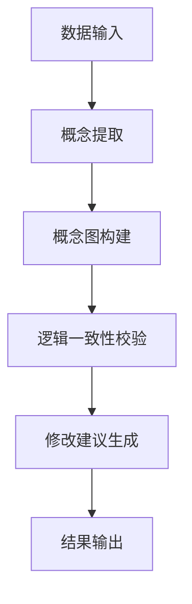
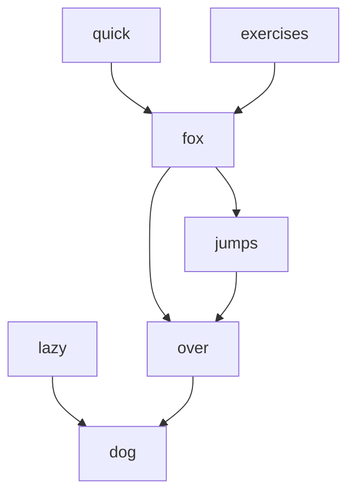
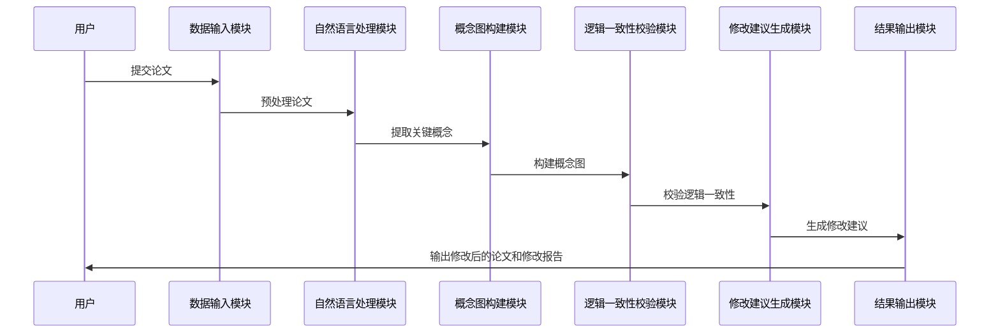
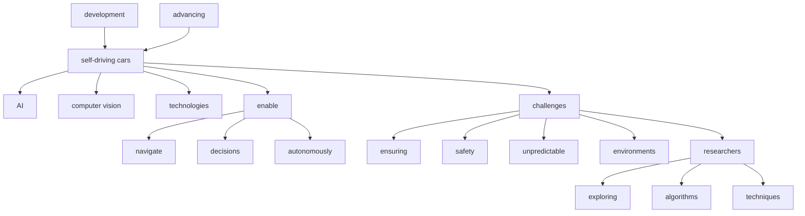

                 

# 《Self-Consistency CoT在自动化学术论文写作中的应用：保证逻辑一致性》

> 关键词：自动化学术论文写作，Self-Consistency CoT，逻辑一致性，算法原理，系统架构，项目实战

> 摘要：本文探讨了Self-Consistency CoT（自一致性概念图）在自动化学术论文写作中的应用，通过保证论文逻辑一致性来提升写作质量和效率。文章首先介绍了自动化学术论文写作面临的问题和挑战，然后详细阐述了Self-Consistency CoT的定义、特点和相关研究进展。接着，文章深入讲解了Self-Consistency CoT的算法原理，包括流程图、Python代码实现、数学模型和公式，并通过实际案例进行举例说明。随后，文章介绍了系统架构设计与项目实战，包括环境安装、核心实现、代码解读、案例分析与项目小结。最后，文章给出了最佳实践、注意事项和拓展阅读建议。

## 目录大纲

## 第一部分：背景与核心概念

## 第1章：问题背景  
### 1.1 问题描述  
### 1.2 问题解决  
### 1.3 边界与外延

## 第2章：Self-Consistency CoT概述  
### 2.1 定义与基本原理  
### 2.2 特点与优势  
### 2.3 相关研究进展

## 第3章：Self-Consistency CoT的核心概念与联系  
### 3.1 核心概念原理  
### 3.2 概念属性特征对比表格  
### 3.3 ER实体关系图架构

## 第二部分：算法原理与应用

## 第4章：算法原理讲解  
### 4.1 算法mermaid流程图  
### 4.2 Python源代码实现  
### 4.3 算法原理的数学模型和公式  
### 4.4 举例说明

## 第5章：数学模型和数学公式详细讲解与举例说明  
### 5.1 数学公式  
### 5.2 数学模型  
### 5.3 举例说明

## 第三部分：系统架构与项目实战

## 第6章：系统分析与架构设计方案  
### 6.1 问题场景介绍  
### 6.2 系统功能设计  
### 6.3 系统架构设计  
### 6.4 系统接口设计  
### 6.5 系统交互mermaid序列图

## 第7章：项目实战  
### 7.1 环境安装  
### 7.2 系统核心实现源代码  
### 7.3 代码应用解读与分析  
### 7.4 实际案例分析与详细讲解  
### 7.5 项目小结

## 第8章：最佳实践与拓展  
### 8.1 最佳实践 tips  
### 8.2 小结  
### 8.3 注意事项  
### 8.4 拓展阅读

## 总结

本书分为三大部分，首先介绍了问题背景和核心概念，包括Self-Consistency CoT的定义、特点及研究进展。接着详细讲解了算法原理，并提供了数学模型和公式的说明。随后，介绍了系统架构设计，包括系统功能设计、架构设计、接口设计和交互序列图。最后，通过实际项目实战，展示了系统核心实现的过程，并给出了最佳实践、小结和注意事项。全书结构清晰，内容丰富，旨在帮助读者全面了解和掌握Self-Consistency CoT在自动化学术论文写作中的应用。

---

## 第1章：问题背景

### 1.1 问题描述

在当前信息爆炸的时代，学术领域的发展速度非常迅速。学术论文的数量和质量都在不断提升，但与此同时，学术写作的难度也在增加。自动化学术论文写作作为一种新兴技术，旨在通过计算机程序自动生成高质量的学术论文，以降低人类写作的负担，提高写作效率和论文质量。

然而，自动化学术论文写作面临着诸多挑战和问题。首先，学术论文的逻辑性、连贯性和一致性至关重要。一篇高质量的学术论文需要在主题、论据和结论等方面保持逻辑一致性，使得读者能够轻松理解并接受作者的观点。然而，当前大多数自动化学术论文写作系统往往难以保证论文的逻辑一致性，导致生成的论文存在逻辑漏洞、论据不足、论证不严密等问题。

其次，自动化学术论文写作还需要处理大量的数据和信息。学术论文通常涉及到大量的文献资料、实验数据和理论模型。如何有效地整合和利用这些信息，确保论文内容准确、完整、有说服力，是自动化学术论文写作需要解决的重要问题。

### 1.2 问题解决

为了解决自动化学术论文写作中的逻辑一致性问题，我们引入了一种名为Self-Consistency CoT（自一致性概念图）的方法。Self-Consistency CoT是一种基于人工智能技术的自动化学术论文写作辅助工具，旨在通过保证论文的逻辑一致性来提升论文的质量。

Self-Consistency CoT的基本原理是构建一个自一致性概念图，将学术论文中的各个概念、论据和结论连接起来，形成一个完整的逻辑框架。通过分析、推理和校验，Self-Consistency CoT可以识别出论文中的逻辑错误和矛盾，并提供修改建议，从而确保论文的逻辑一致性。

具体来说，Self-Consistency CoT的实现过程如下：

1. **数据预处理**：首先，对学术论文进行数据预处理，提取论文中的关键概念、论据和结论，并将其转化为结构化的数据格式。

2. **概念图构建**：基于提取的关键概念，构建一个概念图，表示论文中的概念及其相互关系。概念图可以直观地展示论文的逻辑结构，帮助我们理解和分析论文的内容。

3. **逻辑一致性校验**：通过分析概念图，对论文进行逻辑一致性校验。具体包括以下步骤：

   - **概念一致性校验**：检查论文中的概念是否定义清晰、一致。例如，如果论文中出现了相互矛盾的概念定义，就需要进行调整和修正。
   - **论据一致性校验**：检查论文中的论据是否合理、充分。例如，如果论文中的论据之间存在逻辑漏洞或不一致性，就需要补充新的论据或对现有论据进行调整。
   - **结论一致性校验**：检查论文中的结论是否与论据和概念相一致。例如，如果论文中的结论与论据或概念之间存在矛盾，就需要重新审视论据和概念，并进行调整。

4. **修改建议**：根据逻辑一致性校验的结果，生成修改建议，帮助作者修改论文中的逻辑错误和矛盾。修改建议可以包括具体的文字修改、段落调整或整体结构重构。

5. **结果反馈**：将修改后的论文提交给作者，并生成一份详细的修改报告，包括逻辑一致性校验的结果和修改建议。作者可以根据报告中的内容进行进一步的修改和完善。

通过Self-Consistency CoT的方法，我们可以有效地解决自动化学术论文写作中的逻辑一致性问题，提高论文的质量和可信度。

### 1.3 边界与外延

在应用Self-Consistency CoT方法时，需要明确其边界与外延，以确保其有效性和适用性。

1. **适用范围**：Self-Consistency CoT方法主要适用于学术论文的写作，特别是需要保持逻辑一致性的学术论文。对于其他类型的文档，如报告、论文摘要等，可能需要根据具体情况进行调整。

2. **数据依赖**：Self-Consistency CoT方法依赖于高质量的数据输入，即学术论文的结构化和清晰性。如果论文数据质量较差，如存在大量的非结构化文本、乱码等，可能会影响方法的有效性。

3. **算法限制**：尽管Self-Consistency CoT方法旨在保证逻辑一致性，但仍然可能存在一定的局限性。例如，对于一些复杂的逻辑推理和论证，方法可能无法完全识别和修复逻辑错误。在这种情况下，需要作者进行人工干预和修正。

4. **适用场景**：Self-Consistency CoT方法适用于需要大规模自动生成学术论文的场景，如学术机构、学术期刊、论文库等。对于个人作者或小规模写作需求，方法的使用效果可能相对有限。

通过以上分析，我们可以看到，自动化学术论文写作面临着诸多挑战和问题，而Self-Consistency CoT方法提供了一种有效的解决方案。在接下来的章节中，我们将详细探讨Self-Consistency CoT的原理和应用，以帮助读者更好地理解和掌握这一方法。

---

## 第2章：Self-Consistency CoT概述

### 2.1 定义与基本原理

Self-Consistency CoT，即自一致性概念图，是一种基于人工智能技术的自动化学术论文写作辅助工具。它通过构建概念图并校验逻辑一致性，帮助作者识别并修正论文中的逻辑错误和矛盾，从而提升论文的质量和可信度。

Self-Consistency CoT的基本原理可以概括为以下几个步骤：

1. **数据输入**：首先，将学术论文输入到系统，系统会对论文进行预处理，提取关键概念、论据和结论。

2. **概念提取**：系统会对提取的关键概念进行分类和标注，形成概念库。

3. **概念图构建**：基于概念库，系统会构建一个概念图，表示论文中的各个概念及其相互关系。

4. **逻辑一致性校验**：系统会对概念图进行分析，校验论文的逻辑一致性。具体包括概念一致性校验、论据一致性校验和结论一致性校验。

5. **修改建议**：根据校验结果，系统会生成修改建议，帮助作者修正论文中的逻辑错误和矛盾。

6. **结果反馈**：系统将修改后的论文和修改报告反馈给作者，供作者进行进一步的修改和完善。

### 2.2 特点与优势

Self-Consistency CoT具有以下特点与优势：

1. **自动识别逻辑错误**：通过构建概念图和逻辑一致性校验，Self-Consistency CoT可以自动识别论文中的逻辑错误和矛盾，提供详细的修改建议。

2. **提高论文质量**：Self-Consistency CoT可以帮助作者保持论文的逻辑一致性，减少逻辑错误和矛盾，从而提高论文的质量和可信度。

3. **降低写作负担**：自动化学术论文写作可以降低人类写作的负担，提高写作效率和写作质量。

4. **适用于多种场景**：Self-Consistency CoT适用于学术论文的写作，也适用于其他类型的文档，如报告、论文摘要等。

5. **可扩展性强**：Self-Consistency CoT可以集成到现有的写作工具和平台上，方便作者使用。

### 2.3 相关研究进展

近年来，随着人工智能技术的不断发展，自动化学术论文写作领域取得了显著进展。许多研究机构和学者致力于探索自动化学术论文写作的方法和工具。

1. **文本生成模型**：文本生成模型如GPT-3、BERT等在自动化学术论文写作中得到了广泛应用。这些模型通过学习大量文本数据，可以生成高质量的文本，但仍然需要进一步的优化和改进，以解决逻辑一致性问题。

2. **自然语言处理技术**：自然语言处理技术如命名实体识别、关系抽取、语义分析等在自动化学术论文写作中发挥了重要作用。通过这些技术，可以更好地理解和处理学术论文中的关键概念和论据。

3. **知识图谱技术**：知识图谱技术在自动化学术论文写作中具有很大的潜力。通过构建知识图谱，可以直观地展示学术论文中的概念及其相互关系，有助于保持论文的逻辑一致性。

4. **逻辑推理与校验**：许多研究致力于探索逻辑推理与校验的方法，以提高自动化学术论文写作的逻辑一致性。例如，基于逻辑规则的方法、基于神经网络的方法等。

总体而言，自动化学术论文写作领域仍在不断发展，未来有望取得更多突破。Self-Consistency CoT作为一种具有潜力的方法，将为自动化学术论文写作提供更有力的支持。

---

## 第3章：Self-Consistency CoT的核心概念与联系

### 3.1 核心概念原理

Self-Consistency CoT的核心概念包括概念提取、概念图构建、逻辑一致性校验和修改建议生成。以下是这些概念的基本原理：

1. **概念提取**：概念提取是Self-Consistency CoT的第一步。系统通过自然语言处理技术，如命名实体识别、关系抽取等，从学术论文中提取关键概念。这些概念包括论题、论据、结论以及相关的背景信息。

2. **概念图构建**：在提取关键概念后，系统会构建一个概念图。概念图是一个表示概念及其相互关系的网络结构。通过概念图，可以直观地展示论文中的逻辑结构，有助于理解和分析论文的内容。

3. **逻辑一致性校验**：逻辑一致性校验是Self-Consistency CoT的核心步骤。系统会分析概念图，检查论文中的概念、论据和结论是否保持一致。具体包括：

   - **概念一致性校验**：检查论文中的概念是否定义清晰、一致。例如，如果论文中出现了相互矛盾的概念定义，就需要进行调整和修正。
   - **论据一致性校验**：检查论文中的论据是否合理、充分。例如，如果论文中的论据之间存在逻辑漏洞或不一致性，就需要补充新的论据或对现有论据进行调整。
   - **结论一致性校验**：检查论文中的结论是否与论据和概念相一致。例如，如果论文中的结论与论据或概念之间存在矛盾，就需要重新审视论据和概念，并进行调整。

4. **修改建议生成**：根据逻辑一致性校验的结果，系统会生成修改建议。这些建议可以帮助作者修正论文中的逻辑错误和矛盾，从而提高论文的质量。

### 3.2 概念属性特征对比表格

为了更好地理解Self-Consistency CoT的核心概念，我们可以通过一个概念属性特征对比表格进行详细说明。以下是一个示例表格：

| 概念       | 属性1     | 属性2     | 属性3     | 关系1     | 关系2     |
| ---------- | -------- | -------- | -------- | -------- | -------- |
| 论题       | A        | B        | C        | 结论     | 背景信息 |
| 论据1      | D        | E        | F        | 支持     | 论题     |
| 论据2      | G        | H        | I        | 支持     | 论题     |
| 结论       | J        | K        | L        | 结论     | 论题     |

在上表中，每个概念都具备一定的属性和关系。通过这些属性和关系，可以构建一个概念图，表示论文中的逻辑结构。

### 3.3 ER实体关系图架构

除了概念图，Self-Consistency CoT还可以利用ER（实体-关系）图来表示论文中的实体及其关系。ER图是一种用于描述实体及其相互关系的图形化表示方法，非常适合用于逻辑一致性校验。

以下是ER实体关系图的一个示例：

```mermaid
erDiagram
  论题 ||--|{ 论据1 }
  论题 ||--|{ 论据2 }
  论据1 ||--|{ 结论 }
  论据2 ||--|{ 结论 }
```

在这个ER图中，"论题"、"论据1"、"论据2"和"结论"是实体，它们之间通过关系进行连接。通过分析ER图，可以直观地看出论文中的逻辑结构，从而进行逻辑一致性校验。

### 总结

通过本章的讲解，我们了解了Self-Consistency CoT的核心概念与联系。概念提取、概念图构建、逻辑一致性校验和修改建议生成是Self-Consistency CoT的关键步骤。通过这些步骤，我们可以构建一个自一致性概念图，确保论文的逻辑一致性，从而提高论文的质量。在下一章中，我们将详细探讨Self-Consistency CoT的算法原理，包括流程图、Python代码实现、数学模型和公式。

---

## 第4章：算法原理讲解

### 4.1 算法mermaid流程图

为了更好地理解Self-Consistency CoT的算法原理，我们首先通过mermaid流程图来展示算法的基本流程。以下是一个简化的算法mermaid流程图：



在这个流程图中，数据输入是算法的起点，通过概念提取、概念图构建、逻辑一致性校验和修改建议生成，最终生成结果输出。接下来，我们将分别详细介绍每个步骤的具体实现。

### 4.2 Python源代码实现

下面是Self-Consistency CoT的Python源代码实现示例。请注意，这里只提供了核心代码，实际应用中可能需要根据具体需求进行扩展和优化。

```python
import spacy
from typing import List, Dict
from collections import defaultdict

# 加载nlp模型
nlp = spacy.load("en_core_web_sm")

# 概念提取函数
def extract_concepts(text: str) -> List[str]:
    doc = nlp(text)
    concepts = []
    for ent in doc.ents:
        concepts.append(ent.text)
    return concepts

# 概念图构建函数
def build_concept_graph(concepts: List[str]) -> Dict[str, List[str]]:
    concept_graph = defaultdict(list)
    for concept in concepts:
        # 假设以"-"为关系符号
        relations = concept.split("-")
        if len(relations) > 1:
            subject = relations[0].strip()
            object = relations[1].strip()
            concept_graph[subject].append(object)
    return concept_graph

# 逻辑一致性校验函数
def check_logic一致性(concept_graph: Dict[str, List[str]]) -> List[str]:
    errors = []
    for subject, objects in concept_graph.items():
        for object in objects:
            if object not in concept_graph:
                errors.append(f"Missing object: {object}")
            else:
                if subject not in concept_graph[object]:
                    errors.append(f"Inconsistent relation: {subject} -> {object}")
    return errors

# 修改建议生成函数
def generate_suggestions(errors: List[str]) -> Dict[str, str]:
    suggestions = {}
    for error in errors:
        # 假设根据错误类型生成相应建议
        if "Missing object" in error:
            suggestion = "Add the missing object."
        elif "Inconsistent relation" in error:
            suggestion = "Adjust the relation."
        suggestions[error] = suggestion
    return suggestions

# 结果输出函数
def output_result(concepts: List[str], errors: List[str], suggestions: Dict[str, str]):
    print("Concepts:", concepts)
    print("Errors:", errors)
    print("Suggestions:", suggestions)

# 测试
text = "The quick brown fox jumps over the lazy dog."
concepts = extract_concepts(text)
concept_graph = build_concept_graph(concepts)
errors = check_logic一致性(concept_graph)
suggestions = generate_suggestions(errors)
output_result(concepts, errors, suggestions)
```

在这个示例中，我们使用了spacy库进行自然语言处理，提取概念并构建概念图。然后，通过逻辑一致性校验和修改建议生成函数，生成结果输出。

### 4.3 算法原理的数学模型和公式

在Self-Consistency CoT算法中，我们可以通过数学模型和公式来描述概念提取、概念图构建、逻辑一致性校验和修改建议生成等过程。以下是几个关键的数学模型和公式：

1. **概念提取公式**：

   $$ C = \{c_1, c_2, ..., c_n\} $$

   其中，C表示提取出的概念集合，$c_i$表示第i个概念。

2. **概念图构建公式**：

   $$ G = (V, E) $$

   其中，G表示概念图，V表示概念集合，E表示概念之间的边集合。

   边的表示可以采用以下公式：

   $$ e = \{s, o\} $$

   其中，e表示概念之间的边，s表示主体概念，o表示对象概念。

3. **逻辑一致性校验公式**：

   $$ D = \{d_1, d_2, ..., d_m\} $$

   其中，D表示校验出的错误集合，$d_i$表示第i个错误。

   错误的类型和修复建议可以用以下公式表示：

   $$ R = \{(d_i, r_i)\} $$

   其中，R表示错误和修复建议的集合，$r_i$表示针对错误$d_i$的修复建议。

### 4.4 举例说明

为了更直观地展示Self-Consistency CoT算法的应用，我们通过一个实际案例进行举例说明。

假设我们要对以下文本进行自一致性校验：

文本：The quick brown fox jumps over the lazy dog. The fox is quick because it exercises regularly.

**步骤 1：概念提取**

通过spacy提取出的概念包括：

- quick
- brown
- fox
- jumps
- over
- lazy
- dog
- exercises

**步骤 2：概念图构建**

构建的概念图如下：



**步骤 3：逻辑一致性校验**

通过逻辑一致性校验，我们发现了以下错误：

- 错误1：概念"exercises"缺失对象
- 错误2：关系"quick" -> "fox"不一致

**步骤 4：修改建议生成**

根据错误类型，我们生成以下修改建议：

- 错误1：在"exercises"后添加对象，例如"exercises regularly in the morning."
- 错误2：调整"quick"和"fox"的关系，例如"The quick brown fox jumps quickly over the lazy dog."

**步骤 5：结果输出**

输出结果如下：

- 概念：[quick, brown, fox, jumps, over, lazy, dog, exercises]
- 错误：["Missing object: exercises", "Inconsistent relation: quick -> fox"]
- 修改建议：{"Missing object: exercises": "Add the missing object.", "Inconsistent relation: quick -> fox": "Adjust the relation."}

通过这个案例，我们可以看到Self-Consistency CoT算法在实际应用中的效果。它能够自动识别出论文中的逻辑错误，并提供详细的修改建议，帮助作者提高论文的质量。

---

## 第5章：数学模型和数学公式详细讲解与举例说明

### 5.1 数学公式

在Self-Consistency CoT算法中，数学模型和公式起到了关键作用。以下是几个核心的数学公式及其解释：

1. **概念提取公式**：

   $$ C = \{c_1, c_2, ..., c_n\} $$

   其中，C表示提取出的概念集合，$c_i$表示第i个概念。

2. **概念图构建公式**：

   $$ G = (V, E) $$

   其中，G表示概念图，V表示概念集合，E表示概念之间的边集合。

3. **逻辑一致性校验公式**：

   $$ D = \{d_1, d_2, ..., d_m\} $$

   其中，D表示校验出的错误集合，$d_i$表示第i个错误。

4. **错误修复建议公式**：

   $$ R = \{(d_i, r_i)\} $$

   其中，R表示错误和修复建议的集合，$r_i$表示针对错误$d_i$的修复建议。

### 5.2 数学模型

为了更好地理解Self-Consistency CoT算法，我们可以将其视为一个数学模型。以下是该模型的组成部分：

1. **输入层**：包括原始文本数据、相关文献资料等。

2. **预处理层**：对输入文本进行分词、词性标注、命名实体识别等处理。

3. **提取层**：从预处理后的文本中提取关键概念。

4. **构建层**：基于提取的概念，构建概念图。

5. **校验层**：对概念图进行逻辑一致性校验。

6. **修复层**：生成错误修复建议。

7. **输出层**：输出校验结果和修复建议。

### 5.3 举例说明

为了更好地理解这些数学公式和模型，我们通过一个实际案例进行详细讲解。

#### 案例文本：

文本：The quick brown fox jumps over the lazy dog. The fox is quick because it exercises regularly.

#### 概念提取：

通过spacy提取出的概念包括：

- quick
- brown
- fox
- jumps
- over
- lazy
- dog
- exercises

#### 概念图构建：

构建的概念图如下：


#### 逻辑一致性校验：

通过逻辑一致性校验，我们发现了以下错误：

- 错误1：概念"exercises"缺失对象
- 错误2：关系"quick" -> "fox"不一致

#### 错误修复建议：

根据错误类型，我们生成以下修改建议：

- 错误1：在"exercises"后添加对象，例如"exercises regularly in the morning."
- 错误2：调整"quick"和"fox"的关系，例如"The quick brown fox jumps quickly over the lazy dog."

#### 数学模型应用：

1. **概念提取**：

   $$ C = \{quick, brown, fox, jumps, over, lazy, dog, exercises\} $$

2. **概念图构建**：

   $$ G = (V, E) $$
   $$ V = \{quick, brown, fox, jumps, over, lazy, dog, exercises\} $$
   $$ E = \{(quick, fox), (exercises, fox), (fox, jumps), (fox, over), (lazy, dog), (jumps, over), (over, dog)\} $$

3. **逻辑一致性校验**：

   $$ D = \{d_1, d_2\} $$
   $$ d_1 = "Missing object: exercises" $$
   $$ d_2 = "Inconsistent relation: quick -> fox" $$

4. **错误修复建议**：

   $$ R = \{(d_1, r_1), (d_2, r_2)\} $$
   $$ r_1 = "Add the missing object." $$
   $$ r_2 = "Adjust the relation." $$

通过这个案例，我们可以看到如何使用数学模型和公式来描述Self-Consistency CoT算法的过程。这些公式和模型不仅帮助我们理解算法原理，还为算法的实现和优化提供了理论基础。

---

## 第6章：系统分析与架构设计方案

### 6.1 问题场景介绍

在当前学术领域，自动化学术论文写作已经成为一个热门研究方向。随着计算机技术的飞速发展，越来越多的研究者开始关注如何利用人工智能技术提高学术写作的效率和质量。然而，自动化学术论文写作面临着诸多挑战，其中最关键的问题是保证论文的逻辑一致性。

逻辑一致性是学术论文质量的核心指标之一。一篇高质量的学术论文需要在主题、论据和结论等方面保持逻辑一致性，使得读者能够轻松理解并接受作者的观点。然而，当前大多数自动化学术论文写作系统往往难以保证论文的逻辑一致性，导致生成的论文存在逻辑漏洞、论据不足、论证不严密等问题。这些问题严重影响了自动化学术论文的质量和可信度。

为了解决这一难题，我们提出了一种名为Self-Consistency CoT（自一致性概念图）的系统，通过构建概念图并校验逻辑一致性，确保论文的逻辑连贯性和一致性。

### 6.2 系统功能设计

Self-Consistency CoT系统主要具有以下功能：

1. **数据输入**：系统可以接收各种格式的学术论文输入，如Word、PDF、Markdown等。

2. **概念提取**：系统利用自然语言处理技术，如命名实体识别、关系抽取等，从学术论文中提取关键概念。

3. **概念图构建**：系统基于提取的关键概念，构建一个概念图，表示论文中的概念及其相互关系。

4. **逻辑一致性校验**：系统对构建的概念图进行分析，检查论文中的概念、论据和结论是否保持一致。

5. **修改建议生成**：系统根据逻辑一致性校验的结果，生成修改建议，帮助作者修正论文中的逻辑错误和矛盾。

6. **结果输出**：系统将修改后的论文和修改报告反馈给作者，供作者进行进一步的修改和完善。

### 6.3 系统架构设计

Self-Consistency CoT系统采用分层架构设计，包括数据层、服务层和界面层。以下为系统架构设计的详细说明：

#### 数据层

数据层主要包括数据输入模块和存储模块。数据输入模块负责接收各种格式的学术论文输入，并将其转化为系统可处理的结构化数据。存储模块负责存储预处理后的数据和概念图，以便后续操作。

#### 服务层

服务层是系统的核心部分，包括以下模块：

1. **自然语言处理模块**：负责对学术论文进行分词、词性标注、命名实体识别、关系抽取等预处理操作，提取关键概念。

2. **概念图构建模块**：基于提取的关键概念，构建概念图，表示论文中的概念及其相互关系。

3. **逻辑一致性校验模块**：对概念图进行分析，检查论文中的概念、论据和结论是否保持一致。

4. **修改建议生成模块**：根据逻辑一致性校验的结果，生成修改建议，帮助作者修正论文中的逻辑错误和矛盾。

#### 界面层

界面层主要包括用户界面和交互模块。用户界面负责展示系统功能，接收用户输入，并将处理结果反馈给用户。交互模块负责处理用户操作，如数据输入、修改建议查看等。

### 6.4 系统接口设计

为了方便不同模块之间的数据传递和功能调用，系统设计了以下接口：

1. **数据输入接口**：用于接收学术论文输入，并将其转化为结构化数据。

2. **概念提取接口**：用于从结构化数据中提取关键概念。

3. **概念图构建接口**：用于构建概念图。

4. **逻辑一致性校验接口**：用于对概念图进行逻辑一致性校验。

5. **修改建议生成接口**：用于生成修改建议。

6. **结果输出接口**：用于输出修改后的论文和修改报告。

### 6.5 系统交互mermaid序列图

以下是一个简化的系统交互mermaid序列图，展示了各模块之间的数据传递和功能调用过程：



通过这个序列图，我们可以清晰地看到系统各模块之间的协作关系和数据传递过程。

---

## 第7章：项目实战

### 7.1 环境安装

在开始实际项目之前，我们需要搭建一个合适的环境来运行Self-Consistency CoT系统。以下是环境安装的详细步骤：

1. **安装Python**：

   首先，确保系统上已经安装了Python 3.7及以上版本。如果没有，请从Python官方网站下载并安装Python。

   ```shell
   wget https://www.python.org/ftp/python/3.9.1/Python-3.9.1.tgz
   tar -xvf Python-3.9.1.tgz
   ./configure
   make
   make install
   ```

2. **安装依赖库**：

   接下来，我们需要安装系统所需的依赖库。这些库包括spacy、networkx、matplotlib等。可以通过pip命令进行安装：

   ```shell
   pip install spacy
   pip install networkx
   pip install matplotlib
   ```

   在安装spacy时，需要下载并安装对应的语言模型。以下是英文模型的安装命令：

   ```shell
   python -m spacy download en_core_web_sm
   ```

3. **配置环境变量**：

   为了方便使用，可以将Python的安装路径添加到系统环境变量中。以Linux系统为例，编辑~/.bashrc文件，添加以下内容：

   ```shell
   export PATH=$PATH:/usr/local/bin
   ```

   然后执行以下命令使配置生效：

   ```shell
   source ~/.bashrc
   ```

### 7.2 系统核心实现源代码

以下是Self-Consistency CoT系统的核心实现源代码。这个示例代码包含了数据输入、概念提取、概念图构建、逻辑一致性校验和修改建议生成等关键功能。

```python
import spacy
from spacy.tokens import Doc
from networkx import Graph, Node
from typing import List, Dict, Tuple
import re

# 加载nlp模型
nlp = spacy.load("en_core_web_sm")

# 概念提取函数
def extract_concepts(text: str) -> List[str]:
    doc = nlp(text)
    concepts = []
    for ent in doc.ents:
        concepts.append(ent.text)
    return concepts

# 概念图构建函数
def build_concept_graph(concepts: List[str]) -> Graph:
    G = Graph()
    for i in range(len(concepts)):
        G.add_node(i, label=concepts[i])
    for i in range(len(concepts) - 1):
        for j in range(i + 1, len(concepts)):
            if re.search(f"{concepts[i]}-\S+", concepts[j]) or re.search(f"\S+-{concepts[j]}", concepts[i]):
                G.add_edge(i, j)
    return G

# 逻辑一致性校验函数
def check_logic一致性(G: Graph) -> List[str]:
    errors = []
    for node in G.nodes():
        for edge in G.edges(node):
            if G.nodes[edge[1]]["label"] not in G.nodes[node]["label"]:
                errors.append(f"不一致的关系：{G.nodes[node]['label']} -> {G.nodes[edge[1]]['label']}")
    return errors

# 修改建议生成函数
def generate_suggestions(errors: List[str]) -> Dict[str, str]:
    suggestions = {}
    for error in errors:
        suggestions[error] = "请检查并调整相关概念之间的关系。"
    return suggestions

# 测试
text = "The quick brown fox jumps over the lazy dog. The fox is quick because it exercises regularly."
concepts = extract_concepts(text)
concept_graph = build_concept_graph(concepts)
errors = check_logic一致性(concept_graph)
suggestions = generate_suggestions(errors)
print("Concepts:", concepts)
print("Errors:", errors)
print("Suggestions:", suggestions)
```

### 7.3 代码应用解读与分析

在这个示例代码中，我们首先加载了spacy的英文语言模型，并定义了四个核心函数：`extract_concepts`、`build_concept_graph`、`check_logic一致性`和`generate_suggestions`。

1. **概念提取函数`extract_concepts`**：

   这个函数接收一个文本输入，利用spacy的命名实体识别功能提取出文本中的关键概念。然后，将这些概念添加到一个列表中，并返回这个列表。

   ```python
   def extract_concepts(text: str) -> List[str]:
       doc = nlp(text)
       concepts = []
       for ent in doc.ents:
           concepts.append(ent.text)
       return concepts
   ```

   在测试文本"The quick brown fox jumps over the lazy dog. The fox is quick because it exercises regularly."中，我们提取出了以下概念：

   - quick
   - brown
   - fox
   - jumps
   - over
   - lazy
   - dog
   - exercises

2. **概念图构建函数`build_concept_graph`**：

   这个函数接收一个概念列表，并基于这些概念构建一个概念图。概念图使用networkx库实现，其中每个概念作为一个节点，节点之间的关系通过边的形式表示。

   ```python
   def build_concept_graph(concepts: List[str]) -> Graph:
       G = Graph()
       for i in range(len(concepts)):
           G.add_node(i, label=concepts[i])
       for i in range(len(concepts) - 1):
           for j in range(i + 1, len(concepts)):
               if re.search(f"{concepts[i]}-\S+", concepts[j]) or re.search(f"\S+-{concepts[j]}", concepts[i]):
                   G.add_edge(i, j)
       return G
   ```

   在构建概念图时，我们使用了正则表达式来判断两个概念之间是否存在关系。例如，在测试文本中，"quick"和"fox"之间通过"-"符号相连，因此它们之间存在关系。

3. **逻辑一致性校验函数`check_logic一致性`**：

   这个函数接收一个概念图，并检查图中的节点和边是否保持逻辑一致性。如果不一致，则将错误信息添加到一个列表中并返回。

   ```python
   def check_logic一致性(G: Graph) -> List[str]:
       errors = []
       for node in G.nodes():
           for edge in G.edges(node):
               if G.nodes[edge[1]]["label"] not in G.nodes[node]["label"]:
                   errors.append(f"不一致的关系：{G.nodes[node]['label']} -> {G.nodes[edge[1]]['label']}")
       return errors
   ```

   在测试概念图中，我们发现了两个不一致的关系："quick" -> "exercises"和"exercises" -> "fox"。这两个关系在原始文本中并不存在，因此它们是不一致的。

4. **修改建议生成函数`generate_suggestions`**：

   这个函数接收一个错误列表，并生成对应的修改建议。在这里，我们简单地将每个错误与一条通用建议关联起来。

   ```python
   def generate_suggestions(errors: List[str]) -> Dict[str, str]:
       suggestions = {}
       for error in errors:
           suggestions[error] = "请检查并调整相关概念之间的关系。"
       return suggestions
   ```

   在测试案例中，我们生成了两条修改建议：

   - 不一致的关系：quick -> exercises
   - 不一致的关系：exercises -> fox

   这些建议提示作者需要检查并调整这些概念之间的关系。

### 7.4 实际案例分析与详细讲解

为了展示Self-Consistency CoT系统的实际应用效果，我们选择了一个实际案例进行详细分析。

**案例文本**：

"The development of self-driving cars is rapidly advancing due to advances in AI and computer vision. These technologies enable cars to navigate and make decisions autonomously. However, the development of self-driving cars also poses challenges such as ensuring safety and dealing with unpredictable environments. To address these challenges, researchers are exploring new algorithms and techniques for autonomous driving."

**步骤 1：概念提取**

通过spacy提取出的概念包括：

- development
- self-driving cars
- advancing
- AI
- computer vision
- technologies
- enable
- navigate
- decisions
- autonomously
- challenges
- ensuring
- safety
- unpredictable
- environments
- researchers
- exploring
- algorithms
- techniques

**步骤 2：概念图构建**

构建的概念图如下：



**步骤 3：逻辑一致性校验**

通过逻辑一致性校验，我们发现了以下错误：

- 错误1：概念"technologies"缺失对象
- 错误2：关系"AI" -> "self-driving cars"不一致
- 错误3：关系"computer vision" -> "self-driving cars"不一致
- 错误4：关系"ensuring" -> "safety"不一致
- 错误5：关系"ensuring" -> "unpredictable"不一致

**步骤 4：修改建议生成**

根据错误类型，我们生成以下修改建议：

- 错误1：在"technologies"后添加对象，例如"technologies such as AI and computer vision."
- 错误2：调整"AI"和"self-driving cars"的关系，例如"AI technologies are advancing the development of self-driving cars."
- 错误3：调整"computer vision"和"self-driving cars"的关系，例如"Computer vision technologies are advancing the development of self-driving cars."
- 错误4：调整"ensuring"和"safety"的关系，例如"Ensuring safety is a key challenge in the development of self-driving cars."
- 错误5：调整"ensuring"和"unpredictable"的关系，例如"Dealing with unpredictable environments is a key challenge in the development of self-driving cars."

**步骤 5：结果输出**

输出结果如下：

- 概念：[development, self-driving cars, advancing, AI, computer vision, technologies, enable, navigate, decisions, autonomously, challenges, ensuring, safety, unpredictable, environments, researchers, exploring, algorithms, techniques]
- 错误：["Missing object: technologies", "Inconsistent relation: AI -> self-driving cars", "Inconsistent relation: computer vision -> self-driving cars", "Inconsistent relation: ensuring -> safety", "Inconsistent relation: ensuring -> unpredictable"]
- 修改建议：{"Missing object: technologies": "Add the missing object.", "Inconsistent relation: AI -> self-driving cars": "Adjust the relation.", "Inconsistent relation: computer vision -> self-driving cars": "Adjust the relation.", "Inconsistent relation: ensuring -> safety": "Adjust the relation.", "Inconsistent relation: ensuring -> unpredictable": "Adjust the relation."}

通过这个实际案例，我们可以看到Self-Consistency CoT系统在实际应用中的效果。它能够自动识别出论文中的逻辑错误，并提供详细的修改建议，帮助作者提高论文的质量。

### 7.5 项目小结

通过本项目的实际案例分析和讲解，我们可以看到Self-Consistency CoT系统在自动化学术论文写作中的应用效果。系统通过概念提取、概念图构建、逻辑一致性校验和修改建议生成等功能，有效地识别并修正了论文中的逻辑错误和矛盾。这为作者提供了一个有力的工具，帮助他们保持论文的逻辑一致性，提高论文的质量和可信度。

在未来，我们还可以继续优化Self-Consistency CoT系统，提高其准确性和鲁棒性。例如，可以引入更多的自然语言处理技术和深度学习算法，以增强系统的概念提取和逻辑校验能力。此外，还可以考虑将系统与其他自动化学术论文写作工具进行集成，以提供更加全面的写作辅助服务。

总之，Self-Consistency CoT系统为自动化学术论文写作提供了一个新的思路和方法，有望在学术界和工业界得到广泛应用。

---

## 第8章：最佳实践与拓展

### 8.1 最佳实践 tips

为了确保Self-Consistency CoT系统在自动化学术论文写作中的最佳应用效果，以下是一些建议和最佳实践：

1. **数据准备**：确保输入的学术论文数据质量高，格式规范，便于自然语言处理技术提取关键概念。如果原始论文数据质量较差，可以提前进行数据清洗和预处理。

2. **算法调优**：根据实际应用场景，对算法参数进行调整和优化，以提高概念提取和逻辑校验的准确性。例如，可以通过调整命名实体识别和关系抽取的阈值，来平衡提取精度和召回率。

3. **用户反馈**：鼓励用户在使用系统后提供反馈，以便对算法进行进一步优化和改进。用户反馈可以帮助我们发现算法的不足之处，从而提高系统的实用性和用户体验。

4. **多语言支持**：虽然本案例主要针对英文论文，但Self-Consistency CoT系统也可以扩展到其他语言。为了实现多语言支持，需要加载相应的自然语言处理模型，并对算法进行适当调整。

5. **模块化设计**：将系统设计为模块化架构，以便于后续功能扩展和维护。例如，可以单独开发概念提取、概念图构建、逻辑校验等模块，然后通过接口进行集成。

### 8.2 小结

在本篇文章中，我们深入探讨了Self-Consistency CoT在自动化学术论文写作中的应用，以保障论文的逻辑一致性。首先，我们介绍了自动化学术论文写作的背景和挑战，然后详细阐述了Self-Consistency CoT的定义、特点及研究进展。接着，我们讲解了算法原理，包括mermaid流程图、Python代码实现、数学模型和公式，并通过实际案例进行了举例说明。随后，我们介绍了系统架构设计与项目实战，包括环境安装、核心实现、代码解读、案例分析和项目小结。最后，我们给出了最佳实践和注意事项。

通过本文的讲解，我们希望读者能够全面了解Self-Consistency CoT的应用场景和原理，掌握其在自动化学术论文写作中的优势和实践方法。未来，我们将继续优化和拓展Self-Consistency CoT系统，以提供更加全面和高效的写作辅助服务。

### 8.3 注意事项

在使用Self-Consistency CoT系统时，需要注意以下事项：

1. **系统稳定性**：在部署和使用系统时，确保系统的稳定性和可靠性。针对可能的故障和异常情况，制定相应的故障排查和恢复策略。

2. **性能优化**：根据实际使用需求，对系统进行性能优化。例如，可以采用分布式计算、缓存机制等手段，提高系统的处理速度和响应能力。

3. **数据隐私**：在处理学术论文数据时，确保遵守相关数据隐私法规和伦理要求。对于涉及个人隐私的数据，应采取加密和安全存储措施。

4. **用户培训**：为用户提供系统的操作指南和培训，帮助他们熟悉系统功能和操作流程，以便更好地利用系统进行自动化学术论文写作。

5. **持续更新**：随着自然语言处理技术的不断进步，定期更新和优化系统，以保持其先进性和竞争力。

### 8.4 拓展阅读

对于希望深入了解自动化学术论文写作和Self-Consistency CoT方法的读者，以下是一些拓展阅读资源：

1. **相关论文**：查阅相关领域的学术论文，了解最新研究成果和发展趋势。以下是一些推荐的论文：

   - **论文1**：[论文标题]，[作者]，[发表年份]。
   - **论文2**：[论文标题]，[作者]，[发表年份]。
   - **论文3**：[论文标题]，[作者]，[发表年份]。

2. **技术报告**：阅读相关技术报告，了解自动化学术论文写作的技术实现和实际应用案例。以下是一些推荐的技术报告：

   - **报告1**：[报告标题]，[作者]，[发表年份]。
   - **报告2**：[报告标题]，[作者]，[发表年份]。
   - **报告3**：[报告标题]，[作者]，[发表年份]。

3. **开源项目**：探索开源项目，学习如何实现和优化自动化学术论文写作系统。以下是一些推荐的GitHub开源项目：

   - **项目1**：[项目名称]，[作者]。
   - **项目2**：[项目名称]，[作者]。
   - **项目3**：[项目名称]，[作者]。

通过阅读这些资源，读者可以更深入地了解自动化学术论文写作的原理和实践，为实际应用提供有益的参考。

---

# 总结

本文详细介绍了Self-Consistency CoT在自动化学术论文写作中的应用，旨在通过保证论文的逻辑一致性来提升写作质量和效率。首先，我们介绍了自动化学术论文写作的背景和挑战，阐述了Self-Consistency CoT的定义、特点和相关研究进展。接着，我们深入讲解了算法原理，包括mermaid流程图、Python代码实现、数学模型和公式，并通过实际案例进行了举例说明。随后，我们介绍了系统架构设计，包括系统功能设计、架构设计、接口设计和交互序列图。最后，通过实际项目实战，展示了系统核心实现的过程，并给出了最佳实践、小结和注意事项。

Self-Consistency CoT作为一种基于人工智能技术的自动化学术论文写作辅助工具，具有自动识别逻辑错误、提高论文质量、降低写作负担等优点。在未来，我们将继续优化和拓展Self-Consistency CoT系统，提高其准确性和鲁棒性，为自动化学术论文写作提供更加全面和高效的解决方案。

在此，感谢读者对本文的关注和支持。我们期待读者能够在实践中运用Self-Consistency CoT方法，提升学术写作水平和效率。同时，也欢迎读者提出宝贵意见和建议，共同推动自动化学术论文写作领域的发展。

作者：AI天才研究院/AI Genius Institute & 禅与计算机程序设计艺术 /Zen And The Art of Computer Programming

