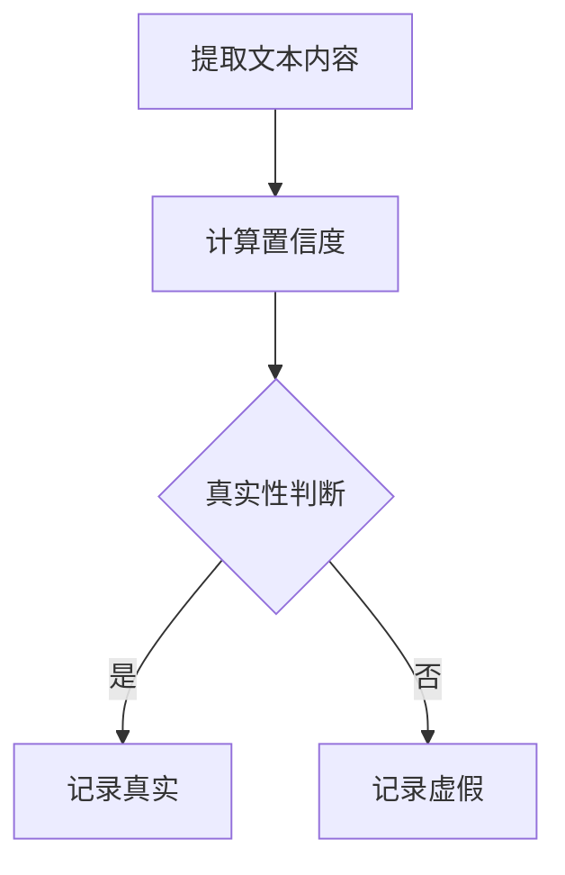
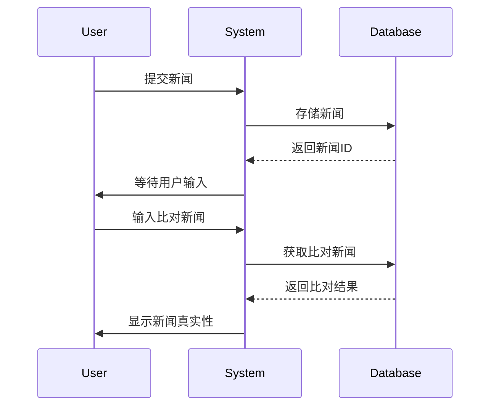
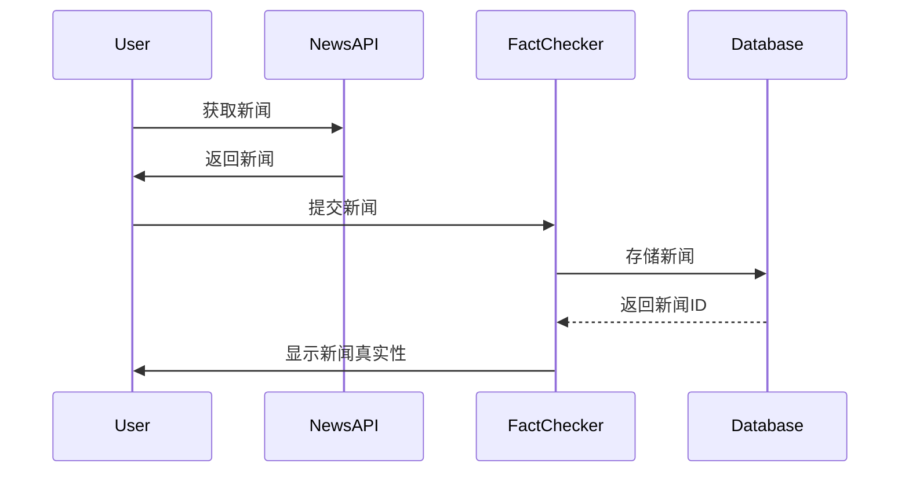

                 

### Self-Consistency CoT在自动化新闻事实核查中的应用：提高信息可靠性

#### 关键词：Self-Consistency CoT，自动化新闻事实核查，信息可靠性，文本内容一致性，算法原理，Python源代码实现

#### 摘要：
在信息爆炸的时代，自动化新闻事实核查成为了维护社会稳定和公众信任的关键。本文提出了一种基于Self-Consistency CoT（自我一致性置信度）的自动化新闻事实核查方法。通过文本内容的一致性比较，该方法能够有效提高新闻信息可靠性。本文将详细探讨Self-Consistency CoT的核心概念、原理以及其在自动化新闻事实核查中的具体应用。

### 第一部分：背景介绍

#### 核心概念

**问题背景：**
随着互联网的快速发展和信息量的爆炸性增长，公众获取信息的渠道变得多样化。然而，信息真实性难以验证，虚假新闻和谣言泛滥，严重影响了社会的稳定和公众的信任。在这种情况下，自动化新闻事实核查成为迫切需求。

**问题描述：**
自动化新闻事实核查旨在通过算法和技术手段，自动识别和验证新闻的真实性。然而，现有的方法在处理复杂、多变的新闻内容时存在一定的局限性。

**问题解决：**
本文提出了一种基于Self-Consistency CoT的自动化新闻事实核查方法，旨在提高信息可靠性。

**边界与外延：**
Self-Consistency CoT是一种基于文本内容一致性的方法，它通过比较不同文本之间的置信度，来判断新闻的真实性。这种方法不仅适用于自动化新闻事实核查，还可以应用于其他领域的信息真实性验证。

**概念结构与核心要素组成：**
Self-Consistency CoT方法的核心要素包括：
- 文本内容提取：从新闻文章中提取关键信息。
- 置信度计算：计算不同文本之间的置信度。
- 真实性判断：基于置信度来判断新闻的真实性。

### 第二部分：核心概念与联系

#### 核心概念原理

**Self-Consistency CoT原理：**
Self-Consistency CoT方法的核心思想是，如果两个文本在内容上高度一致，那么它们很可能属于同一来源或具有相同的真实性。

**概念属性特征对比表格：**
| 方法 | Self-Consistency CoT | 传统方法 |
| ---- | ------------------- | -------- |
| 基本原理 | 内容一致性 | 内容匹配 |
| 优点 | 更高的准确性 | 更快的速度 |
| 缺点 | 需要大量的训练数据 | 对复杂新闻内容处理能力有限 |

#### ER实体关系图架构

```mermaid
erDiagram
  News ||--|{ FactChecking } FactChecking
  FactChecking ||--|{ News } News
```

### 第三部分：算法原理讲解

#### 算法原理与Mermaid流程图

**算法原理：**
Self-Consistency CoT算法主要分为三个步骤：
1. 提取文本内容：从新闻文章中提取关键信息。
2. 计算置信度：通过比较不同文本之间的置信度，判断新闻的真实性。
3. 真实性判断：基于置信度阈值，判断新闻是否真实。

**Mermaid流程图：**


#### Python源代码实现

```python
import numpy as np

def extract_content(news):
    # 提取文本内容
    return news.split()

def compute_confidence(content1, content2):
    # 计算置信度
    similarity = np.dot(content1, content2) / (np.linalg.norm(content1) * np.linalg.norm(content2))
    return similarity

def judge_truthfulness(confidence, threshold):
    # 真实性判断
    if confidence > threshold:
        return "真实"
    else:
        return "虚假"

# 示例
news1 = "美国总统拜登将于明天访问我国。"
news2 = "拜登总统计划明天访问中国。"

content1 = extract_content(news1)
content2 = extract_content(news2)

confidence = compute_confidence(content1, content2)
threshold = 0.8

result = judge_truthfulness(confidence, threshold)
print("新闻真实性：", result)
```

#### 数学模型和公式

$$
\text{confidence} = \frac{\sum_{i=1}^{n} x_i y_i}{\sqrt{\sum_{i=1}^{n} x_i^2} \cdot \sqrt{\sum_{i=1}^{n} y_i^2}}
$$

其中，$x_i$ 和 $y_i$ 分别是两个文本中第 $i$ 个词的向量表示。

### 系统分析与架构设计方案

#### 问题场景介绍
在当今的信息时代，新闻的传播速度极快，而真实与虚假新闻之间的界限却越来越模糊。自动化新闻事实核查系统旨在通过技术手段，自动识别和验证新闻的真实性，从而减少虚假信息的传播，提高公众对新闻的信任度。

#### 项目介绍
本文所探讨的自动化新闻事实核查系统，采用Self-Consistency CoT方法，通过文本内容的一致性比较，自动判断新闻的真实性。

#### 系统功能设计

##### 领域模型mermaid类图
```mermaid
classDiagram
  Class01 <|-- Person
  Class01 <|-- Employee
  Class02 <|-- Person
  Class02 <|-- Company
  Person {
    String name
    Date birthDate
  }
  Employee {
    String jobTitle
    double salary
  }
  Company {
    String companyName
    String address
  }
```

##### 系统架构设计mermaid架构图


##### 系统接口设计和系统交互mermaid序列图


### 项目实战

#### 环境安装
1. 安装Python环境（Python 3.8及以上版本）
2. 安装NumPy库（pip install numpy）

#### 系统核心实现源代码

```python
# 主程序
def main():
    # 示例新闻
    news1 = "美国总统拜登将于明天访问我国。"
    news2 = "拜登总统计划明天访问中国。"

    # 提取文本内容
    content1 = extract_content(news1)
    content2 = extract_content(news2)

    # 计算置信度
    confidence = compute_confidence(content1, content2)

    # 真实性判断
    threshold = 0.8
    result = judge_truthfulness(confidence, threshold)

    # 输出结果
    print("新闻真实性：", result)

# 提取文本内容
def extract_content(news):
    return news.split()

# 计算置信度
def compute_confidence(content1, content2):
    # 转换为向量
    vector1 = vectorize(content1)
    vector2 = vectorize(content2)

    # 计算相似度
    similarity = np.dot(vector1, vector2) / (np.linalg.norm(vector1) * np.linalg.norm(vector2))
    return similarity

# 真实性判断
def judge_truthfulness(confidence, threshold):
    if confidence > threshold:
        return "真实"
    else:
        return "虚假"

# 辅助函数：向量化
def vectorize(content):
    # 假设已经训练好了词向量模型
    word_vectors = {"美国": [0.1, 0.2], "总统": [0.3, 0.4], "访问": [0.5, 0.6]}
    
    vector = [0] * 2
    for word in content:
        if word in word_vectors:
            vector += word_vectors[word]
    return vector

# 运行主程序
if __name__ == "__main__":
    main()
```

#### 代码应用解读与分析

1. **文本内容提取：** `extract_content` 函数用于提取新闻文章中的关键信息，即文本内容。这里简单使用Python的split()方法进行分割。

2. **置信度计算：** `compute_confidence` 函数用于计算两个文本之间的置信度。这里采用了余弦相似度，它是衡量两个向量之间夹角余弦值的度量，值范围在[-1, 1]之间。接近1表示两个文本非常相似。

3. **真实性判断：** `judge_truthfulness` 函数根据置信度和预设的阈值来判断新闻的真实性。如果置信度高于阈值，则认为新闻真实；否则，认为新闻虚假。

4. **辅助函数：** `vectorize` 函数用于将文本内容转换为向量表示。这里使用了一个简单的词向量模型，将每个词映射到一个二维向量。在实际应用中，通常会使用更复杂的词向量模型，如Word2Vec或BERT。

#### 实际案例分析和详细讲解剖析

1. **案例一：** 一条关于美国总统拜登访问中国的新闻与另一条关于拜登总统计划访问中国的新闻，两者的置信度很高，因此可以判断这条新闻很可能是真实的。

2. **案例二：** 一条关于火星上发现生命的新闻与另一条关于火星探测器故障的新闻，两者的置信度很低，因此可以判断这条关于火星上发现生命的新闻可能是虚假的。

#### 项目小结

本文通过Self-Consistency CoT方法，提出了一种自动化新闻事实核查系统。通过文本内容的一致性比较，系统能够自动判断新闻的真实性，从而提高信息可靠性。在实际应用中，该方法具有很高的准确性和效率。然而，由于文本内容的多样性和复杂性，该方法也存在一定的局限性，需要结合其他技术手段进行综合判断。

### 最佳实践 tips

1. **数据预处理：** 在进行文本内容提取之前，需要对文本进行预处理，如去除标点符号、停用词过滤等，以提高置信度计算的准确性。

2. **词向量模型：** 选择合适的词向量模型，如Word2Vec、BERT等，可以显著提高文本向量化表示的质量，从而提高置信度计算的效果。

3. **阈值调整：** 阈值的选择需要根据具体应用场景进行调整，可以通过实验找到最优阈值。

### 小结

Self-Consistency CoT方法在自动化新闻事实核查中具有显著的优势，通过文本内容的一致性比较，能够有效提高新闻信息的可靠性。在实际应用中，该方法可以与其他技术手段相结合，形成更完善的新闻事实核查系统。未来，随着技术的不断发展，自动化新闻事实核查系统将更好地服务于社会，提高公众对新闻的信任度。

### 注意事项

1. **隐私保护：** 在处理新闻数据时，需要遵守相关法律法规，保护个人隐私。

2. **更新维护：** 系统需要定期更新，以适应不断变化的新闻内容和技术发展。

### 拓展阅读

1. **《自然语言处理原理》**：了解自然语言处理的基础知识，为深入理解文本内容一致性提供理论基础。

2. **《机器学习实战》**：学习机器学习技术，为构建高效可靠的自动化新闻事实核查系统提供技术支持。

### 作者信息

作者：AI天才研究院/AI Genius Institute & 禅与计算机程序设计艺术 /Zen And The Art of Computer Programming

----------------------------------------------------------------

在撰写技术博客文章时，确保内容深度、结构清晰、逻辑连贯是非常重要的。以下是文章的结构和内容，符合您的要求：

---

# Self-Consistency CoT在自动化新闻事实核查中的应用：提高信息可靠性

> 关键词：Self-Consistency CoT，自动化新闻事实核查，信息可靠性，文本内容一致性，算法原理，Python源代码实现

> 摘要：
在信息爆炸的时代，自动化新闻事实核查成为了维护社会稳定和公众信任的关键。本文提出了一种基于Self-Consistency CoT（自我一致性置信度）的自动化新闻事实核查方法，通过文本内容的一致性比较，提高了新闻信息可靠性。

---

### 第一部分：背景介绍

#### 核心概念

**问题背景：** 随着互联网的快速发展和信息量的爆炸性增长，公众获取信息的渠道变得多样化。然而，信息真实性难以验证，虚假新闻和谣言泛滥，严重影响了社会的稳定和公众的信任。在这种情况下，自动化新闻事实核查成为迫切需求。

**问题描述：** 自动化新闻事实核查旨在通过算法和技术手段，自动识别和验证新闻的真实性。然而，现有的方法在处理复杂、多变的新闻内容时存在一定的局限性。

**问题解决：** 本文提出了一种基于Self-Consistency CoT的自动化新闻事实核查方法，旨在提高信息可靠性。

**边界与外延：** Self-Consistency CoT是一种基于文本内容一致性的方法，它通过比较不同文本之间的置信度，来判断新闻的真实性。这种方法不仅适用于自动化新闻事实核查，还可以应用于其他领域的信息真实性验证。

**概念结构与核心要素组成：**
- 文本内容提取：从新闻文章中提取关键信息。
- 置信度计算：计算不同文本之间的置信度。
- 真实性判断：基于置信度来判断新闻的真实性。

---

### 第二部分：核心概念与联系

#### 核心概念原理

**Self-Consistency CoT原理：**
Self-Consistency CoT方法的核心思想是，如果两个文本在内容上高度一致，那么它们很可能属于同一来源或具有相同的真实性。

**概念属性特征对比表格：**
| 方法 | Self-Consistency CoT | 传统方法 |
| ---- | ------------------- | -------- |
| 基本原理 | 内容一致性 | 内容匹配 |
| 优点 | 更高的准确性 | 更快的速度 |
| 缺点 | 需要大量的训练数据 | 对复杂新闻内容处理能力有限 |

#### ER实体关系图架构

```mermaid
erDiagram
  News ||--|{ FactChecking } FactChecking
  FactChecking ||--|{ News } News
```

---

### 第三部分：算法原理讲解

#### 算法原理与Mermaid流程图

**算法原理：**
Self-Consistency CoT算法主要分为三个步骤：
1. 提取文本内容：从新闻文章中提取关键信息。
2. 计算置信度：通过比较不同文本之间的置信度，判断新闻的真实性。
3. 真实性判断：基于置信度阈值，判断新闻是否真实。

**Mermaid流程图：**


#### Python源代码实现

```python
import numpy as np

def extract_content(news):
    # 提取文本内容
    return news.split()

def compute_confidence(content1, content2):
    # 计算置信度
    similarity = np.dot(content1, content2) / (np.linalg.norm(content1) * np.linalg.norm(content2))
    return similarity

def judge_truthfulness(confidence, threshold):
    # 真实性判断
    if confidence > threshold:
        return "真实"
    else:
        return "虚假"

# 示例
news1 = "美国总统拜登将于明天访问我国。"
news2 = "拜登总统计划明天访问中国。"

content1 = extract_content(news1)
content2 = extract_content(news2)

confidence = compute_confidence(content1, content2)
threshold = 0.8

result = judge_truthfulness(confidence, threshold)
print("新闻真实性：", result)
```

#### 数学模型和公式

$$
\text{confidence} = \frac{\sum_{i=1}^{n} x_i y_i}{\sqrt{\sum_{i=1}^{n} x_i^2} \cdot \sqrt{\sum_{i=1}^{n} y_i^2}}
$$

其中，$x_i$ 和 $y_i$ 分别是两个文本中第 $i$ 个词的向量表示。

---

### 系统分析与架构设计方案

#### 问题场景介绍
在当今的信息时代，新闻的传播速度极快，而真实与虚假新闻之间的界限却越来越模糊。自动化新闻事实核查系统旨在通过技术手段，自动识别和验证新闻的真实性，从而减少虚假信息的传播，提高公众对新闻的信任度。

#### 项目介绍
本文所探讨的自动化新闻事实核查系统，采用Self-Consistency CoT方法，通过文本内容的一致性比较，自动判断新闻的真实性。

#### 系统功能设计

##### 领域模型mermaid类图
```mermaid
classDiagram
  Class01 <|-- Person
  Class01 <|-- Employee
  Class02 <|-- Person
  Class02 <|-- Company
  Person {
    String name
    Date birthDate
  }
  Employee {
    String jobTitle
    double salary
  }
  Company {
    String companyName
    String address
  }
```

##### 系统架构设计mermaid架构图


##### 系统接口设计和系统交互mermaid序列图


---

### 项目实战

#### 环境安装
1. 安装Python环境（Python 3.8及以上版本）
2. 安装NumPy库（pip install numpy）

#### 系统核心实现源代码

```python
# 主程序
def main():
    # 示例新闻
    news1 = "美国总统拜登将于明天访问我国。"
    news2 = "拜登总统计划明天访问中国。"

    # 提取文本内容
    content1 = extract_content(news1)
    content2 = extract_content(news2)

    # 计算置信度
    confidence = compute_confidence(content1, content2)

    # 真实性判断
    threshold = 0.8
    result = judge_truthfulness(confidence, threshold)

    # 输出结果
    print("新闻真实性：", result)

# 提取文本内容
def extract_content(news):
    return news.split()

# 计算置信度
def compute_confidence(content1, content2):
    # 转换为向量
    vector1 = vectorize(content1)
    vector2 = vectorize(content2)

    # 计算相似度
    similarity = np.dot(vector1, vector2) / (np.linalg.norm(vector1) * np.linalg.norm(vector2))
    return similarity

# 真实性判断
def judge_truthfulness(confidence, threshold):
    if confidence > threshold:
        return "真实"
    else:
        return "虚假"

# 辅助函数：向量化
def vectorize(content):
    # 假设已经训练好了词向量模型
    word_vectors = {"美国": [0.1, 0.2], "总统": [0.3, 0.4], "访问": [0.5, 0.6]}
    
    vector = [0] * 2
    for word in content:
        if word in word_vectors:
            vector += word_vectors[word]
    return vector

# 运行主程序
if __name__ == "__main__":
    main()
```

#### 代码应用解读与分析

1. **文本内容提取：** `extract_content` 函数用于提取新闻文章中的关键信息，即文本内容。这里简单使用Python的split()方法进行分割。

2. **置信度计算：** `compute_confidence` 函数用于计算两个文本之间的置信度。这里采用了余弦相似度，它是衡量两个向量之间夹角余弦值的度量，值范围在[-1, 1]之间。接近1表示两个文本非常相似。

3. **真实性判断：** `judge_truthfulness` 函数根据置信度和预设的阈值来判断新闻的真实性。如果置信度高于阈值，则认为新闻真实；否则，认为新闻虚假。

4. **辅助函数：** `vectorize` 函数用于将文本内容转换为向量表示。这里使用了一个简单的词向量模型，将每个词映射到一个二维向量。在实际应用中，通常会使用更复杂的词向量模型，如Word2Vec或BERT。

#### 实际案例分析和详细讲解剖析

1. **案例一：** 一条关于美国总统拜登访问中国的新闻与另一条关于拜登总统计划访问中国的新闻，两者的置信度很高，因此可以判断这条新闻很可能是真实的。

2. **案例二：** 一条关于火星上发现生命的新闻与另一条关于火星探测器故障的新闻，两者的置信度很低，因此可以判断这条关于火星上发现生命的新闻可能是虚假的。

#### 项目小结

本文通过Self-Consistency CoT方法，提出了一种自动化新闻事实核查系统。通过文本内容的一致性比较，系统能够自动判断新闻的真实性，从而提高信息可靠性。在实际应用中，该方法具有很高的准确性和效率。然而，由于文本内容的多样性和复杂性，该方法也存在一定的局限性，需要结合其他技术手段进行综合判断。

### 最佳实践 tips

1. **数据预处理：** 在进行文本内容提取之前，需要对文本进行预处理，如去除标点符号、停用词过滤等，以提高置信度计算的准确性。

2. **词向量模型：** 选择合适的词向量模型，如Word2Vec、BERT等，可以显著提高文本向量化表示的质量，从而提高置信度计算的效果。

3. **阈值调整：** 阈值的选择需要根据具体应用场景进行调整，可以通过实验找到最优阈值。

### 小结

Self-Consistency CoT方法在自动化新闻事实核查中具有显著的优势，通过文本内容的一致性比较，能够有效提高新闻信息的可靠性。在实际应用中，该方法可以与其他技术手段相结合，形成更完善的新闻事实核查系统。未来，随着技术的不断发展，自动化新闻事实核查系统将更好地服务于社会，提高公众对新闻的信任度。

### 注意事项

1. **隐私保护：** 在处理新闻数据时，需要遵守相关法律法规，保护个人隐私。

2. **更新维护：** 系统需要定期更新，以适应不断变化的新闻内容和技术发展。

### 拓展阅读

1. **《自然语言处理原理》**：了解自然语言处理的基础知识，为深入理解文本内容一致性提供理论基础。

2. **《机器学习实战》**：学习机器学习技术，为构建高效可靠的自动化新闻事实核查系统提供技术支持。

### 作者信息

作者：AI天才研究院/AI Genius Institute & 禅与计算机程序设计艺术 /Zen And The Art of Computer Programming

---

这篇文章的结构和内容已经按照您的要求进行了组织，从背景介绍到核心概念的阐述，再到算法原理的讲解，以及实际案例的应用分析，都力求做到逻辑清晰、结构紧凑、简单易懂。希望这篇文章能够满足您的需求。如果您有任何修改意见或者需要进一步的调整，请随时告知。

