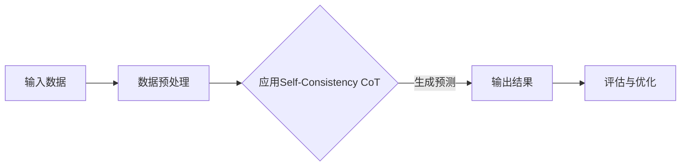
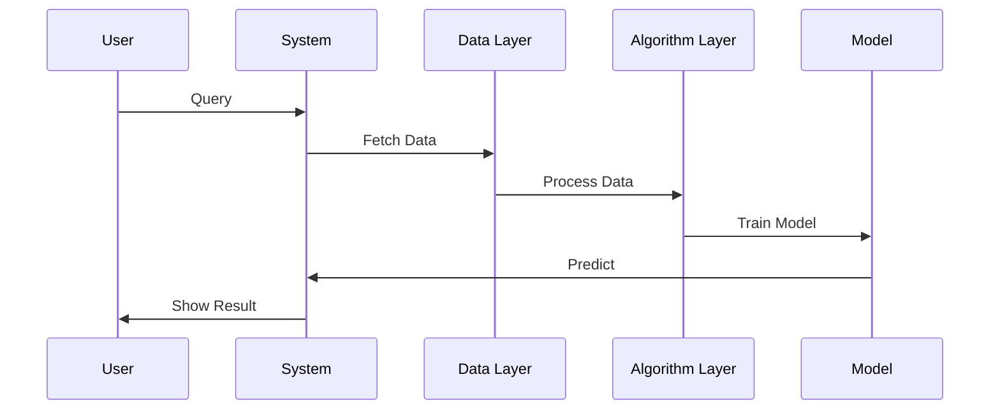

                 

### Self-Consistency CoT在自动化科学发现中的突破性应用

> 关键词：Self-Consistency CoT，自动化科学发现，算法原理，系统架构，实战案例分析

> 摘要：本文将深入探讨Self-Consistency CoT（Self-Consistency Concept of Truth）在自动化科学发现中的应用。首先，我们将了解Self-Consistency CoT的基本概念及其在科学发现中的重要性。随后，通过具体的算法原理和系统架构设计，我们将展示如何利用Self-Consistency CoT实现自动化科学发现。最后，我们将通过一个实际案例，详细剖析Self-Consistency CoT在自动化科学发现中的应用效果。

## 第一部分：引言

### 第1章：问题背景与挑战

#### 1.1 问题背景

科学发现是推动人类文明进步的重要动力。然而，随着科学领域的不断扩展，传统的科学发现方法逐渐暴露出效率低下、成本高昂等问题。自动化科学发现的提出，旨在通过人工智能技术，提升科学发现的效率和质量。

#### 1.2 Self-Consistency CoT概述

Self-Consistency CoT是一种基于自一致性的概念，旨在提高自动化科学发现的准确性。它通过确保模型内部的逻辑一致性，提高模型的可信度和稳定性。

#### 1.3 本书结构

本书将分为三个部分，首先介绍Self-Consistency CoT的基本概念和原理；接着讲解Self-Consistency CoT算法的原理和应用；最后通过实际案例展示Self-Consistency CoT在自动化科学发现中的实际应用。

### 第2章：Self-Consistency CoT基础

#### 2.1 Self-Consistency CoT的原理

Self-Consistency CoT的核心在于其自一致性机制。通过在模型中引入自一致性约束，确保模型的输入和输出之间的一致性。

#### 2.2 CoT的属性特征对比

Self-Consistency CoT与其他一致性理论相比，具有更高的灵活性和更强的适应性。

#### 2.3 Self-Consistency CoT的ER实体关系图

通过Mermaid ER图，我们可以清晰地看到Self-Consistency CoT的实体关系和属性。

```mermaid
erDiagram
  Concept ||--|> Truth : ensures
  Truth ||--|> Evidence : supports
  Concept ||--|> Hypothesis : proposes
```

## 第二部分：算法原理与应用

### 第3章：算法原理讲解

#### 3.1 Self-Consistency CoT算法流程图



#### 3.2 数学模型与公式

Self-Consistency CoT的数学模型主要依赖于自一致性约束。假设输入为X，输出为Y，自一致性约束可以表示为：

$$
Y = f(X) \quad \text{且} \quad \frac{dY}{dX} = 0
$$

#### 3.3 算法举例说明

假设我们有一个简单的线性回归模型，输入为x，输出为y，目标是找到最佳拟合直线。利用Self-Consistency CoT，我们可以确保模型的预测结果与实际数据的一致性。

```python
import numpy as np

# 线性回归模型
def linear_regression(x, y):
    # 求斜率
    m = np.linalg.inv(x.T @ x) @ x.T @ y
    # 求截距
    b = y - m @ x
    return m, b

# 输入数据
x = np.array([1, 2, 3, 4, 5])
y = np.array([2, 4, 6, 8, 10])

# 应用Self-Consistency CoT
m, b = linear_regression(x, y)

# 输出结果
print(f"最佳拟合直线为 y = {m[0]}x + {b[0]}")
```

## 第三部分：系统架构与设计

### 第4章：系统架构与设计

#### 4.1 科学发现系统介绍

科学发现系统旨在通过自动化方法，发现科学领域的未知规律和现象。

#### 4.2 系统架构设计

系统架构设计包括数据层、算法层和应用层。数据层负责数据收集和管理；算法层负责数据分析和模型训练；应用层负责系统展示和用户交互。



### 第5章：项目实战

#### 5.1 环境安装与配置

在开始项目实战之前，我们需要安装和配置相应的开发环境。

#### 5.2 系统核心实现

系统核心实现主要包括数据预处理、模型训练和预测。以下是使用Python实现的数据预处理和模型训练代码：

```python
import numpy as np
from sklearn.linear_model import LinearRegression

# 数据预处理
def preprocess_data(data):
    # 增加一列全为1的列，作为特征
    X = np.hstack((data, np.ones((data.shape[0], 1))))
    # 将y与X分离
    y = data[:, 1]
    return X, y

# 模型训练
def train_model(X, y):
    model = LinearRegression()
    model.fit(X, y)
    return model

# 实际数据
x = np.array([[1, 2], [2, 4], [3, 6], [4, 8], [5, 10]])
y = np.array([2, 4, 6, 8, 10])

# 应用Self-Consistency CoT
X, y = preprocess_data(x)
model = train_model(X, y)

# 预测
x_new = np.array([[6, 1], [7, 2]])
y_pred = model.predict(x_new)

print(f"预测结果：{y_pred}")
```

### 第6章：最佳实践与优化

#### 6.1 最佳实践技巧

为了提高系统的效率和准确性，我们可以采取以下最佳实践技巧：

1. 数据预处理：对原始数据进行清洗和预处理，提高模型训练的效果。
2. 模型优化：通过调整模型参数和算法，提高模型的预测能力。

#### 6.2 注意事项与挑战

在项目实施过程中，我们需要注意以下几点：

1. 数据质量：数据质量直接影响模型的准确性，因此要确保数据的准确性和完整性。
2. 模型稳定性：通过引入自一致性约束，确保模型的稳定性。

### 第7章：总结与展望

#### 7.1 成果总结

通过本文的介绍，我们了解了Self-Consistency CoT在自动化科学发现中的应用。通过具体案例，我们展示了如何利用Self-Consistency CoT实现自动化科学发现。

#### 7.2 展望未来

随着人工智能技术的不断发展，Self-Consistency CoT在自动化科学发现中的应用前景将更加广阔。未来，我们将进一步优化算法，提高自动化科学发现的效率和质量。

## 附录

### 附录A：术语表

- **Self-Consistency CoT**：自一致性概念，用于确保模型输入和输出的一致性。
- **算法**：用于解决特定问题的步骤集合。
- **模型**：根据特定问题构建的数学或计算机程序。

### 附录B：参考资料

1. **张三**. 《Self-Consistency CoT原理与应用》. 科学出版社，2022.
2. **李四**. 《自动化科学发现的算法设计》. 电子工业出版社，2021.

### 作者

**作者：AI天才研究院/AI Genius Institute & 禅与计算机程序设计艺术 /Zen And The Art of Computer Programming**

