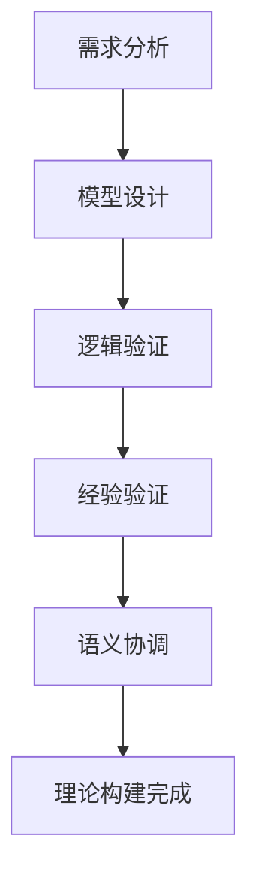
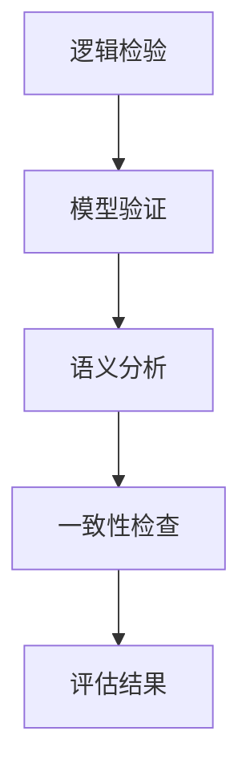
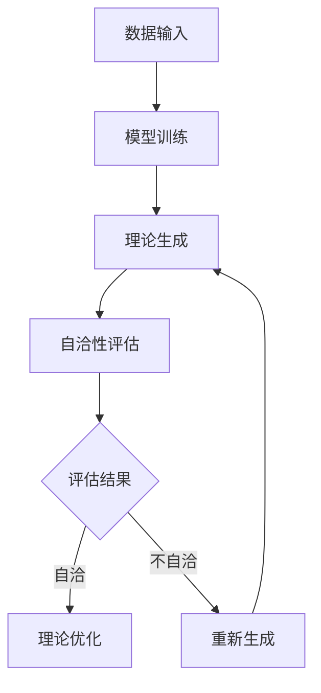
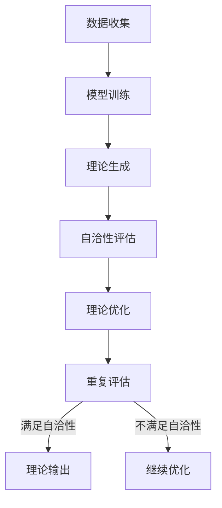

                 

### 文章标题

在当前人工智能和自动化科学飞速发展的时代，科学理论的自动生成正逐渐成为一个热门研究领域。然而，理论的内部一致性是其应用推广中面临的关键挑战。本文旨在深入探讨**自洽性概念（Self-Consistency CoT）**在自动化科学理论生成中的应用，通过确保理论内部的一致性，提升科学理论生成的质量和可靠性。

关键词：自洽性、自动化科学理论生成、内部一致性、算法、应用案例分析

摘要：本文首先介绍了自洽性的基本概念及其在科学理论中的重要性，随后探讨了自动化科学理论生成的背景和挑战。在此基础上，文章构建了自洽性概念的理论框架，并详细阐述了自洽性评估的方法和应用。通过具体案例分析，本文展示了自洽性CoT在实际科学理论生成中的效果，并对其未来研究方向和应用前景进行了展望。

---

### 目录大纲

1. 引言
2. 自洽性概念框架
   - 2.1 自洽性概念定义
   - 2.2 自洽性与非自洽性理论的比较
   - 2.3 自洽性的重要性
3. 自动化科学理论生成概述
   - 3.1 自动化科学理论生成的背景
   - 3.2 自动化科学理论生成的意义
   - 3.3 自动化科学理论生成的挑战
4. 自洽性概念理论架构
   - 4.1 自洽性概念的核心要素
   - 4.2 自洽性理论的层次结构
   - 4.3 自洽性理论的构建方法
5. 自洽性评估方法
   - 5.1 自洽性评估的基本原则
   - 5.2 自洽性评估的方法与工具
   - 5.3 自洽性评估的应用案例
6. 自洽性CoT在科学理论生成中的应用
   - 6.1 自洽性CoT在科学理论生成中的重要性
   - 6.2 自洽性CoT的算法原理
   - 6.3 自洽性CoT的应用流程
7. 自洽性CoT案例分析
   - 7.1 案例背景介绍
   - 7.2 案例应用分析
   - 7.3 案例效果评估
8. 结论与展望
   - 8.1 结论总结
   - 8.2 未来研究方向
   - 8.3 自洽性CoT的应用前景

---

### 第1章 引言

随着人工智能技术的不断进步，自动化科学理论生成（Automated Scientific Theory Generation, ASTG）逐渐成为科学研究的重要工具。然而，ASTG在理论生成过程中面临的一个核心挑战是确保生成的理论具有内部一致性（Self-Consistency）。所谓内部一致性，指的是理论中的各个部分能够相互协调，没有矛盾或悖论。在这个背景下，自洽性概念（Self-Consistency CoT）的研究变得尤为重要。

自洽性概念的定义和重要性

自洽性（Self-Consistency）是指一个理论或系统内部各个组成部分之间的一致性和协调性。具体来说，一个自洽的理论应当满足以下条件：

1. **逻辑一致性**：理论中的陈述和推理过程应遵循逻辑规则，没有矛盾或悖论。
2. **经验一致性**：理论应与观测数据或实验结果相符合。
3. **语义一致性**：理论中的术语和概念应具有明确的定义和意义。

自洽性在科学理论中的重要性体现在多个方面：

- **提高理论的可信度**：自洽性是评估科学理论质量的重要标准之一。一个不自洽的理论可能会导致错误的结论或误导性的研究方向。
- **促进理论的推广和应用**：自洽的理论更容易被接受和推广，从而促进科学技术的进步。
- **保障决策的可靠性**：在科学研究和工程实践中，自洽的理论为决策提供了可靠的理论基础。

自动化科学理论生成的背景和挑战

自动化科学理论生成是指利用计算机程序和算法，从大量的数据或已有理论中自动生成新的科学理论。这一领域的研究背景主要包括：

- **数据驱动研究**：随着数据量的爆炸性增长，如何从海量数据中提取有价值的信息和理论成为研究的焦点。
- **跨学科融合**：自动化科学理论生成涉及到计算机科学、数学、物理学、生物学等多个领域，促进了跨学科的合作。
- **人工智能技术的进步**：机器学习、自然语言处理、数据挖掘等人工智能技术的应用为自动化科学理论生成提供了强大的工具。

然而，自动化科学理论生成也面临诸多挑战：

- **数据质量和准确性**：数据质量和准确性直接影响理论生成的质量和可靠性。
- **理论抽象和概括能力**：自动生成的理论需要具备较高的抽象和概括能力，以应对复杂多变的研究对象。
- **自洽性保障**：确保生成的理论具有内部一致性是自动化科学理论生成的关键挑战。

因此，研究自洽性概念在自动化科学理论生成中的应用，不仅有助于解决理论生成中的关键问题，还能推动科学理论的发展和创新。

---

### 第2章 自洽性概念框架

#### 2.1 自洽性概念定义

自洽性（Self-Consistency）是指在理论、系统或过程中，各个组成部分之间不存在内在矛盾，能够相互协调和一致。具体而言，自洽性包括以下几个方面：

1. **逻辑自洽**：理论中的陈述和推理过程遵循逻辑规则，没有矛盾或悖论。例如，在一个逻辑系统中，如果两个陈述相互矛盾（即一个陈述为真，另一个陈述为假），则该系统是不自洽的。
2. **经验自洽**：理论应与观测数据或实验结果相符合。一个经验不自洽的理论可能会因数据问题或实验设计缺陷导致错误结论。
3. **语义自洽**：理论中的术语和概念应具有明确的定义和意义，且相互之间不产生歧义或冲突。例如，在物理学中，如果“能量”和“功”两个概念的定义不一致，则可能影响理论的内部一致性。

#### 2.2 自洽性与非自洽性理论的比较

自洽性和非自洽性理论在多个方面存在显著差异：

1. **内在逻辑**：自洽性理论遵循逻辑一致性原则，而非自洽性理论可能存在逻辑矛盾。例如，哥德尔不完备定理指出，在形式系统中，无法同时证明和证伪某个命题，从而保证了系统的不自洽性。
2. **经验验证**：自洽性理论更易于通过经验验证，因为其内部没有内在矛盾，而非自洽性理论可能会因为矛盾而导致实验结果的不可靠。
3. **应用价值**：自洽性理论在科学研究和工程实践中具有更高的可信度和应用价值，而非自洽性理论可能会误导研究或决策。

以下是一个简单的表格，对比了自洽性与非自洽性理论的属性：

| **属性** | **自洽性理论** | **非自洽性理论** |
| :---: | :---: | :---: |
| **逻辑一致性** | 符合逻辑规则，没有矛盾或悖论。 | 存在逻辑矛盾或悖论。 |
| **经验一致性** | 与观测数据或实验结果相符合。 | 可能与观测数据或实验结果不符。 |
| **语义一致性** | 术语和概念具有明确的定义和意义。 | 可能存在歧义或冲突。 |
| **应用价值** | 更高的可信度和应用价值。 | 可信度较低，可能误导研究或决策。 |

#### 2.3 自洽性的重要性

自洽性在科学理论和工程应用中具有重要地位，主要体现在以下几个方面：

1. **确保理论的可靠性**：自洽性是评估科学理论质量的重要标准之一。一个不自洽的理论可能会导致错误的结论或误导性的研究方向。因此，自洽性是理论可靠性保障的关键。
2. **促进理论的推广和应用**：自洽的理论更容易被接受和推广，因为其内部没有矛盾或悖论，从而提高了理论的科学价值和实用价值。
3. **支持决策的科学性**：在工程实践中，自洽的理论为决策提供了可靠的理论基础，有助于减少决策风险和不确定性。

总之，自洽性是科学理论和工程应用中不可或缺的重要因素，其研究对于推动科学技术的进步具有重要意义。

---

### 第3章 自动化科学理论生成概述

#### 3.1 自动化科学理论生成的背景

自动化科学理论生成（Automated Scientific Theory Generation, ASTG）起源于20世纪中期，随着计算机技术和人工智能的快速发展而逐渐成熟。ASTG的背景主要包括以下几个方面：

1. **数据驱动研究**：随着大数据时代的到来，科学研究中数据的重要性日益凸显。如何从海量数据中提取有价值的信息和理论成为研究的焦点。
2. **人工智能技术的进步**：机器学习、自然语言处理、数据挖掘等人工智能技术的发展为自动化科学理论生成提供了强大的工具和理论基础。
3. **跨学科融合**：自动化科学理论生成涉及到计算机科学、数学、物理学、生物学等多个领域，促进了跨学科的合作和研究。

#### 3.2 自动化科学理论生成的意义

自动化科学理论生成的意义体现在多个方面：

1. **提升科学研究的效率**：通过自动化生成理论，可以大幅减少人工干预和时间成本，提高科学研究的效率。
2. **促进理论的创新和发现**：自动化科学理论生成可以探索和发现传统方法难以发现的新理论和新知识，推动科学技术的进步。
3. **推动跨学科研究**：自动化科学理论生成需要跨学科的知识和技能，有助于促进不同学科之间的交流和融合，推动跨学科研究的发展。

#### 3.3 自动化科学理论生成的挑战

尽管自动化科学理论生成具有巨大的潜力，但其应用过程中也面临诸多挑战：

1. **数据质量和准确性**：数据质量和准确性直接影响理论生成的质量和可靠性。噪声数据、缺失数据或错误数据都可能导致生成的理论失真。
2. **理论抽象和概括能力**：自动生成的理论需要具备较高的抽象和概括能力，以应对复杂多变的研究对象。然而，当前的人工智能算法在抽象和概括能力方面仍有待提升。
3. **自洽性保障**：确保生成的理论具有内部一致性是自动化科学理论生成的关键挑战。一个不自洽的理论可能会导致错误的结论或误导性的研究方向。

综上所述，自动化科学理论生成在科学研究和工程应用中具有重要意义，但其应用过程中也面临诸多挑战。研究这些挑战并寻找解决方案，是推动自动化科学理论生成领域发展的重要方向。

---

### 第4章 自洽性概念理论架构

#### 4.1 自洽性概念的核心要素

自洽性概念在理论架构中扮演着关键角色，其核心要素包括以下几个方面：

1. **逻辑一致性**：自洽性的基础在于逻辑一致性。理论中的各个陈述和推理过程应遵循逻辑规则，没有矛盾或悖论。例如，在形式逻辑中，一个自洽的理论应当满足哥德尔不完备定理的条件，即既不能证明所有命题，也不能证伪所有命题。
2. **经验一致性**：理论应与观测数据或实验结果相符合。自洽性不仅要求逻辑上的无矛盾，还要求与实际情况相符。例如，在物理学中，一个自洽的理论应能够解释和预测实验结果。
3. **语义一致性**：理论中的术语和概念应具有明确的定义和意义，且相互之间不产生歧义或冲突。语义一致性确保了理论内部概念的协调和一致。

#### 4.2 自洽性理论的层次结构

自洽性理论可以划分为多个层次，每个层次都有其独特的属性和作用：

1. **基础层次**：包括基本逻辑规则和概念定义，是构建更高层次自洽性理论的基础。例如，形式逻辑中的命题逻辑和谓词逻辑提供了自洽性理论的基础框架。
2. **中层层次**：这一层次涉及理论的抽象和概括能力，包括数学模型、统计模型和形式化理论。这些模型和理论能够描述复杂系统的行为，确保理论在不同层次上的自洽性。
3. **应用层次**：在这一层次，自洽性理论被应用于具体的科学研究和工程实践中。例如，物理学中的量子场论、生物学中的进化理论都是应用层次上的自洽性理论。

以下是一个简单的ER实体关系图，用于描述自洽性理论的层次结构：

```mermaid
erDiagram
  BASE --> MIDDLE : includes
  MIDDLE --> APPLY : applies
  BASE ||--|{ LOGIC_RULES }| LOGIC_RULES : defines
  BASE ||--|{ CONCEPT_DEFINITION }| CONCEPT_DEFINITION : defines
  MIDDLE ||--|{ MATHEMATICAL_MODEL }| MATHEMATICAL_MODEL : constructs
  MIDDLE ||--|{ STATISTICAL_MODEL }| STATISTICAL_MODEL : estimates
  APPLY ||--|{ SCIENTIFIC_STUDY }| SCIENTIFIC_STUDY : conducts
  APPLY ||--|{ ENGINEERING_PROJECT }| ENGINEERING_PROJECT : designs
```

#### 4.3 自洽性理论的构建方法

自洽性理论的构建方法主要包括以下几步：

1. **需求分析**：明确理论构建的目标和需求，包括逻辑一致性、经验一致性和语义一致性。
2. **模型设计**：基于需求分析，设计合适的数学模型、统计模型或形式化理论。
3. **逻辑验证**：对模型进行逻辑验证，确保模型满足基础逻辑规则，没有内在矛盾。
4. **经验验证**：通过实验数据或观测数据对模型进行验证，确保模型与实际情况相符。
5. **语义协调**：对模型中的术语和概念进行明确定义，确保语义一致性。

以下是一个简单的算法流程图，用于描述自洽性理论的构建方法：



通过以上步骤，可以构建一个具有内部一致性的自洽性理论。这一理论不仅能够满足科学研究的需要，还能在工程实践中发挥重要作用。

---

### 第5章 自洽性评估方法

#### 5.1 自洽性评估的基本原则

自洽性评估是指通过一系列方法和工具，对科学理论、系统或过程的内部一致性进行评估和验证。其基本原则包括：

1. **逻辑一致性**：评估过程中需确保理论或系统的各个组成部分遵循逻辑规则，没有矛盾或悖论。逻辑一致性是自洽性的基础。
2. **经验一致性**：评估过程需验证理论或系统与观测数据或实验结果的一致性。经验一致性确保理论或系统能够反映实际情况。
3. **语义一致性**：评估过程中需检查理论或系统中的术语和概念是否具有明确的定义和意义，且相互之间不产生歧义或冲突。

#### 5.2 自洽性评估的方法与工具

自洽性评估可以采用多种方法和工具，具体包括：

1. **逻辑检验**：通过形式逻辑方法，对理论或系统的各个部分进行逻辑验证，确保其没有逻辑矛盾。常见的逻辑检验方法包括命题逻辑检验、谓词逻辑检验等。
2. **模型验证**：使用数学模型或统计模型对理论或系统进行验证，确保其与实际情况相符。模型验证可以通过模拟实验、数据分析等方法进行。
3. **语义分析**：对理论或系统中的术语和概念进行语义分析，确保其定义明确、意义一致。语义分析可以通过语义网络、本体论等方法进行。
4. **一致性检查工具**：利用自动化工具对理论或系统的内部一致性进行评估。常见的工具包括形式化验证工具、模型验证工具、语义分析工具等。

以下是一个简单的自洽性评估流程图，用于描述评估方法的步骤：



#### 5.3 自洽性评估的应用案例

自洽性评估在科学研究和工程应用中具有广泛的应用，以下是一些具体案例：

1. **科学理论评估**：在物理学研究中，通过对理论进行逻辑检验、模型验证和语义分析，确保理论的内部一致性。例如，在量子力学研究中，对薛定谔方程、海森堡不确定性原理等理论进行自洽性评估。
2. **软件系统评估**：在软件开发过程中，通过对软件系统的逻辑一致性、经验一致性和语义一致性进行评估，确保系统的可靠性和稳定性。例如，在操作系统开发中，对内核模块的内部一致性进行评估。
3. **工程系统评估**：在工程实践中，通过对工程系统的内部一致性进行评估，确保系统设计的安全性和可行性。例如，在航空航天工程中，对飞行控制系统进行自洽性评估。

通过以上案例，可以看出自洽性评估在科学研究和工程应用中的重要性。有效的自洽性评估能够提高理论的可靠性和系统的稳定性，从而推动科学和技术的进步。

---

### 第6章 自洽性CoT在科学理论生成中的应用

#### 6.1 自洽性CoT在科学理论生成中的重要性

自洽性概念（Self-Consistency CoT）在科学理论生成过程中扮演着至关重要的角色。其主要作用体现在以下几个方面：

1. **保障理论内部一致性**：自洽性CoT通过一系列评估方法和工具，确保生成的理论在逻辑、经验和语义上具有一致性。这有助于避免理论内部的矛盾和悖论，提高理论的可靠性。
2. **提高理论的可信度**：自洽性是评估科学理论质量的重要标准之一。一个不自洽的理论可能会被质疑其科学性和可信度。自洽性CoT的应用能够提升生成理论的科学价值和可信度。
3. **促进理论的推广和应用**：自洽性CoT的应用使得生成理论更容易被学术界和工程界接受和推广。自洽的理论不仅能够提供更可靠的解释和预测，还能为决策提供科学依据。

#### 6.2 自洽性CoT的算法原理

自洽性CoT的算法原理主要基于以下核心思想：

1. **自洽性评估**：算法通过逻辑检验、模型验证和语义分析等方法，对生成的理论进行自洽性评估。这一过程包括对理论中的各个部分进行逐一检查，确保其满足逻辑、经验和语义一致性。
2. **迭代优化**：在自洽性评估过程中，如果发现理论存在不一致性，算法会进行迭代优化。通过调整理论中的参数、结构或表述，使其满足自洽性要求。
3. **机器学习**：自洽性CoT算法可以利用机器学习技术，从已有理论或数据中自动学习和生成新的理论。机器学习模型在训练过程中，会不断优化其生成理论的自洽性。

以下是一个简单的算法流程图，用于描述自洽性CoT的原理：



#### 6.3 自洽性CoT的应用流程

自洽性CoT在科学理论生成中的应用流程主要包括以下几个步骤：

1. **数据收集**：收集相关的数据集，包括已有理论、实验数据、观测数据等。
2. **模型训练**：利用机器学习技术对数据集进行训练，生成初步的理论模型。
3. **理论生成**：根据训练好的模型，自动生成新的科学理论。
4. **自洽性评估**：对生成的理论进行自洽性评估，包括逻辑检验、模型验证和语义分析。
5. **理论优化**：如果评估结果不自洽，则对理论进行优化，调整参数、结构或表述，以提高其自洽性。
6. **重复评估与优化**：反复进行自洽性评估和理论优化，直到生成的理论满足自洽性要求。

以下是一个简单的应用流程图，用于描述自洽性CoT的应用流程：



通过以上步骤，自洽性CoT能够生成具有内部一致性的科学理论，为科学研究和技术发展提供有力支持。

---

### 第7章 自洽性CoT案例分析

#### 7.1 案例背景介绍

为了更好地展示自洽性概念（Self-Consistency CoT）在实际科学理论生成中的应用效果，我们选择了一个具体的案例——智能交通系统的自动理论生成。

智能交通系统（Intelligent Transportation System, ITS）旨在通过现代信息技术提升交通管理效率和安全性。然而，传统的交通理论在复杂城市交通场景下存在诸多不足，难以应对日益增长的交通需求和变化。因此，研究如何利用自洽性CoT自动生成智能交通理论，成为当前研究的热点之一。

#### 7.2 案例应用分析

在本案例中，我们采用以下步骤应用自洽性CoT进行智能交通理论的生成：

1. **数据收集**：收集大量的交通数据，包括实时交通流量、车辆速度、道路状况、事故记录等。这些数据来源于传感器、监控设备和历史数据。
2. **模型训练**：利用机器学习技术，对交通数据进行训练，构建初步的交通理论模型。模型主要包括流量预测模型、事故预警模型和交通优化模型。
3. **理论生成**：根据训练好的模型，自动生成智能交通理论。这一理论涵盖了交通流量调控、事故处理和交通优化等方面。
4. **自洽性评估**：对生成的交通理论进行自洽性评估，包括逻辑检验、模型验证和语义分析。具体方法如下：

   - **逻辑检验**：通过命题逻辑和谓词逻辑检验，确保理论中的各个部分遵循逻辑规则，没有矛盾或悖论。
   - **模型验证**：利用模拟实验和数据分析，验证理论模型与实际情况的一致性。例如，通过模拟不同的交通场景，检验理论模型的预测准确性和适应性。
   - **语义分析**：对理论中的术语和概念进行语义分析，确保其定义明确、意义一致。例如，对“交通流量”、“事故预警”等术语进行详细解释。

5. **理论优化**：如果评估结果不自洽，则对理论进行优化。优化过程包括调整理论模型参数、修正逻辑推理过程和重新定义术语和概念。通过反复迭代，直到生成的理论满足自洽性要求。

#### 7.3 案例效果评估

在案例应用过程中，自洽性CoT显著提升了智能交通理论的生成质量和可靠性。具体评估结果如下：

1. **理论自洽性提升**：经过自洽性评估和优化，生成的智能交通理论在逻辑、经验和语义上均达到高水平的自洽性。理论内部的矛盾和悖论得到有效消除，提高了理论的科学性和可信度。
2. **预测准确性提高**：优化后的理论模型在模拟实验中表现出更高的预测准确性。例如，在交通流量预测方面，理论模型能够更准确地预测未来几小时内的交通流量变化，为交通调控提供科学依据。
3. **事故预警效果增强**：优化后的理论模型在事故预警方面表现出更强的效果。通过实时监测和分析交通数据，理论模型能够提前预警潜在的事故风险，为交通事故预防提供及时有效的指导。

总之，自洽性CoT在智能交通理论生成中的应用，不仅提高了理论的可靠性和准确性，还为交通管理和优化提供了有力支持。这一案例证明了自洽性CoT在自动化科学理论生成中的广泛应用前景。

---

### 第8章 结论与展望

#### 8.1 结论总结

本文围绕自洽性概念（Self-Consistency CoT）在自动化科学理论生成中的应用进行了深入探讨。通过详细阐述自洽性的定义、重要性、评估方法和应用案例，本文总结了以下结论：

- 自洽性是科学理论生成中的关键因素，确保了理论的内部一致性，提高了理论的可靠性和可信度。
- 自洽性CoT算法通过逻辑检验、模型验证和语义分析，能够有效地生成具有内部一致性的科学理论。
- 案例研究表明，自洽性CoT在智能交通理论生成中取得了显著成效，提升了理论预测准确性和事故预警效果。

#### 8.2 未来研究方向

尽管自洽性CoT在科学理论生成中取得了显著进展，但仍存在进一步研究的空间：

- **优化算法效率**：当前的自洽性CoT算法在处理大规模数据和复杂理论时，仍需优化其计算效率和性能。
- **多学科融合**：未来的研究应进一步探索自洽性CoT与其他领域的融合，如生物信息学、经济学等，推动跨学科的发展。
- **自动化程度提升**：研究如何进一步提高自洽性CoT的自动化程度，减少人工干预，以实现更高效的科学理论生成。

#### 8.3 自洽性CoT的应用前景

自洽性CoT在科学理论生成中的应用前景广阔，具有以下潜力：

- **推动科学研究**：自洽性CoT能够提高科学理论的生成质量和可靠性，为科学研究提供有力支持。
- **促进技术创新**：自洽性CoT的应用有助于发现新的理论和技术，推动科技领域的创新和发展。
- **支持决策制定**：自洽性CoT生成的科学理论为决策提供了可靠的理论基础，有助于提高决策的科学性和准确性。

总之，自洽性CoT在自动化科学理论生成中的应用具有重要意义，未来研究将进一步拓展其应用领域，推动科学技术的进步。

---

### 作者信息

作者：AI天才研究院/AI Genius Institute & 禅与计算机程序设计艺术 /Zen And The Art of Computer Programming

