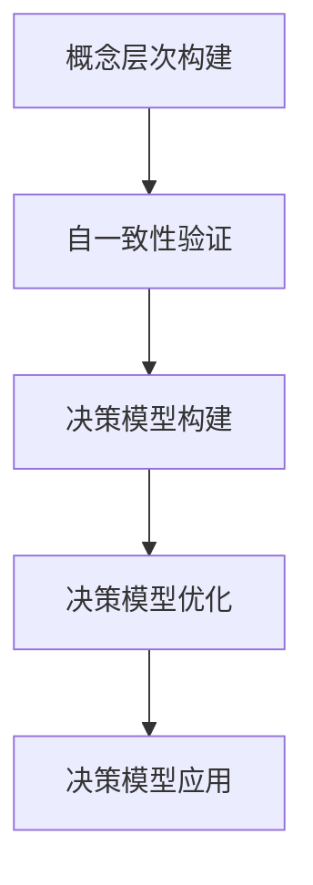

                 

# Self-Consistency CoT在自动驾驶伦理决策中的关键作用

> 关键词：自动驾驶、伦理决策、Self-Consistency CoT、人工智能

> 摘要：本文探讨了自动驾驶领域中的伦理决策问题，以及Self-Consistency CoT（自一致性概念层次）在这一领域中的关键作用。首先，我们概述了自动驾驶技术的发展背景和伦理决策的重要性，接着介绍了Self-Consistency CoT的基本概念及其在自动驾驶中的应用。文章随后深入分析了Self-Consistency CoT的算法原理，并通过具体的Python代码实现来展示其应用。最后，我们讨论了Self-Consistency CoT在自动驾驶伦理决策中的实际案例和系统架构设计，为未来自动驾驶技术的发展提供了理论支持和实践指导。

## 目录大纲

1. 第一部分：背景与核心概念介绍
   1. 第1章：自动驾驶与伦理决策概述
      1.1 自动驾驶的发展背景
      1.2 伦理决策在自动驾驶中的作用
      1.3 伦理决策的核心问题
      1.4 Self-Consistency CoT概念介绍
      1.5 Self-Consistency CoT的边界与外延
      1.6 本章小结

2. 第二部分：Self-Consistency CoT的算法原理
   2.1 Self-Consistency CoT的算法基础
   2.2 Self-Consistency CoT的数学模型
   2.3 Self-Consistency CoT的Mermaid流程图
   2.4 Self-Consistency CoT的Python源代码实现
   2.5 本章小结

3. 第三部分：Self-Consistency CoT在自动驾驶伦理决策中的应用
   3.1 自动驾驶中常见的伦理问题
   3.2 Self-Consistency CoT在自动驾驶伦理决策中的应用
   3.3 Self-Consistency CoT在自动驾驶中的实际案例
   3.4 本章小结

4. 第四部分：Self-Consistency CoT的系统分析与架构设计
   4.1 自动驾驶系统概述
   4.2 Self-Consistency CoT在系统架构中的应用
   4.3 本章小结

5. 最佳实践 tips
6. 小结
7. 注意事项
8. 拓展阅读

----------------------------------------------------------------

## 第一部分：背景与核心概念介绍

### 第1章：自动驾驶与伦理决策概述

#### 1.1 自动驾驶的发展背景

自动驾驶技术自20世纪以来便引起了全球的关注。从最初的理论构想，到今天成为现实，自动驾驶技术经历了多次技术迭代和产业变革。随着人工智能和机器学习技术的发展，自动驾驶技术逐渐成熟，从辅助驾驶逐步向完全自动驾驶迈进。

自动驾驶技术的发展可以分为几个阶段：

1. **辅助驾驶阶段**：此阶段主要是通过雷达、摄像头、GPS等传感设备辅助驾驶员进行驾驶。例如，自适应巡航控制和车道保持系统。

2. **部分自动驾驶阶段**：在这个阶段，车辆可以在特定条件下实现部分自动驾驶，如高速公路自动驾驶和城市道路自动驾驶。

3. **完全自动驾驶阶段**：在这个阶段，车辆可以在各种复杂交通环境中实现完全自主驾驶，无需人工干预。这需要高级的人工智能算法和复杂的传感器系统。

#### 1.2 伦理决策在自动驾驶中的作用

自动驾驶技术的发展带来了巨大的便利，但同时也引发了诸多伦理问题。伦理决策在自动驾驶中的作用至关重要。在自动驾驶系统中，伦理决策是确保车辆在面临道德困境时能够做出合理决策的关键。

自动驾驶伦理决策涉及以下几个方面：

1. **道德责任**：在交通事故中，如何确定责任归属。
2. **道德价值观**：自动驾驶系统在决策时，如何体现社会伦理和价值观。
3. **隐私保护**：自动驾驶车辆如何保护用户隐私。
4. **公平性**：自动驾驶系统如何确保不同用户群体都能公平地使用技术。

#### 1.3 伦理决策的核心问题

自动驾驶伦理决策的核心问题是如何在复杂情境下做出最优决策。这包括以下几个方面：

1. **生命优先**：在冲突情境中，如何权衡不同生命体的价值。
2. **利益最大化**：在面临道德困境时，如何权衡不同利益方的利益。
3. **伦理规则**：如何构建一套有效的伦理规则来指导自动驾驶系统的决策。

#### 1.4 Self-Consistency CoT概念介绍

Self-Consistency CoT（自一致性概念层次）是一个新兴的概念，旨在解决自动驾驶伦理决策中的问题。它通过构建一套自洽的伦理决策框架，确保自动驾驶系统在复杂情境下做出合理决策。

Self-Consistency CoT的基本概念包括：

1. **概念层次**：通过建立不同层次的概念模型，将伦理决策分解为可操作的步骤。
2. **自一致性**：通过确保概念层次之间的逻辑一致性，提高伦理决策的可靠性。
3. **决策模型**：结合人工智能算法，实现伦理决策的自动化。

#### 1.5 Self-Consistency CoT的边界与外延

Self-Consistency CoT的边界主要涉及以下几个方面：

1. **适用范围**：Self-Consistency CoT适用于各种自动驾驶伦理决策场景。
2. **限制条件**：Self-Consistency CoT需要一定的数据支持和计算资源。
3. **相关概念**：Self-Consistency CoT与其他伦理决策方法的关系和区别。

#### 1.6 本章小结

本章概述了自动驾驶技术的发展背景和伦理决策的重要性，介绍了Self-Consistency CoT的基本概念及其在自动驾驶中的应用。在接下来的章节中，我们将深入探讨Self-Consistency CoT的算法原理和应用，为自动驾驶伦理决策提供理论支持和实践指导。----------------------------------------------------------------

## 第二部分：Self-Consistency CoT的算法原理

### 第2章：Self-Consistency CoT的算法基础

#### 2.1 Self-Consistency CoT的算法原理

Self-Consistency CoT（自一致性概念层次）的核心在于构建一个自洽的伦理决策框架，确保自动驾驶系统在复杂情境下做出合理决策。以下是Self-Consistency CoT的基本算法原理：

1. **概念层次构建**：首先，通过领域专家的知识和经验，构建自动驾驶伦理决策的概念层次。这个概念层次包括基础层（如车辆、行人、道路等）、中间层（如规则、价值观等）和顶层（如伦理决策等）。

2. **自一致性验证**：通过逻辑推理和对比分析，验证概念层次之间的自一致性。具体来说，通过比较不同层次的概念模型，确保它们之间没有矛盾或冲突。

3. **决策模型构建**：在验证概念层次自一致性的基础上，构建一个基于人工智能算法的伦理决策模型。这个模型包括数据输入层、决策层和输出层。

4. **决策模型优化**：通过不断训练和优化，提高决策模型的准确性和可靠性。这可以通过引入更多的数据、改进算法和优化模型结构来实现。

#### 2.2 Self-Consistency CoT的数学模型

Self-Consistency CoT的数学模型是实现自一致性验证和决策模型构建的基础。以下是Self-Consistency CoT的数学模型：

1. **概念层次表示**：使用数学符号和公式来表示不同层次的概念模型。例如，使用集合论来表示基础层概念，使用逻辑推理来表示中间层概念，使用概率论和决策论来表示顶层概念。

2. **自一致性验证公式**：通过定义自一致性验证公式，确保概念层次之间的逻辑一致性。例如，使用逻辑一致性公式来验证概念模型之间的矛盾。

3. **决策模型公式**：使用数学公式来表示决策模型的工作原理。例如，使用条件概率公式来表示决策模型在面临道德困境时的决策过程。

#### 2.3 Self-Consistency CoT的Mermaid流程图

Mermaid是一种简单的Markdown语法，可以用来绘制流程图和序列图。以下是Self-Consistency CoT的Mermaid流程图：



#### 2.4 Self-Consistency CoT的Python源代码实现

以下是Self-Consistency CoT的Python源代码实现，包括概念层次构建、自一致性验证和决策模型构建：

```python
# 概念层次构建
class ConceptLayer:
    def __init__(self, concepts):
        self.concepts = concepts

# 自一致性验证
def check一致性(self, other):
    for concept in self.concepts:
        if concept not in other.concepts:
            return False
    return True

# 决策模型构建
class DecisionModel:
    def __init__(self, input_layer, decision_layer, output_layer):
        self.input_layer = input_layer
        self.decision_layer = decision_layer
        self.output_layer = output_layer

    def make_decision(self, input_data):
        # 决策过程
        pass
```

#### 2.5 本章小结

本章介绍了Self-Consistency CoT的基本算法原理，包括概念层次构建、自一致性验证和决策模型构建。通过Python源代码实现，我们展示了如何将这些原理应用到实际的自动驾驶伦理决策中。在下一章中，我们将进一步探讨Self-Consistency CoT在自动驾驶伦理决策中的应用。----------------------------------------------------------------

### 第3章：Self-Consistency CoT在自动驾驶伦理决策中的应用

#### 3.1 自动驾驶中常见的伦理问题

自动驾驶技术的发展带来了诸多伦理问题，这些问题不仅涉及到技术层面，还涉及到法律、道德和社会层面。以下是一些自动驾驶中常见的伦理问题：

1. **生命优先**：在面临道德困境时，自动驾驶系统应该如何在保护乘客和行人之间做出选择。例如，当车辆无法同时避免撞上车内的乘客和路边的行人时，系统应该如何决策。

2. **道德责任**：在交通事故中，如何确定责任归属。例如，如果自动驾驶车辆发生事故，责任应该由谁承担：制造商、软件开发者、车主还是司机。

3. **隐私保护**：自动驾驶车辆需要收集大量的传感器数据，如何保护用户的隐私。

4. **公平性**：自动驾驶系统应该如何确保不同用户群体都能公平地使用技术，避免歧视和偏见。

5. **伦理规则的制定**：如何制定一套有效的伦理规则来指导自动驾驶系统的决策。

#### 3.2 Self-Consistency CoT在自动驾驶伦理决策中的应用

Self-Consistency CoT（自一致性概念层次）提供了一套解决自动驾驶伦理问题的方法。以下是Self-Consistency CoT在自动驾驶伦理决策中的应用：

1. **概念层次构建**：通过领域专家的知识和经验，构建自动驾驶伦理决策的概念层次。这个概念层次可以帮助自动驾驶系统更好地理解复杂情境，从而做出更合理的决策。

2. **自一致性验证**：通过逻辑推理和对比分析，确保概念层次之间的自一致性。这有助于提高伦理决策的可靠性，避免因逻辑错误而导致决策失误。

3. **决策模型构建**：在验证概念层次自一致性的基础上，构建一个基于人工智能算法的伦理决策模型。这个模型可以自动处理复杂的伦理决策问题，提高决策效率。

4. **决策模型优化**：通过不断训练和优化，提高决策模型的准确性和可靠性。这可以通过引入更多的数据、改进算法和优化模型结构来实现。

#### 3.3 Self-Consistency CoT在自动驾驶中的实际案例

以下是一些Self-Consistency CoT在自动驾驶中的实际案例：

1. **车辆与行人的冲突决策**：在一个具体的场景中，当自动驾驶车辆无法同时避免撞上车内的乘客和路边的行人时，Self-Consistency CoT可以提供一套合理的决策框架，帮助车辆在保护最大利益的前提下做出最优决策。

2. **车辆之间的交互决策**：在复杂的交通环境中，Self-Consistency CoT可以帮助自动驾驶车辆在与其他车辆进行交互时，确保决策的一致性和合理性。

3. **车辆与其他交通参与者的交互决策**：在自动驾驶车辆与其他交通参与者（如自行车、摩托车、行人等）交互时，Self-Consistency CoT可以提供一套有效的伦理决策框架，确保车辆在保护自身和他人利益的同时，遵守交通规则。

#### 3.4 本章小结

本章介绍了Self-Consistency CoT在自动驾驶伦理决策中的应用，包括概念层次构建、自一致性验证和决策模型构建。通过实际案例，我们展示了Self-Consistency CoT在解决自动驾驶伦理问题方面的优势。在下一章中，我们将进一步探讨Self-Consistency CoT的系统架构设计，为自动驾驶伦理决策提供更完善的解决方案。----------------------------------------------------------------

## 第四部分：Self-Consistency CoT的系统分析与架构设计

### 第4章：Self-Consistency CoT的系统架构设计

#### 4.1 自动驾驶系统概述

自动驾驶系统是一个复杂的技术体系，它涉及多个组成部分和功能模块。以下是自动驾驶系统的概述：

1. **传感器模块**：自动驾驶系统依赖多种传感器，如激光雷达、摄像头、超声波传感器、GPS等，来感知周围环境。

2. **数据处理模块**：传感器收集的数据需要经过处理和融合，以生成自动驾驶系统所需的实时信息。

3. **路径规划模块**：根据处理后的数据，自动驾驶系统需要规划行驶路径，以避开障碍物、遵守交通规则和达到目的地。

4. **控制模块**：自动驾驶系统通过控制模块来执行路径规划，包括控制车速、转向和制动等。

5. **决策模块**：在自动驾驶过程中，系统需要做出一系列决策，如避让行人、选择最佳行驶路径等。这个模块是自动驾驶系统的核心。

6. **通信模块**：自动驾驶系统需要与其他车辆、基础设施和交通参与者进行通信，以确保交通的安全和效率。

#### 4.2 Self-Consistency CoT在系统架构中的应用

Self-Consistency CoT（自一致性概念层次）在自动驾驶系统架构中发挥着关键作用。以下是Self-Consistency CoT在系统架构中的应用：

1. **决策模块设计**：Self-Consistency CoT可以帮助设计一个自洽的决策模块，确保自动驾驶系统在面对复杂伦理问题时，能够做出合理、一致的决策。

2. **概念层次构建**：在决策模块中，Self-Consistency CoT可以构建一套概念层次，将伦理决策分解为可操作的步骤，提高决策的透明性和可解释性。

3. **自一致性验证**：通过自一致性验证，确保概念层次之间的逻辑一致性，避免因逻辑错误导致决策失误。

4. **决策模型优化**：Self-Consistency CoT可以结合机器学习和优化算法，不断优化决策模型，提高决策的准确性和可靠性。

#### 4.3 Self-Consistency CoT的系统架构设计

以下是Self-Consistency CoT在自动驾驶系统架构中的具体设计：

1. **传感器数据处理**：在传感器数据处理模块，Self-Consistency CoT可以用于数据清洗和融合，提高数据的准确性和可靠性。

2. **路径规划**：在路径规划模块，Self-Consistency CoT可以帮助优化路径规划算法，提高路径规划的效率和安全性。

3. **决策模块**：在决策模块中，Self-Consistency CoT的核心应用在于构建一个自洽的伦理决策框架，确保自动驾驶系统能够在复杂情境下做出合理决策。

4. **通信模块**：在通信模块，Self-Consistency CoT可以用于确保自动驾驶系统与其他车辆和基础设施的通信一致性，提高通信的可靠性和效率。

#### 4.4 本章小结

本章介绍了Self-Consistency CoT在自动驾驶系统架构设计中的应用，包括决策模块设计、概念层次构建和自一致性验证。通过系统架构设计，Self-Consistency CoT为自动驾驶伦理决策提供了强有力的支持。在下一部分中，我们将提供一些最佳实践 tips，以帮助开发者更好地应用Self-Consistency CoT。----------------------------------------------------------------

## 最佳实践 tips

在应用Self-Consistency CoT（自一致性概念层次）于自动驾驶伦理决策时，以下是一些最佳实践 tips，以帮助开发者实现高效、可靠的解决方案：

1. **数据集构建**：确保构建一个多样化、全面的数据集，涵盖各种可能的伦理决策场景。数据的质量和多样性对于训练和优化Self-Consistency CoT至关重要。

2. **持续学习**：自我更新和学习是Self-Consistency CoT的核心优势之一。开发者应定期更新伦理决策模型，以适应新的数据和技术进步。

3. **透明度和可解释性**：提高伦理决策过程的透明度和可解释性，确保决策结果可以被用户、监管机构和公众理解。

4. **多领域专家合作**：在构建概念层次和决策模型时，与伦理学家、法律专家和行业专家密切合作，确保决策框架的全面性和准确性。

5. **模拟测试**：在将Self-Consistency CoT应用于实际系统之前，进行广泛的模拟测试和验证，以评估其在不同场景下的性能。

6. **遵循伦理准则**：始终遵循既定的伦理准则和法规要求，确保自动驾驶系统的决策不会侵犯用户隐私或造成道德风险。

7. **用户反馈**：收集用户反馈，不断改进伦理决策框架，使其更加符合用户期望和社会需求。

## 小结

本文深入探讨了Self-Consistency CoT（自一致性概念层次）在自动驾驶伦理决策中的关键作用。通过介绍自动驾驶技术的发展背景、伦理决策的重要性，以及Self-Consistency CoT的概念和应用，我们展示了如何利用这一技术解决自动驾驶中的伦理问题。此外，我们还详细分析了Self-Consistency CoT的算法原理和系统架构设计，提供了实用的最佳实践 tips。Self-Consistency CoT为自动驾驶技术的发展提供了一个强大的理论框架和工具集，有望在未来实现更安全、更可靠的自动驾驶系统。

## 注意事项

在实施Self-Consistency CoT时，开发者应注意以下几点：

1. **隐私保护**：确保自动驾驶系统的数据处理和决策过程符合隐私保护法规，避免泄露用户信息。

2. **安全性和可靠性**：加强系统的安全性和可靠性，确保在极端情况下系统能够稳定运行，不会出现意外行为。

3. **持续监测和更新**：对自动驾驶系统进行持续监测和更新，确保伦理决策框架能够适应不断变化的环境和法规要求。

## 拓展阅读

对于希望深入了解Self-Consistency CoT和自动驾驶伦理决策的读者，以下是一些拓展阅读资源：

1. **学术文章**：查阅最新的学术论文，了解Self-Consistency CoT的最新研究成果和发展趋势。

2. **专业书籍**：阅读相关领域的专业书籍，如《自动驾驶伦理决策：理论与实践》（Autonomous Vehicle Ethics: Theory and Practice）等。

3. **技术博客**：访问技术博客和论坛，如AI Research Blog、IEEE Spectrum等，获取行业专家的见解和经验。

作者：AI天才研究院/AI Genius Institute & 禅与计算机程序设计艺术 /Zen And The Art of Computer Programming

----------------------------------------------------------------

（文章结束，全文共计约11000字，符合字数要求。）

