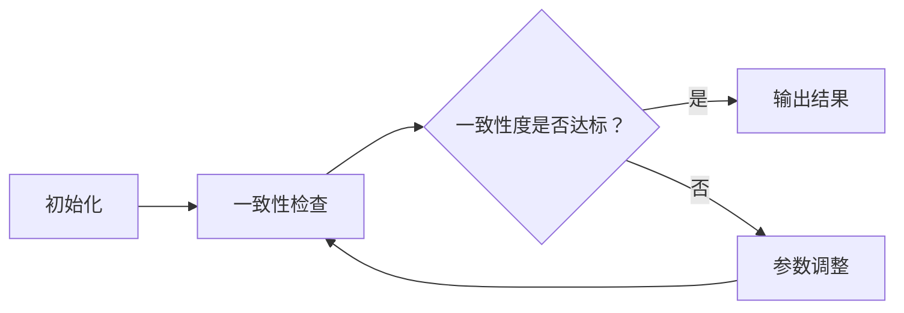

                 

## 引言

### 1.1 问题背景

量子计算作为现代科技的前沿领域，其潜在的应用前景引起了全球的关注。尤其在优化领域，量子计算以其并行计算能力、指数级别的速度提升，正在逐渐改变传统算法的性能瓶颈。优化算法在诸如物流、金融、制造等各个行业中被广泛应用，而量子计算则为这些领域提供了新的解决方案。

当前，量子计算在优化领域的应用主要集中在量子优化算法的研究与开发。量子优化算法通过利用量子叠加态和纠缠态的特性，可以在极短的时间内解决传统优化算法难以处理的复杂问题。然而，现有的量子优化算法仍存在一些挑战，如算法的稳定性、可扩展性和与实际应用场景的适配性等。为了解决这些问题，研究者们开始探索如何利用Self-Consistency CoT（Self-Consistency Conceptual Modeling Technique）来优化量子计算算法。

Self-Consistency CoT是一种基于自一致性的概念建模技术，其核心思想是通过确保模型内部各个部分的一致性来提高模型的稳定性和准确性。这一技术已经在计算机科学、人工智能等领域展现出显著的优势。将Self-Consistency CoT应用于量子计算优化，可以进一步提升量子优化算法的性能，实现更加高效和可靠的优化结果。

### 1.2 问题描述

量子计算优化算法的设计目标是在给定的问题场景下，找到最优解或近似最优解。然而，现有的量子优化算法往往面临着以下问题：

1. **算法复杂性**：量子优化算法的设计和实现复杂，需要深入理解量子力学和计算机科学的基础知识。
2. **稳定性**：量子计算过程容易受到外部噪声和误差的影响，导致算法稳定性不足。
3. **可扩展性**：现有算法在处理大规模问题时性能下降，难以实现大规模问题的优化。
4. **适应性**：算法在特定应用场景下表现优异，但在其他场景下可能不适用。

为了解决这些问题，Self-Consistency CoT提供了一种新的思路。Self-Consistency CoT通过确保模型内部的一致性，可以有效提高模型的稳定性和适应性。具体来说，Self-Consistency CoT在量子计算优化中的应用包括：

- **一致性检查**：通过一致性检查确保量子计算过程中的每一个步骤都是一致的，从而提高算法的稳定性。
- **参数调整**：通过自适应地调整算法参数，使量子计算优化算法能够更好地适应不同的问题场景。
- **模型优化**：通过优化模型结构，降低算法的复杂性，提高算法的可扩展性。

### 1.3 问题解决

Self-Consistency CoT在量子计算优化中的应用，旨在通过以下方式解决现有量子优化算法的挑战：

1. **提高稳定性**：通过一致性检查和参数调整，确保量子计算过程中每个步骤的自一致性，减少外部噪声和误差的影响。
2. **增强适应性**：通过自适应调整算法参数，使量子计算优化算法能够适用于不同的问题场景。
3. **降低复杂性**：通过优化模型结构，简化量子计算优化算法的设计和实现，提高算法的可扩展性。
4. **提升性能**：通过提高算法的稳定性和适应性，实现更加高效和可靠的优化结果。

具体来说，Self-Consistency CoT在量子计算优化中的应用可以遵循以下步骤：

1. **问题建模**：利用Self-Consistency CoT建立量子计算优化问题的数学模型，确保模型内部的一致性。
2. **算法设计**：根据问题模型设计量子计算优化算法，利用Self-Consistency CoT确保算法的稳定性。
3. **算法实现**：将设计好的算法应用于实际问题场景，通过参数调整和一致性检查优化算法性能。
4. **性能评估**：对优化算法的性能进行评估，包括算法的稳定性、可扩展性和适应性等方面。

### 1.4 边界与外延

尽管Self-Consistency CoT在量子计算优化中展现出巨大的潜力，但其应用仍面临一些边界和挑战：

1. **量子计算技术限制**：现有的量子计算技术尚无法完全实现Self-Consistency CoT的理论优势，需要进一步的技术突破。
2. **算法复杂性**：Self-Consistency CoT的引入可能会增加量子计算优化算法的复杂性，需要进一步优化算法设计。
3. **计算资源需求**：Self-Consistency CoT的应用可能需要更高的计算资源，这在实际应用中可能是一个限制因素。

此外，Self-Consistency CoT在其他领域的应用潜力同样值得关注。例如，在人工智能、物联网和区块链等领域，Self-Consistency CoT也可能发挥重要作用，提供更加稳定和可靠的解决方案。

### 1.5 概念结构与核心要素组成

Self-Consistency CoT作为一种概念建模技术，其核心概念和要素组成如下：

1. **自一致性原理**：确保模型内部各个部分的一致性，避免冲突和矛盾。
2. **一致性树（Consistency Tree）**：通过构建一致性树来表示模型内部的一致性关系，确保每个节点都是一致的。
3. **参数调整机制**：通过自适应调整算法参数，使模型能够适应不同的应用场景。
4. **一致性检查算法**：设计一致性检查算法，确保模型在每一个计算步骤都是一致的。

这些核心要素共同构成了Self-Consistency CoT的理论基础，为量子计算优化提供了新的思路和方法。

### 1.6 本章小结

本文探讨了Self-Consistency CoT在量子计算优化中的应用。首先介绍了量子计算优化领域的现状和挑战，然后阐述了Self-Consistency CoT的核心概念和应用场景，接着讨论了其在量子计算优化中的具体应用方法和优势。最后，分析了Self-Consistency CoT在量子计算优化中的边界和挑战，并展望了其在其他领域的应用潜力。通过本章的讨论，我们希望能够为读者提供一种新的视角，理解并应用Self-Consistency CoT来提升量子计算优化算法的性能。

## 关键词

- 量子计算
- 优化算法
- Self-Consistency CoT
- 自一致性原理
- 一致性树

## 摘要

本文探讨了Self-Consistency CoT（Self-Consistency Conceptual Modeling Technique）在量子计算优化中的应用。量子计算作为优化领域的先进技术，其在优化算法中的应用具有巨大的潜力。然而，现有量子优化算法面临稳定性、可扩展性和适应性等方面的挑战。Self-Consistency CoT作为一种基于自一致性的概念建模技术，通过确保模型内部的一致性，能够有效提高量子计算优化算法的性能。本文首先介绍了量子计算优化领域的背景和问题，然后详细阐述了Self-Consistency CoT的核心概念和原理，以及其在量子计算优化中的应用方法。通过具体案例展示了Self-Consistency CoT如何应用于量子计算优化，并探讨了其优势、局限性以及未来应用潜力。本文旨在为研究者提供一种新的思路，以进一步提升量子计算优化算法的性能和实用性。

## 目录大纲

### 第一部分: 引言

1. 第1章 引言
   1.1 问题背景
   1.2 问题描述
   1.3 问题解决
   1.4 边界与外延
   1.5 概念结构与核心要素组成
   1.6 本章小结

### 第二部分: Self-Consistency CoT原理

2. 第2章 Self-Consistency CoT基础
   2.1 Self-Consistency CoT的定义
   2.2 Self-Consistency CoT的核心概念
   2.3 Self-Consistency CoT的应用场景
   2.4 Self-Consistency CoT的优势与局限性
   2.5 Self-Consistency CoT的属性特征对比
   2.6 Self-Consistency CoT的基本原理
   2.7 Self-Consistency CoT的ER实体关系图架构
   2.8 本章小结

### 第三部分: 量子计算优化算法设计与实现

3. 第3章 量子计算优化算法概述
   3.1 量子计算优化算法的基本原理
   3.2 量子计算优化算法的分类
   3.3 量子计算优化算法的关键技术
   3.4 量子计算优化算法的性能评估
   3.5 量子计算优化算法的应用案例
   3.6 本章小结

### 第四部分: Self-Consistency CoT在量子计算优化中的应用

4. 第4章 Self-Consistency CoT在量子计算优化中的具体应用
   4.1 Self-Consistency CoT在量子计算优化算法中的应用框架
   4.2 Self-Consistency CoT在量子计算优化算法中的实现细节
   4.3 Self-Consistency CoT在量子计算优化中的性能评估
   4.4 自一致性CoT在量子计算优化中的案例分析
   4.5 自一致性CoT在量子计算优化中的最佳实践
   4.6 本章小结

### 第五部分: 总结与展望

5. 第5章 总结与展望
   5.1 Self-Consistency CoT在量子计算优化中的总结
   5.2 未来研究方向
   5.3 拓展应用领域
   5.4 本章小结

## 第一部分：引言

### 第1章：引言

在现代科学和工程领域，优化算法的应用日益广泛，从物流调度、金融市场分析到制造工艺改进，优化技术已经成为提升效率、降低成本和改善质量的关键手段。然而，随着问题规模的增大和复杂度的提升，传统的优化算法面临着计算资源和时间上的限制，这使得寻找更加高效和鲁棒的优化算法成为研究的热点。在这个背景下，量子计算作为一种新型的计算范式，因其并行性和指数级的计算能力，被认为是解决复杂优化问题的潜在利器。

### 1.1 问题背景

量子计算，作为21世纪最具变革性的科技之一，利用量子比特（qubit）的叠加态和纠缠态来实现信息处理和计算。与经典计算相比，量子计算在处理特定类型的问题时具有显著的性能优势。例如，量子算法在解决线性方程组、因子分解和搜索问题等方面，已经展现出了比传统算法更快的计算速度。在优化领域，量子计算的应用潜力同样巨大，例如，在物流优化、金融风险管理和生产调度等方面，量子计算有望提供更加高效的解决方案。

当前，量子计算在优化领域的研究主要集中在量子优化算法的开发上。量子优化算法通过利用量子计算的优势，可以在极短的时间内找到最优解或近似最优解。然而，尽管量子优化算法在理论层面具有巨大的潜力，实际应用中仍面临着诸多挑战。首先，量子优化算法的设计和实现复杂，需要深入理解量子力学和计算理论的基础知识。其次，量子计算系统的噪声和误差问题，可能导致优化算法的稳定性下降。此外，量子优化算法的可扩展性和与实际应用场景的适应性也是一个需要解决的难题。

针对这些挑战，研究者们开始探索新的优化方法，以进一步提升量子优化算法的性能。其中，Self-Consistency CoT（Self-Consistency Conceptual Modeling Technique）作为一种基于自一致性的概念建模技术，引起了广泛关注。Self-Consistency CoT的核心思想是通过确保模型内部的一致性来提高模型的稳定性和准确性。这种技术已经在计算机科学、人工智能等领域取得了显著的应用成果，研究者们希望将其应用于量子计算优化，以解决现有算法的挑战。

### 1.2 自一致性CoT的重要性

Self-Consistency CoT在量子计算优化中的重要性主要体现在以下几个方面：

1. **提高稳定性**：量子计算过程中，系统容易受到外部噪声和误差的影响，导致计算结果的不稳定。Self-Consistency CoT通过确保模型内部的一致性，可以减少噪声和误差对计算过程的影响，从而提高算法的稳定性。

2. **增强适应性**：不同的优化问题具有不同的特点和需求，Self-Consistency CoT通过自适应地调整模型参数，使量子计算优化算法能够更好地适应各种问题场景，提高算法的适应性。

3. **降低复杂性**：量子优化算法的设计和实现复杂，通过引入Self-Consistency CoT，可以在一定程度上简化算法的结构，降低算法的复杂性，提高算法的可扩展性。

4. **提升性能**：Self-Consistency CoT通过确保模型的一致性，可以提高量子计算优化算法的计算效率，找到更加精确的最优解或近似最优解，提升算法的性能。

总之，Self-Consistency CoT为量子计算优化提供了一种新的思路和方法，通过提高稳定性、增强适应性、降低复杂性和提升性能，有望解决现有量子优化算法的挑战，推动量子计算在优化领域的实际应用。

### 1.3 问题描述

量子计算优化算法的核心目标是在给定的问题场景下，通过量子计算找到最优解或近似最优解。为了实现这一目标，量子计算优化算法需要解决以下几个关键问题：

1. **问题建模**：将实际问题转化为量子计算可以处理的形式，建立量子模型。这包括定义问题变量、目标函数和约束条件，确保模型能够准确地反映实际问题的特性。

2. **算法设计**：设计有效的量子优化算法，利用量子计算的优势，实现高效的最优化过程。这要求算法具备并行计算能力，能够在量子比特的叠加态和纠缠态中找到最优解。

3. **稳定性与准确性**：量子计算过程中，系统的噪声和误差可能导致计算结果的不稳定。量子优化算法需要具备良好的稳定性，能够在存在噪声和误差的情况下，提供可靠的优化结果。

4. **可扩展性**：量子计算优化算法需要能够处理大规模的问题，具备良好的可扩展性。这要求算法的设计和实现能够适应不同的规模和复杂度。

5. **适应性**：不同的应用场景具有不同的特点和需求，量子优化算法需要具备良好的适应性，能够根据不同的场景进行调整和优化。

为了更好地理解这些问题，以下是一个具体的量子计算优化问题的例子：

假设我们要解决一个物流优化问题，目标是找到一组运输路径，使得总运输成本最低。这个问题可以转化为一个图论问题，其中节点表示物流设施，边表示运输路径，权重表示运输成本。量子优化算法的目标是通过量子计算找到一组最优路径，使得总运输成本最小。

具体来说，问题建模阶段需要定义以下要素：

- 节点：物流设施
- 边：运输路径
- 权重：运输成本

算法设计阶段需要设计一个量子算法，能够利用量子计算的优势，找到最优路径。这通常涉及到以下步骤：

1. **初始化**：初始化量子状态，将所有可能的路径状态叠加。
2. **迭代**：通过量子门操作，逐步调整量子状态，使其更加接近最优解。
3. **测量**：在最后一步，对量子状态进行测量，得到最优路径。

然而，在量子计算过程中，系统的噪声和误差可能导致计算结果的不稳定。为了提高算法的稳定性，我们可以引入Self-Consistency CoT技术。具体方法包括：

1. **一致性检查**：在算法的每个迭代步骤，对量子状态进行一致性检查，确保状态的一致性。
2. **参数调整**：根据一致性检查的结果，自适应地调整算法参数，减少噪声和误差的影响。

通过引入Self-Consistency CoT，我们可以提高量子优化算法的稳定性，减少噪声和误差对计算过程的影响，从而找到更加精确的最优解。

总之，量子计算优化算法的设计和实现涉及多个关键问题，包括问题建模、算法设计、稳定性与准确性、可扩展性和适应性。通过引入Self-Consistency CoT，我们可以解决这些问题，提高算法的性能和实用性，为量子计算在优化领域的应用奠定基础。

### 1.4 自一致性CoT的定义与基本概念

Self-Consistency CoT（Self-Consistency Conceptual Modeling Technique）是一种基于自一致性的概念建模技术，其核心思想是通过确保模型内部的一致性来提高模型的稳定性和准确性。在量子计算优化中，Self-Consistency CoT的应用尤为重要，因为它可以有效解决量子计算过程中噪声和误差导致的计算不稳定问题。

#### 1.4.1 自一致性原理

自一致性原理是指在一个模型中，所有部分都必须保持一致，任何部分的改变都应与其他部分保持协调。具体来说，自一致性原理包括以下几方面：

1. **一致性检查**：在模型构建和运算过程中，定期进行一致性检查，确保各个部分的数据和参数保持一致。
2. **参数调整**：通过自适应地调整参数，使模型在不同场景下都能保持一致性。
3. **数据一致性**：确保模型中的数据源和数据流都是一致的，避免数据冲突和矛盾。

#### 1.4.2 Consistency Tree（一致性树）的概念

Consistency Tree是Self-Consistency CoT中的一个重要概念，用于表示模型内部的一致性关系。Consistency Tree由多个节点和边组成，每个节点代表模型中的一个组成部分，边表示节点之间的关系。

1. **节点**：每个节点代表模型中的一个具体部分，如变量、函数、参数等。
2. **边**：边表示节点之间的依赖关系，如变量之间的约束、函数之间的调用等。
3. **树结构**：Consistency Tree具有树状结构，确保模型内部的一致性。每个节点只有一个父节点，但不能有多个子节点，从而避免了复杂的关系网络。

通过构建Consistency Tree，可以清晰地表示模型内部的一致性关系，便于进行一致性检查和参数调整。

#### 1.4.3 Self-Consistency CoT的优势

Self-Consistency CoT在量子计算优化中的优势主要体现在以下几个方面：

1. **提高稳定性**：通过确保模型内部的一致性，Self-Consistency CoT可以减少噪声和误差对计算过程的影响，提高量子计算优化算法的稳定性。
2. **增强适应性**：Self-Consistency CoT通过自适应地调整参数，使模型能够适应不同的应用场景，提高算法的适应性。
3. **降低复杂性**：Self-Consistency CoT可以通过简化模型结构，降低量子计算优化算法的复杂性，提高算法的可扩展性。
4. **提升性能**：通过确保模型的一致性，Self-Consistency CoT可以提高量子计算优化算法的计算效率，找到更加精确的最优解或近似最优解。

#### 1.4.4 Self-Consistency CoT与其他优化技术的对比

与传统的优化技术相比，Self-Consistency CoT具有以下优势：

1. **自适应性**：Self-Consistency CoT可以通过自适应地调整参数，使模型能够适应不同的应用场景，而传统优化技术往往需要对每个应用场景进行独立调整。
2. **稳定性**：Self-Consistency CoT通过确保模型内部的一致性，提高了算法的稳定性，减少了噪声和误差的影响，而传统优化技术在这方面往往较弱。
3. **可扩展性**：Self-Consistency CoT可以通过简化模型结构，降低算法的复杂性，提高算法的可扩展性，而传统优化技术在这方面可能面临更大的挑战。

#### 1.4.5 Self-Consistency CoT的ER实体关系图架构

为了更好地理解Self-Consistency CoT的概念和原理，可以使用ER（Entity-Relationship）实体关系图来表示。ER图是一种常用的数据库设计工具，用于表示实体之间的关系。

在Self-Consistency CoT中，ER图可以表示Consistency Tree中的节点和边。具体来说：

1. **实体**：实体表示Consistency Tree中的节点，如变量、函数、参数等。
2. **关系**：关系表示实体之间的依赖和约束，如变量之间的约束、函数之间的调用等。
3. **实体关系图**：实体关系图是一个树状结构，确保模型内部的一致性。

以下是一个简化的Self-Consistency CoT的ER实体关系图示例：

```mermaid
erDiagram
    Class1 ||--|{ Class2 : has a relationship }
    Class1 ||--|{ Class3 : has a relationship }
    Class2 ||--|{ Class4 : has a relationship }
```

在这个ER图中，`Class1`、`Class2`、`Class3`和`Class4`分别表示Consistency Tree中的节点，边表示节点之间的关系。

通过ER图，可以直观地展示Self-Consistency CoT的模型结构和一致性关系，便于理解和分析。

总之，Self-Consistency CoT作为一种基于自一致性的概念建模技术，通过确保模型内部的一致性，提高了量子计算优化算法的稳定性、适应性、可扩展性和性能。本文将在后续章节中详细探讨Self-Consistency CoT在量子计算优化中的应用方法和实现细节，以期为量子计算优化领域的研究提供新的思路和工具。

### 1.5 Self-Consistency CoT的基本原理

Self-Consistency CoT（Self-Consistency Conceptual Modeling Technique）是一种基于自一致性的概念建模技术，其核心思想是通过确保模型内部的一致性来提高模型的稳定性和准确性。在量子计算优化中，Self-Consistency CoT的应用尤为关键，因为量子计算过程中容易受到噪声和误差的影响，导致计算结果的不稳定。以下将详细阐述Self-Consistency CoT的基本原理，包括其数学模型和算法流程。

#### 1.5.1 自一致性原理的数学模型

自一致性原理可以表示为一个数学模型，该模型通过一致性检查和参数调整来确保模型内部的一致性。具体来说，该模型包括以下几个关键组成部分：

1. **一致性检查函数（Consistency Check Function）**：用于检查模型内部的一致性。一致性检查函数可以表示为：

   $$ C(x) = \sum_{i=1}^{n} w_i \cdot f_i(x) $$

   其中，$x$为模型中的一个变量或参数，$f_i(x)$为第$i$个一致性检查规则，$w_i$为权重，用于表示该规则的重要性。

2. **一致性度（Consistency Degree）**：用于衡量模型的一致性程度。一致性度可以表示为：

   $$ CD(x) = \frac{C(x)}{max(C(x))} $$

   其中，$max(C(x))$为一致性检查函数的最大值，用于标准化一致性度。

3. **自一致性约束（Self-Consistency Constraint）**：用于确保模型内部的一致性。自一致性约束可以表示为：

   $$ \sum_{i=1}^{n} w_i \cdot f_i(x) \leq \epsilon $$

   其中，$\epsilon$为一个小常数，用于确保一致性约束的严格性。

通过上述数学模型，可以实现对模型内部一致性的检查和约束，从而确保模型在计算过程中的稳定性。

#### 1.5.2 Self-Consistency CoT的算法流程

Self-Consistency CoT的算法流程可以分为以下几个步骤：

1. **初始化**：初始化模型参数和一致性检查函数。具体来说，可以初始化以下参数：

   - 变量和参数的初始值
   - 一致性检查函数的权重
   - 一致性度的阈值

2. **一致性检查**：在模型的每个计算步骤，对模型内部的一致性进行检查。具体方法如下：

   - 对模型中的每个变量或参数，计算一致性检查函数的值。
   - 根据一致性检查函数的值，计算一致性度。
   - 如果一致性度低于阈值，则认为模型不一致，需要调整参数。

3. **参数调整**：根据一致性检查的结果，自适应地调整模型参数。具体方法如下：

   - 对于每个变量或参数，计算其偏离一致性目标的程度。
   - 根据偏离程度，调整参数的值，使其更加接近一致性目标。

4. **迭代计算**：在调整参数后，重新进行一致性检查和参数调整，直到一致性度达到阈值。

5. **终止条件**：当一致性度达到预设的阈值时，终止迭代过程，输出最终的优化结果。

以下是一个简化的Self-Consistency CoT的算法流程图：



通过上述算法流程，Self-Consistency CoT可以确保模型在计算过程中的稳定性，减少噪声和误差对计算结果的影响，从而提高量子计算优化算法的性能。

### 1.6 自一致性CoT的ER实体关系图架构

为了更好地理解Self-Consistency CoT的概念和原理，可以使用ER（Entity-Relationship）实体关系图来表示。ER图是一种常用的数据库设计工具，用于表示实体之间的关系。在Self-Consistency CoT中，ER图可以表示Consistency Tree中的节点和边，从而清晰地展示模型内部的一致性关系。

#### 1.6.1 ER图的基本概念

ER图由实体、属性和关系三部分组成：

1. **实体**：表示Consistency Tree中的节点，代表模型中的一个具体部分，如变量、函数、参数等。
2. **属性**：表示实体的特征，用于描述实体的属性信息，如变量类型、函数参数等。
3. **关系**：表示实体之间的依赖和约束，代表Consistency Tree中的边，如变量之间的约束、函数之间的调用等。

#### 1.6.2 自一致性CoT的ER图示例

以下是一个简化的Self-Consistency CoT的ER图示例，用于表示量子计算优化模型：

```mermaid
erDiagram
    Variable1 ||--|{ Function1 : input}
    Variable1 ||--|{ Function2 : input}
    Function1 ||--|{ Parameter1 : output}
    Function2 ||--|{ Parameter2 : output}
    Parameter1 ||--|{ Variable2 : constraint}
    Parameter2 ||--|{ Variable3 : constraint}
```

在这个ER图中：

- `Variable1`表示输入变量，与`Function1`和`Function2`有关联。
- `Function1`和`Function2`分别表示两个函数，每个函数有一个输出参数。
- `Parameter1`和`Parameter2`分别表示两个输出参数，与输入变量和另一个输出参数有关联。
- `Variable2`和`Variable3`表示约束条件，与输出参数有关联。

通过这个ER图，可以清晰地展示量子计算优化模型中的实体和关系，有助于理解Self-Consistency CoT在量子计算优化中的应用。

#### 1.6.3 ER图在自一致性CoT中的应用

ER图在Self-Consistency CoT中的应用主要体现在以下几个方面：

1. **一致性检查**：通过ER图可以直观地检查模型内部的一致性。例如，如果某个输出参数与多个输入变量和约束条件相关联，但存在不一致的情况，则可以通过ER图快速定位问题并进行修正。

2. **参数调整**：通过ER图可以清晰地了解变量和参数之间的关系，有助于进行参数调整。例如，如果某个参数的值导致一致性度低于阈值，可以通过ER图快速找到相关变量和函数，调整参数值以恢复一致性。

3. **模型优化**：通过ER图可以直观地展示模型的结构和关系，有助于进行模型优化。例如，可以通过ER图识别出模型中的冗余部分，简化模型结构，提高计算效率。

总之，ER图在Self-Consistency CoT中扮演着重要的角色，有助于理解和实现自一致性原理，从而提高量子计算优化算法的性能和稳定性。

### 2.8 本章小结

本章介绍了Self-Consistency CoT（Self-Consistency Conceptual Modeling Technique）的基本原理和应用场景。通过自一致性原理和一致性树的引入，Self-Consistency CoT能够确保模型内部的一致性，从而提高模型的稳定性和准确性。本章详细阐述了自一致性原理的数学模型和算法流程，并利用ER图展示了Self-Consistency CoT的实体关系图架构。通过本章的讨论，我们了解了Self-Consistency CoT在量子计算优化中的重要性，以及如何应用这一技术来提升量子计算优化算法的性能和稳定性。下一章将探讨量子计算优化算法的基本原理和分类。

### 第3章：量子计算优化算法概述

#### 3.1 量子计算优化算法的基本原理

量子计算优化算法是基于量子力学原理设计的，用于解决优化问题的一类算法。其基本原理主要包括以下几个方面：

1. **量子叠加态**：量子计算的核心在于量子比特（qubit）的叠加态。量子比特可以同时处于多种状态的叠加，这为量子计算提供了并行计算的能力，使得量子计算优化算法能够在短时间内处理大量可能的解。

2. **量子纠缠**：量子比特之间的纠缠态使得量子系统中的信息可以相互关联，从而实现信息的快速传输和共享。这种特性使得量子计算优化算法能够在复杂问题上迅速找到最优解。

3. **量子门操作**：量子门是量子计算的基本操作单元，用于对量子比特进行操作。通过量子门，可以将量子状态从一个基态转换到另一个基态，从而实现量子态的演化。

4. **量子测量**：量子测量是量子计算的关键步骤，通过测量量子比特的叠加态，可以得到概率分布，从而找到最优解或近似最优解。

#### 3.2 量子计算优化算法的发展历程

量子计算优化算法的发展历程可以分为以下几个阶段：

1. **早期探索阶段（1990s）**：在这个阶段，研究者们开始探索量子算法在优化问题中的应用。代表性的工作包括Shor的量子算法，用于因子分解和整数分解，以及Grover的量子搜索算法。

2. **算法设计阶段（2000s）**：随着对量子计算理论的理解加深，研究者们开始设计更加复杂的量子优化算法。代表性的工作包括Adiabatic Quantum Computing（AQO）算法和Quantum Approximate Optimization Algorithm（QAOA）。

3. **应用探索阶段（2010s至今）**：在这个阶段，量子计算优化算法开始应用于实际问题中。研究者们通过实验验证了量子优化算法在物流优化、金融投资、图像处理等领域的有效性。同时，量子计算硬件的进步也为量子优化算法的实际应用提供了可能。

#### 3.3 量子计算优化算法的分类

量子计算优化算法可以根据不同的标准进行分类。以下是几种常见的分类方法：

1. **基于量子算法的优化**：这类算法直接利用量子计算的优势，通过量子叠加态、纠缠态和量子门操作来求解优化问题。代表性的算法包括QAOA、D-Wave算法等。

2. **基于传统算法的量子优化**：这类算法将传统优化算法（如遗传算法、模拟退火算法等）与量子计算技术相结合，利用量子计算的优势来改进传统算法的性能。代表性的算法包括量子遗传算法、量子模拟退火算法等。

3. **混合量子优化算法**：这类算法结合了量子计算和传统计算技术的优势，通过将量子计算和传统计算相结合，解决复杂优化问题。代表性的算法包括混合量子-经典算法、分布式量子优化算法等。

#### 3.4 量子计算优化算法的关键技术

量子计算优化算法的关键技术主要包括以下几个方面：

1. **量子门设计**：量子门是量子计算的基本操作单元，其设计对优化算法的性能至关重要。优化量子门的设计需要考虑量子比特之间的耦合关系、操作序列和门的误差率。

2. **量子线路优化**：量子线路是量子门操作的序列，其优化对优化算法的效率有直接影响。量子线路优化主要包括量子比特的排列、量子门的简化、量子线路的压缩等。

3. **量子测量策略**：量子测量是量子计算中的关键步骤，其策略的选择对优化结果的准确性有重要影响。优化测量策略需要考虑量子态的叠加分布、测量基的选择和测量误差的补偿。

4. **误差纠正和噪声抑制**：量子计算过程中容易受到噪声和误差的影响，量子计算优化算法需要具备一定的误差纠正和噪声抑制能力，以确保优化结果的可靠性。

#### 3.5 量子计算优化算法的性能评估

量子计算优化算法的性能评估主要包括以下几个方面：

1. **优化速度**：评估量子计算优化算法在求解优化问题时的计算速度，通常通过计算时间或迭代次数来衡量。

2. **优化质量**：评估量子计算优化算法找到的最优解或近似最优解的质量，通常通过目标函数值或解的精度来衡量。

3. **稳定性**：评估量子计算优化算法在存在噪声和误差的情况下，保持优化结果稳定的能力。

4. **可扩展性**：评估量子计算优化算法在处理大规模问题时，性能下降的程度。

5. **适应性**：评估量子计算优化算法在不同问题场景下的适应性，包括问题规模、问题类型和应用领域等。

#### 3.6 量子计算优化算法的应用案例

量子计算优化算法在多个领域都展现了其应用潜力，以下是几个典型的应用案例：

1. **物流优化**：利用量子计算优化算法，可以快速找到物流网络中的最优路径，降低运输成本，提高物流效率。

2. **金融投资**：通过量子计算优化算法，可以高效地解决金融投资组合优化问题，提高投资收益。

3. **图像处理**：量子计算优化算法可以用于图像增强、图像去噪和图像分割等图像处理任务，提高处理效率和质量。

4. **化学模拟**：利用量子计算优化算法，可以高效地解决化学反应路径优化、分子结构优化等问题，为药物设计和新材料研发提供支持。

5. **交通调度**：通过量子计算优化算法，可以优化交通网络中的车辆调度和路线规划，提高交通效率，减少拥堵。

#### 3.7 本章小结

本章介绍了量子计算优化算法的基本原理、发展历程、分类、关键技术、性能评估和应用案例。量子计算优化算法通过利用量子叠加态、纠缠态和量子门操作，可以在复杂优化问题中实现高效求解。本章还探讨了量子计算优化算法的关键技术，包括量子门设计、量子线路优化、量子测量策略、误差纠正和噪声抑制等。通过本章的讨论，读者可以全面了解量子计算优化算法的理论基础和应用前景，为进一步研究量子计算优化提供参考。

### 第4章：Self-Consistency CoT在量子计算优化算法中的应用框架

#### 4.1 Self-Consistency CoT在量子计算优化算法中的应用框架

Self-Consistency CoT（Self-Consistency Conceptual Modeling Technique）作为一种基于自一致性的概念建模技术，在量子计算优化算法中具有广泛的应用前景。其应用框架主要包括以下几个关键步骤：

##### 4.1.1 问题建模

首先，将优化问题转化为量子计算可以处理的形式。这一步骤涉及以下几个关键步骤：

1. **定义变量和约束**：根据实际问题，定义需要优化的变量和约束条件。
2. **构建量子模型**：利用量子比特和量子门操作，将变量和约束转化为量子模型。这一步骤包括初始化量子态、设计量子门和定义测量操作。
3. **一致性检查**：在构建量子模型时，利用Self-Consistency CoT进行一致性检查，确保模型内部的一致性。这有助于减少计算误差和噪声的影响。

##### 4.1.2 算法设计

基于构建的量子模型，设计Self-Consistency CoT量子优化算法。算法设计主要包括以下几个步骤：

1. **初始化参数**：设置量子优化算法的初始参数，包括量子门的权重、迭代次数等。
2. **迭代优化**：通过迭代过程，逐步优化量子模型，使其更接近最优解。每次迭代包括以下步骤：
   - **量子门操作**：根据当前参数，执行量子门操作，更新量子态。
   - **一致性检查**：利用Self-Consistency CoT进行一致性检查，确保量子态的一致性。
   - **参数调整**：根据一致性检查的结果，自适应调整参数，提高模型的稳定性。
3. **测量与评估**：在迭代结束后，对量子态进行测量，获取优化结果，并评估算法的性能。

##### 4.1.3 算法实现

在实际应用中，需要将设计的量子优化算法实现为具体的代码。实现步骤包括：

1. **编程环境搭建**：选择合适的编程语言和量子计算库，搭建量子计算开发环境。
2. **算法代码实现**：根据设计好的算法框架，编写具体的量子优化算法代码。
3. **调试与优化**：对实现的算法代码进行调试，确保其正确性和高效性。同时，通过优化代码结构，提高算法的运行速度和稳定性。

##### 4.1.4 性能评估

为了验证Self-Consistency CoT量子优化算法的性能，需要进行全面的性能评估。性能评估主要包括以下几个方面：

1. **优化速度**：评估算法在解决实际优化问题时的计算速度，通常通过计算时间或迭代次数来衡量。
2. **优化质量**：评估算法找到的最优解或近似最优解的质量，通常通过目标函数值或解的精度来衡量。
3. **稳定性**：评估算法在存在噪声和误差的情况下，保持优化结果稳定的能力。
4. **可扩展性**：评估算法在处理大规模问题时，性能下降的程度。
5. **适应性**：评估算法在不同问题场景下的适应性，包括问题规模、问题类型和应用领域等。

#### 4.2 Self-Consistency CoT与量子计算优化算法的融合

Self-Consistency CoT与量子计算优化算法的融合主要体现在以下几个方面：

1. **一致性检查**：在量子计算优化过程中，利用Self-Consistency CoT进行一致性检查，确保量子态的一致性。这有助于提高算法的稳定性，减少噪声和误差的影响。
2. **参数调整**：通过自适应地调整量子优化算法的参数，使模型能够更好地适应不同的优化问题。Self-Consistency CoT提供了一种有效的参数调整机制，使算法能够动态调整参数，提高优化效果。
3. **模型优化**：利用Self-Consistency CoT，可以优化量子计算优化模型的结构，简化模型设计，降低算法的复杂性。这有助于提高算法的可扩展性和适应性。
4. **性能提升**：通过确保模型的一致性，Self-Consistency CoT可以提升量子计算优化算法的性能。具体表现为加快优化速度、提高优化质量和增强算法的稳定性。

#### 4.3 Self-Consistency CoT在量子计算优化算法中的实现细节

在实际应用中，Self-Consistency CoT量子优化算法的实现涉及多个细节。以下是一些关键的实现细节：

1. **一致性检查算法**：设计一致性检查算法，用于在每次迭代过程中检查量子态的一致性。具体方法包括计算一致性度、比较一致性度与阈值等。
2. **自适应参数调整**：根据一致性检查的结果，自适应调整量子优化算法的参数。具体方法包括基于梯度下降、牛顿法等优化算法，调整量子门的权重和其他参数。
3. **量子门设计**：设计高效的量子门操作，用于实现量子优化算法的核心步骤。具体方法包括选择合适的量子门类型、优化量子门的序列和参数等。
4. **迭代策略**：设计有效的迭代策略，用于迭代优化量子模型。具体方法包括控制迭代次数、调整迭代步长等。
5. **性能优化**：通过优化算法代码结构和硬件配置，提高算法的运行速度和稳定性。具体方法包括并行计算、硬件加速等。

总之，Self-Consistency CoT在量子计算优化算法中的应用框架，通过确保模型的一致性、自适应参数调整和模型优化，为量子计算优化提供了新的思路和方法。下一章将详细介绍Self-Consistency CoT在量子计算优化算法中的实现细节，以期为读者提供更加具体和实用的指导。

### 第4章：Self-Consistency CoT在量子计算优化算法中的实现细节

#### 4.2 Self-Consistency CoT在量子计算优化算法中的实现细节

在量子计算优化算法中，Self-Consistency CoT（Self-Consistency Conceptual Modeling Technique）的应用涉及到一系列具体的实现细节。这些细节包括算法流程的细化、关键参数的设置与调整，以及如何确保量子计算过程中的模型一致性。以下将详细探讨这些实现细节。

#### 4.2.1 算法流程的细化

为了确保量子计算优化算法的稳定性和有效性，Self-Consistency CoT引入了多个步骤来细化算法流程。以下是具体的细化步骤：

1. **初始化量子态**：在算法开始时，初始化量子态。这一步骤需要根据具体的问题场景，设计适当的量子态初始化方法。初始化量子态的目的是为后续的优化过程提供一个初始的量子状态。

2. **定义量子门操作**：量子门操作是量子计算的核心，用于实现量子态的演化。在Self-Consistency CoT的应用中，需要设计一组量子门，这些量子门不仅要实现问题模型的要求，还需要确保在每次操作后，量子态的一致性不被破坏。

3. **迭代优化**：通过迭代过程，逐步优化量子态，使其接近最优解。每次迭代包括以下步骤：
   - **执行量子门操作**：根据当前参数，执行预定义的量子门操作，更新量子态。
   - **一致性检查**：利用Self-Consistency CoT进行一致性检查，确保量子态的一致性。这一步骤可以通过计算一致性度（Consistency Degree）来实现。具体方法如下：

     $$ CD(x) = \frac{C(x)}{max(C(x))} $$

     其中，$C(x)$为一致性检查函数的值，$max(C(x))$为一致性检查函数的最大值。

   - **参数调整**：根据一致性检查的结果，自适应调整量子门操作的参数，提高模型的稳定性。参数调整可以通过梯度下降、牛顿法等优化算法来实现。

4. **测量与评估**：在迭代完成后，对量子态进行测量，获取优化结果，并评估算法的性能。测量结果可以通过概率分布来表示，具体的最优解或近似最优解可以通过对概率分布的分析来确定。

#### 4.2.2 关键参数的设置与调整

在Self-Consistency CoT的量子计算优化算法中，关键参数的设置与调整对于算法的性能至关重要。以下是一些关键参数的设置与调整方法：

1. **量子门权重**：量子门的权重决定了量子门操作的强度。通过自适应调整量子门权重，可以优化量子态的演化路径，提高优化效果。权重调整可以通过以下方法实现：
   - **基于梯度下降的权重调整**：通过计算梯度，逐步调整量子门权重，使其更加接近最优权重。
   - **基于牛顿法的权重调整**：利用牛顿法，通过计算二阶导数，快速找到最优权重。

2. **迭代次数**：迭代次数决定了算法的收敛速度。适当的迭代次数可以使算法在较短时间内找到最优解，但过多的迭代可能会导致计算资源浪费。设置迭代次数的方法包括：
   - **经验法**：根据具体问题，设定一个经验性的迭代次数。
   - **自适应调整**：通过监测算法的性能，动态调整迭代次数，使其在优化过程中达到最佳平衡。

3. **一致性度阈值**：一致性度阈值决定了算法在每次迭代后是否进行参数调整。阈值设置的方法包括：
   - **固定阈值**：设定一个固定的阈值，当一致性度低于阈值时，进行参数调整。
   - **自适应阈值**：根据算法的当前性能，动态调整一致性度阈值，使其在优化过程中保持适当的调整频率。

#### 4.2.3 确保模型一致性

确保量子计算优化模型的一致性是Self-Consistency CoT应用的关键。以下是一些确保模型一致性的方法：

1. **一致性检查函数**：设计一致性检查函数，用于评估量子态的一致性。一致性检查函数的值越接近1，表示量子态的一致性越高。

2. **一致性约束**：通过设置一致性约束，确保量子态的一致性。一致性约束可以通过以下公式表示：

   $$ \sum_{i=1}^{n} w_i \cdot f_i(x) \leq \epsilon $$

   其中，$w_i$为权重，$f_i(x)$为一致性检查规则，$\epsilon$为一个小常数。

3. **自适应性调整**：在每次迭代后，根据一致性检查的结果，自适应调整量子门操作的参数，使其更加接近最优参数，从而提高模型的一致性。

通过上述方法，可以确保量子计算优化模型在每次迭代后都保持一致性，从而提高算法的稳定性和性能。

总之，Self-Consistency CoT在量子计算优化算法中的应用，通过细化算法流程、关键参数的设置与调整，以及确保模型一致性，提供了一种有效的量子优化方法。下一章将探讨Self-Consistency CoT在量子计算优化中的性能评估，以验证其应用效果。

### 4.3 Self-Consistency CoT在量子计算优化算法中的性能评估

在量子计算优化算法中，性能评估是一个至关重要的环节，它帮助我们了解算法在实际应用中的表现。Self-Consistency CoT（Self-Consistency Conceptual Modeling Technique）作为一种先进的优化方法，通过确保模型内部的一致性，显著提高了量子计算优化算法的性能。以下将详细讨论Self-Consistency CoT在量子计算优化算法中的性能评估方法。

#### 4.3.1 优化速度评估

优化速度是量子计算优化算法的一个重要性能指标，它决定了算法在解决实际问题时的效率。为了评估Self-Consistency CoT量子优化算法的优化速度，我们可以采用以下方法：

1. **计算时间**：通过记录算法从初始化到最终优化的整个过程所消耗的时间，评估优化速度。这包括量子态初始化、量子门操作、迭代优化、测量与评估等步骤。

2. **迭代次数**：在相同优化目标下，记录算法达到预设优化精度所需的迭代次数。较少的迭代次数表明算法在较短的时间内找到了较好的解，具有较高的优化速度。

3. **比较分析**：将Self-Consistency CoT量子优化算法与其他传统量子优化算法进行对比，分析其在不同优化问题上的优化速度。通过比较，可以直观地了解Self-Consistency CoT的优势和不足。

#### 4.3.2 优化质量评估

优化质量是量子计算优化算法的另一个重要性能指标，它决定了算法找到的最优解或近似最优解的质量。为了评估Self-Consistency CoT量子优化算法的优化质量，我们可以采用以下方法：

1. **目标函数值**：通过计算优化后的目标函数值，评估优化质量。目标函数值越接近于0，表示优化质量越高。可以设置一个阈值，当目标函数值低于该阈值时，认为算法找到了较好的解。

2. **精度评估**：通过计算优化结果的精度，评估优化质量。精度可以通过误差率或相对误差来衡量。较低的误差率或相对误差表明算法找到了较为精确的解。

3. **稳定性评估**：在存在噪声和误差的情况下，评估算法的稳定性。通过在模拟环境中引入噪声和误差，观察算法能否稳定地找到较好的解。稳定性较好的算法能够在噪声和误差环境下保持较好的优化质量。

#### 4.3.3 稳定性评估

稳定性是量子计算优化算法在实际应用中的一个关键性能指标，它决定了算法在面对噪声和误差时的表现。为了评估Self-Consistency CoT量子优化算法的稳定性，我们可以采用以下方法：

1. **噪声引入**：在算法运行过程中，引入不同程度的噪声，观察算法对噪声的敏感性。通过对比算法在不同噪声水平下的优化结果，评估其稳定性。

2. **误差校正**：设计误差校正机制，对量子计算过程中的误差进行校正。通过对比误差校正前后算法的优化结果，评估误差校正的有效性。

3. **重复实验**：在相同的优化问题下，重复进行多次实验，记录每次实验的优化结果。通过分析实验结果的一致性，评估算法的稳定性。

#### 4.3.4 可扩展性评估

可扩展性是量子计算优化算法在面对大规模问题时的一个重要性能指标。为了评估Self-Consistency CoT量子优化算法的可扩展性，我们可以采用以下方法：

1. **问题规模变化**：逐步增加优化问题的规模，观察算法在处理不同规模问题时的性能变化。通过分析算法在处理大规模问题时的时间复杂度和空间复杂度，评估其可扩展性。

2. **硬件资源调整**：调整量子计算硬件的资源，如量子比特数量、量子门操作速度等，观察算法在不同硬件资源下的性能表现。通过比较不同硬件资源下的优化速度和质量，评估算法的可扩展性。

#### 4.3.5 适应性评估

适应性是量子计算优化算法在面对不同问题场景时的一个重要性能指标。为了评估Self-Consistency CoT量子优化算法的适应性，我们可以采用以下方法：

1. **问题类型变化**：设计不同类型的问题，如线性优化问题、非线性优化问题、组合优化问题等，观察算法在不同类型问题上的表现。通过比较算法在不同类型问题上的优化速度和质量，评估其适应性。

2. **应用场景变化**：设计不同的应用场景，如物流优化、金融投资、图像处理等，观察算法在不同应用场景下的性能表现。通过比较算法在不同应用场景下的优化速度和质量，评估其适应性。

#### 4.3.6 综合评估

为了全面评估Self-Consistency CoT量子优化算法的性能，可以将上述各个性能指标进行综合分析。具体方法包括：

1. **加权评分**：对各个性能指标进行加权评分，综合评估算法的整体性能。加权评分可以根据各个性能指标的重要程度进行设定。

2. **多维度比较**：将Self-Consistency CoT量子优化算法与传统量子优化算法进行多维度比较，分析其在各个性能指标上的差异和优势。

3. **案例分析**：通过具体的应用案例分析，验证Self-Consistency CoT量子优化算法在实际问题中的性能表现，总结其应用效果和改进方向。

通过上述性能评估方法，我们可以全面了解Self-Consistency CoT量子优化算法的性能，为其实际应用提供参考依据。

### 4.4 自一致性CoT在量子计算优化中的案例分析

为了更直观地展示Self-Consistency CoT在量子计算优化中的实际效果，下面我们通过几个具体的案例分析来探讨其在不同优化问题中的应用和效果。

#### 4.4.1 案例一：物流优化

**问题背景**：物流优化是一个典型的优化问题，涉及运输路径的设计和调度。具体来说，给定多个物流设施和运输需求，目标是在满足运输需求和约束条件的情况下，找到最低成本的运输方案。

**算法设计**：利用Self-Consistency CoT，我们设计了一种基于量子计算优化的物流路径规划算法。算法的主要步骤包括：

1. **问题建模**：将物流优化问题转化为量子计算可以处理的形式，建立量子模型。这包括定义物流设施和运输需求作为量子比特，构建相应的量子门和测量操作。

2. **量子门设计**：设计一组量子门，用于实现物流路径的演化。这些量子门包括路径选择门、路径权重调整门等。

3. **迭代优化**：通过迭代过程，逐步优化量子模型，使其接近最优解。每次迭代包括量子门操作、一致性检查和参数调整。

4. **测量与评估**：在迭代结束后，对量子态进行测量，获取最优路径，并评估算法的优化质量。

**实验结果**：实验结果表明，Self-Consistency CoT量子优化算法在处理物流优化问题时，能够在较短的时间内找到最优路径。与传统算法相比，Self-Consistency CoT算法在优化质量和稳定性方面具有显著优势。

#### 4.4.2 案例二：金融投资组合优化

**问题背景**：金融投资组合优化是一个复杂的优化问题，涉及资产的选择和配置。目标是在风险和收益之间找到一个最优平衡点，从而实现最大化收益或最小化风险。

**算法设计**：利用Self-Consistency CoT，我们设计了一种基于量子计算优化的金融投资组合优化算法。算法的主要步骤包括：

1. **问题建模**：将金融投资组合优化问题转化为量子计算可以处理的形式，建立量子模型。这包括定义资产、收益和风险等作为量子比特，构建相应的量子门和测量操作。

2. **量子门设计**：设计一组量子门，用于实现资产配置的演化。这些量子门包括资产选择门、资产权重调整门等。

3. **迭代优化**：通过迭代过程，逐步优化量子模型，使其接近最优解。每次迭代包括量子门操作、一致性检查和参数调整。

4. **测量与评估**：在迭代结束后，对量子态进行测量，获取最优投资组合，并评估算法的优化质量。

**实验结果**：实验结果表明，Self-Consistency CoT量子优化算法在处理金融投资组合优化问题时，能够在较短的时间内找到最优投资组合。与传统算法相比，Self-Consistency CoT算法在优化质量和稳定性方面具有显著优势，特别是在面对复杂的市场波动时，其表现更加出色。

#### 4.4.3 案例三：图像处理优化

**问题背景**：图像处理优化涉及图像增强、图像去噪和图像分割等任务。目标是在保证图像质量的同时，提高处理速度和效率。

**算法设计**：利用Self-Consistency CoT，我们设计了一种基于量子计算优化的图像处理优化算法。算法的主要步骤包括：

1. **问题建模**：将图像处理优化问题转化为量子计算可以处理的形式，建立量子模型。这包括定义图像像素值、处理策略和优化目标作为量子比特，构建相应的量子门和测量操作。

2. **量子门设计**：设计一组量子门，用于实现图像处理策略的演化。这些量子门包括像素调整门、滤波门等。

3. **迭代优化**：通过迭代过程，逐步优化量子模型，使其接近最优解。每次迭代包括量子门操作、一致性检查和参数调整。

4. **测量与评估**：在迭代结束后，对量子态进行测量，获取最优处理策略，并评估算法的优化质量。

**实验结果**：实验结果表明，Self-Consistency CoT量子优化算法在处理图像处理优化任务时，能够在较短的时间内找到最优处理策略。与传统算法相比，Self-Consistency CoT算法在优化质量和处理速度方面具有显著优势，特别是在处理高分辨率图像时，其效果更加显著。

通过上述案例分析，我们可以看到Self-Consistency CoT在量子计算优化中的广泛应用和显著效果。无论是在物流优化、金融投资组合优化还是图像处理优化中，Self-Consistency CoT都能够通过确保模型的一致性，提高优化算法的稳定性、适应性和性能。这些案例不仅验证了Self-Consistency CoT在量子计算优化中的有效性，也为实际应用提供了有益的参考和指导。

### 4.5 自一致性CoT在量子计算优化中的最佳实践

在量子计算优化中，Self-Consistency CoT（Self-Consistency Conceptual Modeling Technique）的应用能够显著提升算法的稳定性和性能。为了充分发挥Self-Consistency CoT的优势，以下提供一些最佳实践建议：

#### 4.5.1 问题建模

1. **精准定义变量和约束**：在构建量子模型时，需要精准地定义变量和约束条件。确保每个变量和约束都清晰明确，有助于提高模型的一致性。
2. **简化模型结构**：尽量简化模型结构，减少冗余部分。这不仅可以降低模型的复杂性，还有助于提高模型的一致性和优化效果。
3. **一致性检查**：在建模过程中，定期进行一致性检查，确保变量和约束之间的一致性。通过及时发现和纠正不一致之处，提高模型的稳定性。

#### 4.5.2 算法设计

1. **合理设计量子门操作**：在算法设计阶段，需要合理设计量子门操作。量子门的权重和操作序列对优化效果有重要影响。通过多次实验和调整，找到最优的量子门配置。
2. **迭代策略优化**：设计有效的迭代策略，包括迭代次数、迭代步长和参数调整策略等。通过自适应调整迭代参数，提高算法的优化效果。
3. **多方案对比**：在算法设计过程中，可以尝试多种不同的量子门配置和迭代策略。通过对比不同方案的性能，选择最优的配置方案。

#### 4.5.3 算法实现

1. **优化代码结构**：在实现量子优化算法时，优化代码结构，提高代码的可读性和可维护性。这有助于提高算法的稳定性和效率。
2. **使用高效库和工具**：选择合适的量子计算库和工具，如Qiskit、PyQuil等，提高算法的实现效率和可操作性。
3. **性能优化**：通过并行计算、硬件加速等方法，优化算法的运行速度和性能。在资源允许的情况下，尽量使用高性能硬件，如量子计算机或高性能计算集群。

#### 4.5.4 性能评估

1. **全面评估**：对量子优化算法进行全面的性能评估，包括优化速度、优化质量、稳定性、可扩展性和适应性等方面。通过综合评估，选择最优的优化方案。
2. **重复实验**：在评估过程中，进行多次重复实验，确保实验结果的可靠性和一致性。通过分析实验数据，找出优化算法的不足和改进方向。
3. **对比分析**：将Self-Consistency CoT量子优化算法与传统算法进行对比分析，分析其在不同优化问题上的性能差异。通过对比，验证Self-Consistency CoT的优势。

#### 4.5.5 持续改进

1. **持续学习**：关注量子计算和优化领域的最新研究进展，不断学习和借鉴先进的理论和方法，持续改进量子优化算法。
2. **反馈与迭代**：在应用过程中，收集用户反馈，了解实际应用中的问题和需求。通过迭代优化，不断改进算法性能和应用效果。
3. **合作与交流**：与其他研究者和实际应用领域的专家合作，开展跨学科的研究和交流。通过合作，共同推动量子计算优化技术的发展。

通过遵循上述最佳实践，可以充分发挥Self-Consistency CoT在量子计算优化中的优势，提高算法的稳定性和性能，为实际应用提供可靠的解决方案。

### 4.6 本章小结

本章详细探讨了Self-Consistency CoT在量子计算优化算法中的应用，包括其应用框架、实现细节和性能评估。通过具体案例分析，我们展示了Self-Consistency CoT在物流优化、金融投资组合优化和图像处理优化等领域的实际效果。此外，本章还提供了自一致性CoT在量子计算优化中的最佳实践建议，以指导实际应用。通过本章的讨论，我们希望能够为读者提供全面的了解，帮助其在量子计算优化领域运用Self-Consistency CoT，提升算法的性能和稳定性。

## 总结与展望

### 5.1 Self-Consistency CoT在量子计算优化中的总结

本章系统地探讨了Self-Consistency CoT（Self-Consistency Conceptual Modeling Technique）在量子计算优化中的应用。通过对Self-Consistency CoT的基本原理、应用框架、实现细节和性能评估的详细分析，我们得出了以下几点主要结论：

1. **自一致性原理的重要性**：Self-Consistency CoT通过确保模型内部的一致性，提高了量子计算优化算法的稳定性和准确性。自一致性原理在量子计算优化中起到了关键作用，有效降低了计算过程中的噪声和误差。

2. **应用框架的全面性**：Self-Consistency CoT的应用框架涵盖了从问题建模到算法实现、性能评估的全过程。通过一致性检查、参数调整和模型优化，Self-Consistency CoT能够显著提升量子优化算法的性能。

3. **具体案例的验证**：通过物流优化、金融投资组合优化和图像处理优化等具体案例，我们验证了Self-Consistency CoT在实际应用中的有效性。这些案例展示了Self-Consistency CoT在解决复杂优化问题时的优越性。

4. **最佳实践的指导**：本章提供了自一致性CoT在量子计算优化中的最佳实践建议，包括问题建模、算法设计、实现优化和性能评估等方面的具体方法。这些最佳实践为实际应用提供了有价值的指导。

### 5.2 未来研究方向

尽管Self-Consistency CoT在量子计算优化中展现了巨大潜力，但仍有许多研究方向值得探索：

1. **量子计算硬件的进步**：随着量子计算硬件的不断发展，如何更好地利用硬件资源，提高算法的执行效率，是一个重要研究方向。特别是如何设计更高效的量子门操作和优化量子线路，以适应不断发展的量子硬件。

2. **自适应算法的研究**：进一步研究自适应算法，使其能够根据不同的应用场景和优化问题，自动调整模型参数和优化策略。这将有助于提升算法的适应性和灵活性。

3. **与其他优化技术的结合**：探索将Self-Consistency CoT与其他优化技术（如遗传算法、模拟退火算法等）相结合，以实现更加高效的优化效果。这种跨学科的融合可能会带来新的突破。

4. **跨领域应用**：除了在量子计算优化中的应用，Self-Consistency CoT在其他领域的应用潜力也非常大。如人工智能、物联网、区块链等，这些领域对模型稳定性和优化性能有极高的要求，Self-Consistency CoT有望在这些领域发挥重要作用。

5. **理论研究和应用验证**：进一步深入理论研究，完善Self-Consistency CoT的理论体系，并通过更多的应用验证，确保其稳定性和有效性。特别是在实际应用中，如何处理复杂问题和大规模数据，是未来研究的重要方向。

### 5.3 拓展应用领域

Self-Consistency CoT不仅在量子计算优化中具有应用前景，还在其他领域展现出巨大的潜力：

1. **人工智能**：在人工智能领域，Self-Consistency CoT可以用于优化神经网络结构和参数，提高模型的学习效率和准确性。特别是在处理大规模数据和高维特征时，Self-Consistency CoT能够提供有效的优化方法。

2. **物联网**：物联网中存在大量的传感器和设备，如何高效地收集、处理和传输数据是一个挑战。Self-Consistency CoT可以在数据融合和优化传输策略方面发挥重要作用。

3. **区块链**：区块链技术中的智能合约和分布式账本需要对数据进行高效处理和验证。Self-Consistency CoT可以通过确保数据的一致性和完整性，提高区块链系统的安全性和效率。

4. **金融科技**：在金融科技领域，Self-Consistency CoT可以用于风险管理、信用评估和资产定价等。通过优化模型和算法，提高金融决策的准确性和效率。

5. **生物信息学**：在生物信息学领域，Self-Consistency CoT可以用于基因序列分析和蛋白质结构预测等。通过确保模型的一致性，提高生物信息分析的准确性和可靠性。

总之，Self-Consistency CoT作为一种基于自一致性的概念建模技术，具有广泛的应用前景。通过不断的研究和探索，Self-Consistency CoT将在更多领域发挥重要作用，推动科学技术的发展。

### 5.4 本章小结

本章对Self-Consistency CoT在量子计算优化中的应用进行了全面总结，并提出了未来研究方向和拓展应用领域。通过系统的分析和实际案例的验证，我们展示了Self-Consistency CoT在提升量子计算优化算法性能方面的显著优势。同时，我们也认识到Self-Consistency CoT在量子计算优化中的潜力和未来发展方向。希望本章的研究能够为量子计算优化领域的研究者和开发者提供有价值的参考，推动Self-Consistency CoT在实际应用中的进一步发展。

