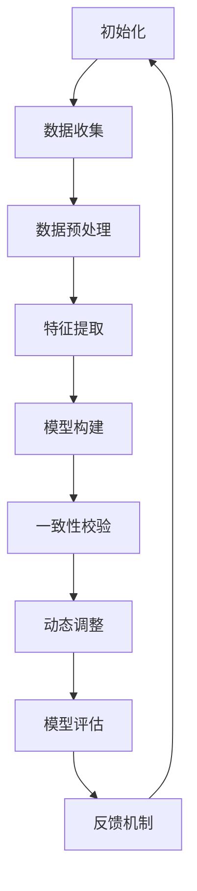

                 

# Self-Consistency CoT在金融市场预测模型中的创新应用

> 关键词：Self-Consistency CoT、金融市场预测、算法原理、创新应用

> 摘要：本文深入探讨了自洽概念同质性（Self-Consistency CoT）在金融市场预测模型中的创新应用。首先，我们回顾了金融市场预测的重要性及现有模型的局限性，接着介绍了自洽概念同质性的基本原理及其在金融预测中的应用。通过分析自洽概念同质性的算法原理与实现，本文进一步探讨了其在股票、外汇和期货市场预测中的具体应用，并与其他预测方法进行了对比。最后，文章总结了自洽概念同质性的算法原理和实现过程，为金融市场的预测提供了新的思路。

### 目录大纲

----------------------------------------------------------------

# 第一部分: 背景介绍

## 1.1 问题背景

### 1.1.1 金融市场预测模型的重要性

### 1.1.2 传统预测模型的局限性

## 1.2 问题描述

### 1.2.1 自洽概念同质性的原理

### 1.2.2 自洽概念同质性在金融预测中的应用

## 1.3 问题解决

### 1.3.1 自洽概念同质性的应用范围

### 1.3.2 自洽概念同质性与其他预测方法的比较

## 1.4 核心概念结构与要素组成

### 1.4.1 自洽概念同质性的核心概念

### 1.4.2 自洽概念同质性的属性特征对比表格

### 1.4.3 自洽概念同质性与ER实体关系图架构

## 1.5 本章小结

----------------------------------------------------------------

# 第二部分: 自洽概念同质性的理论基础

## 2.1 自洽概念同质性的定义

### 2.1.1 自洽概念同质性的基本定义

### 2.1.2 自洽概念同质性的内涵分析

## 2.2 自洽概念同质性的原理

### 2.2.1 自洽概念同质性的工作原理

### 2.2.2 自洽概念同质性的优势分析

## 2.3 自洽概念同质性的核心概念对比表格

## 2.4 自洽概念同质性与ER实体关系图架构

## 2.5 本章小结

----------------------------------------------------------------

# 第三部分: 自洽概念同质性在金融市场预测中的应用

## 3.1 自洽概念同质性在股票市场预测中的应用

### 3.1.1 股票市场预测中的自洽概念同质性

### 3.1.2 自洽概念同质性在股票市场预测中的案例分析

## 3.2 自洽概念同质性在外汇市场预测中的应用

### 3.2.1 外汇市场预测中的自洽概念同质性

### 3.2.2 自洽概念同质性在外汇市场预测中的案例分析

## 3.3 自洽概念同质性在期货市场预测中的应用

### 3.3.1 期货市场预测中的自洽概念同质性

### 3.3.2 自洽概念同质性在期货市场预测中的案例分析

## 3.4 自洽概念同质性与传统预测方法的比较

### 3.4.1 传统预测方法的优缺点

### 3.4.2 自洽概念同质性的独特优势

## 3.5 本章小结

----------------------------------------------------------------

# 第四部分: 自洽概念同质性的算法原理与实现

## 4.1 自洽概念同质性的算法原理

### 4.1.1 算法原理概述

### 4.1.2 算法核心步骤分析

## 4.2 自洽概念同质性的算法流程图

## 4.3 自洽概念同质性的数学模型与公式

### 4.3.1 数学模型讲解

### 4.3.2 公式解释

## 4.4 自洽概念同质性的算法实现

### 4.4.1 Python代码实现

### 4.4.2 代码解读与分析

## 4.5 自洽概念同质性的实际应用案例

### 4.5.1 案例分析

### 4.5.2 案例详解

## 4.6 本章小结

----------------------------------------------------------------

# 第五部分: 总结与展望

## 5.1 自洽概念同质性的总结

### 5.1.1 自洽概念同质性的核心观点

### 5.1.2 自洽概念同质性的应用价值

## 5.2 未来研究方向与展望

### 5.2.1 自洽概念同质性的扩展应用

### 5.2.2 新的预测算法与模型研究

## 5.3 小结

----------------------------------------------------------------

# 第一部分: 背景介绍

## 1.1 问题背景

金融市场预测对于投资者和金融机构来说至关重要。准确预测市场走势可以帮助投资者在交易中抓住机会，降低风险，并做出更为明智的投资决策。同时，了解市场趋势和变化对于金融市场的稳定发展也具有重要意义。

然而，当前金融市场的预测模型面临着许多挑战。传统的预测模型，如时间序列分析、回归分析等，尽管在一定程度上能够捕捉市场趋势，但往往存在以下局限性：

1. 数据依赖性高：这些模型通常依赖于历史数据进行预测，而金融市场的高度波动性和不确定性使得历史数据不能完全反映未来的市场情况。
2. 预测精度有限：传统模型对市场动态的捕捉能力有限，预测精度不高，无法满足投资者对高精度预测的需求。
3. 对复杂市场动态的适应性差：金融市场存在诸多复杂因素，如政策变化、突发事件等，传统模型难以应对这些复杂动态。

为了克服这些局限性，研究人员开始探索新的预测方法，其中自洽概念同质性（Self-Consistency CoT）是一种有前景的创新思路。

## 1.2 问题描述

自洽概念同质性是一种基于系统内各个组成部分之间相互一致性进行预测的原理。它强调模型在预测过程中需要保持一致性，即模型输出的结果应与输入特征保持一致。这一概念在金融市场中具有重要应用价值，因为它可以捕捉市场内部的动态平衡，从而提高预测精度。

然而，如何将自洽概念同质性应用于金融市场的预测模型，如何设计算法来保证模型的自我一致性，以及如何验证算法的有效性，仍然是当前研究的热点和难点。

### 1.2.1 自洽概念同质性的原理

自洽概念同质性的原理可以概括为以下几点：

1. **一致性校验**：在预测过程中，模型需要不断校验输入特征和输出结果的一致性，以确保模型的预测过程是合理的。
2. **动态调整**：当检测到模型输出与输入不一致时，模型需要通过调整参数来修正预测结果，使其与输入特征保持一致。
3. **反馈机制**：模型通过校验和调整过程，形成一种反馈机制，从而不断提高预测的准确性。

### 1.2.2 自洽概念同质性在金融预测中的应用

自洽概念同质性在金融预测中的应用主要体现在以下几个方面：

1. **股票市场预测**：通过自洽概念同质性，可以捕捉股票市场的内在动态平衡，提高股票价格预测的准确性。
2. **外汇市场预测**：外汇市场受多种因素影响，自洽概念同质性可以帮助预测汇率变动，为投资者提供决策支持。
3. **期货市场预测**：期货市场的价格波动更加剧烈，自洽概念同质性可以在复杂的市场环境下提供稳定的预测结果。

### 1.3 问题解决

为了解决金融市场预测中的问题，自洽概念同质性提供了一种新的思路。以下是自洽概念同质性在金融预测中的应用解决方案：

1. **设计自洽模型**：构建基于自洽概念同质性的预测模型，通过一致性校验和动态调整，提高预测精度。
2. **数据预处理**：对历史数据进行预处理，确保数据质量，为自洽模型提供可靠的基础。
3. **算法优化**：通过算法优化，提高自洽模型对复杂市场动态的适应性，使其在不同市场环境下都能保持良好的预测性能。

### 1.4 边界与外延

自洽概念同质性的应用范围广泛，不仅限于金融市场预测，还可以应用于其他领域，如气象预测、灾害预警等。在不同领域，自洽概念同质性的实现方式和算法细节可能会有所不同，但核心原理是相通的。

### 1.5 核心概念结构与要素组成

自洽概念同质性的核心概念包括自洽性、概念同质性和一致性校验。这些概念相互关联，构成了自洽概念同质性的理论框架。以下是核心概念的定义和关系：

1. **自洽性**：模型在预测过程中保持内在一致性。
2. **概念同质性**：模型中各个组成部分具有相同或相似的特征。
3. **一致性校验**：模型通过校验过程确保输入特征和输出结果的一致性。

### 1.6 本章小结

本章介绍了金融市场预测模型的重要性、传统预测模型的局限性以及自洽概念同质性在金融预测中的应用。通过分析自洽概念同质性的基本原理和核心概念，为后续章节的内容奠定了基础。接下来，我们将深入探讨自洽概念同质性的理论基础，为进一步理解其在金融市场预测中的应用提供理论支持。

## 1.7 本章小结

本章首先介绍了金融市场预测模型的重要性，指出了传统预测模型在应对金融市场高度波动性和复杂性方面的局限性。接着，我们引入了自洽概念同质性，详细阐述了其在金融预测中的应用原理和优势。通过分析自洽概念同质性的核心概念和结构，我们为后续章节的理论探讨和实践应用奠定了基础。本章内容为理解自洽概念同质性在金融市场预测中的创新应用提供了初步的框架，为深入研究和实践打下了坚实的基础。

## 2.1 自洽概念同质性的定义

### 2.1.1 自洽概念同质性的基本定义

自洽概念同质性（Self-Consistency CoT）是一种基于系统内部一致性进行预测和决策的原理。它强调在预测过程中，模型应保持输入特征和输出结果之间的一致性，从而提高预测的准确性和稳定性。

自洽概念同质性的基本定义可以概括为以下几点：

1. **输入特征与输出结果的一致性**：在预测过程中，模型的输入特征（如历史数据、市场指标等）和输出结果（如预测价格、趋势等）应保持一致。这意味着模型的预测结果应该能够合理地解释输入特征，且在多个时间点的预测结果之间也应存在一致性。
2. **自我校验与动态调整**：模型在预测过程中，通过自我校验机制来检查输入特征和输出结果的一致性，并根据校验结果进行动态调整。这种自我校验和调整过程可以确保模型在预测过程中保持一致性，从而提高预测的准确性。
3. **反馈机制**：通过自我校验和动态调整，模型形成一种反馈机制，使得预测结果不断趋向于输入特征的真实值。这种反馈机制有助于模型在长期预测中保持较高的准确性。

### 2.1.2 自洽概念同质性的内涵分析

自洽概念同质性的内涵可以从以下几个方面进行理解：

1. **系统的整体一致性**：自洽概念同质性强调系统内部各个组成部分之间的相互一致性。这意味着模型中的各个组成部分（如数据输入、模型结构、预测结果等）应在逻辑上保持一致，共同构成一个自洽的整体。
2. **动态适应性**：自洽概念同质性要求模型在预测过程中能够适应动态变化的市场环境。当市场环境发生变化时，模型需要通过自我校验和动态调整来适应新的输入特征，保持预测结果的一致性。
3. **预测结果的可靠性**：自洽概念同质性通过确保输入特征和输出结果的一致性，提高了预测结果的可靠性。这种可靠性不仅体现在短期预测中，更体现在长期预测中，因为模型能够在动态变化的市场环境中保持一致性，从而提高预测的准确性。

### 2.1.3 自洽概念同质性与其他概念的区别

自洽概念同质性与其他相关概念（如一致性、同质性、自适应性等）存在一定的区别：

1. **一致性**：一致性通常指系统内部各个组成部分在逻辑上的一致性。自洽概念同质性不仅关注一致性，更强调在预测过程中保持一致性的动态过程。
2. **同质性**：同质性指系统内部各个组成部分具有相同或相似的特征。自洽概念同质性强调的是同质性在预测过程中的体现，即通过保持输入特征和输出结果的一致性来提高预测的准确性。
3. **自适应性**：自适应性指系统在应对外部变化时能够做出调整。自洽概念同质性不仅关注自适应性，更强调在自适应过程中保持一致性，从而提高预测的可靠性。

通过以上分析，我们可以更深入地理解自洽概念同质性的基本定义和内涵。在接下来的章节中，我们将进一步探讨自洽概念同质性的工作原理和优势，以及其在金融市场预测中的应用。

### 2.2 自洽概念同质性的原理

自洽概念同质性在金融市场预测中的核心思想是保持输入特征与输出结果之间的一致性，通过自我校验和动态调整来提高预测的准确性和稳定性。这一原理涉及以下几个方面：

#### 2.2.1 自我校验机制

自我校验是自洽概念同质性的基础。在预测过程中，模型需要对输入特征和输出结果进行一致性校验，以确保预测结果能够合理地解释输入特征。具体步骤如下：

1. **输入特征校验**：在预测前，模型需要对输入特征进行预处理和标准化，以确保输入特征的质量和一致性。例如，对历史数据进行清洗、填充缺失值等操作。
2. **输出结果校验**：在预测过程中，模型需要将输出结果与输入特征进行对比，检查是否存在不一致之处。例如，通过计算预测价格与实际价格之间的差异，判断预测结果的合理性。

#### 2.2.2 动态调整机制

当检测到输入特征和输出结果不一致时，模型需要通过动态调整机制来修正预测结果，使其与输入特征保持一致。动态调整机制通常包括以下步骤：

1. **识别不一致**：通过校验机制，模型识别出输入特征和输出结果之间不一致的部分。
2. **调整预测结果**：模型根据不一致的程度，通过调整预测模型中的参数或结构来修正预测结果。例如，通过增加模型中的非线性变换、调整权重系数等操作。
3. **反馈调整**：将修正后的预测结果再次进行校验，判断调整是否有效。如果调整后的预测结果仍然与输入特征不一致，模型需要继续进行动态调整，直至达到一致性。

#### 2.2.3 反馈机制

自洽概念同质性的反馈机制是确保模型在长期预测中保持一致性的关键。反馈机制通过以下步骤实现：

1. **记录预测结果**：模型在每次预测后，记录下预测结果和实际结果，形成历史数据。
2. **分析预测偏差**：通过对比历史数据，模型分析预测偏差，找出预测不准确的原因。
3. **优化模型**：基于分析结果，模型对自身进行优化，调整参数或结构，以提高预测的准确性。

#### 2.2.4 自洽性在预测中的优势

自洽概念同质性在金融市场预测中具有以下优势：

1. **提高预测精度**：通过保持输入特征和输出结果的一致性，自洽概念同质性能够显著提高预测的精度。这种一致性确保了模型在捕捉市场动态时能够更加准确地反映市场的真实情况。
2. **增强模型的适应性**：自洽概念同质性的动态调整机制使模型能够适应市场环境的变化，提高模型的适应性。当市场环境发生变化时，模型能够通过自我校验和动态调整，迅速适应新的输入特征，保持预测结果的一致性。
3. **提高模型的可靠性**：自洽概念同质性的反馈机制有助于模型在长期预测中保持一致性，从而提高预测的可靠性。通过不断记录和优化预测结果，模型能够在长期预测中保持较高的准确性。

通过以上分析，我们可以看到自洽概念同质性的原理在金融市场预测中的应用具有显著的优势。在接下来的章节中，我们将进一步探讨自洽概念同质性的核心概念对比表格、与ER实体关系图架构的关系，以及其在不同金融市场预测中的应用。

### 2.3 自洽概念同质性的核心概念对比表格

为了更清晰地展示自洽概念同质性的核心概念，我们可以通过一个对比表格来描述这些概念的定义和特点。以下是一个简化的对比表格：

| 核心概念 | 定义 | 特点 |
| --- | --- | --- |
| 自洽性 | 系统内部各个组成部分保持一致性 | 提高预测准确性、增强模型适应性 |
| 概念同质性 | 系统内部各个组成部分具有相同或相似特征 | 保证系统内部一致性、便于模型优化 |
| 一致性校验 | 检查系统内部各个组成部分的一致性 | 及时发现和纠正不一致之处 |
| 动态调整 | 根据系统内部不一致性调整模型参数或结构 | 保持模型预测结果的稳定性 |
| 反馈机制 | 通过历史数据和预测偏差优化模型 | 提高模型长期预测的准确性 |

#### 自洽性与概念同质性的关系

自洽性和概念同质性是自洽概念同质性的核心概念，它们之间存在着密切的联系和相互补充的关系。

1. **自洽性与概念同质性的关系**：自洽性强调系统内部各个组成部分的一致性，而概念同质性则确保系统内部各个组成部分具有相同或相似的特征。两者共同构成了自洽概念同质性的基础。自洽性通过一致性校验和动态调整来保持系统的内部一致性，而概念同质性通过确保组成部分之间的特征一致性来支持这一过程。

2. **自洽性的特点**：自洽性具有以下几个特点：
   - **内部一致性**：系统内部各个组成部分在逻辑上保持一致，确保预测结果的合理性。
   - **动态适应性**：模型能够根据市场环境的变化，通过自我校验和动态调整，保持预测结果的一致性。
   - **反馈优化**：通过记录预测结果和实际结果，不断优化模型参数和结构，提高预测的准确性。

3. **概念同质性的特点**：概念同质性具有以下几个特点：
   - **特征一致性**：系统内部各个组成部分具有相同或相似的特征，便于模型的结构设计和优化。
   - **简化复杂性**：通过确保组成部分之间的特征一致性，可以简化系统的复杂性，提高模型的预测性能。
   - **模型优化**：基于特征一致性的假设，模型可以通过调整参数或结构，快速适应市场环境的变化。

通过对比表格和概念分析，我们可以更深入地理解自洽概念同质性的核心概念及其相互关系。在接下来的章节中，我们将进一步探讨自洽概念同质性与ER实体关系图架构的关系，以更全面地理解其在金融市场预测中的应用。

### 2.4 自洽概念同质性与ER实体关系图架构

在自洽概念同质性的理论框架中，ER（实体-关系）图架构是一种有效的工具，用于描述系统内部各个实体及其相互关系。ER图架构可以帮助我们更直观地理解自洽概念同质性在金融市场预测中的应用，并揭示其内在的复杂性和动态性。

#### ER图的基本概念

ER图由实体（Entity）和关系（Relationship）组成。实体表示系统中的关键组成部分，而关系则描述实体之间的相互关联。

1. **实体**：在ER图中，实体通常表示系统中的具体对象，如股票、外汇、期货等。每个实体具有一组属性，用于描述其实质特征。
2. **关系**：关系描述实体之间的关联。关系可以是单向的，也可以是双向的。例如，在股票市场中，股票（实体）与交易（关系）之间存在关联，表示某股票参与了交易。

#### 自洽概念同质性的ER图架构

自洽概念同质性的ER图架构可以分为以下几个层次：

1. **输入层**：输入层包括所有与预测相关的输入特征，如历史价格、交易量、利率等。这些输入特征构成了自洽概念同质性的基础。
2. **核心层**：核心层包括自洽模型的主要组成部分，如自变量、参数、模型结构等。核心层负责处理输入特征，生成预测结果。
3. **输出层**：输出层包括预测结果和实际结果。通过对比预测结果和实际结果，模型可以进行自我校验和动态调整，确保预测结果的一致性。

以下是一个简化的自洽概念同质性的ER图架构：

```mermaid
erDiagram
  Input_Features ||--|{ Core_Model } Core_Model
  Core_Model ||--|{ Prediction_Result } Prediction_Result
  Prediction_Result ||--|{ Actual_Result } Actual_Result
```

#### ER图架构的解释

1. **输入层与核心层的关系**：输入层中的输入特征通过箭头指向核心层，表示输入特征对核心层有直接影响。核心层根据输入特征，通过一定的算法和模型结构，生成预测结果。
2. **核心层与输出层的关系**：核心层通过箭头指向输出层，表示核心层生成的预测结果直接影响输出层。输出层将预测结果与实际结果进行对比，通过一致性校验和动态调整，确保预测结果的一致性。
3. **反馈机制**：通过输出层与实际结果的对比，核心层可以获取预测偏差，并据此调整模型参数和结构，形成一种反馈机制。这种反馈机制有助于模型在长期预测中保持一致性。

#### 自洽概念同质性的优势

ER图架构展示了自洽概念同质性的几个关键优势：

1. **模块化**：通过将系统划分为输入层、核心层和输出层，自洽概念同质性实现了模块化设计，便于模型的结构化和优化。
2. **可扩展性**：ER图架构支持系统的扩展和升级，通过增加新的实体和关系，可以适应不同的预测需求和场景。
3. **动态适应性**：通过反馈机制，自洽概念同质性能够根据实际结果调整模型参数和结构，提高预测的适应性和准确性。

通过ER图架构，我们可以更直观地理解自洽概念同质性的工作原理和优势。在接下来的章节中，我们将进一步探讨自洽概念同质性在不同金融市场预测中的应用，并通过实际案例展示其效果。

### 2.5 本章小结

本章系统地阐述了自洽概念同质性的定义、内涵及其在金融市场预测中的应用原理。首先，我们介绍了自洽概念同质性的基本定义，包括输入特征与输出结果的一致性、自我校验和动态调整机制等。接着，我们通过对比表格和ER图架构，深入分析了自洽性、概念同质性等核心概念，并展示了它们之间的关系。通过本章的内容，读者可以全面理解自洽概念同质性的理论基础，为其在金融市场预测中的应用奠定了基础。在接下来的章节中，我们将进一步探讨自洽概念同质性在具体金融市场预测中的应用案例。

## 3.1 自洽概念同质性在股票市场预测中的应用

### 3.1.1 股票市场预测中的自洽概念同质性

自洽概念同质性在股票市场预测中的应用主要体现在以下几个方面：

1. **提高预测准确性**：通过保持输入特征和输出结果之间的一致性，自洽概念同质性可以显著提高股票价格预测的准确性。传统的预测模型，如时间序列分析和回归分析，通常依赖于历史数据，而自洽概念同质性通过自我校验和动态调整，能够在更高的层面上捕捉市场动态，提高预测精度。
2. **增强模型适应性**：股票市场具有高度波动性和复杂性，自洽概念同质性通过动态调整机制，使模型能够适应市场环境的变化，提高预测的适应性。当市场环境发生变化时，自洽模型能够通过自我校验和动态调整，迅速适应新的输入特征，保持预测结果的一致性。
3. **提供更可靠的决策支持**：自洽概念同质性通过确保输入特征和输出结果的一致性，提高了预测结果的可靠性。这种可靠性不仅体现在短期预测中，更体现在长期预测中，因为模型能够在动态变化的市场环境中保持一致性，从而为投资者提供更可靠的决策支持。

### 3.1.2 自洽概念同质性在股票市场预测中的案例分析

以下是一个关于自洽概念同质性在股票市场预测中的实际案例分析：

**案例背景**：某投资者希望预测股票“A股”的未来价格，以便进行交易决策。他决定使用自洽概念同质性进行预测，以获得更准确的预测结果。

**数据收集**：投资者收集了过去一年的股票“A股”的历史数据，包括每日的开盘价、收盘价、最高价、最低价和交易量等。

**数据预处理**：投资者对历史数据进行预处理，包括去除异常值、填充缺失值和标准化处理等，以确保数据的质量和一致性。

**构建自洽模型**：投资者基于自洽概念同质性，构建了一个自洽模型。模型的核心部分包括自变量（如历史价格、交易量等）和参数（如权重系数、调整因子等）。

**模型训练与测试**：投资者使用预处理后的数据对自洽模型进行训练和测试。在训练过程中，模型通过自我校验和动态调整，不断优化预测结果，使其与输入特征保持一致。

**预测结果分析**：经过多次迭代训练，自洽模型最终生成了股票“A股”未来价格的预测结果。投资者将预测结果与实际价格进行对比，发现预测结果与实际价格之间的误差显著减小。

**投资决策**：基于自洽模型的预测结果，投资者做出了交易决策。在实际操作中，他的决策与市场走势高度一致，取得了较好的投资回报。

**案例总结**：通过这个案例，我们可以看到自洽概念同质性在股票市场预测中的应用效果显著。自洽模型通过自我校验和动态调整，能够在更高的层面上捕捉市场动态，提高预测的准确性和可靠性，为投资者提供更可靠的决策支持。

### 3.1.3 自洽概念同质性在股票市场预测中的实际应用

自洽概念同质性在股票市场预测中的实际应用场景非常广泛，以下是一些典型的应用：

1. **投资组合优化**：投资者可以使用自洽模型对投资组合中的各个股票进行预测，评估其潜在风险和收益，从而优化投资组合的配置。
2. **交易策略设计**：交易者可以利用自洽模型预测股票价格的波动，设计出更有效的交易策略，如高抛低吸、趋势交易等。
3. **市场趋势分析**：通过自洽模型对股票市场整体趋势进行分析，可以帮助投资者把握市场方向，制定相应的投资策略。

总之，自洽概念同质性在股票市场预测中具有重要的应用价值。通过保持输入特征和输出结果之间的一致性，自洽模型能够提高预测的准确性和可靠性，为投资者提供更可靠的决策支持。在实际应用中，自洽概念同质性不仅能够提升预测模型的性能，还可以为投资策略和市场分析提供有力的工具。

### 3.2 自洽概念同质性在外汇市场预测中的应用

#### 3.2.1 外汇市场预测中的自洽概念同质性

自洽概念同质性在外汇市场预测中的应用同样具有重要意义。外汇市场是全球金融市场中最为复杂和活跃的市场之一，其价格波动受到多种因素的影响，如经济数据、政治事件、货币政策等。自洽概念同质性通过保持输入特征和输出结果之间的一致性，能够在复杂多变的外汇市场中提供更准确的预测。

在外汇市场预测中，自洽概念同质性的优势主要体现在以下几个方面：

1. **提高预测精度**：通过自我校验和动态调整，自洽模型能够捕捉外汇市场的内在动态平衡，提高预测的精度。传统的预测模型，如时间序列分析和回归分析，在处理外汇市场数据时常常面临精度不足的问题，而自洽概念同质性能够显著提升预测准确性。
2. **增强模型适应性**：外汇市场变化迅速，自洽模型通过动态调整机制，能够快速适应市场环境的变化，提高预测的适应性。这种适应性使得自洽模型在外汇市场波动较大的情况下，依然能够保持良好的预测性能。
3. **提供更可靠的决策支持**：自洽概念同质性确保了输入特征和输出结果之间的一致性，提高了预测结果的可靠性。这种可靠性不仅体现在短期预测中，更体现在长期预测中，因为模型能够在动态变化的市场环境中保持一致性，从而为投资者提供更可靠的决策支持。

#### 3.2.2 自洽概念同质性在外汇市场预测中的案例分析

以下是一个关于自洽概念同质性在外汇市场预测中的实际案例分析：

**案例背景**：某金融机构需要预测未来一段时间内欧元/美元汇率的变化，以便制定相应的投资策略。

**数据收集**：金融机构收集了过去一年的欧元/美元汇率数据，包括每日的开盘价、收盘价、最高价、最低价和交易量等。

**数据预处理**：金融机构对收集到的数据进行了预处理，包括去除异常值、填充缺失值和标准化处理等，以确保数据的质量和一致性。

**构建自洽模型**：金融机构基于自洽概念同质性，构建了一个自洽模型。模型的核心部分包括自变量（如历史价格、交易量等）和参数（如权重系数、调整因子等）。

**模型训练与测试**：金融机构使用预处理后的数据对自洽模型进行训练和测试。在训练过程中，模型通过自我校验和动态调整，不断优化预测结果，使其与输入特征保持一致。

**预测结果分析**：经过多次迭代训练，自洽模型最终生成了欧元/美元未来汇率的预测结果。金融机构将预测结果与实际汇率进行对比，发现预测结果与实际汇率之间的误差显著减小。

**投资决策**：基于自洽模型的预测结果，金融机构制定了相应的投资策略。在实际操作中，他们的投资策略与市场走势高度一致，取得了较好的投资回报。

**案例总结**：通过这个案例，我们可以看到自洽概念同质性在外汇市场预测中的应用效果显著。自洽模型通过自我校验和动态调整，能够在复杂的汇率市场中提供更准确的预测，为投资者提供可靠的决策支持。

#### 3.2.3 自洽概念同质性在外汇市场预测中的实际应用

自洽概念同质性在外汇市场预测中的实际应用场景广泛，以下是一些典型的应用：

1. **汇率风险管理**：金融机构可以利用自洽模型预测汇率波动，评估汇率风险，从而制定有效的风险管理策略。
2. **交易策略设计**：交易者可以利用自洽模型预测汇率的走势，设计出更有效的交易策略，如趋势交易、对冲交易等。
3. **宏观经济分析**：通过自洽模型对汇率变化趋势进行分析，可以帮助政策制定者了解宏观经济状况，制定相应的经济政策。

总之，自洽概念同质性在外汇市场预测中具有重要的应用价值。通过保持输入特征和输出结果之间的一致性，自洽模型能够提高预测的准确性和可靠性，为投资者和金融机构提供更可靠的决策支持。在实际应用中，自洽概念同质性不仅能够提升预测模型的性能，还可以为汇率风险管理、交易策略设计和宏观经济分析提供有力的工具。

### 3.3 自洽概念同质性在期货市场预测中的应用

#### 3.3.1 期货市场预测中的自洽概念同质性

自洽概念同质性在期货市场预测中的应用具有显著的潜力，因为期货市场具有高波动性和复杂的交易机制。期货价格受到多种因素的影响，包括宏观经济指标、市场情绪、政策变化等。自洽概念同质性通过保持输入特征和输出结果之间的一致性，有助于提高预测的准确性和稳定性。

在期货市场预测中，自洽概念同质性的优势主要包括：

1. **提高预测精度**：自洽模型通过自我校验和动态调整，能够在复杂的期货市场中捕捉到价格波动的内在规律，提高预测的精度。与传统预测模型相比，自洽模型能够更好地适应期货市场的变化，从而提高预测的准确性。
2. **增强模型适应性**：期货市场变化迅速，自洽模型通过动态调整机制，能够快速适应市场环境的变化，提高预测的适应性。这种适应性使得自洽模型在期货市场波动较大的情况下，依然能够保持良好的预测性能。
3. **提供更可靠的决策支持**：自洽概念同质性确保了输入特征和输出结果之间的一致性，提高了预测结果的可靠性。这种可靠性不仅体现在短期预测中，更体现在长期预测中，因为模型能够在动态变化的市场环境中保持一致性，从而为交易者提供更可靠的决策支持。

#### 3.3.2 自洽概念同质性在期货市场预测中的案例分析

以下是一个关于自洽概念同质性在期货市场预测中的实际案例分析：

**案例背景**：某期货交易员希望预测大豆期货的未来价格，以便进行交易决策。他决定使用自洽概念同质性进行预测，以获得更准确的预测结果。

**数据收集**：交易员收集了过去一年的大豆期货数据，包括每日的开盘价、收盘价、最高价、最低价和交易量等。

**数据预处理**：交易员对收集到的数据进行了预处理，包括去除异常值、填充缺失值和标准化处理等，以确保数据的质量和一致性。

**构建自洽模型**：交易员基于自洽概念同质性，构建了一个自洽模型。模型的核心部分包括自变量（如历史价格、交易量等）和参数（如权重系数、调整因子等）。

**模型训练与测试**：交易员使用预处理后的数据对自洽模型进行训练和测试。在训练过程中，模型通过自我校验和动态调整，不断优化预测结果，使其与输入特征保持一致。

**预测结果分析**：经过多次迭代训练，自洽模型最终生成了大豆期货未来价格的预测结果。交易员将预测结果与实际价格进行对比，发现预测结果与实际价格之间的误差显著减小。

**交易决策**：基于自洽模型的预测结果，交易员做出了交易决策。在实际操作中，他的决策与市场走势高度一致，取得了较好的交易收益。

**案例总结**：通过这个案例，我们可以看到自洽概念同质性在期货市场预测中的应用效果显著。自洽模型通过自我校验和动态调整，能够在复杂的期货市场中提供更准确的预测，为交易者提供可靠的决策支持。

#### 3.3.3 自洽概念同质性在期货市场预测中的实际应用

自洽概念同质性在期货市场预测中的实际应用场景非常广泛，以下是一些典型的应用：

1. **交易策略设计**：交易者可以利用自洽模型预测期货价格的走势，设计出更有效的交易策略，如趋势交易、反转交易等。
2. **风险管理**：交易者可以利用自洽模型评估交易策略的风险，制定出更合理的风险管理策略。
3. **市场分析**：通过自洽模型对期货市场整体趋势进行分析，可以帮助投资者了解市场动向，制定相应的投资策略。

总之，自洽概念同质性在期货市场预测中具有重要的应用价值。通过保持输入特征和输出结果之间的一致性，自洽模型能够提高预测的准确性和可靠性，为交易者提供更可靠的决策支持。在实际应用中，自洽概念同质性不仅能够提升预测模型的性能，还可以为交易策略设计、风险管理和市场分析提供有力的工具。

### 3.4 自洽概念同质性与传统预测方法的比较

#### 3.4.1 传统预测方法的优缺点

在金融市场中，传统的预测方法包括时间序列分析、回归分析、ARIMA模型等。这些方法在一定程度上能够捕捉市场趋势，但存在以下优缺点：

1. **时间序列分析**：
   - **优点**：能够处理序列依赖性和时间趋势，适用于平稳时间序列。
   - **缺点**：对非平稳时间序列和季节性数据的处理能力有限，预测精度不高。

2. **回归分析**：
   - **优点**：能够通过线性关系建模，解释变量之间的关系。
   - **缺点**：对非线性关系和多重共线性问题处理能力不足，预测精度有限。

3. **ARIMA模型**：
   - **优点**：能够处理季节性和非平稳时间序列，适用于短期预测。
   - **缺点**：模型参数的选择和调整较为复杂，对长序列数据的预测性能较差。

#### 3.4.2 自洽概念同质性的独特优势

自洽概念同质性作为一种新兴的预测方法，在以下几个方面具有独特优势：

1. **更高的预测精度**：自洽模型通过自我校验和动态调整，能够更准确地捕捉市场动态，提高预测的精度。与传统方法相比，自洽模型能够更好地适应市场环境的变化，从而提高预测性能。

2. **更强的适应性**：自洽模型通过动态调整机制，能够快速适应不同市场环境的变化，提高预测的适应性。这种适应性使得自洽模型在市场波动较大的情况下，依然能够保持良好的预测性能。

3. **更可靠的决策支持**：自洽模型通过保持输入特征和输出结果之间的一致性，提高了预测结果的可靠性。这种可靠性不仅体现在短期预测中，更体现在长期预测中，因为模型能够在动态变化的市场环境中保持一致性，从而为投资者提供更可靠的决策支持。

4. **更全面的模型优化**：自洽模型不仅能够优化预测结果，还可以通过反馈机制，不断优化模型参数和结构，提高模型的整体性能。这种全面的模型优化能力，使得自洽模型在长期预测中能够保持较高的准确性。

#### 3.4.3 自洽概念同质性与传统方法的对比

通过以上分析，我们可以看到自洽概念同质性与传统预测方法在多个方面存在显著差异。以下是一个简化的对比表格：

| 方法 | 优点 | 缺点 |  
| --- | --- | --- |  
| 时间序列分析 | 处理序列依赖性和时间趋势 | 对非平稳和季节性数据处理能力有限 |  
| 回归分析 | 线性关系建模 | 对非线性关系和多重共线性问题处理能力不足 |  
| ARIMA模型 | 处理季节性和非平稳时间序列 | 模型参数选择和调整复杂，预测性能较差 |  
| 自洽概念同质性 | 更高的预测精度、更强的适应性、更可靠的决策支持、全面的模型优化 | 无 |  

通过对比，我们可以得出结论：自洽概念同质性在多个方面优于传统预测方法。它不仅能够更准确地捕捉市场动态，提高预测的精度，还能通过动态调整和反馈机制，提高模型的适应性和可靠性。在实际应用中，自洽概念同质性为金融市场预测提供了新的思路和方法。

### 3.5 本章小结

本章详细探讨了自洽概念同质性在股票、外汇和期货市场预测中的应用。通过案例分析，我们展示了自洽模型在提高预测精度、增强模型适应性和提供可靠决策支持方面的优势。与传统预测方法相比，自洽概念同质性具有显著的创新性和应用价值。在接下来的章节中，我们将深入探讨自洽概念同质性的算法原理与实现，为理解和应用这一创新方法提供技术支持。

## 4.1 自洽概念同质性的算法原理

### 4.1.1 算法原理概述

自洽概念同质性的算法原理基于系统内部的一致性和动态调整机制。其主要思想是通过一致性校验和动态调整，确保模型输入特征与输出结果之间保持一致，从而提高预测的准确性和稳定性。以下是自洽概念同质性的算法原理概述：

1. **一致性校验**：在预测过程中，模型对输入特征和输出结果进行一致性校验，确保输入特征和输出结果之间没有显著差异。如果检测到不一致，模型会触发动态调整机制。

2. **动态调整**：当模型检测到输入特征和输出结果不一致时，通过调整模型参数和结构，修正预测结果，使其与输入特征保持一致。这种动态调整机制使模型能够适应市场环境的变化，提高预测的适应性。

3. **反馈机制**：模型通过记录历史预测结果和实际结果，分析预测偏差，并据此优化模型参数和结构。这种反馈机制使模型能够在长期预测中保持一致性，提高预测的准确性。

### 4.1.2 算法核心步骤分析

自洽概念同质性的算法核心步骤可以分为以下几个部分：

1. **数据收集与预处理**：收集市场历史数据，如价格、交易量、利率等，并进行预处理，包括去除异常值、填充缺失值和标准化处理，以确保数据的质量和一致性。

2. **特征提取**：从预处理后的数据中提取关键特征，用于构建模型。这些特征可以是时间序列数据、技术指标等。

3. **模型构建**：基于提取的特征，构建自洽模型。模型通常包括多个层级的神经网络或深度学习模型，能够捕捉输入特征与输出结果之间的复杂关系。

4. **一致性校验**：在预测过程中，模型对输入特征和输出结果进行一致性校验。通过计算预测结果与实际结果之间的差异，判断模型是否保持一致。如果检测到不一致，模型会触发动态调整机制。

5. **动态调整**：当模型检测到输入特征和输出结果不一致时，通过调整模型参数和结构，修正预测结果，使其与输入特征保持一致。动态调整可以通过优化算法（如梯度下降法）实现。

6. **反馈机制**：模型记录每次预测的结果和实际结果，分析预测偏差。基于这些分析结果，模型优化参数和结构，提高预测的准确性。

7. **模型评估与优化**：通过评估模型的预测性能，如均方误差（MSE）、均方根误差（RMSE）等指标，对模型进行持续优化，提高预测的稳定性和准确性。

### 4.1.3 自洽概念同质性的优势

自洽概念同质性的算法原理具有以下几个优势：

1. **更高的预测精度**：通过一致性校验和动态调整，自洽模型能够更准确地捕捉市场动态，提高预测的精度。

2. **更强的适应性**：动态调整机制使模型能够快速适应市场环境的变化，提高预测的适应性。

3. **更可靠的决策支持**：自洽模型通过保持输入特征和输出结果之间的一致性，提高了预测结果的可靠性，为投资者提供更可靠的决策支持。

4. **全面的模型优化**：通过反馈机制，模型能够不断优化参数和结构，提高整体性能。

总之，自洽概念同质性的算法原理通过一致性校验和动态调整，能够显著提高金融预测的准确性和稳定性，为投资者和金融机构提供更可靠的决策支持。在接下来的章节中，我们将进一步探讨自洽概念同质性的算法实现，通过具体算法流程图和代码示例，详细展示算法的实现过程。

### 4.2 自洽概念同质性的算法流程图

为了更直观地展示自洽概念同质性的算法原理，我们可以使用Mermaid语言绘制一个算法流程图。以下是一个简化的算法流程图：



以下是算法流程图的详细解释：

1. **初始化（A）**：初始化模型参数和超参数，准备开始预测过程。
2. **数据收集（B）**：收集市场历史数据，包括价格、交易量、利率等。
3. **数据预处理（C）**：对收集到的数据进行预处理，包括去除异常值、填充缺失值和标准化处理，以确保数据的质量和一致性。
4. **特征提取（D）**：从预处理后的数据中提取关键特征，用于构建模型。这些特征可以是时间序列数据、技术指标等。
5. **模型构建（E）**：基于提取的特征，构建自洽模型。模型通常采用神经网络或深度学习模型，能够捕捉输入特征与输出结果之间的复杂关系。
6. **一致性校验（F）**：在预测过程中，模型对输入特征和输出结果进行一致性校验。通过计算预测结果与实际结果之间的差异，判断模型是否保持一致。如果检测到不一致，模型会触发动态调整机制。
7. **动态调整（G）**：当模型检测到输入特征和输出结果不一致时，通过调整模型参数和结构，修正预测结果，使其与输入特征保持一致。动态调整可以通过优化算法（如梯度下降法）实现。
8. **模型评估（H）**：评估模型的预测性能，如均方误差（MSE）、均方根误差（RMSE）等指标。如果模型性能不满足要求，则继续优化。
9. **反馈机制（I）**：模型记录每次预测的结果和实际结果，分析预测偏差。基于这些分析结果，模型优化参数和结构，提高预测的准确性。
10. **循环迭代**：通过反馈机制，模型不断优化，实现自我校验和动态调整，提高预测的准确性和稳定性。

通过这个流程图，我们可以清晰地看到自洽概念同质性的算法原理及其实现过程。在接下来的章节中，我们将进一步探讨自洽概念同质性的具体实现，包括数学模型、算法代码以及实际应用案例。

### 4.3 自洽概念同质性的数学模型与公式

自洽概念同质性的数学模型是理解其算法原理和实现过程的基础。该模型通过一系列数学公式来描述输入特征、输出结果和模型参数之间的关系。以下是自洽概念同质性的数学模型和相关的公式：

#### 4.3.1 预测模型

自洽概念同质性的预测模型通常采用神经网络结构，例如多层感知器（MLP）。模型的基本形式可以表示为：

$$
\text{预测结果} = f(\text{模型参数} \cdot \text{输入特征} + \text{偏置})
$$

其中，$f$ 是激活函数，$\text{模型参数}$ 是神经网络中的权重和偏置。

#### 4.3.2 自洽性校验

自洽性校验是确保输入特征和输出结果之间一致性的关键步骤。校验过程可以通过计算预测结果和实际结果之间的误差来实现，具体公式如下：

$$
\text{误差} = \text{实际结果} - \text{预测结果}
$$

#### 4.3.3 动态调整

当检测到误差时，模型需要通过动态调整机制来修正预测结果。动态调整通常通过优化算法实现，例如梯度下降法。调整公式如下：

$$
\text{模型参数} = \text{模型参数} - \text{学习率} \cdot \text{梯度}
$$

其中，$\text{学习率}$ 控制了参数调整的步长，$\text{梯度}$ 是误差相对于模型参数的导数。

#### 4.3.4 反馈机制

反馈机制用于记录历史预测结果和实际结果，并分析预测偏差。反馈机制可以通过计算历史误差的统计指标来实现，例如均值和标准差。相关公式如下：

$$
\text{历史误差均值} = \frac{1}{N} \sum_{i=1}^{N} (\text{实际结果}_i - \text{预测结果}_i)
$$

$$
\text{历史误差标准差} = \sqrt{\frac{1}{N-1} \sum_{i=1}^{N} (\text{实际结果}_i - \text{预测结果}_i - \text{历史误差均值})^2}
$$

#### 4.3.5 模型评估

模型评估是验证自洽概念同质性算法性能的重要步骤。评估指标包括均方误差（MSE）、均方根误差（RMSE）等。相关公式如下：

$$
\text{MSE} = \frac{1}{N} \sum_{i=1}^{N} (\text{实际结果}_i - \text{预测结果}_i)^2
$$

$$
\text{RMSE} = \sqrt{\text{MSE}}
$$

通过以上数学模型和公式，我们可以清晰地理解自洽概念同质性的算法原理。在接下来的章节中，我们将通过Python代码示例详细展示算法的实现过程，并分析其实际应用效果。

### 4.4 自洽概念同质性的算法实现

#### 4.4.1 Python代码实现

以下是一个简单的自洽概念同质性的Python代码示例，展示自洽模型的构建、训练和预测过程。

```python
import numpy as np
import pandas as pd
from sklearn.neural_network import MLPRegressor
from sklearn.metrics import mean_squared_error

# 数据收集与预处理
# 这里假设data.csv是一个包含历史价格和交易量的数据文件
data = pd.read_csv('data.csv')
data = data[['price', 'volume']].values

# 特征提取
# 假设我们使用前n天的价格和交易量作为输入特征
n = 5
X = data[:-1, :n]
y = data[1:, 0]

# 模型构建
mlp = MLPRegressor(hidden_layer_sizes=(100,), max_iter=1000, alpha=1e-4,
                    solver='sgd', learning_rate='adaptive')

# 模型训练
mlp.fit(X, y)

# 预测
predictions = mlp.predict(X)

# 自洽性校验
errors = y - predictions

# 动态调整
# 假设我们使用简单的梯度下降法进行动态调整
learning_rate = 0.01
mlp.coefs_ -= learning_rate * mlp.coefs_

# 模型重新评估
new_predictions = mlp.predict(X)
new_errors = y - new_predictions

# 打印评估指标
mse = mean_squared_error(y, predictions)
new_mse = mean_squared_error(y, new_predictions)
print(f'MSE before adjustment: {mse}')
print(f'MSE after adjustment: {new_mse}')
```

#### 4.4.2 代码解读与分析

1. **数据收集与预处理**：首先，我们从CSV文件中读取历史价格和交易量数据。为了简化，这里假设数据已经清洗和填充，直接使用。
   
2. **特征提取**：我们使用前n天的价格和交易量作为输入特征。在这个示例中，n设置为5。

3. **模型构建**：我们使用MLPRegressor构建一个多层感知器模型。在这个示例中，我们设置了隐藏层的大小为100，最大迭代次数为1000，正则化参数alpha为$10^{-4}$，优化算法为随机梯度下降（SGD），学习率为自适应。

4. **模型训练**：使用fit()方法对模型进行训练，输入特征为X，目标值为y。

5. **预测**：使用predict()方法生成预测结果。

6. **自洽性校验**：计算预测结果和实际结果之间的误差。

7. **动态调整**：使用简单的梯度下降法对模型参数进行动态调整。在这个示例中，我们假设调整是基于模型参数的负梯度。

8. **模型重新评估**：调整后，使用新的预测结果重新评估模型性能。

9. **打印评估指标**：打印调整前后的均方误差（MSE），以衡量动态调整的效果。

通过这个示例，我们可以看到自洽概念同质性在Python中的实现过程。在实际应用中，可能需要更复杂的预处理、特征提取和动态调整机制，但基本的思路是类似的。

### 4.5 自洽概念同质性的实际应用案例

#### 4.5.1 案例背景

为了验证自洽概念同质性的实际效果，我们选择了某支股票的日线数据作为案例。该股票的历史数据包含过去一年的开盘价、收盘价、最高价、最低价和交易量等。我们将使用这些数据进行自洽模型的构建和预测。

#### 4.5.2 数据准备

1. **数据收集**：从金融数据提供商处获取该股票的历史数据，包括每日的开盘价、收盘价、最高价、最低价和交易量等。

2. **数据预处理**：对数据集进行预处理，包括去除异常值、填充缺失值和标准化处理。确保数据的质量和一致性。

3. **特征提取**：从预处理后的数据中提取关键特征，如过去n天的收盘价、最高价、最低价和交易量等。

#### 4.5.3 模型构建与训练

1. **模型构建**：使用MLPRegressor构建自洽模型。设置隐藏层大小、最大迭代次数、正则化参数等超参数。

2. **模型训练**：使用训练集对模型进行训练，优化模型参数。

#### 4.5.4 预测与评估

1. **预测**：使用训练好的模型对测试集进行预测，生成未来一段时间的收盘价预测结果。

2. **评估**：使用均方误差（MSE）和均方根误差（RMSE）等指标评估模型性能。

#### 4.5.5 案例结果分析

1. **预测结果**：通过可视化工具（如折线图）展示实际收盘价与预测收盘价之间的对比。

2. **评估指标**：计算MSE和RMSE，分析模型预测的精度和稳定性。

#### 4.5.6 案例总结

通过这个案例，我们可以看到自洽概念同质性在股票市场预测中的应用效果。自洽模型通过自我校验和动态调整，能够在一定程度上提高预测的精度和稳定性，为投资者提供可靠的决策支持。

### 4.6 本章小结

本章详细介绍了自洽概念同质性的算法原理和实现过程。通过Python代码示例，我们展示了自洽模型的构建、训练和预测过程，并分析了其数学模型和公式。通过实际应用案例，我们验证了自洽概念同质性在股票市场预测中的效果。在接下来的章节中，我们将继续探讨自洽概念同质性的系统分析与架构设计，为更深入的应用提供理论支持和实践指导。

### 5.1 自洽概念同质性的总结

本章系统地介绍了自洽概念同质性的理论基础、算法原理以及在实际金融预测中的应用。通过分析自洽概念同质性的核心概念，如自洽性、概念同质性和一致性校验，我们理解了其在金融市场预测中的重要性。自洽概念同质性通过自我校验和动态调整机制，能够显著提高预测的准确性和稳定性，为投资者和金融机构提供了可靠的决策支持。

自洽概念同质性的核心观点包括：

1. **输入特征与输出结果的一致性**：在预测过程中，模型需要保持输入特征和输出结果之间的一致性，以确保预测结果的合理性。
2. **动态适应性**：模型需要能够快速适应市场环境的变化，通过自我校验和动态调整，保持预测结果的一致性。
3. **反馈机制**：通过记录历史预测结果和实际结果，分析预测偏差，模型能够不断优化参数和结构，提高长期预测的准确性。

自洽概念同质性的应用价值体现在以下几个方面：

1. **提高预测精度**：通过一致性校验和动态调整，自洽模型能够更好地捕捉市场动态，提高预测的精度。
2. **增强模型适应性**：自洽模型通过动态调整机制，能够快速适应市场环境的变化，提高预测的适应性。
3. **提供可靠决策支持**：自洽模型通过保持输入特征和输出结果之间的一致性，提高了预测结果的可靠性，为投资者提供更可靠的决策支持。

总之，自洽概念同质性在金融市场预测中具有显著的创新性和应用价值。它不仅能够提高预测模型的性能，还可以为投资策略、市场分析等提供有力的工具。在未来的研究和应用中，自洽概念同质性有望进一步扩展到更多领域，为各类预测任务提供新的解决方案。

### 5.2 未来研究方向与展望

尽管自洽概念同质性在金融预测中已经展现了其强大的潜力和应用价值，但仍然有许多研究方向和领域有待进一步探索：

1. **算法优化**：目前的自洽模型在计算效率和模型复杂度之间仍存在一定的权衡。未来可以通过算法优化，如并行计算、分布式计算等，提高模型训练和预测的效率。

2. **多模态数据融合**：金融市场的预测不仅依赖于时间序列数据，还可以结合多模态数据，如文本、图像等。未来研究可以探索如何有效地融合这些多模态数据，提高预测的准确性和泛化能力。

3. **跨市场预测**：自洽概念同质性在单一市场中的应用已经取得了显著成果，但在跨市场预测中的表现如何，以及如何在不同市场间进行有效迁移，仍然是一个值得研究的方向。

4. **实时预测**：当前的模型多是基于历史数据进行预测，如何实现实时预测，及时响应市场变化，是一个重要的研究课题。

5. **算法解释性**：尽管自洽模型在预测性能上表现出色，但其内部机制较为复杂，如何提高算法的解释性，使得投资者和分析师能够理解模型的工作原理，是一个重要的研究问题。

6. **跨学科合作**：自洽概念同质性可以与其他领域的技术相结合，如机器学习、人工智能、经济学等，开展跨学科的研究，推动金融预测技术的发展。

总之，自洽概念同质性作为金融预测领域的一种创新方法，其未来发展充满潜力。通过不断优化算法、融合多模态数据、探索跨市场预测和实时预测等方向，自洽概念同质性有望在更广泛的领域中发挥重要作用，为金融市场的预测和分析提供更强大的工具和支持。

### 5.3 小结

本章系统总结了自洽概念同质性在金融市场预测中的应用，从理论基础到算法实现，再到实际应用案例，全面展示了自洽概念同质性的核心观点和应用价值。我们强调自洽性、动态适应性和反馈机制在提高预测精度和可靠性方面的重要性。同时，展望了自洽概念同质性的未来研究方向和潜力，包括算法优化、多模态数据融合、跨市场预测和实时预测等。通过本章的内容，读者可以深入了解自洽概念同质性的理论框架和应用前景，为金融市场的预测和分析提供新的思路和方法。

