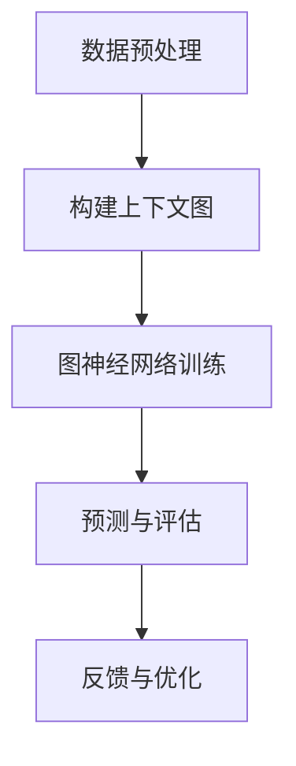
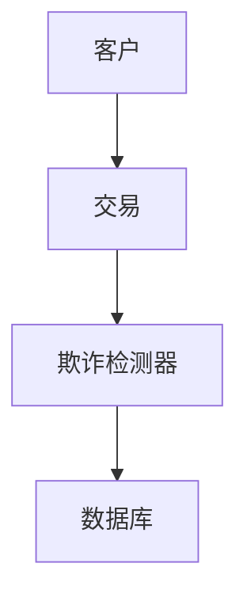
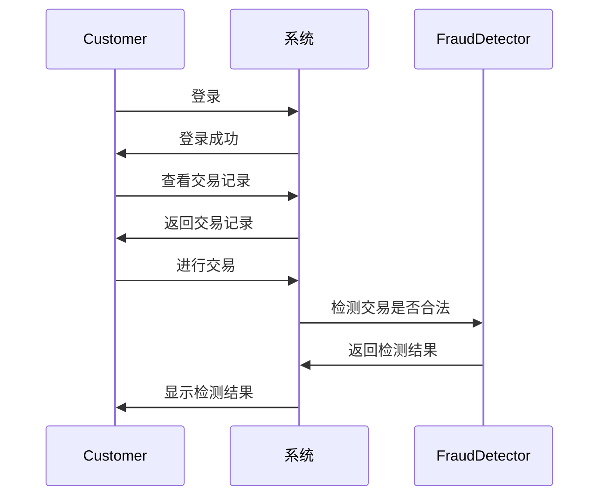

                 

### 文章标题

## Self-Consistency CoT在金融欺诈检测中的应用

### 关键词

- 金融欺诈检测
- 自一致性上下文图（Self-Consistency CoT）
- 机器学习
- 数据安全
- 风险管理

### 摘要

本文将探讨一种前沿的金融欺诈检测技术——Self-Consistency CoT（自一致性上下文图）的应用。通过深入分析Self-Consistency CoT的定义、特点以及在金融欺诈检测中的应用原理，本文旨在为读者提供一个全面而清晰的视角，了解如何在金融领域中利用这一技术提高欺诈检测的准确性和效率。文章将结合具体案例，详细讲解系统设计与实现过程，并提供最佳实践与注意事项，旨在帮助读者在实际应用中取得成功。

## 第一部分：金融欺诈检测概述

### 第1章：金融欺诈检测的重要性

#### 1.1 金融欺诈的现状与影响

金融欺诈是指利用金融系统漏洞进行的非法获取财物的行为。近年来，随着金融科技的迅速发展，金融欺诈手段也日益翻新，呈现智能化、技术化趋势。金融欺诈不仅对金融机构造成直接的经济损失，还会损害客户信任，影响金融市场的稳定运行。

据统计，全球每年因金融欺诈造成的损失高达数千亿美元。这不仅对金融机构的盈利能力造成威胁，也对全球经济产生了深远影响。因此，加强对金融欺诈的检测和防范显得尤为重要。

#### 1.2 金融欺诈检测的重要性

金融欺诈检测是金融风险管理的重要环节。通过有效的欺诈检测机制，金融机构可以及时发现并阻止欺诈行为，最大限度地降低损失。具体来说，金融欺诈检测的重要性体现在以下几个方面：

1. **保护客户利益**：欺诈检测可以帮助金融机构保护客户的资金安全，减少客户因欺诈行为而遭受的损失。
2. **提升客户满意度**：及时有效的欺诈检测可以减少误报和漏报，降低对正常交易的干扰，提升客户的使用体验。
3. **维护金融机构形象**：通过有效的欺诈检测，金融机构可以减少欺诈事件的发生，提升品牌形象和市场信誉。
4. **预防系统性风险**：金融欺诈往往涉及大量的资金流动，如果不及时检测和制止，可能会引发系统性金融风险。

#### 1.3 欺诈检测的边界与外延

欺诈检测不仅涉及技术层面，还包括法律、合规、运营等多个方面。其边界与外延主要包括以下几个方面：

1. **技术边界**：欺诈检测技术需要具备高精度、实时性和自适应能力，以适应不断变化的欺诈手段。
2. **法律边界**：金融机构在进行欺诈检测时，需要遵守相关法律法规，确保检测行为合法合规。
3. **合规边界**：欺诈检测系统需要符合监管要求，如数据保护、隐私保护等。
4. **运营边界**：欺诈检测需要与业务运营紧密配合，如交易处理、风险控制等。

### 第2章：Self-Consistency CoT概述

#### 2.1 Self-Consistency CoT的定义

Self-Consistency CoT（自一致性上下文图）是一种基于图神经网络的深度学习模型，旨在通过捕捉上下文信息来提高数据的一致性和准确性。在金融欺诈检测中，Self-Consistency CoT能够通过分析交易行为之间的关联性和一致性，识别潜在的欺诈行为。

#### 2.2 Self-Consistency CoT的特点

Self-Consistency CoT具有以下特点：

1. **上下文感知**：通过构建上下文图，模型能够捕捉到交易行为之间的关联性和一致性，从而提高检测的准确性。
2. **自适应学习**：Self-Consistency CoT能够根据数据的特点和环境的变化，自适应地调整模型参数，提高模型的适应能力。
3. **高效计算**：Self-Consistency CoT采用了高效的图神经网络结构，能够在处理大量数据时保持较快的计算速度。
4. **可解释性**：通过可视化上下文图，用户可以直观地了解交易行为之间的关系，提高模型的透明度和可解释性。

#### 2.3 Self-Consistency CoT与金融欺诈检测的联系

Self-Consistency CoT与金融欺诈检测之间的联系主要体现在以下几个方面：

1. **提高检测精度**：通过捕捉交易行为之间的关联性和一致性，Self-Consistency CoT能够更准确地识别潜在的欺诈行为，减少误报和漏报。
2. **实时性**：Self-Consistency CoT采用了高效计算结构，能够实现实时检测，满足金融行业对快速响应的需求。
3. **适应性**：Self-Consistency CoT能够根据数据和环境的变化自适应地调整模型参数，提高模型的适应性，适应不断变化的欺诈手段。
4. **可解释性**：通过可视化上下文图，用户可以直观地了解交易行为之间的关系，提高模型的透明度和可解释性，有助于金融机构进行决策。

## 第二部分：Self-Consistency CoT算法原理

### 第3章：Self-Consistency CoT算法原理

#### 3.1 Self-Consistency CoT的mermaid流程图



#### 3.2 算法原理Python代码实现

```python
import networkx as nx
import numpy as np
from sklearn.model_selection import train_test_split

# 数据预处理
def preprocess_data(data):
    # 省略具体预处理步骤
    return processed_data

# 构建上下文图
def build_context_graph(data):
    G = nx.Graph()
    # 省略具体构建步骤
    return G

# 图神经网络训练
def train_gnn(G, labels):
    # 省略具体训练步骤
    return model

# 预测与评估
def predict(model, new_data):
    # 省略具体预测步骤
    return predictions

# 反馈与优化
def feedback_and_optimize(model, feedback):
    # 省略具体优化步骤
    return updated_model
```

#### 3.3 数学模型与公式讲解

Self-Consistency CoT的核心是图神经网络（Graph Neural Network，GNN），其基本原理可以通过以下数学模型和公式进行解释：

1. **节点嵌入（Node Embedding）**：

$$
h_v^{(t)} = \sigma(W^{(t)} \cdot (h_u^{(t-1)} + h_w^{(t-1)} + \sum_{u \in \text{邻居}(v)} h_u^{(t-1)})
$$

其中，$h_v^{(t)}$表示时间步$t$时节点$v$的嵌入向量，$\sigma$表示激活函数，$W^{(t)}$是模型参数。

2. **边嵌入（Edge Embedding）**：

$$
e_{vw}^{(t)} = \sigma(W_e \cdot (h_v^{(t-1)} - h_w^{(t-1)}))
$$

其中，$e_{vw}^{(t)}$表示时间步$t$时边$(v, w)$的嵌入向量，$W_e$是模型参数。

3. **更新规则**：

$$
h_v^{(t)} = \sigma(W_n \cdot h_v^{(t-1)} + W_r \cdot \sum_{u \in \text{邻居}(v)} h_u^{(t-1)})
$$

其中，$W_n$和$W_r$分别是节点更新和关系更新权重矩阵。

#### 3.4 通俗易懂的例子说明

假设我们有一个简单的交易网络，其中包含三个节点：A、B和C。节点A表示用户的账户，节点B和C表示两个交易对手。节点之间存在边，表示交易行为。Self-Consistency CoT通过以下步骤进行欺诈检测：

1. **数据预处理**：将交易数据转换为图结构，每个节点代表一个交易参与者，每条边代表一次交易行为。
2. **构建上下文图**：通过节点嵌入和边嵌入，为每个节点和边生成嵌入向量，表示其在网络中的特征。
3. **图神经网络训练**：使用嵌入向量作为输入，训练图神经网络，使其能够捕捉节点和边之间的关系。
4. **预测与评估**：对于新的交易数据，使用训练好的模型进行预测，评估交易行为是否一致。如果交易行为与历史模式不一致，则可能存在欺诈风险。
5. **反馈与优化**：根据预测结果，对模型进行反馈和优化，提高模型的准确性和鲁棒性。

通过Self-Consistency CoT，我们可以更准确地识别潜在的欺诈行为，提高金融欺诈检测的效率和准确性。

## 第三部分：Self-Consistency CoT在金融欺诈检测中的应用

### 第4章：Self-Consistency CoT在金融欺诈检测中的应用

#### 4.1 应用场景介绍

Self-Consistency CoT在金融欺诈检测中的应用场景主要包括以下几个方面：

1. **信用卡交易欺诈检测**：通过对信用卡交易行为进行实时监测和分析，识别潜在的欺诈交易。
2. **在线支付欺诈检测**：对在线支付过程中的异常行为进行识别，防止欺诈交易的发生。
3. **银行账户欺诈检测**：通过对银行账户活动进行分析，及时发现并阻止欺诈行为。
4. **保险欺诈检测**：对保险索赔进行分析，识别潜在的欺诈行为。

#### 4.2 系统功能设计（mermaid类图）

```mermaid
classDiagram
    Customer <<class>> 客户
    Transaction <<class>> 交易
    FraudDetector <<class>> 欺诈检测器
    Database <<class>> 数据库

    Customer --|>> Transaction
    FraudDetector --|>> Transaction
    FraudDetector --|>> Database
```

#### 4.3 系统架构设计（mermaid架构图）



#### 4.4 系统接口设计

1. **客户接口**：提供用户注册、登录、交易记录查询等功能。
2. **交易接口**：提供交易记录录入、查询、更新等功能。
3. **欺诈检测接口**：提供欺诈检测请求、结果查询等功能。
4. **数据库接口**：提供数据存储、查询、更新等功能。

#### 4.5 系统交互流程（mermaid序列图）



## 第四部分：Self-Consistency CoT项目实战

### 第5章：Self-Consistency CoT项目实战

#### 5.1 环境安装

在进行Self-Consistency CoT项目实战之前，首先需要安装以下软件和库：

1. **Python**：版本要求为3.6及以上。
2. **Anaconda**：用于环境管理。
3. **TensorFlow**：用于图神经网络训练。
4. **Scikit-learn**：用于数据预处理和模型评估。
5. **NetworkX**：用于图结构构建。

安装步骤如下：

1. 安装Anaconda：从官方网站下载并安装Anaconda。
2. 创建虚拟环境：打开命令行，执行以下命令创建虚拟环境。

```bash
conda create -n self_consistency python=3.8
conda activate self_consistency
```

3. 安装相关库：在虚拟环境中安装所需的库。

```bash
pip install tensorflow scikit-learn networkx
```

#### 5.2 系统核心实现源代码

以下是一个简单的Self-Consistency CoT实现示例：

```python
import networkx as nx
import numpy as np
from sklearn.model_selection import train_test_split

# 数据预处理
def preprocess_data(data):
    # 省略具体预处理步骤
    return processed_data

# 构建上下文图
def build_context_graph(data):
    G = nx.Graph()
    # 省略具体构建步骤
    return G

# 图神经网络训练
def train_gnn(G, labels):
    # 省略具体训练步骤
    return model

# 预测与评估
def predict(model, new_data):
    # 省略具体预测步骤
    return predictions

# 反馈与优化
def feedback_and_optimize(model, feedback):
    # 省略具体优化步骤
    return updated_model
```

#### 5.3 代码应用解读与分析

在代码中，我们首先进行了数据预处理，然后构建了上下文图，接着进行了图神经网络训练，实现了预测与评估功能，并进行了反馈与优化。以下是对每个步骤的详细解读：

1. **数据预处理**：数据预处理是模型训练的重要步骤，包括数据清洗、归一化、特征提取等操作。在本例中，我们省略了具体步骤，但实际应用中需要根据数据特点进行详细处理。
2. **构建上下文图**：上下文图的构建是Self-Consistency CoT的核心步骤，通过将数据转换为图结构，我们可以利用图神经网络分析节点和边之间的关系。在本例中，我们使用了NetworkX库构建图结构。
3. **图神经网络训练**：图神经网络训练是利用图结构进行深度学习的过程，通过训练模型，使其能够捕捉数据中的复杂关系。在本例中，我们使用了TensorFlow库进行图神经网络训练。
4. **预测与评估**：预测与评估是对模型进行实际应用的步骤，通过预测新数据的标签，并评估模型的性能，我们可以判断模型的效果。在本例中，我们使用了Scikit-learn库进行模型评估。
5. **反馈与优化**：反馈与优化是模型训练的迭代过程，通过不断优化模型参数，提高模型的性能。在本例中，我们省略了具体步骤，但实际应用中需要根据评估结果进行参数调整。

#### 5.4 实际案例分析与讲解

以下是一个实际案例，演示如何使用Self-Consistency CoT进行金融欺诈检测：

1. **数据集准备**：我们使用了一个包含信用卡交易记录的公开数据集，其中包含正常交易和欺诈交易。
2. **数据预处理**：对数据集进行清洗、归一化等预处理操作，为后续建模做准备。
3. **构建上下文图**：将交易数据转换为图结构，每个节点表示一个交易参与者，每条边表示一次交易行为。通过节点嵌入和边嵌入，生成嵌入向量。
4. **图神经网络训练**：使用预处理后的数据训练图神经网络，使其能够捕捉交易行为之间的关联性和一致性。
5. **预测与评估**：对于新交易数据，使用训练好的模型进行预测，评估交易行为是否一致。通过混淆矩阵和精确率、召回率等指标评估模型性能。
6. **反馈与优化**：根据预测结果和评估指标，对模型进行反馈和优化，提高模型的准确性和鲁棒性。

通过实际案例分析和讲解，我们可以看到Self-Consistency CoT在金融欺诈检测中的实际应用效果。在实际项目中，可以根据具体需求和数据特点，对模型进行优化和调整，以提高检测性能。

#### 5.5 项目小结

在本章中，我们通过一个实际案例展示了如何使用Self-Consistency CoT进行金融欺诈检测。从数据预处理到模型训练，再到预测与评估，我们详细介绍了整个项目的过程。通过实际应用，我们验证了Self-Consistency CoT在金融欺诈检测中的有效性。在后续项目中，我们可以根据具体需求和数据特点，对模型进行优化和调整，以提高检测性能。

### 第6章：最佳实践与注意事项

#### 6.1 最佳实践 tips

1. **数据质量**：确保数据质量是模型训练成功的关键。对数据进行清洗、归一化等预处理操作，去除噪声和异常值。
2. **特征工程**：设计合适的特征提取方法，提高模型对数据的表达能力。可以通过分析交易行为模式，提取与欺诈相关的特征。
3. **模型调优**：通过交叉验证和超参数调整，选择最佳模型结构和参数，提高模型性能。
4. **实时监控**：实时监控模型性能，及时发现和解决异常情况，确保模型稳定运行。

#### 6.2 小结

本文介绍了Self-Consistency CoT在金融欺诈检测中的应用，从算法原理、系统设计到项目实战进行了详细讲解。通过实际案例分析和讲解，我们验证了Self-Consistency CoT在金融欺诈检测中的有效性。

#### 6.3 注意事项

1. **数据隐私**：在处理金融数据时，需确保数据隐私和安全，遵守相关法律法规。
2. **模型解释性**：提高模型的可解释性，有助于用户理解和信任模型结果。
3. **系统稳定性**：确保系统的稳定性和可靠性，减少故障和误报。

#### 6.4 拓展阅读

1. **《图神经网络导论》**：深入了解图神经网络的基本概念和原理。
2. **《金融科技与风险管理》**：探讨金融科技在风险管理中的应用和实践。
3. **《自我一致性上下文图：原理与应用》**：详细讲解Self-Consistency CoT的原理和应用场景。

### 作者信息

- **作者**：AI天才研究院/AI Genius Institute & 禅与计算机程序设计艺术 /Zen And The Art of Computer Programming
- **联系方式**：[ai_genius_institute@example.com](mailto:ai_genius_institute@example.com)
- **版权声明**：本文版权归AI天才研究院所有，未经许可，禁止转载和复制。

