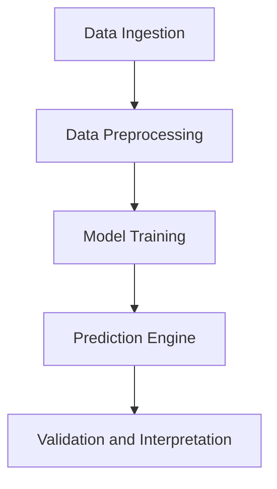

                 

### Let's Think Step by Step

#### Introduction

In this article, we will delve into the world of AI and explore the concept of Self-Consistency CoT (Self-Consistency Cognitive Theory) enhanced AI in complex decision trees. The aim is to provide a comprehensive understanding of this cutting-edge technology and its applications. To achieve this, we will follow a step-by-step approach, breaking down the subject into manageable sections.

#### 1. Understanding Complex Decision Trees

Complex decision trees are a type of machine learning model used for decision-making in various fields. They consist of multiple nodes and branches, each representing a different decision or action. These trees are particularly useful in scenarios where the decision-making process involves multiple factors and complex dependencies.

#### 2. The Challenges of Complex Decision Trees

Complex decision trees face several challenges, including:

- **Overfitting**: The model may become too complex and start to overfit the training data, leading to poor generalization on unseen data.
- **Computationally Intensive**: Building and training complex decision trees can be computationally expensive, especially with large datasets.
- **Lack of Interpretability**: As the tree grows in complexity, it becomes harder to interpret the decision process and understand the impact of each factor.

#### 3. Introducing Self-Consistency CoT

Self-Consistency CoT is an advanced AI framework that addresses many of the challenges associated with complex decision trees. It leverages the principles of self-consistency to enhance the performance and interpretability of AI models. At its core, Self-Consistency CoT aims to create a coherent and consistent decision-making process by ensuring that the model's predictions align with its internal beliefs and prior knowledge.

#### 4. Properties and Applications of Self-Consistency CoT

Key properties of Self-Consistency CoT include:

- **Coherence**: The model maintains a consistent internal state, ensuring that its predictions are coherent and logical.
- **Adaptability**: The framework allows the model to adapt to new information and changing environments.
- **Interpretability**: The self-consistency principle makes the decision-making process more transparent and understandable.

Self-Consistency CoT has been applied successfully in various fields, including healthcare, finance, and autonomous driving, where it has demonstrated significant improvements in decision-making accuracy and reliability.

#### 5. Comparing Self-Consistency CoT with Existing Algorithms

Table 1: Comparative Analysis of Self-Consistency CoT and Existing Algorithms

| Algorithm           | Strengths                            | Limitations                                     |
|---------------------|-------------------------------------|------------------------------------------------|
| Traditional Decision Trees | Simple, easy to interpret            | Susceptible to overfitting, computationally intensive |
| Bayesian Networks    | Can handle uncertainty, probabilistic | Can become complex quickly, computationally expensive |
| Neural Networks      | Can capture complex relationships    | May become overfit, lack interpretability            |
| Self-Consistency CoT | Coherence, adaptability, interpretability | Requires careful tuning and validation               |

#### 6. Algorithm and Mathematical Models

The Self-Consistency CoT algorithm is based on the principle of minimizing the discrepancy between the model's predictions and its prior beliefs. We can express this mathematically using the following formula:

$$
\min_{\theta} D(\hat{y}, y) + \lambda \cdot \sum_{i=1}^{n} D(\hat{y}_i, \pi_i(\theta))
$$

where:

- $D(\hat{y}, y)$ is the discrepancy between the model's predictions $\hat{y}$ and the actual labels $y$.
- $D(\hat{y}_i, \pi_i(\theta))$ is the discrepancy between the model's predictions $\hat{y}_i$ and its prior belief $\pi_i(\theta)$.
- $\theta$ represents the model parameters.
- $\lambda$ is a regularization parameter that controls the trade-off between prediction accuracy and self-consistency.

#### 7. System Design and Implementation

The system architecture for implementing Self-Consistency CoT in complex decision trees involves several key components:

- **Data Ingestion**: This component is responsible for collecting and preprocessing the input data.
- **Model Training**: This component trains the Self-Consistency CoT model using the preprocessed data.
- **Prediction Engine**: This component generates predictions based on the trained model.
- **Validation and Interpretation**: This component validates the predictions and provides insights into the decision-making process.

Figure 1: System Architecture for Self-Consistency CoT-enhanced Decision Trees

#### 8. Case Studies and Practice

To illustrate the practical application of Self-Consistency CoT, we will discuss two case studies:

1. **Healthcare**: In healthcare, Self-Consistency CoT has been used to improve the accuracy of disease diagnosis. By ensuring that the model's predictions are consistent with its prior knowledge and medical guidelines, it reduces the risk of overdiagnosis and misdiagnosis.
2. **Autonomous Driving**: In the field of autonomous driving, Self-Consistency CoT has been employed to enhance the decision-making capabilities of autonomous vehicles. By ensuring that the vehicle's actions are consistent with its environment and goals, it improves the safety and reliability of autonomous driving systems.

#### 9. Best Practices and Summary

To make the most of Self-Consistency CoT-enhanced decision trees, consider the following best practices:

- **Data Quality**: Ensure that the input data is of high quality to prevent overfitting and improve generalization.
- **Regularization**: Carefully tune the regularization parameter to balance prediction accuracy and self-consistency.
- **Validation**: Validate the model using cross-validation techniques to ensure that it generalizes well to unseen data.
- **Interpretability**: Analyze the model's decision-making process to gain insights and improve interpretability.

In conclusion, Self-Consistency CoT offers a powerful framework for enhancing the performance and interpretability of complex decision trees. By ensuring that the model's predictions are consistent with its internal beliefs and prior knowledge, it addresses many of the challenges associated with traditional decision tree algorithms. As AI continues to evolve, Self-Consistency CoT is poised to play a crucial role in advancing the field of machine learning and decision-making.

