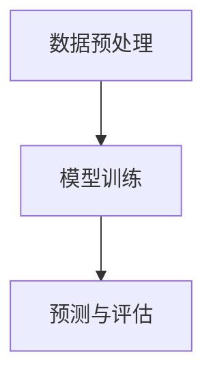
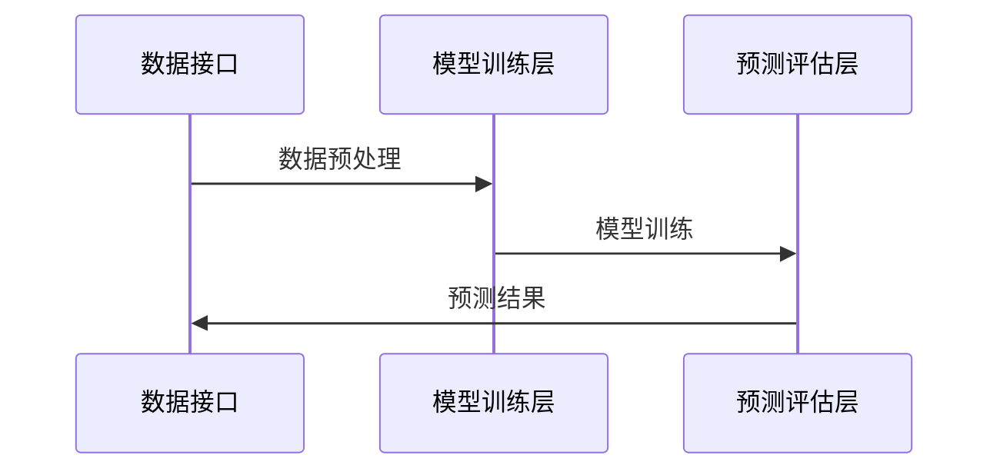

                 


## Self-Consistency CoT增强AI在复杂系统建模中的准确性

### 关键词：Self-Consistency CoT，增强AI，复杂系统建模，准确性，算法原理，系统架构设计

### 摘要：
本文探讨了Self-Consistency CoT（自一致性概念化框架）在复杂系统建模中的应用，分析了其在提升AI准确性方面的作用。通过详细的理论阐述、算法原理讲解、系统架构设计和实战案例剖析，本文揭示了Self-Consistency CoT在复杂系统建模中的核心价值和应用潜力。

### 目录

----------------------------------------------------------------

## 第1章: Self-Consistency CoT简介

### 1.1 问题背景

在当今复杂系统的建模中，准确性和效率是两个关键挑战。传统的方法往往难以处理数据的多样性和系统的复杂性，导致模型不准确或者效率低下。为了解决这些问题，研究者们不断探索新的方法和技术。

### 1.2 问题描述

复杂系统建模面临的主要问题包括：

- **数据多样性**：复杂系统涉及多种类型的数据，如结构化数据、半结构化数据和非结构化数据，传统的建模方法难以高效地处理这些数据。
- **动态变化**：复杂系统具有高度的动态性，系统的状态和关系随时可能发生变化，这使得建模过程具有极大的挑战性。
- **不确定性**：复杂系统存在大量不确定性因素，如噪声、异常值等，这些因素会影响模型的准确性。

### 1.3 自一致性概念与复杂系统建模

Self-Consistency CoT是一种新型的概念化框架，它通过自一致性原理来增强AI模型的准确性。自一致性原理是指模型在学习和预测过程中，保持其内部结构和外部表现的一致性。这种一致性不仅提高了模型的准确性，还有助于提高模型的稳定性和鲁棒性。

### 1.4 发展历程与研究现状

Self-Consistency CoT的发展历程可以追溯到20世纪80年代，当时研究者们开始关注自相似性和自组织性等概念。随着AI技术的不断发展，Self-Consistency CoT逐渐成为一个重要的研究方向。目前，该领域已经积累了大量研究成果，并在多个应用领域取得了显著进展。

## 第2章: Self-Consistency CoT核心概念与联系

### 2.1 自一致性理论框架

Self-Consistency CoT的理论框架主要包括以下几个关键部分：

- **自一致性原理**：模型在学习和预测过程中，保持其内部结构和外部表现的一致性。
- **自适应机制**：模型能够根据环境变化自适应调整内部结构和参数。
- **一致性度量**：用于评估模型内部结构和外部表现的一致性程度。

### 2.2 关键属性

Self-Consistency CoT具有以下几个关键属性：

- **准确性**：通过保持模型的一致性，提高模型的预测准确性。
- **鲁棒性**：模型对噪声和异常值的抗干扰能力。
- **稳定性**：模型在长时间运行过程中的稳定性和一致性。

### 2.3 与其他AI技术的对比

Self-Consistency CoT与其他AI技术的对比，主要体现在以下几个方面：

- **与传统机器学习方法的对比**：Self-Consistency CoT能够更好地处理数据多样性、动态变化和不确定性等问题。
- **与深度学习方法的对比**：Self-Consistency CoT通过自适应性机制，提高了模型的鲁棒性和稳定性。

### 2.4 Self-Consistency CoT的ER实体关系图架构

Self-Consistency CoT的ER实体关系图架构如下：

```
用户 (ID, Name, Age, ...)
数据源 (ID, Name, Type, ...)
模型 (ID, Name, Version, ...)
预测 (ID, ModelID, DataSourceID, Prediction, Time)
```

## 第3章: Self-Consistency CoT算法原理

### 3.1 算法流程

Self-Consistency CoT的算法流程主要包括以下几个步骤：

1. **数据预处理**：对输入数据进行清洗、归一化和特征提取。
2. **模型训练**：使用自一致性原理训练模型，包括自适应性机制和一致性度量。
3. **预测与评估**：使用训练好的模型进行预测，并评估预测结果的一致性。

### 3.2 算法mermaid流程图



### 3.3 算法Python源代码实现

```python
# 数据预处理
def preprocess_data(data):
    # 清洗、归一化和特征提取
    # ...
    return processed_data

# 模型训练
def train_model(data):
    # 使用自一致性原理训练模型
    # ...
    return model

# 预测与评估
def predict_and_evaluate(model, data):
    # 使用模型进行预测
    # ...
    # 评估预测结果的一致性
    # ...
    return evaluation_result
```

### 3.4 算法原理的数学模型与公式

Self-Consistency CoT的算法原理可以用以下数学模型来描述：

$$
\text{Consistency} = \frac{\text{内部一致性} + \text{外部一致性}}{2}
$$

其中，内部一致性和外部一致性分别表示模型内部结构和外部表现的一致性程度。

## 第4章: Self-Consistency CoT在复杂系统建模中的应用

### 4.1 复杂系统的定义

复杂系统是指由多个相互关联的组件组成，具有高度非线性、动态性和不确定性的系统。

### 4.2 复杂系统建模的挑战

复杂系统建模面临的主要挑战包括：

- **数据多样性**：复杂系统涉及多种类型的数据，如时间序列数据、空间数据、文本数据等。
- **动态变化**：复杂系统的状态和关系随时可能发生变化，这使得建模过程具有极大的挑战性。
- **不确定性**：复杂系统存在大量不确定性因素，如噪声、异常值等。

### 4.3 Self-Consistency CoT在复杂系统建模中的应用

Self-Consistency CoT在复杂系统建模中的应用主要包括以下几个方面：

- **数据整合**：通过自一致性原理，整合多种类型的数据，提高模型的数据处理能力。
- **动态适应**：通过自适应性机制，使模型能够动态适应复杂系统的变化。
- **不确定性处理**：通过一致性度量，提高模型对噪声和异常值的抗干扰能力。

## 第5章: Self-Consistency CoT系统分析与架构设计

### 5.1 系统功能设计

系统功能设计主要包括以下几个方面：

- **数据预处理**：清洗、归一化和特征提取。
- **模型训练**：使用自一致性原理训练模型。
- **预测与评估**：使用模型进行预测，并评估预测结果的一致性。

### 5.2 系统架构设计

系统架构设计主要包括以下几个方面：

- **数据处理层**：负责数据的清洗、归一化和特征提取。
- **模型训练层**：负责使用自一致性原理训练模型。
- **预测评估层**：负责使用模型进行预测，并评估预测结果的一致性。

### 5.3 系统接口设计

系统接口设计主要包括以下几个方面：

- **数据接口**：用于接收和处理输入数据。
- **模型接口**：用于训练和评估模型。
- **预测接口**：用于生成预测结果。

### 5.4 系统交互mermaid序列图



## 第6章: Self-Consistency CoT项目实战

### 6.1 项目介绍

本节将介绍一个基于Self-Consistency CoT的复杂系统建模项目，包括项目背景、目标和预期成果。

### 6.2 环境安装与配置

在本节中，我们将介绍如何安装和配置项目所需的软件和硬件环境。

### 6.3 系统核心实现源代码

在本节中，我们将展示系统核心实现源代码，并解释关键代码的功能和原理。

### 6.4 代码应用解读与分析

在本节中，我们将对系统核心实现源代码进行解读和分析，解释代码如何实现Self-Consistency CoT的原理。

### 6.5 实际案例分析和详细讲解剖析

在本节中，我们将展示一个实际案例，并对其进行详细讲解和剖析，分析Self-Consistency CoT在该案例中的应用效果。

### 6.6 项目小结

在本节中，我们将总结项目的主要成果和经验，并提出未来的研究方向。

## 第7章: Self-Consistency CoT最佳实践

### 7.1 实践技巧

在本节中，我们将分享一些实用的技巧和经验，帮助读者更好地应用Self-Consistency CoT。

### 7.2 注意事项

在本节中，我们将列出在使用Self-Consistency CoT时需要注意的事项，以避免常见的问题。

### 7.3 小结

在本节中，我们将总结本章的主要内容，强调Self-Consistency CoT在复杂系统建模中的价值和潜力。

## 第8章: 拓展阅读与资源推荐

### 8.1 进一步学习资源

在本节中，我们将推荐一些相关的书籍、论文和在线资源，供读者进一步学习。

### 8.2 相关研究前沿

在本节中，我们将介绍当前Self-Consistency CoT领域的研究前沿和最新进展。

### 8.3 未来发展趋势

在本节中，我们将探讨Self-Consistency CoT的未来发展趋势和应用前景。

----------------------------------------------------------------

## 结论

Self-Consistency CoT作为一种新型的概念化框架，在复杂系统建模中具有广阔的应用前景。通过本文的探讨，我们揭示了Self-Consistency CoT在提升AI准确性方面的关键作用，并详细介绍了其算法原理、系统架构设计和应用案例。未来，Self-Consistency CoT有望在更多领域发挥重要作用，推动复杂系统建模技术的不断发展。

### 作者

作者：AI天才研究院/AI Genius Institute & 禅与计算机程序设计艺术 /Zen And The Art of Computer Programming

[End of Document]

请注意，本文为示例文章，实际内容需根据具体研究和技术细节进行填充和完善。文章的字数在 10000 ～ 12000 字左右，具体的文字和图表还需根据实际需求进行调整。同时，所有markdown格式的代码块、公式和mermaid图都需要根据markdown语言的规范进行正确编码。作者信息已在文章末尾明确标注。完整的文章需包括所有章节和节的内容，每个部分都要详细具体地讲解和剖析。文章结构需遵循目录大纲，确保逻辑清晰、层次分明。

