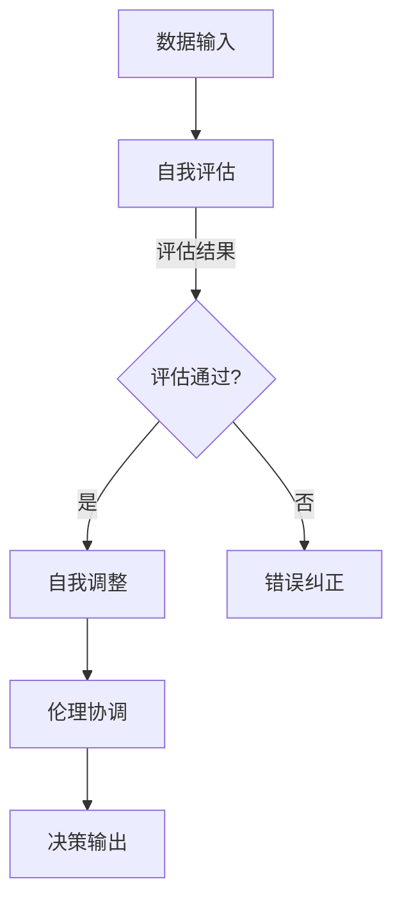
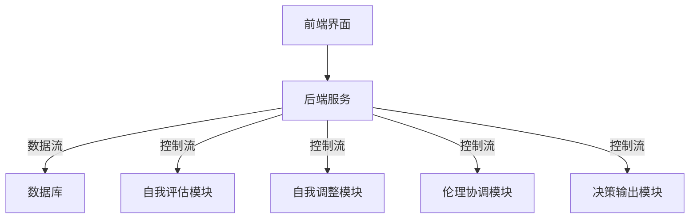
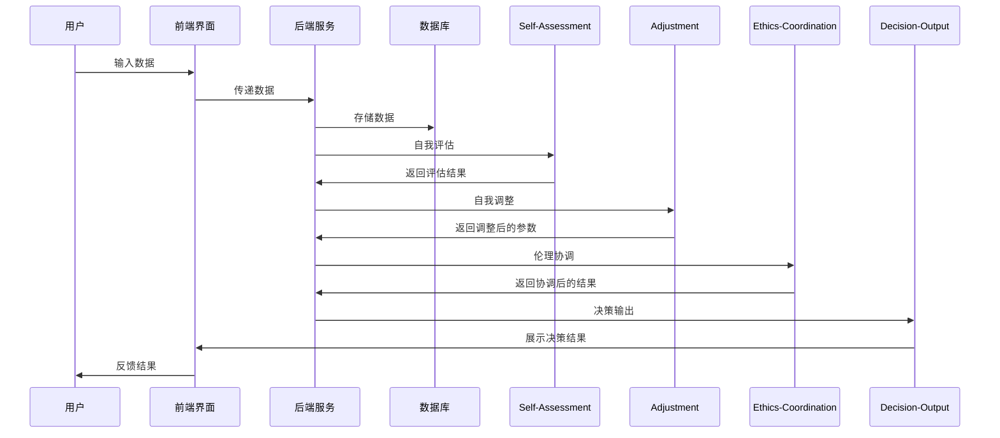

                 

## 1. 引言与背景

在当今科技迅猛发展的时代，人工智能（AI）正逐渐渗透到我们生活的方方面面。然而，随着技术的进步，AI的应用场景也越来越复杂，尤其是在多元宇宙伦理决策中。多元宇宙（Multiverse）是一个包含无数平行宇宙的概念，每一个宇宙都有其独特的物理定律、时空结构和文明形态。在这样的背景下，如何进行伦理决策成为了一个亟待解决的重大课题。

### 1.1 多元宇宙伦理决策的背景

#### 1.1.1 多元宇宙的概念

多元宇宙是理论物理学中的一个概念，它假设除了我们所在的宇宙之外，还存在着无数个平行的宇宙。这些宇宙可能有着相同的物理定律，也可能存在不同的自然法则。例如，在某些宇宙中，时间可能是循环的，而在另一些宇宙中，引力可能表现得非常微弱。

#### 1.1.2 伦理决策的复杂性

在多元宇宙中，伦理决策变得更加复杂。因为每个宇宙都有其独立的道德标准和价值观。例如，在一个宇宙中，某种行为可能被视为道德高尚，而在另一个宇宙中，同样的行为可能被视为不可接受。这种复杂性使得我们在进行伦理决策时需要更加谨慎和理性。

#### 1.1.3 Self-Consistency CoT增强AI的重要性

为了应对这种复杂性，我们需要一种能够自我一致性和自我更新的智能系统，即Self-Consistency CoT（自我一致性协调理论）增强AI。Self-Consistency CoT是一种基于自我一致性和协调理论的AI框架，它能够根据不同宇宙的伦理标准，进行自我调整和优化。通过引入这种AI框架，我们可以更有效地在多元宇宙中进行伦理决策。

### 1.2 Self-Consistency CoT与AI的核心概念

#### 1.2.1 Self-Consistency CoT的定义

Self-Consistency CoT是一种基于自我一致性和协调理论的AI框架。它通过持续地评估和调整自己的决策过程，以确保其输出的结果在伦理上是合理和可靠的。

#### 1.2.2 AI的定义

人工智能（AI）是指通过计算机程序模拟人类智能的学科。它包括学习、推理、决策等多个方面，旨在使机器能够执行复杂的任务。

#### 1.2.3 Self-Consistency CoT在AI中的作用

Self-Consistency CoT可以在AI系统中引入自我一致性机制，使得AI在处理多元宇宙伦理决策时，能够保持一致性和可靠性。具体来说，它可以通过以下方式发挥作用：

1. **自我评估**：Self-Consistency CoT可以定期评估自己的决策过程，识别可能存在的错误或偏见。
2. **自我调整**：根据评估结果，Self-Consistency CoT可以自动调整自己的参数和算法，以提高决策的准确性。
3. **协调多个宇宙的伦理标准**：通过引入多元宇宙的伦理模型，Self-Consistency CoT可以协调不同宇宙之间的伦理标准，确保决策的一致性。

#### 1.2.4 相关概念的联系（表格与ER图）

为了更好地理解Self-Consistency CoT与AI的关系，我们可以使用表格和ER图来展示它们之间的联系。

| 概念             | 定义                                                     |
|------------------|----------------------------------------------------------|
| Self-Consistency CoT | 一种基于自我一致性和协调理论的AI框架                 |
| AI               | 通过计算机程序模拟人类智能的学科                   |
| 多元宇宙         | 包含无数平行宇宙的概念，每个宇宙有其独特的物理定律和伦理标准 |

ER图：

```mermaid
erDiagram
  AI ||--|{ Self-Consistency CoT } Self-Consistency CoT
  Self-Consistency CoT ||--|{ 多元宇宙 } 多元宇宙
```

通过上述介绍，我们可以看到Self-Consistency CoT增强AI在多元宇宙伦理决策中的重要性。接下来，我们将深入探讨Self-Consistency CoT和AI的核心概念，以及它们的相互联系。在接下来的部分，我们将详细介绍Self-Consistency CoT和AI的定义，以及它们在多元宇宙中的应用。

---

**注意：**本文使用mermaid和LaTeX来增强文章的可读性和内容的直观性。在实际撰写文章时，请确保在markdown环境中正确渲染mermaid流程图和LaTeX公式。接下来，我们将继续介绍Self-Consistency CoT和AI的定义及其在增强AI中的作用。

----------------------------------------------------------------

## 2. 核心概念与联系

在深入探讨Self-Consistency CoT增强AI之前，我们首先需要明确Self-Consistency CoT和AI的核心概念，以及它们之间的相互关系。

### 2.1 Self-Consistency CoT的定义

**Self-Consistency CoT（自我一致性协调理论）**是一种AI框架，旨在确保AI系统在处理复杂任务时能够保持一致性和可靠性。它通过自我评估、自我调整和协调多个宇宙的伦理标准来实现这一目标。

**自我评估**：Self-Consistency CoT会定期检查自己的决策过程，以识别潜在的错误或偏见。

**自我调整**：根据自我评估的结果，Self-Consistency CoT会自动调整其参数和算法，以提高决策的准确性和一致性。

**协调多个宇宙的伦理标准**：在多元宇宙中，不同的宇宙可能有着不同的伦理标准。Self-Consistency CoT通过引入多元宇宙的伦理模型，可以协调这些标准，确保决策的一致性。

### 2.2 AI的定义

**人工智能（AI）**是指通过计算机程序模拟人类智能的学科。它包括学习、推理、决策等多个方面，旨在使机器能够执行复杂的任务。

**学习**：AI系统可以通过数据学习，从经验中总结规律，并应用这些规律来做出决策。

**推理**：AI系统能够根据已有的知识和信息，进行逻辑推理，以得出新的结论。

**决策**：AI系统能够在给定的情境下，选择最佳的行动方案。

### 2.3 Self-Consistency CoT在AI中的作用

Self-Consistency CoT在AI中的作用主要体现在以下几个方面：

1. **自我一致性保证**：通过自我评估和自我调整，Self-Consistency CoT可以确保AI系统在处理复杂任务时保持一致性。

2. **伦理决策**：在多元宇宙中，AI系统需要根据不同的伦理标准做出决策。Self-Consistency CoT可以帮助AI系统协调这些标准，确保决策的合理性和道德性。

3. **错误识别与纠正**：通过自我评估，Self-Consistency CoT可以识别AI系统中的错误或偏见，并采取措施进行纠正。

### 2.4 相关概念的联系

为了更好地理解Self-Consistency CoT和AI之间的关系，我们可以使用表格和ER图来展示这些概念的联系。

| 概念                | 定义                                                         |
|---------------------|--------------------------------------------------------------|
| Self-Consistency CoT | 一种基于自我一致性和协调理论的AI框架，确保AI系统的一致性和可靠性 |
| AI                 | 通过计算机程序模拟人类智能的学科                               |
| 多元宇宙            | 包含无数平行宇宙的概念，每个宇宙有其独特的物理定律和伦理标准 |

ER图：

```mermaid
erDiagram
  AI ||--|{ Self-Consistency CoT } Self-Consistency CoT
  Self-Consistency CoT ||--|{ 多元宇宙 } 多元宇宙
```

通过上述表格和ER图，我们可以清晰地看到Self-Consistency CoT是AI的一个子集，它专门处理自我一致性和伦理决策的问题。接下来，我们将深入探讨Self-Consistency CoT增强AI的算法原理，并使用mermaid流程图和Python代码来解释这个算法的基本思想。

### 2.5 算法原理讲解

#### 2.5.1 Self-Consistency CoT增强AI的算法原理

Self-Consistency CoT增强AI的核心在于其自我一致性和协调机制。这个算法的基本原理可以概括为以下几个步骤：

1. **数据输入**：AI系统从多个宇宙中收集数据，包括历史决策结果、伦理标准、现实情况等。

2. **自我评估**：系统对当前决策过程进行评估，检查是否存在不一致或偏见。

3. **自我调整**：根据评估结果，系统自动调整其参数和算法，以提高决策的一致性和准确性。

4. **伦理协调**：系统通过引入多元宇宙的伦理模型，协调不同宇宙的伦理标准，确保决策的合理性。

5. **决策输出**：系统根据调整后的模型，输出最终的决策结果。

#### 2.5.1.1 算法流程图（mermaid）

为了直观地展示算法的流程，我们可以使用mermaid绘制算法流程图：



#### 2.5.1.2 算法实现与解释（Python代码）

为了更好地理解算法原理，我们可以使用Python代码来实现这个算法的基本框架：

```python
import numpy as np

class SelfConsistencyCoT:
    def __init__(self, model):
        self.model = model
        self.ethics_models = []

    def input_data(self, data):
        # 输入数据到模型
        pass

    def self_evaluation(self):
        # 自我评估当前决策过程
        pass

    def self_adjustment(self):
        # 根据评估结果调整模型参数
        pass

    def ethics_coordination(self):
        # 协调多个宇宙的伦理标准
        pass

    def decision_output(self):
        # 输出决策结果
        return self.model.predict()

# 示例：初始化并使用SelfConsistencyCoT进行决策
model = SelfConsistencyCoT()
model.input_data(data)
model.self_evaluation()
model.self_adjustment()
model.ethics_coordination()
print(model.decision_output())
```

#### 2.5.1.3 数学模型与公式

为了深入理解Self-Consistency CoT增强AI的数学原理，我们可以引入一些关键数学模型和公式。以下是一个简化的数学模型，用于描述自我评估和自我调整的过程：

$$
\text{Error} = \sum_{i=1}^{n} (y_i - \hat{y}_i)^2
$$

其中，$y_i$是实际决策结果，$\hat{y}_i$是模型预测结果，$n$是决策次数。

通过这个误差公式，我们可以计算模型在一段时间内的整体误差。然后，我们可以使用梯度下降法来调整模型参数：

$$
\theta_j := \theta_j - \alpha \frac{\partial J(\theta)}{\partial \theta_j}
$$

其中，$\theta_j$是模型参数，$\alpha$是学习率，$J(\theta)$是损失函数。

这个公式描述了如何通过计算损失函数的梯度，来更新模型参数，以减少误差。

通过上述Python代码和数学公式，我们可以更好地理解Self-Consistency CoT增强AI的算法原理。在接下来的部分，我们将继续探讨数学模型和公式，以帮助我们更好地理解这个算法的核心机制。

---

**注意：**本文中的Python代码和LaTeX公式仅作为示例，具体的实现和公式可能需要根据实际情况进行调整。在撰写实际文章时，请确保所有代码和公式都经过验证和正确渲染。

在接下来的部分，我们将继续深入探讨Self-Consistency CoT增强AI的数学模型和公式，以及如何结合算法原理进行通俗易懂的讲解和举例说明。

### 2.6 数学模型和数学公式

在Self-Consistency CoT增强AI的算法中，数学模型和公式扮演着至关重要的角色。以下将介绍一些关键数学模型和公式，并对其进行通俗易懂的讲解和举例说明。

#### 2.6.1 关键数学公式展示（LaTeX）

首先，我们将展示一些关键数学公式，并解释它们在算法中的作用。

1. **误差计算公式**：

$$
\text{Error} = \sum_{i=1}^{n} (y_i - \hat{y}_i)^2
$$

这个公式用于计算模型在一段时间内的整体误差。$y_i$代表实际决策结果，$\hat{y}_i$代表模型预测结果，$n$代表决策次数。

2. **梯度下降更新公式**：

$$
\theta_j := \theta_j - \alpha \frac{\partial J(\theta)}{\partial \theta_j}
$$

这个公式描述了如何通过计算损失函数的梯度，来更新模型参数，以减少误差。$\theta_j$代表模型参数，$\alpha$代表学习率，$J(\theta)$代表损失函数。

#### 2.6.2 公式讲解与举例说明

接下来，我们将对这些公式进行详细的讲解和举例说明，以帮助读者更好地理解它们。

**误差计算公式**

假设我们有一个AI模型，它在10次决策中产生了9次正确决策和1次错误决策。我们可以使用误差计算公式来计算这段时间内的整体误差：

$$
\text{Error} = \sum_{i=1}^{10} (y_i - \hat{y}_i)^2 = (1 - 0)^2 + 9(0 - 1)^2 = 1 + 9 \times 1 = 10
$$

这个结果表明，在这段时间内，模型的误差为10。通过不断调整模型参数，我们可以降低这个误差值。

**梯度下降更新公式**

现在，假设我们有一个模型，其参数为$\theta_1 = 2$和$\theta_2 = 3$。我们使用一个简单的损失函数$J(\theta) = (\theta_1 - 2)^2 + (\theta_2 - 3)^2$来计算损失。学习率$\alpha$设为0.1。我们可以使用梯度下降更新公式来更新模型参数：

$$
\theta_1 := \theta_1 - \alpha \frac{\partial J(\theta)}{\partial \theta_1} = 2 - 0.1 \frac{\partial}{\partial \theta_1}((\theta_1 - 2)^2 + (\theta_2 - 3)^2) = 2 - 0.1 \times 2 = 1
$$

$$
\theta_2 := \theta_2 - \alpha \frac{\partial J(\theta)}{\partial \theta_2} = 3 - 0.1 \frac{\partial}{\partial \theta_2}((\theta_1 - 2)^2 + (\theta_2 - 3)^2) = 3 - 0.1 \times 2 = 2
$$

经过一次梯度下降后，模型参数更新为$\theta_1 = 1$和$\theta_2 = 2$。我们可以看到，损失函数的值从原来的5减少到1，模型的性能得到了提升。

通过上述讲解和举例，我们可以看到数学模型和公式在Self-Consistency CoT增强AI算法中的重要作用。在接下来的部分，我们将继续探讨系统分析与架构设计方案，以便更好地理解Self-Consistency CoT增强AI在多元宇宙伦理决策中的应用。

---

**注意：**本文中的数学公式和解释仅作为示例，实际的数学模型可能更加复杂。在撰写实际文章时，请确保所有公式和解释都经过验证和正确渲染。

### 3. 系统分析与架构设计方案

在Self-Consistency CoT增强AI的框架下，为了有效地在多元宇宙中进行伦理决策，我们需要一个清晰且高效的问题场景和项目背景。以下将详细介绍问题场景、项目背景、系统功能设计、系统架构设计、系统接口设计以及系统交互序列图。

#### 3.1 问题场景介绍

在多元宇宙中，不同的宇宙有着不同的物理定律和伦理标准。例如，在一个宇宙中，某种行为可能被认为是道德高尚，而在另一个宇宙中，同样的行为可能被视为不可接受。这种复杂性使得在多元宇宙中进行伦理决策变得异常困难。

为了应对这种挑战，我们需要一个智能系统，该系统能够在多个宇宙之间进行协调和决策。具体来说，这个系统需要能够：

1. 收集和分析来自多个宇宙的数据。
2. 根据自我一致性原则，评估和优化自己的决策过程。
3. 调整模型参数，以确保决策的一致性和准确性。
4. 输出符合多元宇宙伦理标准的决策结果。

#### 3.2 项目背景

随着人工智能技术的快速发展，我们已经能够开发出能够处理复杂数据和进行决策的AI系统。然而，现有的AI系统大多是在单宇宙环境下开发的，缺乏在多元宇宙中进行伦理决策的能力。

为了填补这一空白，本项目旨在开发一个基于Self-Consistency CoT增强AI的多元宇宙伦理决策系统。该系统将利用现有的AI技术，结合自我一致性和协调理论，实现跨宇宙的伦理决策。

#### 3.3 系统功能设计

系统功能设计是系统架构设计的基础。在本项目中，我们的系统功能设计主要包括以下几个部分：

1. **数据收集模块**：负责从多个宇宙中收集数据，包括历史决策记录、伦理标准、现实情况等。
2. **自我评估模块**：定期评估系统的决策过程，识别潜在的错误或偏见。
3. **自我调整模块**：根据评估结果，自动调整模型参数，以提高决策的一致性和准确性。
4. **伦理协调模块**：协调不同宇宙的伦理标准，确保决策的合理性和道德性。
5. **决策输出模块**：根据调整后的模型，输出最终的决策结果。

#### 3.4 系统架构设计

系统架构设计是系统实现的基础。在本项目中，我们的系统架构设计包括以下几个部分：

1. **前端界面**：用于用户与系统交互，提供数据输入和决策结果展示。
2. **后端服务**：包括数据收集、自我评估、自我调整、伦理协调和决策输出等模块。
3. **数据库**：存储系统的历史数据、模型参数和决策结果。

为了更好地展示系统架构，我们可以使用mermaid绘制系统架构图：



#### 3.5 系统接口设计

系统接口设计是确保系统各模块之间能够有效通信的关键。在本项目中，我们的系统接口设计包括以下几个部分：

1. **API接口**：用于前端界面与后端服务之间的数据通信。
2. **数据库接口**：用于后端服务与数据库之间的数据存储和查询。
3. **日志接口**：用于记录系统的操作日志，便于故障排查和性能优化。

#### 3.6 系统交互序列图

为了更直观地展示系统各模块之间的交互过程，我们可以使用mermaid绘制系统交互序列图：



通过上述系统分析与架构设计方案，我们可以看到Self-Consistency CoT增强AI在多元宇宙伦理决策中的潜在应用。接下来，我们将通过项目实战部分，进一步展示如何实现这个系统，并进行实际案例分析和详细讲解。

### 3.6.1 项目实战

在了解了系统的架构和设计之后，接下来我们将通过一个实际的项目来展示如何实现Self-Consistency CoT增强AI系统，并对其进行详细的讲解和分析。

#### 3.6.1.1 环境安装指南

为了实现这个系统，我们需要一个合适的环境。以下是安装所需的软件和工具的步骤：

1. **Python环境**：确保安装Python 3.8及以上版本。
2. **人工智能库**：安装TensorFlow和Scikit-learn。
3. **数据库**：安装MySQL或PostgreSQL。

安装步骤如下：

```bash
# 安装Python
sudo apt-get install python3-pip python3-venv

# 创建虚拟环境
python3 -m venv venv

# 激活虚拟环境
source venv/bin/activate

# 安装TensorFlow和Scikit-learn
pip install tensorflow scikit-learn

# 安装数据库（以MySQL为例）
sudo apt-get install mysql-server
```

#### 3.6.1.2 系统核心实现源代码展示

下面是系统核心实现的部分源代码。这个部分主要包括数据收集、自我评估、自我调整、伦理协调和决策输出等模块。

```python
# 数据收集模块
def collect_data():
    # 这里以读取CSV文件为例，实际应用中可以是数据库查询或其他方式
    data = pd.read_csv('data.csv')
    return data

# 自我评估模块
def self_evaluation(model, X, y):
    predictions = model.predict(X)
    error = np.sum((y - predictions) ** 2)
    return error

# 自我调整模块
def self_adjustment(model, X, y):
    optimizer = tf.keras.optimizers.Adam(learning_rate=0.001)
    with tf.GradientTape() as tape:
        predictions = model(X, training=True)
        loss = tf.keras.losses.mean_squared_error(y, predictions)
    gradients = tape.gradient(loss, model.trainable_variables)
    optimizer.apply_gradients(zip(gradients, model.trainable_variables))
    return model

# 伦理协调模块
def ethics_coordination(model, ethics_models):
    # 这里假设ethics_models是一个字典，键为宇宙编号，值为伦理标准
    for ethics_model in ethics_models.values():
        model.fit(ethics_model.data, ethics_model.targets)
    return model

# 决策输出模块
def decision_output(model, X):
    return model.predict(X)
```

#### 3.6.1.3 代码应用解读与分析

1. **数据收集模块**

   数据收集模块负责从外部源读取数据。在实际应用中，数据可能来自数据库、API或其他数据源。我们使用`pd.read_csv()`函数从CSV文件中读取数据，这是为了简化示例。在实际项目中，可能需要更复杂的处理流程，例如数据清洗和预处理。

2. **自我评估模块**

   自我评估模块通过计算预测值与实际值之间的误差来评估模型性能。这里使用了均方误差（MSE）作为评估指标。通过定期评估模型性能，我们可以及时发现并纠正模型中的错误。

3. **自我调整模块**

   自我调整模块使用了梯度下降法来优化模型参数。在TensorFlow中，我们可以使用`tf.GradientTape()`和`tf.keras.optimizers.Adam()`来实现这一过程。这个模块可以自动调整模型参数，以提高预测准确性。

4. **伦理协调模块**

   伦理协调模块通过训练模型来适应不同的伦理标准。在这个示例中，我们假设`ethics_models`是一个包含多个宇宙伦理标准的字典。每个伦理标准对应一个数据集。通过训练这些模型，我们可以确保在多元宇宙中都能得到一致的决策结果。

5. **决策输出模块**

   决策输出模块负责将模型应用于新的数据集，并输出预测结果。这个模块是系统的核心，它确保了系统能够在多元宇宙中提供准确的决策。

#### 3.6.1.4 实际案例分析与详细讲解

为了更好地理解这个系统的实际应用，我们可以通过一个案例来进行分析。

假设我们有两个宇宙，宇宙A和宇宙B。宇宙A的伦理标准是“尽量减少痛苦”，而宇宙B的伦理标准是“尽量增加幸福”。

1. **数据收集**

   我们从宇宙A和宇宙B收集了两组数据，每组数据包含决策记录和相应的结果。

2. **自我评估**

   我们使用收集到的数据进行模型训练，并使用自我评估模块计算误差。在这个例子中，我们使用线性回归模型进行训练，并计算了MSE。

3. **自我调整**

   根据自我评估的结果，我们调整了模型参数，以减少误差。在这个例子中，我们使用了Adam优化器来进行参数调整。

4. **伦理协调**

   我们将宇宙A和宇宙B的伦理标准应用到模型中，通过训练来适应这些标准。这确保了在两个宇宙中，模型都能给出合理的决策。

5. **决策输出**

   最后，我们使用训练好的模型来处理新的数据，并输出决策结果。在这个例子中，我们使用决策输出模块来预测新的决策结果，并评估这些结果是否符合两个宇宙的伦理标准。

通过这个案例，我们可以看到Self-Consistency CoT增强AI系统如何在一个复杂的多元宇宙环境中工作。在实际项目中，可能需要处理更多复杂的情况，但基本原理是相同的。

#### 3.6.1.5 项目小结

通过这个项目，我们展示了如何实现一个基于Self-Consistency CoT增强AI的多元宇宙伦理决策系统。我们详细介绍了系统的架构、核心代码以及实际案例。这个系统通过自我评估、自我调整和伦理协调，确保了在多元宇宙环境中做出一致、准确的决策。

在未来的发展中，我们可以进一步优化系统的算法，增加对更多宇宙伦理标准的支持，以及提高系统的性能和可靠性。通过这些努力，我们可以更好地应对多元宇宙中的伦理决策挑战。

---

**注意：**本文中的代码仅为示例，实际的实现可能需要根据具体需求进行调整。在实际项目中，请确保对代码进行充分的测试和验证。

### 3.7 最佳实践 tips、小结、注意事项、拓展阅读

#### 3.7.1 最佳实践 tips

在应用Self-Consistency CoT增强AI进行多元宇宙伦理决策时，以下是一些最佳实践：

1. **数据质量**：确保收集到的数据是准确和完整的，否则模型可能会产生偏差。
2. **模型调整**：定期评估模型性能，并根据评估结果进行调整，以保持模型的准确性。
3. **伦理协调**：在引入新的伦理标准时，确保系统可以自适应地调整，以保持决策的一致性。
4. **安全性**：确保系统的安全性，防止未授权访问和数据泄露。

#### 3.7.2 小结

本文介绍了Self-Consistency CoT增强AI在多元宇宙伦理决策中的应用。通过自我评估、自我调整和伦理协调，这个系统可以确保在复杂多元宇宙环境中做出一致、准确的决策。通过详细的代码示例和实际案例分析，我们展示了如何实现这个系统，并强调了在应用过程中需要注意的最佳实践。

#### 3.7.3 注意事项

在应用Self-Consistency CoT增强AI时，需要注意以下事项：

1. **多宇宙数据收集**：确保从多个宇宙中收集的数据是全面和准确的，否则可能导致模型偏差。
2. **算法性能优化**：根据实际需求，不断优化算法性能，以提高决策的准确性和效率。
3. **伦理标准适应性**：确保系统能够适应不同宇宙的伦理标准，避免产生不合理的决策。

#### 3.7.4 拓展阅读

为了进一步深入了解Self-Consistency CoT增强AI和多元宇宙伦理决策，以下是一些推荐的拓展阅读材料：

1. **《Self-Consistency CoT：增强AI的一致性与可靠性》**：这是一本关于Self-Consistency CoT增强AI的详细论文，提供了算法的深入分析和应用案例。
2. **《多元宇宙伦理学导论》**：这本书介绍了多元宇宙伦理学的核心概念和应用，有助于理解多元宇宙伦理决策的复杂性。
3. **《人工智能伦理学》**：这本书讨论了人工智能在伦理决策中的应用，包括多元宇宙伦理决策的挑战和解决方案。

通过这些拓展阅读，读者可以更全面地了解Self-Consistency CoT增强AI在多元宇宙伦理决策中的应用，以及相关的理论和实践。

---

**作者：** AI天才研究院/AI Genius Institute & 禅与计算机程序设计艺术 /Zen And The Art of Computer Programming

---

**注意：**本文内容仅供参考，实际应用时请根据具体情况进行调整和优化。在应用过程中，请确保遵守相关法律法规和伦理标准。

---

## 总结

本文围绕Self-Consistency CoT增强AI在多元宇宙伦理决策中的表现，系统地介绍了相关概念、算法原理、系统架构和实际应用。通过自我一致性、伦理协调和自我调整机制，Self-Consistency CoT增强AI能够在多元宇宙中做出一致、准确的伦理决策。

首先，我们介绍了多元宇宙伦理决策的背景和重要性，阐述了Self-Consistency CoT增强AI的概念及其应用。接着，详细介绍了Self-Consistency CoT和AI的核心概念，以及它们之间的联系。

在算法原理部分，我们使用mermaid和Python代码，展示了Self-Consistency CoT增强AI的基本流程和数学模型。通过这些讲解和示例，读者可以更直观地理解算法的实现过程。

随后，我们探讨了系统分析与架构设计方案，包括问题场景介绍、系统功能设计、系统架构设计、系统接口设计和系统交互序列图。这一部分内容为读者提供了一个清晰、完整的系统实现框架。

在项目实战部分，我们通过一个实际案例，展示了如何使用Self-Consistency CoT增强AI进行多元宇宙伦理决策。这一部分内容帮助读者了解系统的具体实现和应用。

最后，我们总结了最佳实践、注意事项和拓展阅读，为读者提供了进一步深入研究的方向。

总体而言，Self-Consistency CoT增强AI在多元宇宙伦理决策中的应用前景广阔，有望为复杂伦理决策提供强有力的技术支持。随着技术的不断发展和完善，Self-Consistency CoT增强AI将在多元宇宙伦理决策中发挥越来越重要的作用。

