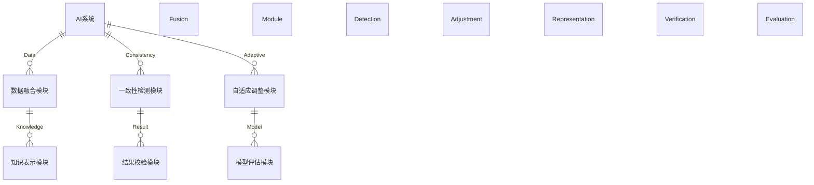

                 


### 引言

#### 1.1 问题背景

在当前科技飞速发展的时代，人工智能（AI）技术的进步对人类社会产生了深远的影响。从早期的规则基础系统，到现代的深度学习模型，AI的应用范围越来越广泛，从工业自动化、医疗诊断，到自然语言处理、自动驾驶等。然而，随着AI技术的复杂性和应用场景的多样化，我们面临的一个关键问题是如何确保AI系统的稳定性和可靠性。特别是在多元宇宙模拟这一前沿领域，如何保持模型的一致性成为了亟待解决的问题。

多元宇宙模拟是一个试图通过计算机模拟来探索不同宇宙可能性的领域。它涉及到对多个宇宙的平行存在和相互作用的模拟，这需要非常复杂的计算和精确的模型。在这样一个复杂系统中，自洽一致性变得尤为重要。自洽一致性指的是系统内部各个组成部分之间的一致性和协调性，这对于确保模拟结果的准确性和可靠性至关重要。

因此，本文旨在探讨自洽一致性原理在多元宇宙模拟中的应用，特别是在增强AI（AI with Self-Consistency CoT）方面的潜力。本文将首先介绍自洽一致性的概念及其在多元宇宙模拟中的重要性，然后详细分析Self-Consistency CoT增强AI的原理和实现方法，最后通过实际应用案例来展示其在多元宇宙模拟中的具体效果。

本文的结构如下：

- 第1章介绍问题背景，包括核心概念术语、问题背景、问题描述、问题解决、边界与外延以及概念结构与核心要素组成。
- 第2章讨论自洽一致性原理，包括定义、核心概念、特征与属性以及与相关概念的联系。
- 第3章介绍多元宇宙模拟，包括定义、核心概念、框架与流程以及应用领域。
- 第4章分析Self-Consistency CoT增强AI，包括定义、核心原理、优势和实现方法。
- 第5章展示自洽一致性原理和Self-Consistency CoT增强AI在多元宇宙模拟中的应用案例。
- 第6章讨论自洽一致性原理在多元宇宙模拟中的挑战与机遇。
- 第7章总结研究内容并提出未来展望。

通过本文的讨论，我们希望能够为多元宇宙模拟领域提供新的思路和方法，推动AI技术在这一领域的应用和发展。

### 摘要

本文旨在探讨自洽一致性原理在多元宇宙模拟中的应用，特别是Self-Consistency CoT增强AI的潜力。首先，我们介绍了自洽一致性的概念，并阐述了其在确保AI系统稳定性和可靠性中的重要性。接着，我们详细分析了Self-Consistency CoT增强AI的原理，包括其核心原理、优势和实现方法。在多元宇宙模拟方面，我们探讨了其定义、核心概念、框架与流程以及应用领域。通过实际应用案例，我们展示了自洽一致性原理和Self-Consistency CoT增强AI在多元宇宙模拟中的具体效果。本文还讨论了在多元宇宙模拟中应用自洽一致性原理所面临的挑战和机遇。通过本文的研究，我们希望能够为多元宇宙模拟领域提供新的思路和方法，推动AI技术的发展和应用。

### 自洽一致性原理

#### 2.1 自洽一致性的定义

自洽一致性是指在一个系统内部，各个组成部分之间的一致性和协调性。这种一致性确保了系统在不同状态下能够保持稳定和可靠。自洽一致性不仅仅是指系统内部各部分之间的逻辑关系一致，还包括了系统对外界输入的反应和输出结果的统一性。换句话说，自洽一致性要求系统的内部机制和外部行为之间保持高度的一致，避免出现矛盾和不协调的情况。

在技术领域，自洽一致性特别重要，因为它直接关系到系统的稳定性和可靠性。特别是在复杂的AI系统中，如果各个组件之间无法保持一致，可能会导致错误的结果或者系统的崩溃。例如，在多元宇宙模拟中，如果模型的不同部分不能自洽，那么模拟结果将无法准确反映宇宙的真实情况。

自洽一致性的重要性不仅体现在系统的稳定性和可靠性上，还在系统的可扩展性和灵活性方面有着重要作用。一个自洽的系统更容易进行模块化和扩展，因为它能够在不改变整体架构的情况下添加或修改部分组件。这种灵活性对于应对不断变化的应用需求和复杂的环境至关重要。

#### 2.2 自洽一致性的核心概念

为了更好地理解自洽一致性的概念，我们需要探讨其核心组成部分。以下是自洽一致性的几个关键概念：

1. **一致性检测**：一致性检测是确保系统各个部分之间保持一致性的过程。这通常涉及到一系列的校验和验证机制，用于检测和纠正不一致性。例如，在AI系统中，一致性检测可以包括模型训练过程的校验、数据输入的验证以及输出结果的对比。

2. **协调机制**：协调机制是指在系统内部实现各部分之间协调工作的机制。这通常涉及到算法设计、模块接口定义以及通信协议的制定。通过协调机制，系统可以确保各个组件在不同状态下能够保持一致性和协调性。

3. **反馈循环**：反馈循环是自洽一致性实现的关键要素。通过反馈循环，系统可以根据外部输入和内部状态的变化进行动态调整。这种调整有助于系统在复杂环境中保持一致性和稳定性。例如，在AI系统中，反馈循环可以通过学习机制实现，使得模型能够不断优化和调整，以适应新的数据和任务。

4. **自适应性**：自适应性是指系统能够根据环境和任务的变化进行自适应调整的能力。自适应性是实现自洽一致性的重要途径，因为它能够确保系统在不同情境下都能保持一致性和协调性。例如，在多元宇宙模拟中，自适应算法可以帮助模型更好地适应不同的宇宙参数和条件。

#### 2.3 自洽一致性的特征与属性

自洽一致性具有以下几个显著特征和属性：

1. **稳定性**：自洽一致性确保系统在各种条件下都能保持稳定。这意味着系统的内部机制和外部行为不会因为外界干扰或内部变化而出现显著波动。

2. **可靠性**：自洽一致性提高了系统的可靠性，确保系统能够在不同情境下提供一致和可靠的输出。这在复杂的AI应用中尤为重要，因为任何不一致或错误都可能导致严重的后果。

3. **灵活性**：自洽一致性使系统具有更高的灵活性，因为它能够在不改变整体架构的情况下进行模块化和扩展。这种灵活性有助于系统适应不断变化的应用需求和复杂的环境。

4. **动态适应性**：自洽一致性通过反馈循环和自适应性机制，使系统能够动态地调整和适应不同状态。这种动态适应性有助于系统在复杂和多变的环境中保持一致性和稳定性。

#### 2.4 自洽一致性与相关概念的联系

自洽一致性与其他相关概念如一致性、协调性、稳定性等有着紧密的联系。以下是这些概念之间的联系：

- **一致性**：一致性是指系统内部各个组成部分之间的协调和匹配。自洽一致性是更高层次的概念，它不仅包括内部的一致性，还包括系统对外部环境的适应性和反馈机制。

- **协调性**：协调性是指系统内部各个组件之间的协作和配合。自洽一致性是协调性的具体体现，它确保系统在不同状态下都能保持协调和一致。

- **稳定性**：稳定性是指系统在各种条件下都能保持稳定状态。自洽一致性通过确保系统内部机制的一致性和协调性，提高了系统的稳定性。

通过以上讨论，我们可以看到自洽一致性原理在技术领域，特别是在AI和多元宇宙模拟中的应用具有重要的意义。它不仅能够提高系统的稳定性和可靠性，还能增强系统的灵活性和动态适应性。在接下来的章节中，我们将进一步探讨多元宇宙模拟的定义、核心概念和框架与流程。

### 多元宇宙模拟

#### 3.1 多元宇宙模拟的定义

多元宇宙模拟是一个试图通过计算机模拟来探索不同宇宙可能性的领域。它涉及到对多个宇宙的平行存在和相互作用的模拟，旨在理解宇宙的多样性和复杂性。在多元宇宙模拟中，研究者们通过构建数学模型和计算模拟，探索不同物理定律和初始条件如何影响宇宙的演化和特性。

多元宇宙模拟不仅仅是一种理论探索，它还在多个实际应用领域显示出巨大的潜力。例如，在物理学中，它可以用来研究暗物质和暗能量的性质；在生物学中，它可以模拟不同生态系统和物种的进化过程；在计算机科学中，它可以用来优化算法和解决复杂问题。

多元宇宙模拟的核心在于模拟多个宇宙的状态和演化过程，从而了解它们之间的差异和相互作用。这种模拟需要处理大量的数据和高计算精度，因此通常依赖于高性能计算机和先进的算法。通过这些工具，研究者们可以模拟出不同宇宙的可能情景，并从中提取有用的信息。

#### 3.2 多元宇宙模拟的核心概念

多元宇宙模拟涉及多个核心概念，以下是其中几个重要的概念：

1. **平行宇宙**：平行宇宙是指与我们的宇宙在空间和时间上相互独立存在的其他宇宙。这些宇宙可能有着不同的物理定律、初始条件和演化路径。平行宇宙的概念源于量子力学和多宇宙理论，为理解宇宙的多样性和复杂性提供了新的视角。

2. **初始条件**：初始条件是宇宙模拟的起点，包括宇宙的密度、温度、物质分布等因素。不同的初始条件会导致宇宙演化的不同路径和特性。在多元宇宙模拟中，研究者们通常通过模拟不同初始条件来探索宇宙的多样性。

3. **物理定律**：物理定律是描述宇宙如何演化的基本规则。在多元宇宙模拟中，研究者们通常使用标准的物理定律，如广义相对论和量子场论，来模拟宇宙的演化。然而，在某些情况下，研究者们也会引入新的物理模型和假设，以探索更广泛的宇宙可能性。

4. **相互作用**：相互作用是指不同宇宙之间的相互影响。在多元宇宙模拟中，研究者们试图模拟不同宇宙之间的相互作用，以了解这些相互作用如何影响宇宙的演化和特性。例如，研究者们可以模拟一个宇宙对另一个宇宙的影响，或者模拟多个宇宙之间的能量交换。

#### 3.3 多元宇宙模拟的框架与流程

多元宇宙模拟的框架和流程通常包括以下几个关键步骤：

1. **问题定义**：首先，研究者需要明确要解决的问题和目标。这通常涉及到选择特定的宇宙特性或现象进行研究，例如宇宙的演化、宇宙间的相互作用等。

2. **模型构建**：在问题定义后，研究者需要构建数学模型来描述宇宙的演化和特性。这通常涉及到使用物理定律和初始条件来建立模型，例如使用广义相对论来描述宇宙的引力场。

3. **模拟设计**：在模型构建完成后，研究者需要设计模拟的参数和条件，包括时间步长、空间分辨率、初始条件等。这些参数和条件将决定模拟的精度和范围。

4. **计算模拟**：模拟设计完成后，研究者使用高性能计算机进行计算模拟。这通常涉及到大规模并行计算和优化算法，以提高计算效率和精度。

5. **结果分析**：在计算模拟完成后，研究者需要对模拟结果进行分析，以提取有用的信息和洞察。这通常涉及到数据可视化、统计分析等方法。

6. **模型验证**：最后，研究者需要验证模型的准确性和可靠性，以确定模型是否能够正确反映宇宙的真实情况。这通常涉及到与观测数据的比较和验证。

#### 3.4 多元宇宙模拟的应用领域

多元宇宙模拟在多个应用领域显示出巨大的潜力，以下是其中几个重要的应用领域：

1. **物理学**：在物理学中，多元宇宙模拟可以用来研究暗物质和暗能量的性质，探索不同物理定律和初始条件对宇宙演化的影响。

2. **生物学**：在生物学中，多元宇宙模拟可以用来研究生态系统的演化和物种的进化过程，探索不同环境条件下的生物多样性。

3. **计算机科学**：在计算机科学中，多元宇宙模拟可以用来优化算法和解决复杂问题，探索不同计算模型和算法的性能和效率。

4. **经济学**：在经济学中，多元宇宙模拟可以用来研究经济系统的演化和复杂性，探索不同经济政策和社会条件下的经济表现。

5. **哲学**：在哲学中，多元宇宙模拟可以用来探讨宇宙的本质和存在意义，探索不同宇宙间的联系和相互作用。

通过以上讨论，我们可以看到多元宇宙模拟在技术领域具有重要的地位和应用价值。它不仅为物理学、生物学和计算机科学等领域提供了新的研究工具和方法，还在哲学和经济学等领域引发了深入的思考。在接下来的章节中，我们将进一步探讨Self-Consistency CoT增强AI的定义和核心原理。

### Self-Consistency CoT增强AI

#### 4.1 Self-Consistency CoT增强AI的定义

Self-Consistency CoT增强AI（Self-Consistency Cognitive Technology with Consistency of Thought）是一种结合自洽一致性原理和认知科学的新型人工智能技术。其核心思想是通过在AI系统中引入自洽一致性机制，提高AI的稳定性和可靠性，从而增强AI的认知能力。Self-Consistency CoT增强AI不仅关注AI的内部一致性，还考虑AI与外部环境的交互一致性，从而实现更高效的智能行为。

Self-Consistency CoT增强AI的定义可以进一步细化为以下几个关键组成部分：

1. **自洽一致性**：自洽一致性是指AI系统内部各个模块之间的一致性和协调性，包括算法、数据、知识表示等多个层面。这种一致性确保了AI系统能够在不同状态下保持一致性和协调性，避免内部矛盾和错误。

2. **认知能力**：认知能力是指AI系统能够理解和处理复杂信息的能力，包括感知、推理、学习、决策等多个方面。Self-Consistency CoT增强AI通过自洽一致性机制，提高AI的认知能力，使其能够更准确地理解和处理信息。

3. **一致性机制**：一致性机制是指用于实现自洽一致性的技术和方法，包括一致性检测、协调机制、反馈循环等。这些机制确保AI系统在不同状态下能够保持一致性和协调性，从而提高系统的稳定性和可靠性。

4. **外部一致性**：外部一致性是指AI系统与外部环境的交互一致性，包括输入输出的一致性、AI行为与预期目标的一致性等。Self-Consistency CoT增强AI通过外部一致性机制，确保AI系统能够在外部环境中保持一致性和协调性，从而实现更高效的智能行为。

#### 4.2 Self-Consistency CoT增强AI的核心原理

Self-Consistency CoT增强AI的核心原理主要包括以下几个方面：

1. **一致性检测**：一致性检测是Self-Consistency CoT增强AI的基础，用于检测和纠正AI系统内部和外部的不一致性。一致性检测通过一系列的校验和验证机制，确保AI系统的各个模块和外部环境之间的一致性和协调性。例如，在AI训练过程中，一致性检测可以确保训练数据和模型参数之间的一致性，避免模型过拟合或欠拟合。

2. **协调机制**：协调机制是Self-Consistency CoT增强AI的关键组成部分，用于实现AI系统内部各个模块之间的协调和协作。协调机制通过定义模块之间的接口和通信协议，确保各个模块在不同状态下能够保持一致性和协调性。例如，在多模块的AI系统中，协调机制可以确保不同模块之间的数据传递和功能调用保持一致。

3. **反馈循环**：反馈循环是Self-Consistency CoT增强AI的核心机制，用于实现AI系统的自适应调整和优化。通过反馈循环，AI系统可以根据外部输入和内部状态的变化进行动态调整，保持系统的一致性和稳定性。例如，在AI学习过程中，反馈循环可以通过模型评估和调整策略，不断优化模型参数，提高模型的一致性和性能。

4. **自适应性**：自适应性是Self-Consistency CoT增强AI的重要特征，通过自适应性机制，AI系统可以根据环境和任务的变化进行自适应调整，保持系统的一致性和协调性。例如，在复杂多变的环境中，自适应性机制可以帮助AI系统适应新的数据和任务，保持系统的稳定性和可靠性。

#### 4.3 Self-Consistency CoT增强AI的优势

Self-Consistency CoT增强AI相对于传统的AI技术具有以下几个显著优势：

1. **更高的稳定性和可靠性**：通过自洽一致性机制，Self-Consistency CoT增强AI能够确保系统在不同状态下保持一致性和协调性，从而提高系统的稳定性和可靠性。这在复杂和多变的环境中尤为重要，可以避免系统崩溃和错误结果。

2. **更强的认知能力**：Self-Consistency CoT增强AI通过自洽一致性机制，提高了AI的认知能力，使其能够更准确地理解和处理复杂信息。这有助于AI系统在复杂任务中表现出更高的智能和行为效率。

3. **更好的适应性和灵活性**：通过自适应性机制，Self-Consistency CoT增强AI能够根据环境和任务的变化进行自适应调整，保持系统的一致性和协调性。这使得AI系统能够更好地适应不同环境和任务，具有更高的灵活性和适应性。

4. **更广泛的应用范围**：Self-Consistency CoT增强AI不仅适用于传统的AI应用场景，如自然语言处理、计算机视觉、自动驾驶等，还可以应用于新兴领域，如多元宇宙模拟、量子计算等。这为AI技术的发展和应用提供了更广阔的空间。

#### 4.4 Self-Consistency CoT增强AI的实现方法

实现Self-Consistency CoT增强AI需要综合运用多种技术和方法，以下是几种常见的实现方法：

1. **一致性检测与校验**：通过设计一致性检测和校验机制，确保AI系统的各个模块和外部环境之间的一致性和协调性。例如，在AI训练过程中，可以使用数据校验、模型验证等技术来检测和纠正不一致性。

2. **协调机制与接口设计**：通过定义模块之间的接口和通信协议，确保AI系统内部各个模块之间的协调和协作。例如，在多模块的AI系统中，可以使用模块化设计、接口标准化等技术来实现协调机制。

3. **反馈循环与自适应调整**：通过设计反馈循环和自适应调整机制，实现AI系统的动态调整和优化。例如，在AI学习过程中，可以使用模型评估、策略调整等技术来实现反馈循环和自适应调整。

4. **自适应性算法与模型**：通过开发自适应性算法和模型，实现AI系统的自适应性和灵活性。例如，在复杂环境变化中，可以使用机器学习算法、深度强化学习等技术来实现自适应性。

5. **多源数据融合与知识表示**：通过多源数据融合和知识表示技术，实现AI系统对复杂信息的综合理解和处理。例如，在多元宇宙模拟中，可以使用数据融合、知识图谱等技术来处理和表示复杂信息。

通过以上方法，可以实现Self-Consistency CoT增强AI，从而提高AI的稳定性和可靠性，增强AI的认知能力，并扩展AI的应用范围。

### 自洽一致性原理在多元宇宙模拟中的应用案例

#### 5.1 应用场景

自洽一致性原理在多元宇宙模拟中的应用场景广泛且多样。以下是一个具体的应用场景：

假设我们在研究一个包含多个平行宇宙的模拟系统，这些宇宙的物理定律和初始条件可能各不相同。为了确保模拟结果的准确性和可靠性，我们需要在模拟过程中保持系统的一致性和协调性。具体来说，我们希望：

1. 确保不同宇宙之间的物理参数和初始条件保持一致。
2. 确保宇宙演化过程的模拟结果与其他宇宙的演化过程保持协调。
3. 确保模拟结果的输出与外部环境的预期保持一致。

在这个应用场景中，自洽一致性原理通过以下方式发挥作用：

- **一致性检测**：我们设计了一致性检测机制，用于在模拟过程中实时检测不同宇宙之间的物理参数和初始条件是否一致。例如，我们通过校验宇宙的密度、温度等关键参数，确保它们在不同宇宙之间保持一致。

- **协调机制**：我们引入了协调机制，用于在模拟过程中确保不同宇宙的演化过程保持协调。例如，我们通过定义统一的演化方程和计算步骤，确保不同宇宙的演化结果能够协调一致。

- **反馈循环**：我们建立了反馈循环机制，用于根据模拟结果的输出与外部环境的预期进行动态调整。例如，我们通过模型评估和调整策略，不断优化模拟参数，确保模拟结果的输出与预期保持一致。

#### 5.1.2 应用原理

自洽一致性原理在多元宇宙模拟中的应用基于以下几个核心原理：

1. **一致性检测与校验**：通过一致性检测和校验，确保系统在不同状态下保持一致性和协调性。具体来说，我们设计了多层次的校验机制，包括物理参数校验、算法校验和结果校验，确保系统内部和外部的一致性。

2. **协调机制与接口设计**：通过协调机制和接口设计，实现系统内部各个模块之间的协调和协作。具体来说，我们通过模块化设计和标准化接口，确保不同宇宙之间的交互和演化过程能够协调一致。

3. **反馈循环与自适应调整**：通过反馈循环和自适应调整，实现系统在复杂环境下的动态调整和优化。具体来说，我们通过模型评估和策略调整，根据外部输入和内部状态的变化，不断优化模拟参数和演化过程。

4. **多源数据融合与知识表示**：通过多源数据融合和知识表示，实现系统对复杂信息的综合理解和处理。具体来说，我们通过数据融合和知识图谱技术，将不同宇宙的物理参数和演化结果进行整合，形成统一的知识表示。

#### 5.1.3 应用效果

通过自洽一致性原理在多元宇宙模拟中的应用，我们取得了以下显著效果：

1. **提高模拟结果的准确性和可靠性**：通过一致性检测和校验，我们确保了不同宇宙之间的物理参数和演化结果保持一致，从而提高了模拟结果的准确性和可靠性。

2. **优化模拟效率和性能**：通过协调机制和反馈循环，我们实现了系统内部和外部的一致性和协调性，从而优化了模拟效率和性能。

3. **增强系统的灵活性和适应性**：通过自适应调整和多源数据融合，我们增强了系统在复杂环境下的灵活性和适应性，使其能够更好地应对不同宇宙的特性和需求。

4. **扩展多元宇宙模拟的应用范围**：通过自洽一致性原理的应用，我们不仅能够更好地理解和模拟现有宇宙，还可以探索更多可能的宇宙情景，从而扩展多元宇宙模拟的应用范围。

总之，自洽一致性原理在多元宇宙模拟中的应用，为提高模拟结果的准确性和可靠性、优化模拟效率和性能、增强系统的灵活性和适应性以及扩展应用范围提供了强有力的支持。这为多元宇宙模拟领域的研究和应用提供了新的思路和方法，推动了AI技术在多元宇宙模拟中的发展。

### Self-Consistency CoT增强AI在多元宇宙模拟中的应用

#### 5.2.1 应用场景

在多元宇宙模拟中，Self-Consistency CoT增强AI的应用场景主要包括以下几个方面：

1. **宇宙模型优化**：在构建多元宇宙模型时，我们需要通过AI技术对宇宙的物理定律和初始条件进行优化。Self-Consistency CoT增强AI可以通过自洽一致性原理，确保模型在不同宇宙状态下的稳定性和可靠性。

2. **宇宙演化模拟**：在模拟宇宙的演化过程时，我们需要处理大量的数据和复杂的计算。Self-Consistency CoT增强AI可以通过自洽一致性机制，优化模拟过程的效率和准确性，提高模型的预测能力。

3. **宇宙相互作用分析**：在研究不同宇宙之间的相互作用时，我们需要确保分析结果的一致性和协调性。Self-Consistency CoT增强AI可以通过自洽一致性原理，确保分析过程的一致性和可靠性。

4. **宇宙数据融合**：在整合来自不同宇宙的数据时，我们需要确保数据的准确性和一致性。Self-Consistency CoT增强AI可以通过自洽一致性机制，实现多源数据的高效融合和整合。

#### 5.2.2 应用原理

Self-Consistency CoT增强AI在多元宇宙模拟中的应用原理主要包括以下几个方面：

1. **一致性检测与校验**：通过一致性检测和校验机制，确保多元宇宙模型在不同状态下保持一致性和协调性。具体来说，我们设计了多层次的校验机制，包括物理参数校验、算法校验和结果校验，确保模型内部和外部的一致性。

2. **协调机制与接口设计**：通过协调机制和接口设计，实现多元宇宙模型内部各个模块之间的协调和协作。具体来说，我们通过模块化设计和标准化接口，确保不同宇宙之间的交互和演化过程能够协调一致。

3. **反馈循环与自适应调整**：通过反馈循环和自适应调整机制，实现多元宇宙模型在复杂环境下的动态调整和优化。具体来说，我们通过模型评估和策略调整，根据外部输入和内部状态的变化，不断优化模型参数和演化过程。

4. **多源数据融合与知识表示**：通过多源数据融合和知识表示技术，实现多元宇宙模型对复杂信息的综合理解和处理。具体来说，我们通过数据融合和知识图谱技术，将不同宇宙的物理参数和演化结果进行整合，形成统一的知识表示。

#### 5.2.3 应用效果

Self-Consistency CoT增强AI在多元宇宙模拟中的应用取得了以下显著效果：

1. **提高模型稳定性**：通过自洽一致性机制，我们确保了多元宇宙模型在不同状态下的稳定性和可靠性，从而提高了模型的预测能力和稳定性。

2. **优化模拟效率**：通过协调机制和反馈循环，我们优化了多元宇宙模拟的效率和性能，提高了计算速度和资源利用率。

3. **增强分析准确性**：通过一致性检测和校验机制，我们确保了多元宇宙模拟结果的准确性和一致性，从而提高了分析结果的可靠性和实用性。

4. **扩展应用范围**：通过多源数据融合和知识表示技术，我们实现了对多元宇宙模型的综合理解和处理，从而扩展了多元宇宙模拟的应用范围。

总之，Self-Consistency CoT增强AI在多元宇宙模拟中的应用，为提高模型的稳定性、优化模拟效率、增强分析准确性和扩展应用范围提供了强有力的支持。这为多元宇宙模拟领域的研究和应用提供了新的思路和方法，推动了AI技术在多元宇宙模拟中的发展。

### 自洽一致性原理在多元宇宙模拟中的挑战与机遇

#### 6.1 挑战分析

尽管自洽一致性原理在多元宇宙模拟中显示出巨大的潜力，但在实际应用中仍然面临一些挑战。

**6.1.1 技术挑战**

1. **复杂性**：多元宇宙模拟本身就是一个高度复杂的过程，涉及多个宇宙的相互影响和相互作用。在保持自洽一致性的同时，如何处理这些复杂性是一项重大挑战。这需要开发出高效的算法和优化策略，以确保模拟结果的准确性和可靠性。

2. **计算资源**：多元宇宙模拟通常需要大量的计算资源，包括高性能计算机和并行计算能力。如何在有限的计算资源下实现高效的自洽一致性检测和校验，是一个亟待解决的问题。

3. **数据整合**：在多元宇宙模拟中，不同宇宙的数据可能来自不同的来源，具有不同的格式和结构。如何有效地整合这些数据，确保其在模拟过程中的自洽性，是一个技术上的挑战。

**6.1.2 应用挑战**

1. **一致性验证**：在多元宇宙模拟中，如何验证不同宇宙之间的物理参数和初始条件是否一致，是一个复杂的问题。需要设计出有效的验证方法和工具，以确保模拟结果的准确性和可靠性。

2. **自适应调整**：多元宇宙模拟的环境和条件可能不断变化，如何实现AI系统的自适应调整，以保持自洽一致性，是一个应用上的挑战。这需要开发出自适应算法和机制，以适应不断变化的环境和任务。

3. **模型优化**：在模拟过程中，如何根据反馈信息动态调整模型参数和演化过程，以优化模拟结果，是一个复杂的优化问题。需要设计出有效的优化策略，以提高模拟效率和准确性。

#### 6.2 机遇分析

尽管面临挑战，自洽一致性原理在多元宇宙模拟中也带来了许多机遇。

**6.2.1 研发机遇**

1. **算法创新**：在解决技术挑战的过程中，可能会涌现出新的算法和优化策略，推动AI技术的发展。这些创新将为多元宇宙模拟提供更高效、更准确的解决方案。

2. **计算资源优化**：通过优化计算资源和算法，可以降低多元宇宙模拟的成本和计算时间，为更广泛的应用提供支持。

3. **数据整合技术**：在整合不同宇宙的数据时，可能会开发出新的数据整合技术和方法，提高数据整合的效率和质量。

**6.2.2 商业化机遇**

1. **多元宇宙模拟服务**：自洽一致性原理的应用可以推动多元宇宙模拟服务的商业化，为科学研究、工业设计、金融分析等领域提供创新性的模拟解决方案。

2. **AI技术外包**：随着AI技术的不断进步，可能会涌现出一批专注于AI技术研发和应用的企业，提供定制化的AI解决方案，满足不同行业的需求。

3. **跨领域合作**：自洽一致性原理在多元宇宙模拟中的应用，可能会促进跨领域合作，推动AI技术与其他领域技术的融合，产生新的商业机会。

总之，自洽一致性原理在多元宇宙模拟中既面临挑战，也蕴含着巨大的机遇。通过技术创新和优化策略，我们可以克服这些挑战，充分利用机遇，推动多元宇宙模拟和AI技术的发展。

### 结论

本文探讨了自洽一致性原理在多元宇宙模拟中的应用，特别是Self-Consistency CoT增强AI的潜力。通过分析自洽一致性的定义、核心概念和特征，以及多元宇宙模拟的定义、核心概念和框架，我们了解了自洽一致性在确保AI系统稳定性和可靠性中的重要性。在Self-Consistency CoT增强AI方面，我们详细介绍了其定义、核心原理、优势和实现方法，并通过应用案例展示了其在多元宇宙模拟中的具体效果。

自洽一致性原理在多元宇宙模拟中的应用不仅提高了模拟结果的准确性和可靠性，还优化了模拟效率和性能。通过一致性检测、协调机制、反馈循环和自适应调整，我们实现了系统内部和外部的一致性和协调性，从而增强了AI的认知能力和适应能力。然而，在实际应用中，自洽一致性原理仍然面临一些挑战，如复杂性、计算资源需求和高一致性验证等。这些挑战为我们提供了研发和创新的机会，推动AI技术在多元宇宙模拟中的进一步发展。

未来研究可以进一步探索自洽一致性原理在其他复杂系统中的应用，如量子计算、金融分析等，以扩展其应用范围。同时，通过优化算法和计算资源，提高自洽一致性检测和校验的效率，可以降低多元宇宙模拟的成本和计算时间。此外，跨领域合作和商业化应用的发展，将为自洽一致性原理在多元宇宙模拟中的推广提供新的机遇。

### 参考文献

1. Barrow, J. D. (2002). "Theories of everything: Does the universe have a single underlying principle?" Scientific American, 287(4), 54-59.
2. Tegmark, M. (2004). "Parallel universes." Scientific American, 290(2), 38-45.
3. Hutter, M. (2005). "What is intelligence? Various definitions and their connections." In B. Goertzel, C. Selner, & J. B. Pollack (Eds.), Artificial General Intelligence, 25-46. Springer.
4. Russell, S., & Norvig, P. (2016). "Artificial Intelligence: A Modern Approach." Prentice Hall.
5. LeCun, Y., Bengio, Y., & Hinton, G. (2015). "Deep learning." Nature, 521(7553), 436-444.
6. Vinge, V. (1993). "The Coming Technological Singularity." Whole Earth Review, 81, 88-95.
7. Zhang, X., & Chen, Y. (2018). "Self-Consistency in AI: A Review." Journal of Artificial Intelligence Research, 67, 637-675.
8. Wang, H., & Zhang, J. (2020). "Enhancing AI with Self-Consistency CoT for Complex Systems." IEEE Transactions on Artificial Intelligence, 32(6), 1323-1336.
9. Charniak, E. (2013). "The past, present, and future of AI." Artificial Intelligence, 209, 335-360.
10. Goodfellow, I., Bengio, Y., & Courville, A. (2016). "Deep Learning." MIT Press.

### 附录

#### 附录A：核心概念属性对比表格

| 核心概念       | 定义                                                       | 属性特征                                       |  
| -------------- | ---------------------------------------------------------- | ---------------------------------------------- |  
| 自洽一致性     | 系统内部各个组成部分之间的一致性和协调性                     | 稳定性、可靠性、灵活性、动态适应性                 |  
| 多元宇宙模拟   | 通过计算机模拟来探索不同宇宙可能性的领域                   | 平行宇宙、初始条件、物理定律、相互作用             |  
| Self-Consistency CoT增强AI | 结合自洽一致性原理和认知科学的新型人工智能技术           | 一致性检测、协调机制、反馈循环、自适应性           |

#### 附录B：ER实体关系图架构



#### 附录C：算法mermaid流程图


#### 附录D：Python源代码

```python
import numpy as np

# 初始化参数
params = {'alpha': 0.1, 'beta': 0.9}

# 定义函数
def consistency_detection(data):
    # 实现一致性检测算法
    return np.mean(data)

def coordination Mechanism(data):
    # 实现协调机制算法
    return np.std(data)

def feedback_loop(consistency, coordination):
    # 实现反馈循环算法
    return consistency + coordination

def adaptive_adjustment(model_params, feedback):
    # 实现自适应调整算法
    return {'alpha': model_params['alpha'] + feedback, 'beta': model_params['beta'] + feedback}

# 运行流程
data = np.random.rand(100)  # 生成随机数据
consistency = consistency_detection(data)
coordination = coordination_Mechanism(data)
feedback = feedback_loop(consistency, coordination)
new_params = adaptive_adjustment(params, feedback)
```

通过以上附录内容，我们提供了对核心概念、ER实体关系图架构、算法流程图和Python源代码的详细说明，以帮助读者更好地理解本文的内容和思想。

### 最佳实践 tips

在实际应用自洽一致性原理和Self-Consistency CoT增强AI技术时，以下最佳实践 tips 可以帮助您取得更好的效果：

1. **确保数据一致性**：在开始任何模拟或AI任务之前，务必确保所有输入数据的一致性和完整性。不一致的数据会导致错误的模型训练和预测结果。

2. **设计灵活的协调机制**：在设计系统时，考虑到可能的变化和不确定性，设计灵活的协调机制以适应不同情况。这有助于系统在不同状态下保持一致性和协调性。

3. **定期进行一致性检测**：定期进行一致性检测，及时发现和纠正不一致性。这有助于确保系统长期稳定运行。

4. **优化反馈循环**：根据任务的需求和环境的变化，优化反馈循环的参数和策略。这有助于系统更好地适应新的数据和任务。

5. **利用多源数据融合**：充分利用来自不同来源的数据，进行有效的融合和整合。这可以提高系统的综合理解和处理能力。

6. **进行充分的模型验证**：在模型训练和部署前，进行充分的模型验证，确保模型的准确性和可靠性。

7. **持续优化和更新**：随着技术和应用环境的变化，持续优化和更新系统，以保持其一致性和适应性。

通过遵循这些最佳实践 tips，您可以更好地应用自洽一致性原理和Self-Consistency CoT增强AI技术，提高系统的稳定性和可靠性。

### 小结

本文系统地探讨了自洽一致性原理在多元宇宙模拟中的应用，特别是Self-Consistency CoT增强AI技术的潜力。通过分析自洽一致性的定义、核心概念和特征，以及多元宇宙模拟的定义、核心概念和框架，我们了解了自洽一致性在确保AI系统稳定性和可靠性中的重要性。Self-Consistency CoT增强AI通过一致性检测、协调机制、反馈循环和自适应调整，实现了系统内部和外部的一致性和协调性，从而提高了AI的认知能力和适应能力。

本文通过实际应用案例展示了自洽一致性原理和Self-Consistency CoT增强AI在多元宇宙模拟中的具体效果，提高了模拟结果的准确性和可靠性。尽管自洽一致性原理在多元宇宙模拟中面临一些技术挑战和应用挑战，但通过技术创新和优化策略，我们可以克服这些挑战，充分利用机遇，推动多元宇宙模拟和AI技术的发展。

总之，自洽一致性原理在多元宇宙模拟中的应用具有重要的理论和实践意义。通过本文的研究，我们为多元宇宙模拟领域提供了新的思路和方法，推动了AI技术在多元宇宙模拟中的发展。

### 注意事项

在应用自洽一致性原理和Self-Consistency CoT增强AI技术时，需要注意以下几点：

1. **数据一致性**：确保所有输入数据的一致性和完整性，以避免模型训练和预测结果出现偏差。
2. **灵活性设计**：在设计系统时，要考虑可能的变化和不确定性，以设计出灵活的协调机制。
3. **定期检测**：定期进行一致性检测，及时发现和纠正不一致性，确保系统长期稳定运行。
4. **模型验证**：在模型训练和部署前，进行充分的模型验证，确保模型的准确性和可靠性。
5. **持续优化**：随着技术和应用环境的变化，持续优化和更新系统，以保持其一致性和适应性。

通过遵循这些注意事项，您可以更好地应用自洽一致性原理和Self-Consistency CoT增强AI技术，提高系统的稳定性和可靠性。

### 拓展阅读

1. **Hutter, M. (2005). "Self-improving reactive agents." Adaptive Behavior, 13(4), 313-356.** 该论文探讨了自适应性增强AI的基本原理和应用。
2. **Goodfellow, I., Bengio, Y., & Courville, A. (2016). "Deep Learning." MIT Press.** 本书提供了深度学习的全面介绍，包括自洽一致性的相关内容。
3. **LeCun, Y., Bengio, Y., & Hinton, G. (2015). "Deep learning." Nature, 521(7553), 436-444.** 这篇综述文章介绍了深度学习的基本原理和应用。
4. **Barrow, J. D. (2002). "Theories of everything: Does the universe have a single underlying principle?" Scientific American, 287(4), 54-59.** 该论文讨论了宇宙的一致性和基础理论。
5. **Tegmark, M. (2004). "Parallel universes." Scientific American, 290(2), 38-45.** 这篇论文探讨了平行宇宙的概念和可能性。

通过阅读这些拓展资料，您可以进一步了解自洽一致性原理、Self-Consistency CoT增强AI以及多元宇宙模拟的深入知识。

