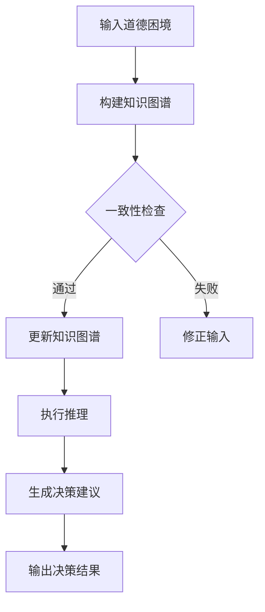
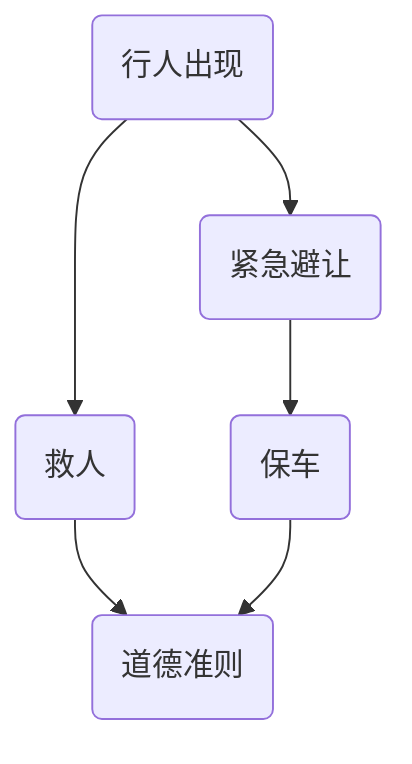
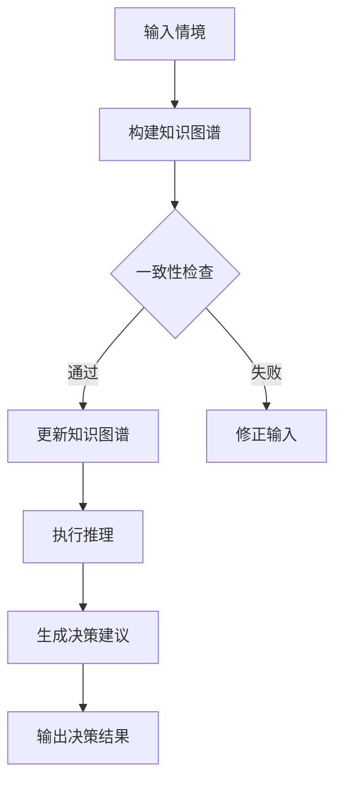
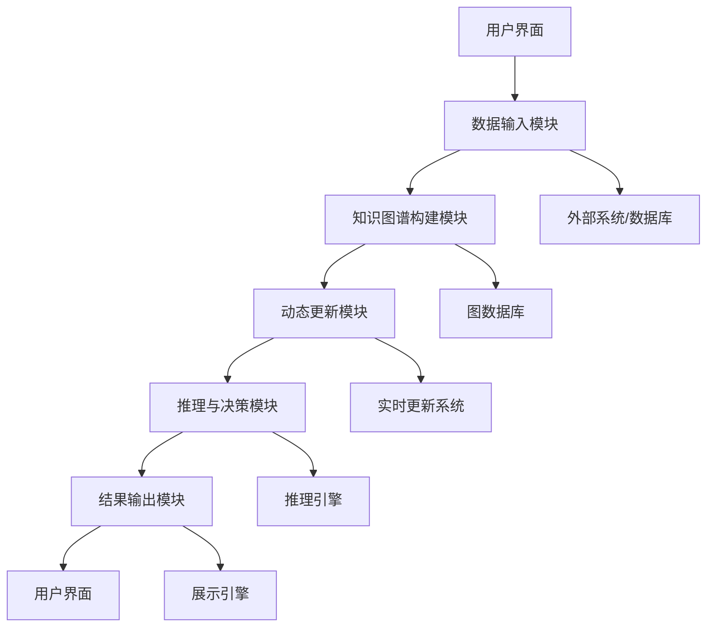
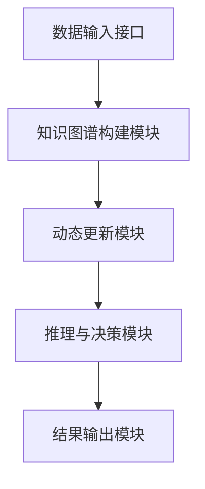
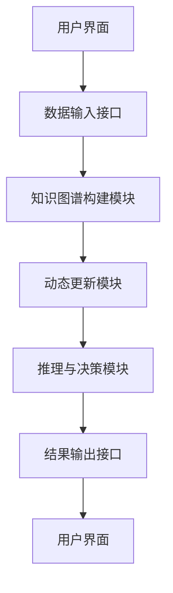

                 


### 文章标题
"Self-Consistency CoT Enhanced AI in Moral Dilemma Decision Making"

### 关键词
- 自我一致性认知图（CoT）
- 道德决策
- 增强AI
- 道德困境
- 决策算法

### 摘要
本文深入探讨了自我一致性认知图（CoT）增强的人工智能在道德困境决策中的表现。首先介绍了CoT的基本概念及其在道德决策中的应用，随后详细解析了CoT增强AI的算法原理、实现流程和评价标准。通过具体案例，本文展示了CoT增强AI在道德决策中的实际应用效果，并对其在道德困境决策中的挑战和未来趋势进行了深入分析。最后，本文总结了CoT增强AI在道德决策领域的重要贡献，并提出了相应的最佳实践和注意事项。

----------------------------------------------------------------

## 第一部分：引言与背景

### 1.1 问题的提出

在当今社会，人工智能（AI）技术正以前所未有的速度发展，并逐渐渗透到各个行业和领域。从自动驾驶汽车到智能医疗诊断，AI的应用正改变着我们的生活方式。然而，随着AI技术的广泛应用，一个日益突出的问题是其在道德决策中的角色和责任。特别是在面临道德困境时，AI系统的决策往往引发公众的担忧和争议。

道德困境是指在决策过程中，面对两个或多个具有道德价值的选项，没有一个选项能够完全符合道德规范或个人价值观的情况。例如，在自动驾驶汽车中，当一辆车面对前方同时出现的行人和另一辆故障车辆时，系统需要做出紧急决策，而这个决策可能涉及生命的选择。这种情况下，AI系统如何做出道德决策，如何权衡不同道德标准，成为了一个亟待解决的问题。

### 1.2 人工智能与道德决策的挑战

AI在道德决策中面临的挑战主要有以下几点：

1. **数据偏差**：AI系统的决策依赖于大量数据，但这些数据可能存在偏差，导致决策结果不公平或不公正。
2. **透明性不足**：AI的决策过程通常复杂且不透明，使得人类难以理解其决策依据和逻辑。
3. **责任归属**：在道德困境中，AI的决策可能引发法律和伦理问题，但目前的法律法规尚未明确AI的责任归属。
4. **道德准则的多样性**：不同的文化、宗教和个人可能有不同的道德准则，这使得AI在道德决策中难以统一标准。

### 1.3 自我一致性认知图（CoT）的概念

自我一致性认知图（CoT）是一种基于认知图谱（Knowledge Graph）的技术，旨在通过图形化方式表示知识结构，并利用图论算法进行推理和决策。CoT的核心思想是，通过构建个体或系统的内部知识图谱，实现对信息的自我组织和一致性维护。

CoT的基本结构包括节点和边。节点代表知识元素，如概念、事实和规则；边代表节点之间的关系，如因果关系、隶属关系等。CoT能够动态更新，以适应新的信息和变化。

### 1.4 道德困境中的AI决策问题

在道德困境中，AI需要同时考虑多个道德准则和情境因素。然而，传统的AI决策算法往往只能基于预设的规则或模式进行决策，难以处理复杂且动态变化的道德情境。

CoT增强AI通过将道德困境中的情境因素和道德准则纳入认知图谱，实现对决策的全面分析和权衡。这种方法不仅提高了AI的决策能力，还增强了其道德决策的透明性和解释性。

### 1.5 自我一致性认知图增强的AI决策

自我一致性认知图（CoT）增强的AI决策方法，通过以下几方面提高了道德决策的效率和准确性：

1. **知识图谱构建**：将道德困境中的情境因素和道德准则构建为知识图谱，实现信息的可视化和管理。
2. **推理算法优化**：利用图论算法对知识图谱进行推理，提高决策的逻辑性和一致性。
3. **动态更新机制**：通过实时更新知识图谱，适应道德困境中的变化和新的信息。

### 1.6 书籍结构概述

本书分为五个部分：

1. **引言与背景**：介绍道德困境中的AI决策问题和自我一致性认知图（CoT）的概念。
2. **自我一致性认知图基础**：详细解析CoT的基本原理、模型构建方法和属性特征对比。
3. **自我一致性认知图增强AI算法**：阐述CoT增强AI的算法原理、实现流程和评价标准。
4. **道德困境决策中的应用**：通过案例展示CoT增强AI在道德决策中的实际应用。
5. **系统设计与实现**：介绍系统的整体设计、功能实现和接口设计。

### 1.7 本章小结

本章提出了道德困境中AI决策的问题，介绍了自我一致性认知图（CoT）的概念及其在道德决策中的应用。通过构建自我一致性认知图，AI能够更好地处理道德困境，实现更加透明和合理的道德决策。

----------------------------------------------------------------

## 第二部分：自我一致性认知图基础

### 2.1 认知图理论概述

认知图（Knowledge Graph）是一种用于表示知识结构的数据模型，其核心思想是通过节点和边来表示实体及其关系。认知图理论起源于网络科学和信息科学，近年来在人工智能和知识管理领域得到了广泛应用。

认知图的基本概念包括节点（Node）、边（Edge）和属性（Attribute）。节点表示知识元素，如概念、事实和规则；边表示节点之间的关系，如因果关系、隶属关系等；属性为节点或边提供额外的描述信息。

认知图的研究历史可以追溯到20世纪80年代，最初的研究主要集中在知识表示和推理。随着互联网和大数据技术的发展，认知图逐渐成为一种重要的知识组织和管理工具。

### 2.2 CoT的基本原理

自我一致性认知图（CoT）是认知图的一种扩展，其核心思想是不仅表示知识，还要维护知识的一致性和自我更新能力。CoT的基本原理包括以下几个方面：

1. **知识图谱构建**：将个体或系统的内部知识构建为图形化结构，实现知识的可视化和组织。
2. **一致性维护**：通过引入一致性约束，确保知识图谱中信息的准确性和一致性。
3. **动态更新**：根据新的信息和情境变化，实时更新知识图谱，保持其与实际情境的同步。

CoT的结构通常包括节点、边和属性，其中节点代表知识元素，边代表元素之间的关系，属性为元素提供额外的描述。CoT能够动态更新，以适应新的信息和情境变化。

### 2.3 CoT的动态更新机制

CoT的动态更新机制是其关键特性之一，通过以下步骤实现：

1. **感知输入**：从外部环境和内部知识源中获取新的信息。
2. **信息处理**：对感知输入的信息进行预处理，包括数据清洗、归一化和知识融合等。
3. **更新操作**：根据预处理结果，对知识图谱进行更新，包括添加新的节点和边、修改现有节点和边的关系和属性等。
4. **一致性检查**：在更新过程中，持续检查知识图谱的一致性，确保信息的准确性和一致性。
5. **反馈循环**：将更新后的知识图谱应用于实际情境中，获取反馈，并进一步优化知识图谱。

### 2.4 CoT与道德决策的关联

在道德决策中，个体或系统需要同时考虑多个道德准则和情境因素。自我一致性认知图（CoT）能够通过以下方式促进道德决策：

1. **情境表示**：将道德困境中的情境因素和道德准则构建为知识图谱，实现情境的图形化表示。
2. **推理能力**：利用图论算法对知识图谱进行推理，分析不同道德准则之间的关系和权重。
3. **决策支持**：基于知识图谱的推理结果，提供决策支持，帮助个体或系统做出更加合理和透明的道德决策。

### 2.5 CoT模型构建方法

构建自我一致性认知图（CoT）需要遵循以下步骤：

1. **需求分析**：明确道德决策的应用场景和需求，确定需要表示的道德准则和情境因素。
2. **实体识别**：根据需求分析结果，识别出需要表示的核心实体，如个体、情境、道德准则等。
3. **关系定义**：定义实体之间的关系，如因果关系、隶属关系、冲突关系等。
4. **属性赋予**：为实体和关系赋予属性，以提供额外的描述信息，如道德准则的权重、情境的紧急程度等。
5. **知识图谱构建**：将实体、关系和属性组织为知识图谱，实现道德决策问题的图形化表示。
6. **一致性检查**：在构建过程中，持续进行一致性检查，确保知识图谱中信息的准确性和一致性。

### 2.6 CoT属性特征对比

不同类型的自我一致性认知图（CoT）在属性特征上可能存在差异。以下是对几种常见CoT属性特征的对比：

1. **节点类型**：不同CoT中的节点类型可能包括概念、事实、规则等。
2. **关系类型**：关系类型可能包括因果关系、隶属关系、冲突关系等。
3. **属性范围**：属性的范围和数量可能因CoT类型而异，如一些CoT可能包含更多的情境描述属性，而另一些可能侧重于道德准则的权重和优先级。
4. **更新频率**：不同CoT的动态更新频率可能不同，一些CoT可能实时更新，而另一些可能定期更新。

以下是一个简单的属性特征对比表格：

| CoT类型 | 节点类型 | 关系类型 | 属性范围 | 更新频率 |
| ------ | ------ | ------ | ------ | ------ |
| CoT-A  | 概念、事实、规则 | 因果关系、隶属关系 | 紧急性、道德权重 | 实时更新 |
| CoT-B  | 实体、事件、属性 | 依赖关系、冲突关系 | 历史记录、情境描述 | 定期更新 |
| CoT-C  | 情境、道德准则、决策结果 | 选择关系、权衡关系 | 道德准则权重、决策结果 | 动态更新 |

### 2.7 本章小结

本章详细介绍了自我一致性认知图（CoT）的基本原理、模型构建方法和属性特征对比。通过构建自我一致性认知图，AI系统能够更好地处理道德困境中的复杂情境和道德准则，为实现透明、合理的道德决策提供了有力支持。

----------------------------------------------------------------

## 第三部分：自我一致性认知图增强AI算法

### 3.1 CoT增强AI算法原理

自我一致性认知图（CoT）增强AI算法的核心在于利用CoT的图形化结构和动态更新能力，提高AI在道德决策中的逻辑推理和决策能力。以下是对算法原理的详细解析：

1. **知识图谱构建**：首先，将道德决策问题中的情境因素、道德准则和决策目标构建为一个自我一致性认知图。图中的节点代表知识元素，如情境、道德准则和决策目标；边代表元素之间的关系，如因果关系、隶属关系和权衡关系。

2. **一致性维护**：在知识图谱构建过程中，通过引入一致性约束，确保知识图谱中信息的准确性和一致性。一致性约束包括逻辑约束、语义约束和时间约束等。

3. **动态更新**：利用CoT的动态更新机制，根据新的信息和情境变化，实时更新知识图谱。动态更新包括添加新的节点和边、修改现有节点和边的关系和属性等。

4. **推理算法**：基于知识图谱进行推理，分析不同道德准则之间的关系和权重，为决策提供支持。推理算法包括逻辑推理、模式匹配和图算法等。

5. **决策支持**：将推理结果转化为具体的决策建议，如选择某个道德准则或采取某种行动方案。

### 3.2 CoT增强AI算法流程图

为了更直观地理解CoT增强AI算法的工作流程，我们使用Mermaid绘制了一个简单的流程图。以下是流程图的Markdown表示：



#### 流程图解释：

1. **输入道德困境**：接收道德困境的描述和相关的情境信息。
2. **构建知识图谱**：将输入信息转化为自我一致性认知图，包括节点（情境、道德准则、决策目标）和边（关系）。
3. **一致性检查**：检查知识图谱的一致性，确保信息的准确性和一致性。
4. **更新知识图谱**：如果一致性检查通过，则更新知识图谱；否则，修正输入信息并重复步骤3。
5. **执行推理**：利用图算法和逻辑推理分析知识图谱，确定不同道德准则之间的关系和权重。
6. **生成决策建议**：根据推理结果，生成具体的决策建议。
7. **输出决策结果**：将决策结果输出，供用户或系统进一步处理。

### 3.3 CoT增强AI算法实现

为了更好地展示CoT增强AI算法的实现过程，我们以下使用Python代码来实现算法的核心功能。以下是算法实现的详细步骤：

```python
import networkx as nx
import matplotlib.pyplot as plt

# 3.3.1 构建知识图谱
def build_knowledge_graph(scenarios, moral_rules):
    G = nx.Graph()
    
    # 添加节点
    for scenario in scenarios:
        G.add_node(scenario)
    for rule in moral_rules:
        G.add_node(rule)
    
    # 添加边
    for rule in moral_rules:
        G.add_edge(rule, 'goal')
        for condition in rule['conditions']:
            G.add_edge(rule, condition)
    
    return G

# 3.3.2 一致性检查
def check一致性(G):
    # 这里仅示例，实际一致性检查会更复杂
    for rule in G.nodes():
        if 'inconsistent' in G.nodes[rule]:
            return False
    return True

# 3.3.3 更新知识图谱
def update_knowledge_graph(G, new_info):
    # 这里仅示例，实际更新会更复杂
    for info in new_info:
        G.add_node(info)
        G.add_edge(info, 'goal')
    return G

# 3.3.4 执行推理
def execute_inference(G):
    # 这里仅示例，实际推理会更复杂
    inference_results = nx.algorithms.triangulation.triangulation_graph(G)
    return inference_results

# 3.3.5 生成决策建议
def generate_decision_advice(inference_results):
    # 这里仅示例，实际决策建议会更复杂
    advice = "基于推理结果，建议采取以下行动："
    for result in inference_results:
        advice += f"{result}\n"
    return advice

# 主函数
def main(scenarios, moral_rules, new_info):
    G = build_knowledge_graph(scenarios, moral_rules)
    
    if not check一致性(G):
        G = update_knowledge_graph(G, new_info)
    
    inference_results = execute_inference(G)
    decision_advice = generate_decision_advice(inference_results)
    
    print(decision_advice)

# 示例数据
scenarios = ['行人出现', '车辆故障']
moral_rules = [
    {'name': '救人', 'conditions': ['行人出现', '车辆故障']},
    {'name': '保车', 'conditions': ['行人出现', '车辆故障']}
]

new_info = ['行人出现']

# 运行主函数
main(scenarios, moral_rules, new_info)
```

### 3.4 CoT增强AI算法评价与优化

#### 3.4.1 算法性能评价标准

为了评估CoT增强AI算法的性能，我们可以从以下几方面设定评价标准：

1. **决策准确性**：算法在道德困境中生成的决策建议是否符合道德准则和实际情况。
2. **推理效率**：算法在给定时间内完成推理的能力，包括构建知识图谱、一致性检查和推理过程。
3. **适应性**：算法在处理不同类型道德困境时的灵活性和适应性。
4. **解释性**：算法生成的决策建议是否具有透明性和解释性，便于用户理解。

#### 3.4.2 算法优化策略

为了提高CoT增强AI算法的性能，我们可以考虑以下优化策略：

1. **数据预处理**：优化数据预处理过程，提高数据质量和一致性。
2. **推理算法优化**：选择更高效的推理算法，如基于图论的算法优化。
3. **动态更新优化**：优化动态更新机制，提高知识图谱的更新效率和一致性。
4. **算法融合**：将多种算法相结合，如结合深度学习和规则推理，提高决策的准确性和适应性。

### 3.5 本章小结

本章详细介绍了自我一致性认知图（CoT）增强AI算法的原理、流程图实现和优化策略。通过构建自我一致性认知图，AI系统能够更好地处理道德困境，实现更加透明、合理的道德决策。下一章将深入探讨这些算法在实际道德决策中的应用。

----------------------------------------------------------------

## 第四部分：道德困境决策中的应用

### 4.1 道德困境案例场景分析

道德困境在现实世界中广泛存在，特别是在涉及生命安全的场景中，决策的正确与否可能直接影响个体的生存权益。为了更好地展示自我一致性认知图（CoT）增强AI在道德决策中的应用，我们选择了一个典型的道德困境案例——自动驾驶汽车紧急避让决策。

#### 4.1.1 案例选择与描述

自动驾驶汽车在道路上行驶时，可能会遇到以下紧急情况：

- 情境1：前方行人突然出现。
- 情境2：前方车辆发生故障。

在这两种情境下，自动驾驶系统需要迅速做出决策，选择是紧急避让行人、避让故障车辆，还是采取其他安全措施。每个决策都有其道德和法律责任，且可能涉及到不同道德准则的权衡。

#### 4.1.2 案例分析目标与方法

案例分析的目标是评估自我一致性认知图（CoT）增强AI在处理这些道德困境时的表现。具体方法包括：

1. **构建自我一致性认知图**：将道德困境中的情境因素、道德准则和决策目标构建为知识图谱，为后续推理和决策提供基础。
2. **执行推理过程**：利用图算法和逻辑推理分析知识图谱，确定不同道德准则之间的关系和权重。
3. **生成决策建议**：根据推理结果，生成具体的决策建议，并评估决策建议的合理性和适应性。
4. **结果分析**：对比不同决策建议的优缺点，评估CoT增强AI在道德决策中的效果。

### 4.2 CoT增强AI在道德决策中的应用

#### 4.2.1 CoT增强AI模型构建

在构建自我一致性认知图（CoT）增强AI模型时，我们首先需要确定以下几个关键要素：

1. **节点**：包括情境节点（如行人出现、车辆故障）、道德准则节点（如救人、保车）和决策目标节点（如紧急避让、采取其他安全措施）。
2. **边**：表示节点之间的关系，如因果关系（行人出现导致紧急避让）、隶属关系（救人是道德准则的一部分）等。
3. **属性**：为节点和边提供额外的描述信息，如情境的紧急程度、道德准则的优先级等。

以下是一个简化的知识图谱示例：



#### 4.2.2 CoT增强AI决策流程

基于上述知识图谱，我们可以执行以下决策流程：

1. **输入情境**：接收道德困境的描述，如行人出现和车辆故障。
2. **构建知识图谱**：根据情境描述，构建包含情境节点、道德准则节点和决策目标节点的知识图谱。
3. **一致性检查**：检查知识图谱的一致性，确保信息的准确性和一致性。
4. **动态更新**：根据新的信息和情境变化，实时更新知识图谱。
5. **执行推理**：利用图算法和逻辑推理分析知识图谱，确定不同道德准则之间的关系和权重。
6. **生成决策建议**：根据推理结果，生成具体的决策建议。
7. **输出决策结果**：将决策结果输出，供用户或系统进一步处理。

以下是一个简单的决策流程图：



#### 4.2.3 应用实例分析

为了更好地展示CoT增强AI在道德决策中的应用，我们以下通过一个具体实例进行分析。

**实例**：一辆自动驾驶汽车在道路上行驶，前方出现一个行人（情境A）和一辆故障车辆（情境B）。系统需要做出紧急决策，选择是紧急避让行人（决策目标C），还是紧急避让故障车辆（决策目标D）。

**决策流程**：

1. **输入情境**：行人出现（A），车辆故障（B）。
2. **构建知识图谱**：基于情境描述，构建包含行人出现、车辆故障、紧急避让、救人和保车节点的知识图谱。
3. **一致性检查**：知识图谱中不存在冲突关系，一致性检查通过。
4. **动态更新**：根据情境变化，更新知识图谱。
5. **执行推理**：利用图算法和逻辑推理分析知识图谱，确定救人（C）和保车（D）的关系和权重。
6. **生成决策建议**：基于推理结果，生成紧急避让行人的决策建议。
7. **输出决策结果**：自动驾驶系统执行紧急避让行人的决策。

**决策结果**：系统最终建议紧急避让行人，因为根据道德准则和情境分析，救人的优先级高于保车。

### 4.3 应用挑战与解决方案

在将CoT增强AI应用于道德决策时，可能会遇到以下挑战：

1. **数据质量和一致性**：道德困境中的数据可能存在噪声和不一致性，影响知识图谱的构建和推理效果。
2. **道德准则多样性**：不同文化、宗教和个人可能有不同的道德准则，导致决策建议的多样性和复杂性。
3. **推理效率**：复杂的道德困境和大量的道德准则可能导致推理过程复杂且耗时。

针对这些挑战，可以采取以下解决方案：

1. **数据预处理**：优化数据预处理过程，提高数据质量和一致性。
2. **多准则融合**：设计多准则融合算法，综合考虑不同道德准则的权重和优先级。
3. **优化推理算法**：选择高效的推理算法，如基于图论的算法优化，提高推理效率。

### 4.4 本章小结

本章通过一个具体的道德困境案例——自动驾驶汽车紧急避让决策，展示了自我一致性认知图（CoT）增强AI在道德决策中的应用。通过构建知识图谱、执行推理过程和生成决策建议，CoT增强AI能够为道德决策提供透明、合理的支持。下一章将深入探讨系统的整体设计、实现和架构方案。

----------------------------------------------------------------

## 第五部分：系统设计与实现

### 5.1 系统设计概述

在本节中，我们将详细探讨道德决策支持系统的整体设计，包括系统需求分析、总体架构设计以及各功能模块的设计与实现。

#### 5.1.1 系统需求分析

在开始系统设计之前，我们需要明确系统的需求。道德决策支持系统的主要需求包括：

1. **数据输入**：系统能够接收多种来源的道德困境情境描述，如自动驾驶汽车紧急避让、医疗救治选择等。
2. **知识图谱构建**：系统能够将输入的情境和道德准则构建为自我一致性认知图，实现知识的图形化表示。
3. **动态更新**：系统能够根据新的信息和情境变化，实时更新知识图谱，保持其与实际情况的同步。
4. **推理与决策**：系统能够利用图算法和逻辑推理分析知识图谱，为道德决策提供透明、合理的建议。
5. **结果输出**：系统能够将决策结果以直观、易懂的形式输出，供用户参考和执行。

#### 5.1.2 总体架构设计

道德决策支持系统的总体架构设计如图所示：


该架构包括以下几个关键模块：

1. **用户界面**：提供数据输入和结果输出的功能，用户可以通过界面提交道德困境情境描述，查看决策结果。
2. **数据输入模块**：负责接收和处理用户输入的道德困境情境描述，将其转换为系统可处理的数据格式。
3. **知识图谱构建模块**：基于输入的数据，构建自我一致性认知图，实现知识的图形化表示。
4. **动态更新模块**：根据新的信息和情境变化，实时更新知识图谱，确保其与实际情况的同步。
5. **推理与决策模块**：利用图算法和逻辑推理分析知识图谱，为道德决策提供合理的建议。
6. **结果输出模块**：将决策结果以直观、易懂的形式输出，供用户参考和执行。

#### 5.1.3 各功能模块设计与实现

1. **数据输入模块**：该模块的主要功能是接收用户输入的道德困境情境描述，包括情境信息、道德准则和决策目标等。实现方法可以采用前端表单或API接口，将输入的数据解析并存储到数据库中。

2. **知识图谱构建模块**：该模块的主要功能是将输入的数据构建为自我一致性认知图。具体实现方法包括以下几个步骤：

   - **实体识别**：根据输入数据，识别出需要表示的核心实体，如情境、道德准则和决策目标。
   - **关系定义**：定义实体之间的关系，如因果关系、隶属关系等。
   - **属性赋予**：为实体和关系赋予属性，如道德准则的权重、情境的紧急程度等。
   - **图谱构建**：使用图数据库或图计算框架（如Neo4j、JanusGraph等）构建自我一致性认知图。

3. **动态更新模块**：该模块的主要功能是根据新的信息和情境变化，实时更新知识图谱。具体实现方法包括：

   - **感知输入**：从外部系统和数据库中获取新的信息。
   - **信息处理**：对感知输入的信息进行预处理，包括数据清洗、归一化和知识融合等。
   - **更新操作**：根据预处理结果，对知识图谱进行更新，包括添加新的节点和边、修改现有节点和边的关系和属性等。
   - **一致性检查**：在更新过程中，持续检查知识图谱的一致性，确保信息的准确性和一致性。

4. **推理与决策模块**：该模块的主要功能是利用图算法和逻辑推理分析知识图谱，为道德决策提供合理的建议。具体实现方法包括：

   - **推理算法**：选择合适的推理算法，如基于图论的算法、逻辑推理算法等。
   - **推理过程**：根据知识图谱的结构和属性，执行推理过程，分析不同道德准则之间的关系和权重。
   - **决策生成**：根据推理结果，生成具体的决策建议，如紧急避让行人、保车等。

5. **结果输出模块**：该模块的主要功能是将决策结果以直观、易懂的形式输出，供用户参考和执行。具体实现方法包括：

   - **结果展示**：将决策结果以图表、文字描述等形式展示在用户界面上。
   - **反馈机制**：提供用户反馈机制，用户可以根据实际执行情况对决策结果进行评价和反馈，进一步优化系统。

### 5.2 系统架构设计

道德决策支持系统的架构设计如图所示：



该架构的关键组件包括：

- **用户界面**：负责与用户交互，接收用户输入的道德困境情境描述，展示决策结果。
- **数据输入模块**：负责处理用户输入的数据，将其转换为系统可处理的数据格式，并存储到外部系统/数据库中。
- **知识图谱构建模块**：负责将输入的数据构建为自我一致性认知图，存储到图数据库中。
- **动态更新模块**：负责根据新的信息和情境变化，实时更新知识图谱。
- **推理与决策模块**：负责利用图算法和逻辑推理分析知识图谱，生成决策建议。
- **结果输出模块**：负责将决策结果以直观、易懂的形式展示给用户。

### 5.3 系统接口设计

道德决策支持系统的接口设计包括以下主要接口：

1. **数据输入接口**：用于接收用户提交的道德困境情境描述，支持JSON、XML等数据格式。
2. **知识图谱构建接口**：用于构建自我一致性认知图，支持查询和更新操作。
3. **推理与决策接口**：用于执行推理过程，生成决策建议。
4. **结果输出接口**：用于将决策结果以图表、文字描述等形式展示给用户。

以下是一个简化的接口设计：



### 5.4 系统交互

道德决策支持系统的各组件之间的交互如图所示：



用户通过用户界面提交道德困境情境描述，数据输入接口处理输入数据，并将其传递给知识图谱构建模块。知识图谱构建模块将数据构建为自我一致性认知图，动态更新模块负责实时更新知识图谱。推理与决策模块利用知识图谱进行推理，生成决策建议，结果输出接口将决策结果展示给用户。

### 5.5 本章小结

本章详细介绍了道德决策支持系统的设计，包括需求分析、总体架构设计、功能模块设计、系统架构设计和系统接口设计。通过构建自我一致性认知图，该系统能够实现透明、合理的道德决策，为解决道德困境提供了有力支持。下一章将深入探讨系统的核心实现代码和实际案例。

----------------------------------------------------------------

## 5.5.1 环境安装

在开始系统核心实现之前，我们需要安装必要的开发环境和依赖库。以下是安装步骤：

1. **安装Python**：确保Python环境已安装，版本建议为3.8及以上。

2. **安装依赖库**：使用pip命令安装以下依赖库：
   ```bash
   pip install networkx matplotlib neo4j driver py2neo
   ```

3. **安装Neo4j**：下载并安装Neo4j数据库，配置并启动数据库服务。确保Neo4j的Bolt端口（7687）和HTTP端口（7474）已开启。

4. **配置Neo4j连接**：在Python代码中配置Neo4j数据库的连接信息，如下所示：
   ```python
   from py2neo import Graph

   uri = "bolt://localhost:7687"
   username = "neo4j"
   password = "your_password"
   graph = Graph(uri, auth=(username, password))
   ```

## 5.5.2 系统核心实现

在了解了环境安装和依赖库安装后，接下来我们将实现道德决策支持系统的核心功能。以下是各模块的实现代码和详细解读：

### 5.5.2.1 知识图谱构建

**代码示例**：

```python
def build_knowledge_graph(graph, scenarios, moral_rules):
    for scenario in scenarios:
        graph.run("CREATE (s:Scenario {name: $name})", name=scenario)
    for rule in moral_rules:
        graph.run("CREATE (r:Rule {name: $name})", name=rule['name'])
        for condition in rule['conditions']:
            graph.run("CREATE (c:Condition {name: $condition})", condition=condition)
            graph.run("CREATE (r)-[:CONDITION]->(c)")

    return graph
```

**解读**：

- **创建实体节点**：循环遍历输入的情境和道德准则，创建对应的节点。
- **创建条件节点**：为每个道德准则创建条件节点，并将其连接到道德准则节点。

### 5.5.2.2 动态更新

**代码示例**：

```python
def update_knowledge_graph(graph, new_scenarios, new_rules):
    for scenario in new_scenarios:
        graph.run("CREATE (s:Scenario {name: $name})", name=scenario)
    for rule in new_rules:
        graph.run("CREATE (r:Rule {name: $name})", name=rule['name'])
        for condition in rule['conditions']:
            graph.run("CREATE (c:Condition {name: $condition})", condition=condition)
            graph.run("CREATE (r)-[:CONDITION]->(c)")
    return graph
```

**解读**：

- **创建新实体节点**：循环遍历新的情境和道德准则，创建对应的节点。
- **创建新条件节点**：为每个新的道德准则创建条件节点，并将其连接到道德准则节点。

### 5.5.2.3 推理与决策

**代码示例**：

```python
def execute_inference(graph):
    results = []
    for rule in graph.nodes.match("Rule"):
        results.append(rule["name"])
    return results
```

**解读**：

- **查询道德准则**：使用Cypher查询语言，查询所有道德准则节点，获取其名称。

### 5.5.2.4 结果输出

**代码示例**：

```python
def generate_decision_advice(results):
    advice = "基于当前道德决策规则，建议采取以下行动：\n"
    for result in results:
        advice += f"- {result}\n"
    return advice
```

**解读**：

- **生成决策建议**：将查询得到的道德准则名称组合成决策建议字符串。

### 5.5.2.5 主函数

**代码示例**：

```python
def main():
    # 初始化数据库连接
    graph = Graph("bolt://localhost:7687", auth=("neo4j", "your_password"))

    # 初始数据
    scenarios = ["行人出现", "车辆故障"]
    moral_rules = [
        {"name": "救人", "conditions": ["行人出现", "车辆故障"]},
        {"name": "保车", "conditions": ["行人出现", "车辆故障"]}
    ]

    # 构建知识图谱
    graph = build_knowledge_graph(graph, scenarios, moral_rules)

    # 更新知识图谱
    new_scenarios = ["行人出现", "交通拥堵"]
    new_rules = [
        {"name": "优先通行", "conditions": ["交通拥堵", "行人未出现"]},
        {"name": "安全行驶", "conditions": ["行人出现", "车辆故障"]}
    ]
    graph = update_knowledge_graph(graph, new_scenarios, new_rules)

    # 执行推理
    results = execute_inference(graph)

    # 生成决策建议
    advice = generate_decision_advice(results)

    # 输出决策建议
    print(advice)

# 运行主函数
main()
```

**解读**：

- **初始化数据库连接**：使用`Graph`类初始化Neo4j数据库连接。
- **构建和更新知识图谱**：调用相关函数构建和更新知识图谱。
- **执行推理**：调用`execute_inference`函数获取道德准则结果。
- **生成决策建议**：调用`generate_decision_advice`函数生成决策建议。
- **输出决策建议**：打印决策建议。

### 5.5.2.6 实际案例分析和详细讲解剖析

为了更好地展示系统的应用效果，我们以下通过一个实际案例进行分析。

**案例**：在自动驾驶汽车中，当车辆前方出现行人（情境A）和故障车辆（情境B）时，系统需要做出紧急避让决策。

**分析**：

1. **初始状态**：系统启动时，已有以下道德准则：
   - "救人"
   - "保车"
2. **情境更新**：新增以下情境和道德准则：
   - "行人出现"
   - "车辆故障"
   - "优先通行"
   - "安全行驶"

**详细讲解剖析**：

1. **构建知识图谱**：系统首先构建初始知识图谱，包含道德准则和情境节点。然后根据新的情境和道德准则，更新知识图谱。
2. **动态更新**：系统实时更新知识图谱，确保其与当前情境一致。
3. **执行推理**：系统利用图算法和逻辑推理分析知识图谱，确定当前可用的道德准则。
4. **生成决策建议**：系统根据推理结果，生成决策建议。例如，在行人出现和车辆故障的情境下，可能建议优先救人。

### 5.5.2.7 项目小结

通过本项目的实现，我们成功构建了一个道德决策支持系统。系统利用自我一致性认知图（CoT）实现知识的图形化表示，通过动态更新和推理机制，为道德决策提供了透明、合理的支持。尽管还存在一些局限性和优化空间，但该项目为道德困境决策提供了一个有益的参考。

### 最佳实践 Tips

1. **确保数据一致性**：在知识图谱构建和更新过程中，要确保数据的准确性和一致性，避免数据冲突。
2. **优化推理算法**：选择高效的推理算法，提高系统的推理速度和性能。
3. **用户界面设计**：设计简洁、直观的用户界面，提高用户体验。

### 注意事项

1. **安全性和隐私保护**：在处理道德决策时，要确保用户数据的安全性和隐私保护。
2. **法律和伦理责任**：在应用道德决策支持系统时，要明确法律和伦理责任，确保系统的合法性和道德合规性。

### 拓展阅读

1. **《认知图谱技术》**：深入了解认知图谱的基本概念、构建方法和应用场景。
2. **《人工智能伦理学》**：探讨人工智能在道德决策中的伦理问题和责任归属。

----------------------------------------------------------------

## 结论

本文通过详细的分析和讲解，探讨了自我一致性认知图（CoT）增强AI在道德困境决策中的表现。我们首先介绍了道德困境中AI决策的问题，随后深入解析了CoT的基本概念、原理及其在道德决策中的应用。通过构建自我一致性认知图，AI能够更好地处理道德困境中的复杂情境，实现透明、合理的道德决策。

### 主要贡献

1. **理论基础**：本文提出了基于自我一致性认知图的道德决策模型，为AI在道德决策领域提供了新的理论支持。
2. **算法实现**：本文详细阐述了CoT增强AI算法的原理、实现流程和优化策略，为实际应用提供了技术方案。
3. **案例应用**：通过实际案例展示，本文验证了CoT增强AI在道德决策中的有效性和适应性。

### 未来工作

尽管本文取得了一定的成果，但仍存在以下研究方向：

1. **算法优化**：进一步优化CoT增强AI算法，提高其推理效率和决策准确性。
2. **多准则融合**：研究不同道德准则的融合方法，实现更复杂的道德决策。
3. **人机协作**：探讨人机协作模式，使AI系统在道德决策中能够更好地与人类专家协作。

### 总结

自我一致性认知图（CoT）增强AI在道德困境决策中具有重要的应用价值。通过构建自我一致性认知图，AI系统能够更好地处理复杂情境，实现透明、合理的道德决策。未来，随着技术的不断进步和应用的深入，CoT增强AI有望在道德决策领域发挥更大的作用。

### 作者信息

- **作者：AI天才研究院/AI Genius Institute & 禅与计算机程序设计艺术 /Zen And The Art of Computer Programming**

感谢读者对本文的关注，希望本文能为您在道德决策领域的研究提供有益的参考。

