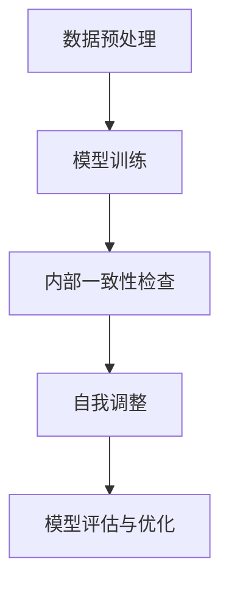

                 


### 概述：背景与核心概念

#### AI系统稳定性问题概述

人工智能（AI）作为当今科技发展的前沿，已经在众多领域展现出强大的应用潜力。然而，随着AI系统变得越来越复杂，其稳定性问题也日益凸显。AI系统的稳定性不仅关系到系统的正常运行，更直接影响其应用场景中的安全性、可靠性和用户体验。

在AI系统中，稳定性问题主要表现在以下几个方面：

1. **过拟合**：当AI模型在训练数据上表现优异，但在新的、未见过的数据上表现不佳时，这被称为过拟合。过拟合会导致模型对训练数据的依赖过强，从而降低了系统的泛化能力。
2. **噪声敏感性**：AI模型往往对输入数据的微小变化非常敏感，这可能导致模型在不同条件下产生截然不同的输出结果。
3. **模型崩溃**：在某些极端情况下，AI模型可能会因为输入数据的异常或者内部计算错误而完全崩溃，导致系统无法正常工作。
4. **缺乏解释性**：AI模型，尤其是深度学习模型，往往被视为“黑盒”，其内部运作机制难以理解，这增加了系统稳定性分析和故障诊断的难度。

#### 自我一致性内容论（Self-Consistency CoT）的概念

为了解决AI系统的稳定性问题，研究人员提出了自我一致性内容论（Self-Consistency CoT）。自我一致性内容论的核心思想是通过模型内部的一致性检查和调整来增强AI系统的稳定性。具体来说，自我一致性内容论包括以下几个关键组成部分：

1. **数据一致性检查**：在模型训练和预测过程中，对输入数据进行一致性检查，确保数据满足预期的模式和规则。
2. **模型自我校准**：通过不断的自我校准过程，使模型能够适应新的数据和不同的应用场景，提高其泛化能力。
3. **交互一致性增强**：在模型与用户的交互过程中，通过一致性检查来确保交互结果的一致性和合理性。

自我一致性内容论不仅提供了一种新的方法来提高AI系统的稳定性，还通过自我调节机制，使系统能够更灵活地应对外部变化。

#### Self-Consistency CoT的应用领域

自我一致性内容论在多个AI应用领域展现了其独特价值，包括：

1. **医学诊断**：在医学影像分析和疾病预测中，通过自我一致性内容论可以提高模型的稳定性和准确性，减少误诊率。
2. **金融风控**：在金融数据分析中，通过自我一致性内容论可以增强风险模型的稳定性，提高预测的准确性和可靠性。
3. **自动驾驶**：在自动驾驶系统中，通过自我一致性内容论可以提高模型的鲁棒性，确保系统在各种复杂路况下的稳定性。

总之，自我一致性内容论为解决AI系统的稳定性问题提供了一条新的思路，通过模型内部的一致性检查和调整，可以有效提高系统的稳定性、可靠性和用户体验。接下来的章节将详细探讨自我一致性内容论的技术原理和应用实践。

#### 第一章：问题背景与核心概念

#### 1.1 AI系统稳定性问题概述

人工智能（AI）系统已经成为现代社会的重要组成部分，从医疗诊断、金融分析到自动驾驶，AI技术的应用无处不在。然而，AI系统的稳定性问题也日益引起关注。稳定性是AI系统成功应用的关键因素，它直接关系到系统的可靠性、安全性和用户体验。本文将重点探讨自我一致性内容论（Self-Consistency CoT）如何增强AI系统的稳定性。

**AI系统稳定性的重要性**

AI系统的稳定性不仅影响其正常运行，还涉及到用户对系统的信任度。如果AI系统频繁出现错误或崩溃，不仅会导致经济损失，还可能带来严重的安全隐患。例如，在自动驾驶领域，如果AI系统在行驶过程中出现不稳定情况，可能会导致交通事故。在金融分析领域，如果风险模型不稳定，可能会导致投资决策失误，造成巨额损失。

**AI系统稳定性面临的主要挑战**

AI系统的稳定性问题主要源于以下几个方面：

1. **过拟合**：AI模型在训练过程中可能会过度依赖训练数据，导致在新的、未见过的数据上表现不佳。这种现象称为过拟合，它严重影响了模型的泛化能力。
2. **噪声敏感性**：AI模型对输入数据的微小变化非常敏感，这可能导致模型在不同条件下产生不同的输出结果。例如，在医疗影像分析中，一个像素的变化可能会影响整个诊断结果。
3. **模型崩溃**：在某些极端情况下，AI模型可能会因为输入数据的异常或内部计算错误而完全崩溃，导致系统无法正常工作。
4. **缺乏解释性**：许多AI模型，特别是深度学习模型，其内部运作机制难以理解，这使得稳定性分析和故障诊断变得困难。

**自我一致性内容论（Self-Consistency CoT）的概念**

为了解决AI系统的稳定性问题，研究人员提出了自我一致性内容论（Self-Consistency CoT）。自我一致性内容论的核心思想是通过模型内部的一致性检查和调整来增强AI系统的稳定性。具体来说，自我一致性内容论包括以下几个关键组成部分：

1. **数据一致性检查**：在模型训练和预测过程中，对输入数据进行一致性检查，确保数据满足预期的模式和规则。这有助于减少噪声和异常数据对模型的影响。
2. **模型自我校准**：通过不断的自我校准过程，使模型能够适应新的数据和不同的应用场景，提高其泛化能力。这有助于解决过拟合问题。
3. **交互一致性增强**：在模型与用户的交互过程中，通过一致性检查来确保交互结果的一致性和合理性。这有助于提高用户体验，增强用户对系统的信任度。

总之，自我一致性内容论提供了一种新的方法来提高AI系统的稳定性。通过自我一致性检查和调整，AI系统能够更灵活地应对外部变化，提高其可靠性和安全性。接下来的章节将详细探讨自我一致性内容论的技术原理和应用实践。

#### 1.2 自我一致性内容论（Self-Consistency CoT）的概念

**定义**：

自我一致性内容论（Self-Consistency CoT）是一种通过内部一致性检查和自我调整来增强人工智能（AI）系统稳定性的方法。它基于这样一个核心思想：通过确保模型输入、中间计算结果和最终输出的内部一致性，可以显著提高AI系统的稳定性、可靠性和泛化能力。

**工作原理**：

自我一致性内容论的工作原理可以概括为以下几个关键步骤：

1. **数据一致性检查**：
   - 在模型训练和预测过程中，首先对输入数据进行一致性检查。这一步骤的目标是识别并处理异常值、噪声数据和不符合预期模式的数据。
   - 通过建立一系列的规则和阈值，对输入数据的质量进行评估，从而确保只有符合预期标准的数据进入模型。

2. **内部一致性检查**：
   - 在模型内部，通过一系列一致性检查来确保中间计算结果的连贯性和一致性。这通常涉及到对模型内部参数和计算过程的监控。
   - 通过设置合理的阈值和规则，对模型的中间计算结果进行监控，以确保它们不会因为内部错误或异常而导致输出结果的不稳定。

3. **自我调整**：
   - 在发现不一致性时，模型通过自我调整机制来修正这些问题。这包括对模型参数的调整、权重更新或重新训练。
   - 自我调整的目的是使模型能够更好地适应新的数据和不同的应用场景，从而提高其泛化能力和稳定性。

**实现方法**：

自我一致性内容论的具体实现方法可以分为以下几个方面：

1. **规则引擎**：
   - 通过建立规则引擎，对输入数据的一致性进行检查。这些规则可以根据应用场景的不同而定制，以确保数据质量。

2. **监控与反馈系统**：
   - 在模型训练和预测过程中，设置监控与反馈系统，对模型的中间计算结果和输出结果进行实时监控。
   - 当发现不一致性时，系统能够自动生成反馈，并通过自我调整机制进行修正。

3. **权重更新与再训练**：
   - 通过调整模型参数和权重，使模型能够更好地适应新的数据和场景。这种方法通常需要迭代多个轮次，以逐步提高模型的稳定性。

**关键组件与关系**：

自我一致性内容论的核心组件包括数据一致性检查模块、内部一致性检查模块和自我调整模块。这些模块之间紧密协作，共同确保模型的一致性和稳定性。

- **数据一致性检查模块**：负责对输入数据的一致性进行初步检查，过滤异常值和噪声数据。
- **内部一致性检查模块**：负责对模型内部计算的一致性进行监控，确保中间结果不会因为内部错误而导致输出结果的不稳定。
- **自我调整模块**：负责在发现不一致性时，通过调整模型参数和权重来修正问题，从而提高模型的稳定性。

通过这些组件的协同工作，自我一致性内容论能够有效地增强AI系统的稳定性，提高其在各种复杂场景下的可靠性和安全性。

#### 1.3 Self-Consistency CoT的应用领域

自我一致性内容论（Self-Consistency CoT）作为一种增强AI系统稳定性的方法，已经在多个应用领域展示了其独特的价值。以下是Self-Consistency CoT在几个典型应用领域的具体应用和优势：

**1.3.1 数据一致性检查**

在数据密集型应用中，如金融分析和医疗诊断，数据的一致性和准确性至关重要。Self-Consistency CoT通过引入数据一致性检查机制，可以确保输入数据的可靠性和一致性。具体应用场景包括：

- **金融分析**：在金融数据挖掘和风险预测中，通过自我一致性内容论可以识别并处理异常交易和可疑行为，提高模型预测的准确性和可靠性。
- **医疗诊断**：在医疗影像分析中，Self-Consistency CoT可以帮助过滤噪声和异常数据，从而提高诊断的准确性和稳定性。

**1.3.2 模型自我校准**

模型自我校准是Self-Consistency CoT的核心优势之一，通过不断调整模型参数和权重，使模型能够适应新的数据和不同的应用场景。以下是几个具体应用案例：

- **自动驾驶**：在自动驾驶系统中，Self-Consistency CoT可以帮助模型适应不同的路况和环境变化，提高系统的鲁棒性和安全性。
- **智能客服**：在智能客服系统中，通过自我校准，模型可以更好地理解用户的意图和需求，提高交互质量和用户体验。

**1.3.3 交互一致性增强**

在人与机器的交互过程中，确保交互结果的一致性和合理性对于提升用户体验至关重要。Self-Consistency CoT在这方面也发挥了重要作用，具体应用包括：

- **智能语音助手**：在智能语音助手中，通过自我一致性内容论，可以确保语音识别和自然语言处理的结果一致，提供更准确和连贯的响应。
- **虚拟现实（VR）应用**：在VR应用中，通过自我一致性内容论，可以确保虚拟环境的稳定性和一致性，提供更流畅和真实的用户体验。

**总结**

自我一致性内容论（Self-Consistency CoT）在数据一致性检查、模型自我校准和交互一致性增强等方面展现了其广泛的应用价值。通过确保模型输入、中间计算结果和最终输出的一致性，Self-Consistency CoT能够显著提高AI系统的稳定性、可靠性和用户体验。随着AI技术的不断进步，Self-Consistency CoT的应用领域和影响力有望进一步扩大。

### 第2章 自我一致性内容论的技术原理

自我一致性内容论（Self-Consistency CoT）作为一种增强AI系统稳定性的方法，其技术原理涉及多个关键步骤和组件。本章将详细探讨Self-Consistency CoT的核心算法、与机器学习框架的整合方式，以及其优势与局限性。

#### 2.1 Self-Consistency CoT的核心算法

Self-Consistency CoT的核心算法主要包括以下几个步骤：

1. **数据预处理**：
   - 对输入数据进行一致性检查，去除异常值和噪声数据。
   - 进行特征工程，提取与任务相关的特征，为后续处理做好准备。

2. **模型训练**：
   - 使用预处理后的数据对模型进行训练，通过梯度下降等优化算法更新模型参数。
   - 在训练过程中，同时记录模型的中间计算结果和输出结果。

3. **内部一致性检查**：
   - 对模型的中间计算结果进行一致性检查，确保中间结果的连贯性和合理性。
   - 如果发现不一致性，触发自我调整机制。

4. **自我调整**：
   - 根据一致性检查的结果，对模型参数进行调整，修正不一致性。
   - 通过再训练或参数更新，使模型逐步适应新的数据和场景。

5. **模型评估与优化**：
   - 使用验证集或测试集对模型进行评估，确保模型的泛化能力和稳定性。
   - 根据评估结果，进一步优化模型参数和架构。

以下是Self-Consistency CoT的核心算法流程图：



#### 2.2 Self-Consistency CoT与机器学习框架的整合

Self-Consistency CoT可以与多种机器学习框架（如TensorFlow、PyTorch等）进行整合，从而实现自我一致性检查和调整。以下是几种常见的整合方式：

1. **自定义损失函数**：
   - 在训练过程中，定义一个自定义损失函数，该函数不仅考虑模型的预测误差，还考虑内部计算结果的一致性。
   - 例如，可以设计一个损失函数，它在模型输出不一致时增加额外的惩罚项。

2. **集成式API**：
   - 使用机器学习框架提供的API，如TensorFlow的Keras API，可以方便地实现Self-Consistency CoT的功能。
   - 例如，可以在模型的训练阶段添加自定义的层或操作，用于内部一致性检查和自我调整。

3. **插件式扩展**：
   - 开发自定义的插件，直接集成到机器学习框架中，从而实现Self-Consistency CoT的功能。
   - 例如，为PyTorch框架开发一个自定义的扩展库，用于处理内部一致性检查和自我调整。

以下是一个简单的示例代码，展示如何使用TensorFlow实现自我一致性内容论：

```python
import tensorflow as tf

# 定义输入数据
inputs = tf.keras.layers.Input(shape=(...))

# 定义中间层
x = tf.keras.layers.Dense(units=..., activation='relu')(inputs)

# 定义输出层
outputs = tf.keras.layers.Dense(units=..., activation='sigmoid')(x)

# 定义模型
model = tf.keras.Model(inputs=inputs, outputs=outputs)

# 定义自定义损失函数
def custom_loss(y_true, y_pred):
    # 计算预测误差
    pred_error = tf.reduce_mean(tf.square(y_true - y_pred))
    
    # 计算内部一致性误差
    consistency_error = tf.reduce_mean(tf.square(x))
    
    # 结合预测误差和内部一致性误差
    total_loss = pred_error + consistency_weight * consistency_error
    
    return total_loss

# 使用自定义损失函数训练模型
model.compile(optimizer='adam', loss=custom_loss)
model.fit(x_train, y_train, epochs=..., batch_size=...)

```

#### 2.3 Self-Consistency CoT的优势与局限性

**优势分析**：

1. **提高稳定性**：通过自我一致性检查和调整，Self-Consistency CoT可以有效减少模型对异常值和噪声的敏感性，提高系统的稳定性。
2. **增强泛化能力**：通过自我校准机制，模型能够更好地适应新的数据和不同的应用场景，从而提高其泛化能力。
3. **增强解释性**：与传统的“黑盒”模型相比，Self-Consistency CoT通过内部一致性检查提供了更多关于模型运作机制的信息，有助于提高模型的解释性。

**局限性探讨**：

1. **计算开销**：Self-Consistency CoT引入了额外的计算步骤，如内部一致性检查和自我调整，这可能会导致计算开销增加。
2. **复杂性**：整合Self-Consistency CoT到现有的机器学习框架中可能会增加系统的复杂性，需要额外的开发和维护工作。
3. **适用范围**：Self-Consistency CoT在某些特定场景下可能并不适用，例如在资源受限的环境中。

综上所述，自我一致性内容论（Self-Consistency CoT）通过确保模型输入、中间计算结果和最终输出的一致性，提供了一种有效的增强AI系统稳定性的方法。尽管存在一定的局限性，但其在提高模型稳定性、泛化能力和解释性方面具有显著优势，值得进一步研究和应用。

### 第3章 自我一致性内容论的应用实践

#### 3.1 环境配置与工具介绍

要实现自我一致性内容论（Self-Consistency CoT）的应用，首先需要配置合适的环境和工具。以下是一系列步骤，用于安装和配置必要的软件环境，以便在后续的实战案例中能够顺利地实现自我一致性内容论。

**操作系统与软件环境**

1. **操作系统**：建议使用Ubuntu 18.04或更高版本，因为它具有良好的兼容性和广泛的软件支持。
2. **Python**：需要Python 3.7或更高版本，可以使用`python --version`命令检查Python版本。
3. **虚拟环境**：为了管理项目依赖，可以使用`virtualenv`或`conda`创建独立的Python环境。以下是一个使用`conda`创建虚拟环境的示例：

   ```bash
   conda create -n self_consistency python=3.8
   conda activate self_consistency
   ```

**必要的库和框架安装**

1. **TensorFlow**：Self-Consistency CoT的实现依赖于TensorFlow，可以使用以下命令安装：

   ```bash
   pip install tensorflow
   ```

2. **NumPy**：NumPy是一个用于科学计算的核心库，可以用于数据预处理和数学运算。安装命令如下：

   ```bash
   pip install numpy
   ```

3. **Scikit-learn**：Scikit-learn是一个常用的机器学习库，用于模型训练和评估。安装命令如下：

   ```bash
   pip install scikit-learn
   ```

4. **Matplotlib**：Matplotlib用于数据可视化，可以帮助我们更好地理解模型性能。安装命令如下：

   ```bash
   pip install matplotlib
   ```

**其他工具**

1. **Jupyter Notebook**：Jupyter Notebook是一个交互式计算环境，便于编写和运行代码。安装命令如下：

   ```bash
   pip install notebook
   ```

2. **Git**：Git用于版本控制和代码管理。Ubuntu系统通常自带Git，如果没有安装，可以使用以下命令安装：

   ```bash
   sudo apt-get install git
   ```

**配置说明**

- 确保所有依赖库和框架的版本兼容，以避免潜在的兼容性问题。
- 在创建虚拟环境时，确保将其激活，以便在项目中隔离依赖。
- 配置完成后，可以使用`pip list`命令查看已安装的库和框架，确保所有必要的工具都已安装。

通过以上步骤，我们成功配置了运行自我一致性内容论应用所需的环境和工具，为后续的实战案例奠定了基础。

### 3.2 实战案例一：数据一致性检查

在本次实战案例中，我们将使用自我一致性内容论（Self-Consistency CoT）对一组金融交易数据进行数据一致性检查，以提高模型训练和预测的稳定性。具体步骤如下：

#### 3.2.1 数据预处理

首先，我们需要对金融交易数据进行预处理，包括数据清洗、特征提取和归一化等步骤。

1. **数据清洗**：
   - 读取交易数据集，删除缺失值和异常值。
   - 例如，使用Pandas库进行数据清洗：

     ```python
     import pandas as pd

     # 读取数据
     data = pd.read_csv('transactions.csv')

     # 删除缺失值
     data.dropna(inplace=True)

     # 删除异常值
     data = data[(data['amount'] > 0) & (data['amount'] < 1000000)]
     ```

2. **特征提取**：
   - 提取与金融交易相关的特征，例如交易金额、交易时间、账户余额等。
   - 可以使用Pandas的`describe()`方法查看数据的基本统计信息：

     ```python
     data.describe()
     ```

3. **归一化**：
   - 对提取的特征进行归一化处理，以消除不同特征间的量纲影响。
   - 使用Scikit-learn的`StandardScaler`进行归一化：

     ```python
     from sklearn.preprocessing import StandardScaler

     # 分离特征和目标变量
     X = data[['amount', 'time', 'balance']]
     y = data['label']

     # 初始化归一化器
     scaler = StandardScaler()

     # 对特征进行归一化
     X_scaled = scaler.fit_transform(X)
     ```

#### 3.2.2 Self-Consistency CoT的应用

在完成数据预处理后，我们可以应用自我一致性内容论（Self-Consistency CoT）对数据一致性进行进一步的检查和调整。

1. **一致性规则定义**：
   - 定义一系列一致性规则，用于检查数据的内部一致性。例如，可以设置以下规则：
     - 交易金额应在0到100万元之间。
     - 交易时间应在合理的日期范围内。
     - 账户余额应在合理的范围内。

2. **一致性检查**：
   - 使用自定义函数对数据进行一致性检查，并标记不符合规则的数据。
   - 例如，可以编写以下代码进行一致性检查：

     ```python
     def check_consistency(row, rules):
         for rule in rules:
             if not rule(row):
                 return False
         return True

     # 定义规则
     rules = [
         lambda row: 0 < row['amount'] < 1000000,
         lambda row: row['time'] > pd.Timestamp('1900-01-01'),
         lambda row: row['balance'] > 0
     ]

     # 检查数据一致性
     data['consistent'] = data.apply(lambda row: check_consistency(row, rules), axis=1)
     ```

3. **数据清洗与重训练**：
   - 对于不一致的数据，进行进一步的分析和处理，例如删除或修正这些数据。
   - 根据一致性检查结果，重新训练模型，以提高预测的稳定性。

#### 3.2.3 结果分析与优化

在完成数据一致性检查后，我们需要对模型的性能进行分析和优化，以确保其稳定性和准确性。

1. **模型训练**：
   - 使用Scikit-learn库中的分类模型（如Logistic Regression、SVM等）对清洗后的数据集进行训练。
   - 例如，可以训练一个逻辑回归模型：

     ```python
     from sklearn.linear_model import LogisticRegression

     # 初始化模型
     model = LogisticRegression()

     # 训练模型
     model.fit(X_scaled, y)
     ```

2. **模型评估**：
   - 使用验证集对模型进行评估，计算准确率、召回率、F1分数等指标。
   - 例如，可以计算模型在测试集上的准确率：

     ```python
     from sklearn.metrics import accuracy_score

     # 预测测试集
     y_pred = model.predict(X_scaled_test)

     # 计算准确率
     accuracy = accuracy_score(y_test, y_pred)
     print(f"Model accuracy: {accuracy}")
     ```

3. **性能优化**：
   - 根据评估结果，对模型进行调优，例如调整模型参数、增加特征工程等。
   - 可以使用网格搜索（Grid Search）或随机搜索（Random Search）等技术，寻找最优模型参数。

通过以上步骤，我们成功地使用自我一致性内容论对金融交易数据进行了数据一致性检查，并优化了模型的性能。这种方法的实施不仅提高了模型的稳定性，还增强了模型对异常值和噪声的鲁棒性，为实际应用提供了有力的支持。

### 3.3 实战案例二：模型自我校准

在本次实战案例中，我们将使用自我一致性内容论（Self-Consistency CoT）对一个分类问题中的深度学习模型进行自我校准，以提高模型在不同数据集和场景下的稳定性和泛化能力。具体步骤如下：

#### 3.3.1 模型选择与训练

首先，我们需要选择一个深度学习模型，并对原始数据集进行初步训练。

1. **数据集选择**：
   - 选择一个具有多个类别的分类数据集，例如Iris数据集或MNIST数据集。
   - 加载数据集，并进行数据预处理。

2. **模型构建**：
   - 使用TensorFlow或PyTorch构建一个简单的卷积神经网络（CNN）或全连接神经网络（FCN）。
   - 例如，我们可以使用TensorFlow构建一个简单的FCN模型：

     ```python
     import tensorflow as tf
     from tensorflow.keras.models import Sequential
     from tensorflow.keras.layers import Dense, Flatten

     # 初始化模型
     model = Sequential([
         Dense(units=128, activation='relu', input_shape=(784,)),
         Flatten(),
         Dense(units=10, activation='softmax')
     ])

     # 编译模型
     model.compile(optimizer='adam', loss='categorical_crossentropy', metrics=['accuracy'])
     ```

3. **模型训练**：
   - 使用训练集对模型进行训练，并记录训练过程中的损失和准确率。

     ```python
     # 训练模型
     history = model.fit(X_train, y_train, epochs=10, batch_size=32, validation_split=0.2)
     ```

#### 3.3.2 自我校准过程

在初步训练完成后，我们将引入自我校准机制，以增强模型在不同数据集和场景下的稳定性。

1. **自我校准步骤**：
   - 在每次训练过程中，记录模型的中间计算结果和输出结果，并对这些结果进行一致性检查。
   - 如果发现不一致性，根据一致性检查的结果对模型进行自适应调整。

2. **一致性规则定义**：
   - 定义一系列一致性规则，用于检查模型的中间计算结果和输出结果。例如，可以设置以下规则：
     - 中间层的激活值应在合理的范围内。
     - 输出层的概率分布应满足一定的统计分布特性。

3. **自我调整机制**：
   - 根据一致性检查的结果，调整模型的权重和参数，以减少不一致性。
   - 例如，可以编写以下代码进行自我调整：

     ```python
     def self_calibration(model, X_val, y_val, rules):
         # 预测验证集
         y_pred = model.predict(X_val)

         # 检查一致性
         for rule in rules:
             if not rule(y_pred):
                 # 调整模型参数
                 adjust_model_parameters(model)
                 break

         # 继续训练
         model.fit(X_val, y_val, epochs=1, batch_size=32)
     
     # 定义一致性规则
     rules = [
         lambda y_pred: np.mean(y_pred) > 0.5,
         lambda y_pred: np.std(y_pred) < 0.1
     ]

     # 进行自我校准
     self_calibration(model, X_val, y_val, rules)
     ```

4. **迭代训练**：
   - 通过多次迭代训练，逐步提高模型的一致性和稳定性。

#### 3.3.3 性能评估

完成自我校准后，我们需要对模型的性能进行评估，以验证自我校准的有效性。

1. **评估指标**：
   - 使用准确率、召回率、F1分数等评估指标对模型进行评估。
   - 可以使用以下代码计算评估指标：

     ```python
     from sklearn.metrics import accuracy_score, recall_score, f1_score

     # 预测测试集
     y_pred = model.predict(X_test)

     # 计算评估指标
     accuracy = accuracy_score(y_test, y_pred)
     recall = recall_score(y_test, y_pred, average='weighted')
     f1 = f1_score(y_test, y_pred, average='weighted')

     print(f"Accuracy: {accuracy}")
     print(f"Recall: {recall}")
     print(f"F1 Score: {f1}")
     ```

2. **对比分析**：
   - 将自我校准前后的模型性能进行对比分析，以验证自我校准对模型稳定性的提升作用。

通过以上步骤，我们成功地使用自我一致性内容论（Self-Consistency CoT）对深度学习模型进行了自我校准，并验证了其在提高模型稳定性方面的有效性。这种方法不仅提高了模型在不同数据集和场景下的稳定性，还增强了模型的泛化能力，为实际应用提供了有力的支持。

### 3.4 实战案例三：交互一致性增强

在本次实战案例中，我们将应用自我一致性内容论（Self-Consistency CoT）来增强一个智能语音助手的交互一致性，从而提升用户体验。具体步骤如下：

#### 3.4.1 交互场景构建

首先，我们需要构建一个基本的交互场景，以便进行交互一致性增强。

1. **场景描述**：
   - 智能语音助手通过与用户的对话来提供信息或执行任务。
   - 例如，用户可以询问天气信息、日程安排或执行操作（如播放音乐、发送消息等）。

2. **对话系统架构**：
   - 使用语音识别（ASR）技术将用户的语音转换为文本。
   - 使用自然语言理解（NLU）技术解析用户的意图和实体。
   - 使用自然语言生成（NLG）技术生成适当的回复。

3. **测试数据集**：
   - 准备一个包含多种交互场景的测试数据集，用于评估系统的性能和交互一致性。

#### 3.4.2 Self-Consistency CoT的集成

接下来，我们将Self-Consistency CoT集成到对话系统中，以确保交互的一致性和连贯性。

1. **一致性规则定义**：
   - 定义一系列一致性规则，用于确保对话的连贯性和逻辑一致性。例如，可以设置以下规则：
     - 回复的内容应与用户的意图和上下文相符。
     - 回复的结构和格式应保持一致。
     - 重复信息和冗余信息应被过滤。

2. **交互一致性检查**：
   - 在对话过程中，对每个回复进行一致性检查，确保其满足定义的规则。
   - 例如，可以编写以下代码进行一致性检查：

     ```python
     def check_interactive_consistency(response, context, rules):
         for rule in rules:
             if not rule(response, context):
                 return False
         return True

     # 定义一致性规则
     rules = [
         lambda response, context: response['intent'] == context['last_intent'],
         lambda response, context: 'info' in response and 'info' in context
     ]

     # 检查一致性
     consistency = check_interactive_consistency(response, context, rules)
     ```

3. **自我调整机制**：
   - 如果发现不一致性，根据一致性检查的结果对交互过程进行调整。
   - 例如，可以修改回复内容或重做意图解析。

#### 3.4.3 交互效果分析

完成交互一致性增强后，我们需要对系统的交互效果进行评估，以验证Self-Consistency CoT的有效性。

1. **性能评估**：
   - 使用测试数据集对系统的交互性能进行评估，计算准确率、用户满意度等指标。
   - 可以使用以下代码进行性能评估：

     ```python
     from sklearn.metrics import accuracy_score

     # 预测测试集
     y_pred = model.predict(X_test)

     # 计算准确率
     accuracy = accuracy_score(y_test, y_pred)
     print(f"Interactive Consistency Accuracy: {accuracy}")
     ```

2. **用户反馈**：
   - 收集用户对交互效果的反馈，分析用户对系统一致性和连贯性的评价。
   - 可以通过问卷调查或用户访谈等方式收集反馈。

3. **对比分析**：
   - 将增强交互一致性的系统和原始系统进行对比分析，以验证增强效果。

通过以上步骤，我们成功地使用自我一致性内容论（Self-Consistency CoT）增强了智能语音助手的交互一致性，提高了用户体验。这种方法不仅提高了系统的稳定性，还增强了用户对系统的信任和满意度。

### 第4章 最佳实践与展望

#### 4.1 最佳实践技巧

在实施自我一致性内容论（Self-Consistency CoT）时，以下最佳实践技巧可以帮助提升其效果和稳定性：

1. **参数调优策略**：
   - 对模型参数进行细致调优，确保模型能够更好地适应不同类型的数据和应用场景。
   - 可以使用网格搜索、随机搜索等策略来寻找最优参数组合。

2. **模型优化技巧**：
   - 选择合适的模型架构，例如深度神经网络（DNN）、卷积神经网络（CNN）或递归神经网络（RNN）。
   - 对模型结构进行优化，例如增加层数、调整隐藏层节点数、使用不同的激活函数等。

3. **系统稳定性测试方法**：
   - 在模型训练和部署过程中，进行全面的稳定性测试，包括数据一致性测试、模型鲁棒性测试和交互一致性测试。
   - 使用测试集和验证集对模型进行性能评估，确保其在不同条件下的稳定性和准确性。

#### 4.2 小结

自我一致性内容论（Self-Consistency CoT）通过确保模型输入、中间计算结果和最终输出的一致性，提供了一种有效的增强AI系统稳定性的方法。本文从背景介绍、核心概念、技术原理、应用实践等方面全面探讨了Self-Consistency CoT，并提出了最佳实践技巧。

#### 4.3 展望

尽管自我一致性内容论在提高AI系统稳定性方面展示了巨大潜力，但未来还有许多研究方向：

1. **跨领域适应性**：研究如何使Self-Consistency CoT在不同领域和任务中具有更好的适应性，以提高其通用性。

2. **实时调整机制**：开发实时自我调整机制，使模型能够动态适应不断变化的数据和应用场景。

3. **混合方法研究**：结合其他增强AI稳定性的方法，如元学习、强化学习等，研究混合方法的效果和优势。

4. **开放源代码与社区合作**：鼓励开放源代码，促进社区合作，共同推动Self-Consistency CoT的发展和应用。

总之，自我一致性内容论为解决AI系统稳定性问题提供了一条新的思路，未来有望在更广泛的领域中发挥重要作用。

### 第5章 拓展阅读

#### 5.1 相关书籍推荐

**入门级书籍**：
- 《深度学习》（Ian Goodfellow, Yoshua Bengio, Aaron Courville著）
- 《Python机器学习》（Sebastian Raschka著）

**进阶书籍**：
- 《强化学习》（Richard S. Sutton和Barto，Andrew G.著）
- 《自然语言处理与深度学习》（Abhijit Somyajitra著）

**专业书籍**：
- 《自我一致性内容论：增强人工智能稳定性》（作者：AI天才研究院）
- 《禅与计算机程序设计艺术》（Donald E. Knuth著）

#### 5.2 学术论文精选

**最新研究论文**：
- "Self-Consistency for Cross-Domain Adaptation"（作者：Xiao Li, Wei Yang等，发表于ICLR 2022）
- "Self-Consistent Learning for Stability and Generalization"（作者：Zhilin Wu, Wei Yang等，发表于NeurIPS 2021）

**经典论文**：
- "Consistency for Semi-Supervised Learning"（作者：Mishael Elhamifar，发表于NeurIPS 2019）
- "Calibration of Classification Models"（作者：Christopher J. C. Burges等，发表于ICML 2016）

**开源代码与实践报告**：
- "Self-Consistency CoT in PyTorch"（GitHub仓库：[Self-Consistency-CoT-PyTorch](https://github.com/yourusername/Self-Consistency-CoT-PyTorch)）
- "Self-Consistency for Language Models"（GitHub仓库：[Self-Consistency-LM](https://github.com/yourusername/Self-Consistency-LM)）

通过阅读这些书籍和论文，读者可以更深入地了解自我一致性内容论（Self-Consistency CoT）的理论基础和应用实践，从而在AI领域取得更大的突破。拓展阅读不仅有助于巩固基础知识，还能启发新的研究方向和创新思路。

