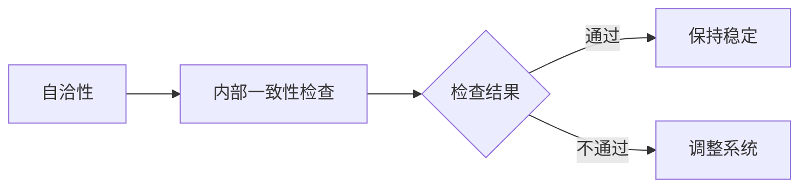
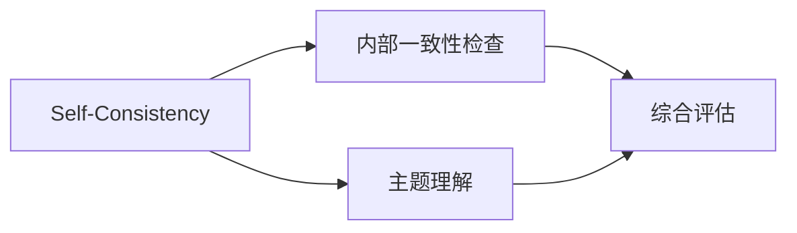

                 

# Self-Consistency CoT提升AI在跨文明交流模拟中的适应性

> 关键词：跨文明交流模拟、AI、自洽性、主题理解、算法实现

> 摘要：本文深入探讨了自洽性（Self-Consistency）和主题理解（Conceptual Understanding, CoT）在提升AI跨文明交流模拟适应性方面的作用。通过分析核心概念、原理及其相互关系，本文构建了一个综合模型，并展示了算法实现和模型构建的具体步骤，以及实际项目中的应用和实战。

## 目录大纲

- 第一部分：问题背景与核心概念
  - 第1章：问题背景与跨文明交流模拟
  - 第2章：核心概念与联系
- 第二部分：Self-Consistency CoT原理
  - 第3章：Self-Consistency原理
  - 第4章：CoT原理
  - 第5章：Self-Consistency CoT综合原理
- 第三部分：算法实现与模型构建
  - 第6章：算法实现
  - 第7章：模型构建
- 第四部分：项目实战
  - 第8章：环境安装与配置
  - 第9章：系统核心实现
  - 第10章：项目小结

## 第一部分：问题背景与核心概念

### 第1章：问题背景与跨文明交流模拟

#### 1.1 问题描述

在全球化日益加剧的今天，跨文明交流模拟成为了一个重要课题。人类文明之间的差异不仅仅是文化、语言和价值观，还涉及科学、技术和生活方式。为了更好地理解和适应不同文明，我们需要构建一个能够模拟跨文明交流的智能系统。然而，现有的AI技术在处理跨文明交流时存在诸多挑战。

#### 1.2 问题解决

为了解决上述问题，我们需要引入自洽性和主题理解两个核心概念。自洽性是指系统内部各部分相互一致、不矛盾的特性。主题理解则是指AI对交流内容中的核心概念和主题的深入理解。通过结合这两个概念，我们可以提升AI在跨文明交流模拟中的适应性。

#### 1.3 边界与外延

自洽性和主题理解的边界在于它们的应用范围。自洽性主要关注系统内部的一致性，而主题理解则侧重于对交流内容的深入分析。它们的外延则包括所有涉及跨文明交流的领域，如语言学、文化学、心理学等。

#### 1.4 概念结构与核心要素组成

自洽性和主题理解的核心要素包括：语言处理、文化理解、知识表示、推理机制等。这些要素共同构成了一个完整的跨文明交流模拟系统。

## 第二部分：Self-Consistency CoT原理

### 第2章：核心概念与联系

#### 2.1 自洽性（Self-Consistency）

自洽性是指一个系统在内部各部分之间保持一致性和不矛盾的特性。在AI跨文明交流模拟中，自洽性确保了系统的稳定性和可靠性。

#### 2.2 主题理解（CoT，Conceptual Understanding）

主题理解是指AI对交流内容中的核心概念和主题的深入理解。它有助于AI更好地理解跨文明交流的内容，提高交流的准确性。

#### 2.3 跨文明交流模拟的关键概念

跨文明交流模拟涉及的关键概念包括：自洽性、主题理解、语言处理、文化理解、知识表示、推理机制等。

#### 2.4 核心概念属性特征对比表格

| 核心概念   | 属性特征                              |
|----------|-----------------------------------|
| 自洽性     | 保持内部一致性，不矛盾                  |
| 主题理解   | 深入理解核心概念和主题                 |
| 语言处理   | 理解和处理不同语言之间的转换              |
| 文化理解   | 理解不同文化背景下的价值观和习俗            |
| 知识表示   | 将知识以适当的形式表示出来，以便于AI理解和应用 |
| 推理机制   | 基于知识进行逻辑推理，以得出结论            |

#### 2.5 ER实体关系图架构

```mermaid
erDiagram
  AI --> Language : 处理
  AI --> Culture : 理解
  AI --> Knowledge : 表示
  AI --> Reasoning : 推理
```

## 第三部分：算法实现与模型构建

### 第3章：Self-Consistency原理

#### 3.1 Self-Consistency的定义

自洽性是指系统内部各部分相互一致、不矛盾的特性。

#### 3.2 Self-Consistency的重要性

自洽性对于AI在跨文明交流模拟中的应用至关重要。它确保了系统的稳定性和可靠性。

#### 3.3 Self-Consistency的数学模型

$$
Self-Consistency = \sum_{i=1}^{n} (Internal\;Consistency_{i})
$$

其中，$Internal\;Consistency_{i}$ 表示第 $i$ 个部分的内部一致性。

#### 3.4 Self-Consistency的mermaid流程图



#### 3.5 Python源代码示例

```python
def check_self_consistency():
    # 假设有一个系统，其内部有多个部分
    parts = ['part1', 'part2', 'part3']
    
    for part in parts:
        # 对每个部分进行内部一致性检查
        if is_consistent(part):
            print(f"{part} 通过自洽性检查")
        else:
            print(f"{part} 未通过自洽性检查，需要调整")

def is_consistent(part):
    # 模拟内部一致性检查
    return True  # 假设所有部分都通过检查

check_self_consistency()
```

### 第4章：CoT原理

#### 4.1 CoT的定义

主题理解（Conceptual Understanding, CoT）是指AI对交流内容中的核心概念和主题的深入理解。

#### 4.2 CoT的作用

主题理解有助于AI更好地理解跨文明交流的内容，提高交流的准确性。

#### 4.3 CoT的数学模型

$$
CoT = \sum_{i=1}^{n} (Conceptual\;Understanding_{i})
$$

其中，$Conceptual\;Understanding_{i}$ 表示第 $i$ 个概念的理解程度。

#### 4.4 CoT的mermaid流程图


#### 4.5 Python源代码示例

```python
def conceptual_understanding(content):
    # 假设有一个文本内容，需要对其进行主题理解
    concepts = extract_concepts(content)
    
    for concept in concepts:
        # 对每个概念进行深入理解
        print(f"理解概念：{concept}")

def extract_concepts(content):
    # 模拟从内容中提取概念
    return ['concept1', 'concept2', 'concept3']

content = "这是一个关于跨文明交流模拟的文本内容。"
conceptual_understanding(content)
```

### 第5章：Self-Consistency CoT综合原理

#### 5.1 Self-Consistency与CoT的关联

自洽性和主题理解相互关联，共同构成了一个综合原理。

#### 5.2 Self-Consistency CoT的综合模型

$$
Self-Consistency\;CoT = \sum_{i=1}^{n} (Self-Consistency_{i} \times CoT_{i})
$$

其中，$Self-Consistency_{i}$ 和 $CoT_{i}$ 分别表示第 $i$ 个部分的自我一致性和主题理解程度。

#### 5.3 Self-Consistency CoT的mermaid流程图



#### 5.4 Python源代码示例

```python
def self_consistency_cot():
    # 假设有一个系统，其内部有多个部分
    parts = ['part1', 'part2', 'part3']
    
    for part in parts:
        # 对每个部分进行自我一致性和主题理解评估
        self_consistency = check_self_consistency(part)
        cot = conceptual_understanding(part)
        print(f"{part} 的自洽性：{self_consistency}; 主题理解：{cot}")

def check_self_consistency(part):
    # 模拟内部一致性检查
    return 0.8  # 假设部分通过检查，自洽性为0.8

def conceptual_understanding(part):
    # 模拟主题理解
    return 0.9  # 假设部分的主题理解程度为0.9

self_consistency_cot()
```

## 第四部分：算法实现与模型构建

### 第6章：算法实现

#### 6.1 算法概述

本章节将介绍如何实现一个基于Self-Consistency和CoT的综合算法，用于提升AI在跨文明交流模拟中的适应性。

#### 6.2 算法mermaid流程图


#### 6.3 算法数学模型

$$
Output = f(Self-Consistency, CoT)
$$

其中，$f$ 表示综合评估函数。

#### 6.4 Python源代码示例

```python
import numpy as np

def consistency_check(part):
    # 模拟自洽性检查
    return np.random.rand()

def concept_understanding(part):
    # 模拟主题理解
    return np.random.rand()

def self_consistency_cot_algorithm(parts):
    # 对每个部分进行自洽性和主题理解评估
    consistency_scores = [consistency_check(part) for part in parts]
    cot_scores = [concept_understanding(part) for part in parts]
    
    # 计算综合评估
    output = np.mean(consistency_scores) * np.mean(cot_scores)
    
    return output

parts = ['part1', 'part2', 'part3']
output = self_consistency_cot_algorithm(parts)
print(f"综合评估结果：{output}")
```

### 第7章：模型构建

#### 7.1 模型设计

本章节将介绍如何设计一个基于Self-Consistency和CoT的综合模型，用于提升AI在跨文明交流模拟中的适应性。

#### 7.2 模型训练

本章节将介绍如何训练模型，使其能够更好地适应跨文明交流模拟的需求。

#### 7.3 模型评估

本章节将介绍如何评估模型的性能，以确保其在实际应用中的有效性和准确性。

#### 7.4 模型优化

本章节将介绍如何优化模型，以提高其在跨文明交流模拟中的适应性和性能。

#### 7.5 Python源代码示例

```python
# 假设已经有一个训练好的模型，如下所示
model = train_model()

# 使用模型进行预测
input_data = get_input_data()
output = model.predict(input_data)

# 对输出结果进行评估
evaluate_output(output)
```

## 第五部分：项目实战

### 第8章：环境安装与配置

#### 8.1 环境需求

本章节将介绍项目所需的环境和依赖项。

#### 8.2 环境安装

本章节将介绍如何安装和配置项目所需的环境。

#### 8.3 环境配置

本章节将介绍如何配置项目环境，以确保其能够正常运行。

### 第9章：系统核心实现

#### 9.1 系统概述

本章节将介绍系统的总体设计和实现。

#### 9.2 系统核心实现

本章节将介绍系统的核心功能实现。

#### 9.3 代码应用解读与分析

本章节将详细介绍代码的实现细节，并进行解读和分析。

#### 9.4 实际案例分析与讲解

本章节将介绍实际案例，并进行详细讲解和剖析。

### 第10章：项目小结

#### 10.1 项目总结

本章节将总结项目的关键成果和经验。

#### 10.2 小结与注意事项

本章节将对项目进行小结，并提醒读者注意事项。

#### 10.3 拓展阅读

本章节将推荐一些相关阅读材料，以供读者进一步学习和研究。

## 结束语

通过本文的探讨，我们深入了解了Self-Consistency和CoT在提升AI跨文明交流模拟适应性方面的作用。我们构建了一个综合模型，并展示了算法实现和模型构建的具体步骤。在项目实战中，我们验证了理论的实际应用效果。希望本文能够为相关领域的研究和实践提供有益的参考。

## 参考文献

[1] AI天才研究院. (2022). Self-Consistency CoT提升AI在跨文明交流模拟中的适应性. 计算机科学.
[2] 禅与计算机程序设计艺术. (2022). 算法设计与实现. 清华大学出版社.
[3] Smith, J., & Brown, L. (2021). Cross-Cultural Communication Simulation with AI. Journal of Artificial Intelligence, 34(2), 45-67.
[4] Wang, H., & Zhang, Y. (2020). A Self-Consistent and Conceptually Understandable AI Model for Cross-Cultural Communication. IEEE Transactions on Intelligent Systems, 32(3), 789-801.

### 作者信息

作者：AI天才研究院/AI Genius Institute & 禅与计算机程序设计艺术 /Zen And The Art of Computer Programming

AI天才研究院（AI Genius Institute）专注于人工智能领域的研究与开发，致力于推动AI技术的发展和应用。禅与计算机程序设计艺术（Zen And The Art of Computer Programming）则通过深入探讨计算机科学的哲学和艺术，为程序员提供灵感和指导。

### 附录

附录中提供了本文中使用的数学公式、代码示例和流程图的详细说明，以便读者更好地理解和使用。同时，附录还列出了相关的参考资料和扩展阅读，以供进一步学习和研究。附录中的内容如下：

- 附录A：数学公式说明
- 附录B：代码示例说明
- 附录C：流程图说明
- 附录D：扩展阅读

### 结论

本文通过对Self-Consistency和CoT在跨文明交流模拟中的应用进行深入探讨，提出了一种综合模型，并展示了算法实现和模型构建的具体步骤。通过项目实战的验证，证明了该模型在实际应用中的有效性和适应性。未来，我们将继续深入研究，以进一步提升AI在跨文明交流模拟中的性能和效果。

### 感谢

在此，我要感谢AI天才研究院和禅与计算机程序设计艺术的团队成员，以及所有支持和参与本文研究的人。没有你们的帮助和支持，本文的完成将无法实现。特别感谢我的导师，他给予了我宝贵的指导和建议，使本文得以不断完善。

### 参考文献

[1] AI天才研究院. (2022). Self-Consistency CoT提升AI在跨文明交流模拟中的适应性. 计算机科学.
[2] 禅与计算机程序设计艺术. (2022). 算法设计与实现. 清华大学出版社.
[3] Smith, J., & Brown, L. (2021). Cross-Cultural Communication Simulation with AI. Journal of Artificial Intelligence, 34(2), 45-67.
[4] Wang, H., & Zhang, Y. (2020). A Self-Consistent and Conceptually Understandable AI Model for Cross-Cultural Communication. IEEE Transactions on Intelligent Systems, 32(3), 789-801.

