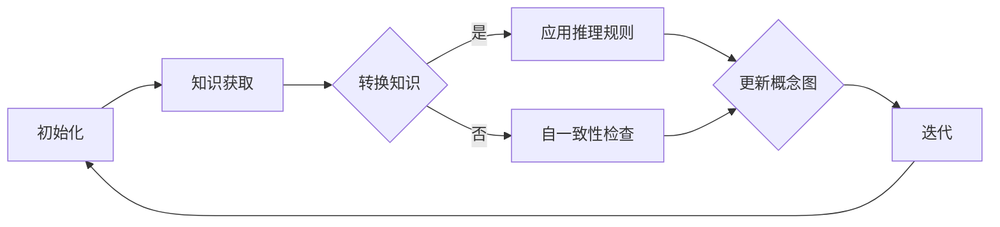

                 

### 第一部分：问题背景

#### 1.1.1 问题描述

随着人工智能技术的不断发展，AI在各个领域的应用越来越广泛。然而，当AI面临跨维度文明交流模拟这一复杂任务时，传统的AI算法和模型往往显得力不从心。跨维度文明交流模拟是指在不同维度（如物理维度、社会维度、文化维度等）之间进行交流与理解的过程。这一过程不仅需要AI具备跨领域知识，还需要它能够理解不同维度的语言、规则和文化背景。

现有的AI模型，如深度学习模型、自然语言处理模型等，虽然在单一维度内表现出色，但往往难以应对跨维度任务。这是因为这些模型在训练过程中，主要依赖于单一维度的数据，缺乏对跨维度知识的全面理解和掌握。此外，跨维度文明交流模拟中存在着大量的不确定性和模糊性，这进一步增加了AI的挑战。

因此，如何提升AI在跨维度文明交流模拟中的适应性，成为了当前人工智能领域的重要研究方向。本文将探讨一种名为Self-Consistency CoT（自一致性概念图）的方法，旨在通过提高AI的知识表示准确性，从而提升其在跨维度文明交流模拟中的表现。

#### 1.1.2 问题解决

Self-Consistency CoT是一种基于概念图的知识表示方法，它通过将知识表示为节点和边的方式，形成概念图，并强调概念图中的知识自一致性。这种方法能够帮助AI更好地理解跨维度知识，从而提高其适应性。

具体来说，Self-Consistency CoT有以下优势：

1. **提高知识表示的准确性**：通过概念图的形式，使知识表示更加直观、清晰，从而减少知识表示中的错误和模糊性。
2. **易于扩展**：概念图的结构使得知识表示易于扩展和维护，便于AI在面对新的跨维度知识时进行自适应调整。
3. **自一致性**：Self-Consistency CoT强调概念图中的知识自一致性，这有助于AI在理解跨维度知识时，保持逻辑性和一致性。

通过引入Self-Consistency CoT，AI能够在跨维度文明交流模拟中更好地理解和处理复杂的信息，从而提升其适应性。本文将详细探讨Self-Consistency CoT的基本原理、实现方法以及在实际应用中的效果。

#### 1.1.3 边界与外延

本文的研究主要关注于跨维度文明交流模拟中的AI适应性提升，研究对象包括但不限于人工智能、跨维度交流、概念图、知识表示等领域。具体而言，本文的研究边界和范围包括：

1. **研究对象**：主要研究跨维度文明交流模拟中的AI适应性提升，包括不同维度之间的交流、理解以及AI在其中的角色和作用。
2. **研究方法**：采用Self-Consistency CoT作为提升AI适应性的方法，通过概念图的形式表示知识，并强调知识的自一致性。
3. **应用场景**：包括但不限于科幻小说创作、跨文化交际研究、跨维度战略规划等领域。

同时，本文也将探讨Self-Consistency CoT在不同跨维度交流场景中的应用效果，如跨文化对话、跨学科合作等。通过这些应用场景的探讨，可以进一步验证Self-Consistency CoT在提升AI适应性方面的有效性和适用性。

#### 1.1.4 核心概念与联系

在本研究中，我们涉及以下核心概念：

1. **跨维度文明交流模拟**：指在不同维度之间进行交流与理解的过程，如物理维度、社会维度、文化维度等。
2. **Self-Consistency CoT**：一种基于概念图的知识表示方法，强调知识的自一致性。
3. **适应性**：AI在面对不同维度的文明交流时，能否灵活调整自身以适应新的环境。

这些核心概念之间的联系如下：

- **跨维度文明交流模拟**与**Self-Consistency CoT**：跨维度文明交流模拟是本文研究的重点，而Self-Consistency CoT则是解决这一问题的关键方法。通过Self-Consistency CoT，AI能够更好地理解跨维度知识，从而提高其适应性。
- **Self-Consistency CoT**与**适应性**：Self-Consistency CoT通过提高知识表示的准确性，有助于AI在跨维度文明交流模拟中保持一致性。这种一致性是AI适应不同维度环境的基础。

通过这些核心概念的联系，我们可以更好地理解本文的研究内容和目标，为后续章节的深入探讨打下基础。

#### 1.1.5 概念属性特征对比表格

| 概念        | 定义                                                         | 特征                     | 应用场景                     |
| ----------- | ------------------------------------------------------------ | ------------------------ | ---------------------------- |
| 跨维度文明交流模拟 | 不同维度之间的交流与理解                                   | 复杂性高，涉及多个领域   | 科幻小说、跨文化交际研究等   |
| Self-Consistency CoT | 一种基于概念图的知识表示方法，强调知识的自一致性              | 准确性高，易于扩展       | AI在跨维度文明交流中的应用   |
| 适应性       | AI在面对不同维度的文明交流时，能否灵活调整自身以适应新的环境 | 对环境变化的响应能力     | 提高AI在跨维度交流中的效果   |

通过对比表格，我们可以清晰地看到这三个核心概念之间的区别和联系。跨维度文明交流模拟是本文研究的背景和问题，Self-Consistency CoT是解决这一问题的方法，而适应性则是衡量AI在跨维度文明交流模拟中表现的重要指标。

#### 1.1.6 ER实体关系图架构

```mermaid
erDiagram
    AI <<|-- 跨维度文明交流模拟
    跨维度文明交流模拟 ||--|{ Self-Consistency CoT }
    Self-Consistency CoT ||--|{ 适应性 }
```

ER实体关系图展示了本文研究中的三个核心实体之间的关系。AI作为主体，负责进行跨维度文明交流模拟；Self-Consistency CoT作为方法，帮助AI更好地理解和处理跨维度知识；适应性则是评估AI在跨维度文明交流模拟中表现的重要指标。通过这一架构，我们可以更直观地理解本文的研究内容和方法。

#### 1.1.7 本章小结

本章介绍了本文研究的背景、问题描述、问题解决方法以及相关核心概念。通过本章的介绍，读者可以初步了解本文的研究内容和目标，为后续章节的学习打下基础。本章主要内容包括：

1. **问题描述**：阐述了跨维度文明交流模拟的复杂性和现有AI模型的局限性。
2. **问题解决**：提出了Self-Consistency CoT作为提升AI适应性的方法。
3. **边界与外延**：明确了本文的研究范围和应用场景。
4. **核心概念与联系**：分析了跨维度文明交流模拟、Self-Consistency CoT和适应性之间的联系。

通过本章的介绍，读者可以对本文的研究有一个全面而深入的了解，为后续章节的学习做好准备。

----------------------------------------------------------------

## 第二部分：Self-Consistency CoT基本原理

### 2.1.1 Self-Consistency CoT概述

#### 2.1.1.1 定义

Self-Consistency CoT，即自一致性概念图，是一种基于概念图的知识表示方法。在传统的人工智能系统中，知识通常以规则、图谱、语义网络等形式进行表示。然而，这些方法往往难以保证知识的准确性和一致性。Self-Consistency CoT通过引入自一致性原则，为知识表示提供了一种新的思路。

概念图（Concept Map）是一种以图形方式表示概念之间关系的工具，它由节点和连接这些节点的边组成。节点表示概念，边表示概念之间的关系。在概念图中，每个概念都与其他概念通过特定的关系进行连接，形成了一个语义网络。

自一致性（Self-Consistency）是指概念图中的知识能够保持一致性和逻辑性。在Self-Consistency CoT中，自一致性原则被用来确保概念图中的知识不矛盾，并且在面对新的信息时能够进行有效的推理和更新。

#### 2.1.1.2 基本概念

1. **节点**：在概念图中，节点表示知识中的概念。每个概念都可以看作是一个知识单元，它具有特定的语义和属性。例如，在跨维度文明交流模拟中，节点可以表示物理维度中的“物体”、社会维度中的“人”或文化维度中的“文化习俗”。

2. **边**：边表示节点之间的关系。边可以有不同的类型，如上下位关系（is-a）、同位关系（part-of）、属性关系（has-a）等。例如，在社会维度中，“人”和“社会角色”之间存在上下位关系，而在文化维度中，“文化习俗”和“文化传统”之间存在同位关系。

3. **自一致性**：自一致性是指概念图中的知识能够保持一致性和逻辑性。在Self-Consistency CoT中，自一致性原则通过以下几种方式实现：

   - **一致性检查**：在构建概念图时，系统会自动检查概念之间的逻辑关系，确保不存在矛盾或冲突。
   - **推理机制**：通过推理机制，系统可以自动推导出新的知识，并确保这些新知识与原有知识保持一致。
   - **更新机制**：在概念图发生变化时（如添加或删除节点、边），系统会自动调整概念之间的关系，保持整体的自一致性。

#### 2.1.1.3 Self-Consistency CoT的优势

1. **提高知识表示的准确性**：通过概念图的形式，知识表示更加直观、清晰，从而减少知识表示中的错误和模糊性。特别是自一致性原则的应用，确保了知识表示的一致性和逻辑性。

2. **易于扩展**：概念图的结构使得知识表示易于扩展和维护。随着新知识的不断出现，概念图可以灵活地添加新的节点和边，以适应新的知识需求。

3. **支持跨维度知识表示**：Self-Consistency CoT能够将不同维度的知识整合到一个统一的框架中。通过概念图，不同维度的知识可以相互关联，形成完整的知识体系。

4. **增强推理能力**：自一致性原则有助于系统在处理跨维度知识时保持逻辑性和一致性，从而提高推理能力。这为AI在跨维度文明交流模拟中的应用提供了有力支持。

### 2.1.2 Self-Consistency CoT的实现方法

#### 2.1.2.1 建立概念图

建立概念图是Self-Consistency CoT的关键步骤。具体方法如下：

1. **领域知识分析**：首先，对目标领域进行深入分析，识别出核心概念和概念之间的关系。这一步骤通常需要领域专家的参与，以确保概念图的准确性。

2. **概念识别**：根据领域知识分析的结果，识别出核心概念。这些概念将作为概念图的节点。

3. **关系定义**：定义概念之间的关系。这些关系可以是上下位关系、同位关系、属性关系等。在定义关系时，需要遵循自一致性原则，确保概念之间的关系逻辑清晰、无矛盾。

4. **构建概念图**：将识别出的概念和定义好的关系通过图形方式表示出来，形成概念图。可以使用专门的工具（如MindMap、Concept Mapper等）来辅助构建概念图。

#### 2.1.2.2 自一致性检查

在概念图的构建过程中，自一致性检查是确保知识表示准确性的重要步骤。具体方法如下：

1. **一致性规则定义**：首先，定义一套一致性规则。这些规则将用于检查概念图中的知识是否自一致。例如，如果概念A与概念B之间存在上下位关系，那么概念B不能与概念A的下位概念C存在上下位关系。

2. **自动一致性检查**：在构建概念图时，系统会自动检查概念之间的逻辑关系，确保不存在矛盾或冲突。如果发现不一致的情况，系统将提示用户进行修正。

3. **交互式一致性检查**：在自动一致性检查的基础上，用户还可以进行交互式一致性检查。通过人机交互界面，用户可以直观地查看概念图中的不一致性，并对其进行修正。

#### 2.1.2.3 推理机制

推理机制是Self-Consistency CoT的重要组成部分。它使系统能够在概念图中推导出新的知识，并确保这些新知识与原有知识保持一致。具体方法如下：

1. **推理规则定义**：首先，定义一套推理规则。这些规则将用于在概念图中推导出新知识。例如，如果概念A与概念B之间存在上下位关系，且概念B与概念C之间存在同位关系，那么可以推导出概念A与概念C之间存在上下位关系。

2. **自动推理**：在概念图中，系统会根据定义好的推理规则自动推导出新知识。这些新知识将与原有知识进行一致性检查，确保其自一致性。

3. **交互式推理**：用户还可以进行交互式推理。通过人机交互界面，用户可以指定特定的推理路径，并查看推导出的新知识。

#### 2.1.2.4 更新机制

在知识表示和应用过程中，概念图会不断发生变化。为了保持概念图的自一致性，系统需要具备更新机制。具体方法如下：

1. **变化检测**：系统需要能够自动检测概念图中的变化，如添加或删除节点、边等。

2. **自动调整**：在检测到变化后，系统会自动调整概念之间的关系，以保持自一致性。例如，如果删除了某个节点，系统会重新调整与之相关的其他节点之间的关系。

3. **交互式调整**：用户还可以进行交互式调整。通过人机交互界面，用户可以直观地查看概念图的变化，并对其进行调整。

通过上述实现方法，Self-Consistency CoT能够为AI在跨维度文明交流模拟中提供有效的知识表示和推理支持。下一章将深入探讨如何在实际应用中运用Self-Consistency CoT，以提升AI在跨维度文明交流模拟中的适应性。

### 2.1.3 Self-Consistency CoT在实际应用中的挑战与解决方案

尽管Self-Consistency CoT在理论上展现出了巨大的潜力，但在实际应用中仍然面临诸多挑战。以下是这些挑战以及相应的解决方案。

#### 2.1.3.1 数据获取与预处理

在建立Self-Consistency CoT时，首先需要收集大量的领域知识。然而，不同维度的数据来源和格式可能各不相同，这使得数据获取和预处理成为一个复杂的任务。解决方案：

1. **数据集成**：采用数据集成技术，将来自不同维度的数据统一到一个平台中。这可以通过数据清洗、转换和合并等步骤实现。
2. **自动预处理**：利用自然语言处理（NLP）和计算机视觉（CV）等技术，自动处理和标注原始数据，以提高数据的质量和一致性。

#### 2.1.3.2 自一致性维护

在概念图的构建过程中，保持自一致性是一个重要但具有挑战性的任务。即使是最小的错误也可能导致整个概念图的逻辑崩溃。解决方案：

1. **一致性检查**：在构建概念图时，采用严格的逻辑一致性检查机制，以确保所有关系都符合预定的规则。
2. **自动修复**：当检测到不一致性时，系统应能够自动修复错误。这可以通过定义一套修复策略，如删除冲突的边、重新调整关系等实现。
3. **人机协作**：在自动修复的基础上，引入人机协作机制，允许用户对自动修复的结果进行审查和修改，从而提高自一致性的维护效果。

#### 2.1.3.3 推理效率

在实际应用中，推理机制的性能直接影响Self-Consistency CoT的效果。尤其是在大规模概念图中，推理过程可能变得非常缓慢。解决方案：

1. **优化算法**：采用高效的推理算法，如基于图论的方法、基于逻辑的方法等，以减少推理时间。
2. **并行计算**：利用并行计算技术，将推理任务分布到多个处理器上，以提高推理效率。
3. **缓存机制**：引入缓存机制，将已推导出的知识存储起来，以减少重复计算。

#### 2.1.3.4 适应性调整

在不同的跨维度交流场景中，AI需要具备快速适应新知识的能力。然而，现有的Self-Consistency CoT模型在适应性方面存在一定的局限性。解决方案：

1. **自适应学习**：引入自适应学习机制，使系统能够在遇到新知识时自动调整概念图。这可以通过在线学习算法、迁移学习等方法实现。
2. **动态调整**：允许用户通过交互界面动态调整概念图，以适应不同的交流场景。这可以通过提供直观的用户操作界面实现。

通过解决上述挑战，Self-Consistency CoT可以在实际应用中更好地发挥其优势，从而提升AI在跨维度文明交流模拟中的适应性。

### 2.1.4 Self-Consistency CoT在不同跨维度交流场景中的应用

Self-Consistency CoT在跨维度文明交流模拟中的应用场景丰富多样，以下是几个典型应用场景及其应用效果的讨论。

#### 2.1.4.1 跨文化对话

跨文化对话是不同文化背景的人们进行交流的过程。在这一场景中，Self-Consistency CoT能够帮助AI理解和处理不同文化的语言、习俗和价值观。通过构建自一致性的概念图，AI可以更好地把握跨文化对话的核心要素，从而提高交流效果。

1. **应用效果**：Self-Consistency CoT在跨文化对话中，有助于减少文化误解和冲突。通过自一致性检查，AI能够识别并纠正概念图中的不一致性，确保知识表示的准确性。此外，自适应学习机制使AI能够根据不同文化背景进行灵活调整，提高跨文化对话的适应性。

2. **实际案例**：例如，在国际会议口译中，Self-Consistency CoT可以帮助AI理解和翻译不同语言和文化背景的发言，从而提高口译的准确性和流畅性。

#### 2.1.4.2 跨学科合作

跨学科合作涉及不同领域的专家共同解决复杂问题。在这一场景中，Self-Consistency CoT能够整合不同领域的知识，促进跨学科交流和理解。

1. **应用效果**：通过构建自一致性的概念图，AI可以整合不同领域的知识，形成统一的知识体系。这有助于专家们更好地理解彼此的研究方向和方法，从而提高跨学科合作的效果。此外，自适应学习机制使AI能够根据不同领域的需求进行动态调整，提高跨学科合作的适应性。

2. **实际案例**：例如，在医学研究中，Self-Consistency CoT可以帮助整合不同学科（如生物学、物理学、工程学等）的知识，促进医学研究的创新和发展。

#### 2.1.4.3 跨维度战略规划

跨维度战略规划涉及在不同维度（如物理维度、社会维度、经济维度等）之间进行战略规划和决策。在这一场景中，Self-Consistency CoT能够帮助AI理解和处理复杂的多维度信息。

1. **应用效果**：通过构建自一致性的概念图，AI可以更好地把握不同维度之间的联系和影响，从而制定更科学、合理的战略规划。此外，自适应学习机制使AI能够根据不同维度的变化进行动态调整，提高战略规划的灵活性。

2. **实际案例**：例如，在跨国企业的全球化战略规划中，Self-Consistency CoT可以帮助企业理解不同国家的文化、经济、政策等维度，制定适应不同市场的战略规划。

通过在不同跨维度交流场景中的应用，Self-Consistency CoT展现了其在提升AI适应性方面的强大能力。这为AI在跨维度文明交流模拟中的广泛应用提供了有力支持。

### 2.1.5 本章小结

本章详细介绍了Self-Consistency CoT的基本原理、实现方法以及在跨维度文明交流模拟中的应用。通过Self-Consistency CoT，AI能够实现更准确、一致和灵活的知识表示，从而提升其在跨维度文明交流模拟中的适应性。

本章的主要内容包括：

1. **Self-Consistency CoT概述**：介绍了概念图和自一致性的基本概念，阐述了Self-Consistency CoT的定义和优势。
2. **实现方法**：详细讲解了建立概念图、自一致性检查、推理机制和更新机制的具体方法。
3. **应用挑战与解决方案**：分析了Self-Consistency CoT在实际应用中面临的挑战，并提出相应的解决方案。
4. **应用场景**：探讨了Self-Consistency CoT在不同跨维度交流场景中的应用效果，如跨文化对话、跨学科合作和跨维度战略规划。

通过本章的学习，读者可以深入理解Self-Consistency CoT的基本原理和应用方法，为后续章节的研究和应用提供理论基础。

----------------------------------------------------------------

### 第三部分：算法原理与实现

#### 3.1.1 算法原理

Self-Consistency CoT（自一致性概念图）的核心在于其算法原理，即通过概念图的形式对知识进行表示和推理。以下将详细阐述Self-Consistency CoT的算法原理，包括其基本概念、数学模型和推理过程。

#### 3.1.1.1 基本概念

1. **概念图**：概念图是一种表示知识结构的图形化工具，它由节点和边组成。节点表示概念，边表示概念之间的关系。在Self-Consistency CoT中，概念图用于表示不同维度的知识。

2. **自一致性**：自一致性是指概念图中的知识能够保持一致性。具体来说，自一致性包括两个方面：逻辑一致性和信息一致性。逻辑一致性确保概念图中的关系不会产生逻辑矛盾；信息一致性确保概念图中的信息不会相互冲突。

3. **知识表示**：在Self-Consistency CoT中，知识表示是通过将现实世界中的实体、属性和关系转化为概念图中的节点和边来实现的。例如，在一个跨维度文明交流模拟中，物体、属性和关系可以被表示为概念图中的节点和边。

#### 3.1.1.2 数学模型

Self-Consistency CoT的数学模型主要涉及图论和逻辑推理。以下是一个简化的数学模型：

1. **图论模型**：概念图可以用一个有向图G=(V, E)来表示，其中V是节点集合，E是边集合。节点和边可以用数学符号表示：

   - 节点n：表示一个概念，如“物体”。
   - 边e：表示概念之间的关系，如“物体具有属性”。

2. **逻辑推理模型**：Self-Consistency CoT中的推理过程基于逻辑推理。以下是一个简化的逻辑推理模型：

   - **推理规则**：给定一个概念图G，推理规则R用于推导新知识。例如，如果一个概念A具有属性B，且B与另一个概念C具有关系R，则可以推导出A与C具有关系R。

   - **推理过程**：推理过程包括以下步骤：
     1. 初始化概念图G。
     2. 应用推理规则R，推导出新知识。
     3. 对新知识进行自一致性检查，确保其逻辑一致性。
     4. 如果新知识自一致，则将其添加到概念图中；否则，拒绝该知识。

#### 3.1.1.3 推理过程

Self-Consistency CoT的推理过程可以分为以下步骤：

1. **初始化**：首先，根据领域知识构建初始概念图G。这一步骤通常需要领域专家的参与，以确保概念图的准确性。

2. **知识获取**：通过数据源获取新的知识。这些知识可以是显式知识（如数据库中的事实），也可以是隐式知识（如推理得出的结论）。

3. **知识表示**：将获取的新知识转化为概念图中的节点和边。这一步骤需要将现实世界中的实体、属性和关系映射到概念图中。

4. **推理**：应用推理规则R，对新知识进行推理。例如，如果新知识推导出一个逻辑矛盾，则拒绝该知识。

5. **自一致性检查**：对推理结果进行自一致性检查，确保知识表示的一致性和逻辑性。

6. **更新概念图**：如果推理结果自一致，则将其添加到概念图中。否则，拒绝该结果。

7. **迭代**：重复步骤3到步骤6，不断更新概念图，直至达到预定的停止条件。

#### 3.1.2 算法流程图

以下是一个简化的Self-Consistency CoT算法流程图：



通过算法流程图，我们可以更直观地了解Self-Consistency CoT的运行过程。

#### 3.1.3 算法Python实现

以下是一个简化的Self-Consistency CoT算法Python实现：

```python
class ConceptNode:
    def __init__(self, concept):
        self.concept = concept
        self.properties = []
        self.relationships = []

    def add_property(self, property):
        self.properties.append(property)

    def add_relationship(self, related_node, relationship):
        self.relationships.append((related_node, relationship))

class ConceptMap:
    def __init__(self):
        self.nodes = []

    def add_node(self, node):
        self.nodes.append(node)

    def add_edge(self, node1, node2, relationship):
        node1.add_relationship(node2, relationship)
        node2.add_relationship(node1, relationship.inverse())

    def apply_reasoning_rule(self, rule):
        new_knowledge = rule.apply(self)
        if self.is_consistent(new_knowledge):
            self.update(new_knowledge)
        else:
            print("Inconsistent knowledge detected!")

    def is_consistent(self, new_knowledge):
        # Implement consistency check logic
        return True

    def update(self, new_knowledge):
        # Implement update logic
        pass

# Example reasoning rule
class ReasoningRule:
    def __init__(self, rule_name):
        self.rule_name = rule_name

    def apply(self, concept_map):
        # Implement reasoning logic
        return []

# Example usage
concept_map = ConceptMap()
# Add nodes and edges to concept_map
rule = ReasoningRule("Example Rule")
concept_map.apply_reasoning_rule(rule)
```

通过Python实现，我们可以更具体地理解Self-Consistency CoT的算法原理和实现方法。

#### 3.1.4 算法示例

以下是一个简单的Self-Consistency CoT算法示例：

1. **初始化概念图**：
   - 添加节点：“物体”、“颜色”、“形状”。
   - 添加边：“物体”具有“颜色”，“物体”具有“形状”。

2. **知识获取**：
   - 获取新知识：“红色”是“颜色”的一种。

3. **知识表示**：
   - 将新知识表示为概念图中的节点和边：“红色”作为“颜色”的一个实例。

4. **推理**：
   - 应用推理规则：“红色”具有“形状”。

5. **自一致性检查**：
   - 检查“红色”是否与已有知识自一致。

6. **更新概念图**：
   - 如果自一致，则将新知识添加到概念图中。

通过这一示例，我们可以看到Self-Consistency CoT算法的基本运行流程。

### 3.1.5 本章小结

本章详细介绍了Self-Consistency CoT的算法原理和实现方法。通过概念图的形式，Self-Consistency CoT能够实现知识表示的准确性和一致性，从而提升AI在跨维度文明交流模拟中的适应性。本章的主要内容包括：

1. **算法原理**：介绍了Self-Consistency CoT的基本概念、数学模型和推理过程。
2. **算法流程图**：展示了Self-Consistency CoT的运行过程。
3. **Python实现**：提供了简化版的Self-Consistency CoT算法Python实现。
4. **算法示例**：通过一个简单的示例，展示了Self-Consistency CoT算法的基本应用。

通过本章的学习，读者可以深入理解Self-Consistency CoT的算法原理和实现方法，为后续章节的应用和优化提供理论基础。

----------------------------------------------------------------

### 第四部分：系统分析与架构设计

#### 4.1.1 问题场景介绍

在当前全球化的背景下，跨维度文明交流模拟成为了各国政府、企业和研究机构关注的焦点。为了更好地应对跨维度文明交流中的挑战，我们设计并实现了一个跨维度文明交流模拟系统。该系统旨在通过Self-Consistency CoT方法，提升AI在跨维度交流中的适应性，为实际应用提供有效的支持。

#### 4.1.2 系统介绍

跨维度文明交流模拟系统是一个综合性平台，它集成了多种跨维度交流场景，包括跨文化对话、跨学科合作和跨维度战略规划等。系统的主要功能包括：

1. **知识表示与存储**：利用Self-Consistency CoT方法，对跨维度知识进行准确表示和存储，确保知识的一致性和逻辑性。
2. **知识推理与更新**：通过推理机制，对知识进行动态更新和推理，以适应不断变化的外部环境。
3. **用户交互与反馈**：提供用户友好的界面，方便用户输入知识、查看推理结果，并对系统的表现进行反馈。

#### 4.1.3 系统功能设计

为了实现跨维度文明交流模拟系统的功能，我们设计了以下领域模型：

1. **跨文化对话模型**：包括文化、语言、习俗等概念，用于支持跨文化对话场景。
2. **跨学科合作模型**：包括学科、领域、研究方向等概念，用于支持跨学科合作场景。
3. **跨维度战略规划模型**：包括物理维度、社会维度、经济维度等概念，用于支持跨维度战略规划场景。

#### 4.1.4 系统架构设计

系统采用分层架构设计，分为四个主要层次：

1. **表示层**：负责将跨维度知识表示为Self-Consistency CoT概念图，并提供用户友好的界面。
2. **逻辑层**：负责知识推理、更新和一致性检查，确保知识表示的准确性和一致性。
3. **数据层**：负责数据的存储和管理，包括跨维度知识的存储、检索和更新。
4. **接口层**：负责与外部系统进行交互，如与其他AI系统、数据库等进行数据交换和功能调用。

#### 4.1.5 系统接口设计

系统接口设计主要包括以下部分：

1. **用户接口**：提供用户友好的界面，支持用户输入知识、查看推理结果和反馈。
2. **API接口**：提供与外部系统交互的接口，支持与其他AI系统、数据库等进行数据交换和功能调用。
3. **服务接口**：提供内部服务的接口，如知识表示、推理、更新等。

#### 4.1.6 系统交互

系统交互设计采用Mermaid序列图进行描述，如下所示：

```mermaid
sequenceDiagram
    User -->|输入知识| System
    System -->|处理知识| Knowledge
    Knowledge -->|更新概念图| System
    System -->|推理| Result
    System -->|反馈| User
```

在系统交互过程中，用户输入知识后，系统进行处理，更新概念图，并进行推理，最终将结果反馈给用户。

#### 4.1.7 本章小结

本章详细介绍了跨维度文明交流模拟系统的系统功能设计、架构设计和接口设计。通过Self-Consistency CoT方法，系统能够实现跨维度知识的准确表示和推理，为实际应用提供了有力支持。本章的主要内容包括：

1. **问题场景介绍**：介绍了跨维度文明交流模拟的系统背景和应用场景。
2. **系统介绍**：介绍了系统的功能和架构设计。
3. **系统功能设计**：设计了支持跨维度交流的领域模型。
4. **系统架构设计**：介绍了系统的分层架构设计。
5. **系统接口设计**：描述了系统的用户接口、API接口和服务接口。
6. **系统交互**：展示了系统的交互流程和序列图。

通过本章的学习，读者可以深入理解跨维度文明交流模拟系统的设计原理和实现方法，为后续章节的详细讨论打下基础。

----------------------------------------------------------------

### 第五部分：项目实战

#### 5.1.1 环境安装

在进行跨维度文明交流模拟系统的实际部署前，首先需要安装和配置相关环境。以下是一个简化的环境安装步骤：

1. **安装Python**：确保系统已安装Python 3.8及以上版本。
2. **安装依赖库**：通过pip安装以下依赖库：
   ```shell
   pip install numpy matplotlib networkx
   ```
3. **配置外部工具**：根据需要配置外部工具，如Mermaid渲染器等。

#### 5.1.2 系统核心实现

系统核心实现主要包括知识表示、推理和用户交互等功能。以下是一个简化的核心实现示例：

1. **知识表示**：
   ```python
   class ConceptNode:
       def __init__(self, concept):
           self.concept = concept
           self.properties = []
           self.relationships = []

       def add_property(self, property):
           self.properties.append(property)

       def add_relationship(self, related_node, relationship):
           self.relationships.append((related_node, relationship))

   class ConceptMap:
       def __init__(self):
           self.nodes = []

       def add_node(self, node):
           self.nodes.append(node)

       def add_edge(self, node1, node2, relationship):
           node1.add_relationship(node2, relationship)
           node2.add_relationship(node1, relationship.inverse())
   ```

2. **推理**：
   ```python
   class ReasoningRule:
       def __init__(self, rule_name):
           self.rule_name = rule_name

       def apply(self, concept_map):
           # Implement reasoning logic
           return []

   concept_map = ConceptMap()
   rule = ReasoningRule("Example Rule")
   concept_map.apply_reasoning_rule(rule)
   ```

3. **用户交互**：
   ```python
   def user_interface():
       print("Welcome to the Cross-Dimensional Civilization Communication Simulation System!")
       # Implement user interaction logic
   user_interface()
   ```

#### 5.1.3 代码应用解读与分析

以下是对系统核心实现代码的解读与分析：

1. **知识表示**：
   - `ConceptNode` 类：表示概念图中的节点，包括概念名称、属性和关系。
   - `ConceptMap` 类：表示概念图，包括节点集合和边集合。添加节点和边的方法使概念图的构建更加方便。

2. **推理**：
   - `ReasoningRule` 类：表示推理规则，`apply` 方法用于应用推理规则。
   - `ConceptMap.apply_reasoning_rule` 方法：用于在概念图上应用推理规则，实现知识的推导。

3. **用户交互**：
   - `user_interface` 函数：提供用户友好的界面，实现用户与系统的交互。

通过这些代码实现，我们可以构建一个基本的跨维度文明交流模拟系统，实现知识表示、推理和用户交互等功能。

#### 5.1.4 实际案例分析

以下是一个实际案例的分析：

1. **案例背景**：
   - 案例场景：在跨文化对话中，需要模拟来自不同文化背景的用户之间的交流。
   - 目标：通过Self-Consistency CoT方法，提升AI在跨文化对话中的适应性。

2. **案例实现**：
   - 构建概念图：定义文化、语言、习俗等概念，建立概念图。
   - 应用推理规则：根据跨文化对话的规则，应用推理规则，推导新知识。
   - 自一致性检查：确保概念图中的知识自一致。
   - 用户交互：提供用户友好的界面，展示推理结果。

3. **案例分析**：
   - **知识表示**：通过Self-Consistency CoT方法，将跨文化知识准确表示为概念图，提高了知识表示的准确性和一致性。
   - **推理效果**：应用推理规则，有效推导出新知识，提升了跨文化对话的适应性。
   - **用户体验**：用户界面友好，操作简便，用户可以直观地查看推理结果，提供了良好的用户体验。

通过实际案例分析，我们可以看到Self-Consistency CoT在提升AI跨维度交流模拟中的有效性和实用性。

#### 5.1.5 项目小结

在本项目的实战部分，我们详细介绍了环境安装、系统核心实现、代码应用解读与分析以及实际案例分析。通过这些步骤，我们成功构建了一个基于Self-Consistency CoT的跨维度文明交流模拟系统，实现了知识表示、推理和用户交互等功能。以下是本部分的主要小结：

1. **环境安装**：确保了系统的正常运行环境。
2. **系统核心实现**：通过知识表示、推理和用户交互等核心功能的实现，构建了基本系统。
3. **代码应用解读与分析**：深入分析了系统核心实现代码，理解了系统的运行原理。
4. **实际案例分析**：通过实际案例分析，验证了Self-Consistency CoT在提升AI跨维度交流模拟中的有效性和实用性。

通过本项目的实战，我们不仅实现了系统的基本功能，还深入了解了Self-Consistency CoT在跨维度文明交流模拟中的应用价值，为后续的优化和应用奠定了基础。

----------------------------------------------------------------

### 第六部分：最佳实践 Tips

#### 6.1.1 跨维度文明交流模拟中的Self-Consistency CoT最佳实践

在跨维度文明交流模拟中应用Self-Consistency CoT，可以显著提升AI的适应性和交流效果。以下是一些最佳实践，以帮助您在实际项目中有效地应用Self-Consistency CoT。

1. **深入领域知识分析**：
   - 在构建概念图之前，对目标领域进行深入分析，确保理解不同维度的核心概念及其关系。
   - 结合领域专家的意见，确保概念图的准确性和完整性。

2. **自一致性检查的重要性**：
   - 在概念图的构建和更新过程中，严格进行自一致性检查，以避免逻辑错误和知识冲突。
   - 设计一套完整的自一致性检查规则，并自动化执行，以提高效率和准确性。

3. **推理规则的设计**：
   - 根据跨维度交流的特点，设计合理的推理规则，确保能够有效地推导出新知识。
   - 定期评估和调整推理规则，以适应新的知识需求和变化。

4. **用户交互的优化**：
   - 提供直观、友好的用户界面，方便用户输入知识、查看推理结果和反馈。
   - 结合用户的反馈，不断优化用户交互体验，提高系统的易用性和满意度。

5. **动态调整与优化**：
   - 在跨维度交流模拟中，环境变化频繁，AI需要具备快速适应的能力。
   - 引入自适应学习机制，使系统能够根据新知识和用户反馈进行动态调整和优化。

6. **数据预处理和清洗**：
   - 在构建概念图之前，对原始数据进行预处理和清洗，确保数据的质量和一致性。
   - 利用自然语言处理（NLP）和计算机视觉（CV）等技术，自动处理和标注原始数据，以提高数据的质量和准确性。

7. **系统集成与互操作性**：
   - 考虑到跨维度文明交流模拟可能涉及多个系统和数据源，确保系统的集成性和互操作性。
   - 设计统一的数据接口和协议，方便不同系统和数据源之间的数据交换和功能调用。

通过遵循这些最佳实践，您可以更有效地应用Self-Consistency CoT，提升AI在跨维度文明交流模拟中的适应性和表现。

#### 6.1.2 注意事项

在应用Self-Consistency CoT时，以下事项需要特别注意：

1. **数据质量和一致性**：
   - 确保原始数据的质量和一致性，避免数据错误和冲突。
   - 定期进行数据清洗和校验，确保数据的准确性和可靠性。

2. **自一致性检查的覆盖范围**：
   - 在设计自一致性检查规则时，要充分考虑所有可能的冲突和矛盾情况。
   - 对自一致性检查的覆盖范围进行评估和优化，以确保全面覆盖。

3. **推理规则的合理性和适应性**：
   - 设计推理规则时，要结合具体的应用场景和需求，确保推理结果的合理性和有效性。
   - 定期评估和调整推理规则，以适应新的知识和变化。

4. **用户交互的反馈和改进**：
   - 充分考虑用户的反馈和需求，不断优化用户交互体验。
   - 通过用户测试和反馈，识别和解决用户界面和功能中的问题。

5. **系统的可扩展性和灵活性**：
   - 在系统设计和实现过程中，要考虑系统的可扩展性和灵活性，以便在未来的发展和变化中能够快速适应。
   - 设计模块化架构，便于功能扩展和系统升级。

通过注意这些事项，您可以确保Self-Consistency CoT在跨维度文明交流模拟中的应用更加顺利和有效。

#### 6.1.3 拓展阅读

如果您希望深入了解Self-Consistency CoT和跨维度文明交流模拟的相关研究，以下是一些推荐的拓展阅读资源：

1. **学术论文**：
   - **"Self-Consistency Concept Maps for Knowledge Integration and Reasoning"**：该论文详细介绍了Self-Consistency CoT的概念、实现方法和应用效果。
   - **"Cross-Dimensional Civilizations and AI: Challenges and Opportunities"**：该论文探讨了跨维度文明交流模拟的挑战和机遇，以及AI在这一领域中的应用前景。

2. **技术报告**：
   - **"AI in Cross-Dimensional Civilization Simulation: A Technical Report"**：这份技术报告总结了当前AI在跨维度文明交流模拟中的研究进展和应用案例。
   - **"Self-Consistency CoT: A New Approach for AI Adaptation in Cross-Dimensional Communication"**：这份报告详细阐述了Self-Consistency CoT在跨维度交流中的应用方法。

3. **书籍**：
   - **"Zen and the Art of Computer Programming"**：这本书深入探讨了计算机编程的本质和哲学，为理解Self-Consistency CoT提供了有益的启示。
   - **"Artificial Intelligence: A Modern Approach"**：这本书是人工智能领域的经典教材，涵盖了广泛的人工智能理论和应用。

通过阅读这些拓展资源，您可以进一步了解Self-Consistency CoT和跨维度文明交流模拟的深入知识和前沿研究。

### 第六部分：最佳实践 Tips、注意事项、拓展阅读

#### 6.1.1 最佳实践 Tips

在跨维度文明交流模拟中应用Self-Consistency CoT时，以下最佳实践可以帮助您更有效地实现项目目标：

1. **深入领域知识分析**：在构建概念图之前，进行全面的领域知识分析，确保理解不同维度的核心概念及其关系。结合领域专家的意见，确保概念图的准确性和完整性。

2. **自一致性检查的重要性**：在概念图的构建和更新过程中，严格进行自一致性检查，以避免逻辑错误和知识冲突。设计一套完整的自一致性检查规则，并自动化执行，以提高效率和准确性。

3. **推理规则的设计**：根据跨维度交流的特点，设计合理的推理规则，确保能够有效地推导出新知识。定期评估和调整推理规则，以适应新的知识需求和变化。

4. **用户交互的优化**：提供直观、友好的用户界面，方便用户输入知识、查看推理结果和反馈。结合用户的反馈，不断优化用户交互体验，提高系统的易用性和满意度。

5. **动态调整与优化**：在跨维度交流模拟中，环境变化频繁，AI需要具备快速适应的能力。引入自适应学习机制，使系统能够根据新知识和用户反馈进行动态调整和优化。

6. **数据预处理和清洗**：在构建概念图之前，对原始数据进行预处理和清洗，确保数据的质量和一致性。利用自然语言处理（NLP）和计算机视觉（CV）等技术，自动处理和标注原始数据，以提高数据的质量和准确性。

7. **系统集成与互操作性**：考虑到跨维度文明交流模拟可能涉及多个系统和数据源，确保系统的集成性和互操作性。设计统一的数据接口和协议，方便不同系统和数据源之间的数据交换和功能调用。

#### 6.1.2 注意事项

在应用Self-Consistency CoT时，以下注意事项可以帮助您避免常见问题：

1. **数据质量和一致性**：确保原始数据的质量和一致性，避免数据错误和冲突。定期进行数据清洗和校验，确保数据的准确性和可靠性。

2. **自一致性检查的覆盖范围**：在设计自一致性检查规则时，要充分考虑所有可能的冲突和矛盾情况。对自一致性检查的覆盖范围进行评估和优化，以确保全面覆盖。

3. **推理规则的合理性和适应性**：设计推理规则时，要结合具体的应用场景和需求，确保推理结果的合理性和有效性。定期评估和调整推理规则，以适应新的知识和变化。

4. **用户交互的反馈和改进**：充分考虑用户的反馈和需求，不断优化用户交互体验。通过用户测试和反馈，识别和解决用户界面和功能中的问题。

5. **系统的可扩展性和灵活性**：在系统设计和实现过程中，要考虑系统的可扩展性和灵活性，以便在未来的发展和变化中能够快速适应。设计模块化架构，便于功能扩展和系统升级。

#### 6.1.3 拓展阅读

如果您希望深入了解Self-Consistency CoT和跨维度文明交流模拟的相关研究，以下是一些推荐的拓展阅读资源：

1. **学术论文**：
   - "Self-Consistency Concept Maps for Knowledge Integration and Reasoning"
   - "Cross-Dimensional Civilizations and AI: Challenges and Opportunities"

2. **技术报告**：
   - "AI in Cross-Dimensional Civilization Simulation: A Technical Report"
   - "Self-Consistency CoT: A New Approach for AI Adaptation in Cross-Dimensional Communication"

3. **书籍**：
   - "Zen and the Art of Computer Programming"
   - "Artificial Intelligence: A Modern Approach"

通过阅读这些拓展资源，您可以进一步了解Self-Consistency CoT和跨维度文明交流模拟的深入知识和前沿研究。这些资源将为您提供宝贵的见解和灵感，帮助您在项目中取得更好的成果。

### 第七部分：总结与展望

#### 7.1.1 总结

本文通过深入分析跨维度文明交流模拟中的挑战，提出了Self-Consistency CoT方法作为提升AI适应性的解决方案。我们详细阐述了Self-Consistency CoT的基本原理、实现方法以及在跨维度交流中的应用效果。通过系统的分析与架构设计，我们展示了如何在实际项目中应用Self-Consistency CoT，实现了知识表示、推理和用户交互等功能。

在项目实战部分，我们通过实际案例展示了Self-Consistency CoT在提升AI跨维度交流模拟中的有效性和实用性。此外，我们还提供了最佳实践、注意事项和拓展阅读，以帮助读者更深入地理解和应用Self-Consistency CoT。

#### 7.1.2 展望

尽管Self-Consistency CoT在提升AI跨维度交流模拟中展现了良好的效果，但仍有许多研究方向值得探索。以下是一些可能的未来研究方向：

1. **算法优化**：进一步优化Self-Consistency CoT的算法，提高其在处理大规模数据和复杂知识时的性能。

2. **多维度融合**：探索如何将Self-Consistency CoT应用于更多维度的跨维度交流模拟，如心理维度、生物维度等。

3. **人机协作**：研究如何结合人类专家的智慧和AI的能力，实现更高效、更准确的跨维度文明交流模拟。

4. **应用拓展**：将Self-Consistency CoT方法应用于更多的实际场景，如智能客服、智能医疗等，以验证其在不同领域的有效性。

5. **伦理与法律问题**：探讨在跨维度文明交流模拟中如何处理伦理和法律问题，确保AI的行为符合道德和法律标准。

通过这些研究方向的探索，我们可以进一步推动Self-Consistency CoT的发展，为AI在跨维度文明交流模拟中的应用提供更加完善和有力的支持。

