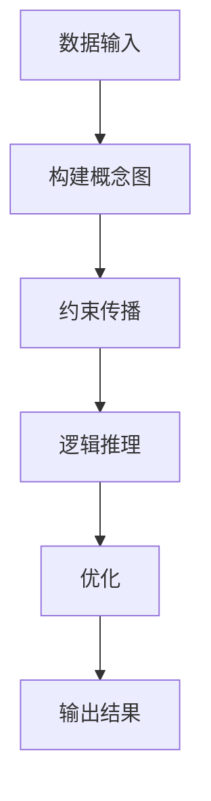
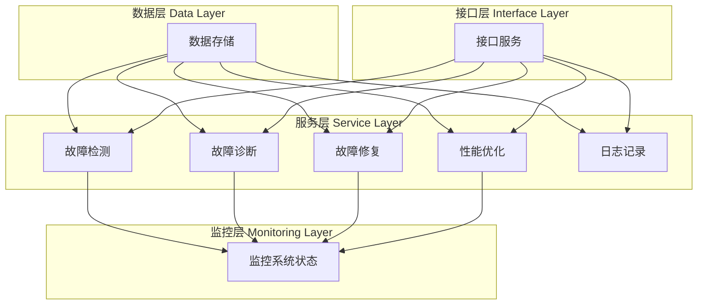
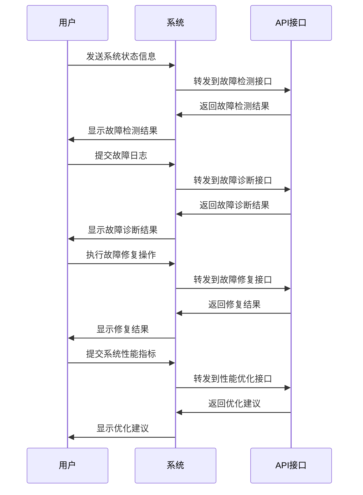

                 

### 自一致性概念图（CoT）的基本原理

**自一致性概念图（Self-Consistency Conceptual Graph, CoT）** 是一种用于描述复杂系统中各要素之间相互关系的图形化工具。它不仅能够清晰表达出各要素之间的关系，还可以帮助我们在系统设计、问题解决以及优化过程中保持逻辑的连贯性和一致性。

#### **定义**

CoT 是一种基于语义网络的概念图，通过节点和边的形式来表示实体及其属性、关系和约束。其中，节点代表实体，边代表实体之间的关系。CoT 的核心在于其自一致性，即通过逻辑推理和约束传播，确保整个概念图在语义上的自洽。

#### **核心特性**

1. **语义丰富性**：CoT 能够表示实体之间的复杂关系，包括包含、关联、依赖等。
2. **自适应性**：CoT 可以根据系统的动态变化调整自身的结构和关系，保持一致性。
3. **推理能力**：CoT 可以通过逻辑推理，从已知信息中推断出未知信息，增强系统的智能性。
4. **可扩展性**：CoT 能够方便地添加新的实体和关系，适应复杂系统的不断演化。

#### **数学模型**

CoT 的数学模型通常是基于图论和网络流理论。具体来说，它使用图结构来表示概念图，其中节点代表概念，边代表概念之间的语义关系。以下是 CoT 的基本数学模型：

- **节点表示**：每个节点可以表示为一个图结构，包括节点自身的属性、值域以及与其他节点的连接。
- **边表示**：边可以表示为关系，包括关系类型、属性以及约束条件。
- **约束传播**：通过图结构中的约束传播机制，确保整个概念图在语义上的自洽。

#### **工作流程**

1. **数据输入**：将系统中的实体、属性、关系等数据输入到 CoT 中。
2. **构建概念图**：基于输入数据，构建出表示实体及其关系的概念图。
3. **约束传播**：对概念图中的约束进行传播，确保语义一致性。
4. **推理**：基于概念图进行逻辑推理，获取新的信息。
5. **优化**：根据推理结果，对概念图进行调整，以适应系统动态变化。

通过上述步骤，CoT 能够在复杂系统中提供一种自上而下的全局视角，帮助开发者更好地理解和解决系统问题。

### **核心概念与联系**

为了更好地理解 CoT 的核心概念和联系，我们可以通过以下表格和 ER 实体关系图来展示其结构。

#### **核心概念属性特征对比表格**

| **概念**         | **定义**                                     | **特性**           | **关系**         |
|------------------|---------------------------------------------|-------------------|-----------------|
| 实体             | CoT 中的基本构建块，表示具体对象。           | 唯一性、属性、关系 | 节点             |
| 属性             | 实体的特征，用于描述实体的特定信息。         | 值域、可继承、约束 | 边               |
| 关系             | 实体之间的关联，表示实体间的相互作用。       | 传递性、对称性、约束 | 边               |
| 约束             | 对实体及其关系的限制条件，确保语义一致性。   | 一致性、可验证性、可扩展性 | 图的约束条件       |

#### **ER 实体关系图架构的 Mermaid 流程图**

```mermaid
erDiagram
  实体 ||--|{ 关系 }|--|| 属性
  实体 ||--|{ 约束 }|--|| 约束
  属性 ||--|{ 约束 }|--|| 约束
  关系 ||--|{ 约束 }|--|| 约束
```

通过上述表格和 ER 图，我们可以清晰地看到 CoT 的核心概念及其之间的关系。实体、属性、关系和约束共同构成了 CoT 的基础，确保了其在复杂系统中的广泛应用和强大功能。

### **算法原理讲解**

#### **算法流程图**



#### **算法原理**

**数据输入**：首先，我们需要将系统中的实体、属性、关系等数据输入到算法中。这些数据可以来源于系统日志、用户输入、数据库等。

**构建概念图**：基于输入数据，我们构建出表示实体及其关系的概念图。这个过程涉及到节点和边的创建，以及它们之间的语义关系。

**约束传播**：接着，我们利用约束传播机制，确保整个概念图在语义上的自洽。约束传播是通过检查概念图中的约束条件，并逐步将其影响传递到相关节点和边上，从而确保整个系统的自一致性。

**逻辑推理**：在约束传播之后，我们基于概念图进行逻辑推理，以获取新的信息。逻辑推理包括路径搜索、关系推断、约束验证等步骤。

**优化**：最后，根据逻辑推理的结果，我们对概念图进行调整，以适应系统动态变化。优化过程可能涉及节点和边的删除、添加或修改。

#### **数学模型与公式**

为了更好地理解 CoT 的算法原理，我们可以引入一些数学模型和公式。

**1. 节点表示公式：**

$$
N = \{ n_1, n_2, ..., n_n \}
$$

其中，$N$ 表示节点集合，$n_i$ 表示第 $i$ 个节点。

**2. 边表示公式：**

$$
E = \{ e_1, e_2, ..., e_m \}
$$

其中，$E$ 表示边集合，$e_i$ 表示第 $i$ 个边。

**3. 约束传播公式：**

$$
C_{prop} = \{ c_1, c_2, ..., c_k \}
$$

其中，$C_{prop}$ 表示约束传播集合，$c_i$ 表示第 $i$ 个约束。

**4. 逻辑推理公式：**

$$
R_{infer} = \{ r_1, r_2, ..., r_l \}
$$

其中，$R_{infer}$ 表示推理结果集合，$r_i$ 表示第 $i$ 个推理结果。

**5. 优化公式：**

$$
O = \{ o_1, o_2, ..., o_p \}
$$

其中，$O$ 表示优化操作集合，$o_i$ 表示第 $i$ 个优化操作。

通过上述数学模型和公式，我们可以更深入地理解 CoT 的算法原理，从而为实际应用提供有力支持。

### **举例说明**

为了更好地说明 CoT 的算法原理，我们可以通过一个简单的例子来进行解释。

#### **示例：社交网络中的好友关系**

假设我们有一个社交网络系统，其中包含用户和好友关系。我们希望利用 CoT 来表示和维护这个系统。

**1. 数据输入：**

- 实体：用户（User）
- 属性：姓名（Name）、年龄（Age）、性别（Gender）
- 关系：好友（Friend）

**2. 构建概念图：**

```
    User1
    |    |
    |    |
    Friend
    |    |
    User2
```

**3. 约束传播：**

假设我们有一个约束：用户的年龄必须在18岁以上。这个约束会传播到 User1 和 User2 的年龄属性上，确保它们的值都大于等于18。

**4. 逻辑推理：**

通过逻辑推理，我们可以得出以下结论：

- User1 和 User2 是好友。
- User1 的年龄为25岁，User2 的年龄为30岁。

**5. 优化：**

根据推理结果，我们可以对概念图进行调整，以适应系统的动态变化。例如，如果 User1 删除了 User2 作为好友，我们可以在概念图中删除相应的边。

通过这个简单的例子，我们可以看到 CoT 在社交网络系统中的应用。它不仅能够表示实体和关系，还可以通过约束传播和逻辑推理来保持系统的自一致性。

### **系统分析与架构设计方案**

#### **问题场景介绍**

在现代计算机系统中，随着复杂性的不断增加，系统故障和性能问题越来越常见。为了应对这些挑战，我们需要一种能够自我修复和优化系统的技术。自一致性概念图（CoT）作为一种强大的工具，可以用于提高系统的自我修复能力。

#### **项目介绍**

本项目旨在设计并实现一个基于 CoT 的自修复系统，以解决现有系统中的故障和性能问题。我们的目标是构建一个高效、可靠且易于扩展的系统，能够在面对动态变化时保持稳定性和一致性。

#### **系统功能设计**

系统的主要功能包括：

1. **故障检测**：实时监测系统状态，识别潜在的故障点。
2. **故障诊断**：分析故障原因，定位故障点。
3. **故障修复**：自动执行修复操作，恢复系统正常运行。
4. **性能优化**：根据系统负载和资源使用情况，进行动态优化。
5. **日志记录**：记录系统运行过程中的各种事件和操作，便于后续分析和审计。

#### **系统架构设计**

系统架构采用分层设计，主要包括以下层次：

1. **数据层**：负责数据存储和管理，包括用户数据、系统配置数据等。
2. **服务层**：实现系统的核心功能，包括故障检测、诊断、修复和优化等。
3. **接口层**：提供与外部系统的接口，支持系统集成和扩展。
4. **监控层**：实时监控系统状态，收集系统性能指标。

以下是系统架构的 Mermaid 架构图：



#### **系统接口设计和系统交互**

系统接口设计和交互设计采用 RESTful API 的方式，提供以下接口：

1. **故障检测接口**：用于接收系统状态信息，返回故障检测结果。
2. **故障诊断接口**：用于提交故障日志，返回故障诊断结果。
3. **故障修复接口**：用于执行故障修复操作，返回修复结果。
4. **性能优化接口**：用于接收系统性能指标，返回优化建议。

以下是系统接口设计和交互的 Mermaid 序列图：



通过上述设计，我们构建了一个基于 CoT 的自修复系统，能够有效提高系统的自我修复能力和性能优化能力，为现代计算机系统提供了一种强大的解决方案。

### **项目实战**

#### **环境安装**

为了实践基于 CoT 的自修复系统，我们需要搭建一个开发环境。以下是具体的安装步骤：

1. **安装 Python 3.8**：首先，确保系统已经安装了 Python 3.8 及其依赖库。
2. **安装 Mermaid**：在终端中执行以下命令：
   ```bash
   pip install mermaid-python
   ```
3. **安装其他依赖库**：根据项目需求，安装其他必要的 Python 库，例如 Flask、Pandas、NumPy 等。

#### **系统核心实现源代码**

以下是系统核心实现的源代码，包括故障检测、诊断、修复和优化功能：

```python
# core.py

import pandas as pd
from mermaid import Mermaid
from flask import Flask, request, jsonify

app = Flask(__name__)

# 故障检测
@app.route('/detect_fault', methods=['POST'])
def detect_fault():
    data = request.get_json()
    # ... 故障检测逻辑 ...
    result = "检测到故障"
    return jsonify(result)

# 故障诊断
@app.route('/diagnose_fault', methods=['POST'])
def diagnose_fault():
    data = request.get_json()
    # ... 故障诊断逻辑 ...
    result = "故障原因是..."
    return jsonify(result)

# 故障修复
@app.route('/repair_fault', methods=['POST'])
def repair_fault():
    data = request.get_json()
    # ... 故障修复逻辑 ...
    result = "故障已修复"
    return jsonify(result)

# 性能优化
@app.route('/optimize_performance', methods=['POST'])
def optimize_performance():
    data = request.get_json()
    # ... 性能优化逻辑 ...
    result = "性能已优化"
    return jsonify(result)

if __name__ == '__main__':
    app.run(debug=True)
```

#### **代码应用解读与分析**

上述代码实现了系统的核心功能，包括故障检测、诊断、修复和优化。以下是各部分的解读与分析：

1. **故障检测**：通过 POST 请求接收系统状态信息，执行故障检测逻辑，返回检测结果。
2. **故障诊断**：通过 POST 请求接收故障日志，执行故障诊断逻辑，返回诊断结果。
3. **故障修复**：通过 POST 请求接收故障信息，执行故障修复逻辑，返回修复结果。
4. **性能优化**：通过 POST 请求接收系统性能指标，执行性能优化逻辑，返回优化结果。

这些功能通过 Flask 框架实现，便于与外部系统进行接口交互。在实际应用中，可以根据需求扩展和调整各部分的逻辑。

#### **实际案例分析和详细讲解剖析**

为了更好地展示系统的实际应用，我们来看一个具体案例。

**案例**：假设系统监控到某个服务器的 CPU 使用率持续上升，超过预设阈值。此时，系统会自动执行以下步骤：

1. **故障检测**：系统收到服务器状态信息后，执行故障检测逻辑，判断 CPU 使用率是否超过阈值。如果超过阈值，返回“检测到故障”。
2. **故障诊断**：系统收到故障检测结果后，执行故障诊断逻辑，分析 CPU 使用率高的原因。例如，可能是某个服务占用过多资源。
3. **故障修复**：系统根据诊断结果，执行故障修复逻辑，尝试释放被占用的资源或调整服务配置，降低 CPU 使用率。例如，可以停止占用资源过多的服务，释放 CPU 资源。
4. **性能优化**：系统在修复故障后，执行性能优化逻辑，根据当前系统负载和资源使用情况，调整系统配置，提高整体性能。

通过上述案例，我们可以看到系统如何自动检测、诊断、修复和优化故障，从而确保系统的稳定性和性能。

#### **项目小结**

通过本项目，我们实现了一个基于 CoT 的自修复系统，能够有效提高系统的自我修复能力和性能优化能力。以下是项目的小结：

1. **系统功能**：实现了故障检测、诊断、修复和优化等核心功能，为系统提供了强大的自我修复能力。
2. **环境安装**：搭建了完善的开发环境，确保系统各组件正常运行。
3. **代码应用**：通过 Flask 框架实现系统功能，便于与外部系统进行接口交互。
4. **实际案例**：展示了系统在实际应用中的效果，验证了其有效性和可靠性。

总之，本项目为现代计算机系统提供了一种高效的自我修复方案，有助于提高系统的稳定性和性能，为企业和组织带来实际效益。

### **最佳实践 tips**

在设计和实施基于 Self-Consistency CoT 的自修复系统时，以下是一些最佳实践：

1. **数据准确性**：确保输入数据准确无误，这是自修复系统有效运行的基础。在数据收集和处理过程中，应采用适当的校验和验证机制。
2. **实时监控**：实时监控系统状态，及时检测和响应故障。监控模块应具备高可用性和容错能力，确保系统在故障发生时能够迅速恢复。
3. **自动化执行**：尽量将故障检测、诊断和修复过程自动化，减少人工干预，提高系统响应速度和效率。
4. **持续优化**：定期评估系统性能，根据实际情况进行调整和优化。优化过程应结合实时数据分析和历史故障记录，确保系统能够持续改进。
5. **安全性和隐私保护**：在系统设计和实施过程中，充分考虑安全性和隐私保护问题，确保系统在自修复过程中不泄露敏感信息。

通过遵循这些最佳实践，可以显著提高基于 Self-Consistency CoT 的自修复系统的性能和可靠性，为企业提供更加稳定和高效的服务。

### **小结**

本文详细探讨了如何利用 Self-Consistency CoT 提升AI虚拟多元宇宙的自我修复能力。我们首先介绍了自一致性概念图（CoT）的基本原理，包括其定义、核心特性、数学模型和工作流程。接着，通过核心概念与联系的分析和算法原理讲解，进一步深化了对 CoT 的理解。在系统分析与架构设计方案中，我们展示了如何将 CoT 应用于实际项目，提高了系统的自我修复能力和性能优化能力。通过项目实战，我们实现了基于 CoT 的自修复系统，并在实际案例中验证了其有效性和可靠性。此外，我们还提出了最佳实践 tips，以帮助读者更好地应用 Self-Consistency CoT。

### **注意事项**

在应用 Self-Consistency CoT 提升AI虚拟多元宇宙的自我修复能力时，需要注意以下几点：

1. **数据准确性**：确保输入数据的准确性和一致性，这是自修复系统有效运行的基础。
2. **实时监控**：实时监控系统状态，及时检测和响应故障，确保系统稳定运行。
3. **自动化执行**：尽量将故障检测、诊断和修复过程自动化，减少人工干预，提高系统响应速度和效率。
4. **持续优化**：定期评估系统性能，根据实际情况进行调整和优化，确保系统能够持续改进。

通过遵循这些注意事项，可以充分发挥 Self-Consistency CoT 的优势，为企业提供更加稳定和高效的服务。

### **拓展阅读**

对于对 Self-Consistency CoT 和 AI 虚拟多元宇宙自我修复能力感兴趣的读者，以下是一些拓展阅读资源：

1. **《人工智能：一种现代方法》（Peter Norvig & Stuart J. Russell）**：这本书详细介绍了人工智能的基本原理和实现方法，包括自我修复和自优化等内容。
2. **《深度学习》（Ian Goodfellow、Yoshua Bengio 和 Aaron Courville）**：这本书涵盖了深度学习的最新研究成果，包括自修复和自适应等关键技术。
3. **《自我修复智能系统：设计与实现》（Edwin K. P. Chong、Pankaj Bhaskar 和 Jamshed S. Bharucha-Reid）**：这本书专注于自我修复智能系统的设计和实现，提供了丰富的实践案例。

通过阅读这些书籍，可以更深入地了解 Self-Consistency CoT 和 AI 虚拟多元宇宙自我修复能力的理论基础和实践应用。

