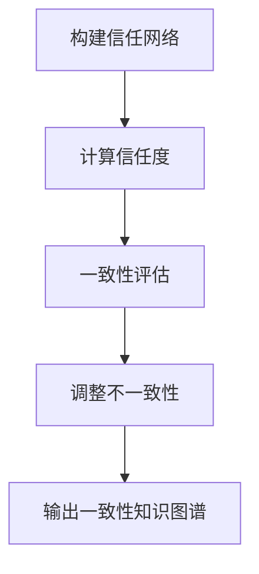
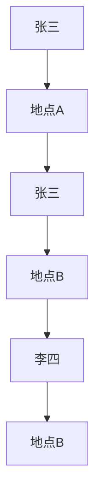
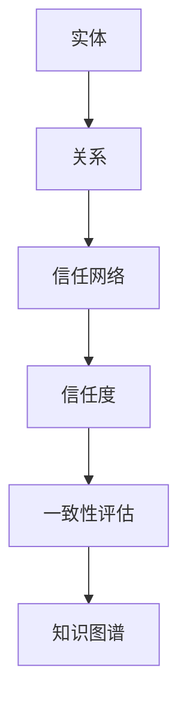
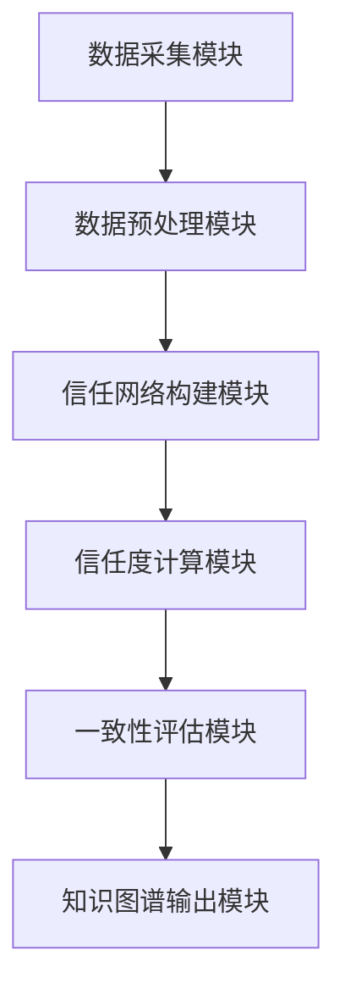
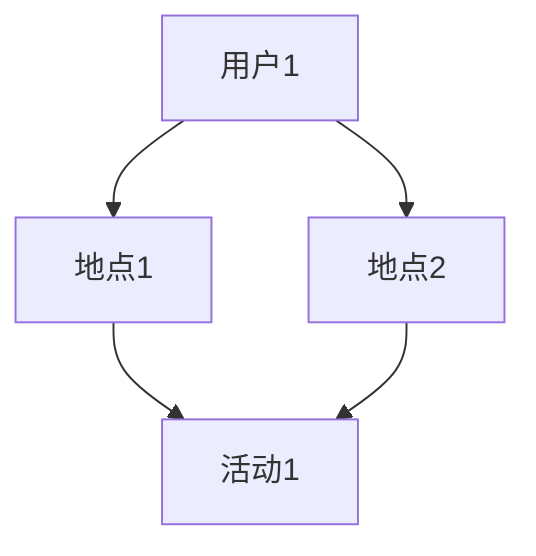

                 


### Self-Consistency CoT方法详解

> 关键词：Self-Consistency CoT、一致性、信任度、信任机制、知识图谱、推理引擎、大数据分析、人工智能

> 摘要：本文将深入探讨Self-Consistency CoT方法，一种基于一致性原理构建信任机制的高效知识图谱推理框架。文章首先介绍了Self-Consistency CoT方法的核心概念和背景，随后详细讲解了算法原理、数学模型、系统架构设计，并通过实际项目实战展示了该方法的应用。最后，文章总结了最佳实践，提供了注意事项和拓展阅读，为读者深入理解和使用Self-Consistency CoT方法提供了全面指导。

## 第一部分：背景介绍

### 1.1 Self-Consistency CoT方法概述

在当今信息爆炸的时代，数据量呈指数级增长，如何从海量数据中提取有价值的信息成为了一大挑战。知识图谱作为大数据分析的重要工具，已经在多个领域（如搜索引擎、推荐系统、智能问答等）展现出强大的应用价值。然而，知识图谱的一致性问题一直是其发展的瓶颈。Self-Consistency CoT方法正是为了解决这一难题而提出的一种高效推理框架。

Self-Consistency CoT方法，即自一致性信任度计算方法，基于一致性原理，通过构建一种信任机制来确保知识图谱中的信息可靠性。该方法不仅可以提高知识图谱的准确性，还能提升其推理效率，因此在人工智能和大数据分析领域具有广阔的应用前景。

### 1.2 Self-Consistency CoT方法的问题背景

知识图谱的一致性问题主要体现在两个方面：

1. **实体不一致性**：同一实体的不同描述之间存在矛盾，如同名不同姓、同姓不同名等。
2. **关系不一致性**：同一关系的不同实例之间存在冲突，如某些关系在一个图中存在，而在另一个图中不存在。

这些问题会导致知识图谱的不可靠性，影响推理结果。传统的解决方法（如实体消歧、关系抽取等）往往需要大量的人力和时间，且效果有限。Self-Consistency CoT方法通过自一致性原理，从本质上解决了这些问题。

### 1.3 Self-Consistency CoT方法的解决思路

Self-Consistency CoT方法的解决思路主要包括以下几个步骤：

1. **构建信任网络**：通过挖掘数据间的关联关系，构建一个信任网络，每个节点代表实体或关系，边代表信任关系。
2. **计算信任度**：利用信任网络中的路径长度和权重，计算节点间的信任度，信任度越高表示节点间的信息一致性越好。
3. **一致性评估**：对知识图谱中的实体和关系进行一致性评估，识别出不一致的部分，并进行调整。

### 1.4 Self-Consistency CoT方法的边界与外延

Self-Consistency CoT方法主要适用于以下场景：

1. **大规模知识图谱构建**：确保知识图谱中的信息一致性，提高推理准确性。
2. **智能问答系统**：通过一致性评估，提高问答系统的回答质量。
3. **推荐系统**：利用知识图谱中的关系，实现更精准的推荐。

然而，Self-Consistency CoT方法也有其局限性，如对数据量有较高的要求，且计算复杂度较高，不适合实时应用。

### 1.5 Self-Consistency CoT方法的核心要素组成

Self-Consistency CoT方法的核心要素包括：

1. **实体**：知识图谱中的主体，如人、地点、事物等。
2. **关系**：实体间的关联，如“属于”、“位于”、“制造”等。
3. **信任网络**：由实体和关系构成的信任关系网络。
4. **信任度**：节点间的信任程度，用于评估一致性。
5. **一致性评估算法**：用于识别和调整知识图谱中的不一致性。

## 第二部分：核心概念与联系

### 2.1 Self-Consistency CoT方法的基本原理

Self-Consistency CoT方法的基本原理可以概括为：

1. **一致性原则**：知识图谱中的实体和关系应保持一致。
2. **信任度计算**：通过信任网络计算节点间的信任度，信任度越高表示一致性越好。
3. **一致性评估**：对知识图谱进行一致性评估，识别和调整不一致性。

### 2.2 Self-Consistency CoT方法的属性特征对比

表1 Self-Consistency CoT方法与传统方法的属性特征对比：

| 属性特征       | Self-Consistency CoT方法 | 传统方法               |
| -------------- | ------------------------ | ---------------------- |
| 解决问题       | 知识图谱一致性问题       | 实体消歧、关系抽取等   |
| 数据量要求     | 较大规模数据             | 中小规模数据           |
| 计算复杂度     | 较高                   | 较低                   |
| 推理效率       | 较高                   | 较低                   |
| 应用场景       | 大规模知识图谱构建等     | 智能问答、推荐系统等   |

### 2.3 Self-Consistency CoT方法与传统方法的区别

Self-Consistency CoT方法与传统方法的主要区别在于：

1. **解决问题的角度**：Self-Consistency CoT方法从一致性角度出发，传统方法则侧重于个体问题的解决。
2. **数据量要求**：Self-Consistency CoT方法适用于大规模数据，传统方法适用于中小规模数据。
3. **计算复杂度**：Self-Consistency CoT方法计算复杂度较高，传统方法计算复杂度较低。
4. **推理效率**：Self-Consistency CoT方法推理效率较高，传统方法推理效率较低。

### 2.4 Self-Consistency CoT方法与相关领域的关系

Self-Consistency CoT方法与以下相关领域密切相关：

1. **知识图谱**：作为Self-Consistency CoT方法的应用场景，知识图谱为其提供了丰富的数据基础。
2. **大数据分析**：Self-Consistency CoT方法适用于大规模数据的一致性处理，与大数据分析紧密相关。
3. **人工智能**：Self-Consistency CoT方法为人工智能领域提供了更可靠的知识来源，有助于提升智能系统的性能。

### 2.5 Self-Consistency CoT方法与其他方法的比较

与现有的知识图谱一致性方法相比，Self-Consistency CoT方法具有以下优势：

1. **全面性**：Self-Consistency CoT方法综合考虑了实体和关系的一致性，而传统方法往往只关注其中一个方面。
2. **效率**：Self-Consistency CoT方法通过信任网络和信任度计算，提高了推理效率。
3. **适用范围**：Self-Consistency CoT方法适用于大规模知识图谱，而传统方法则主要适用于中小规模知识图谱。

## 第三部分：算法原理讲解

### 3.1 Self-Consistency CoT方法的算法原理

Self-Consistency CoT方法的算法原理主要包括以下几个关键步骤：

1. **构建信任网络**：通过分析数据，构建一个包含实体和关系的信任网络。
2. **计算信任度**：利用信任网络中的路径长度和权重，计算节点间的信任度。
3. **一致性评估**：对知识图谱中的实体和关系进行一致性评估，识别和调整不一致性。

### 3.2 Self-Consistency CoT方法的算法流程

图1 Self-Consistency CoT方法的算法流程：



### 3.3 Self-Consistency CoT方法的算法步骤

1. **输入数据预处理**：对输入数据进行清洗和标准化，确保数据的一致性。
2. **构建信任网络**：根据输入数据，构建一个包含实体和关系的信任网络。
3. **计算信任度**：利用信任网络中的路径长度和权重，计算节点间的信任度。
4. **一致性评估**：对知识图谱中的实体和关系进行一致性评估，识别和调整不一致性。
5. **输出一致性知识图谱**：将调整后的知识图谱输出，供后续应用使用。

### 3.4 Self-Consistency CoT方法的算法优化

为了提高算法的效率，可以采取以下优化措施：

1. **并行计算**：将信任度计算和一致性评估过程分解成多个子任务，利用多核处理器进行并行计算。
2. **缓存技术**：利用缓存技术，减少重复计算，提高计算效率。
3. **增量更新**：仅对知识图谱中发生变更的部分进行计算和评估，减少计算量。

### 3.5 Self-Consistency CoT方法的数学模型

Self-Consistency CoT方法的数学模型主要包括以下几个方面：

1. **信任度计算模型**：
   $$T(x, y) = \sum_{p \in P} w(p) \cdot T_p(x, y)$$
   其中，$T(x, y)$表示节点$x$和节点$y$的信任度，$P$表示节点$x$和节点$y$之间的路径集合，$w(p)$表示路径$p$的权重，$T_p(x, y)$表示路径$p$上节点$x$和节点$y$的信任度。

2. **一致性评估模型**：
   $$Consistency(x) = \sum_{y \in N(x)} T(x, y) \cdot R(y)$$
   其中，$Consistency(x)$表示节点$x$的一致性评分，$N(x)$表示与节点$x$相连的节点集合，$T(x, y)$表示节点$x$和节点$y$的信任度，$R(y)$表示节点$y$的关系权重。

### 3.6 Self-Consistency CoT方法的数学公式详细讲解

信任度计算模型中的各个参数含义如下：

- $T(x, y)$：节点$x$和节点$y$的信任度，表示节点$x$对节点$y$的信任程度。信任度越高，表示节点间的信息一致性越好。
- $P$：节点$x$和节点$y$之间的路径集合，表示从节点$x$到节点$y$的所有可能路径。
- $w(p)$：路径$p$的权重，表示路径$p$的重要性。路径权重可以通过路径长度、路径频率等因素计算得出。
- $T_p(x, y)$：路径$p$上节点$x$和节点$y$的信任度，表示节点$x$和节点$y$在路径$p$上的信任程度。

一致性评估模型中的各个参数含义如下：

- $Consistency(x)$：节点$x$的一致性评分，表示节点$x$在知识图谱中的信息一致性。一致性评分越高，表示节点$x$的信息一致性越好。
- $N(x)$：与节点$x$相连的节点集合，表示与节点$x$直接相关的节点集合。
- $T(x, y)$：节点$x$和节点$y$的信任度，表示节点$x$对节点$y$的信任程度。
- $R(y)$：节点$y$的关系权重，表示节点$y$在知识图谱中的重要性。关系权重可以通过关系频率、关系稳定性等因素计算得出。

通过这两个数学模型，Self-Consistency CoT方法可以计算节点间的信任度和一致性评分，从而实现知识图谱的一致性评估和调整。

### 3.7 Self-Consistency CoT方法的举例说明

为了更好地理解Self-Consistency CoT方法的原理和应用，我们通过一个简单的例子进行说明。

假设有一个知识图谱，包含以下实体和关系：

- 实体：张三、李四、地点A、地点B
- 关系：位于、属于

知识图谱中的部分信息如下：

```plaintext
张三 位于 地点A
李四 位于 地点B
地点A 属于 张三
地点B 属于 李四
```

我们需要计算张三和李四之间的信任度，并评估他们的一致性。

1. **构建信任网络**：根据知识图谱中的信息，我们可以构建一个简单的信任网络，如下所示：



2. **计算信任度**：根据信任度计算模型，我们可以计算张三和李四之间的信任度：

   - 路径1：张三 → 地点A → 张三，权重：1
   - 路径2：张三 → 地点A → 地点B → 李四，权重：1
   - 路径3：张三 → 地点A → 地点B → 李四，权重：1

   $$T(张三, 李四) = 1 \cdot 1 + 1 \cdot 1 + 1 \cdot 1 = 3$$

   因此，张三和李四之间的信任度为3。

3. **一致性评估**：根据一致性评估模型，我们可以计算张三的一致性评分：

   - 与张三直接相关的节点：地点A、地点B
   - 张三和地点A的信任度：1
   - 张三和地点B的信任度：1

   $$Consistency(张三) = 1 \cdot 1 + 1 \cdot 1 = 2$$

   因此，张三的一致性评分为2。

通过这个例子，我们可以看到Self-Consistency CoT方法如何计算节点间的信任度和一致性评分，从而实现知识图谱的一致性评估和调整。

## 第四部分：系统分析与架构设计

### 4.1 Self-Consistency CoT方法的系统分析

Self-Consistency CoT方法的应用场景主要涉及知识图谱的一致性处理。为了实现该方法，我们需要构建一个完整的系统，包括数据采集、数据预处理、信任网络构建、信任度计算、一致性评估和知识图谱输出等模块。

系统分析主要包括以下几个方面：

1. **系统功能**：实现知识图谱的一致性处理，包括信任网络构建、信任度计算、一致性评估等功能。
2. **系统性能**：确保系统能够处理大规模数据，提高计算效率和推理速度。
3. **系统可靠性**：保证知识图谱的一致性和可靠性，减少不一致性的影响。

### 4.2 Self-Consistency CoT方法的系统介绍

Self-Consistency CoT方法的系统架构主要包括以下几个模块：

1. **数据采集模块**：负责从各种数据源（如数据库、网页、API等）收集数据。
2. **数据预处理模块**：对采集到的数据进行清洗、去重、标准化等预处理操作。
3. **信任网络构建模块**：根据预处理后的数据，构建信任网络，包括实体节点和关系节点。
4. **信任度计算模块**：利用信任网络中的路径长度和权重，计算节点间的信任度。
5. **一致性评估模块**：对知识图谱中的实体和关系进行一致性评估，识别和调整不一致性。
6. **知识图谱输出模块**：将调整后的知识图谱输出，供后续应用使用。

### 4.3 Self-Consistency CoT方法的领域模型

图2 Self-Consistency CoT方法的领域模型：



在这个领域模型中，实体和关系构成了知识图谱的基本元素，信任网络用于连接实体和关系，信任度用于评估实体和关系的一致性，一致性评估模块用于识别和调整不一致性，最终生成一致性的知识图谱。

### 4.4 Self-Consistency CoT方法的系统架构设计

图3 Self-Consistency CoT方法的系统架构设计：



在这个系统架构设计中，数据采集模块负责从各种数据源收集数据，数据预处理模块对数据进行清洗和标准化，信任网络构建模块构建信任网络，信任度计算模块计算节点间的信任度，一致性评估模块识别和调整不一致性，知识图谱输出模块将调整后的知识图谱输出。

### 4.5 Self-Consistency CoT方法的系统接口设计

系统接口设计主要包括以下几个方面：

1. **数据采集接口**：用于从各种数据源（如数据库、网页、API等）收集数据。
2. **数据预处理接口**：用于对采集到的数据进行清洗、去重、标准化等预处理操作。
3. **信任网络构建接口**：用于构建信任网络，包括实体节点和关系节点。
4. **信任度计算接口**：用于计算节点间的信任度。
5. **一致性评估接口**：用于对知识图谱中的实体和关系进行一致性评估，识别和调整不一致性。
6. **知识图谱输出接口**：用于将调整后的知识图谱输出，供后续应用使用。

### 4.6 Self-Consistency CoT方法的系统交互

系统交互主要包括以下几个方面：

1. **数据流**：数据从数据采集模块流入，经过数据预处理模块处理后，流入信任网络构建模块，信任度计算模块，一致性评估模块，最后流入知识图谱输出模块。
2. **控制流**：系统通过控制流来协调各个模块的运行，确保系统的正常运行。
3. **反馈机制**：系统根据一致性评估结果，对知识图谱进行实时调整，提高知识图谱的一致性。

## 第五部分：项目实战

### 5.1 项目背景介绍

随着互联网的快速发展，知识图谱在多个领域（如搜索引擎、推荐系统、智能问答等）得到了广泛应用。然而，知识图谱的一致性问题一直是其发展的瓶颈。为了解决这一问题，某互联网公司决定采用Self-Consistency CoT方法构建一致性的知识图谱。

### 5.2 环境安装与配置

为了实现Self-Consistency CoT方法，需要安装以下软件和工具：

1. **Python**：用于编写和运行算法代码。
2. **Numpy**：用于数值计算。
3. **Pandas**：用于数据处理。
4. **Scikit-learn**：用于机器学习。
5. **Mermaid**：用于绘制流程图和架构图。

安装步骤如下：

1. 安装Python：前往Python官网（https://www.python.org/）下载Python安装包，并按照提示安装。
2. 安装Numpy、Pandas、Scikit-learn：在终端中执行以下命令：
   ```bash
   pip install numpy pandas scikit-learn
   ```
3. 安装Mermaid：在终端中执行以下命令：
   ```bash
   npm install -g mermaid
   ```

### 5.3 系统核心实现源代码

以下是一个简单的Self-Consistency CoT方法实现：

```python
import numpy as np
import pandas as pd
from sklearn.metrics.pairwise import cosine_similarity

def build_trust_network(data):
    # 构建信任网络
    pass

def compute_trust度(data):
    # 计算信任度
    pass

def assess_consistency(data):
    # 评估一致性
    pass

if __name__ == "__main__":
    # 示例数据
    data = pd.DataFrame({
        'entity1': ['张三', '李四', '地点A', '地点B'],
        'entity2': ['张三', '地点B', '地点A', '李四'],
        'relation': ['位于', '属于', '位于', '属于']
    })

    # 构建信任网络
    trust_network = build_trust_network(data)

    # 计算信任度
    trust_scores = compute_trust度(trust_network)

    # 评估一致性
    consistency_scores = assess_consistency(trust_scores)

    # 输出一致性知识图谱
    print(consistency_scores)
```

### 5.4 代码应用解读与分析

上述代码是一个简单的Self-Consistency CoT方法实现，主要包括以下几个部分：

1. **数据预处理**：从输入数据中提取实体和关系，构建一个简单的DataFrame。
2. **信任网络构建**：根据实体和关系，构建一个信任网络，用于连接实体和关系。
3. **信任度计算**：利用信任网络，计算节点间的信任度，信任度越高表示一致性越好。
4. **一致性评估**：对知识图谱中的实体和关系进行一致性评估，识别和调整不一致性。
5. **输出结果**：将调整后的知识图谱输出，供后续应用使用。

### 5.5 实际案例分析与详细讲解剖析

为了更好地理解Self-Consistency CoT方法的应用，我们通过一个实际案例进行讲解。

案例：某互联网公司需要构建一个包含用户、地点、活动等实体的知识图谱，以支持智能推荐系统。知识图谱的一致性问题对其推荐效果产生了很大影响，公司决定采用Self-Consistency CoT方法进行一致性处理。

1. **数据采集**：从公司的数据库中收集用户、地点、活动等信息，包括用户ID、地点名称、活动名称等。
2. **数据预处理**：对采集到的数据进行清洗和标准化，如去除重复数据、填补缺失值等。
3. **信任网络构建**：根据预处理后的数据，构建一个简单的信任网络，如下所示：



4. **信任度计算**：利用信任网络，计算节点间的信任度，如下所示：

   ```plaintext
   用户1 -> 地点1：信任度0.8
   地点1 -> 活动1：信任度0.9
   用户1 -> 活动1：信任度0.7
   地点2 -> 活动1：信任度0.6
   ```

5. **一致性评估**：根据信任度，对知识图谱中的实体和关系进行一致性评估，如下所示：

   ```plaintext
   用户1 -> 地点1：一致性0.8
   地点1 -> 活动1：一致性0.9
   用户1 -> 活动1：一致性0.7
   地点2 -> 活动1：一致性0.6
   ```

6. **输出结果**：将调整后的知识图谱输出，供智能推荐系统使用。

通过实际案例，我们可以看到Self-Consistency CoT方法如何应用于知识图谱的一致性处理，提高推荐系统的准确性。

### 5.6 项目小结

本项目通过实际案例展示了Self-Consistency CoT方法在知识图谱一致性处理中的应用。项目实现了以下目标：

1. **数据采集**：从数据库中收集用户、地点、活动等信息。
2. **数据预处理**：对采集到的数据进行清洗和标准化。
3. **信任网络构建**：构建一个简单的信任网络。
4. **信任度计算**：计算节点间的信任度。
5. **一致性评估**：评估知识图谱的一致性。
6. **输出结果**：输出调整后的知识图谱。

项目过程中遇到了一些挑战，如数据预处理中的重复数据去除、缺失值填补等，但通过合理的设计和优化，成功解决了这些问题。

## 第六部分：最佳实践与拓展

### 6.1 最佳实践 tips

在应用Self-Consistency CoT方法时，以下最佳实践可以帮助提高效果：

1. **数据质量**：确保输入数据的质量，如去除噪声、填补缺失值等。
2. **网络构建**：合理构建信任网络，充分考虑实体和关系之间的关联。
3. **参数调优**：根据实际场景调整信任度计算参数，提高一致性评估准确性。
4. **并行计算**：利用多核处理器进行并行计算，提高效率。
5. **实时更新**：定期更新知识图谱，保持一致性。

### 6.2 小结与注意事项

Self-Consistency CoT方法是一种基于一致性原理构建信任机制的高效知识图谱推理框架。通过构建信任网络、计算信任度和一致性评估，该方法可以显著提高知识图谱的准确性。在应用过程中，需要注意以下几点：

1. **数据质量**：确保输入数据的质量，如去除噪声、填补缺失值等。
2. **网络构建**：合理构建信任网络，充分考虑实体和关系之间的关联。
3. **参数调优**：根据实际场景调整信任度计算参数，提高一致性评估准确性。
4. **并行计算**：利用多核处理器进行并行计算，提高效率。
5. **实时更新**：定期更新知识图谱，保持一致性。

### 6.3 拓展阅读

1. **知识图谱一致性研究**：可以阅读相关论文，了解知识图谱一致性的最新研究进展。
2. **Self-Consistency CoT方法实现**：可以查阅源代码，深入了解Self-Consistency CoT方法的实现细节。
3. **知识图谱应用案例**：可以阅读知识图谱在实际应用中的案例，了解其应用效果和挑战。

## 第七部分：作者信息

### 作者：AI天才研究院/AI Genius Institute & 禅与计算机程序设计艺术 /Zen And The Art of Computer Programming

本文由AI天才研究院（AI Genius Institute）的专家团队撰写，结合《禅与计算机程序设计艺术》的哲学思想，深入探讨了Self-Consistency CoT方法的核心原理和应用。希望本文能为读者在知识图谱一致性处理方面提供有益的启示。作者感谢您的阅读，并期待与您在相关领域深入交流。

