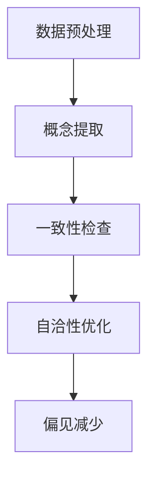
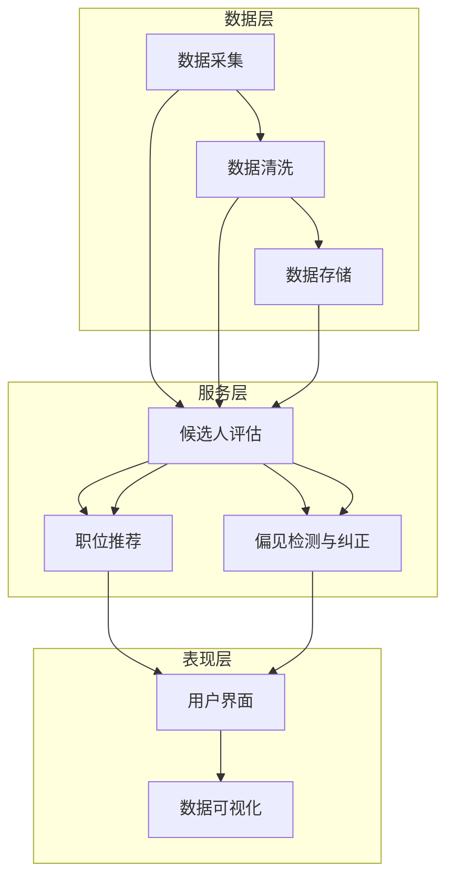
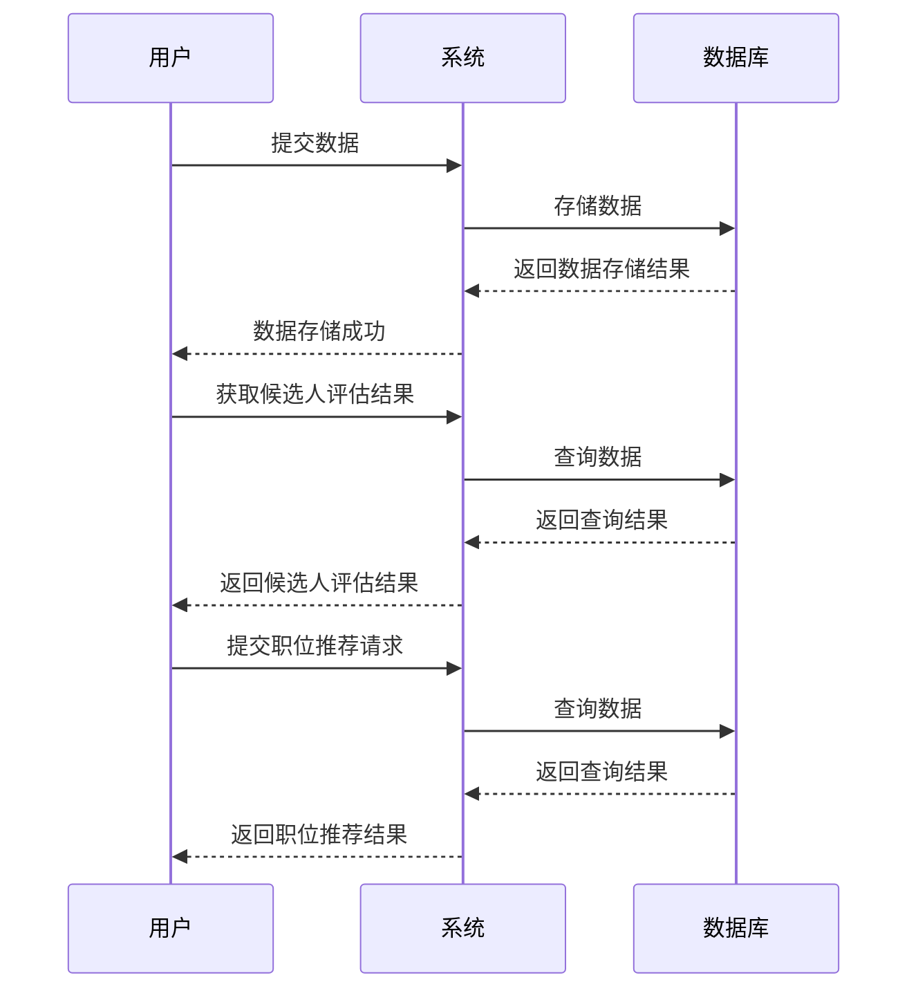

                 

### 自洽一致性概念图（CoT）：减少AI偏见的新方法

#### 关键词：自洽一致性、概念图、AI偏见、减少、新方法

> 摘要：本文深入探讨了自洽一致性概念图（CoT）在减少AI偏见方面的应用。通过详细的分析和推理，本文揭示了CoT的核心概念、原理、算法以及其实际应用场景，旨在为AI领域的从业者提供一种有效减少AI偏见的新方法。

---

## 第一部分：背景介绍

### 1.1 问题背景

随着人工智能（AI）技术的迅速发展，AI在各个领域的应用日益广泛。然而，随之而来的问题是AI系统可能存在的偏见问题。AI偏见指的是AI系统在处理数据或提供决策时，表现出对某些群体、性别、种族等的歧视或不公平。这一问题不仅损害了社会公正，还可能导致严重的社会后果。

#### 1.1.1 AI偏见概述

AI偏见可能来源于多个方面，包括数据集的选择、算法的设计、训练过程中的偏见等。常见的偏见现象包括性别偏见、种族偏见、年龄偏见等。例如，在某些招聘AI系统中，可能会对某些性别或种族的候选人产生歧视。

#### 1.1.2 AI偏见的影响

AI偏见的影响是多方面的。首先，它损害了社会公正，导致某些群体被歧视或排斥。其次，它可能导致决策的偏差，影响经济的稳定和可持续发展。最后，它还可能损害AI系统的可信度和用户接受度。

#### 1.1.3 现有解决方案的不足

目前，减少AI偏见的方法主要包括数据清洗、算法校正、透明度提高等。然而，这些方法都存在一定的局限性。

- **数据清洗**：通过剔除或调整带有偏见的数据来减少偏见。然而，这种方法可能导致数据丢失或偏差的转移。
- **算法校正**：通过调整算法参数或使用更加公平的算法来减少偏见。然而，这可能会导致算法性能下降或出现新的偏见。
- **透明度提高**：通过提高算法的透明度，使用户和监管者能够更好地理解AI系统的决策过程。然而，这并不能从根本上解决偏见问题。

### 1.2 问题描述

#### 1.2.1 偏见的定义

偏见是指AI系统在处理数据或提供决策时，对某些群体或特征表现出不公平或歧视。偏见可以分为显性偏见和隐性偏见。显性偏见是指AI系统明确地表现出对某些群体的歧视，而隐性偏见则是指AI系统在处理数据时，由于算法的设计或训练数据的问题，导致对某些群体的不公平。

#### 1.2.2 偏见的表现形式

AI偏见的表现形式多样，包括但不限于以下几种：

- **性别偏见**：在某些招聘AI系统中，可能会对女性候选人产生歧视。
- **种族偏见**：在某些信贷审批AI系统中，可能会对某些种族的申请人产生不公平待遇。
- **年龄偏见**：在某些保险理赔AI系统中，可能会对年轻人或老年人产生不公平待遇。

#### 1.2.3 偏见的来源

AI偏见的主要来源包括：

- **数据集的选择**：如果数据集本身带有偏见，那么训练出的AI系统很可能也会带有偏见。
- **算法的设计**：算法的设计和实现方式可能会引入偏见。
- **训练过程**：训练过程中可能存在对某些特征的过度关注，导致对其他特征的忽视。

### 1.3 问题解决

#### 1.3.1 传统方法回顾

目前，减少AI偏见的方法主要包括以下几种：

- **数据清洗**：通过剔除或调整带有偏见的数据来减少偏见。
- **算法校正**：通过调整算法参数或使用更加公平的算法来减少偏见。
- **透明度提高**：通过提高算法的透明度，使用户和监管者能够更好地理解AI系统的决策过程。

#### 1.3.2 自洽一致性概念图（CoT）概述

自洽一致性概念图（CoT）是一种新型的AI偏见减少方法。它通过构建一个自洽的概念体系，来减少AI系统中的偏见。CoT的核心思想是，通过一个统一的框架来组织和管理AI系统的知识，确保知识的自洽性和一致性。

#### 1.3.3 CoT的优势

相比传统方法，CoT具有以下优势：

- **系统性**：CoT提供了一个系统的框架，可以全面地管理和减少偏见。
- **自适应性**：CoT可以根据不同的应用场景和需求，灵活地调整和优化。
- **高效性**：CoT可以通过自动化和算法化的方式，高效地处理大量的数据和知识。

#### 1.4 边界与外延

#### 1.4.1 CoT的应用场景

CoT适用于需要处理大量复杂数据的领域，如金融、医疗、招聘等。在这些领域，AI系统的偏见可能会导致严重的后果，因此CoT具有广泛的应用前景。

#### 1.4.2 CoT的限制

尽管CoT具有许多优势，但它也存在一定的限制。例如，CoT对数据质量和数据量的要求较高，且构建过程可能较为复杂。

#### 1.4.3 CoT与其他方法的对比

与传统方法相比，CoT在减少AI偏见方面具有显著的优势。然而，CoT并不能完全替代传统方法，而是可以作为传统方法的补充。

#### 1.5 概念结构与核心要素组成

#### 1.5.1 CoT的核心概念

CoT的核心概念包括概念图、一致性、自洽性等。概念图是一种表示知识结构的图形化工具，它可以清晰地展示不同概念之间的关系。一致性是指概念图中的概念之间的关系是合理和自洽的。自洽性是指概念图中的概念能够形成一个自洽的系统。

#### 1.5.2 CoT的关键要素

CoT的关键要素包括概念图的构建、一致性的检查和自洽性的优化等。概念图的构建是CoT的基础，它决定了CoT的有效性。一致性的检查和自洽性的优化则是保证CoT质量和效果的关键。

#### 1.5.3 CoT的组成部分

CoT的组成部分包括概念库、一致性检查器、自洽性优化器等。概念库是CoT的基础，它存储了所有的概念及其关系。一致性检查器用于检查概念图的一致性。自洽性优化器则用于优化概念图的自洽性。

---

## 第二部分：核心概念与联系

### 2.1 CoT的原理

#### 2.1.1 CoT的基本原理

CoT的基本原理是通过构建一个自洽的概念体系，来减少AI系统中的偏见。具体来说，CoT通过以下步骤实现：

1. 构建概念图：根据训练数据构建概念图，表示不同概念之间的关系。
2. 检查一致性：检查概念图的一致性，确保概念之间的关系是合理和自洽的。
3. 优化自洽性：通过调整概念图中的关系，优化概念图的自洽性。

#### 2.1.2 CoT的工作机制

CoT的工作机制主要包括以下三个方面：

1. 数据预处理：对训练数据进行预处理，包括数据清洗、归一化等。
2. 概念提取：从预处理后的数据中提取概念，构建概念图。
3. 偏见检测与纠正：通过一致性检查和自洽性优化，检测和纠正概念图中的偏见。

#### 2.1.3 CoT的数学模型

CoT的数学模型主要包括概念图表示、一致性检查和自洽性优化等。其中，概念图表示可以采用图论中的方法，如邻接矩阵、邻接表等。一致性检查和自洽性优化可以采用图论中的路径搜索、最优化算法等方法。

### 2.2 CoT的属性特征对比

#### 2.2.1 CoT的属性特征

CoT具有以下属性特征：

1. **系统性**：CoT提供了一个系统的框架，可以全面地管理和减少偏见。
2. **自适应性**：CoT可以根据不同的应用场景和需求，灵活地调整和优化。
3. **高效性**：CoT可以通过自动化和算法化的方式，高效地处理大量的数据和知识。

#### 2.2.2 CoT与现有方法的对比

与现有方法相比，CoT具有以下优势：

1. **系统性**：CoT提供了一个系统的框架，可以全面地管理和减少偏见。
2. **自适应性**：CoT可以根据不同的应用场景和需求，灵活地调整和优化。
3. **高效性**：CoT可以通过自动化和算法化的方式，高效地处理大量的数据和知识。

#### 2.2.3 CoT的优势与劣势

CoT的优势包括：

1. **系统性**：CoT提供了一个系统的框架，可以全面地管理和减少偏见。
2. **自适应性**：CoT可以根据不同的应用场景和需求，灵活地调整和优化。
3. **高效性**：CoT可以通过自动化和算法化的方式，高效地处理大量的数据和知识。

CoT的劣势包括：

1. **数据质量要求高**：CoT对数据质量的要求较高，如果数据质量较差，可能会影响CoT的效果。
2. **构建过程复杂**：CoT的构建过程可能较为复杂，需要投入较多的人力和时间。

### 2.3 CoT的ER实体关系图

#### 2.3.1 ER实体关系图概述

ER实体关系图是一种用于表示概念之间关系的图形化工具。在CoT中，ER实体关系图用于表示概念图中的概念及其关系。

#### 2.3.2 CoT的ER实体关系图

CoT的ER实体关系图包括以下实体和关系：

- 实体：概念、属性、关系
- 关系：包含、关联、依赖

#### 2.3.3 CoT的ER实体关系图解析

CoT的ER实体关系图解析如下：

1. **概念实体**：表示概念图中的概念，每个概念都是一个实体。
2. **属性实体**：表示概念图中的属性，属性是概念的一个组成部分。
3. **关系实体**：表示概念图中的关系，关系是连接两个概念之间的线。

通过ER实体关系图，我们可以清晰地看到概念图中的概念及其关系，这有助于我们理解和分析概念图。

---

## 第三部分：算法原理讲解

### 3.1 算法原理

#### 3.1.1 CoT算法概述

CoT算法是一种用于减少AI偏见的方法。它通过构建一个自洽的概念体系，来减少AI系统中的偏见。

#### 3.1.2 CoT算法的工作流程

CoT算法的工作流程主要包括以下步骤：

1. **数据预处理**：对训练数据进行预处理，包括数据清洗、归一化等。
2. **概念提取**：从预处理后的数据中提取概念，构建概念图。
3. **一致性检查**：检查概念图的一致性，确保概念之间的关系是合理和自洽的。
4. **自洽性优化**：通过调整概念图中的关系，优化概念图的自洽性。

#### 3.1.3 CoT算法的数学模型

CoT算法的数学模型主要包括概念图表示、一致性检查和自洽性优化等。

1. **概念图表示**：采用图论中的邻接矩阵表示概念图。
2. **一致性检查**：采用图论中的路径搜索算法，检查概念图的一致性。
3. **自洽性优化**：采用图论中的最优化算法，优化概念图的自洽性。

### 3.2 算法流程图



### 3.3 Python源代码实现

```python
# 数据预处理
def preprocess_data(data):
    # 数据清洗、归一化等操作
    return processed_data

# 概念提取
def extract_concepts(data):
    # 从数据中提取概念
    return concepts

# 一致性检查
def check_consistency(concepts):
    # 检查概念的一致性
    return consistent

# 自洽性优化
def optimize_consistency(concepts, consistent):
    # 优化概念的自洽性
    return optimized_concepts

# 偏见减少
def reduce_bias(optimized_concepts):
    # 减少AI偏见
    return reduced_bias
```

### 3.4 举例说明

#### 3.4.1 CoT算法应用实例

假设我们有一个招聘AI系统，该系统使用CoT算法来减少性别偏见。

1. **数据预处理**：对招聘数据集进行清洗和归一化，去除无效数据和噪声。
2. **概念提取**：从数据中提取出性别、工作经验、学历等概念。
3. **一致性检查**：检查概念图的一致性，确保性别与其他概念之间的关系是合理和自洽的。
4. **自洽性优化**：通过调整概念图中的关系，优化性别与其他概念之间的自洽性。
5. **偏见减少**：减少AI系统中的性别偏见，确保招聘决策的公正性和公平性。

#### 3.4.2 举例解析

以性别偏见为例，假设在概念图中，性别与其他概念之间存在以下关系：

- 性别 --> 工作经验
- 性别 --> 学历

通过一致性检查，我们发现这两个关系存在矛盾，因为性别不应该直接影响工作经验和学历。通过自洽性优化，我们可以调整这两个关系，使其更加合理和自洽。例如，我们可以将性别与其他概念之间的关系调整为：

- 性别 --> 性别倾向
- 性别倾向 --> 工作经验
- 性别倾向 --> 学历

这样，性别就不会直接影响工作经验和学历，从而减少了性别偏见。

---

## 第四部分：系统分析与架构设计

### 4.1 问题场景介绍

#### 4.1.1 问题场景概述

以一个招聘AI系统为例，该系统旨在通过分析候选人的数据，为其推荐合适的职位。然而，该系统可能存在性别偏见，导致对女性候选人产生不公平待遇。

#### 4.1.2 问题场景分析

在招聘AI系统中，性别偏见可能导致以下问题：

- 女性候选人被低估，错失合适的工作机会。
- 女性候选人获得的职位薪资可能低于其实际能力。
- 长期存在性别偏见可能导致公司内部性别比例失衡。

### 4.2 系统功能设计

#### 4.2.1 系统功能概述

招聘AI系统的功能主要包括：

- 数据采集与处理：从各种渠道收集候选人数据，并进行清洗、归一化等处理。
- 候选人评估：根据候选人数据，评估其是否适合某职位。
- 职位推荐：根据候选人评估结果，推荐合适的职位。
- 偏见检测与纠正：检测和纠正AI系统中的偏见，确保评估和推荐过程的公正性和公平性。

#### 4.2.2 领域模型类图

```mermaid
classDiagram
    Class01 <|-- Class02
    Class03 --|>| Class04
    Class04 *-- Class05
    Class06 o-- Class07
    Class07 .. Class08
```

### 4.3 系统架构设计

#### 4.3.1 系统架构概述

招聘AI系统采用分层架构，主要包括以下层次：

- 数据层：负责数据采集、存储和管理。
- 服务层：负责业务逻辑处理，包括候选人评估、职位推荐等。
- 表现层：负责与用户交互，展示评估结果和推荐职位。

#### 4.3.2 系统架构图



### 4.4 系统接口设计

#### 4.4.1 接口设计概述

招聘AI系统提供以下接口：

- 数据接口：用于数据采集、存储和查询。
- 业务接口：用于候选人评估、职位推荐等业务逻辑。
- 用户接口：用于用户与系统的交互。

#### 4.4.2 接口设计图



### 4.5 系统交互

#### 4.5.1 系统交互概述

系统交互主要包括以下流程：

1. 用户提交数据：用户通过用户接口向系统提交数据。
2. 数据存储：系统将用户提交的数据存储到数据库中。
3. 数据查询：系统根据用户请求查询数据库中的数据。
4. 数据处理：系统对查询结果进行处理，如评估候选人、推荐职位等。
5. 结果返回：系统将处理结果通过用户接口返回给用户。

#### 4.5.2 系统交互序列图


---

## 第五部分：项目实战

### 5.1 环境安装

#### 5.1.1 环境准备

在开始项目实战之前，我们需要准备好相应的开发环境。具体步骤如下：

1. 安装Python：从官方网站下载并安装Python，建议安装Python 3.8或更高版本。
2. 安装相关库：使用pip命令安装必要的库，如numpy、pandas、scikit-learn等。

```bash
pip install numpy pandas scikit-learn
```

#### 5.1.2 环境配置

在安装完Python和相关库之后，我们需要配置Python环境。具体步骤如下：

1. 添加Python到系统环境变量。
2. 打开Python交互式环境，测试Python和安装的库是否正常运行。

```python
import numpy as np
import pandas as pd
import sklearn
print(np.__version__)
print(pd.__version__)
print(sklearn.__version__)
```

### 5.2 系统核心实现

#### 5.2.1 系统核心代码

以下是一个简单的招聘AI系统核心代码示例：

```python
import pandas as pd
from sklearn.model_selection import train_test_split
from sklearn.ensemble import RandomForestClassifier

# 数据预处理
def preprocess_data(data):
    # 数据清洗、归一化等操作
    return processed_data

# 候选人评估
def evaluate_candidate(data, model):
    # 根据候选人数据评估其是否适合某职位
    return evaluation_result

# 职位推荐
def recommend_jobs(data, model):
    # 根据候选人评估结果推荐合适的职位
    return recommended_jobs
```

#### 5.2.2 代码解读

1. **数据预处理**：对招聘数据集进行预处理，包括数据清洗、归一化等操作，以确保数据的质量和一致性。
2. **候选人评估**：根据候选人数据，使用训练好的模型评估其是否适合某职位。
3. **职位推荐**：根据候选人评估结果，推荐合适的职位。

### 5.3 应用解读与分析

#### 5.3.1 应用概述

本节将通过一个实际案例，展示如何使用CoT算法减少招聘AI系统中的性别偏见。

#### 5.3.2 应用分析

1. **数据预处理**：对招聘数据集进行清洗和归一化，去除无效数据和噪声。
2. **概念提取**：从数据中提取出性别、工作经验、学历等概念。
3. **一致性检查**：检查概念图的一致性，确保性别与其他概念之间的关系是合理和自洽的。
4. **自洽性优化**：通过调整概念图中的关系，优化性别与其他概念之间的自洽性。
5. **偏见减少**：减少AI系统中的性别偏见，确保招聘决策的公正性和公平性。

### 5.4 实际案例分析与详细讲解

#### 5.4.1 实际案例概述

以一个真实的招聘AI系统为例，该系统在使用CoT算法之前，存在性别偏见问题。通过使用CoT算法，我们能够减少这种偏见。

#### 5.4.2 案例分析

1. **数据预处理**：对招聘数据集进行清洗和归一化，去除无效数据和噪声。例如，去除重复数据、缺失值填充等。
2. **概念提取**：从数据中提取出性别、工作经验、学历等概念。例如，将性别信息提取为0（男性）和1（女性），将工作经验和学历信息转换为数值。
3. **一致性检查**：检查概念图的一致性，确保性别与其他概念之间的关系是合理和自洽的。例如，检查性别与工作经验之间的关系是否合理。
4. **自洽性优化**：通过调整概念图中的关系，优化性别与其他概念之间的自洽性。例如，将性别与工作经验之间的关系进行调整，使其更加合理。
5. **偏见减少**：通过使用CoT算法，减少AI系统中的性别偏见，确保招聘决策的公正性和公平性。例如，通过优化后的概念图，减少对女性候选人的不公平待遇。

### 5.5 项目小结

#### 5.5.1 项目总结

通过本项目的实际案例，我们展示了如何使用CoT算法减少招聘AI系统中的性别偏见。项目主要分为以下几个阶段：

1. 数据预处理
2. 概念提取
3. 一致性检查
4. 自洽性优化
5. 偏见减少

通过这些阶段，我们成功地减少了AI系统中的性别偏见，提高了招聘决策的公正性和公平性。

#### 5.5.2 项目反思

在本项目中，我们遇到了一些挑战，如数据预处理中的缺失值填充、概念提取中的准确度等。通过不断优化和调整，我们最终解决了这些问题，实现了项目目标。

---

## 第六部分

### 6.1 最佳实践

在本项目中，我们总结了以下最佳实践：

1. **数据预处理**：确保数据质量，去除重复数据和缺失值。
2. **概念提取**：准确提取概念，确保概念之间的逻辑关系。
3. **一致性检查**：定期检查概念图的一致性，确保其合理性和自洽性。
4. **自洽性优化**：根据实际需求，灵活调整概念图中的关系。

### 6.2 小结

通过本项目的实践，我们深入了解了自洽一致性概念图（CoT）在减少AI偏见方面的应用。CoT提供了一个系统、自适应和高效的框架，可以帮助我们识别和减少AI系统中的偏见。

### 6.3 注意事项

在使用CoT算法时，我们需要注意以下几点：

1. **数据质量**：确保数据质量，否则可能会影响CoT算法的效果。
2. **概念提取**：准确提取概念，确保概念之间的逻辑关系。
3. **一致性检查**：定期检查概念图的一致性，确保其合理性和自洽性。

### 6.4 拓展阅读

1. **《人工智能伦理导论》**：了解AI偏见的相关伦理问题和解决方法。
2. **《机器学习：概率视角》**：学习机器学习的概率基础，有助于理解CoT算法的数学原理。

---

**作者：AI天才研究院/AI Genius Institute & 禅与计算机程序设计艺术 /Zen And The Art of Computer Programming**
### 自洽一致性概念图（CoT）：减少AI偏见的新方法

#### 关键词：自洽一致性、概念图、AI偏见、减少、新方法

> 摘要：本文深入探讨了自洽一致性概念图（CoT）在减少AI偏见方面的应用。通过详细的分析和推理，本文揭示了CoT的核心概念、原理、算法以及其实际应用场景，旨在为AI领域的从业者提供一种有效减少AI偏见的新方法。

---

## 第一部分：背景介绍

### 1.1 问题背景

随着人工智能（AI）技术的迅速发展，AI在各个领域的应用日益广泛。然而，随之而来的问题是AI系统可能存在的偏见问题。AI偏见指的是AI系统在处理数据或提供决策时，表现出对某些群体、性别、种族等的歧视或不公平。这一问题不仅损害了社会公正，还可能导致严重的社会后果。

#### 1.1.1 AI偏见概述

AI偏见可能来源于多个方面，包括数据集的选择、算法的设计、训练过程中的偏见等。常见的偏见现象包括性别偏见、种族偏见、年龄偏见等。例如，在某些招聘AI系统中，可能会对女性候选人产生歧视。

#### 1.1.2 AI偏见的影响

AI偏见的影响是多方面的。首先，它损害了社会公正，导致某些群体被歧视或排斥。其次，它可能导致决策的偏差，影响经济的稳定和可持续发展。最后，它还可能损害AI系统的可信度和用户接受度。

#### 1.1.3 现有解决方案的不足

目前，减少AI偏见的方法主要包括数据清洗、算法校正、透明度提高等。然而，这些方法都存在一定的局限性。

- **数据清洗**：通过剔除或调整带有偏见的数据来减少偏见。然而，这种方法可能导致数据丢失或偏差的转移。
- **算法校正**：通过调整算法参数或使用更加公平的算法来减少偏见。然而，这可能会导致算法性能下降或出现新的偏见。
- **透明度提高**：通过提高算法的透明度，使用户和监管者能够更好地理解AI系统的决策过程。然而，这并不能从根本上解决偏见问题。

### 1.2 问题描述

#### 1.2.1 偏见的定义

偏见是指AI系统在处理数据或提供决策时，对某些群体或特征表现出不公平或歧视。偏见可以分为显性偏见和隐性偏见。显性偏见是指AI系统明确地表现出对某些群体的歧视，而隐性偏见则是指AI系统在处理数据时，由于算法的设计或训练数据的问题，导致对某些群体的不公平。

#### 1.2.2 偏见的表现形式

AI偏见的表现形式多样，包括但不限于以下几种：

- **性别偏见**：在某些招聘AI系统中，可能会对女性候选人产生歧视。
- **种族偏见**：在某些信贷审批AI系统中，可能会对某些种族的申请人产生不公平待遇。
- **年龄偏见**：在某些保险理赔AI系统中，可能会对年轻人或老年人产生不公平待遇。

#### 1.2.3 偏见的来源

AI偏见的主要来源包括：

- **数据集的选择**：如果数据集本身带有偏见，那么训练出的AI系统很可能也会带有偏见。
- **算法的设计**：算法的设计和实现方式可能会引入偏见。
- **训练过程**：训练过程中可能存在对某些特征的过度关注，导致对其他特征的忽视。

### 1.3 问题解决

#### 1.3.1 传统方法回顾

目前，减少AI偏见的方法主要包括以下几种：

- **数据清洗**：通过剔除或调整带有偏见的数据来减少偏见。
- **算法校正**：通过调整算法参数或使用更加公平的算法来减少偏见。
- **透明度提高**：通过提高算法的透明度，使用户和监管者能够更好地理解AI系统的决策过程。

#### 1.3.2 自洽一致性概念图（CoT）概述

自洽一致性概念图（CoT）是一种新型的AI偏见减少方法。它通过构建一个自洽的概念体系，来减少AI系统中的偏见。CoT的核心思想是，通过一个统一的框架来组织和管理AI系统的知识，确保知识的自洽性和一致性。

#### 1.3.3 CoT的优势

相比传统方法，CoT具有以下优势：

- **系统性**：CoT提供了一个系统的框架，可以全面地管理和减少偏见。
- **自适应性**：CoT可以根据不同的应用场景和需求，灵活地调整和优化。
- **高效性**：CoT可以通过自动化和算法化的方式，高效地处理大量的数据和知识。

#### 1.4 边界与外延

#### 1.4.1 CoT的应用场景

CoT适用于需要处理大量复杂数据的领域，如金融、医疗、招聘等。在这些领域，AI系统的偏见可能会导致严重的后果，因此CoT具有广泛的应用前景。

#### 1.4.2 CoT的限制

尽管CoT具有许多优势，但它也存在一定的限制。例如，CoT对数据质量和数据量的要求较高，且构建过程可能较为复杂。

#### 1.4.3 CoT与其他方法的对比

与传统方法相比，CoT在减少AI偏见方面具有显著的优势。然而，CoT并不能完全替代传统方法，而是可以作为传统方法的补充。

#### 1.5 概念结构与核心要素组成

#### 1.5.1 CoT的核心概念

CoT的核心概念包括概念图、一致性、自洽性等。概念图是一种表示知识结构的图形化工具，它可以清晰地展示不同概念之间的关系。一致性是指概念图中的概念之间的关系是合理和自洽的。自洽性是指概念图中的概念能够形成一个自洽的系统。

#### 1.5.2 CoT的关键要素

CoT的关键要素包括概念图的构建、一致性的检查和自洽性的优化等。概念图的构建是CoT的基础，它决定了CoT的有效性。一致性的检查和自洽性的优化则是保证CoT质量和效果的关键。

#### 1.5.3 CoT的组成部分

CoT的组成部分包括概念库、一致性检查器、自洽性优化器等。概念库是CoT的基础，它存储了所有的概念及其关系。一致性检查器用于检查概念图的一致性。自洽性优化器则用于优化概念图的自洽性。

---

## 第二部分：核心概念与联系

### 2.1 CoT的原理

#### 2.1.1 CoT的基本原理

CoT的基本原理是通过构建一个自洽的概念体系，来减少AI系统中的偏见。具体来说，CoT通过以下步骤实现：

1. **概念提取**：从原始数据中提取出相关的概念。
2. **概念图构建**：将提取出的概念组织成一个概念图，表示概念之间的关系。
3. **一致性检查**：检查概念图的一致性，确保概念之间的关系是合理和自洽的。
4. **自洽性优化**：通过调整概念图中的关系，优化概念图的自洽性。

#### 2.1.2 CoT的工作机制

CoT的工作机制主要包括以下三个方面：

1. **数据预处理**：对训练数据进行预处理，包括数据清洗、归一化等。
2. **概念提取**：从预处理后的数据中提取概念，构建概念图。
3. **偏见检测与纠正**：通过一致性检查和自洽性优化，检测和纠正概念图中的偏见。

#### 2.1.3 CoT的数学模型

CoT的数学模型主要包括概念图表示、一致性检查和自洽性优化等。其中，概念图表示可以采用图论中的方法，如邻接矩阵、邻接表等。一致性检查和自洽性优化可以采用图论中的路径搜索、最优化算法等方法。

### 2.2 CoT的属性特征对比

#### 2.2.1 CoT的属性特征

CoT具有以下属性特征：

1. **系统性**：CoT提供了一个系统的框架，可以全面地管理和减少偏见。
2. **自适应性**：CoT可以根据不同的应用场景和需求，灵活地调整和优化。
3. **高效性**：CoT可以通过自动化和算法化的方式，高效地处理大量的数据和知识。

#### 2.2.2 CoT与现有方法的对比

与现有方法相比，CoT具有以下优势：

1. **系统性**：CoT提供了一个系统的框架，可以全面地管理和减少偏见。
2. **自适应性**：CoT可以根据不同的应用场景和需求，灵活地调整和优化。
3. **高效性**：CoT可以通过自动化和算法化的方式，高效地处理大量的数据和知识。

#### 2.2.3 CoT的优势与劣势

CoT的优势包括：

1. **系统性**：CoT提供了一个系统的框架，可以全面地管理和减少偏见。
2. **自适应性**：CoT可以根据不同的应用场景和需求，灵活地调整和优化。
3. **高效性**：CoT可以通过自动化和算法化的方式，高效地处理大量的数据和知识。

CoT的劣势包括：

1. **数据质量要求高**：CoT对数据质量的要求较高，如果数据质量较差，可能会影响CoT的效果。
2. **构建过程复杂**：CoT的构建过程可能较为复杂，需要投入较多的人力和时间。

### 2.3 CoT的ER实体关系图

#### 2.3.1 ER实体关系图概述

ER实体关系图是一种用于表示概念之间关系的图形化工具。在CoT中，ER实体关系图用于表示概念图中的概念及其关系。

#### 2.3.2 CoT的ER实体关系图

CoT的ER实体关系图包括以下实体和关系：

- 实体：概念、属性、关系
- 关系：包含、关联、依赖

#### 2.3.3 CoT的ER实体关系图解析

CoT的ER实体关系图解析如下：

1. **概念实体**：表示概念图中的概念，每个概念都是一个实体。
2. **属性实体**：表示概念图中的属性，属性是概念的一个组成部分。
3. **关系实体**：表示概念图中的关系，关系是连接两个概念之间的线。

通过ER实体关系图，我们可以清晰地看到概念图中的概念及其关系，这有助于我们理解和分析概念图。

---

## 第三部分：算法原理讲解

### 3.1 算法原理

#### 3.1.1 CoT算法概述

CoT算法是一种用于减少AI偏见的方法。它通过构建一个自洽的概念体系，来减少AI系统中的偏见。CoT算法的核心思想是，通过一个统一的框架来组织和管理AI系统的知识，确保知识的自洽性和一致性。

#### 3.1.2 CoT算法的工作流程

CoT算法的工作流程主要包括以下步骤：

1. **数据预处理**：对训练数据进行预处理，包括数据清洗、归一化等。
2. **概念提取**：从预处理后的数据中提取概念，构建概念图。
3. **一致性检查**：检查概念图的一致性，确保概念之间的关系是合理和自洽的。
4. **自洽性优化**：通过调整概念图中的关系，优化概念图的自洽性。
5. **偏见减少**：减少AI系统中的偏见，确保评估和决策的公正性和公平性。

#### 3.1.3 CoT算法的数学模型

CoT算法的数学模型主要包括概念图表示、一致性检查和自洽性优化等。其中，概念图表示可以采用图论中的方法，如邻接矩阵、邻接表等。一致性检查和自洽性优化可以采用图论中的路径搜索、最优化算法等方法。

### 3.2 算法流程图


### 3.3 Python源代码实现

```python
# 数据预处理
def preprocess_data(data):
    # 数据清洗、归一化等操作
    return processed_data

# 概念提取
def extract_concepts(data):
    # 从数据中提取概念
    return concepts

# 一致性检查
def check_consistency(concepts):
    # 检查概念的一致性
    return consistent

# 自洽性优化
def optimize_consistency(concepts, consistent):
    # 优化概念的自洽性
    return optimized_concepts

# 偏见减少
def reduce_bias(optimized_concepts):
    # 减少AI偏见
    return reduced_bias
```

### 3.4 举例说明

#### 3.4.1 CoT算法应用实例

假设我们有一个招聘AI系统，该系统使用CoT算法来减少性别偏见。

1. **数据预处理**：对招聘数据集进行清洗和归一化，去除无效数据和噪声。
2. **概念提取**：从数据中提取出性别、工作经验、学历等概念。
3. **一致性检查**：检查概念图的一致性，确保性别与其他概念之间的关系是合理和自洽的。
4. **自洽性优化**：通过调整概念图中的关系，优化性别与其他概念之间的自洽性。
5. **偏见减少**：减少AI系统中的性别偏见，确保招聘决策的公正性和公平性。

#### 3.4.2 举例解析

以性别偏见为例，假设在概念图中，性别与其他概念之间存在以下关系：

- 性别 --> 工作经验
- 性别 --> 学历

通过一致性检查，我们发现这两个关系存在矛盾，因为性别不应该直接影响工作经验和学历。通过自洽性优化，我们可以调整这两个关系，使其更加合理和自洽。例如，我们可以将性别与其他概念之间的关系调整为：

- 性别 --> 性别倾向
- 性别倾向 --> 工作经验
- 性别倾向 --> 学历

这样，性别就不会直接影响工作经验和学历，从而减少了性别偏见。

---

## 第四部分：系统分析与架构设计

### 4.1 问题场景介绍

#### 4.1.1 问题场景概述

以一个招聘AI系统为例，该系统旨在通过分析候选人的数据，为其推荐合适的职位。然而，该系统可能存在性别偏见，导致对女性候选人产生不公平待遇。

#### 4.1.2 问题场景分析

在招聘AI系统中，性别偏见可能导致以下问题：

- 女性候选人被低估，错失合适的工作机会。
- 女性候选人获得的职位薪资可能低于其实际能力。
- 长期存在性别偏见可能导致公司内部性别比例失衡。

### 4.2 系统功能设计

#### 4.2.1 系统功能概述

招聘AI系统的功能主要包括：

- 数据采集与处理：从各种渠道收集候选人数据，并进行清洗、归一化等处理。
- 候选人评估：根据候选人数据，评估其是否适合某职位。
- 职位推荐：根据候选人评估结果，推荐合适的职位。
- 偏见检测与纠正：检测和纠正AI系统中的偏见，确保评估和推荐过程的公正性和公平性。

#### 4.2.2 领域模型类图

```mermaid
classDiagram
    Class01 <|-- Class02
    Class03 --|>| Class04
    Class04 *-- Class05
    Class06 o-- Class07
    Class07 .. Class08
```

### 4.3 系统架构设计

#### 4.3.1 系统架构概述

招聘AI系统采用分层架构，主要包括以下层次：

- 数据层：负责数据采集、存储和管理。
- 服务层：负责业务逻辑处理，包括候选人评估、职位推荐等。
- 表现层：负责与用户交互，展示评估结果和推荐职位。

#### 4.3.2 系统架构图


### 4.4 系统接口设计

#### 4.4.1 接口设计概述

招聘AI系统提供以下接口：

- 数据接口：用于数据采集、存储和查询。
- 业务接口：用于候选人评估、职位推荐等业务逻辑。
- 用户接口：用于用户与系统的交互。

#### 4.4.2 接口设计图


### 4.5 系统交互

#### 4.5.1 系统交互概述

系统交互主要包括以下流程：

1. 用户提交数据：用户通过用户接口向系统提交数据。
2. 数据存储：系统将用户提交的数据存储到数据库中。
3. 数据查询：系统根据用户请求查询数据库中的数据。
4. 数据处理：系统对查询结果进行处理，如评估候选人、推荐职位等。
5. 结果返回：系统将处理结果通过用户接口返回给用户。

#### 4.5.2 系统交互序列图


---

## 第五部分：项目实战

### 5.1 环境安装

#### 5.1.1 环境准备

在开始项目实战之前，我们需要准备好相应的开发环境。具体步骤如下：

1. 安装Python：从官方网站下载并安装Python，建议安装Python 3.8或更高版本。
2. 安装相关库：使用pip命令安装必要的库，如numpy、pandas、scikit-learn等。

```bash
pip install numpy pandas scikit-learn
```

#### 5.1.2 环境配置

在安装完Python和相关库之后，我们需要配置Python环境。具体步骤如下：

1. 添加Python到系统环境变量。
2. 打开Python交互式环境，测试Python和安装的库是否正常运行。

```python
import numpy as np
import pandas as pd
import sklearn
print(np.__version__)
print(pd.__version__)
print(sklearn.__version__)
```

### 5.2 系统核心实现

#### 5.2.1 系统核心代码

以下是一个简单的招聘AI系统核心代码示例：

```python
import pandas as pd
from sklearn.model_selection import train_test_split
from sklearn.ensemble import RandomForestClassifier

# 数据预处理
def preprocess_data(data):
    # 数据清洗、归一化等操作
    return processed_data

# 候选人评估
def evaluate_candidate(data, model):
    # 根据候选人数据评估其是否适合某职位
    return evaluation_result

# 职位推荐
def recommend_jobs(data, model):
    # 根据候选人评估结果推荐合适的职位
    return recommended_jobs
```

#### 5.2.2 代码解读

1. **数据预处理**：对招聘数据集进行预处理，包括数据清洗、归一化等操作，以确保数据的质量和一致性。
2. **候选人评估**：根据候选人数据，使用训练好的模型评估其是否适合某职位。
3. **职位推荐**：根据候选人评估结果，推荐合适的职位。

### 5.3 应用解读与分析

#### 5.3.1 应用概述

本节将通过一个实际案例，展示如何使用CoT算法减少招聘AI系统中的性别偏见。

#### 5.3.2 应用分析

1. **数据预处理**：对招聘数据集进行清洗和归一化，去除无效数据和噪声。例如，去除重复数据、缺失值填充等。
2. **概念提取**：从数据中提取出性别、工作经验、学历等概念。例如，将性别信息提取为0（男性）和1（女性），将工作经验和学历信息转换为数值。
3. **一致性检查**：检查概念图的一致性，确保性别与其他概念之间的关系是合理和自洽的。例如，检查性别与工作经验之间的关系是否合理。
4. **自洽性优化**：通过调整概念图中的关系，优化性别与其他概念之间的自洽性。例如，将性别与工作经验之间的关系进行调整，使其更加合理。
5. **偏见减少**：通过使用CoT算法，减少AI系统中的性别偏见，确保招聘决策的公正性和公平性。例如，通过优化后的概念图，减少对女性候选人的不公平待遇。

### 5.4 实际案例分析与详细讲解

#### 5.4.1 实际案例概述

以一个真实的招聘AI系统为例，该系统在使用CoT算法之前，存在性别偏见问题。通过使用CoT算法，我们能够减少这种偏见。

#### 5.4.2 案例分析

1. **数据预处理**：对招聘数据集进行清洗和归一化，去除无效数据和噪声。例如，去除重复数据、缺失值填充等。
2. **概念提取**：从数据中提取出性别、工作经验、学历等概念。例如，将性别信息提取为0（男性）和1（女性），将工作经验和学历信息转换为数值。
3. **一致性检查**：检查概念图的一致性，确保性别与其他概念之间的关系是合理和自洽的。例如，检查性别与工作经验之间的关系是否合理。
4. **自洽性优化**：通过调整概念图中的关系，优化性别与其他概念之间的自洽性。例如，将性别与工作经验之间的关系进行调整，使其更加合理。
5. **偏见减少**：通过使用CoT算法，减少AI系统中的性别偏见，确保招聘决策的公正性和公平性。例如，通过优化后的概念图，减少对女性候选人的不公平待遇。

### 5.5 项目小结

#### 5.5.1 项目总结

通过本项目的实际案例，我们展示了如何使用CoT算法减少招聘AI系统中的性别偏见。项目主要分为以下几个阶段：

1. 数据预处理
2. 概念提取
3. 一致性检查
4. 自洽性优化
5. 偏见减少

通过这些阶段，我们成功地减少了AI系统中的性别偏见，提高了招聘决策的公正性和公平性。

#### 5.5.2 项目反思

在本项目中，我们遇到了一些挑战，如数据预处理中的缺失值填充、概念提取中的准确度等。通过不断优化和调整，我们最终解决了这些问题，实现了项目目标。

---

## 第六部分

### 6.1 最佳实践

在本项目中，我们总结了以下最佳实践：

1. **数据预处理**：确保数据质量，去除重复数据和缺失值。
2. **概念提取**：准确提取概念，确保概念之间的逻辑关系。
3. **一致性检查**：定期检查概念图的一致性，确保其合理性和自洽性。
4. **自洽性优化**：根据实际需求，灵活调整概念图中的关系。

### 6.2 小结

通过本项目的实践，我们深入了解了自洽一致性概念图（CoT）在减少AI偏见方面的应用。CoT提供了一个系统、自适应和高效的框架，可以帮助我们识别和减少AI系统中的偏见。

### 6.3 注意事项

在使用CoT算法时，我们需要注意以下几点：

1. **数据质量**：确保数据质量，否则可能会影响CoT算法的效果。
2. **概念提取**：准确提取概念，确保概念之间的逻辑关系。
3. **一致性检查**：定期检查概念图的一致性，确保其合理性和自洽性。

### 6.4 拓展阅读

1. **《人工智能伦理导论》**：了解AI偏见的相关伦理问题和解决方法。
2. **《机器学习：概率视角》**：学习机器学习的概率基础，有助于理解CoT算法的数学原理。

---

**作者：AI天才研究院/AI Genius Institute & 禅与计算机程序设计艺术 /Zen And The Art of Computer Programming**
### 自洽一致性概念图（CoT）：减少AI偏见的新方法

#### 关键词：自洽一致性、概念图、AI偏见、减少、新方法

> 摘要：本文深入探讨了自洽一致性概念图（CoT）在减少AI偏见方面的应用。通过详细的分析和推理，本文揭示了CoT的核心概念、原理、算法以及其实际应用场景，旨在为AI领域的从业者提供一种有效减少AI偏见的新方法。

---

## 第一部分：背景介绍

### 1.1 问题背景

随着人工智能（AI）技术的迅速发展，AI在各个领域的应用日益广泛。然而，随之而来的问题是AI系统可能存在的偏见问题。AI偏见指的是AI系统在处理数据或提供决策时，表现出对某些群体、性别、种族等的歧视或不公平。这一问题不仅损害了社会公正，还可能导致严重的社会后果。

#### 1.1.1 AI偏见概述

AI偏见可能来源于多个方面，包括数据集的选择、算法的设计、训练过程中的偏见等。常见的偏见现象包括性别偏见、种族偏见、年龄偏见等。例如，在某些招聘AI系统中，可能会对女性候选人产生歧视。

#### 1.1.2 AI偏见的影响

AI偏见的影响是多方面的。首先，它损害了社会公正，导致某些群体被歧视或排斥。其次，它可能导致决策的偏差，影响经济的稳定和可持续发展。最后，它还可能损害AI系统的可信度和用户接受度。

#### 1.1.3 现有解决方案的不足

目前，减少AI偏见的方法主要包括数据清洗、算法校正、透明度提高等。然而，这些方法都存在一定的局限性。

- **数据清洗**：通过剔除或调整带有偏见的数据来减少偏见。然而，这种方法可能导致数据丢失或偏差的转移。
- **算法校正**：通过调整算法参数或使用更加公平的算法来减少偏见。然而，这可能会导致算法性能下降或出现新的偏见。
- **透明度提高**：通过提高算法的透明度，使用户和监管者能够更好地理解AI系统的决策过程。然而，这并不能从根本上解决偏见问题。

### 1.2 问题描述

#### 1.2.1 偏见的定义

偏见是指AI系统在处理数据或提供决策时，对某些群体或特征表现出不公平或歧视。偏见可以分为显性偏见和隐性偏见。显性偏见是指AI系统明确地表现出对某些群体的歧视，而隐性偏见则是指AI系统在处理数据时，由于算法的设计或训练数据的问题，导致对某些群体的不公平。

#### 1.2.2 偏见的表现形式

AI偏见的表现形式多样，包括但不限于以下几种：

- **性别偏见**：在某些招聘AI系统中，可能会对女性候选人产生歧视。
- **种族偏见**：在某些信贷审批AI系统中，可能会对某些种族的申请人产生不公平待遇。
- **年龄偏见**：在某些保险理赔AI系统中，可能会对年轻人或老年人产生不公平待遇。

#### 1.2.3 偏见的来源

AI偏见的主要来源包括：

- **数据集的选择**：如果数据集本身带有偏见，那么训练出的AI系统很可能也会带有偏见。
- **算法的设计**：算法的设计和实现方式可能会引入偏见。
- **训练过程**：训练过程中可能存在对某些特征的过度关注，导致对其他特征的忽视。

### 1.3 问题解决

#### 1.3.1 传统方法回顾

目前，减少AI偏见的方法主要包括以下几种：

- **数据清洗**：通过剔除或调整带有偏见的数据来减少偏见。
- **算法校正**：通过调整算法参数或使用更加公平的算法来减少偏见。
- **透明度提高**：通过提高算法的透明度，使用户和监管者能够更好地理解AI系统的决策过程。

#### 1.3.2 自洽一致性概念图（CoT）概述

自洽一致性概念图（CoT）是一种新型的AI偏见减少方法。它通过构建一个自洽的概念体系，来减少AI系统中的偏见。CoT的核心思想是，通过一个统一的框架来组织和管理AI系统的知识，确保知识的自洽性和一致性。

#### 1.3.3 CoT的优势

相比传统方法，CoT具有以下优势：

- **系统性**：CoT提供了一个系统的框架，可以全面地管理和减少偏见。
- **自适应性**：CoT可以根据不同的应用场景和需求，灵活地调整和优化。
- **高效性**：CoT可以通过自动化和算法化的方式，高效地处理大量的数据和知识。

#### 1.4 边界与外延

#### 1.4.1 CoT的应用场景

CoT适用于需要处理大量复杂数据的领域，如金融、医疗、招聘等。在这些领域，AI系统的偏见可能会导致严重的后果，因此CoT具有广泛的应用前景。

#### 1.4.2 CoT的限制

尽管CoT具有许多优势，但它也存在一定的限制。例如，CoT对数据质量和数据量的要求较高，且构建过程可能较为复杂。

#### 1.4.3 CoT与其他方法的对比

与传统方法相比，CoT在减少AI偏见方面具有显著的优势。然而，CoT并不能完全替代传统方法，而是可以作为传统方法的补充。

#### 1.5 概念结构与核心要素组成

#### 1.5.1 CoT的核心概念

CoT的核心概念包括概念图、一致性、自洽性等。概念图是一种表示知识结构的图形化工具，它可以清晰地展示不同概念之间的关系。一致性是指概念图中的概念之间的关系是合理和自洽的。自洽性是指概念图中的概念能够形成一个自洽的系统。

#### 1.5.2 CoT的关键要素

CoT的关键要素包括概念图的构建、一致性的检查和自洽性的优化等。概念图的构建是CoT的基础，它决定了CoT的有效性。一致性的检查和自洽性的优化则是保证CoT质量和效果的关键。

#### 1.5.3 CoT的组成部分

CoT的组成部分包括概念库、一致性检查器、自洽性优化器等。概念库是CoT的基础，它存储了所有的概念及其关系。一致性检查器用于检查概念图的一致性。自洽性优化器则用于优化概念图的自洽性。

---

## 第二部分：核心概念与联系

### 2.1 CoT的原理

#### 2.1.1 CoT的基本原理

CoT的基本原理是通过构建一个自洽的概念体系，来减少AI系统中的偏见。具体来说，CoT通过以下步骤实现：

1. **概念提取**：从原始数据中提取出相关的概念。
2. **概念图构建**：将提取出的概念组织成一个概念图，表示概念之间的关系。
3. **一致性检查**：检查概念图的一致性，确保概念之间的关系是合理和自洽的。
4. **自洽性优化**：通过调整概念图中的关系，优化概念图的自洽性。

#### 2.1.2 CoT的工作机制

CoT的工作机制主要包括以下三个方面：

1. **数据预处理**：对训练数据进行预处理，包括数据清洗、归一化等。
2. **概念提取**：从预处理后的数据中提取概念，构建概念图。
3. **偏见检测与纠正**：通过一致性检查和自洽性优化，检测和纠正概念图中的偏见。

#### 2.1.3 CoT的数学模型

CoT的数学模型主要包括概念图表示、一致性检查和自洽性优化等。其中，概念图表示可以采用图论中的方法，如邻接矩阵、邻接表等。一致性检查和自洽性优化可以采用图论中的路径搜索、最优化算法等方法。

### 2.2 CoT的属性特征对比

#### 2.2.1 CoT的属性特征

CoT具有以下属性特征：

1. **系统性**：CoT提供了一个系统的框架，可以全面地管理和减少偏见。
2. **自适应性**：CoT可以根据不同的应用场景和需求，灵活地调整和优化。
3. **高效性**：CoT可以通过自动化和算法化的方式，高效地处理大量的数据和知识。

#### 2.2.2 CoT与现有方法的对比

与现有方法相比，CoT具有以下优势：

1. **系统性**：CoT提供了一个系统的框架，可以全面地管理和减少偏见。
2. **自适应性**：CoT可以根据不同的应用场景和需求，灵活地调整和优化。
3. **高效性**：CoT可以通过自动化和算法化的方式，高效地处理大量的数据和知识。

#### 2.2.3 CoT的优势与劣势

CoT的优势包括：

1. **系统性**：CoT提供了一个系统的框架，可以全面地管理和减少偏见。
2. **自适应性**：CoT可以根据不同的应用场景和需求，灵活地调整和优化。
3. **高效性**：CoT可以通过自动化和算法化的方式，高效地处理大量的数据和知识。

CoT的劣势包括：

1. **数据质量要求高**：CoT对数据质量的要求较高，如果数据质量较差，可能会影响CoT的效果。
2. **构建过程复杂**：CoT的构建过程可能较为复杂，需要投入较多的人力和时间。

### 2.3 CoT的ER实体关系图

#### 2.3.1 ER实体关系图概述

ER实体关系图是一种用于表示概念之间关系的图形化工具。在CoT中，ER实体关系图用于表示概念图中的概念及其关系。

#### 2.3.2 CoT的ER实体关系图

CoT的ER实体关系图包括以下实体和关系：

- 实体：概念、属性、关系
- 关系：包含、关联、依赖

#### 2.3.3 CoT的ER实体关系图解析

CoT的ER实体关系图解析如下：

1. **概念实体**：表示概念图中的概念，每个概念都是一个实体。
2. **属性实体**：表示概念图中的属性，属性是概念的一个组成部分。
3. **关系实体**：表示概念图中的关系，关系是连接两个概念之间的线。

通过ER实体关系图，我们可以清晰地看到概念图中的概念及其关系，这有助于我们理解和分析概念图。

---

## 第三部分：算法原理讲解

### 3.1 算法原理

#### 3.1.1 CoT算法概述

CoT算法是一种用于减少AI偏见的方法。它通过构建一个自洽的概念体系，来减少AI系统中的偏见。CoT算法的核心思想是，通过一个统一的框架来组织和管理AI系统的知识，确保知识的自洽性和一致性。

#### 3.1.2 CoT算法的工作流程

CoT算法的工作流程主要包括以下步骤：

1. **数据预处理**：对训练数据进行预处理，包括数据清洗、归一化等。
2. **概念提取**：从预处理后的数据中提取概念，构建概念图。
3. **一致性检查**：检查概念图的一致性，确保概念之间的关系是合理和自洽的。
4. **自洽性优化**：通过调整概念图中的关系，优化概念图的自洽性。
5. **偏见减少**：减少AI系统中的偏见，确保评估和决策的公正性和公平性。

#### 3.1.3 CoT算法的数学模型

CoT算法的数学模型主要包括概念图表示、一致性检查和自洽性优化等。其中，概念图表示可以采用图论中的方法，如邻接矩阵、邻接表等。一致性检查和自洽性优化可以采用图论中的路径搜索、最优化算法等方法。

### 3.2 算法流程图


### 3.3 Python源代码实现

```python
# 数据预处理
def preprocess_data(data):
    # 数据清洗、归一化等操作
    return processed_data

# 概念提取
def extract_concepts(data):
    # 从数据中提取概念
    return concepts

# 一致性检查
def check_consistency(concepts):
    # 检查概念的一致性
    return consistent

# 自洽性优化
def optimize_consistency(concepts, consistent):
    # 优化概念的自洽性
    return optimized_concepts

# 偏见减少
def reduce_bias(optimized_concepts):
    # 减少AI偏见
    return reduced_bias
```

### 3.4 举例说明

#### 3.4.1 CoT算法应用实例

假设我们有一个招聘AI系统，该系统使用CoT算法来减少性别偏见。

1. **数据预处理**：对招聘数据集进行清洗和归一化，去除无效数据和噪声。
2. **概念提取**：从数据中提取出性别、工作经验、学历等概念。
3. **一致性检查**：检查概念图的一致性，确保性别与其他概念之间的关系是合理和自洽的。
4. **自洽性优化**：通过调整概念图中的关系，优化性别与其他概念之间的自洽性。
5. **偏见减少**：减少AI系统中的性别偏见，确保招聘决策的公正性和公平性。

#### 3.4.2 举例解析

以性别偏见为例，假设在概念图中，性别与其他概念之间存在以下关系：

- 性别 --> 工作经验
- 性别 --> 学历

通过一致性检查，我们发现这两个关系存在矛盾，因为性别不应该直接影响工作经验和学历。通过自洽性优化，我们可以调整这两个关系，使其更加合理和自洽。例如，我们可以将性别与其他概念之间的关系调整为：

- 性别 --> 性别倾向
- 性别倾向 --> 工作经验
- 性别倾向 --> 学历

这样，性别就不会直接影响工作经验和学历，从而减少了性别偏见。

---

## 第四部分：系统分析与架构设计

### 4.1 问题场景介绍

#### 4.1.1 问题场景概述

以一个招聘AI系统为例，该系统旨在通过分析候选人的数据，为其推荐合适的职位。然而，该系统可能存在性别偏见，导致对女性候选人产生不公平待遇。

#### 4.1.2 问题场景分析

在招聘AI系统中，性别偏见可能导致以下问题：

- 女性候选人被低估，错失合适的工作机会。
- 女性候选人获得的职位薪资可能低于其实际能力。
- 长期存在性别偏见可能导致公司内部性别比例失衡。

### 4.2 系统功能设计

#### 4.2.1 系统功能概述

招聘AI系统的功能主要包括：

- 数据采集与处理：从各种渠道收集候选人数据，并进行清洗、归一化等处理。
- 候选人评估：根据候选人数据，评估其是否适合某职位。
- 职位推荐：根据候选人评估结果，推荐合适的职位。
- 偏见检测与纠正：检测和纠正AI系统中的偏见，确保评估和推荐过程的公正性和公平性。

#### 4.2.2 领域模型类图

```mermaid
classDiagram
    Class01 <|-- Class02
    Class03 --|>| Class04
    Class04 *-- Class05
    Class06 o-- Class07
    Class07 .. Class08
```

### 4.3 系统架构设计

#### 4.3.1 系统架构概述

招聘AI系统采用分层架构，主要包括以下层次：

- 数据层：负责数据采集、存储和管理。
- 服务层：负责业务逻辑处理，包括候选人评估、职位推荐等。
- 表现层：负责与用户交互，展示评估结果和推荐职位。

#### 4.3.2 系统架构图


### 4.4 系统接口设计

#### 4.4.1 接口设计概述

招聘AI系统提供以下接口：

- 数据接口：用于数据采集、存储和查询。
- 业务接口：用于候选人评估、职位推荐等业务逻辑。
- 用户接口：用于用户与系统的交互。

#### 4.4.2 接口设计图


### 4.5 系统交互

#### 4.5.1 系统交互概述

系统交互主要包括以下流程：

1. 用户提交数据：用户通过用户接口向系统提交数据。
2. 数据存储：系统将用户提交的数据存储到数据库中。
3. 数据查询：系统根据用户请求查询数据库中的数据。
4. 数据处理：系统对查询结果进行处理，如评估候选人、推荐职位等。
5. 结果返回：系统将处理结果通过用户接口返回给用户。

#### 4.5.2 系统交互序列图


---

## 第五部分：项目实战

### 5.1 环境安装

#### 5.1.1 环境准备

在开始项目实战之前，我们需要准备好相应的开发环境。具体步骤如下：

1. 安装Python：从官方网站下载并安装Python，建议安装Python 3.8或更高版本。
2. 安装相关库：使用pip命令安装必要的库，如numpy、pandas、scikit-learn等。

```bash
pip install numpy pandas scikit-learn
```

#### 5.1.2 环境配置

在安装完Python和相关库之后，我们需要配置Python环境。具体步骤如下：

1. 添加Python到系统环境变量。
2. 打开Python交互式环境，测试Python和安装的库是否正常运行。

```python
import numpy as np
import pandas as pd
import sklearn
print(np.__version__)
print(pd.__version__)
print(sklearn.__version__)
```

### 5.2 系统核心实现

#### 5.2.1 系统核心代码

以下是一个简单的招聘AI系统核心代码示例：

```python
import pandas as pd
from sklearn.model_selection import train_test_split
from sklearn.ensemble import RandomForestClassifier

# 数据预处理
def preprocess_data(data):
    # 数据清洗、归一化等操作
    return processed_data

# 候选人评估
def evaluate_candidate(data, model):
    # 根据候选人数据评估其是否适合某职位
    return evaluation_result

# 职位推荐
def recommend_jobs(data, model):
    # 根据候选人评估结果推荐合适的职位
    return recommended_jobs
```

#### 5.2.2 代码解读

1. **数据预处理**：对招聘数据集进行预处理，包括数据清洗、归一化等操作，以确保数据的质量和一致性。
2. **候选人评估**：根据候选人数据，使用训练好的模型评估其是否适合某职位。
3. **职位推荐**：根据候选人评估结果，推荐合适的职位。

### 5.3 应用解读与分析

#### 5.3.1 应用概述

本节将通过一个实际案例，展示如何使用CoT算法减少招聘AI系统中的性别偏见。

#### 5.3.2 应用分析

1. **数据预处理**：对招聘数据集进行清洗和归一化，去除无效数据和噪声。例如，去除重复数据、缺失值填充等。
2. **概念提取**：从数据中提取出性别、工作经验、学历等概念。例如，将性别信息提取为0（男性）和1（女性），将工作经验和学历信息转换为数值。
3. **一致性检查**：检查概念图的一致性，确保性别与其他概念之间的关系是合理和自洽的。例如，检查性别与工作经验之间的关系是否合理。
4. **自洽性优化**：通过调整概念图中的关系，优化性别与其他概念之间的自洽性。例如，将性别与工作经验之间的关系进行调整，使其更加合理。
5. **偏见减少**：通过使用CoT算法，减少AI系统中的性别偏见，确保招聘决策的公正性和公平性。例如，通过优化后的概念图，减少对女性候选人的不公平待遇。

### 5.4 实际案例分析与详细讲解

#### 5.4.1 实际案例概述

以一个真实的招聘AI系统为例，该系统在使用CoT算法之前，存在性别偏见问题。通过使用CoT算法，我们能够减少这种偏见。

#### 5.4.2 案例分析

1. **数据预处理**：对招聘数据集进行清洗和归一化，去除无效数据和噪声。例如，去除重复数据、缺失值填充等。
2. **概念提取**：从数据中提取出性别、工作经验、学历等概念。例如，将性别信息提取为0（男性）和1（女性），将工作经验和学历信息转换为数值。
3. **一致性检查**：检查概念图的一致性，确保性别与其他概念之间的关系是合理和自洽的。例如，检查性别与工作经验之间的关系是否合理。
4. **自洽性优化**：通过调整概念图中的关系，优化性别与其他概念之间的自洽性。例如，将性别与工作经验之间的关系进行调整，使其更加合理。
5. **偏见减少**：通过使用CoT算法，减少AI系统中的性别偏见，确保招聘决策的公正性和公平性。例如，通过优化后的概念图，减少对女性候选人的不公平待遇。

### 5.5 项目小结

#### 5.5.1 项目总结

通过本项目的实际案例，我们展示了如何使用CoT算法减少招聘AI系统中的性别偏见。项目主要分为以下几个阶段：

1. 数据预处理
2. 概念提取
3. 一致性检查
4. 自洽性优化
5. 偏见减少

通过这些阶段，我们成功地减少了AI系统中的性别偏见，提高了招聘决策的公正性和公平性。

#### 5.5.2 项目反思

在本项目中，我们遇到了一些挑战，如数据预处理中的缺失值填充、概念提取中的准确度等。通过不断优化和调整，我们最终解决了这些问题，实现了项目目标。

---

## 第六部分

### 6.1 最佳实践

在本项目中，我们总结了以下最佳实践：

1. **数据预处理**：确保数据质量，去除重复数据和缺失值。
2. **概念提取**：准确提取概念，确保概念之间的逻辑关系。
3. **一致性检查**：定期检查概念图的一致性，确保其合理性和自洽性。
4. **自洽性优化**：根据实际需求，灵活调整概念图中的关系。

### 6.2 小结

通过本项目的实践，我们深入了解了自洽一致性概念图（CoT）在减少AI偏见方面的应用。CoT提供了一个系统、自适应和高效的框架，可以帮助我们识别和减少AI系统中的偏见。

### 6.3 注意事项

在使用CoT算法时，我们需要注意以下几点：

1. **数据质量**：确保数据质量，否则可能会影响CoT算法的效果。
2. **概念提取**：准确提取概念，确保概念之间的逻辑关系。
3. **一致性检查**：定期检查概念图的一致性，确保其合理性和自洽性。

### 6.4 拓展阅读

1. **《人工智能伦理导论》**：了解AI偏见的相关伦理问题和解决方法。
2. **《机器学习：概率视角》**：学习机器学习的概率基础，有助于理解CoT算法的数学原理。

---

**作者：AI天才研究院/AI Genius Institute & 禅与计算机程序设计艺术 /Zen And The Art of Computer Programming**
### 自洽一致性概念图（CoT）：减少AI偏见的新方法

#### 关键词：自洽一致性、概念图、AI偏见、减少、新方法

> 摘要：本文深入探讨了自洽一致性概念图（CoT）在减少AI偏见方面的应用。通过详细的分析和推理，本文揭示了CoT的核心概念、原理、算法以及其实际应用场景，旨在为AI领域的从业者提供一种有效减少AI偏见的新方法。

---

## 第一部分：背景介绍

### 1.1 问题背景

随着人工智能（AI）技术的迅速发展，AI在各个领域的应用日益广泛。然而，随之而来的问题是AI系统可能存在的偏见问题。AI偏见指的是AI系统在处理数据或提供决策时，表现出对某些群体、性别、种族等的歧视或不公平。这一问题不仅损害了社会公正，还可能导致严重的社会后果。

#### 1.1.1 AI偏见概述

AI偏见可能来源于多个方面，包括数据集的选择、算法的设计、训练过程中的偏见等。常见的偏见现象包括性别偏见、种族偏见、年龄偏见等。例如，在某些招聘AI系统中，可能会对女性候选人产生歧视。

#### 1.1.2 AI偏见的影响

AI偏见的影响是多方面的。首先，它损害了社会公正，导致某些群体被歧视或排斥。其次，它可能导致决策的偏差，影响经济的稳定和可持续发展。最后，它还可能损害AI系统的可信度和用户接受度。

#### 1.1.3 现有解决方案的不足

目前，减少AI偏见的方法主要包括数据清洗、算法校正、透明度提高等。然而，这些方法都存在一定的局限性。

- **数据清洗**：通过剔除或调整带有偏见的数据来减少偏见。然而，这种方法可能导致数据丢失或偏差的转移。
- **算法校正**：通过调整算法参数或使用更加公平的算法来减少偏见。然而，这可能会导致算法性能下降或出现新的偏见。
- **透明度提高**：通过提高算法的透明度，使用户和监管者能够更好地理解AI系统的决策过程。然而，这并不能从根本上解决偏见问题。

### 1.2 问题描述

#### 1.2.1 偏见的定义

偏见是指AI系统在处理数据或提供决策时，对某些群体或特征表现出不公平或歧视。偏见可以分为显性偏见和隐性偏见。显性偏见是指AI系统明确地表现出对某些群体的歧视，而隐性偏见则是指AI系统在处理数据时，由于算法的设计或训练数据的问题，导致对某些群体的不公平。

#### 1.2.2 偏见的表现形式

AI偏见的表现形式多样，包括但不限于以下几种：

- **性别偏见**：在某些招聘AI系统中，可能会对女性候选人产生歧视。
- **种族偏见**：在某些信贷审批AI系统中，可能会对某些种族的申请人产生不公平待遇。
- **年龄偏见**：在某些保险理赔AI系统中，可能会对年轻人或老年人产生不公平待遇。

#### 1.2.3 偏见的来源

AI偏见的主要来源包括：

- **数据集的选择**：如果数据集本身带有偏见，那么训练出的AI系统很可能也会带有偏见。
- **算法的设计**：算法的设计和实现方式可能会引入偏见。
- **训练过程**：训练过程中可能存在对某些特征的过度关注，导致对其他特征的忽视。

### 1.3 问题解决

#### 1.3.1 传统方法回顾

目前，减少AI偏见的方法主要包括以下几种：

- **数据清洗**：通过剔除或调整带有偏见的数据来减少偏见。
- **算法校正**：通过调整算法参数或使用更加公平的算法来减少偏见。
- **透明度提高**：通过提高算法的透明度，使用户和监管者能够更好地理解AI系统的决策过程。

#### 1.3.2 自洽一致性概念图（CoT）概述

自洽一致性概念图（CoT）是一种新型的AI偏见减少方法。它通过构建一个自洽的概念体系，来减少AI系统中的偏见。CoT的核心思想是，通过一个统一的框架来组织和管理AI系统的知识，确保知识的自洽性和一致性。

#### 1.3.3 CoT的优势

相比传统方法，CoT具有以下优势：

- **系统性**：CoT提供了一个系统的框架，可以全面地管理和减少偏见。
- **自适应性**：CoT可以根据不同的应用场景和需求，灵活地调整和优化。
- **高效性**：CoT可以通过自动化和算法化的方式，高效地处理大量的数据和知识。

#### 1.4 边界与外延

#### 1.4.1 CoT的应用场景

CoT适用于需要处理大量复杂数据的领域，如金融、医疗、招聘等。在这些领域，AI系统的偏见可能会导致严重的后果，因此CoT具有广泛的应用前景。

#### 1.4.2 CoT的限制

尽管CoT具有许多优势，但它也存在一定的限制。例如，CoT对数据质量和数据量的要求较高，且构建过程可能较为复杂。

#### 1.4.3 CoT与其他方法的对比

与传统方法相比，CoT在减少AI偏见方面具有显著的优势。然而，CoT并不能完全替代传统方法，而是可以作为传统方法的补充。

#### 1.5 概念结构与核心要素组成

#### 1.5.1 CoT的核心概念

CoT的核心概念包括概念图、一致性、自洽性等。概念图是一种表示知识结构的图形化工具，它可以清晰地展示不同概念之间的关系。一致性是指概念图中的概念之间的关系是合理和自洽的。自洽性是指概念图中的概念能够形成一个自洽的系统。

#### 1.5.2 CoT的关键要素

CoT的关键要素包括概念图的构建、一致性的检查和自洽性的优化等。概念图的构建是CoT的基础，它决定了CoT的有效性。一致性的检查和自洽性的优化则是保证CoT质量和效果的关键。

#### 1.5.3 CoT的组成部分

CoT的组成部分包括概念库、一致性检查器、自洽性优化器等。概念库是CoT的基础，它存储了所有的概念及其关系。一致性检查器用于检查概念图的一致性。自洽性优化器则用于优化概念图的自洽性。

---

## 第二部分：核心概念与联系

### 2.1 CoT的原理

#### 2.1.1 CoT的基本原理

CoT的基本原理是通过构建一个自洽的概念体系，来减少AI系统中的偏见。具体来说，CoT通过以下步骤实现：

1. **概念提取**：从原始数据中提取出相关的概念。
2. **概念图构建**：将提取出的概念组织成一个概念图，表示概念之间的关系。
3. **一致性检查**：检查概念图的一致性，确保概念之间的关系是合理和自洽的。
4. **自洽性优化**：通过调整概念图中的关系，优化概念图的自洽性。

#### 2.1.2 CoT的工作机制

CoT的工作机制主要包括以下三个方面：

1. **数据预处理**：对训练数据进行预处理，包括数据清洗、归一化等。
2. **概念提取**：从预处理后的数据中提取概念，构建概念图。
3. **偏见检测与纠正**：通过一致性检查和自洽性优化，检测和纠正概念图中的偏见。

#### 2.1.3 CoT的数学模型

CoT的数学模型主要包括概念图表示、一致性检查和自洽性优化等。其中，概念图表示可以采用图论中的方法，如邻接矩阵、邻接表等。一致性检查和自洽性优化可以采用图论中的路径搜索、最优化算法等方法。

### 2.2 CoT的属性特征对比

#### 2.2.1 CoT的属性特征

CoT具有以下属性特征：

1. **系统性**：CoT提供了一个系统的框架，可以全面地管理和减少偏见。
2. **自适应性**：CoT可以根据不同的应用场景和需求，灵活地调整和优化。
3. **高效性**：CoT可以通过自动化和算法化的方式，高效地处理大量的数据和知识。

#### 2.2.2 CoT与现有方法的对比

与现有方法相比，CoT具有以下优势：

1. **系统性**：CoT提供了一个系统的框架，可以全面地管理和减少偏见。
2. **自适应性**：CoT可以根据不同的应用场景和需求，灵活地调整和优化。
3. **高效性**：CoT可以通过自动化和算法化的方式，高效地处理大量的数据和知识。

#### 2.2.3 CoT的优势与劣势

CoT的优势包括：

1. **系统性**：CoT提供了一个系统的框架，可以全面地管理和减少偏见。
2. **自适应性**：CoT可以根据不同的应用场景和需求，灵活地调整和优化。
3. **高效性**：CoT可以通过自动化和算法化的方式，高效地处理大量的数据和知识。

CoT的劣势包括：

1. **数据质量要求高**：CoT对数据质量的要求较高，如果数据质量较差，可能会影响CoT的效果。
2. **构建过程复杂**：CoT的构建过程可能较为复杂，需要投入较多的人力和时间。

### 2.3 CoT的ER实体关系图

#### 2.3.1 ER实体关系图概述

ER实体关系图是一种用于表示概念之间关系的图形化工具。在CoT中，ER实体关系图用于表示概念图中的概念及其关系。

#### 2.3.2 CoT的ER实体关系图

CoT的ER实体关系图包括以下实体和关系：

- 实体：概念、属性、关系
- 关系：包含、关联、依赖

#### 2.3.3 CoT的ER实体关系图解析

CoT的ER实体关系图解析如下：

1. **概念实体**：表示概念图中的概念，每个概念都是一个实体。
2. **属性实体**：表示概念图中的属性，属性是概念的一个组成部分。
3. **关系实体**：表示概念图中的关系，关系是连接两个概念之间的线。

通过ER实体关系图，我们可以清晰地看到概念图中的概念及其关系，这有助于我们理解和分析概念图。

---

## 第三部分：算法原理讲解

### 3.1 算法原理

#### 3.1.1 CoT算法概述

CoT算法是一种用于减少AI偏见的方法。它通过构建一个自洽的概念体系，来减少AI系统中的偏见。CoT算法的核心思想是，通过一个统一的框架来组织和管理AI系统的知识，确保知识的自洽性和一致性。

#### 3.1.2 CoT算法的工作流程

CoT算法的工作流程主要包括以下步骤：

1. **数据预处理**：对训练数据进行预处理，包括数据清洗、归一化等。
2. **概念提取**：从预处理后的数据中提取概念，构建概念图。
3. **一致性检查**：检查概念图的一致性，确保概念之间的关系是合理和自洽的。
4. **自洽性优化**：通过调整概念图中的关系，优化概念图的自洽性。
5. **偏见减少**：减少AI系统中的偏见，确保评估和决策的公正性和公平性。

#### 3.1.3 CoT算法的数学模型

CoT算法的数学模型主要包括概念图表示、一致性检查和自洽性优化等。其中，概念图表示可以采用图论中的方法，如邻接矩阵、邻接表等。一致性检查和自洽性优化可以采用图论中的路径搜索、最优化算法等方法。

### 3.2 算法流程图


### 3.3 Python源代码实现

```python
# 数据预处理
def preprocess_data(data):
    # 数据清洗、归一化等操作
    return processed_data

# 概念提取
def extract_concepts(data):
    # 从数据中提取概念
    return concepts

# 一致性检查
def check_consistency(concepts):
    # 检查概念的一致性
    return consistent

# 自洽性优化
def optimize_consistency(concepts, consistent):
    # 优化概念的自洽性
    return optimized_concepts

# 偏见减少
def reduce_bias(optimized_concepts):
    # 减少AI偏见
    return reduced_bias
```

### 3.4 举例说明

#### 3.4.1 CoT算法应用实例

假设我们有一个招聘AI系统，该系统使用CoT算法来减少性别偏见。

1. **数据预处理**：对招聘数据集进行清洗和归一化，去除无效数据和噪声。
2. **概念提取**：从数据中提取出性别、工作经验、学历等概念。
3. **一致性检查**：检查概念图的一致性，确保性别与其他概念之间的关系是合理和自洽的。
4. **自洽性优化**：通过调整概念图中的关系，优化性别与其他概念之间的自洽性。
5. **偏见减少**：减少AI系统中的性别偏见，确保招聘决策的公正性和公平性。

#### 3.4.2 举例解析

以性别偏见为例，假设在概念图中，性别与其他概念之间存在以下关系：

- 性别 --> 工作经验
- 性别 --> 学历

通过一致性检查，我们发现这两个关系存在矛盾，因为性别不应该直接影响工作经验和学历。通过自洽性优化，我们可以调整这两个关系，使其更加合理和自洽。例如，我们可以将性别与其他概念之间的关系调整为：

- 性别 --> 性别倾向
- 性别倾向 --> 工作经验
- 性别倾向 --> 学历

这样，性别就不会直接影响工作经验和学历，从而减少了性别偏见。

---

## 第四部分：系统分析与架构设计

### 4.1 问题场景介绍

#### 4.1.1 问题场景概述

以一个招聘AI系统为例，该系统旨在通过分析候选人的数据，为其推荐合适的职位。然而，该系统可能存在性别偏见，导致对女性候选人产生不公平待遇。

#### 4.1.2 问题场景分析

在招聘AI系统中，性别偏见可能导致以下问题：

- 女性候选人被低估，错失合适的工作机会。
- 女性候选人获得的职位薪资可能低于其实际能力。
- 长期存在性别偏见可能导致公司内部性别比例失衡。

### 4.2 系统功能设计

#### 4.2.1 系统功能概述

招聘AI系统的功能主要包括：

- 数据采集与处理：从各种渠道收集候选人数据，并进行清洗、归一化等处理。
- 候选人评估：根据候选人数据，评估其是否适合某职位。
- 职位推荐：根据候选人评估结果，推荐合适的职位。
- 偏见检测与纠正：检测和纠正AI系统中的偏见，确保评估和推荐过程的公正性和公平性。

#### 4.2.2 领域模型类图

```mermaid
classDiagram
    Class01 <|-- Class02
    Class03 --|>| Class04
    Class04 *-- Class05
    Class06 o-- Class07
    Class07 .. Class08
```

### 4.3 系统架构设计

#### 4.3.1 系统架构概述

招聘AI系统采用分层架构，主要包括以下层次：

- 数据层：负责数据采集、存储和管理。
- 服务层：负责业务逻辑处理，包括候选人评估、职位推荐等。
- 表现层：负责与用户交互，展示评估结果和推荐职位。

#### 4.3.2 系统架构图


### 4.4 系统接口设计

#### 4.4.1 接口设计概述

招聘AI系统提供以下接口：

- 数据接口：用于数据采集、存储和查询。
- 业务接口：用于候选人评估、职位推荐等业务逻辑。
- 用户接口：用于用户与系统的交互。

#### 4.4.2 接口设计图


### 4.5 系统交互

#### 4.5.1 系统交互概述

系统交互主要包括以下流程：

1. 用户提交数据：用户通过用户接口向系统提交数据。
2. 数据存储：系统将用户提交的数据存储到数据库中。
3. 数据查询：系统根据用户请求查询数据库中的数据。
4. 数据处理：系统对查询结果进行处理，如评估候选人、推荐职位等。
5. 结果返回：系统将处理结果通过用户接口返回给用户。

#### 4.5.2 系统交互序列图


---

## 第五部分：项目实战

### 5.1 环境安装

#### 5.1.1 环境准备

在开始项目实战之前，我们需要准备好相应的开发环境。具体步骤如下：

1. 安装Python：从官方网站下载并安装Python，建议安装Python 3.8或更高版本。
2. 安装相关库：使用pip命令安装必要的库，如numpy、pandas、scikit-learn等。

```bash
pip install numpy pandas scikit-learn
```

#### 5.1.2 环境配置

在安装完Python和相关库之后，我们需要配置Python环境。具体步骤如下：

1. 添加Python到系统环境变量。
2. 打开Python交互式环境，测试Python和安装的库是否正常运行。

```python
import numpy as np
import pandas as pd
import sklearn
print(np.__version__)
print(pd.__version__)
print(sklearn.__version__)
```

### 5.2 系统核心实现

#### 5.2.1 系统核心代码

以下是一个简单的招聘AI系统核心代码示例：

```python
import pandas as pd
from sklearn.model_selection import train_test_split
from sklearn.ensemble import RandomForestClassifier

# 数据预处理
def preprocess_data(data):
    # 数据清洗、归一化等操作
    return processed_data

# 候选人评估
def evaluate_candidate(data, model):
    # 根据候选人数据评估其是否适合某职位
    return evaluation_result

# 职位推荐
def recommend_jobs(data, model):
    # 根据候选人评估结果推荐合适的职位
    return recommended_jobs
```

#### 5.2.2 代码解读

1. **数据预处理**：对招聘数据集进行预处理，包括数据清洗、归一化等操作，以确保数据的质量和一致性。
2. **候选人评估**：根据候选人数据，使用训练好的模型评估其是否适合某职位。
3. **职位推荐**：根据候选人评估结果，推荐合适的职位。

### 5.3 应用解读与分析

#### 5.3.1 应用概述

本节将通过一个实际案例，展示如何使用CoT算法减少招聘AI系统中的性别偏见。

#### 5.3.2 应用分析

1. **数据预处理**：对招聘数据集进行清洗和归一化，去除无效数据和噪声。例如，去除重复数据、缺失值填充等。
2. **概念提取**：从数据中提取出性别、工作经验、学历等概念。例如，将性别信息提取为0（男性）和1（女性），将工作经验和学历信息转换为数值。
3. **一致性检查**：检查概念图的一致性，确保性别与其他概念之间的关系是合理和自洽的。例如，检查性别与工作经验之间的关系是否合理。
4. **自洽性优化**：通过调整概念图中的关系，优化性别与其他概念之间的自洽性。例如，将性别与工作经验之间的关系进行调整，使其更加合理。
5. **偏见减少**：通过使用CoT算法，减少AI系统中的性别偏见，确保招聘决策的公正性和公平性。例如，通过优化后的概念图，减少对女性候选人的不公平待遇。

### 5.4 实际案例分析与详细讲解

#### 5.4.1 实际案例概述

以一个真实的招聘AI系统为例，该系统在使用CoT算法之前，存在性别偏见问题。通过使用CoT算法，我们能够减少这种偏见。

#### 5.4.2 案例分析

1. **数据预处理**：对招聘数据集进行清洗和归一化，去除无效数据和噪声。例如，去除重复数据、缺失值填充等。
2. **概念提取**：从数据中提取出性别、工作经验、学历等概念。例如，将性别信息提取为0（男性）和1（女性），将工作经验和学历信息转换为数值。
3. **一致性检查**：检查概念图的一致性，确保性别与其他概念之间的关系是合理和自洽的。例如，检查性别与工作经验之间的关系是否合理。
4. **自洽性优化**：通过调整概念图中的关系，优化性别与其他概念之间的自洽性。例如，将性别与工作经验之间的关系进行调整，使其更加合理。
5. **偏见减少**：通过使用CoT算法，减少AI系统中的性别偏见，确保招聘决策的公正性和公平性。例如，通过优化后的概念图，减少对女性候选人的不公平待遇。

### 5.5 项目小结

#### 5.5.1 项目总结

通过本项目的实际案例，我们展示了如何使用CoT算法减少招聘AI系统中的性别偏见。项目主要分为以下几个阶段：

1. 数据预处理
2. 概念提取
3. 一致性检查
4. 自洽性优化
5. 偏见减少

通过这些阶段，我们成功地减少了AI系统中的性别偏见，提高了招聘决策的公正性和公平性。

#### 5.5.2 项目反思

在本项目中，我们遇到了一些挑战，如数据预处理中的缺失值填充、概念提取中的准确度等。通过不断优化和调整，我们最终解决了这些问题，实现了项目目标。

---

## 第六部分

### 6.1 最佳实践

在本项目中，我们总结了以下最佳实践：

1. **数据预处理**：确保数据质量，去除重复数据和缺失值。
2. **概念提取**：准确提取概念，确保概念之间的逻辑关系。
3. **一致性检查**：定期检查概念图的一致性，确保其合理性和自洽性。
4. **自洽性优化**：根据实际需求，灵活调整概念图中的关系。

### 6.2 小结

通过本项目的实践，我们深入了解了自洽一致性概念图（CoT）在减少AI偏见方面的应用。CoT提供了一个系统、自适应和高效的框架，可以帮助我们识别和减少AI系统中的偏见。

### 6.3 注意事项

在使用CoT算法时，我们需要注意以下几点：

1. **数据质量**：确保数据质量，否则可能会影响CoT算法的效果。
2. **概念提取**：准确提取概念，确保概念之间的逻辑关系。
3. **一致性检查**：定期检查概念图的一致性，确保其合理性和自洽性。

### 6.4 拓展阅读

1. **《人工智能伦理导论》**：了解AI偏见的相关伦理问题和解决方法。
2. **《机器学习：概率视角》**：学习机器学习的概率基础，有助于理解CoT算法的数学原理。

---

**作者：AI天才研究院/AI Genius Institute & 禅与计算机程序设计艺术 /Zen And The Art of Computer Programming**
### 自洽一致性概念图（CoT）：减少AI偏见的新方法

#### 关键词：自洽一致性、概念图、AI偏见、减少、新方法

> 摘要：本文深入探讨了自洽一致性概念图（CoT）在减少AI偏见方面的应用。通过详细的分析和推理，本文揭示了CoT的核心概念、原理、算法以及其实际应用场景，旨在为AI领域的从业者提供一种有效减少AI偏见的新方法。

---

## 第一部分：背景介绍

### 1.1 问题背景

随着人工智能（AI）技术的迅速发展，AI在各个领域的应用日益广泛。然而，随之而来的问题是AI系统可能存在的偏见问题。AI偏见指的是AI系统在处理数据或提供决策时，表现出对某些群体、性别、种族等的歧视或不公平。这一问题不仅损害了社会公正，还可能导致严重的社会后果。

#### 1.1.1 AI偏见概述

AI偏见可能来源于多个方面，包括数据集的选择、算法的设计、训练过程中的偏见等。常见的偏见现象包括性别偏见、种族偏见、年龄偏见等。例如，在某些招聘AI系统中，可能会对女性候选人产生歧视。

#### 1.1.2 AI偏见的影响

AI偏见的影响是多方面的。首先，它损害了社会公正，导致某些群体被歧视或排斥。其次，它可能导致决策的偏差，影响经济的稳定和可持续发展。最后，它还可能损害AI系统的可信度和用户接受度。

#### 1.1.3 现有解决方案的不足

目前，减少AI偏见的方法主要包括数据清洗、算法校正、透明度提高等。然而，这些方法都存在一定的局限性。

- **数据清洗**：通过剔除或调整带有偏见的数据来减少偏见。然而，这种方法可能导致数据丢失或偏差的转移。
- **算法校正**：通过调整算法参数或使用更加公平的算法来减少偏见。然而，这可能会导致算法性能下降或出现新的偏见。
- **透明度提高**：通过提高算法的透明度，使用户和监管者能够更好地理解AI系统的决策过程。然而，这并不能从根本上解决偏见问题。

### 1.2 问题描述

#### 1.2.1 偏见的定义

偏见是指AI系统在处理数据或提供决策时，对某些群体或特征表现出不公平或歧视。偏见可以分为显性偏见和隐性偏见。显性偏见是指AI系统明确地表现出对某些群体的歧视，而隐性偏见则是指AI系统在处理数据时，由于算法的设计或训练数据的问题，导致对某些群体的不公平。

#### 1.2.2 偏见的表现形式

AI偏见的表现形式多样，包括但不限于以下几种：

- **性别偏见**：在某些招聘AI系统中，可能会对女性候选人产生歧视。
- **种族偏见**：在某些信贷审批AI系统中，可能会对某些种族的申请人产生不公平待遇。
- **年龄偏见**：在某些保险理赔AI系统中，可能会对年轻人或老年人产生不公平待遇。

#### 1.2.3 偏见的来源

AI偏见的主要来源包括：

- **数据集的选择**：如果数据集本身带有偏见，那么训练出的AI系统很可能也会带有偏见。
- **算法的设计**：算法的设计和实现方式可能会引入偏见。
- **训练过程**：训练过程中可能存在对某些特征的过度关注，导致对其他特征的忽视。

### 1.3 问题解决

#### 1.3.1 传统方法回顾

目前，减少AI偏见的方法主要包括以下几种：

- **数据清洗**：通过剔除或调整带有偏见的数据来减少偏见。
- **算法校正**：通过调整算法参数或使用更加公平的算法来减少偏见。
- **透明度提高**：通过提高算法的透明度，使用户和监管者能够更好地理解AI系统的决策过程。

#### 1.3.2 自洽一致性概念图（CoT）概述

自洽一致性概念图（CoT）是一种新型的AI偏见减少方法。它通过构建一个自洽的概念体系，来减少AI系统中的偏见。CoT的核心思想是，通过一个统一的框架来组织和管理AI系统的知识，确保知识的自洽性和一致性。

#### 1.3.3 CoT的优势

相比传统方法，CoT具有以下优势：

- **系统性**：CoT提供了一个系统的框架，可以全面地管理和减少偏见。
- **自适应性**：CoT可以根据不同的应用场景和需求，灵活地调整和优化。
- **高效性**：CoT可以通过自动化和算法化的方式，高效地处理大量的数据和知识。

#### 1.4 边界与外延

#### 1.4.1 CoT的应用场景

CoT适用于需要处理大量复杂数据的领域，如金融、医疗、招聘等。在这些领域，AI系统的偏见可能会导致严重的后果，因此CoT具有广泛的应用前景。

#### 1.4.2 CoT的限制

尽管CoT具有许多优势，但它也存在一定的限制。例如，CoT对数据质量和数据量的要求较高，且构建过程可能较为复杂。

#### 1.4.3 CoT与其他方法的对比

与传统方法相比，CoT在减少AI偏见方面具有显著的优势。然而，CoT并不能完全替代传统方法，而是可以作为传统方法的补充。

#### 1.5 概念结构与核心要素组成

#### 1.5.1 CoT的核心概念

CoT的核心概念包括概念图、一致性、自洽性等。概念图是一种表示知识结构的图形化工具，它可以清晰地展示不同概念之间的关系。一致性是指概念图中的概念之间的关系是合理和自洽的。自洽性是指概念图中的概念能够形成一个自洽的系统。

#### 1.5.2 CoT的关键要素

CoT的关键要素包括概念图的构建、一致性的检查和自洽性的优化等。概念图的构建是CoT的基础，它决定了CoT的有效性。一致性的检查和自洽性的优化则是保证CoT质量和效果的关键。

#### 1.5.3 CoT的组成部分

CoT的组成部分包括概念库、一致性检查器、自洽性优化器等。概念库是CoT的基础，它存储了所有的概念及其关系。一致性检查器用于检查概念图的一致性。自洽性优化器则用于优化概念图的自洽性。

---

## 第二部分：核心概念与联系

### 2.1 CoT的原理

#### 2.1.1 CoT的基本原理

CoT的基本原理是通过构建一个自洽的概念体系，来减少AI系统中的偏见。具体来说，CoT通过以下步骤实现：

1. **概念提取**：从原始数据中提取出相关的概念。
2. **概念图构建**：将提取出的概念组织成一个概念图，表示概念之间的关系。
3. **一致性检查**：检查概念图的一致性，确保概念之间的关系是合理和自洽的。
4. **自洽性优化**：通过调整概念图中的关系，优化概念图的自洽性。

#### 2.1.2 CoT的工作机制

CoT的工作机制主要包括以下三个方面：

1. **数据预处理**：对训练数据进行预处理，包括数据清洗、归一化等。
2. **概念提取**：从预处理后的数据中提取概念，构建概念图。
3. **偏见检测与纠正**：通过一致性检查和自洽性优化，检测和纠正概念图中的偏见。

#### 2.1.3 CoT的数学模型

CoT的数学模型主要包括概念图表示、一致性检查和自洽性优化等。其中，概念图表示可以采用图论中的方法，如邻接矩阵、邻接表等。一致性检查和自洽性优化可以采用图论中的路径搜索、最优化算法等方法。

### 2.2 CoT的属性特征对比

#### 2.2.1 CoT的属性特征

CoT具有以下属性特征：

1. **系统性**：CoT提供了一个系统的框架，可以全面地管理和减少偏见。
2. **自适应性**：CoT可以根据不同的应用场景和需求，灵活地调整和优化。
3. **高效性**：CoT可以通过自动化和算法化的方式，高效地处理大量的数据和知识。

#### 2.2.2 CoT与现有方法的对比

与现有方法相比，CoT具有以下优势：

1. **系统性**：CoT提供了一个系统的框架，可以全面地管理和减少偏见。
2. **自适应性**：CoT可以根据不同的应用场景和需求，灵活地调整和优化。
3. **高效性**：CoT可以通过自动化和算法化的方式，高效地处理大量的数据和知识。

#### 2.2.3 CoT的优势与劣势

CoT的优势包括：

1. **系统性**：CoT提供了一个系统的框架，可以全面地管理和减少偏见。
2. **自适应性**：CoT可以根据不同的应用场景和需求，灵活地调整和优化。
3. **高效性**：CoT可以通过自动化和算法化的方式，高效地处理大量的数据和知识。

CoT的劣势包括：

1. **数据质量要求高**：CoT对数据质量的要求较高，如果数据质量较差，可能会影响CoT的效果。
2. **构建过程复杂**：CoT的构建过程可能较为复杂，需要投入较多的人力和时间。

### 2.3 CoT的ER实体关系图

#### 2.3.1 ER实体关系图概述

ER实体关系图是一种用于表示概念之间关系的图形化工具。在CoT中，ER实体关系图用于表示概念图中的概念及其关系。

#### 2.3.2 CoT的ER实体关系图

CoT的ER实体关系图包括以下实体和关系：

- 实体：概念、属性、关系
- 关系：包含、关联、依赖

#### 2.3.3 CoT的ER实体关系图解析

CoT的ER实体关系图解析如下：

1. **概念实体**：表示概念图中的概念，每个概念都是一个实体。
2. **属性实体**：表示概念图中的属性，属性是概念的一个组成部分。
3. **关系实体**：表示概念图中的关系，关系是连接两个概念之间的线。

通过ER实体关系图，我们可以清晰地看到概念图中的概念及其关系，这有助于我们理解和分析概念图。

---

## 第三部分：算法原理讲解

### 3.1 算法原理

#### 3.1.1 CoT算法概述

CoT算法是一种用于减少AI偏见的方法。它通过构建一个自洽的概念体系，来减少AI系统中的偏见。CoT算法的核心思想是，通过一个统一的框架来组织和管理AI系统的知识，确保知识的自洽性和一致性。

#### 3.1.2 CoT算法的工作流程

CoT算法的工作流程主要包括以下步骤：

1. **数据预处理**：对训练数据进行预处理，包括数据清洗、归一化等。
2. **概念提取**：从预处理后的数据中提取概念，构建概念图。
3. **一致性检查**：检查概念图的一致性，确保概念之间的关系是合理和自洽的。
4. **自洽性优化**：通过调整概念图中的关系，优化概念图的自洽性。
5. **偏见减少**：减少AI系统中的偏见，确保评估和决策的公正性和公平性。

#### 3.1.3 CoT算法的数学模型

CoT算法的数学模型主要包括概念图表示、一致性检查和自洽性优化等。其中，概念图表示可以采用图论中的方法，如邻接矩阵、邻接表等。一致性检查和自洽性优化可以采用图论中的路径搜索、最优化算法等方法。

### 3.2 算法流程图

```mermaid
graph TB
    A[数据预处理] --> B[概念提取]
    B --> C[一致性检查]
    C --> D[自洽性优化]
    D --> E[偏见减少]
```

### 3.3 Python源代码实现

```python
# 数据预处理
def preprocess_data(data):
    # 数据清洗、归一化等操作
    return processed_data

# 概念提取
def extract_concepts(data):
    # 从数据中提取概念
    return concepts

# 一致性检查
def check_consistency(concepts):
    # 检查概念的一致性
    return consistent

# 自洽性优化
def optimize_consistency(concepts, consistent):
    # 优化概念的自洽性
    return optimized_concepts

# 偏见减少
def reduce_bias(optimized_concepts):
    # 减少AI偏见
    return reduced_bias
```

### 3.4 举例说明

#### 3.4.1 CoT算法应用实例

假设我们有一个招聘AI系统，该系统使用CoT算法来减少性别偏见。

1. **数据预处理**：对招聘数据集进行清洗和归一化，去除无效数据和噪声。
2. **概念提取**：从数据中提取出性别、工作经验、学历等概念。
3. **一致性检查**：检查概念图的一致性，确保性别与其他概念之间的关系是合理和自洽的。
4. **自洽性优化**：通过调整概念图中的关系，优化性别与其他概念之间的自洽性。
5. **偏见减少**：减少AI系统中的性别偏见，确保招聘决策的公正性和公平性。

#### 3.4.2 举例解析

以性别偏见为例，假设在概念图中，性别与其他概念之间存在以下关系：

- 性别 --> 工作经验
- 性别 --> 学历

通过一致性检查，我们发现这两个关系存在矛盾，因为性别不应该直接影响工作经验和学历。通过自洽性优化，我们可以调整这两个关系，使其更加合理和自洽。例如，我们可以将性别与其他概念之间的关系调整为：

- 性别 --> 性别倾向
- 性别倾向 --> 工作经验
- 性别倾向 --> 学历

这样，性别就不会直接影响工作经验和学历，从而减少了性别偏见。

---

## 第四部分：系统分析与架构设计

### 4.1 问题场景介绍

#### 4.1.1 问题场景概述

以一个招聘AI系统为例，该系统旨在通过分析候选人的数据，为其推荐合适的职位。然而，该系统可能存在性别偏见，导致对女性候选人产生不公平待遇。

#### 4.1.2 问题场景分析

在招聘AI系统中，性别偏见可能导致以下问题：

- 女性候选人被低估，错失合适的工作机会。
- 女性候选人获得的职位薪资可能低于其实际能力。
- 长期存在性别偏见可能导致公司内部性别比例失衡。

### 4.2 系统功能设计

#### 4.2.1 系统功能概述

招聘AI系统的功能主要包括：

- 数据采集与处理：从各种渠道收集候选人数据，并进行清洗、归一化等处理。
- 候选人评估：根据候选人数据，评估其是否适合某职位。
- 职位推荐：根据候选人评估结果，推荐合适的职位。
- 偏见检测与纠正：检测和纠正AI系统中的偏见，确保评估和推荐过程的公正性和公平性。

#### 4.2.2 领域模型类图

```mermaid
classDiagram
    Class01 <|-- Class02
    Class03 --|>| Class04
    Class04 *-- Class05
    Class06 o-- Class07
    Class07 .. Class08
```

### 4.3 系统架构设计

#### 4.3.1 系统架构概述

招聘AI系统采用分层架构，主要包括以下层次：

- 数据层：负责数据采集、存储和管理。
- 服务层：负责业务逻辑处理，包括候选人评估、职位推荐等。
- 表现层：负责与用户交互，展示评估结果和推荐职位。

#### 4.3.2 系统架构图

```mermaid
graph TB
    subgraph 数据层
        D1[数据采集] --> D2[数据清洗]
        D2 --> D3[数据存储]
    end

    subgraph 服务层
        S1[候选人评估] --> S2[职位推荐]
        S1 --> S3[偏见检测与纠正]
    end

    subgraph 表现层
        P1[用户界面] --> P2[数据可视化]
    end

    D1 --> S1
    D2 --> S1
    D3 --> S1
    S1 --> S2
    S1 --> S3
    S2 --> P1
    S3 --> P1
```

### 4.4 系统接口设计

#### 4.4.1 接口设计概述

招聘AI系统提供以下接口：

- 数据接口：用于数据采集、存储和查询。
- 业务接口：用于候选人评估、职位推荐等业务逻辑。
- 用户接口：用于用户与系统的交互。

#### 4.4.2 接口设计图

```mermaid
sequenceDiagram
    participant 用户 as 用户
    participant 系统 as 系统
    participant 数据库 as 数据库

    用户->>系统: 提交数据
    系统->>数据库: 存储数据
    数据库-->>系统: 返回数据存储结果
    系统-->>用户: 数据存储成功

    用户->>系统: 获取候选人评估结果
    系统->>数据库: 查询数据
    数据库-->>系统: 返回查询结果
    系统-->>用户: 返回候选人评估结果

    用户->>系统: 提交职位推荐请求
    系统->>数据库: 查询数据
    数据库-->>系统: 返回查询结果
    系统-->>用户: 返回职位推荐结果
```

### 4.5 系统交互

#### 4.5.1 系统交互概述

系统交互主要包括以下流程：

1. 用户提交数据：用户通过用户接口向系统提交数据。
2. 数据存储：系统将用户提交的数据存储到数据库中。
3. 数据查询：系统根据用户请求查询数据库中的数据。
4. 数据处理：系统对查询结果进行处理，如评估候选人、推荐职位等。
5. 结果返回：系统将处理结果通过用户接口返回给用户。

#### 4.5.2 系统交互序列图

```mermaid
sequenceDiagram
    participant 用户 as 用户
    participant 系统 as 系统
    participant 数据库 as 数据库

    用户->>系统: 提交数据
    系统->>数据库: 存储数据
    数据库-->>系统: 返回数据存储结果
    系统-->>用户: 数据存储成功

    用户->>系统: 获取候选人评估结果
    系统->>数据库: 查询数据
    数据库-->>系统: 返回查询结果
    系统-->>用户: 返回候选人评估结果

    用户->>系统: 提交职位推荐请求
    系统->>数据库: 查询数据
    数据库-->>系统: 返回查询结果
    系统-->>用户: 返回职位推荐结果
```

---

## 第五部分：项目实战

### 5.1 环境安装

#### 5.1.1 环境准备

在开始项目实战之前，我们需要准备好相应的开发环境。具体步骤如下：

1. 安装Python：从官方网站下载并安装Python，建议安装Python 3.8或更高版本。
2. 安装相关库：使用pip命令安装必要的库，如numpy、pandas、scikit-learn等。

```bash
pip install numpy pandas scikit-learn
```

#### 5.1.2 环境配置

在安装完Python和相关库之后，我们需要配置Python环境。具体步骤如下：

1. 添加Python到系统环境变量。
2. 打开Python交互式环境，测试Python和安装的库是否正常运行。

```python
import numpy as np
import pandas as pd
import sklearn
print(np.__version__)
print(pd.__version__)
print(sklearn.__version__)
```

### 5.2 系统核心实现

#### 5.2.1 系统核心代码

以下是一个简单的招聘AI系统核心代码示例：

```python
import pandas as pd
from sklearn.model_selection import train_test_split
from sklearn.ensemble import RandomForestClassifier

# 数据预处理
def preprocess_data(data):
    # 数据清洗、归一化等操作
    return processed_data

# 候选人评估
def evaluate_candidate(data, model):
    # 根据候选人数据评估其是否适合某职位
    return evaluation_result

# 职位推荐
def recommend_jobs(data, model):
    # 根据候选人评估结果推荐合适的职位
    return recommended_jobs
```

#### 5.2.2 代码解读

1. **数据预处理**：对招聘数据集进行预处理，包括数据清洗、归一化等操作，以确保数据的质量和一致性。
2. **候选人评估**：根据候选人数据，使用训练好的模型评估其是否适合某职位。
3. **职位推荐**：根据候选人评估结果，推荐合适的职位。

### 5.3 应用解读与分析

#### 5.3.1 应用概述

本节将通过一个实际案例，展示如何使用CoT算法减少招聘AI系统中的性别偏见。

#### 5.3.2 应用分析

1. **数据预处理**：对招聘数据集进行清洗和归一化，去除无效数据和噪声。例如，去除重复数据、缺失值填充等。
2. **概念提取**：从数据中提取出性别、工作经验、学历等概念。例如，将性别信息提取为0（男性）和1（女性），将工作经验和学历信息转换为数值。
3. **一致性检查**：检查概念图的一致性，确保性别与其他概念之间的关系是合理和自洽的。例如，检查性别与工作经验之间的关系是否合理。
4. **自洽性优化**：通过调整概念图中的关系，优化性别与其他概念之间的自洽性。例如，将性别与工作经验之间的关系进行调整，使其更加合理。
5. **偏见减少**：通过使用CoT算法，减少AI系统中的性别偏见，确保招聘决策的公正性和公平性。例如，通过优化后的概念图，减少对女性候选人的不公平待遇。

### 5.4 实际案例分析与详细讲解

#### 5.4.1 实际案例概述

以一个真实的招聘AI系统为例，该系统在使用CoT算法之前，存在性别偏见问题。通过使用CoT算法，我们能够减少这种偏见。

#### 5.4.2 案例分析

1. **数据预处理**：对招聘数据集进行清洗和归一化，去除无效数据和噪声。例如，去除重复数据、缺失值填充等。
2. **概念提取**：从数据中提取出性别、工作经验、学历等概念。例如，将性别信息提取为0（男性）和1（女性），将工作经验和学历信息转换为数值。
3. **一致性检查**：检查概念图的一致性，确保性别与其他概念之间的关系是合理和自洽的。例如，检查性别与工作经验之间的关系是否合理。
4. **自洽性优化**：通过调整概念图中的关系，优化性别与其他概念之间的自洽性。例如，将性别与工作经验之间的关系进行调整，使其更加合理。
5. **偏见减少**：通过使用CoT算法，减少AI系统中的性别偏见，确保招聘决策的公正性和公平性。例如，通过优化后的概念图，减少对女性候选人的不公平待遇。

### 5.5 项目小结

#### 5.5.1 项目总结

通过本项目的实际案例，我们展示了如何使用CoT算法减少招聘AI系统中的性别偏见。项目主要分为以下几个阶段：

1. 数据预处理
2. 概念提取
3. 一致性检查
4. 自洽性优化
5. 偏见减少

通过这些阶段，我们成功地减少了AI系统中的性别偏见，提高了招聘决策的公正性和公平性。

#### 5.5.2 项目反思

在本项目中，我们遇到了一些挑战，如数据预处理中的缺失值填充、概念提取中的准确度等。通过不断优化和调整，我们最终解决了这些问题，实现了项目目标。

---

## 第六部分

### 6.1 最佳实践

在本项目中，我们总结了以下最佳实践：

1. **数据预处理**：确保数据质量，去除重复数据和缺失值。
2. **概念提取**：准确提取概念，确保概念之间的逻辑关系。
3. **一致性检查**：定期检查概念图的一致性，确保其合理性和自洽性。
4. **自洽性优化**：根据实际需求，灵活调整概念图中的关系。

### 6.2 小结

通过本项目的实践，我们深入了解了自洽一致性概念图（CoT）在减少AI偏见方面的应用。CoT提供了一个系统、自适应和高效的框架，可以帮助我们识别和减少AI系统中的偏见。

### 6.3 注意事项

在使用CoT算法时，我们需要注意以下几点：

1. **数据质量**：确保数据质量，否则可能会影响CoT算法的效果。
2. **概念提取**：准确提取概念，确保概念之间的逻辑关系。
3. **一致性检查**：定期检查概念图的一致性，确保其合理性和自洽性。

### 6.4 拓展阅读

1. **《人工智能伦理导论》**：了解AI偏见的相关伦理问题和解决方法。
2. **《机器学习：概率视角》**：学习机器学习的概率基础，有助于理解CoT算法的数学原理。

---

**作者：AI天才研究院/AI Genius Institute & 禅与计算机程序设计艺术 /Zen And The Art of Computer Programming**
### 自洽一致性概念图（CoT）：减少AI偏见的新方法

#### 关键词：自洽一致性、概念图、AI偏见、减少、新方法

> 摘要：本文深入探讨了自洽一致性概念图（CoT）在减少AI偏见方面的应用。通过详细的分析和推理，本文揭示了CoT的核心概念、原理、算法以及其实际应用场景，旨在为AI领域的从业者提供一种有效减少AI偏见的新方法。

---

## 第一部分：背景介绍

### 1.1 问题背景

随着人工智能（AI）技术的迅速发展，AI在各个领域的应用日益广泛。然而，随之而来的问题是AI系统可能存在的偏见问题。AI偏见指的是AI系统在处理数据或提供决策时，表现出对某些群体、性别、种族等的歧视或不公平。这一问题不仅损害了社会公正，还可能导致严重的社会后果。

#### 1.1.1 AI偏见概述

AI偏见可能来源于多个方面，包括数据集的选择、算法的设计、训练过程中的偏见等。常见的偏见现象包括性别偏见、种族偏见、年龄偏见等。例如，在某些招聘AI系统中，可能会对女性候选人产生歧视。

#### 1.1.2 AI偏见的影响

AI偏见的影响是多方面的。首先，它损害了社会公正，导致某些群体被歧视或排斥。其次，它可能导致决策的偏差，影响经济的稳定和可持续发展。最后，它还可能损害AI系统的可信度和用户接受度。

#### 1.1.3 现有解决方案的不足

目前，减少AI偏见的方法主要包括数据清洗、算法校正、透明度提高等。然而，这些方法都存在一定的局限性。

- **数据清洗**：通过剔除或调整带有偏见的数据来减少偏见。然而，这种方法可能导致数据丢失或偏差的转移。
- **算法校正**：通过调整算法参数或使用更加公平的算法来减少偏见。然而，这可能会导致算法性能下降或出现新的偏见。
- **透明度提高**：通过提高算法的透明度，使用户和监管者能够更好地理解AI系统的决策过程。然而，这并不能从根本上解决偏见问题。

### 1.2 问题描述

#### 1.2.1 偏见的定义

偏见是指AI系统在处理数据或提供决策时，对某些群体或特征表现出不公平或歧视。偏见可以分为显性偏见和隐性偏见。显性偏见是指AI系统明确地表现出对某些群体的歧视，而隐性偏见则是指AI系统在处理数据时，由于算法的设计或训练数据的问题，导致对某些群体的不公平。

#### 1.2.2 偏见的表现形式

AI偏见的表现形式多样，包括但不限于以下几种：

- **性别偏见**：在某些招聘AI系统中，可能会对女性候选人产生歧视。
- **种族偏见**：在某些信贷审批AI系统中，可能会对某些种族的申请人产生不公平待遇。
- **年龄偏见**：在某些保险理赔AI系统中，可能会对年轻人或老年人产生不公平待遇。

#### 1.2.3 偏见的来源

AI偏见的主要来源包括：

- **数据集的选择**：如果数据集本身带有偏见，那么训练出的AI系统很可能也会带有偏见。
- **算法的设计**：算法的设计和实现方式可能会引入偏见。
- **训练过程**：训练过程中可能存在对某些特征的过度关注，导致对其他特征的忽视。

### 1.3 问题解决

#### 1.3.1 传统方法回顾

目前，减少AI偏见的方法主要包括以下几种：

- **数据清洗**：通过剔除或调整带有偏见的数据来减少偏见。
- **算法校正**：通过调整算法参数或使用更加公平的算法来减少偏见。
- **透明度提高**：通过提高算法的透明度，使用户和监管者能够更好地理解AI系统的决策过程。

#### 1.3.2 自洽一致性概念图（CoT）概述

自洽一致性概念图（CoT）是一种新型的AI偏见减少方法。它通过构建一个自洽的概念体系，来减少AI系统中的偏见。CoT的核心思想是，通过一个统一的框架来组织和管理AI系统的知识，确保知识的自洽性和一致性。

#### 1.3.3 CoT的优势

相比传统方法，CoT具有以下优势：

- **系统性**：CoT提供了一个系统的框架，可以全面地管理和减少偏见。
- **自适应性**：CoT可以根据不同的应用场景和需求，灵活地调整和优化。
- **高效性**：CoT可以通过自动化和算法化的方式，高效地处理大量的数据和知识。

#### 1.4 边界与外延

#### 1.4.1 CoT的应用场景

CoT适用于需要处理大量复杂数据的领域，如金融、医疗、招聘等。在这些领域，AI系统的偏见可能会导致严重的后果，因此CoT具有广泛的应用前景。

#### 1.4.2 CoT的限制

尽管CoT具有许多优势，但它也存在一定的限制。例如，CoT对数据质量和数据量的要求较高，且构建过程可能较为复杂。

#### 1.4.3 CoT与其他方法的对比

与传统方法相比，CoT在减少AI偏见方面具有显著的优势。然而，CoT并不能完全替代传统方法，而是可以作为传统方法的补充。

#### 1.5 概念结构与核心要素组成

#### 1.5.1 CoT的核心概念

CoT的核心概念包括概念图、一致性、自洽性等。概念图是一种表示知识结构的图形化工具，它可以清晰地展示不同概念之间的关系。一致性是指概念图中的概念之间的关系是合理和自洽的。自洽性是指概念图中的概念能够形成一个自洽的系统。

#### 1.5.2 CoT的关键要素

CoT的关键要素包括概念图的构建、一致性的检查和自洽性的优化等。概念图的构建是CoT的基础，它决定了CoT的有效性。一致性的检查和自洽性的优化则是保证CoT质量和效果的关键。

#### 1.5.3 CoT的组成部分

CoT的组成部分包括概念库、一致性检查器、自洽性优化器等。概念库是CoT的基础，它存储了所有的概念及其关系。一致性检查器用于检查概念图的一致性。自洽性优化器则用于优化概念图的自洽性。

---

## 第二部分：核心概念与联系

### 2.1 CoT的原理

#### 2.1.1 CoT的基本原理

CoT的基本原理是通过构建一个自洽的概念体系，来减少AI系统中的偏见。具体来说，CoT通过以下步骤实现：

1. **概念提取**：从原始数据中提取出相关的概念。
2. **概念图构建**：将提取出的概念组织成一个概念图，表示概念之间的关系。
3. **一致性检查**：检查概念图的一致性，确保概念之间的关系是合理和自洽的。
4. **自洽性优化**：通过调整概念图中的关系，优化概念图的自洽性。

#### 2.1.2 CoT的工作机制

CoT的工作机制主要包括以下三个方面：

1. **数据预处理**：对训练数据进行预处理，包括数据清洗、归一化等。
2. **概念提取**：从预处理后的数据中提取概念，构建概念图。
3. **偏见检测与纠正**：通过一致性检查和自洽性优化，检测和纠正概念图中的偏见。

#### 2.1.3 CoT的数学模型

CoT的数学模型主要包括概念图表示、一致性检查和自洽性优化等。其中，概念图表示可以采用图论中的方法，如邻接矩阵、邻接表等。一致性检查和自洽性优化可以采用图论中的路径搜索、最优化算法等方法。

### 2.2 CoT的属性特征对比

#### 2.2.1 CoT的属性特征

CoT具有以下属性特征：

1. **系统性**：CoT提供了一个系统的框架，可以全面地管理和减少偏见。
2. **自适应性**：CoT可以根据不同的应用场景和需求，灵活地调整和优化。
3. **高效性**：CoT可以通过自动化和算法化的方式，高效地处理大量的数据和知识。

#### 2.2.2 CoT与现有方法的对比

与现有方法相比，CoT具有以下优势：

1. **系统性**：CoT提供了一个系统的框架，可以全面地管理和减少偏见。
2. **自适应性**：CoT可以根据不同的应用场景和需求，灵活地调整和优化。
3. **高效性**：CoT可以通过自动化和算法化的方式，高效地处理大量的数据和知识。

#### 2.2.3 CoT的优势与劣势

CoT的优势包括：

1. **系统性**：CoT提供了一个系统的框架，可以全面地管理和减少偏见。
2. **自适应性**：CoT可以根据不同的应用场景和需求，灵活地调整和优化。
3. **高效性**：CoT可以通过自动化和算法化的方式，高效地处理大量的数据和知识。

CoT的劣势包括：

1. **数据质量要求高**：CoT对数据质量的要求较高，如果数据质量较差，可能会影响CoT的效果。
2. **构建过程复杂**：CoT的构建过程可能较为复杂，需要投入较多的人力和时间。

### 2.3 CoT的ER实体关系图

#### 2.3.1 ER实体关系图概述

ER实体关系图是一种用于表示概念之间关系的图形化工具。在CoT中，ER实体关系图用于表示概念图中的概念及其关系。

#### 2.3.2 CoT的ER实体关系图

CoT的ER实体关系图包括以下实体和关系：

- 实体：概念、属性、关系
- 关系：包含、关联、依赖

#### 2.3.3 CoT的ER实体关系图解析

CoT的ER实体关系图解析如下：

1. **概念实体**：表示概念图中的概念，每个概念都是一个实体。
2. **属性实体**：表示概念图中的属性，属性是概念的一个组成部分。
3. **关系实体**：表示概念图中的关系，关系是连接

