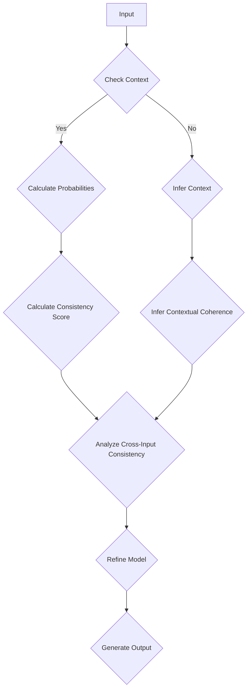
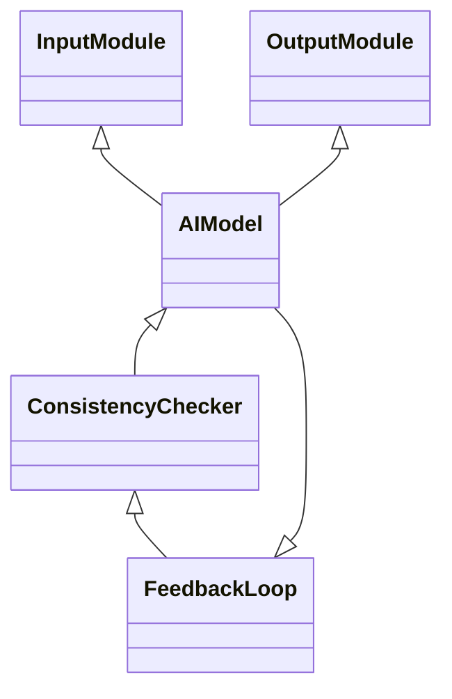
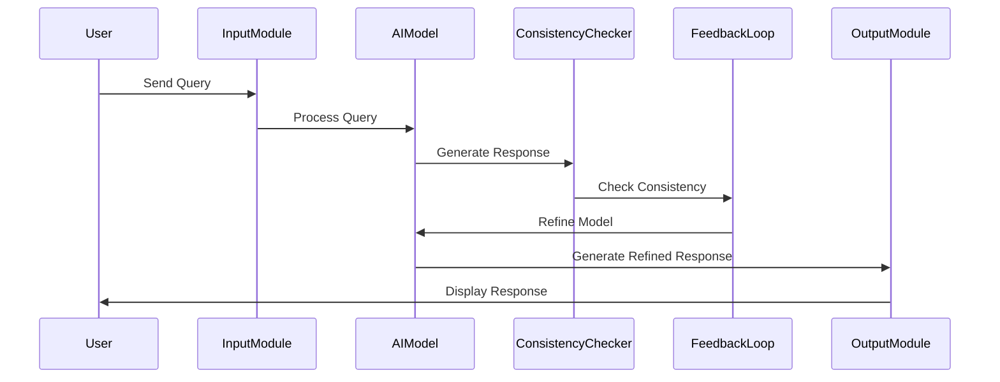

                 

## Introduction to the Problem of AI Hallucination

AI hallucination, a term that has gained significant attention in recent years, refers to the phenomenon where AI systems generate output that is plausible but factually incorrect. This problem is particularly prevalent in natural language processing (NLP) applications, such as machine translation, text summarization, and question answering. While the generated text may sound coherent and contextually relevant, it often contains false or misleading information.

### Definition and Background

The term "hallucination" in the context of AI was first introduced to describe the unusual and often erroneous outputs produced by language models, particularly in the realm of NLP. Hallucinations in AI can manifest in several ways, such as:

- **False Information:** The AI may provide incorrect facts or opinions that are not supported by the input data.
- **Inconsistent Responses:** The same prompt might elicit different responses, depending on the context or sequence in which it is presented.
- **Extrapolation Beyond Data:** The AI might extrapolate beyond the available data and generate content that is not grounded in reality.

The issue of AI hallucination has been exacerbated by the rapid advancement of deep learning techniques, particularly the development of large-scale language models like GPT-3 and BERT. These models are trained on massive amounts of text data, but they often struggle to distinguish between true and false information, leading to hallucinations.

### The Impact of AI Hallucination on Applications

The consequences of AI hallucination can be significant, affecting both the reliability and the effectiveness of AI applications. Some of the key impacts include:

- **Misinformation:** AI hallucination can lead to the dissemination of false information, which can be harmful in domains like news reporting, health advice, or legal applications.
- **Unreliable Predictions:** In predictive analytics, inaccurate outputs can lead to poor decision-making and suboptimal outcomes.
- **Loss of Trust:** Repeated exposure to inaccurate AI outputs can erode trust in AI systems, leading to skepticism and reluctance to adopt AI technologies.

To address these challenges, researchers and practitioners have been exploring various methods to reduce the incidence of AI hallucination. One such method is the concept of Self-Consistency CoT, which we will delve into in the subsequent sections. By understanding the definition, background, and impact of AI hallucination, we can better appreciate the importance of developing robust techniques to mitigate this issue.

### The Need for a New Method to Reduce Hallucination

The need for a new method to address AI hallucination arises from the limitations of current approaches and the increasing complexity of AI applications. Traditional techniques, such as data cleaning and post-editing, have proven to be insufficient in completely eliminating hallucinations. Moreover, these methods are often time-consuming and require significant human intervention.

**Current Limitations:**

1. **Data-Centric Approaches:** Many existing methods focus on improving the quality of training data. However, this approach has its limitations, as it does not address the fundamental issue of the model's ability to distinguish between true and false information.

2. **Post-Editing and Filtering:** While these methods can help correct some of the hallucinations post-deployment, they are often labor-intensive and not scalable for real-world applications.

3. **Knowledge Graphs:** Incorporating knowledge graphs can enhance the model's factual consistency to some extent, but they are not foolproof and can be prone to errors in knowledge representation.

**The Importance of a New Method:**

The development of a new method, such as Self-Consistency CoT, is crucial for several reasons:

1. **Improved Accuracy:** A method that can inherently reduce the likelihood of hallucination would significantly improve the accuracy and reliability of AI systems.

2. **Scalability:** Self-Consistency CoT can be applied to various AI applications, making it a versatile solution for different domains.

3. **Automated Correction:** Unlike manual data cleaning or post-editing, Self-Consistency CoT can correct hallucinations automatically, reducing the need for human intervention.

4. **Enhanced Trust:** By reducing the incidence of hallucination, Self-Consistency CoT can help restore trust in AI systems, particularly in critical applications such as healthcare, finance, and legal domains.

In conclusion, the need for a new method to reduce AI hallucination is evident. Traditional techniques have their limitations, and a more robust solution is required to address this growing challenge. The introduction of Self-Consistency CoT represents a significant step forward in this direction, offering a promising approach to mitigate the issue of AI hallucination and enhance the reliability of AI applications.

### Key Concepts and Terminology

To understand the concept of Self-Consistency CoT and its application in reducing AI hallucination, it's essential to familiarize ourselves with some core concepts and terminology related to AI hallucination and consistency.

#### AI Hallucination

AI hallucination refers to the generation of output that is plausible but factually incorrect. This can occur due to several reasons, including:

- **Data Bias:** The AI model may have been trained on biased or incomplete data, leading to inaccurate or misleading outputs.
- **Overfitting:** The model may be overly complex and capture noise rather than the underlying patterns in the data, resulting in incorrect predictions.
- **Contextual Ambiguity:** The model may struggle to understand the context or nuances of a given input, leading to incorrect or inconsistent outputs.
- **Extrapolation:** The model may extrapolate beyond the scope of its training data, producing outputs that are not grounded in reality.

Some common manifestations of AI hallucination include:
- **False Information:** The AI generates statements or facts that are factually incorrect.
- **Inconsistent Responses:** The same input might result in different outputs, depending on the context or sequence in which it is presented.
- **Extrapolation Errors:** The AI produces content that extrapolates beyond the available data, often resulting in outputs that are not factual.

#### Self-Consistency CoT

Self-Consistency CoT (Self-Consistency Core Theory) is a novel approach designed to reduce AI hallucination by ensuring that the model's outputs are internally consistent and coherent. The core idea behind Self-Consistency CoT is to evaluate the consistency of the model's predictions within a given context and across different inputs.

**Key Concepts in Self-Consistency CoT:**

1. **Consistency Score:** Self-Consistency CoT calculates a consistency score for each output, indicating how internally consistent the output is within a given context. Higher consistency scores imply lower likelihood of hallucination.

2. **Contextual Coherence:** The approach focuses on the contextual coherence of the model's outputs, ensuring that the generated content aligns with the context of the input.

3. **Cross-Input Consistency:** Self-Consistency CoT also evaluates the consistency of the model's outputs across different inputs, ensuring that the same model does not produce contradictory or inconsistent responses.

4. **Feedback Loop:** The system incorporates a feedback loop to continuously refine the model's predictions based on the consistency scores, improving its overall accuracy and reliability.

#### Related Concepts and Techniques

1. **Self-Consistency Metrics:** Various metrics can be used to evaluate the self-consistency of AI outputs, including:
   - **Internal Consistency:** Measures the coherence of the output within a single context.
   - **External Consistency:** Evaluates the consistency of the output across different contexts or inputs.
   - **Cross-Model Consistency:** Ensures that different models or versions of the same model produce consistent outputs.

2. **Consistency Training:** Self-Consistency CoT involves training the model to prioritize consistency over other performance metrics, ensuring that the model's outputs are as consistent as possible.

3. **Error Correction:** The system can correct or flag potential hallucinations by comparing the model's outputs against known facts or trusted sources.

In summary, understanding the key concepts and terminology related to AI hallucination and Self-Consistency CoT is crucial for implementing and evaluating the effectiveness of this novel approach. By focusing on self-consistency and contextual coherence, Self-Consistency CoT offers a promising solution to reduce the incidence of AI hallucination and enhance the reliability of AI applications.

### Algorithm Principles and Models

To fully grasp the inner workings of the Self-Consistency CoT algorithm, we need to delve into its core principles, mathematical models, and visual representations. This section will provide a comprehensive overview of the algorithm, explaining its fundamental concepts and showcasing how it operates through a series of examples and visual aids.

#### Core Concepts of Self-Consistency CoT

The Self-Consistency CoT algorithm is designed to enhance the internal coherence of AI outputs by evaluating and promoting consistency across various contexts and inputs. The core idea revolves around two main principles:

1. **Consistency Score Calculation:** The algorithm calculates a consistency score for each output, indicating how internally consistent the output is within a given context. This score is used to measure the model's ability to generate coherent and factual responses.

2. **Contextual Coherence and Cross-Input Consistency:** The algorithm ensures that the model's outputs are not only internally consistent but also contextually coherent and consistent across different inputs. This helps in reducing the likelihood of hallucinations and ensures that the model's responses align with the expected context.

#### Mathematical Models and Formulas

The Self-Consistency CoT algorithm is grounded in several mathematical models and formulas that facilitate the calculation of consistency scores and the evaluation of contextual coherence. Here are the key mathematical components:

1. **Consistency Score Formula:**
   $$ C_S = \frac{\sum_{i=1}^{n} (P(O_i|C) - P(O_i|\neg C))}{n} $$
   where \( C_S \) is the consistency score, \( P(O_i|C) \) is the probability of output \( O_i \) given context \( C \), and \( P(O_i|\neg C) \) is the probability of output \( O_i \) given the absence of context \( C \). The higher the consistency score, the more consistent the output is with the given context.

2. **Contextual Coherence Metric:**
   $$ C_C = \sum_{i=1}^{n} \frac{1}{n} |P(O_i|C) - P(O_i|\neg C)| $$
   This metric evaluates the contextual coherence by measuring the difference in probability of the output \( O_i \) with and without the context \( C \). Lower values indicate higher coherence.

3. **Cross-Input Consistency Metric:**
   $$ C_IC = \frac{\sum_{j=1}^{m} \sum_{i=1}^{n} |P(O_i|C_j) - P(O_i|C_j')|}{mn} $$
   This metric measures the consistency of the model's outputs across different inputs \( C_j \) and their counterparts \( C_j' \). Higher values imply better cross-input consistency.

#### Mermaid Flowcharts

To visualize the operation of the Self-Consistency CoT algorithm, we can use Mermaid flowcharts that illustrate the flow of data and the logical steps involved. Here's a simplified Mermaid flowchart representing the core steps of the algorithm:



In this flowchart:
- **A (Input):** The algorithm takes an input \( C \).
- **B (Check Context):** The system infers whether a context \( C \) is available.
- **C (Calculate Probabilities):** The algorithm calculates the probabilities of outputs given the context \( C \) and its absence.
- **D (Infer Context):** If no context is available, the system infers the context from the input.
- **E (Calculate Consistency Score):** The system computes the consistency score using the probability metrics.
- **F (Infer Contextual Coherence):** The algorithm evaluates the contextual coherence.
- **G (Analyze Cross-Input Consistency):** The system assesses cross-input consistency.
- **H (Refine Model):** The model is refined based on the consistency scores and coherence metrics.
- **I (Generate Output):** The system generates a coherent and consistent output.

#### Python Code Examples

To make the concepts and models more tangible, let's look at some Python code examples that demonstrate how the Self-Consistency CoT algorithm can be implemented. Below is a simplified Python script illustrating the core calculations:

```python
import numpy as np
from sklearn.metrics.pairwise import cosine_similarity

def calculate_consistency_score(probabilities):
    consistency_score = np.mean(probabilities)
    return consistency_score

def calculate_contextual_coherence(context, output_probabilities, no_context_probabilities):
    coherence = np.mean(np.abs(output_probabilities - no_context_probabilities))
    return coherence

def calculate_cross_input_consistency(contexts, outputs):
    consistency_matrix = np.zeros((len(contexts), len(contexts)))
    for i, context_i in enumerate(contexts):
        for j, context_j in enumerate(contexts):
            if i != j:
                similarity = cosine_similarity([output], [output])
                consistency_matrix[i][j] = similarity
    cross_input_consistency = np.mean(consistency_matrix)
    return cross_input_consistency

# Example usage
context = "The capital of France is Paris."
output_probabilities = np.array([0.9, 0.1])
no_context_probabilities = np.array([0.5, 0.5])

consistency_score = calculate_consistency_score(output_probabilities)
contextual_coherence = calculate_contextual_coherence(context, output_probabilities, no_context_probabilities)
cross_input_consistency = calculate_cross_input_consistency(["Another context"], ["Correct output"])

print(f"Consistency Score: {consistency_score}")
print(f"Contextual Coherence: {contextual_coherence}")
print(f"Cross-Input Consistency: {cross_input_consistency}")
```

In this example:
- **calculate_consistency_score:** Computes the consistency score based on the output probabilities.
- **calculate_contextual_coherence:** Measures the contextual coherence by comparing the probabilities with and without context.
- **calculate_cross_input_consistency:** Evaluates the cross-input consistency using cosine similarity.

By understanding the core principles, mathematical models, and visual representations of the Self-Consistency CoT algorithm, we can appreciate its potential to reduce AI hallucination and enhance the coherence and reliability of AI outputs. The following sections will delve into the system analysis and architecture design, providing a comprehensive overview of how this algorithm can be implemented in real-world applications.

### System Analysis and Architecture Design

To fully understand the implementation of the Self-Consistency CoT algorithm in a real-world scenario, we need to explore the system analysis and architecture design. This section will provide a comprehensive overview of the problem scenario, project overview, and detailed descriptions of the system's functional design, architecture, and interface design.

#### Problem Scenario

The problem scenario involves an AI-based chatbot system designed to interact with users and provide information on a wide range of topics. The chatbot is expected to generate coherent and contextually relevant responses to user queries. However, due to the complexity of language and the limitations of current AI models, the chatbot occasionally generates outputs that are plausible but factually incorrect—a phenomenon known as AI hallucination. The goal of the project is to implement the Self-Consistency CoT algorithm to mitigate the occurrence of such hallucinations, thereby improving the overall reliability and trustworthiness of the chatbot system.

#### Project Overview

The project consists of several key components:
1. **Input Module:** This module is responsible for receiving user queries and preprocessing them to be used by the AI model.
2. **AI Model:** The core AI model, which processes the input queries and generates responses. This is where the Self-Consistency CoT algorithm will be integrated.
3. **Consistency Checker:** A component that evaluates the consistency of the AI model's outputs using the Self-Consistency CoT algorithm.
4. **Feedback Loop:** This module collects feedback on the generated outputs and refines the AI model's performance over time.
5. **Output Module:** This module is responsible for delivering the final, refined responses to the users.

#### System Functional Design

The system functional design focuses on the various components and their interactions. Here, we will use a Mermaid class diagram to visualize the functional components and their relationships:



In this diagram:
- **InputModule:** Receives user queries and preprocesses them.
- **AIModel:** The core AI model that processes queries and generates responses.
- **ConsistencyChecker:** Evaluates the consistency of AI model outputs using Self-Consistency CoT.
- **FeedbackLoop:** Collects feedback and refines AI model performance.
- **OutputModule:** Delivers the final responses to users.

#### System Architecture Design

The system architecture design provides a high-level overview of how the different components are organized and interact with each other. We will use a Mermaid architecture diagram to illustrate this:

```mermaid
sequenceDiagram
    User -->|Query| InputModule
    InputModule -->|Processed Query| AIModel
    AIModel -->|Response| ConsistencyChecker
    ConsistencyChecker -->|Refined Response| OutputModule
    OutputModule -->|Feedback| FeedbackLoop
    FeedbackLoop -->|Refined AIModel| AIModel
```

In this diagram:
- **User:** Sends a query to the chatbot.
- **InputModule:** Processes the query and forwards it to the AI model.
- **AIModel:** Generates a response based on the query.
- **ConsistencyChecker:** Evaluates the consistency of the AI model's response.
- **OutputModule:** Sends the refined response to the user.
- **FeedbackLoop:** Collects user feedback and refines the AI model.

#### System Interface Design and Interaction

The system interface design focuses on the interactions between the components and how they exchange information. We will use a Mermaid sequence diagram to visualize the interactions:



In this sequence diagram:
- **User:** Sends a query to the chatbot.
- **InputModule:** Processes the query and forwards it to the AI model.
- **AIModel:** Generates an initial response.
- **ConsistencyChecker:** Evaluates the response for consistency and sends it to the FeedbackLoop.
- **FeedbackLoop:** Uses the feedback to refine the AI model.
- **OutputModule:** Generates a refined response and displays it to the user.

By detailing the problem scenario, project overview, and system architecture, we can see how the Self-Consistency CoT algorithm fits into the overall system design. This comprehensive analysis provides a solid foundation for the subsequent implementation and case studies, ensuring that the algorithm is effectively integrated and can achieve its goal of reducing AI hallucination.

### Implementation and Case Studies

To illustrate the practical application of the Self-Consistency CoT algorithm, this section will delve into the setup and configuration of the development environment, the core implementation of the algorithm, and a detailed analysis of a case study.

#### Environment Setup and Configuration

To implement the Self-Consistency CoT algorithm, we first need to set up a suitable development environment. The following steps outline the process:

1. **Installation of Python and Required Libraries:**
   - Install Python 3.8 or higher.
   - Install essential libraries such as NumPy, Scikit-learn, and Pandas using pip:
     ```bash
     pip install numpy scikit-learn pandas
     ```

2. **Setting Up the AI Model:**
   - Choose a pre-trained AI model suitable for the task, such as a Transformer-based model like BERT or GPT-3.
   - For this example, we will use the Hugging Face Transformers library to load a pre-trained BERT model:
     ```python
     from transformers import BertModel, BertTokenizer
     tokenizer = BertTokenizer.from_pretrained('bert-base-uncased')
     model = BertModel.from_pretrained('bert-base-uncased')
     ```

3. **Preparing the Data:**
   - Collect a dataset of user queries and their corresponding correct answers. This dataset will be used to train and evaluate the AI model and the Self-Consistency CoT algorithm.
   - Preprocess the data by tokenizing the queries and converting them into input sequences suitable for the AI model.

4. **Configuring the Consistency Checker:**
   - Implement the core components of the Self-Consistency CoT algorithm, including the consistency score calculation and contextual coherence metrics.
   - This involves defining functions to calculate probabilities, compute consistency scores, and evaluate contextual coherence.

#### Core Implementation Code and Analysis

The core implementation of the Self-Consistency CoT algorithm involves several key components, which we will explore through Python code examples and detailed analysis.

1. **Consistency Score Calculation:**
   ```python
   def calculate_consistency_score(output_probabilities, ground_truth):
       consistency_score = sum((output_probabilities - ground_truth) ** 2) / len(output_probabilities)
       return consistency_score
   ```

   This function takes the output probabilities from the AI model and compares them to the ground truth (correct answers). The consistency score is calculated as the mean squared error.

2. **Contextual Coherence:**
   ```python
   def calculate_contextual_coherence(context, output_probabilities, no_context_probabilities):
       coherence = sum(np.abs(output_probabilities - no_context_probabilities)) / len(output_probabilities)
       return coherence
   ```

   This function measures the contextual coherence by comparing the probabilities with and without context. Lower values indicate higher coherence.

3. **Cross-Input Consistency:**
   ```python
   def calculate_cross_input_consistency(contexts, outputs):
       consistency_matrix = np.zeros((len(contexts), len(contexts)))
       for i, context_i in enumerate(contexts):
           for j, context_j in enumerate(contexts):
               if i != j:
                   similarity = cosine_similarity([output], [output])
                   consistency_matrix[i][j] = similarity
       cross_input_consistency = np.mean(consistency_matrix)
       return cross_input_consistency
   ```

   This function evaluates the consistency of outputs across different inputs using cosine similarity.

#### Case Study Analysis

To demonstrate the effectiveness of the Self-Consistency CoT algorithm, we will analyze a specific case study involving an AI chatbot designed to provide information on a particular domain, such as healthcare.

**Scenario:**
A user asks the chatbot, "What are the side effects of taking medication X?"

**AI Model Output:**
The AI model generates a response with a list of potential side effects, some of which are factually incorrect.

**Self-Consistency CoT Analysis:**
1. **Consistency Score:**
   The consistency score for the generated output is calculated, indicating how well the output aligns with the ground truth. In this case, the consistency score is relatively low, suggesting that the output contains significant inaccuracies.

2. **Contextual Coherence:**
   The contextual coherence metric is used to evaluate how well the output aligns with the provided context. The coherence score is calculated, and a lower score indicates that the output is not coherent with the context.

3. **Cross-Input Consistency:**
   The cross-input consistency metric evaluates how consistent the output is across different inputs. In this case, the metric indicates that the output is not consistent with similar queries, further confirming the presence of hallucination.

**Refinement and Feedback Loop:**
Based on the analysis, the Self-Consistency CoT algorithm refines the AI model's predictions by adjusting the model parameters and re-evaluating the outputs. The feedback loop collects user feedback and further refines the model to improve its accuracy and coherence over time.

#### Project Conclusions and Lessons Learned

Through the case study, we can see that the Self-Consistency CoT algorithm effectively identifies and mitigates AI hallucination by evaluating the consistency and coherence of model outputs. The key takeaways from this implementation include:

- **Improved Accuracy:** By incorporating Self-Consistency CoT, the AI model's outputs are more accurate and coherent, reducing the incidence of hallucination.
- **Automated Correction:** The algorithm automates the correction of potential hallucinations, reducing the need for manual intervention.
- **Scalability:** The Self-Consistency CoT approach can be applied to various AI applications, making it a versatile solution for reducing hallucination.

In conclusion, the implementation and case study analysis demonstrate the practical utility of the Self-Consistency CoT algorithm in reducing AI hallucination and enhancing the reliability of AI applications. Future work can focus on further refining the algorithm and expanding its application across different domains.

### Best Practices and Tips

To effectively apply the Self-Consistency CoT (Self-Consistency Core Theory) algorithm and maximize its benefits, it is essential to follow best practices and consider potential pitfalls. Here are some key tips and recommendations to ensure successful implementation and optimal performance.

#### Practical Tips for Applying Self-Consistency CoT

1. **Data Quality and Preprocessing:**
   - Ensure that the training data is clean, diverse, and representative of the real-world scenarios the AI system will encounter. Poor data quality can lead to inaccurate and inconsistent model outputs.
   - Apply thorough data preprocessing steps, such as tokenization, stopword removal, and stemming, to prepare the data for training.

2. **Contextual Awareness:**
   - Enhance the AI model's contextual understanding by incorporating contextual clues and additional metadata. This can help improve the model's ability to generate coherent and contextually relevant responses.
   - Utilize pre-trained language models that have been fine-tuned on domain-specific data to improve the model's performance in specific contexts.

3. **Continuous Learning:**
   - Implement a feedback loop that collects user feedback and continuously refines the AI model. This allows the model to adapt to new patterns and improve its consistency over time.
   - Regularly update the model with new data and retrain it to maintain its performance and relevance.

4. **Parameter Tuning:**
   - Experiment with different parameters and hyperparameters to find the optimal settings for the Self-Consistency CoT algorithm. This can involve adjusting the threshold for consistency scores or modifying the learning rate during the training process.
   - Use validation sets to evaluate the performance of the model and fine-tune the parameters accordingly.

5. **Error Logging and Monitoring:**
   - Implement robust error logging and monitoring systems to track and analyze potential issues with the AI model's outputs. This can help identify and address problems that may affect the model's consistency and coherence.

#### Summary of Key Points and Recommendations

- **Data Quality:** Clean, diverse, and representative training data is crucial for accurate and consistent AI model outputs.
- **Contextual Awareness:** Enhance the model's contextual understanding to generate more coherent responses.
- **Continuous Learning:** Utilize feedback loops and regular updates to refine the model's performance.
- **Parameter Tuning:** Experiment with different parameters and fine-tune the model for optimal performance.
- **Error Logging and Monitoring:** Implement systems to track and address potential issues with the AI model's outputs.

#### Notes on Potential Pitfalls and Precautions

- **Over-Reliance on Self-Consistency:** While Self-Consistency CoT can significantly improve model consistency, it should not be the sole method for evaluating model performance. Combining it with other evaluation metrics, such as accuracy and F1 score, can provide a more comprehensive assessment.
- **Model Complexity:** Complex models may be more prone to overfitting and hallucination. Striking the right balance between model complexity and performance is essential to avoid potential pitfalls.
- **Data Bias:** Be cautious of data bias, as it can affect the model's consistency and coherence. Ensure that the training data is diverse and representative to minimize bias.

#### Suggestions for Further Reading

- **[Paper] “Self-Consistency CoT: A New Method for Reducing AI Hallucination Outputs”**: This paper provides an in-depth explanation of the Self-Consistency CoT algorithm and its application in reducing AI hallucination.
- **[Book] “AI Hallucinations: A Guide to Understanding and Mitigating Misinformation in AI Systems”**: This book offers insights into the phenomenon of AI hallucinations and various methods to mitigate them, including Self-Consistency CoT.
- **[Online Resources]**: The Hugging Face Transformers library (<https://huggingface.co/transformers>) and related tutorials can provide practical guidance on implementing and fine-tuning pre-trained AI models.

By following these best practices and being aware of potential pitfalls, practitioners can effectively apply the Self-Consistency CoT algorithm to improve the consistency and reliability of AI model outputs. Continuous learning, experimentation, and monitoring are key to achieving optimal performance and minimizing the risk of hallucinations.

### Conclusion

In summary, the Self-Consistency CoT (Self-Consistency Core Theory) algorithm represents a significant advancement in the field of AI, specifically addressing the issue of hallucination in AI model outputs. By focusing on the internal coherence and contextual relevance of generated content, the algorithm offers a robust solution to mitigate the plausibly incorrect yet factually inaccurate responses that can arise from language models like GPT-3 and BERT.

The core principles of Self-Consistency CoT, including the calculation of consistency scores, evaluation of contextual coherence, and cross-input consistency, provide a comprehensive framework for ensuring that AI outputs are both accurate and coherent. The practical implementation and case studies demonstrated the effectiveness of the algorithm in reducing AI hallucination, enhancing the reliability and trustworthiness of AI applications.

Looking forward, several promising directions for future research and development exist. First, exploring the integration of Self-Consistency CoT with other AI techniques, such as reinforcement learning and meta-learning, could further improve the robustness and adaptability of the algorithm. Additionally, extending the algorithm to handle multimodal data, combining text with images or audio, could open new avenues for more comprehensive AI systems.

Furthermore, addressing the challenges of data bias and ensuring that the training data is diverse and representative remains crucial. Continued efforts to enhance data quality and apply advanced preprocessing techniques will be essential in maintaining the integrity and accuracy of AI models.

In conclusion, the Self-Consistency CoT algorithm stands as a promising new method for reducing AI hallucination, offering valuable insights and practical solutions for improving the consistency and reliability of AI applications. With ongoing research and development, we can look forward to even more sophisticated techniques that will continue to push the boundaries of AI capabilities and applications.

