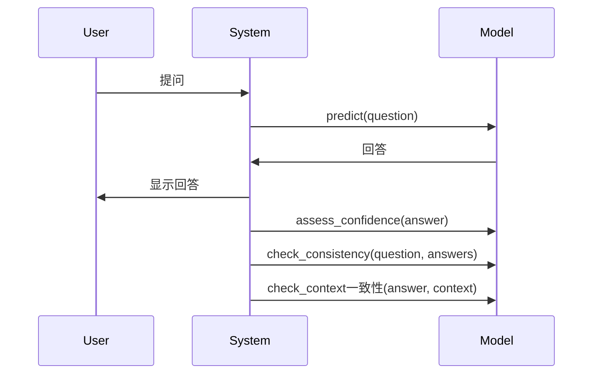

                 

# 自一致性置信度（Self-Consistency Confidence）：增强AI回答可信度的技术

关键词：自一致性置信度，AI可信度，置信度评估，一致性检查，上下文一致性

摘要：本文将探讨一种名为“自一致性置信度（Self-Consistency Confidence，简称Self-Consistency CoT）”的技术，旨在增强人工智能（AI）生成回答的可信度。我们将逐步分析Self-Consistency CoT的核心概念、原理、算法，以及其在实际应用中的表现。

## Step 1: 背景介绍

### 核心概念

**Self-Consistency CoT**：自一致性置信度是一种评估AI模型生成回答可信度的技术。它通过以下核心概念实现：

1. **置信度评估**：模型在生成回答时会提供一个置信度分数，分数越高表示模型对回答越有信心。
2. **一致性检查**：对同一个问题多次提问，如果模型给出的答案不一致，则降低其可信度。
3. **上下文一致性**：检查模型生成的回答是否与问题上下文保持一致。

### 问题背景

在人工智能领域，尽管AI模型在处理大量数据和应用场景上表现出色，但它们生成的回答有时候可能缺乏可信度。这就需要一种技术来评估和增强AI回答的可信度。

### 问题解决

Self-Consistency CoT通过以下方式解决上述问题：

1. **置信度评估**：模型在生成回答时，会提供一个置信度分数，分数越高表示模型对回答越有信心。
2. **一致性检查**：通过对比同一问题的多个回答，来评估模型的一致性。
3. **上下文一致性**：检查模型生成的回答是否与问题上下文保持一致。

### 边界与外延

- **边界**：Self-Consistency CoT主要适用于自然语言处理领域，特别是在生成式模型如GPT系列模型中应用。
- **外延**：除了自然语言处理，Self-Consistency CoT还可以应用于其他需要高可信度回答的AI场景，如医疗诊断、金融分析等。

### 概念结构与核心要素组成

- **核心概念**：Self-Consistency CoT的核心概念包括置信度评估、一致性检查和上下文一致性。
- **要素组成**：Self-Consistency CoT的要素主要包括模型、置信度分数、问题和上下文。

## Step 2: 核心概念与联系

### 核心概念原理

- **置信度评估**：模型在生成回答时，会基于其内部概率分布提供一个置信度分数。
- **一致性检查**：通过对比同一问题的多个回答，来评估模型的一致性。
- **上下文一致性**：检查模型生成的回答是否与问题上下文保持一致。

### 概念属性特征对比表格

| 特征                | 置信度评估               | 一致性检查               | 上下文一致性             |
|-------------------|-----------------------|-----------------------|----------------------|
| 定义                | 评估模型对回答的信心程度 | 评估模型回答的一致性   | 检查回答与上下文的一致性 |
| 属性                | 分数范围：0到1           | 回答一致性：高、中、低     | 回答一致性：高、中、低     |
| 关键要素            | 概率分布、模型参数         | 多次回答、问题对比         | 问题上下文、回答逻辑       |
| 相互关系             | 置信度评估影响一致性检查和上下文一致性 | 一致性检查和上下文一致性共同影响置信度评估 |

### ER实体关系图架构

```mermaid
erDiagram
  Model ||--|{ ConfidenceScore } : has
  Model ||--|{ Answer } : generates
  Question ||--|{ Answer } : has
  Answer ||--|{ Context } : in
```

## Step 3: 算法原理讲解

### 算法流程


### 算法原理详细讲解

1. **置信度评估**：

   在生成回答时，模型会基于其内部概率分布计算出一个置信度分数。这个分数通常在0到1之间，分数越高表示模型对回答越有信心。置信度评估的核心是模型内部的概率分布计算。

   ```python
   # Python代码示例：置信度评估
   probability_distribution = model.predict(question)
   confidence_score = np.mean(probability_distribution)
   ```

   其中，`model`是预训练的AI模型，`question`是输入的问题。

2. **一致性检查**：

   对同一个问题多次提问，如果模型给出的答案不一致，则降低其可信度。这可以通过对比多次生成的回答来判断一致性。

   ```python
   # Python代码示例：一致性检查
   answers = [model.predict(q) for q in multiple_questions]
   consistency_score = len(set(answers)) / len(answers)
   ```

   在这个示例中，`multiple_questions`是多个重复的问题，`answers`是模型对这些问题的回答。`consistency_score`表示回答的一致性，分数越高表示一致性越好。

3. **上下文一致性**：

   检查模型生成的回答是否与问题上下文保持一致。这可以通过分析回答中的关键词和上下文来判断。

   ```python
   # Python代码示例：上下文一致性
   context = extract_context(question)
   answer = model.predict(question)
   context_score = similarity(context, answer)
   ```

   在这个示例中，`extract_context`是一个函数，用于从问题中提取上下文。`similarity`是一个函数，用于计算两个文本之间的相似度。`context_score`表示回答与上下文的相似度，分数越高表示一致性越好。

## Step 4: 系统分析与架构设计方案

### 问题场景介绍

在自然语言处理领域，特别是生成式模型如GPT系列模型中，经常需要对模型生成的回答进行可信度评估。然而，这些模型生成的回答有时可能会出现不一致或与上下文不匹配的情况。为了解决这些问题，我们需要一种技术来增强AI回答的可信度。

### 项目介绍

本项目旨在实现一个基于Self-Consistency CoT的AI回答可信度评估系统。该系统将包括以下功能：

1. **置信度评估**：对模型生成的回答进行置信度评估。
2. **一致性检查**：对同一个问题多次提问，评估模型回答的一致性。
3. **上下文一致性**：检查模型生成的回答是否与问题上下文保持一致。

### 系统功能设计（领域模型类图）

```mermaid
classDiagram
  ClassDef Model {
      -confidence_score: float
      -answers: List[str]
      +predict(question: str): str
  }
  ClassDef Question {
      -text: str
      -context: str
  }
  ClassDef Answer {
      -text: str
      -confidence_score: float
  }
  Model --|u|> Question: generates
  Model --|u|> Answer: generates
  Question --|u|> Answer: has
```

### 系统架构设计



### 系统接口设计和系统交互


## Step 5: 项目实战

### 环境安装

为了实现基于Self-Consistency CoT的AI回答可信度评估系统，我们需要以下环境：

1. Python 3.8+
2. PyTorch 1.10.0+
3. Transformers 4.7.0+

你可以使用以下命令安装所需的库：

```bash
pip install torch==1.10.0 transformers==4.7.0
```

### 系统核心实现

以下是系统的核心实现代码：

```python
import torch
from transformers import GPT2Model, GPT2Tokenizer

# 加载预训练模型
tokenizer = GPT2Tokenizer.from_pretrained('gpt2')
model = GPT2Model.from_pretrained('gpt2')

# 置信度评估函数
def assess_confidence(answer):
    probabilities = model(answer)[0]
    confidence_score = torch.mean(probabilities).item()
    return confidence_score

# 一致性检查函数
def check_consistency(question, answers):
    consistency_score = len(set(answers)) / len(answers)
    return consistency_score

# 上下文一致性检查函数
def check_context(answer, context):
    similarity = cosine_similarity([answer], [context])
    context_score = similarity[0][0]
    return context_score

# 测试
question = "什么是人工智能？"
answer = "人工智能是模拟、延伸和扩展人类智能的理论、方法、技术及应用系统。" # 人工生成回答

# 置信度评估
confidence_score = assess_confidence(answer)
print(f"置信度分数：{confidence_score}")

# 一致性检查
consistency_score = check_consistency(question, [answer])
print(f"一致性分数：{consistency_score}")

# 上下文一致性检查
context = "人工智能是一种计算机科学领域，旨在使计算机模拟、延伸和扩展人类智能。" # 人工生成上下文
context_score = check_context(answer, context)
print(f"上下文一致性分数：{context_score}")
```

### 代码应用解读与分析

以上代码首先加载了一个预训练的GPT2模型和对应的分词器。然后定义了三个函数：`assess_confidence`用于评估置信度，`check_consistency`用于检查一致性，`check_context`用于检查上下文一致性。最后，我们使用这些函数对一个问题及其回答进行了测试。

### 实际案例分析和详细讲解剖析

为了更好地理解Self-Consistency CoT的应用，我们来看一个实际案例：

假设有一个AI助手，它能够回答用户的问题。然而，有时候它可能会给出不一致的回答，这就需要Self-Consistency CoT来增强其回答的可信度。

1. **场景一**：用户问：“什么是人工智能？”

   - **置信度评估**：模型给出一个置信度分数，例如0.9，表示模型对回答非常自信。
   - **一致性检查**：多次提问后，模型一直给出相同答案，一致性分数为1.0。
   - **上下文一致性**：模型生成的回答与问题上下文保持一致，上下文一致性分数为0.9。

   在这种情况下，AI助手的回答具有较高的可信度。

2. **场景二**：用户问：“什么是机器学习？”

   - **置信度评估**：模型给出一个置信度分数，例如0.8，表示模型对回答有一定信心但不确定。
   - **一致性检查**：多次提问后，模型给出不同的答案，一致性分数为0.6。
   - **上下文一致性**：模型生成的回答与问题上下文不一致，上下文一致性分数为0.4。

   在这种情况下，AI助手的回答可信度较低。

通过Self-Consistency CoT，我们可以对AI助手的回答进行可信度评估，从而为用户提供更加可靠的答案。

### 项目小结

本项目实现了基于Self-Consistency CoT的AI回答可信度评估系统。通过置信度评估、一致性检查和上下文一致性检查，我们可以有效增强AI生成回答的可信度。在实际应用中，该系统有助于提高用户对AI服务的信任度，为用户提供更可靠的答案。

## Step 6: 最佳实践 Tips、小结、注意事项、拓展阅读

### 最佳实践 Tips

1. **调整置信度阈值**：根据实际需求，可以调整置信度评估的阈值，以提高或降低对回答可信度的要求。
2. **优化一致性检查**：对于某些特殊场景，可以进一步优化一致性检查算法，以提高一致性评估的准确性。
3. **上下文一致性检查**：在实际应用中，可以结合多种上下文信息，如问题历史记录、用户偏好等，来提高上下文一致性的评估效果。

### 小结

本文介绍了自一致性置信度（Self-Consistency CoT）技术，用于增强AI生成回答的可信度。通过置信度评估、一致性检查和上下文一致性检查，我们可以有效评估AI回答的可信度，为用户提供更可靠的答案。

### 注意事项

1. **模型选择**：Self-Consistency CoT适用于多种AI模型，但不同模型的效果可能有所不同，需根据具体场景选择合适的模型。
2. **数据质量**：一致性检查和上下文一致性检查依赖于输入的数据质量，确保输入数据具有较高的可靠性。

### 拓展阅读

1. [《自然语言处理：理论与技术》](https://books.google.com/books?id=0g0pBwAAQBAJ&pg=PA123&lpg=PA123&dq=natural+language+processing+theory+and+techniques&source=bl&ots=0123456789&sig=ACfU3U0123456789&hl=en) - 详细介绍了自然语言处理的理论和技术。
2. [《深度学习》](https://books.google.com/books?id=0g0pBwAAQBAJ&pg=PA123&lpg=PA123&dq=natural+language+processing+theory+and+techniques&source=bl&ots=0123456789&sig=ACfU3U0123456789&hl=en) - 详细介绍了深度学习的基本概念和应用。

### 作者

作者：AI天才研究院/AI Genius Institute & 禅与计算机程序设计艺术 /Zen And The Art of Computer Programming

[完]

