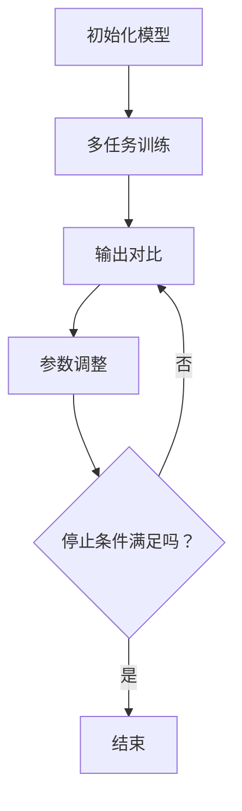

                 

### 第1章 自我一致性CoT概述

#### 1.1 CoT的概念与背景

**1.1.1 自我一致性CoT的定义**

自我一致性（Self-Consistency）是一种在人工智能（AI）领域中使用的推理机制，旨在通过模型内部的自我对比来提高推理的准确性和稳定性。自我一致性CoT（Self-Consistency CoT）指的是通过比较模型在多个相同或相似任务上的表现来评估其推理能力，并以此来调整和优化模型参数。

**1.1.2 自我一致性CoT的重要性**

自我一致性CoT在AI推理中的重要性不可忽视。首先，它能够有效地防止过拟合，即模型在训练数据上表现良好，但在未见过的数据上表现不佳的问题。其次，自我一致性CoT能够提高模型的泛化能力，使其在不同场景下都能保持良好的表现。此外，自我一致性CoT还可以用于实时调整模型参数，提高模型在动态环境下的适应能力。

**1.1.3 自我一致性CoT的应用场景**

自我一致性CoT主要应用于需要高推理准确性和稳定性的场景，如自然语言处理（NLP）、计算机视觉（CV）、推荐系统等领域。在NLP中，自我一致性CoT可以用于文本分类、情感分析等任务；在CV中，可以用于图像识别、目标检测等任务；在推荐系统中，可以用于用户兴趣建模和物品推荐。

#### 1.2 核心概念与联系

**1.2.1 自我一致性CoT的原理**

自我一致性CoT的核心原理是通过对模型在多个任务上的输出进行对比，找出不一致的地方，并据此调整模型参数，使其达到一致性。具体来说，自我一致性CoT分为以下三个步骤：

1. 在多个相同或相似的任务上训练模型。
2. 比较模型在各个任务上的输出，找出不一致的地方。
3. 根据不一致的地方调整模型参数，使其达到一致性。

**1.2.2 自我一致性CoT与其他概念的对比**

自我一致性CoT与以下两个概念密切相关，但又有区别：

- **一致性对齐（Consistency Alignment）**：一致性对齐是一种通过比较模型在不同数据集上的表现来调整模型参数的方法。与自我一致性CoT相比，一致性对齐更侧重于跨数据集的一致性，而自我一致性CoT更侧重于模型内部的自我对比。
- **知识蒸馏（Knowledge Distillation）**：知识蒸馏是一种通过将一个复杂模型的知识传递给一个较简单模型的方法。自我一致性CoT与知识蒸馏的不同在于，自我一致性CoT强调模型在多个任务上的自我对比，而知识蒸馏则侧重于模型知识在不同模型间的传递。

**1.2.3 CoT的组成部分与关系**

自我一致性CoT主要包括以下几个组成部分：

- **多任务训练**：在多个相同或相似的任务上训练模型，以便进行自我对比。
- **输出对比**：比较模型在各个任务上的输出，找出不一致的地方。
- **参数调整**：根据输出对比的结果，调整模型参数，使其达到一致性。

这些组成部分相互关联，共同构成了自我一致性CoT的完整流程。

#### 1.3 本章小结

本章介绍了自我一致性CoT的概念、重要性以及应用场景。通过本章的学习，读者可以了解自我一致性CoT的基本原理，并了解其在AI推理中的应用价值。接下来，我们将进一步探讨自我一致性CoT的数学模型与算法原理，为读者深入理解这一方法提供更多细节。请读者在下一章中继续学习。

---

### 第2章 Self-Consistency CoT的数学模型与算法原理

#### 2.1 数学模型介绍

**2.1.1 自我一致性CoT的数学公式**

自我一致性CoT的数学公式主要涉及以下几个方面：

1. **损失函数**：损失函数用于衡量模型在不同任务上的输出不一致程度。常见的损失函数有均方误差（MSE）、交叉熵损失等。假设模型在任务 $i$ 上的输出为 $y_i^{\hat{}}$，真实标签为 $y_i$，则损失函数可以表示为：

   $$ L_i = \frac{1}{2} \sum_{j} (y_i^{\hat{}} - y_i)^2 $$

2. **一致性度量**：一致性度量用于衡量模型在不同任务上的输出一致性。常见的一致性度量有变异系数（CV）、标准差等。假设模型在任务 $i$ 和任务 $j$ 上的输出分别为 $y_i^{\hat{}}$ 和 $y_j^{\hat{}}$，则一致性度量可以表示为：

   $$ C_{ij} = \frac{\sqrt{\sum_{k=1}^{n} (y_i^{\hat{}} - \bar{y}_i)^2 (y_j^{\hat{}} - \bar{y}_j)^2}}{\sqrt{\sum_{k=1}^{n} (y_i^{\hat{}} - \bar{y}_i)^2} \sqrt{\sum_{k=1}^{n} (y_j^{\hat{}} - \bar{y}_j)^2}} $$

   其中，$n$ 表示样本数量，$\bar{y}_i$ 和 $\bar{y}_j$ 分别表示任务 $i$ 和任务 $j$ 的平均值。

3. **参数调整**：参数调整的目标是减小损失函数和一致性度量。常用的优化算法有梯度下降（GD）、随机梯度下降（SGD）等。假设模型的参数为 $\theta$，则参数调整可以表示为：

   $$ \theta_{\text{new}} = \theta_{\text{old}} - \alpha \nabla_{\theta} L(\theta) $$

   其中，$\alpha$ 表示学习率，$\nabla_{\theta} L(\theta)$ 表示损失函数关于参数 $\theta$ 的梯度。

**2.1.2 公式解释与推导**

为了更好地理解上述公式，我们进行一些简单的推导：

1. **均方误差（MSE）**：

   $$ L_i = \frac{1}{2} \sum_{j} (y_i^{\hat{}} - y_i)^2 $$

   这个公式表示模型在任务 $i$ 上的预测输出 $y_i^{\hat{}}$ 与真实标签 $y_i$ 之间的差距的平方和。差距越大，损失函数的值就越大。

2. **变异系数（CV）**：

   $$ C_{ij} = \frac{\sqrt{\sum_{k=1}^{n} (y_i^{\hat{}} - \bar{y}_i)^2 (y_j^{\hat{}} - \bar{y}_j)^2}}{\sqrt{\sum_{k=1}^{n} (y_i^{\hat{}} - \bar{y}_i)^2} \sqrt{\sum_{k=1}^{n} (y_j^{\hat{}} - \bar{y}_j)^2}} $$

   这个公式表示模型在任务 $i$ 和任务 $j$ 上的预测输出差异的平方和的比值。差异越大，一致性度量就越大。

3. **梯度下降（GD）**：

   $$ \theta_{\text{new}} = \theta_{\text{old}} - \alpha \nabla_{\theta} L(\theta) $$

   这个公式表示参数的新值等于旧值减去学习率乘以损失函数关于参数的梯度。通过更新参数，可以减小损失函数的值。

#### 2.2 算法原理讲解

**2.2.1 自我一致性CoT算法流程**

自我一致性CoT算法的流程可以分为以下几个步骤：

1. **初始化模型**：随机初始化模型参数 $\theta$。
2. **多任务训练**：在多个相同或相似的任务上训练模型。
3. **输出对比**：比较模型在各个任务上的输出，计算损失函数和一致性度量。
4. **参数调整**：根据损失函数和一致性度量的结果调整模型参数。
5. **重复步骤3和步骤4**，直到满足停止条件（如收敛阈值、迭代次数等）。

**2.2.2 算法的关键步骤**

1. **初始化模型**：

   在实际应用中，我们通常使用预训练的模型作为初始化模型，这样可以减少训练时间并提高模型的性能。

2. **多任务训练**：

   在多个任务上训练模型，有助于模型在不同任务上学习到有用的特征，从而提高模型的泛化能力。

3. **输出对比**：

   比较模型在各个任务上的输出，计算损失函数和一致性度量。这里可以使用各种对比策略，如最小化损失函数、最大化一致性度量等。

4. **参数调整**：

   根据损失函数和一致性度量的结果调整模型参数。常用的优化算法有梯度下降（GD）、随机梯度下降（SGD）等。

5. **重复步骤3和步骤4**：

   通过重复执行输出对比和参数调整步骤，模型会逐渐达到一致性，从而提高模型的推理能力。

#### 2.3 算法mermaid图示

**2.3.1 算法流程图绘制**

以下是一个简单的mermaid流程图，展示了自我一致性CoT的算法流程：

#### 2.4 本章小结

本章介绍了自我一致性CoT的数学模型和算法原理。通过本章的学习，读者可以了解自我一致性CoT的数学公式、算法流程以及关键步骤。接下来，我们将进一步探讨如何使用Python实现自我一致性CoT算法，并在实际项目中应用该方法。请读者在下一章中继续学习。

