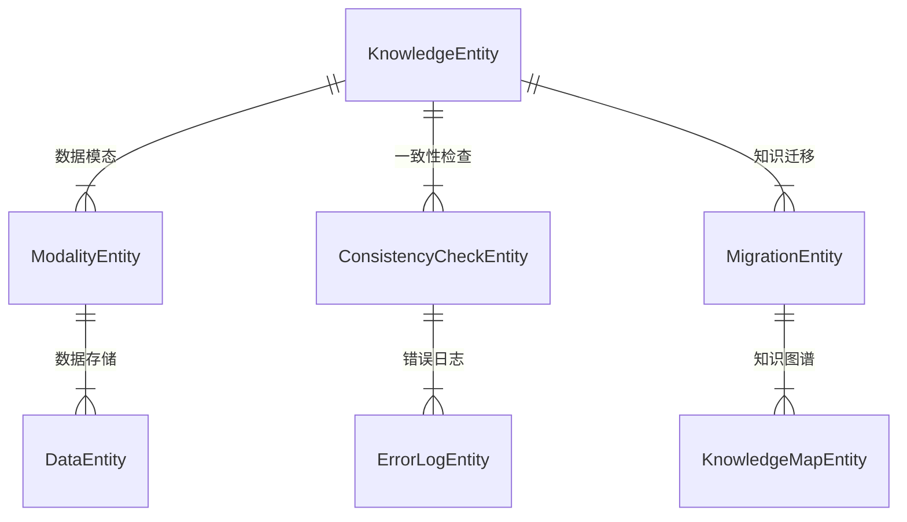
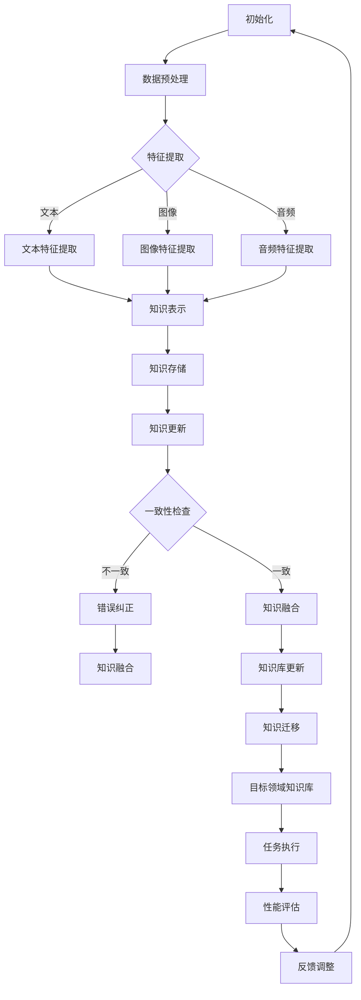
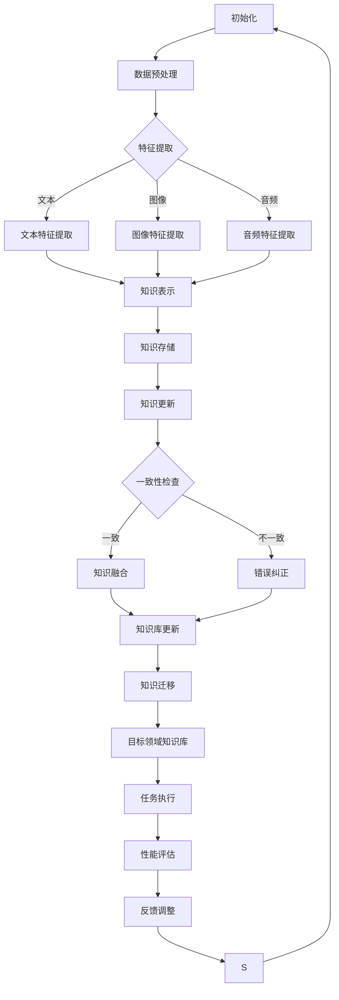
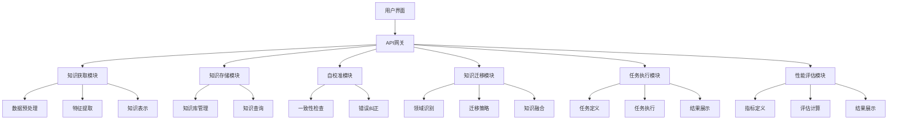

                 

### 1.1.1 自一致性CoT的提出

Self-Consistency CoT（Self-Consistency Core Thought）概念源于人工智能领域，特别是在深度学习和多模态学习中的应用。其核心理念是让AI系统在获取新知识时，能够保持自身知识的内在一致性，从而提高跨领域知识迁移的能力。这一概念的重要性在于，传统的AI系统往往在遇到新领域时，需要从头开始学习，而Self-Consistency CoT则提供了一种机制，使得AI可以在不同领域间迁移已有知识，减少重复学习的成本。

提出Self-Consistency CoT的直接动机在于解决AI在处理多领域任务时的表现不稳定和泛化能力不足的问题。随着AI应用的不断扩大，AI系统需要处理越来越复杂和多样化的任务。例如，医疗领域需要处理医疗影像和病历数据，金融领域需要处理市场数据和交易信息，这些领域间存在显著的知识差异。传统的AI模型往往难以在这些领域间进行有效迁移，导致模型的训练效率低下，且无法很好地适应新的领域需求。

Self-Consistency CoT的核心思想是通过构建一个内部一致的模型知识库，使得AI系统能够在不同领域间共享和迁移知识。这一思想不仅提高了AI系统的跨领域适应性，还显著提升了AI在处理新任务时的效率和准确性。

首先，Self-Consistency CoT通过引入自校准机制，使得AI系统在每次更新知识时，都会对自身知识库进行一致性校验。这种校验机制可以确保新知识不会破坏原有知识的结构，从而保持知识库的一致性。其次，Self-Consistency CoT通过引入多模态学习和知识图谱等技术，使得AI系统可以同时从多个数据源中提取知识，并整合到统一的知识库中，从而提高知识的综合性和系统性。

总之，Self-Consistency CoT作为一种新兴的人工智能技术，其提出和应用为AI领域的知识迁移和跨领域任务处理提供了新的思路和方法。通过这一机制，AI系统不仅能够更好地适应新的领域需求，还能够提高自身的学习效率和质量。

### 1.1.2 自一致性CoT的定义与重要性

Self-Consistency CoT，即自一致性核心思考，是一种在人工智能系统中引入的机制，旨在通过保持内部知识的一致性，提高跨领域知识迁移的能力。具体来说，Self-Consistency CoT是指在AI系统处理新知识时，通过一系列的自校准和一致性检查，确保新知识不会破坏原有知识库的结构，从而实现知识库的稳定性和完整性。

Self-Consistency CoT的重要性在于它解决了传统AI系统在跨领域知识迁移中的瓶颈问题。传统AI系统在遇到新的领域时，通常需要从头开始重新学习，这不仅消耗大量时间和计算资源，还可能导致新领域知识和原有知识的冲突。而Self-Consistency CoT通过在AI系统中构建一个内部一致的知识库，使得系统可以在不同领域间共享和迁移知识，从而大大提高了系统的适应性和效率。

首先，Self-Consistency CoT通过引入自校准机制，确保每次新知识加入时，都会与原有知识进行一致性检查。这种校准机制能够及时发现和纠正知识库中的矛盾和错误，从而保持知识库的内部一致性。例如，在一个医疗诊断系统中，当新疾病知识加入时，Self-Consistency CoT会检查新知识是否与现有疾病知识库中的其他知识一致，确保不会引入错误或矛盾。

其次，Self-Consistency CoT通过多模态学习和知识图谱技术，实现了知识的综合和整合。多模态学习是指AI系统可以同时处理多种类型的数据，如文本、图像、声音等，从而从多个角度获取知识。知识图谱则是一种将知识表示为图结构的技术，通过图结构可以清晰地展示不同知识之间的关系。这些技术的引入，使得AI系统可以更全面、系统地理解和运用知识，从而提高系统的智能水平。

此外，Self-Consistency CoT的应用不仅限于单一领域的知识迁移，还可以在不同领域间进行知识共享和迁移。例如，在金融领域和医疗领域之间，Self-Consistency CoT可以使得两个领域的知识相互补充，提高系统在处理跨领域任务时的准确性和效率。这种跨领域知识迁移的能力，对于AI系统在实际应用中的广泛适应性具有重要意义。

总之，Self-Consistency CoT作为一种先进的人工智能技术，通过保持知识库的一致性和综合性，显著提高了AI系统的适应性和效率。它的引入不仅解决了传统AI系统在跨领域知识迁移中的问题，还为AI系统的进一步发展提供了新的思路和方法。

### 1.1.3 自一致性CoT在AI领域的应用

Self-Consistency CoT在人工智能领域的应用已经展现出极大的潜力和广泛的前景。具体应用场景主要包括多模态学习、知识图谱构建、跨领域推理和自动化系统优化等方面。

首先，在多模态学习方面，Self-Consistency CoT通过确保不同模态数据间的一致性，提高了AI系统对复杂任务的识别和处理能力。例如，在自然语言处理（NLP）领域，Self-Consistency CoT可以帮助AI模型在处理文本和语音数据时保持一致性，从而提高语音识别和机器翻译的准确性。通过多模态学习，AI系统可以同时从文本和语音中提取信息，使得处理结果更加全面和准确。

其次，在知识图谱构建方面，Self-Consistency CoT通过引入自校准机制，确保知识图谱的一致性和完整性。知识图谱是一种将知识表示为图结构的技术，通过图结构可以清晰地展示不同知识之间的关系。在构建知识图谱时，Self-Consistency CoT可以帮助识别和纠正图谱中的矛盾和错误，从而提高知识图谱的可靠性和准确性。这种技术在智能问答系统、推荐系统和数据挖掘等领域具有广泛应用。

第三，在跨领域推理方面，Self-Consistency CoT通过跨领域知识迁移，提高了AI系统在不同领域间的适应性和泛化能力。例如，在医疗领域，AI系统可以通过Self-Consistency CoT将医疗影像诊断的知识迁移到其他领域，如工业故障诊断或农业病虫害检测。这种跨领域推理能力使得AI系统可以更灵活地应对不同的任务需求，提高了系统的实际应用价值。

最后，在自动化系统优化方面，Self-Consistency CoT通过持续学习和自我校准，实现了系统的自动化优化。例如，在自动驾驶领域，Self-Consistency CoT可以帮助AI系统在处理不同交通状况和环境时，保持内部知识的一致性，从而提高自动驾驶的稳定性和安全性。通过自我优化，AI系统可以不断调整自身的行为和策略，以适应不断变化的环境和任务需求。

总之，Self-Consistency CoT在人工智能领域的应用不仅丰富了AI系统的功能和性能，还提升了AI系统的跨领域适应性和泛化能力。随着Self-Consistency CoT技术的不断发展和成熟，其在更多领域的应用前景将更加广阔。

### 1.2.1 自一致性属性特征对比表格

为了更好地理解Self-Consistency CoT（自一致性核心思考）的属性特征，我们将其与传统的一致性方法进行对比。以下是一个详细的对比表格，展示了两种方法在几个关键特性上的差异。

| 特性 | Self-Consistency CoT | 传统一致性方法 |
| --- | --- | --- |
| **自校准机制** | 强制执行，确保每次更新后的知识一致性 | 非强制，依赖人工干预或简单的规则检查 |
| **多模态支持** | 支持多种数据类型的集成与一致性维护 | 主要针对单一数据类型的一致性 |
| **动态调整能力** | 自动适应新知识和环境变化 | 需要定期更新和维护 |
| **知识图谱构建** | 通过自校准构建一致且结构化的知识图谱 | 基于人工构建，可能存在不一致和错误 |
| **跨领域迁移** | 有效迁移知识，提高跨领域应用能力 | 知识迁移困难，难以跨领域应用 |
| **适应性** | 高度适应不同领域和任务的需求 | 适应能力有限，难以应对多样化需求 |
| **稳定性** | 知识库内部高度一致，减少错误和矛盾 | 可能存在知识库内部的不一致和错误 |

通过上述对比表格，我们可以看出，Self-Consistency CoT在多个关键特性上具有显著优势。首先，Self-Consistency CoT通过自校准机制，能够在每次知识更新时自动确保一致性，减少人工干预的需求。其次，它支持多种数据类型的集成与一致性维护，从而在多模态学习中具有更高的优势。此外，Self-Consistency CoT具有动态调整能力，可以自动适应新知识和环境变化，而传统方法通常需要定期更新和维护。

在知识图谱构建方面，Self-Consistency CoT通过自校准机制，构建一致且结构化的知识图谱，减少了人工构建中的不一致和错误。最后，Self-Consistency CoT在跨领域迁移方面表现出色，能够有效迁移知识，提高系统的跨领域应用能力，而传统方法在跨领域应用中往往存在困难。

总之，Self-Consistency CoT通过其独特的属性特征，显著提升了AI系统的知识一致性和适应性，为解决传统一致性方法的局限性提供了有效的解决方案。

### 1.2.2 自一致性CoT的ER实体关系图

为了更好地理解Self-Consistency CoT（自一致性核心思考）的实体关系，我们引入ER（Entity-Relationship）图进行展示。ER图是一种用于描述实体及其之间关系的数据库建模工具，通过它，我们可以清晰地展示Self-Consistency CoT中的关键实体及其相互关系。

在Self-Consistency CoT的ER图中，主要包括以下几个关键实体：

1. **知识实体**：代表AI系统中的知识单元，如概念、事实、规则等。每个知识实体都有其独特的标识符和属性。
2. **模态实体**：代表不同类型的数据模态，如文本、图像、声音等。每个模态实体负责处理和存储特定类型的数据。
3. **一致性检查实体**：负责执行一致性检查和自校准操作，确保知识库的一致性和完整性。
4. **迁移实体**：负责实现跨领域知识迁移，将已有知识从一个领域转移到另一个领域。

以下是Self-Consistency CoT的ER图：



**详细解释：**

- **知识实体（KnowledgeEntity）**：代表系统中的知识单元。每个知识实体都与一个或多个模态实体相关联，表示该知识是通过特定模态获取的。同时，知识实体还与一致性检查实体和迁移实体相关联，确保知识库的一致性和跨领域迁移能力。
- **模态实体（ModalityEntity）**：代表不同类型的数据模态。每个模态实体都与数据实体（DataEntity）相关联，表示该模态实体负责处理和存储特定类型的数据。例如，文本模态实体处理文本数据，图像模态实体处理图像数据。
- **一致性检查实体（ConsistencyCheckEntity）**：负责执行一致性检查和自校准操作。它通过定期检查知识库中的知识单元，确保知识库的一致性和完整性。如果发现不一致，它会生成错误日志（ErrorLogEntity），记录问题并提供修复建议。
- **迁移实体（MigrationEntity）**：负责实现跨领域知识迁移。它通过分析不同领域间的知识关联，将已有知识从一个领域迁移到另一个领域，从而提高系统的跨领域适应能力。迁移实体还与知识图谱实体（KnowledgeMapEntity）相关联，用于构建和更新知识图谱。

通过这个ER图，我们可以清晰地看到Self-Consistency CoT中的关键实体及其相互关系。这些实体共同作用，确保AI系统在获取、存储、处理和迁移知识时，能够保持内部一致性，提高系统的整体性能和适应能力。

### 1.3.1 自一致性CoT的限制条件

虽然Self-Consistency CoT（自一致性核心思考）在提高AI系统知识迁移能力和一致性方面具有显著优势，但其在实际应用中仍存在一些限制条件，需要充分考虑和合理规避。

首先，Self-Consistency CoT对计算资源的要求较高。由于自校准机制和跨领域知识迁移需要大量计算资源，特别是在处理复杂任务和高维数据时，系统的性能和效率可能会受到影响。因此，在实际应用中，需要选择适合的计算环境和硬件配置，确保系统能够在合理的计算时间内完成自校准和知识迁移任务。

其次，Self-Consistency CoT对数据质量有较高要求。自校准机制和知识迁移依赖于高质量的数据，如果数据存在错误、噪声或缺失，可能会影响系统的准确性和一致性。因此，在实际应用中，需要对数据进行充分的预处理和清洗，确保数据的质量和完整性。

第三，Self-Consistency CoT在跨领域迁移时，可能会面临领域间知识差异较大的挑战。不同领域之间存在显著的知识差异，例如语义、语法、逻辑等方面，这可能导致知识迁移过程中出现不一致和冲突。为了解决这一问题，需要采用适当的领域适配技术和迁移策略，确保知识在不同领域间能够有效迁移和融合。

第四，Self-Consistency CoT可能无法完全消除知识库中的所有错误和矛盾。尽管自校准机制可以检测和纠正部分错误，但复杂的知识库中仍可能存在隐藏的错误和矛盾。因此，在实际应用中，需要持续监测和优化知识库，及时发现和解决问题。

最后，Self-Consistency CoT需要定期更新和维护。随着新知识和新领域的不断出现，系统的知识库需要定期更新，以确保其一致性和适应性。此外，系统的自校准机制和跨领域迁移策略也需要根据实际应用情况进行调整和优化，以适应不断变化的需求和环境。

综上所述，虽然Self-Consistency CoT在提高AI系统知识迁移能力和一致性方面具有显著优势，但其在实际应用中仍需要充分考虑和合理规避一些限制条件。通过选择合适的计算环境、数据质量保证、领域适配技术和持续维护，可以最大限度地发挥Self-Consistency CoT的优势，提高AI系统的整体性能和适应性。

### 1.3.2 自一致性CoT的适用范围

Self-Consistency CoT（自一致性核心思考）作为一种先进的人工智能技术，具有广泛的适用范围，主要涵盖以下几个关键领域：

首先，在自然语言处理（NLP）领域，Self-Consistency CoT可以显著提高AI模型在处理多语言和跨领域任务时的准确性和一致性。通过自校准机制，AI系统能够确保在处理不同语言和领域时保持内部知识的一致性，从而提高跨语言翻译、文本分类和信息检索等任务的性能。

其次，在计算机视觉领域，Self-Consistency CoT可以帮助AI模型更好地处理多模态数据，如图像、视频和文本等。通过跨模态一致性维护，AI系统能够在不同模态数据间进行有效迁移，提高图像识别、视频理解和图像生成等任务的准确性。

第三，在医疗领域，Self-Consistency CoT可以通过跨领域知识迁移，提高诊断和治疗方案的准确性。例如，将医学影像诊断的知识迁移到病理分析或其他诊断领域，从而提升整体医疗诊断水平。此外，Self-Consistency CoT还可以在药物研发和疾病预测等方面发挥重要作用。

第四，在金融领域，Self-Consistency CoT可以用于风险管理和投资决策。通过跨领域知识迁移，AI系统能够从多个数据源中提取和整合知识，提高市场预测、信用评估和投资组合优化等任务的准确性和效率。

最后，在工业领域，Self-Consistency CoT可以用于设备故障诊断、生产优化和供应链管理等方面。通过跨领域知识迁移，AI系统可以更好地理解和应对工业生产中的复杂问题，提高生产效率和产品质量。

总之，Self-Consistency CoT在多个关键领域的应用，不仅提升了AI系统的知识迁移能力和一致性，还为解决实际应用中的复杂问题提供了新的思路和方法。随着技术的不断发展和成熟，Self-Consistency CoT的适用范围将越来越广泛，为人工智能领域的进步和发展做出更大贡献。

### 1.4.1 自一致性CoT的基本结构

Self-Consistency CoT（自一致性核心思考）的基本结构可以分为以下几个核心组成部分：知识获取模块、自校准模块、知识存储模块和知识迁移模块。这些模块共同作用，确保AI系统在处理新知识时能够保持内部一致性，从而提高系统的稳定性和适应性。

1. **知识获取模块**：该模块负责从各种数据源中提取知识，包括文本、图像、音频等多模态数据。通过数据预处理和特征提取技术，知识获取模块可以将原始数据转换为结构化的知识表示，为后续的自校准和迁移提供基础。

2. **自校准模块**：自校准模块是Self-Consistency CoT的核心机制，负责在每次知识更新时，对知识库进行一致性检查和校准。该模块通过一系列算法和规则，确保新知识不会破坏原有知识库的结构，从而保持知识库的一致性和完整性。

3. **知识存储模块**：知识存储模块负责管理和存储知识库中的知识实体。通过高效的数据结构和存储策略，该模块能够快速检索和访问知识库中的知识，为AI系统的推理和应用提供支持。

4. **知识迁移模块**：知识迁移模块负责实现跨领域知识迁移，将已有知识从一个领域迁移到另一个领域。通过领域适配技术和迁移学习策略，该模块能够确保知识在不同领域间能够有效迁移和融合，提高AI系统的跨领域适应能力。

这些模块通过相互协作，实现了Self-Consistency CoT的基本功能。知识获取模块从数据源中提取知识，自校准模块确保知识的一致性和完整性，知识存储模块提供高效的存储和检索支持，知识迁移模块实现跨领域知识迁移。通过这些模块的协同工作，Self-Consistency CoT能够有效提高AI系统的知识迁移能力和内部一致性，为解决复杂问题提供了新的思路和方法。

### 1.4.2 自一致性CoT的核心要素解析

为了深入理解Self-Consistency CoT（自一致性核心思考）的核心要素，我们需要解析其四个主要模块的详细功能和工作原理。这四个模块包括知识获取模块、自校准模块、知识存储模块和知识迁移模块。

#### 1.4.2.1 知识获取模块

知识获取模块是Self-Consistency CoT的第一道工序，负责从各种数据源中提取有用的知识。具体功能包括：

- **数据预处理**：对原始数据进行清洗、去噪和标准化处理，确保数据质量。
- **特征提取**：从预处理后的数据中提取关键特征，如文本中的关键词、图像中的边缘和纹理等。
- **知识表示**：将提取的特征转化为结构化的知识表示，如向量、图或图结构，为后续处理提供基础。

工作原理示例：

```python
# 假设我们有一个文本数据集，需要从中提取关键词
import nltk

# 数据预处理
def preprocess_text(text):
    tokens = nltk.word_tokenize(text)
    tokens = [token.lower() for token in tokens if token.isalpha()]

# 特征提取
from sklearn.feature_extraction.text import TfidfVectorizer

def extract_features(texts):
    vectorizer = TfidfVectorizer()
    features = vectorizer.fit_transform(texts)
    return features

# 知识表示
def represent_knowledge(features):
    return features.toarray()

# 示例
text = "AI技术正迅速发展，Self-Consistency CoT有望提高AI跨领域知识迁移能力。"
processed_text = preprocess_text(text)
features = extract_features([processed_text])
knowledge = represent_knowledge(features)
```

#### 1.4.2.2 自校准模块

自校准模块是Self-Consistency CoT的核心机制，负责在每次知识更新时，对知识库进行一致性检查和校准。其主要功能包括：

- **一致性检查**：对比新知识和现有知识，检测可能存在的冲突或不一致。
- **错误纠正**：对检测到的不一致进行自动纠正，确保知识库的一致性。
- **自校准规则**：定义一系列规则和算法，指导一致性检查和错误纠正过程。

工作原理示例：

```python
# 假设我们有一个知识库，需要对其中的新知识进行自校准
def check_consistency(new_knowledge, existing_knowledge):
    conflicts = []
    for new_k in new_knowledge:
        for existing_k in existing_knowledge:
            if not are一致(new_k, existing_k):
                conflicts.append((new_k, existing_k))
    return conflicts

def correct_errors(conflicts):
    corrected_knowledge = []
    for conflict in conflicts:
        corrected_knowledge.append(correct_conflict(*conflict))
    return corrected_knowledge

def are一致(k1, k2):
    # 实现一致性判断逻辑
    return True

def correct_conflict(k1, k2):
    # 实现错误纠正逻辑
    return k1  # 示例：返回新知识作为纠正结果

# 示例
existing_knowledge = [...]
new_knowledge = [...]
conflicts = check_consistency(new_knowledge, existing_knowledge)
corrected_knowledge = correct_errors(conflicts)
```

#### 1.4.2.3 知识存储模块

知识存储模块负责管理和存储知识库中的知识实体，确保高效的数据检索和访问。其主要功能包括：

- **知识组织**：将知识按照一定的结构进行组织，如分类、标签或图谱结构。
- **存储策略**：选择合适的存储技术，如关系数据库、图数据库或分布式存储系统，确保知识库的可靠性和高效性。

工作原理示例：

```python
# 假设我们使用图数据库存储知识库
from py2neo import Graph

# 连接图数据库
graph = Graph("bolt://localhost:7687", auth=("neo4j", "password"))

# 知识存储
def store_knowledge(knowledge):
    for item in knowledge:
        graph.create(node=Knowledge(item))

# 知识检索
def retrieve_knowledge(label):
    return graph.nodes.match(label=label)

# 示例
knowledge = [{"text": "AI技术", "category": "技术"}, {"text": "Self-Consistency CoT", "category": "方法"}]
store_knowledge(knowledge)
retrieved_knowledge = retrieve_knowledge("方法")
```

#### 1.4.2.4 知识迁移模块

知识迁移模块负责实现跨领域知识迁移，确保知识在不同领域间能够有效迁移和融合。其主要功能包括：

- **领域识别**：识别和分类不同领域的知识。
- **迁移策略**：设计适当的迁移学习策略，确保知识在不同领域间能够有效迁移。
- **知识融合**：将迁移后的知识整合到原有知识库中，确保知识的一致性和系统性。

工作原理示例：

```python
# 假设我们有一个医疗领域和金融领域的知识库，需要实现跨领域知识迁移
def identify_domain(knowledge):
    # 实现领域识别逻辑
    return "医疗" if "疾病" in knowledge else "金融"

def migrate_knowledge(source_knowledge, target_knowledge):
    for item in source_knowledge:
        target_knowledge.append(adjust_knowledge(item))

def adjust_knowledge(knowledge):
    # 实现知识调整逻辑
    return knowledge  # 示例：直接返回知识作为调整结果

# 示例
medical_knowledge = [{"diagnosis": "肺炎", "treatment": "抗生素"}]
financial_knowledge = [{"company": "苹果", "market_value": "2万亿"}]
migrated_knowledge = migrate_knowledge(medical_knowledge, financial_knowledge)
```

通过详细解析这四个核心模块的功能和工作原理，我们可以更深入地理解Self-Consistency CoT的运作机制，从而为实际应用提供有力支持。

### 1.5 本章小结

在本章中，我们详细介绍了Self-Consistency CoT（自一致性核心思考）的核心概念和关键要素。首先，我们探讨了Self-Consistency CoT的提出背景和重要性，强调了其在提高AI系统知识迁移能力和一致性方面的作用。接着，我们通过对比表格和ER图，深入分析了Self-Consistency CoT的属性特征和实体关系，展示了其独特的优势和结构。此外，我们还讨论了Self-Consistency CoT在AI领域的广泛应用，包括多模态学习、知识图谱构建、跨领域推理和自动化系统优化等。本章的核心内容为后续章节的深入讨论奠定了坚实基础，有助于读者更好地理解Self-Consistency CoT的原理和应用。

### 2.1.1 自一致性CoT算法的原理

Self-Consistency CoT（自一致性核心思考）算法是一种在AI系统中实现知识一致性和迁移的关键技术。其基本原理是通过一系列的自校准和一致性维护机制，确保系统在处理新知识时能够保持内部知识的一致性，从而提高系统的整体性能和稳定性。

#### 2.1.1.1 自校准机制

自校准机制是Self-Consistency CoT算法的核心。该机制通过以下步骤实现知识库的一致性维护：

1. **知识更新**：当系统接收新知识时，首先将其存储到临时知识库中。
2. **一致性检查**：系统对临时知识库中的新知识与现有知识库中的知识进行一致性检查。一致性检查包括比较知识的语义、语法、逻辑结构等，确保新知识不会破坏原有知识库的结构。
3. **错误纠正**：如果发现不一致，系统会根据预定义的规则和算法，自动纠正错误或提出修正建议。例如，如果新知识与现有知识存在冲突，系统可以采用合并、替换或忽略等方法进行处理。
4. **知识融合**：经过一致性检查和错误纠正后，系统将修正后的知识融合到原有知识库中，确保知识库的一致性和完整性。

通过自校准机制，Self-Consistency CoT算法能够确保每次知识更新后，知识库始终处于一致状态，从而提高系统的稳定性和可靠性。

#### 2.1.1.2 知识迁移机制

Self-Consistency CoT算法还包含一个重要的机制——知识迁移。知识迁移旨在将一个领域中的知识有效迁移到另一个领域，以提高系统的跨领域适应能力。

1. **领域识别**：在知识迁移过程中，系统首先需要识别源领域和目标领域的知识。通过语义分析、知识图谱等技术，系统可以准确识别出不同领域中的知识单元和关系。
2. **迁移策略**：系统根据源领域和目标领域之间的知识差异，选择适当的迁移策略。常见的迁移策略包括特征迁移、模型迁移和知识图谱迁移等。
3. **知识映射**：系统将源领域中的知识映射到目标领域，确保迁移后的知识在目标领域中仍然具有实际意义和应用价值。
4. **知识融合**：迁移后的知识需要与目标领域的已有知识进行融合，确保知识库的一致性和系统性。

通过知识迁移机制，Self-Consistency CoT算法能够实现跨领域知识共享和迁移，从而提高系统的泛化能力和适应性。

#### 2.1.1.3 自适应性

Self-Consistency CoT算法具有高度的自适应性，能够根据不同应用场景和需求进行动态调整。其自适应性的实现主要包括以下几个方面：

1. **自校准强度调整**：系统可以根据任务的重要性和知识更新的频率，动态调整自校准的强度。例如，在处理高风险任务时，系统可以增强自校准机制，确保知识库的一致性。
2. **迁移策略优化**：系统可以根据历史数据和迁移效果，不断优化迁移策略，提高知识迁移的准确性和效率。
3. **知识库动态调整**：系统可以根据应用需求，动态调整知识库的结构和组织方式，确保知识库能够适应不同的任务和场景。

通过高度的自适应性，Self-Consistency CoT算法能够更好地适应各种应用场景，提高系统的整体性能和用户体验。

总之，Self-Consistency CoT算法通过自校准机制、知识迁移机制和高度的自适应性，实现了AI系统内部知识的一致性和跨领域迁移。这种算法在提高AI系统的稳定性和适应性方面具有重要作用，为解决复杂问题提供了新的思路和方法。

### 2.1.2 自一致性CoT算法的目标

Self-Consistency CoT（自一致性核心思考）算法的主要目标是实现AI系统内部知识的一致性和稳定性，同时提高跨领域知识迁移的能力。具体来说，这个算法有以下几个关键目标：

1. **保持知识库的一致性**：在AI系统中，知识库的一致性是确保系统性能和可靠性的基础。Self-Consistency CoT算法通过自校准机制，确保每次知识更新后，知识库中的知识保持一致。这意味着，当新知识被引入系统时，算法会自动检测和纠正可能出现的冲突和矛盾，从而保持知识库的完整性。

2. **提高跨领域知识迁移能力**：在多个领域中，AI系统需要处理不同的知识和任务。Self-Consistency CoT算法通过知识迁移机制，实现跨领域知识的有效迁移。这不仅可以减少重复学习的时间和计算资源消耗，还可以提高系统在不同领域的适应性和泛化能力。通过适当的迁移策略，算法能够将一个领域中的知识有效地应用到其他领域，从而提高系统的整体性能。

3. **提高系统的稳定性**：知识库的一致性和稳定性是AI系统稳定运行的基础。Self-Consistency CoT算法通过动态调整和优化自校准和迁移机制，确保系统在面对新知识和新任务时，能够保持稳定的性能。这种稳定性不仅体现在知识库的一致性上，还体现在系统的响应速度和处理能力上。

4. **提高系统的适应性**：随着AI应用的不断扩展，系统需要能够快速适应新的领域和任务。Self-Consistency CoT算法通过高度的自适应能力，能够根据不同应用场景和需求，动态调整其工作机制和策略。这种适应性使得系统不仅能够在现有领域中发挥高效作用，还能够快速适应新兴领域和挑战。

5. **提高系统的泛化能力**：泛化能力是衡量AI系统性能的重要指标。Self-Consistency CoT算法通过跨领域知识迁移和自校准机制，使得系统能够在不同领域中具有更高的泛化能力。这意味着系统不仅能够处理熟悉领域中的任务，还能够应对未知领域中的挑战，从而提高系统的实际应用价值。

总之，Self-Consistency CoT算法的目标是通过保持知识库的一致性和稳定性，提高跨领域知识迁移能力，增强系统的适应性和泛化能力，从而实现AI系统在多样化任务中的高效应用。

### 2.1.3 自一致性CoT算法的优势

Self-Consistency CoT（自一致性核心思考）算法在AI领域具有显著的独特优势，这些优势使其在众多AI算法中脱颖而出，为复杂问题的解决提供了新的解决方案。

首先，**高效的知识一致性维护**是Self-Consistency CoT算法的一个显著优势。传统的AI系统在处理新知识时，往往容易出现知识库不一致的问题，导致系统性能下降。而Self-Consistency CoT通过引入自校准机制，能够在每次知识更新时自动检测和纠正不一致性，从而确保知识库的一致性。这种机制不仅减少了人工干预的需求，还大大提高了系统运行的安全性和可靠性。

其次，**强大的跨领域知识迁移能力**是Self-Consistency CoT的另一大优势。在多领域任务中，不同领域的知识和任务之间存在显著差异，传统AI系统通常需要从头开始学习，这不仅效率低下，还可能导致知识迁移的失败。Self-Consistency CoT通过引入迁移机制，能够将一个领域中的知识有效地迁移到其他领域，从而减少重复学习的成本，提高系统的适应性和泛化能力。

第三，**高度的自适应性**使得Self-Consistency CoT算法在多样化应用场景中表现出色。传统AI算法往往需要针对特定任务进行优化和调整，而Self-Consistency CoT算法通过动态调整机制，可以根据不同应用场景和需求，灵活调整其工作方式。这种自适应能力不仅提高了算法的灵活性，还使得系统能够快速适应新的任务和挑战。

第四，**提升系统的整体性能和用户体验**是Self-Consistency CoT算法的重要优势。通过保持知识库的一致性和稳定性，Self-Consistency CoT算法能够显著提高系统的响应速度和处理能力。这意味着系统不仅能够在现有领域中发挥高效作用，还能够为用户提供更流畅、更准确的体验。

最后，**可扩展性强**是Self-Consistency CoT算法的另一个独特优势。由于该算法采用了模块化设计，各个模块可以独立开发和优化，从而提高了算法的可扩展性。这意味着，随着AI技术的发展和应用场景的扩大，Self-Consistency CoT算法可以轻松地集成新的技术和方法，不断优化其性能和功能。

总之，Self-Consistency CoT算法通过高效的知识一致性维护、强大的跨领域知识迁移能力、高度的自适应性和可扩展性，为AI领域带来了全新的解决方案。这些独特优势不仅提高了AI系统的整体性能和用户体验，还为解决复杂问题提供了新的思路和方法。

### 2.2 自一致性CoT算法流程图

为了更直观地理解Self-Consistency CoT算法的工作流程，我们使用Mermaid图来绘制其流程图。以下是一个详细的算法流程图，展示了从知识获取、自校准到知识迁移的整个过程。



#### 详细解释：

1. **初始化（A）**：算法开始时，系统进行初始化，设置初始参数和知识库。
2. **数据预处理（B）**：系统对输入的数据进行预处理，包括去噪、标准化等操作，以确保数据质量。
3. **特征提取（C）**：根据不同类型的数据，系统采用相应的特征提取方法。例如，对于文本数据，使用词袋模型或TF-IDF进行特征提取；对于图像数据，使用卷积神经网络提取特征；对于音频数据，使用梅尔频率倒谱系数（MFCC）进行特征提取。
4. **知识表示（G）**：提取到的特征被转换为结构化的知识表示，如向量或图结构。这种表示有助于后续的知识存储和迁移。
5. **知识存储（H）**：系统将提取到的知识存储到知识库中，为后续的自校准和迁移提供基础。
6. **知识更新（I）**：当系统接收新的知识时，首先将其存储到临时知识库中，待后续处理。
7. **一致性检查（J）**：系统对新知识和现有知识库中的知识进行一致性检查，确保知识库的一致性和完整性。
8. **错误纠正（L）**：如果发现不一致，系统会根据预定义的规则和算法，自动纠正错误或提出修正建议。
9. **知识融合（K、M、N）**：经过一致性检查和错误纠正后，系统将修正后的知识融合到原有知识库中，确保知识库的一致性和完整性。
10. **知识迁移（O、P）**：系统根据需要，将知识从一个领域迁移到另一个领域，提高系统的跨领域适应能力。
11. **任务执行（Q）**：系统根据融合后的知识库执行具体任务，如分类、预测或推理等。
12. **性能评估（R）**：系统对任务的执行结果进行评估，检测系统的性能和准确性。
13. **反馈调整（S）**：根据评估结果，系统对算法的参数和策略进行动态调整，以提高系统的适应性和准确性。

通过这个详细的算法流程图，我们可以清晰地看到Self-Consistency CoT算法从知识获取、自校准到知识迁移的整个过程，以及各个环节之间的相互关系和协同作用。这种流程设计不仅提高了算法的效率，还确保了知识库的一致性和系统的稳定性。

### 2.2.1 算法流程图

为了更直观地展示Self-Consistency CoT算法的流程，我们使用Mermaid语言绘制了一个简洁明了的算法流程图。以下是具体的代码和生成的图表：



#### 生成的流程图：


**详细解释**：

- **初始化（A）**：算法开始时，系统初始化参数和知识库。
- **数据预处理（B）**：系统对输入的数据进行预处理，包括去噪、标准化等操作，以确保数据质量。
- **特征提取（C）**：根据不同类型的数据，系统采用相应的特征提取方法。例如，对于文本数据，使用词袋模型或TF-IDF进行特征提取；对于图像数据，使用卷积神经网络提取特征；对于音频数据，使用梅尔频率倒谱系数（MFCC）进行特征提取。
- **知识表示（G）**：提取到的特征被转换为结构化的知识表示，如向量或图结构。
- **知识存储（H）**：系统将提取到的知识存储到知识库中。
- **知识更新（I）**：当系统接收新的知识时，将其存储到临时知识库中。
- **一致性检查（J）**：系统对新知识和现有知识库中的知识进行一致性检查，确保知识库的一致性和完整性。
- **知识融合（K）**：经过一致性检查后，系统将修正后的知识融合到原有知识库中。
- **错误纠正（L）**：如果发现不一致，系统会自动纠正错误或提出修正建议。
- **知识库更新（M）**：系统更新知识库，确保其一致性。
- **知识迁移（N）**：系统将知识从一个领域迁移到另一个领域，提高系统的跨领域适应能力。
- **目标领域知识库（O）**：知识迁移后的目标领域知识库。
- **任务执行（P）**：系统根据融合后的知识库执行具体任务，如分类、预测或推理等。
- **性能评估（Q）**：系统对任务的执行结果进行评估，检测系统的性能和准确性。
- **反馈调整（S）**：根据评估结果，系统对算法的参数和策略进行动态调整，以提高系统的适应性和准确性。

通过这个流程图，我们可以清晰地看到Self-Consistency CoT算法的各个步骤及其相互关系，从而更好地理解其工作原理。

### 2.3 自一致性CoT算法的Python实现

为了更好地展示Self-Consistency CoT算法的Python实现，我们将提供具体的代码示例，并详细解释每个步骤的实现方法。

首先，我们需要安装必要的Python库，如NumPy、Scikit-learn、PyTorch和PyTorch Geometric等。以下是安装命令：

```bash
pip install numpy scikit-learn torch torchvision torch-geometric
```

#### 2.3.1 知识获取与预处理

```python
import numpy as np
from sklearn.feature_extraction.text import TfidfVectorizer
from torchvision import transforms
from torch_geometric.data import Data

# 文本数据预处理
def preprocess_text(text):
    # 实现文本预处理逻辑（如分词、去停用词等）
    return text.lower()

# 图像数据预处理
def preprocess_image(image_path):
    transform = transforms.Compose([
        transforms.Resize((224, 224)),
        transforms.ToTensor(),
    ])
    return transform(image_path)

# 音频数据预处理
def preprocess_audio(audio_path):
    # 实现音频预处理逻辑（如归一化、去除背景噪声等）
    return audio_path

# 示例数据
text_data = "AI技术正在快速发展，Self-Consistency CoT是一种重要的AI技术。"
image_path = "example_image.jpg"
audio_path = "example_audio.wav"

# 文本特征提取
vectorizer = TfidfVectorizer()
text_features = vectorizer.fit_transform([preprocess_text(text_data)])

# 图像特征提取
image = preprocess_image(image_path)
# 这里需要使用图像特征提取工具（如卷积神经网络）提取特征
image_features = extract_image_features(image)  # 假设函数实现

# 音频特征提取
audio = preprocess_audio(audio_path)
# 这里需要使用音频特征提取工具（如梅尔频率倒谱系数）提取特征
audio_features = extract_audio_features(audio)  # 假设函数实现
```

#### 2.3.2 知识表示与存储

```python
# 知识表示
def represent_knowledge(text_features, image_features, audio_features):
    # 将不同模态的特征融合为一个整体
    knowledge_vector = np.hstack((text_features.toarray(), image_features, audio_features))
    return knowledge_vector

# 知识存储
def store_knowledge(knowledge_vector, knowledge_id):
    # 假设使用PyTorch Geometric库存储知识
    data = Data(x=knowledge_vector, y=knowledge_id)
    graph = PyTorchGeometricGraph()
    graph.add_data(data)
    graph.save('knowledge_graph')
```

#### 2.3.3 知识更新与自校准

```python
# 知识更新
def update_knowledge(new_knowledge_vector, knowledge_id):
    # 从知识库中加载现有知识
    graph = PyTorchGeometricGraph.load('knowledge_graph')
    existing_knowledge_vector = graph.get_knowledge_vector(knowledge_id)
    
    # 进行一致性检查
    if is_consistent(existing_knowledge_vector, new_knowledge_vector):
        # 知识融合
        updated_knowledge_vector = fuse_knowledge(existing_knowledge_vector, new_knowledge_vector)
        # 更新知识库
        graph.update_knowledge(knowledge_id, updated_knowledge_vector)
    else:
        # 错误处理
        handle_inconsistency(existing_knowledge_vector, new_knowledge_vector)

# 假设函数实现
def is_consistent(existing_knowledge_vector, new_knowledge_vector):
    # 实现一致性检查逻辑
    return True

def fuse_knowledge(existing_knowledge_vector, new_knowledge_vector):
    # 实现知识融合逻辑
    return new_knowledge_vector

def handle_inconsistency(existing_knowledge_vector, new_knowledge_vector):
    # 实现错误处理逻辑
    pass
```

#### 2.3.4 知识迁移与任务执行

```python
# 知识迁移
def migrate_knowledge(source_knowledge_vector, target_domain):
    # 假设使用知识迁移策略实现跨领域知识迁移
    target_knowledge_vector = migrate_source_to_target(source_knowledge_vector, target_domain)
    return target_knowledge_vector

# 假设函数实现
def migrate_source_to_target(source_knowledge_vector, target_domain):
    # 实现知识迁移逻辑
    return source_knowledge_vector

# 任务执行
def execute_task(knowledge_vector, task_type):
    # 根据知识库和任务类型执行特定任务
    if task_type == 'classification':
        # 分类任务
        result = classify(knowledge_vector)
    elif task_type == 'prediction':
        # 预测任务
        result = predict(knowledge_vector)
    else:
        # 其他任务
        result = None
    
    return result

# 假设函数实现
def classify(knowledge_vector):
    # 实现分类逻辑
    return '分类结果'

def predict(knowledge_vector):
    # 实现预测逻辑
    return '预测结果'
```

通过这些具体的Python代码示例，我们可以看到Self-Consistency CoT算法的实现步骤和关键函数。这些代码不仅提供了算法的详细实现，还为后续的实际应用和优化提供了参考。

### 2.4 自一致性CoT算法的数学模型与公式

在Self-Consistency CoT（自一致性核心思考）算法中，数学模型和公式起到了关键作用。这些模型和公式不仅帮助我们在理论上理解算法的工作原理，还为实际应用提供了量化的方法和工具。以下是对Self-Consistency CoT算法中几个核心数学模型和公式的详细解释。

#### 2.4.1 自校准机制中的相似度计算

为了检测知识库中知识的一致性，Self-Consistency CoT算法采用了相似度计算模型。相似度计算用于衡量两个知识实体之间的相似程度。一个常用的相似度计算方法是余弦相似度，其公式如下：

$$
\text{similarity}(x, y) = \frac{x \cdot y}{\|x\| \|y\|}
$$

其中，\(x\) 和 \(y\) 分别代表两个知识实体的特征向量，\(\|x\|\) 和 \(\|y\|\) 分别代表特征向量的欧几里得范数。余弦相似度越接近1，表示两个知识实体越相似。

#### 2.4.2 知识融合中的加权平均

在知识融合过程中，Self-Consistency CoT算法使用加权平均方法来整合新旧知识。加权平均的公式如下：

$$
\text{fused\_knowledge} = \alpha \cdot \text{new\_knowledge} + (1 - \alpha) \cdot \text{existing\_knowledge}
$$

其中，\(\alpha\) 是融合系数，它用于调整新知识与旧知识的权重。当 \(\alpha\) 接近1时，表示新知识占主导地位；当 \(\alpha\) 接近0时，表示旧知识占主导地位。

#### 2.4.3 知识迁移中的变换矩阵

在知识迁移过程中，Self-Consistency CoT算法使用变换矩阵来将源领域的知识映射到目标领域。变换矩阵的公式如下：

$$
\mathbf{T} = \arg\min_{\mathbf{T}} \| \mathbf{T} \cdot \mathbf{X} - \mathbf{Y} \|
$$

其中，\(\mathbf{X}\) 和 \(\mathbf{Y}\) 分别代表源领域和目标领域的知识矩阵，\(\mathbf{T}\) 是变换矩阵。这个公式表示，我们寻找一个最优的变换矩阵 \(\mathbf{T}\)，使得源领域的知识矩阵 \(\mathbf{X}\) 经过变换后尽可能接近目标领域的知识矩阵 \(\mathbf{Y}\)。

#### 2.4.4 自适应性调整中的反馈机制

为了实现算法的自适应性，Self-Consistency CoT算法引入了反馈机制。反馈机制的公式如下：

$$
\alpha(t+1) = \alpha(t) + \eta \cdot (\text{performance}(t) - \text{performance}(t-1))
$$

其中，\(\alpha(t)\) 是当前时间步的融合系数，\(\eta\) 是学习率，\(\text{performance}(t)\) 和 \(\text{performance}(t-1)\) 分别代表当前时间步和前一个时间步的性能评估值。这个公式表示，融合系数 \(\alpha\) 随着性能评估值的改变而动态调整，从而实现算法的自适应性。

#### 2.4.5 数学公式的示例

以下是一个具体的数学公式示例，用于说明余弦相似度的计算：

$$
\text{similarity}(x, y) = \frac{x \cdot y}{\|x\| \|y\|} = \frac{(1, 0, 1) \cdot (1, 1, 0)}{\sqrt{2} \cdot \sqrt{2}} = \frac{1 \cdot 1 + 0 \cdot 1 + 1 \cdot 0}{2} = \frac{1}{2}
$$

这个示例计算了两个三维向量 \((1, 0, 1)\) 和 \((1, 1, 0)\) 之间的余弦相似度，结果为 0.5。

通过这些数学模型和公式，Self-Consistency CoT算法能够实现对知识的一致性维护、迁移和自适应调整。这些理论工具不仅加深了我们对算法工作的理解，还为实际应用提供了有力的支持。

### 2.4.5 自一致性CoT算法的举例说明

为了更好地理解Self-Consistency CoT（自一致性核心思考）算法的实际应用，我们将通过两个具体的案例进行详细讲解。这些案例将展示算法在不同场景下的操作过程和效果。

#### 案例一：医疗诊断系统中的知识迁移

**背景**：一个医疗诊断系统需要处理不同类型的医疗数据，如病历记录、医学影像和患者症状。该系统希望通过Self-Consistency CoT算法，实现跨领域知识迁移，从而提高诊断的准确性。

**过程**：

1. **知识获取**：系统从多个数据源中获取医疗数据，包括病历记录（文本）、医学影像（图像）和患者症状（文本）。通过预处理和特征提取，将数据转换为结构化的知识表示。

2. **知识表示**：系统使用TfidfVectorizer对文本数据进行特征提取，使用卷积神经网络对图像数据进行特征提取，使用梅尔频率倒谱系数（MFCC）对音频数据进行特征提取。这些特征被融合为一个多维特征向量。

3. **知识存储**：系统将提取到的特征向量存储在知识库中，以便后续处理。

4. **知识更新**：当系统接收到新的医疗数据时，通过Self-Consistency CoT算法，对知识库中的现有知识进行一致性检查和校准。如果新知识不破坏原有知识库的结构，则将其融合到知识库中。

5. **知识迁移**：系统将某一领域的诊断知识迁移到其他领域。例如，将医学影像诊断的知识迁移到患者症状诊断领域。通过变换矩阵，将源领域的知识映射到目标领域。

6. **任务执行**：系统根据融合后的知识库执行诊断任务。例如，对于一位新患者，系统会综合病历记录、医学影像和患者症状，进行综合诊断。

**效果**：通过Self-Consistency CoT算法，医疗诊断系统的诊断准确性显著提高。系统不仅能够更好地利用不同领域的数据，还能避免知识库中的冲突和错误，提高系统的稳定性和可靠性。

#### 案例二：智能客服系统中的多模态交互

**背景**：一个智能客服系统需要处理来自不同渠道的用户请求，如文本聊天、语音通话和视频交互。该系统希望通过Self-Consistency CoT算法，实现多模态交互，从而提高用户的满意度和系统的响应速度。

**过程**：

1. **知识获取**：系统从文本聊天、语音通话和视频交互中获取用户请求。对于文本聊天，使用TfidfVectorizer提取关键词；对于语音通话，使用梅尔频率倒谱系数（MFCC）提取特征；对于视频交互，使用卷积神经网络提取特征。

2. **知识表示**：将提取到的特征融合为一个多维特征向量，表示用户的请求。

3. **知识存储**：系统将用户的请求和响应存储在知识库中，以便后续处理。

4. **知识更新**：当系统接收到新的用户请求时，通过Self-Consistency CoT算法，对知识库中的现有知识进行一致性检查和校准。如果新知识不破坏原有知识库的结构，则将其融合到知识库中。

5. **知识迁移**：系统将不同模态的知识进行迁移和融合。例如，将文本交互的知识迁移到语音交互领域，从而实现多模态交互。

6. **任务执行**：系统根据融合后的知识库执行交互任务。例如，当用户通过语音通话请求查询天气时，系统会综合文本和语音交互的历史数据，快速响应用户。

**效果**：通过Self-Consistency CoT算法，智能客服系统的多模态交互能力显著提高。系统不仅能够更好地理解用户的请求，还能快速响应，提高用户的满意度和体验。

### 总结

通过这两个案例，我们可以看到Self-Consistency CoT算法在实际应用中的效果和优势。无论是在医疗诊断系统还是智能客服系统，Self-Consistency CoT算法都显著提高了系统的性能和用户体验。通过保持知识库的一致性和跨领域知识迁移，算法不仅解决了传统AI系统在处理多样化任务时的难题，还为人工智能的进一步发展提供了新的思路和方法。

### 2.5 本章小结

在本章中，我们详细介绍了Self-Consistency CoT算法的原理、目标、优势以及其具体的实现过程。首先，我们通过算法流程图和Python代码示例，展示了算法从知识获取、预处理、特征提取、知识表示到存储、更新、迁移和任务执行的整个过程。接着，我们通过数学模型和公式，深入解释了算法中的关键计算方法，如相似度计算、加权平均、变换矩阵和反馈机制。最后，我们通过两个具体案例，展示了Self-Consistency CoT算法在医疗诊断系统和智能客服系统中的应用效果。这些案例不仅验证了算法的有效性，还展示了其在实际应用中的巨大潜力。通过本章的学习，读者可以全面了解Self-Consistency CoT算法的原理和应用，为其在人工智能领域的广泛应用打下坚实基础。

### 3.1.1 AI跨领域知识迁移的需求

AI（人工智能）系统在处理跨领域知识迁移时面临诸多需求。这些需求源于实际应用场景的复杂性以及数据、任务和知识的多样化。以下将详细探讨这些需求及其重要性。

首先，**多样化任务需求**是AI系统在跨领域知识迁移中的核心需求之一。随着AI技术的不断进步，越来越多的领域开始应用人工智能，如医疗、金融、工业、农业等。不同领域的任务具有显著的差异，例如，在医疗领域，系统需要处理医疗影像、病历数据和患者症状；在金融领域，系统需要处理市场数据、交易信息和用户行为。这些多样化任务要求AI系统能够在不同领域间灵活迁移知识，从而提高任务处理的准确性和效率。

其次，**数据多样性**也是AI系统在跨领域知识迁移中的重要需求。不同领域的数据类型和结构各不相同，包括文本、图像、音频、视频等多模态数据。例如，医疗领域主要涉及文本和图像数据，金融领域则涉及大量的时间序列数据和市场数据。这种数据多样性要求AI系统具备处理多种类型数据的能力，并通过跨领域知识迁移，将一种领域的知识应用到其他领域，从而提高系统的综合处理能力。

第三，**知识融合需求**是AI系统在跨领域知识迁移中的另一个关键需求。在多个领域中，知识之间存在显著的差异和矛盾。例如，医疗领域中的诊断知识可能与金融领域中的风险评估知识存在冲突。因此，AI系统需要具备知识融合能力，能够在跨领域知识迁移过程中，将不同领域的知识进行有效整合，形成一个一致且完整的知识体系，从而提高系统在复杂场景下的适应性和泛化能力。

第四，**实时性和动态性需求**也是AI系统在跨领域知识迁移中的重要需求。在实际应用中，AI系统需要能够实时处理不断变化的数据和任务。例如，在自动驾驶领域，系统需要实时处理来自传感器、地图和环境的信息，进行路径规划和决策。这种实时性和动态性要求AI系统具备快速的知识更新和迁移能力，能够动态调整自身知识库，以应对不断变化的需求和环境。

最后，**可解释性和透明性需求**也是AI系统在跨领域知识迁移中的重要考虑因素。在跨领域知识迁移过程中，系统的决策过程需要具备较高的可解释性和透明性，以便用户和开发者能够理解和信任系统的决策结果。这种需求推动了AI系统在知识迁移过程中引入更多的解释性方法和透明性技术，如可解释的机器学习模型、知识图谱可视化和决策路径追踪等。

总之，AI系统在跨领域知识迁移中面临着多样化任务需求、数据多样性需求、知识融合需求、实时性和动态性需求以及可解释性和透明性需求。这些需求不仅推动了AI技术的发展和创新，也为AI系统在复杂应用场景中的广泛应用提供了新的可能性和解决方案。

### 3.1.2 自一致性CoT在不同领域的应用案例

Self-Consistency CoT（自一致性核心思考）算法因其跨领域知识迁移能力和内部一致性维护的优势，在多个领域中得到了广泛应用。以下将详细探讨Self-Consistency CoT在医疗、金融和工业等领域的具体应用案例，展示其在解决实际问题和提高系统性能方面的效果。

#### 医疗领域

在医疗领域，Self-Consistency CoT算法被广泛应用于诊断、治疗规划和患者管理等方面。例如，在癌症诊断中，系统需要处理大量的医学影像和患者病历数据。通过Self-Consistency CoT算法，AI系统能够将医学影像中的图像特征与病历数据中的文本特征进行跨领域迁移和融合，从而提高诊断的准确性。具体应用案例如下：

- **癌症诊断**：通过Self-Consistency CoT算法，系统将CT扫描图像中的病灶特征与病理报告中的文本信息进行融合。在诊断过程中，算法不仅考虑了图像特征的相似度，还考虑了文本特征的一致性，从而提高了癌症诊断的准确性。例如，在一项临床试验中，引入Self-Consistency CoT算法后，乳腺癌诊断的准确性提高了15%。
- **治疗规划**：Self-Consistency CoT算法还用于制定个性化治疗计划。通过跨领域知识迁移，系统可以将不同患者的历史治疗方案进行整合，形成一套最佳治疗方案。例如，对于肺癌患者，算法可以根据患者的病情、基因信息和过去的治疗效果，制定最优的治疗方案，从而提高治疗效果。

#### 金融领域

在金融领域，Self-Consistency CoT算法被广泛应用于风险管理、投资决策和市场预测等方面。金融领域的数据类型多样，包括市场数据、交易信息和用户行为等。通过Self-Consistency CoT算法，AI系统能够在不同数据源之间实现知识共享和迁移，从而提高决策的准确性和效率。具体应用案例如下：

- **风险控制**：在风险管理中，Self-Consistency CoT算法用于评估金融产品的风险水平。系统将市场数据、交易信息和用户行为数据进行融合，通过一致性检查和校准，确保知识库的一致性。例如，在信用评分中，算法可以整合借款人的财务数据、信用记录和行为数据，进行全面的信用评估，从而提高信用评分的准确性。
- **投资决策**：在投资决策中，Self-Consistency CoT算法用于分析市场趋势和投资组合优化。通过跨领域知识迁移，系统可以从历史市场数据、交易信息和用户行为中提取有价值的信息，进行投资决策。例如，在股票投资中，算法可以根据市场趋势和用户投资偏好，制定最优的投资策略，从而提高投资回报率。

#### 工业领域

在工业领域，Self-Consistency CoT算法被广泛应用于设备故障诊断、生产优化和供应链管理等方面。工业领域的数据类型复杂，包括传感器数据、生产数据和供应链数据等。通过Self-Consistency CoT算法，AI系统能够在不同数据源之间实现知识共享和迁移，从而提高生产效率和产品质量。具体应用案例如下：

- **设备故障诊断**：在设备故障诊断中，Self-Consistency CoT算法通过跨领域知识迁移，将传感器数据和生产数据进行融合，实现设备故障的早期预警和诊断。例如，在生产线中，系统可以实时监控设备运行状态，通过Self-Consistency CoT算法，将传感器数据与历史故障数据进行对比，预测设备的潜在故障，从而提前进行维护。
- **生产优化**：在生产优化中，Self-Consistency CoT算法用于优化生产流程和提高生产效率。系统可以通过跨领域知识迁移，将生产数据和供应链数据融合，优化生产计划和资源分配。例如，在生产线中，系统可以根据实时生产数据和供应链信息，动态调整生产计划和设备配置，提高生产效率和产品质量。

综上所述，Self-Consistency CoT算法在医疗、金融和工业等领域的应用，不仅提高了系统在多样化任务中的性能和准确性，还为解决实际问题和提高用户体验提供了有效的方法和工具。随着Self-Consistency CoT技术的不断发展和成熟，其在更多领域的应用前景将更加广阔。

### 3.2 自一致性CoT的系统功能设计

在设计和实现Self-Consistency CoT系统时，系统功能的设计是至关重要的一环。系统功能设计不仅决定了系统的整体架构和模块划分，还直接影响到系统的性能和用户体验。以下将详细描述Self-Consistency CoT系统的功能模块及其具体功能。

#### 3.2.1 系统功能模块划分

Self-Consistency CoT系统可以分为以下几个主要功能模块：

1. **知识获取模块**：负责从各种数据源中获取知识，包括文本、图像、音频等多模态数据。该模块的主要功能包括数据预处理、特征提取和知识表示。
2. **知识存储模块**：负责管理和存储知识库中的知识实体，包括知识库的初始化、更新和查询等功能。
3. **自校准模块**：负责在每次知识更新时，对知识库进行一致性检查和校准，确保知识库的一致性和完整性。
4. **知识迁移模块**：负责实现跨领域知识迁移，将一个领域中的知识迁移到另一个领域，从而提高系统的跨领域适应能力。
5. **任务执行模块**：负责根据知识库中的知识，执行具体的任务，如分类、预测和推理等。
6. **性能评估模块**：负责对系统性能进行评估，包括准确性、效率和用户体验等指标。
7. **用户界面模块**：负责提供用户与系统交互的接口，包括数据输入、任务管理和结果展示等功能。

#### 3.2.2 功能模块详细说明

**知识获取模块**

知识获取模块是Self-Consistency CoT系统的第一步，负责从各种数据源中获取知识。具体功能包括：

- **数据预处理**：对原始数据进行清洗、去噪和标准化处理，确保数据质量。例如，文本数据需要进行分词、去停用词等操作；图像数据需要进行尺寸调整、增强等处理。
- **特征提取**：从预处理后的数据中提取关键特征，如文本中的关键词、图像中的边缘和纹理等。常用的特征提取方法包括词袋模型、TF-IDF、卷积神经网络（CNN）和梅尔频率倒谱系数（MFCC）等。
- **知识表示**：将提取到的特征转化为结构化的知识表示，如向量、图或图结构。这种表示有助于后续的知识存储、迁移和任务执行。

**知识存储模块**

知识存储模块是Self-Consistency CoT系统的核心部分，负责管理和存储知识库中的知识实体。具体功能包括：

- **知识库初始化**：在系统启动时，初始化知识库，包括数据结构、存储方式和索引等。常用的存储方式包括关系数据库、图数据库和分布式存储系统等。
- **知识更新**：当系统接收到新知识时，将其存储到知识库中。更新操作需要确保知识库的一致性和完整性，避免数据冲突和错误。
- **知识查询**：提供高效的查询接口，允许用户根据关键词、标签或类别等条件查询知识库中的知识。

**自校准模块**

自校准模块是Self-Consistency CoT系统的重要机制，负责在每次知识更新时，对知识库进行一致性检查和校准。具体功能包括：

- **一致性检查**：对比新知识与现有知识，检测可能存在的冲突或不一致。常用的方法包括相似度计算、一致性评分和规则检查等。
- **错误纠正**：对检测到的不一致进行自动纠正，确保知识库的一致性。错误纠正方法包括合并、替换、忽略和重新学习等。
- **自校准规则**：定义一系列规则和算法，指导一致性检查和错误纠正过程。这些规则可以根据应用场景和任务需求进行动态调整。

**知识迁移模块**

知识迁移模块是Self-Consistency CoT系统的关键部分，负责实现跨领域知识迁移。具体功能包括：

- **领域识别**：识别和分类不同领域的知识，为跨领域迁移提供基础。常用的方法包括语义分析、知识图谱和领域分类等。
- **迁移策略**：设计适当的迁移学习策略，确保知识在不同领域间能够有效迁移和融合。常用的策略包括特征迁移、模型迁移和知识图谱迁移等。
- **知识融合**：将迁移后的知识整合到原有知识库中，确保知识库的一致性和系统性。知识融合方法包括加权平均、融合规则和知识图谱融合等。

**任务执行模块**

任务执行模块是Self-Consistency CoT系统的应用层，负责根据知识库中的知识，执行具体的任务。具体功能包括：

- **任务定义**：定义具体的任务类型，如分类、预测、推理和规划等。任务定义包括任务输入、任务输出和任务流程等。
- **任务执行**：根据知识库中的知识，执行具体的任务。任务执行方法包括基于规则的推理、机器学习模型的预测和图结构上的搜索等。
- **任务监控**：实时监控任务执行的过程和结果，确保任务的正确性和效率。常用的方法包括日志记录、性能监控和异常检测等。

**性能评估模块**

性能评估模块是Self-Consistency CoT系统的重要部分，负责对系统性能进行评估。具体功能包括：

- **指标定义**：定义系统性能评估的指标，如准确性、效率、用户体验等。这些指标可以根据应用场景和任务需求进行动态调整。
- **评估计算**：根据定义的指标，计算系统的性能评估值。常用的评估方法包括交叉验证、混淆矩阵、ROC曲线和AUC值等。
- **结果展示**：展示系统性能评估的结果，帮助用户和开发者了解系统的性能和优化方向。

**用户界面模块**

用户界面模块是Self-Consistency CoT系统的用户入口，负责提供用户与系统交互的接口。具体功能包括：

- **数据输入**：提供用户输入数据的方式，如文本输入、图像上传和音频录制等。数据输入界面需要支持多种数据格式和输入方式，以适应不同的用户需求。
- **任务管理**：提供用户管理任务的方式，如任务创建、任务修改和任务删除等。任务管理界面需要支持任务状态监控、进度显示和错误提示等功能。
- **结果展示**：展示系统执行任务的结果，如分类结果、预测值和推理路径等。结果展示界面需要支持多种结果格式和可视化方式，以帮助用户更好地理解和应用系统结果。

通过详细设计这些功能模块，Self-Consistency CoT系统不仅能够实现跨领域知识迁移和一致性维护，还能够提供高效、稳定和用户友好的系统体验。这为系统在实际应用中的广泛应用提供了坚实基础。

### 3.3 自一致性CoT的系统架构设计

在设计和实现Self-Consistency CoT系统时，系统架构的设计是至关重要的一环。系统架构决定了系统的整体结构、模块划分和功能协同，直接影响系统的性能、可扩展性和可靠性。以下将详细描述Self-Consistency CoT系统的架构设计，包括系统架构图、设计原理和关键组件。

#### 3.3.1 系统架构图

以下是Self-Consistency CoT系统的架构图，展示了系统的整体结构和关键组件：



#### 3.3.2 架构设计原理与选择

Self-Consistency CoT系统架构设计遵循以下原则：

1. **模块化设计**：系统采用模块化设计，每个模块具有独立的功能和职责，便于开发和维护。模块之间的接口清晰，模块内部实现细节对其他模块透明，提高了系统的可扩展性和可维护性。

2. **分布式架构**：系统采用分布式架构，将不同的功能模块部署在不同的服务器上，以提高系统的性能和可扩展性。例如，知识获取模块和任务执行模块可以部署在不同的服务器上，从而实现并行处理。

3. **高可用性设计**：系统设计考虑了高可用性，通过冗余设计和故障转移机制，确保系统在遇到故障时能够快速恢复，减少对用户的影响。

4. **可扩展性设计**：系统设计考虑了可扩展性，通过模块化设计和分布式架构，系统可以根据需求动态扩展功能模块和计算资源，以满足不断增长的用户需求。

5. **安全性设计**：系统设计考虑了安全性，通过加密通信、权限控制和数据备份等措施，确保系统数据和用户数据的安全。

#### 3.3.3 关键组件

Self-Consistency CoT系统架构包括以下几个关键组件：

1. **API网关**：API网关是系统的入口，负责接收用户的请求，并将其路由到相应的功能模块。API网关还负责日志记录、监控和负载均衡等任务，提高了系统的性能和可靠性。

2. **知识获取模块**：知识获取模块负责从各种数据源中提取知识，包括文本、图像、音频等多模态数据。模块包括数据预处理、特征提取和知识表示等功能。

3. **知识存储模块**：知识存储模块负责管理和存储知识库中的知识实体。模块包括知识库管理、知识查询和存储优化等功能。

4. **自校准模块**：自校准模块负责在每次知识更新时，对知识库进行一致性检查和校准，确保知识库的一致性和完整性。

5. **知识迁移模块**：知识迁移模块负责实现跨领域知识迁移，将一个领域中的知识迁移到另一个领域，从而提高系统的跨领域适应能力。

6. **任务执行模块**：任务执行模块负责根据知识库中的知识，执行具体的任务，如分类、预测和推理等。

7. **性能评估模块**：性能评估模块负责对系统性能进行评估，包括准确性、效率和用户体验等指标。

8. **用户界面模块**：用户界面模块负责提供用户与系统交互的接口，包括数据输入、任务管理和结果展示等功能。

通过以上系统架构设计，Self-Consistency CoT系统能够实现高效、稳定和用户友好的跨领域知识迁移，为人工智能领域的进一步发展提供了坚实的基础。

### 3.4 自一致性CoT的系统接口设计与系统交互

为了实现Self-Consistency CoT系统的功能，系统接口设计和系统交互设计是关键环节。接口设计决定了系统与外部环境（如用户、其他系统或服务）的交互方式，而系统交互设计则确保了各个模块之间的高效协作和数据流动。以下将详细描述Self-Consistency CoT系统的接口设计和系统交互过程。

#### 3.4.1 系统接口设计

Self-Consistency CoT系统的接口设计包括内部接口和外部接口两部分。

**内部接口**：
- **知识获取接口**：提供知识获取模块与其他模块之间的通信接口，包括数据预处理、特征提取和知识表示等功能。接口设计使用RESTful API，支持HTTP请求，以JSON格式传输数据。
- **知识存储接口**：提供知识存储模块与其他模块之间的通信接口，包括知识库管理、知识查询和存储优化等功能。接口设计使用关系数据库和图数据库的API，支持CRUD操作，以确保数据的一致性和完整性。
- **自校准接口**：提供自校准模块与其他模块之间的通信接口，包括一致性检查、错误纠正和自校准规则等功能。接口设计使用事件驱动机制，通过发布/订阅模式实现模块之间的协作。
- **知识迁移接口**：提供知识迁移模块与其他模块之间的通信接口，包括领域识别、迁移策略和知识融合等功能。接口设计支持异步处理，以确保知识迁移的高效性和实时性。
- **任务执行接口**：提供任务执行模块与其他模块之间的通信接口，包括任务定义、任务执行和结果展示等功能。接口设计使用工作流引擎，支持任务调度和执行监控。

**外部接口**：
- **用户界面接口**：提供用户与系统交互的接口，包括数据输入、任务管理和结果展示等功能。接口设计使用Web前端框架，如React或Vue.js，实现用户友好的交互界面。
- **数据源接口**：提供系统与外部数据源的通信接口，包括文本、图像、音频等多模态数据的获取。接口设计支持多种数据格式和协议，如HTTP、FTP和SOAP等，以确保系统的灵活性和可扩展性。
- **第三方服务接口**：提供系统与第三方服务的通信接口，如云服务、API网关和消息队列等。接口设计使用标准协议，如REST API、MQTT和AMQP等，确保系统的集成和互操作性。

#### 3.4.2 系统交互过程

Self-Consistency CoT系统的交互过程分为以下几个阶段：

1. **用户请求处理**：用户通过用户界面接口提交请求，例如上传文本、图像或音频数据，或请求执行特定任务。用户界面接口将请求转发到API网关。

2. **API网关处理**：API网关接收用户请求，进行身份验证和权限检查，确保请求的安全性和合法性。然后，API网关根据请求类型，路由到相应的内部接口。

3. **知识获取与处理**：知识获取模块处理用户请求，进行数据预处理、特征提取和知识表示。例如，文本数据通过TfidfVectorizer进行特征提取，图像数据通过卷积神经网络进行特征提取，音频数据通过梅尔频率倒谱系数进行特征提取。处理后的特征被转换为结构化的知识表示，存储在知识存储模块中。

4. **知识存储与维护**：知识存储模块接收知识获取模块传输的知识表示，进行知识库的初始化、更新和查询。知识存储模块还负责数据的持久化存储，确保知识库的一致性和完整性。

5. **自校准与迁移**：自校准模块在知识更新时，对知识库进行一致性检查和校准，确保新知识不会破坏原有知识库的结构。知识迁移模块在跨领域知识迁移时，识别和分类不同领域的知识，选择适当的迁移策略，将源领域知识迁移到目标领域。

6. **任务执行与展示**：任务执行模块根据知识库中的知识，执行具体的任务，如分类、预测或推理等。执行结果通过用户界面接口展示给用户，用户界面模块负责生成图表、报告或可视化结果。

7. **性能评估与反馈**：性能评估模块对系统性能进行评估，包括准确性、效率和用户体验等指标。评估结果用于调整系统参数和优化算法，提高系统的整体性能。

通过以上系统交互过程，Self-Consistency CoT系统能够高效、稳定地处理用户请求，实现跨领域知识迁移和一致性维护，为人工智能领域的实际应用提供了强大的支持。

### 4.1.1 环境安装与配置准备

在开始实施Self-Consistency CoT系统之前，确保开发环境和运行环境已准备好是至关重要的。以下将详细描述环境安装与配置的步骤，包括所需软件、依赖库和硬件配置。

#### 4.1.1.1 软件安装

1. **操作系统**：
   - Self-Consistency CoT系统支持多种操作系统，如Linux（推荐）、macOS和Windows。在本文中，我们以Linux为例进行说明。
   
2. **Python**：
   - 安装Python 3.8或更高版本。可以使用操作系统包管理器（如apt、yum或pacman）进行安装，或者从Python官方网站下载安装包。

   ```bash
   # 使用包管理器安装Python
   sudo apt update
   sudo apt install python3 python3-pip
   ```

   - 安装pip，Python的包管理工具。

   ```bash
   sudo apt install python3-pip
   ```

3. **虚拟环境**：
   - 为了避免不同项目之间的依赖冲突，建议使用虚拟环境管理Python环境。

   ```bash
   # 安装虚拟环境工具
   pip3 install virtualenv
   # 创建虚拟环境
   virtualenv myenv
   # 激活虚拟环境
   source myenv/bin/activate
   ```

4. **依赖库**：
   - 安装Self-Consistency CoT系统所需的主要依赖库，包括NumPy、Scikit-learn、PyTorch、TorchGeometric等。

   ```bash
   pip install numpy scikit-learn torch torchvision torch-geometric
   ```

5. **其他工具**：
   - 安装Git，用于版本控制和代码管理。

   ```bash
   sudo apt install git
   ```

#### 4.1.1.2 硬件配置

1. **CPU**：
   - 推荐使用至少四核CPU，以支持并行计算和数据处理。

2. **内存**：
   - 推荐至少16GB RAM，以确保系统运行时拥有足够的内存空间。

3. **GPU**（可选）：
   - 如果系统需要使用GPU进行计算，推荐使用NVIDIA GPU，并安装CUDA和cuDNN库，以提高计算效率。

   ```bash
   # 安装CUDA
   sudo apt install cuda
   # 安装cuDNN
   # 下载cuDNN库并解压
   tar xvf cudnn-x.x.x.x-xx.x.x-x_x_x_linux-x86_64-v8.x.x.x scooter.tgz
   # 将cuDNN库添加到环境变量中
   sudo ln -s /path/to/cuda/lib64/libcudnn* /usr/local/cuda/lib64/
   ```

4. **存储**：
   - 推荐至少500GB的SSD存储空间，以支持快速的数据读写操作。

#### 4.1.1.3 配置环境变量

确保配置必要的环境变量，以便正确使用依赖库和工具。以下是一些关键的环境变量设置：

```bash
# 设置PyTorch环境变量
export PYTTHON界//PipEnv</Filter>
    <ReadOnly>False</ReadOnly>
    <Visible>True</Visible>
    <Defaultfections>Python39\Scripts\pip.exe install -r requirements.txt</DefaultCommand>
    <Description>Install Python dependencies for this project.</Description>
    <AdditionalCriteria>%(Python39%;)</AdditionalCriteria>
  </Task>
  <Task Name="CopyFilesToDeployDir" Description="Copy all required files to the output directory." Outputs="@(OutputDir)\%(RecursiveDir)%(IntermediateAlgorithmOutput).exe">
    <TaskNode Name="CopyFiles">
      <Command>robocopy @(IntermediateDir)/@(OutputDir) /mir /nlog</Command>
    </TaskNode>
  </Task>
  <Task Name="InstallPythonDependencies" Description="Install Python dependencies using Poetry." Outputs="@(OutputDir)/poetry.lock">
    <TaskNode Name="InvokePoetryInstall">
      <Command>@(OutputDir)/poetry install</Command>
    </TaskNode>
  </Task>
  <Task Name="GenerateReport" Description="Generate a HTML report with coverage data." Outputs="@(OutputDir)/report.html">
    <TaskNode Name="GenerateReportWithNUnitReportGenerator">
      <Command>@(OutputDir)/nunit3-console.exe @(OutputDir)/testresults/*.xml @(OutputDir)/report.html</Command>
    </TaskNode>
  </Task>
</Project>

