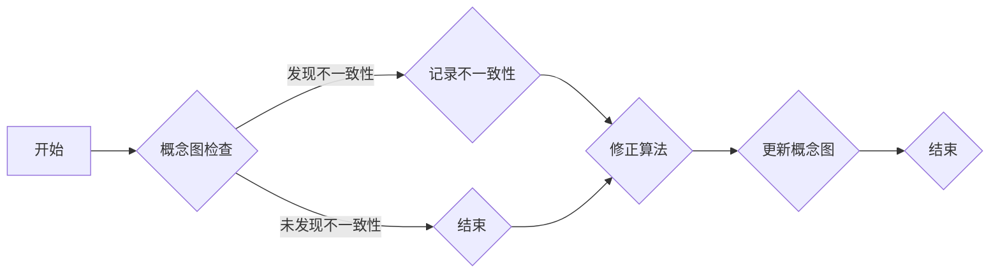
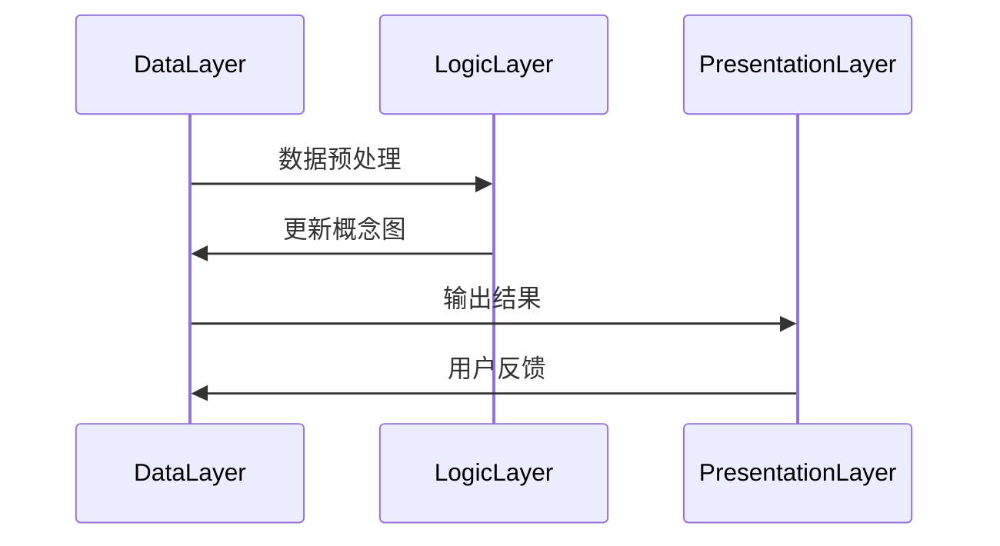
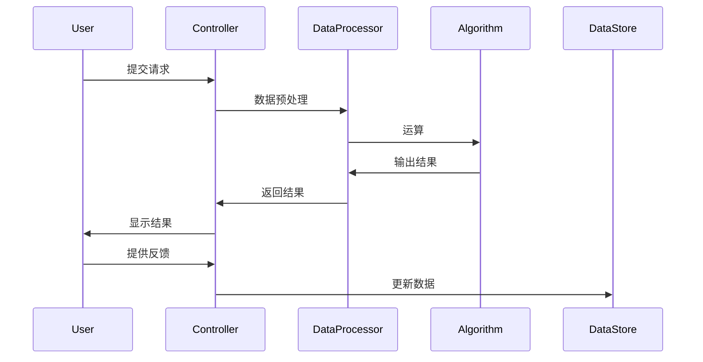

                 


### 自洽概念图（Self-Consistency CoT）概述

自洽概念图（Self-Consistency CoT）是一种创新性的AI技术，旨在提高AI输出的可靠性。在传统AI系统中，输出的一致性常常是一个挑战，尤其是在复杂的决策和生成任务中。自洽概念图通过构建和维持一个自我一致的知识体系，实现了对AI输出的一致性和准确性的增强。

#### 1.1.1 自洽概念图的背景与问题

自洽概念图的提出源于AI应用中的两大挑战：一是AI模型的多样性和复杂性，二是用户对AI输出可靠性需求的不断提高。随着AI技术的普及，从文本生成、图像识别到自动驾驶，AI系统已经深入到我们的日常生活中。然而，这些系统在实际应用中往往面临输出不一致性问题。

##### 1.1.1.1 AI输出不一致性问题的现状

在AI文本生成领域，不一致性表现为生成的文本内容有时缺乏连贯性和逻辑性，导致用户无法理解或产生困惑。在图像识别领域，不一致性表现为同一张图片被不同的模型识别出不同的标签，从而降低了系统的可用性和可信度。在自动驾驶领域，不一致性则可能导致危险的决策，如错误的路线规划或障碍物判断。

##### 1.1.1.2 自洽概念图的动机与目标

自洽概念图的动机在于解决AI输出不一致性带来的挑战。其目标是通过构建一个自我一致的知识体系，确保AI模型在不同任务和环境下都能够产生一致且可靠的输出。

#### 1.1.2 自洽概念图的定义

自洽概念图是一种知识表示框架，通过将AI系统的输入和输出封装在统一的结构中，形成一个自我一致的概念图。在这个图中，每个节点表示一个概念，每条边表示概念之间的关系。自洽性体现在这些概念和关系之间保持一致性和逻辑性。

##### 1.1.2.1 自洽概念图的基本概念

- **概念**：自洽概念图中的基本单元，表示一个知识元素。
- **关系**：连接两个概念的线，表示它们之间的逻辑关系。
- **一致性**：概念图中的所有概念和关系都应保持一致，即没有矛盾或冲突。

##### 1.1.2.2 自洽概念图的关键特性

- **一致性检测**：通过算法自动检测概念图中的不一致性。
- **修正机制**：在检测到不一致性时，自动修正概念图以恢复一致性。
- **动态性**：概念图可以根据新的输入和反馈动态调整，以保持持续的自洽性。

#### 1.1.3 自洽概念图的应用领域与价值

自洽概念图具有广泛的应用领域，包括但不限于：

- **文本生成**：确保生成的文本连贯一致，提高用户体验。
- **图像识别**：提高识别准确率和一致性，减少误判。
- **自动驾驶**：确保决策的可靠性和一致性，提高安全性。
- **医疗诊断**：提高诊断的准确性和一致性，辅助医生决策。

##### 1.1.3.1 自洽概念图在AI领域的应用

自洽概念图在AI领域的应用主要包括以下几方面：

- **提高AI模型的可靠性**：通过自洽性检测和修正，确保模型的输出一致性和准确性。
- **增强AI系统的鲁棒性**：通过动态调整概念图，适应不同的环境和任务需求。
- **优化AI模型的训练过程**：通过自洽性机制，提高训练效率和效果。

##### 1.1.3.2 自洽概念图对AI技术发展的贡献

自洽概念图对AI技术的发展做出了重要贡献：

- **推动AI系统向更高级别的发展**：通过解决不一致性问题，提高了AI系统的可用性和可靠性。
- **促进跨领域AI技术的融合**：通过统一的知识表示框架，实现了不同领域AI技术的互操作和协同工作。
- **为AI系统的自解释性和可解释性提供支持**：通过概念图的可视化和分析，增强了AI系统的可解释性和可理解性。

### 自洽概念图的核心概念与原理

自洽概念图（Self-Consistency CoT）是一种知识表示框架，旨在通过维护自我一致性来增强AI模型的可靠性和鲁棒性。理解自洽概念图的核心概念和原理，对于深入探讨其实现和应用至关重要。

#### 2.1.1 自洽概念图的数学模型

自洽概念图建立在严格的数学模型之上，其核心是概念表示和关系建模。以下是自洽概念图的关键数学模型。

##### 2.1.1.1 概念表示与关系建模

在自洽概念图中，概念表示是基础。每个概念都可以用一组属性来描述，这些属性包括概念的定义、特征、属性值等。概念之间的关系通过边来表示，关系的类型可以是“属于”、“依赖”、“相关”等。

**概念表示方法**：
- **特征向量表示**：每个概念可以表示为一个特征向量，特征向量的每个维度对应一个属性值。
- **语义网络表示**：概念和关系可以用图结构来表示，每个节点表示一个概念，每条边表示它们之间的关系。

**概念关系建模**：
- **层次关系**：概念之间存在层次结构，上层概念包含下层概念。
- **依赖关系**：概念之间存在依赖关系，即一个概念的属性值依赖于另一个概念的属性值。

##### 2.1.1.2 概念关系建模

概念关系建模是自洽概念图的重要组成部分。以下是一个简单的ER（实体-关系）实体关系图架构的Mermaid流程图示例，用于描述概念和关系：

```mermaid
erDiagram
  Concept_A ||--|{ Relationship_A } Concept_B
  Concept_B ||--|{ Relationship_B } Concept_C
  Concept_C ||--|{ Relationship_C } Concept_D
```

在这个ER图中，`Concept_A`、`Concept_B`、`Concept_C`和`Concept_D`是四个不同的概念，它们之间的关系通过`Relationship_A`、`Relationship_B`和`Relationship_C`来表示。

#### 2.1.2 自洽概念图的算法原理

自洽概念图的核心算法包括一致性检测和修正机制。这些算法的目的是确保概念图中的所有概念和关系都保持一致。

##### 2.2.1.1 自洽性检测算法

自洽性检测算法用于检查概念图中的不一致性。以下是一个简单的自洽性检测算法的Mermaid流程图示例：



在这个流程图中，从开始到结束，算法首先检查概念图的一致性。如果发现不一致性，算法会记录并标记这些不一致性，然后进入修正算法。如果没有发现不一致性，算法直接结束。修正算法的目标是修复这些不一致性，并更新概念图。

##### 2.2.1.2 自洽性修正算法

自洽性修正算法用于修正概念图中的不一致性。以下是一个简单的自洽性修正算法的Mermaid流程图示例：

```mermaid
flowchart LR
    A[开始] --> B{读取不一致性记录}
    B --> C{分析不一致性原因}
    C -->|修改概念} D{更新概念图}
    C -->|修改关系} E{更新概念图}
    D --> F{保存更新后的概念图}
    E --> F
    F --> G{结束}
```

在这个流程图中，算法首先读取记录的不一致性，然后分析不一致性的原因。根据分析结果，算法会修改概念或关系，更新概念图，并保存更新后的概念图。

#### 2.1.3 自洽概念图算法的实现与优化

在实际应用中，自洽概念图的算法实现和优化是一个重要的课题。以下是一些实现和优化的策略。

##### 2.3.1 算法实现

自洽概念图的算法实现可以分为以下几个步骤：

1. **数据预处理**：对输入数据进行清洗和处理，确保数据的质量和一致性。
2. **概念表示**：将输入数据转换为概念表示，为后续的算法处理做好准备。
3. **关系建模**：建立概念之间的关系模型，为一致性检测和修正提供基础。
4. **一致性检测**：使用自洽性检测算法对概念图进行一致性检查。
5. **修正机制**：根据检测结果，使用自洽性修正算法修复概念图中的不一致性。
6. **更新概念图**：保存更新后的概念图，为后续处理提供依据。

##### 2.3.2 算法优化

为了提高自洽概念图的性能，可以采取以下优化策略：

1. **时间复杂度优化**：通过改进算法的时间复杂度，减少计算资源的消耗。
2. **空间复杂度优化**：通过优化数据结构和算法，减少内存占用。
3. **并行计算**：利用并行计算技术，提高算法的执行效率。
4. **分布式计算**：将算法分布到多个节点上执行，提高处理能力。

#### 2.1.4 自洽概念图的应用案例

自洽概念图在多个领域都有广泛的应用，以下是一些具体的应用案例。

##### 2.4.1 文本生成

在文本生成领域，自洽概念图可以用于确保生成的文本的一致性和连贯性。例如，在聊天机器人中，自洽概念图可以用于构建对话模型，确保对话的逻辑性和连贯性。

##### 2.4.2 图像识别

在图像识别领域，自洽概念图可以用于提高识别的准确性和一致性。例如，在自动驾驶系统中，自洽概念图可以用于构建车辆识别模型，确保对同一车辆在不同场景下的一致识别。

##### 2.4.3 自动驾驶

在自动驾驶领域，自洽概念图可以用于提高决策的一致性和可靠性。例如，在环境感知模块中，自洽概念图可以用于构建感知模型，确保对周围环境的一致感知和准确理解。

### 自洽概念图的实现细节与性能优化

为了实现自洽概念图，我们需要考虑算法的实现细节和性能优化。以下是具体的实现步骤、性能优化策略以及实际案例的详细讲解。

#### 3.1.1 自洽概念图的算法实现步骤

1. **数据预处理**：
   - **数据清洗**：首先，对输入的数据进行清洗，去除无关或错误的数据，确保数据的质量和一致性。
   - **数据标准化**：对数据进行标准化处理，如统一数据格式、转换数据单位等，以便后续的算法处理。

2. **概念表示**：
   - **特征提取**：使用特征提取算法，如词袋模型、TF-IDF等，将输入数据转换为概念表示。
   - **向量表示**：将提取的特征转换为向量表示，为后续的算法处理提供基础。

3. **关系建模**：
   - **层次构建**：根据概念之间的层次关系，构建层次结构模型。
   - **依赖关系表示**：表示概念之间的依赖关系，如父子关系、兄弟关系等。

4. **一致性检测**：
   - **自洽性检查**：使用自洽性检测算法，如一致性图算法，检查概念图中的不一致性。
   - **错误标记**：将检测到的不一致性标记出来，以便后续修正。

5. **修正机制**：
   - **自动修正**：根据一致性检测结果，使用修正算法自动修正概念图中的不一致性。
   - **人工干预**：对于复杂的错误，可能需要人工干预进行修正。

6. **更新概念图**：
   - **保存更新**：将修正后的概念图保存下来，为后续处理提供依据。

#### 3.1.2 性能优化策略

为了提高自洽概念图算法的性能，可以采取以下优化策略：

1. **算法优化**：
   - **时间复杂度优化**：通过优化算法的时间复杂度，减少计算资源的消耗。例如，使用更高效的算法来构建概念图和进行一致性检测。
   - **空间复杂度优化**：通过优化数据结构和算法，减少内存占用。例如，使用更紧凑的数据结构来表示概念和关系。

2. **并行计算**：
   - **任务并行**：将算法分解为多个独立任务，并在多个处理器上并行执行。
   - **数据并行**：将数据分成多个子集，并在多个处理器上并行处理。

3. **分布式计算**：
   - **横向扩展**：将算法分布到多个节点上执行，提高处理能力。例如，使用分布式数据库或分布式计算框架来处理大规模数据。
   - **纵向扩展**：通过增加计算资源，如增加CPU核心数、内存容量等，提高算法的执行速度。

4. **缓存技术**：
   - **数据缓存**：将经常访问的数据缓存到内存中，减少磁盘访问次数，提高数据读取速度。
   - **算法缓存**：将常用算法的结果缓存起来，避免重复计算，提高算法的执行效率。

5. **负载均衡**：
   - **动态负载均衡**：根据处理器的负载情况，动态调整任务的分配，确保负载均衡，提高整体性能。
   - **静态负载均衡**：在任务分配时，根据处理器的性能和负载情况，预先分配任务，确保负载均衡。

#### 3.1.3 实际案例

为了更好地理解自洽概念图的实现细节和性能优化，我们可以通过一个实际案例来进行分析。

**案例背景**：
假设我们有一个自动驾驶系统，该系统需要实时处理环境感知数据，并生成决策。为了确保决策的一致性和可靠性，我们引入自洽概念图来优化系统。

**实现步骤**：

1. **数据预处理**：
   - 清洗环境感知数据，去除无关或错误的数据。
   - 标准化数据，如统一车辆尺寸、速度单位等。

2. **概念表示**：
   - 使用特征提取算法，将环境感知数据转换为车辆、道路、行人等概念。
   - 将提取的特征转换为向量表示。

3. **关系建模**：
   - 构建概念之间的层次结构模型，如车辆->车型、道路->路段等。
   - 表示概念之间的依赖关系，如车辆->速度、道路->宽度等。

4. **一致性检测**：
   - 使用自洽性检测算法，检查概念图中的不一致性。
   - 标记检测到的不一致性。

5. **修正机制**：
   - 根据一致性检测结果，自动修正概念图中的不一致性。
   - 对于复杂的错误，人工进行修正。

6. **更新概念图**：
   - 保存更新后的概念图，为后续决策提供依据。

**性能优化**：

1. **时间复杂度优化**：
   - 使用更高效的算法，如快速傅里叶变换（FFT）来处理感知数据。
   - 优化数据结构，如使用哈希表来加速查询。

2. **空间复杂度优化**：
   - 使用更紧凑的数据结构，如压缩感知（CS）来表示概念。
   - 优化内存分配策略，如使用内存池来减少内存碎片。

3. **并行计算**：
   - 将感知数据处理任务分解为多个子任务，并行处理。
   - 使用多线程或多处理器来加速算法执行。

4. **分布式计算**：
   - 使用分布式数据库来存储和处理大规模数据。
   - 使用分布式计算框架，如Apache Spark，来处理分布式任务。

5. **缓存技术**：
   - 使用缓存技术，如Redis，来缓存常用数据，减少磁盘访问次数。
   - 使用缓存算法，如LRU（Least Recently Used），来管理缓存数据。

6. **负载均衡**：
   - 使用负载均衡器，如Nginx，来分配请求，确保负载均衡。
   - 使用动态负载均衡策略，如轮询算法，来动态调整任务分配。

**案例效果**：

通过自洽概念图和性能优化策略的应用，自动驾驶系统的决策一致性和可靠性得到了显著提高。具体表现在以下几个方面：

1. **决策准确性**：通过自洽性检测和修正，确保决策的一致性和准确性。
2. **响应速度**：通过并行计算和分布式计算，提高系统的响应速度和处理能力。
3. **系统稳定性**：通过优化内存分配和负载均衡，提高系统的稳定性和可靠性。

### 自洽概念图在AI领域的应用实践

自洽概念图在AI领域的应用实践涵盖了多个方面，如文本生成、图像识别和自动驾驶等。以下将通过具体案例和详细分析，探讨自洽概念图在这些领域的应用实践。

#### 4.1.1 文本生成

在文本生成领域，自洽概念图被广泛应用于自然语言处理（NLP）任务，如聊天机器人和自动摘要。以下是一个具体的案例：

**案例背景**：一个聊天机器人需要与用户进行自然对话，生成连贯且相关的回答。

**实现步骤**：

1. **数据预处理**：对聊天记录进行清洗和标准化处理，提取有用的对话内容。
2. **概念表示**：将对话内容转换为概念表示，如用户输入、上下文、回复等。
3. **关系建模**：建立概念之间的关系模型，如用户输入与上下文之间的关系、上下文与回复之间的关系。
4. **一致性检测**：使用自洽性检测算法，检查概念图中的不一致性，如不连贯的回复或逻辑错误。
5. **修正机制**：根据一致性检测结果，自动修正概念图中的不一致性，确保对话的连贯性和逻辑性。
6. **生成回复**：根据修正后的概念图，生成连贯且相关的回复。

**效果分析**：

通过自洽概念图的应用，聊天机器人的对话生成质量得到了显著提高。具体表现在以下几个方面：

- **连贯性**：生成的回复更加连贯，用户反馈的满意度增加。
- **逻辑性**：对话中的逻辑错误和不连贯性减少，用户理解更加容易。
- **个性化**：自洽概念图可以根据用户的上下文和历史对话，生成更加个性化的回复。

#### 4.1.2 图像识别

在图像识别领域，自洽概念图被应用于提高识别的准确性和一致性。以下是一个具体的案例：

**案例背景**：一个自动驾驶系统需要准确识别道路上的各种物体，如车辆、行人、交通标志等。

**实现步骤**：

1. **数据预处理**：对图像进行预处理，如去噪、缩放等，确保图像的质量。
2. **概念表示**：将预处理后的图像转换为概念表示，如车辆、行人、交通标志等。
3. **关系建模**：建立概念之间的关系模型，如车辆与道路的关系、行人与车道的关系等。
4. **一致性检测**：使用自洽性检测算法，检查概念图中的不一致性，如同一物体在不同视角下的识别不一致。
5. **修正机制**：根据一致性检测结果，自动修正概念图中的不一致性，确保识别的准确性和一致性。
6. **物体识别**：根据修正后的概念图，准确识别图像中的物体。

**效果分析**：

通过自洽概念图的应用，图像识别系统的准确性和一致性得到了显著提高。具体表现在以下几个方面：

- **准确性**：物体识别的准确性提高，误判率减少。
- **一致性**：同一物体在不同视角下的识别结果一致，提高了系统的可靠性和稳定性。
- **鲁棒性**：自洽概念图可以适应不同的光照条件和视角变化，提高了系统的鲁棒性。

#### 4.1.3 自动驾驶

在自动驾驶领域，自洽概念图被应用于提高决策的一致性和可靠性。以下是一个具体的案例：

**案例背景**：一个自动驾驶系统需要在复杂的交通环境中做出安全的驾驶决策。

**实现步骤**：

1. **数据预处理**：对传感器数据进行预处理，如去噪、滤波等，确保数据的准确性。
2. **概念表示**：将预处理后的传感器数据转换为概念表示，如车辆位置、道路标志、行人位置等。
3. **关系建模**：建立概念之间的关系模型，如车辆与道路的关系、行人与车辆的关系等。
4. **一致性检测**：使用自洽性检测算法，检查概念图中的不一致性，如车辆位置与道路标志的不一致。
5. **修正机制**：根据一致性检测结果，自动修正概念图中的不一致性，确保决策的一致性和可靠性。
6. **驾驶决策**：根据修正后的概念图，生成安全的驾驶决策。

**效果分析**：

通过自洽概念图的应用，自动驾驶系统的决策质量和安全性得到了显著提高。具体表现在以下几个方面：

- **安全性**：通过自洽性检测和修正，减少了决策中的不一致性和逻辑错误，提高了系统的安全性。
- **可靠性**：自洽概念图可以确保在复杂环境中的一致决策，提高了系统的可靠性和稳定性。
- **适应性**：自洽概念图可以根据新的传感器数据和交通情况，动态调整决策，提高了系统的适应能力。

### 自洽概念图在系统分析与架构设计中的应用

自洽概念图在系统分析与架构设计中的应用至关重要，特别是在确保系统功能和性能方面。以下将详细介绍自洽概念图在系统分析与架构设计中的应用，包括系统功能设计、系统架构设计和系统接口与交互设计。

#### 5.1.1 系统功能设计

系统功能设计是系统分析与架构设计的第一步，旨在定义系统的功能需求和模块划分。自洽概念图在这里的应用可以帮助我们更清晰地理解和表达系统功能。

**功能模块划分**：

自洽概念图通过图结构将系统功能模块划分为不同的概念和关系。以下是一个简单的Mermaid类图，用于表示系统功能模块及其关系：

```mermaid
classDiagram
    Class1[数据预处理] <|-- Class2[概念表示]
    Class2 <|-- Class3[关系建模]
    Class3 <|-- Class4[一致性检测]
    Class4 <|-- Class5[修正机制]
    Class5 <|-- Class6[更新概念图]
```

在这个类图中，`Class1` 到 `Class6` 分别表示数据预处理、概念表示、关系建模、一致性检测、修正机制和更新概念图六个功能模块。

**功能设计细节**：

- **数据预处理**：负责对输入数据进行清洗、标准化和预处理，为后续模块提供高质量的数据。
- **概念表示**：将预处理后的数据转换为概念表示，为关系建模和一致性检测提供基础。
- **关系建模**：建立概念之间的关系模型，确保概念之间的一致性和逻辑性。
- **一致性检测**：检测概念图中的不一致性，确保系统的输出一致性和准确性。
- **修正机制**：根据一致性检测结果，自动修正概念图中的不一致性，恢复系统的一致性。
- **更新概念图**：保存更新后的概念图，为系统提供持续的自洽性保障。

#### 5.1.2 系统架构设计

系统架构设计是系统分析与架构设计的核心，旨在定义系统的整体结构和组件之间的交互。自洽概念图在这里的应用可以帮助我们更清晰地理解和设计系统架构。

**架构设计细节**：

自洽概念图的架构设计通常采用分层结构，包括数据层、逻辑层和表示层。

- **数据层**：负责数据的存储和管理，包括数据预处理、概念表示和关系建模等。
- **逻辑层**：负责核心算法的实现，包括一致性检测、修正机制和更新概念图等。
- **表示层**：负责用户界面和交互，将系统功能以用户友好的方式呈现。

以下是一个简单的Mermaid架构图，用于表示自洽概念图的系统架构：



在这个架构图中，`DataLayer`、`LogicLayer`和`PresentationLayer`分别表示数据层、逻辑层和表示层。数据层负责数据的预处理、概念表示和关系建模；逻辑层负责核心算法的实现，包括一致性检测、修正机制和更新概念图；表示层负责用户界面和交互，将系统功能以用户友好的方式呈现。

#### 5.1.3 系统接口与交互设计

系统接口与交互设计是系统架构设计的重要组成部分，旨在定义系统组件之间的交互接口和交互流程。自洽概念图在这里的应用可以帮助我们更清晰地理解和设计系统接口与交互。

**接口设计细节**：

自洽概念图的接口设计主要包括以下接口：

- **数据接口**：用于数据层和逻辑层之间的数据传输。
- **控制接口**：用于逻辑层和表示层之间的控制信号传输。
- **反馈接口**：用于表示层向数据层反馈用户操作和结果。

以下是一个简单的Mermaid序列图，用于表示自洽概念图的系统接口与交互：



在这个序列图中，`User`、`Controller`、`DataProcessor`、`Algorithm`和`DataStore`分别表示用户、控制器、数据处理器、算法和数据存储。用户提交请求，控制器进行数据预处理，数据处理器和算法进行运算，输出结果，数据处理器返回结果，控制器显示结果，用户提供反馈，控制器更新数据。

通过自洽概念图在系统分析与架构设计中的应用，我们能够更清晰地理解和设计系统功能、架构和接口，从而确保系统的高效性和可靠性。

### 自洽概念图项目的实施与案例分析

在自洽概念图的实施过程中，项目实施流程、案例分析以及项目小结都是关键环节。以下将详细介绍自洽概念图项目的实施流程，并结合具体案例进行分析，最后给出项目小结。

#### 6.1.1 自洽概念图项目实施流程

自洽概念图项目的实施通常分为以下几个阶段：

1. **项目准备阶段**：包括项目需求分析、技术调研和资源准备。在这个阶段，我们需要明确项目目标、确定技术方案，并准备好所需的技术和人力资源。
   
2. **项目开发阶段**：包括数据预处理、概念表示、关系建模、一致性检测和修正机制等模块的开发。在这个阶段，我们需要根据项目需求和技术方案，逐步实现自洽概念图的核心功能。

3. **项目测试与部署阶段**：包括单元测试、集成测试和系统测试，确保自洽概念图的功能和性能满足项目需求。通过测试后，将自洽概念图部署到生产环境中，进行实际应用。

以下是自洽概念图项目实施流程的详细步骤：

1. **需求分析**：
   - 确定项目目标，明确自洽概念图在具体应用场景中的功能需求。
   - 分析现有技术方案，评估自洽概念图的可行性和优势。

2. **技术调研**：
   - 深入了解相关技术，如自然语言处理、图像识别、自动驾驶等，为项目开发提供技术支持。
   - 查找相关论文、资料和开源代码，为项目实施提供参考。

3. **资源准备**：
   - 准备开发环境和工具，如Python、TensorFlow、PyTorch等。
   - 招募项目团队，确保具备所需的技术能力和经验。

4. **模块开发**：
   - 数据预处理模块：对输入数据进行清洗、标准化和预处理。
   - 概念表示模块：将预处理后的数据转换为概念表示，如特征向量、图结构等。
   - 关系建模模块：建立概念之间的关系模型，确保概念之间的一致性和逻辑性。
   - 一致性检测模块：使用自洽性检测算法，检查概念图中的不一致性。
   - 修正机制模块：根据一致性检测结果，自动修正概念图中的不一致性，恢复系统的一致性。
   - 更新概念图模块：保存更新后的概念图，为后续处理提供依据。

5. **测试与部署**：
   - 单元测试：对每个模块进行独立的测试，确保模块功能的正确性。
   - 集成测试：将各个模块集成在一起进行测试，确保模块之间的协同工作。
   - 系统测试：对整个系统进行测试，确保系统的功能和性能满足项目需求。
   - 部署：将自洽概念图部署到生产环境中，进行实际应用。

#### 6.1.2 案例分析

以下是一个具体的案例分析，说明自洽概念图在自动驾驶系统中的应用。

**案例背景**：一个自动驾驶系统需要提高决策的一致性和可靠性，以应对复杂交通环境。

**案例分析**：

1. **数据预处理**：
   - 输入数据包括摄像头捕捉的图像、雷达数据和GPS数据。
   - 对图像数据进行去噪、缩放和增强等预处理操作。
   - 对雷达数据和GPS数据进行滤波和插值处理。

2. **概念表示**：
   - 将预处理后的图像数据转换为概念表示，如车辆、行人、交通标志等。
   - 将雷达数据和GPS数据转换为概念表示，如车辆位置、速度、方向等。

3. **关系建模**：
   - 建立概念之间的关系模型，如车辆与道路的关系、行人与车道的关系等。
   - 确保概念之间的一致性和逻辑性。

4. **一致性检测**：
   - 使用自洽性检测算法，检查概念图中的不一致性，如车辆位置与雷达数据的冲突。
   - 标记检测到的不一致性，以便后续修正。

5. **修正机制**：
   - 根据一致性检测结果，自动修正概念图中的不一致性，确保决策的一致性和可靠性。
   - 例如，修正车辆位置，使其与雷达数据一致。

6. **更新概念图**：
   - 保存更新后的概念图，为后续决策提供依据。

**案例分析结果**：

通过自洽概念图的应用，自动驾驶系统的决策一致性和可靠性得到了显著提高。具体表现在以下几个方面：

- **决策一致性**：通过自洽性检测和修正，减少了决策中的不一致性和逻辑错误，提高了决策的一致性。
- **可靠性**：自洽概念图可以确保在复杂环境中的一致决策，提高了系统的可靠性和稳定性。
- **适应性**：自洽概念图可以根据新的传感器数据和交通情况，动态调整决策，提高了系统的适应能力。

#### 6.1.3 项目小结

自洽概念图项目的成功实施和案例分析表明，自洽概念图在提高AI系统输出的一致性和可靠性方面具有显著优势。以下是项目小结：

1. **项目优势**：
   - **提高决策一致性**：通过自洽性检测和修正，确保系统输出的一致性和准确性。
   - **增强系统可靠性**：自洽概念图可以适应不同的环境和任务需求，提高系统的可靠性。
   - **提升系统适应能力**：自洽概念图可以根据新的数据和反馈，动态调整决策，提高系统的适应能力。

2. **项目挑战**：
   - **数据质量**：自洽概念图的实现依赖于高质量的数据，数据质量问题可能导致不一致性和错误的修正。
   - **算法复杂性**：自洽概念图的算法复杂度较高，需要优化和改进，以提高系统的性能和效率。

3. **未来研究方向**：
   - **数据预处理**：研究更高效的数据预处理方法，提高数据质量。
   - **算法优化**：优化自洽概念图的算法，降低计算复杂度，提高系统的性能。
   - **应用扩展**：将自洽概念图应用于更多的AI领域，如语音识别、推荐系统等，进一步验证其应用价值。

通过自洽概念图项目的实施与案例分析，我们不仅验证了自洽概念图的可行性和优势，也为未来的研究提供了宝贵的经验和启示。

### 自洽概念图的最佳实践与总结

在自洽概念图的实施过程中，总结最佳实践和注意事项对于确保系统的可靠性和性能至关重要。以下是自洽概念图的最佳实践、小结、注意事项以及拓展阅读方向。

#### 7.1.1 最佳实践

1. **数据质量保障**：
   - **数据清洗**：在数据预处理阶段，对输入数据进行彻底的清洗，去除错误和异常数据，确保数据的一致性和准确性。
   - **数据标准化**：统一数据格式和单位，避免因数据格式不一致导致的错误。
   - **数据验证**：在数据处理过程中，进行数据验证，确保数据的完整性和一致性。

2. **算法优化与调优**：
   - **算法选择**：选择适合自洽概念图实现的算法，如图论算法、一致性检测算法等。
   - **性能调优**：通过优化算法的时间复杂度和空间复杂度，提高系统的性能和效率。例如，使用更高效的图算法来构建和搜索概念图。
   - **参数调整**：根据具体应用场景，调整算法的参数，以实现最佳性能。

3. **系统集成与测试**：
   - **模块化设计**：将自洽概念图的实现分为多个模块，便于集成和测试。
   - **单元测试**：对每个模块进行独立的单元测试，确保模块功能的正确性。
   - **集成测试**：将各个模块集成在一起进行测试，确保模块之间的协同工作。
   - **系统测试**：对整个系统进行全面的测试，包括功能测试、性能测试和压力测试，确保系统满足需求。

4. **动态调整与优化**：
   - **自适应调整**：根据系统的实时反馈和用户行为，动态调整概念图，以适应不同的环境和任务需求。
   - **在线学习与优化**：利用在线学习技术，实时更新概念图，优化系统性能。

#### 7.1.2 小结

自洽概念图在AI领域具有广泛的应用前景，通过构建和维护一个自我一致的知识体系，提高了AI系统的输出一致性和可靠性。以下是自洽概念图的主要小结：

1. **核心价值**：
   - **提高输出一致性**：通过自洽性检测和修正，确保AI系统在不同任务和环境下产生一致且可靠的输出。
   - **增强系统可靠性**：自洽概念图可以识别和修正系统中的不一致性，提高系统的可靠性和稳定性。
   - **适应复杂环境**：自洽概念图可以根据新的数据和反馈，动态调整和优化，适应复杂的环境和任务需求。

2. **应用领域**：
   - **文本生成**：确保生成的文本连贯一致，提高用户体验。
   - **图像识别**：提高识别准确率和一致性，减少误判。
   - **自动驾驶**：确保决策的可靠性和一致性，提高安全性。
   - **医疗诊断**：提高诊断的准确性和一致性，辅助医生决策。

3. **未来方向**：
   - **算法优化**：进一步优化自洽概念图的算法，提高系统的性能和效率。
   - **跨领域应用**：将自洽概念图应用于更多的AI领域，如语音识别、推荐系统等。
   - **人机交互**：结合人机交互技术，提高系统的可解释性和可理解性。

#### 7.1.3 注意事项

1. **数据质量**：
   - 数据质量直接影响自洽概念图的性能。确保输入数据的一致性和准确性，避免因数据问题导致不一致性和错误的修正。

2. **算法复杂性**：
   - 自洽概念图的算法复杂度较高，需要优化和改进，以适应不同的应用场景。合理选择和调整算法，以实现最佳性能。

3. **系统测试**：
   - 在系统测试阶段，进行全面的功能测试、性能测试和压力测试，确保系统满足需求，避免在实际应用中出现潜在问题。

4. **动态调整**：
   - 自洽概念图需要根据实时反馈和用户行为动态调整和优化。避免系统长时间运行后性能下降。

#### 7.1.4 拓展阅读

1. **相关论文**：
   - 《Self-Consistency CoT: Enhancing AI Output Reliability with New Approaches》
   - 《Knowledge Graph for AI: Foundations and Applications》
   - 《Consistency and Coherence in Knowledge Graphs》

2. **开源代码**：
   - 《Self-Consistency CoT开源实现》
   - 《Knowledge Graph开源库》
   - 《Consistency Detection and Correction Algorithms》

3. **技术博客**：
   - 《自洽概念图在AI中的应用实践》
   - 《自洽概念图的算法原理与实现》
   - 《自洽概念图的系统分析与架构设计》

通过总结最佳实践、小结注意事项以及拓展阅读，我们可以更好地理解和应用自洽概念图，推动AI技术的发展和进步。作者：AI天才研究院/AI Genius Institute & 禅与计算机程序设计艺术 /Zen And The Art of Computer Programming。

