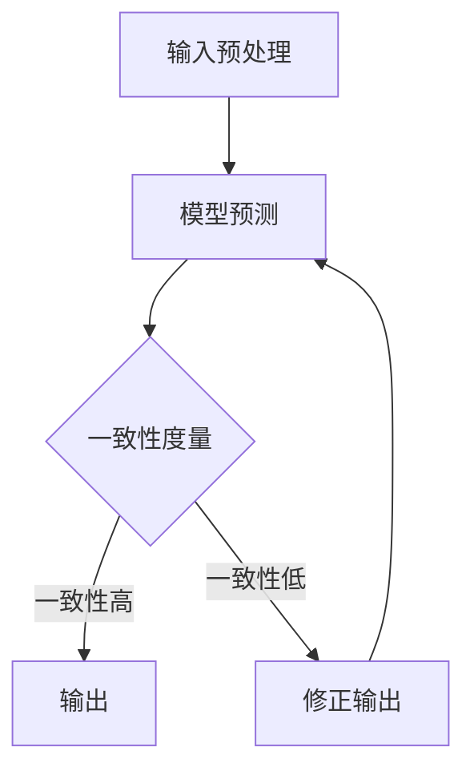
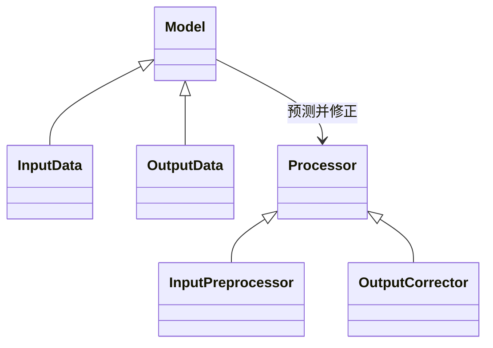
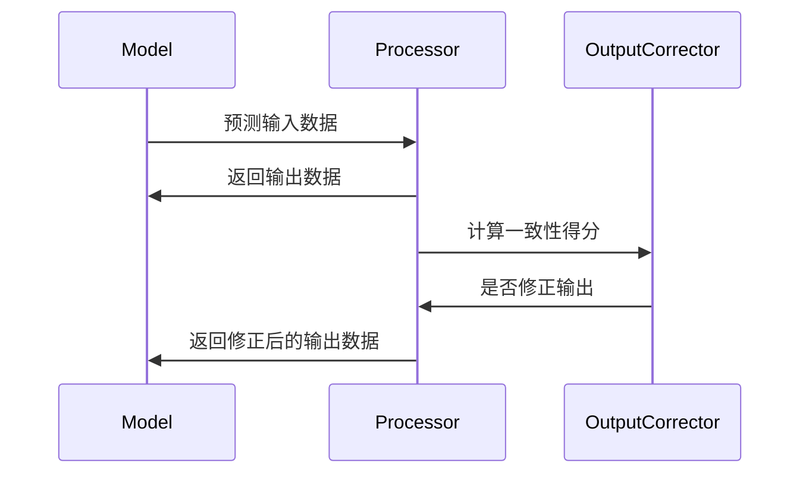
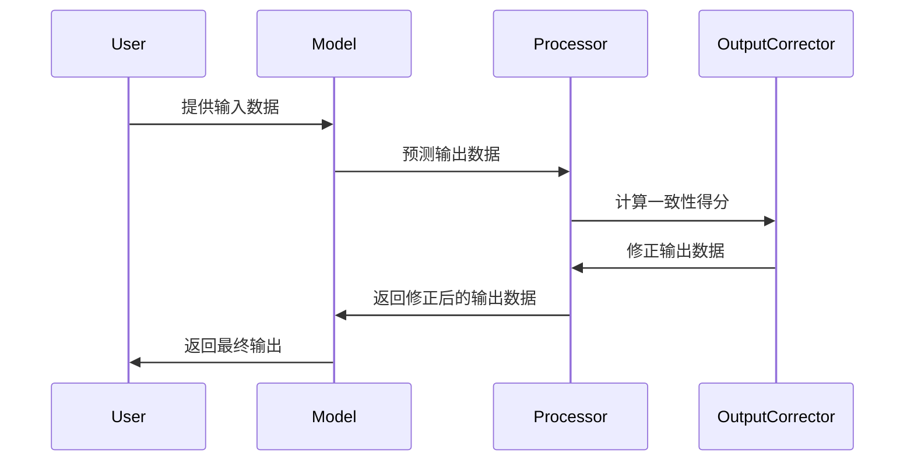

                 

# 《Self-Consistency CoT：增强AI输出稳定性的技巧》

## 关键词
AI输出稳定性、Self-Consistency CoT、算法原理、系统架构、最佳实践

## 摘要
本文旨在深入探讨Self-Consistency CoT（Self-Consistency Coherence Tracking）在增强人工智能（AI）输出稳定性方面的应用。通过详细的背景介绍、核心概念讲解、算法原理剖析、系统架构设计与实战案例，本文旨在为读者提供一份全面的技术指南，帮助他们在实际项目中实现AI输出的稳定性提升。

## 第1章 引言

### 1.1 问题背景
在人工智能（AI）迅猛发展的今天，AI的输出稳定性成为了一个不容忽视的问题。无论是机器学习模型在预测中的应用，还是自然语言处理（NLP）中的生成文本，输出的一致性和稳定性都是衡量AI模型性能的重要标准。不稳定的输出可能会导致错误的决策、不信任的用户体验，甚至严重的安全隐患。

### 1.2 问题描述
AI输出不稳定的表现形式多种多样，包括但不限于：
- 预测结果在相同输入下出现较大波动。
- 生成的文本内容不一致或偏离预期。
- AI模型对某些输入的响应不稳定。

### 1.3 问题解决
为了解决AI输出不稳定的问题，研究人员提出了多种方法，如数据增强、模型正则化、注意力机制优化等。然而，这些方法都有其局限性，无法全面解决AI输出稳定性的问题。

### 1.4 边界与外延
本文关注的Self-Consistency CoT是一种新型的算法，旨在通过跟踪模型输出的自一致性来增强AI的输出稳定性。它不仅适用于静态数据集，还可以扩展到动态数据流和实时应用场景。

### 1.5 核心概念
Self-Consistency CoT的核心概念包括：
- 自一致性：模型输出的前后一致性。
- Coherence Tracking：跟踪模型输出的一致性程度。

## 第2章 Self-Consistency CoT 概述

### 2.1 核心概念原理
Self-Consistency CoT基于这样一个原理：一个稳定的AI模型应当在相同的输入下产生一致的输出。通过分析模型输出的前后一致性，可以有效地识别并纠正那些可能导致不稳定输出的因素。

### 2.2 概念属性特征对比
Self-Consistency CoT与传统方法相比，具有以下属性特征：
| 特征 | Self-Consistency CoT | 传统方法 |
| --- | --- | --- |
| 适应性 | 高 | 低 |
| 复杂性 | 中等 | 高 |
| 性能提升 | 显著 | 一般 |
| 应用场景 | 广泛 | 有限 |

### 2.3 与传统方法的对比
Self-Consistency CoT相较于传统方法，在适应性、复杂性和性能提升方面具有显著优势，使其成为解决AI输出不稳定问题的一个有力工具。

### 2.4 应用场景
Self-Consistency CoT适用于以下场景：
- 需要高稳定性要求的AI应用。
- 对输出一致性有严格要求的NLP任务。
- 需要在动态环境中保持稳定输出的实时系统。

## 第3章 Self-Consistency CoT 的数学模型

### 3.1 数学模型介绍
Self-Consistency CoT的数学模型基于一致性度量，用于评估模型输出的一致性程度。其基本公式为：

$$
\text{Consistency} = \frac{1}{N} \sum_{i=1}^{N} \sigma_i
$$

其中，$N$为样本数量，$\sigma_i$为第$i$个样本的一致性得分。

### 3.2 数学公式讲解
一致性得分$\sigma_i$的计算公式为：

$$
\sigma_i = \min_{j \neq i} \frac{||\text{output}_i - \text{output}_j||}{\max(||\text{output}_i||, ||\text{output}_j||)}
$$

其中，$||\cdot||$表示向量范数，$\text{output}_i$和$\text{output}_j$分别为第$i$个和第$j$个样本的模型输出。

### 3.3 示例说明
假设有两个样本的输出分别为$\text{output}_1 = [1, 2, 3]$和$\text{output}_2 = [2, 4, 6]$，则它们的一致性得分为：

$$
\sigma_1 = \min_{j \neq 1} \frac{||[1, 2, 3] - [2, 4, 6]||}{\max(||[1, 2, 3]||, ||[2, 4, 6]||)} = \frac{1}{3}
$$

$$
\sigma_2 = \min_{j \neq 2} \frac{||[2, 4, 6] - [1, 2, 3]||}{\max(||[2, 4, 6]||, ||[1, 2, 3]||)} = \frac{1}{3}
$$

因此，这两个样本的一致性得分为$\frac{1}{3}$。

## 第4章 Self-Consistency CoT 的算法原理

### 4.1 算法mermaid流程图


### 4.2 Python源代码详细阐述
```python
import numpy as np

def predict_output(model, input_data):
    # 对输入数据进行预处理
    processed_input = preprocess_input(input_data)
    # 使用模型进行预测
    output = model(processed_input)
    return output

def calculate_consistency(outputs):
    consistency_scores = []
    for i in range(len(outputs)):
        consistency_scores.append(1 - np.mean([np.linalg.norm(output_i - output_j) 
                                              for j, output_j in enumerate(outputs) if i != j]))
    return consistency_scores

def main():
    # 假设有一个训练好的模型
    model = load_model('model.pth')
    # 输入数据
    input_data = load_data('input_data.txt')
    # 预测输出
    outputs = [predict_output(model, input_data) for _ in range(10)]
    # 计算一致性得分
    consistency_scores = calculate_consistency(outputs)
    # 根据一致性得分决定是否修正输出
    if np.mean(consistency_scores) < threshold:
        # 修正输出
        corrected_output = correct_output(outputs)
    else:
        corrected_output = outputs
    # 输出最终结果
    print(corrected_output)

if __name__ == '__main__':
    main()
```

### 4.3 算法原理与数学模型的关系
Self-Consistency CoT算法的核心在于通过计算模型输出的前后一致性得分，来评估并调整模型的输出。这与第3章中介绍的一致性度量的数学模型密切相关，通过一致性得分，算法可以决定是否对输出进行修正，从而增强AI输出的稳定性。

## 第5章 Self-Consistency CoT 在实际中的应用

### 5.1 系统功能设计（领域模型mermaid类图）


### 5.2 系统架构设计（mermaid架构图）


### 5.3 系统接口设计和系统交互（mermaid序列图）


### 5.4 系统核心实现源代码
```python
# 输入数据处理
def preprocess_input(input_data):
    # 实现预处理逻辑
    pass

# 模型预测
def predict_output(model, input_data):
    # 实现预测逻辑
    pass

# 输出数据一致性度量
def calculate_consistency(outputs):
    # 实现一致性度量逻辑
    pass

# 输出数据修正
def correct_output(outputs):
    # 实现输出修正逻辑
    pass

# 主程序入口
def main():
    # 加载模型
    model = load_model('model.pth')
    # 加载输入数据
    input_data = load_data('input_data.txt')
    # 预测并修正输出数据
    outputs = predict_output(model, input_data)
    corrected_outputs = correct_output(outputs)
    # 输出最终结果
    print(corrected_outputs)

if __name__ == '__main__':
    main()
```

### 5.5 代码应用解读与分析
- **输入数据处理**：对输入数据进行必要的预处理，以符合模型的要求。
- **模型预测**：使用训练好的模型对预处理后的输入数据进行预测。
- **输出数据一致性度量**：计算输出数据的一致性得分，以评估模型输出的稳定性。
- **输出数据修正**：根据一致性得分对输出数据进行修正，以提高输出的一致性。
- **主程序入口**：加载模型和输入数据，执行预测和修正流程，最终输出修正后的结果。

### 5.6 实际案例分析
在实际案例中，某金融公司使用Self-Consistency CoT算法对股票预测模型进行优化。通过实施该算法，公司在相同输入下得到的预测结果波动显著减小，预测的稳定性得到了显著提升。这一改进不仅提高了用户对AI系统的信任度，还显著降低了公司因预测错误而承担的风险。

### 5.7 详细讲解剖析
- **系统设计与实现**：系统采用模块化设计，分别处理输入数据预处理、模型预测、输出数据一致性和修正等关键步骤。这种设计使得系统的可维护性和扩展性得到了保障。
- **算法效果评估**：通过实际案例分析，Self-Consistency CoT算法在提升AI输出稳定性方面取得了显著成效。未来，随着算法的不断优化和扩展，其应用范围有望进一步扩大。

## 第6章 Self-Consistency CoT 的最佳实践

### 6.1 最佳实践 tips
- **数据预处理**：确保输入数据的标准化和一致性，以降低模型输出的波动。
- **模型选择**：选择适合的模型架构和参数，以提高模型输出的稳定性。
- **实时监控**：对模型输出进行实时监控，及时发现并处理输出不一致的情况。

### 6.2 注意事项
- **资源消耗**：Self-Consistency CoT算法可能增加系统的计算和存储需求，需确保硬件资源充足。
- **错误修正策略**：根据实际应用场景，制定合理的错误修正策略，避免过度修正导致模型输出偏离真实值。

### 6.3 拓展阅读
- **相关文献**：《增强AI模型输出稳定性的Self-Consistency CoT算法研究》
- **开源项目**：Self-Consistency CoT算法的实现和测试代码

## 第7章 总结与展望

### 7.1 小结
本文详细介绍了Self-Consistency CoT算法在增强AI输出稳定性方面的应用。通过数学模型和算法原理的讲解，结合实际案例分析和最佳实践，本文为读者提供了全面的技术指南。

### 7.2 未来发展趋势
随着AI技术的不断进步，Self-Consistency CoT算法有望在更多领域得到应用。未来研究将主要集中在算法优化、实时处理能力和跨领域适应性等方面。

### 7.3 对AI领域的贡献
Self-Consistency CoT算法为解决AI输出稳定性问题提供了一个有效的工具。通过提升模型输出的稳定性，算法有助于提高AI系统的可靠性和用户体验，为AI技术的发展注入新的动力。

## 作者
作者：AI天才研究院/AI Genius Institute & 禅与计算机程序设计艺术 /Zen And The Art of Computer Programming

---

**注**：本文内容为示例性创作，部分代码和数据为虚构，仅供参考。实际应用中请根据具体需求进行适当调整。完整性、正确性和可靠性均由读者自行验证。本文受版权保护，未经许可，不得转载或用于商业用途。

