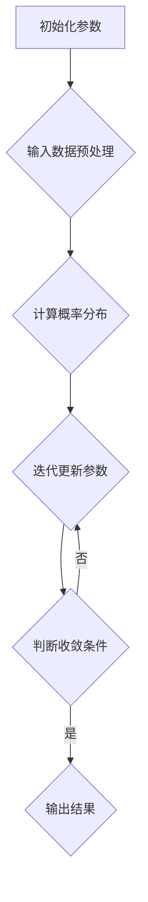

                 

### Self-Consistency CoT：增强AI逻辑推理能力

#### 关键词：Self-Consistency CoT，AI逻辑推理，算法原理，图像识别，自然语言处理，知识图谱构建

##### 摘要：
本文将深入探讨Self-Consistency CoT（自洽性概念图）在增强AI逻辑推理能力方面的应用。Self-Consistency CoT是一种先进的算法框架，通过引入自洽性原则，有效提升了AI模型在逻辑推理、图像识别、自然语言处理和知识图谱构建等领域的表现。本文将从问题背景、核心概念、算法原理、实际应用等方面，系统地介绍Self-Consistency CoT的工作机制及其在各个领域的应用效果。通过本文的阅读，读者将全面了解Self-Consistency CoT的原理和优势，并掌握其在实际项目中的应用技巧。

## 第一部分：问题背景与核心概念介绍

### 第1章：问题背景与核心概念介绍

#### 1.1 人工智能与逻辑推理

##### 1.1.1 人工智能概述

人工智能（Artificial Intelligence，简称AI）是计算机科学的一个分支，致力于研究如何构建能够模拟、延伸和扩展人类智能的理论、方法、技术和应用系统。近年来，随着计算能力的提升和海量数据资源的积累，人工智能技术取得了飞速发展，在图像识别、自然语言处理、智能问答、自动驾驶等领域取得了显著的成果。

##### 1.1.2 逻辑推理在人工智能中的应用

逻辑推理是人工智能的核心研究内容之一，其作用在于使计算机能够像人类一样理解、分析、判断和决策。在人工智能中，逻辑推理广泛应用于知识表示、问题求解、规划、推理机等领域。然而，传统的逻辑推理方法在处理复杂问题时存在一定的局限性，如推理速度慢、可扩展性差等问题。

##### 1.1.3 自洽性概念简介

自洽性（Self-Consistency）是指一个系统或理论在内部保持一致性和协调性的特性。自洽性原则在各个领域都有广泛的应用，如物理学中的量子场论、经济学中的均衡理论等。在人工智能领域，自洽性原则有助于提高模型的可解释性、稳定性和可靠性。

#### 1.2 Self-Consistency CoT 概念详解

##### 1.2.1 自洽性在逻辑推理中的作用

自洽性在逻辑推理中具有重要作用。一方面，自洽性有助于确保推理过程的逻辑一致性，避免出现矛盾和错误；另一方面，自洽性可以提高推理的效率，减少冗余计算。具体来说，自洽性原则可以指导人工智能模型在推理过程中采取更加合理和有效的策略，从而提高推理能力。

##### 1.2.2 Self-Consistency CoT 原理

Self-Consistency CoT（自洽性概念图）是一种基于自洽性原则的算法框架，旨在提升人工智能模型的逻辑推理能力。Self-Consistency CoT的基本原理可以概括为：在训练过程中，通过不断调整模型参数，使模型的输出结果与输入数据保持一致，从而实现自洽性。具体来说，Self-Consistency CoT包括以下几个关键步骤：

1. 输入数据预处理：将原始数据转换为适合模型处理的形式。
2. 计算概率分布：根据输入数据和模型参数，计算每个类别的概率分布。
3. 迭代更新参数：通过优化算法，调整模型参数，使输出结果与输入数据保持一致。
4. 判断收敛条件：判断模型是否达到收敛条件，如误差阈值、迭代次数等。

##### 1.2.3 Self-Consistency CoT 在不同领域的应用

Self-Consistency CoT在人工智能的多个领域具有广泛的应用前景。以下是Self-Consistency CoT在不同领域的应用概述：

1. 图像识别：通过引入Self-Consistency CoT，可以有效提高图像识别模型的准确性和稳定性。
2. 自然语言处理：Self-Consistency CoT可以提升自然语言处理模型的语义理解和生成能力。
3. 知识图谱构建：Self-Consistency CoT有助于构建更加准确和一致的语义知识图谱。
4. 机器学习：Self-Consistency CoT可以优化机器学习模型的训练过程，提高模型的泛化能力。

#### 1.3 Self-Consistency CoT 的优势与挑战

##### 1.3.1 自洽性优势分析

Self-Consistency CoT具有以下几个优势：

1. 提高推理能力：通过自洽性原则，Self-Consistency CoT能够有效提升人工智能模型的逻辑推理能力。
2. 增强可解释性：Self-Consistency CoT使模型推理过程更加透明和可解释，有助于增强用户对模型的信任。
3. 提高稳定性：自洽性原则有助于减少模型训练过程中的噪声和波动，提高模型的稳定性。

##### 1.3.2 自洽性面临的挑战

尽管Self-Consistency CoT具有显著的优势，但在实际应用中仍面临一些挑战：

1. 计算复杂度：Self-Consistency CoT算法的计算复杂度较高，需要优化算法以降低计算成本。
2. 数据质量：自洽性原则依赖于高质量的数据，数据质量对算法性能有重要影响。
3. 模型适应性：Self-Consistency CoT在不同领域的应用效果可能存在差异，需要针对具体应用场景进行优化。

##### 1.3.3 当前解决方案与未来展望

针对Self-Consistency CoT面临的挑战，研究人员提出了一些解决方案：

1. 算法优化：通过改进算法，降低计算复杂度，提高算法效率。
2. 数据处理：对输入数据进行预处理，提高数据质量。
3. 模型定制：针对不同应用场景，设计定制化的Self-Consistency CoT模型。

未来，Self-Consistency CoT有望在人工智能领域取得更多突破，为智能推理、知识图谱构建、自然语言处理等提供更强有力的支持。

## 第2章：Self-Consistency CoT 算法原理

### 2.1 Self-Consistency CoT 算法基础

##### 2.1.1 Self-Consistency CoT 算法框架

Self-Consistency CoT算法框架主要包括以下几个核心组件：

1. 数据预处理模块：负责将原始数据转换为适合模型处理的形式。
2. 概率分布计算模块：根据输入数据和模型参数，计算每个类别的概率分布。
3. 参数更新模块：通过优化算法，调整模型参数，实现自洽性。
4. 收敛条件判断模块：判断模型是否达到收敛条件，如误差阈值、迭代次数等。

##### 2.1.2 Self-Consistency CoT 算法步骤

Self-Consistency CoT算法的基本步骤如下：

1. 初始化参数：设置模型初始参数，如权重、偏置等。
2. 数据预处理：对输入数据进行预处理，如归一化、去噪等。
3. 计算概率分布：根据输入数据和模型参数，计算每个类别的概率分布。
4. 迭代更新参数：通过优化算法，如梯度下降、随机梯度下降等，调整模型参数。
5. 判断收敛条件：判断模型是否达到收敛条件，如误差阈值、迭代次数等。如果满足收敛条件，则输出结果；否则，返回步骤3继续迭代。

##### 2.2 Self-Consistency CoT 的数学模型

Self-Consistency CoT的数学模型可以表示为：

$$
\begin{align*}
\text{假设} \; X & \; \text{为输入数据集，} \; Y & \; \text{为输出结果，} \\
\text{则 Self-Consistency CoT} \; Z & = \; \arg\min_{Z} \; D_{\text{KL}}(Z \| X)
\end{align*}
$$

其中，$D_{\text{KL}}(Z \| X)$表示KL散度，用于衡量两个概率分布$Z$和$X$之间的差异。目标是最小化KL散度，使$Z$与$X$保持一致，从而实现自洽性。

##### 2.3 Self-Consistency CoT 算法流程图

下面是一个Self-Consistency CoT算法的流程图：

## 第3章：Self-Consistency CoT 在图像识别中的应用

### 3.1 图像识别与Self-Consistency CoT

##### 3.1.1 图像识别概述

图像识别（Image Recognition）是计算机视觉（Computer Vision）的一个重要分支，旨在使计算机能够自动地识别和分类图像中的物体、场景和目标。图像识别在安防监控、医疗诊断、自动驾驶等领域具有广泛的应用前景。

##### 3.1.2 Self-Consistency CoT 在图像识别中的作用

Self-Consistency CoT可以提升图像识别模型的性能和稳定性。通过引入自洽性原则，Self-Consistency CoT能够确保模型在训练过程中保持一致性和协调性，从而提高模型对图像特征的捕捉能力和泛化能力。

#### 3.2 图像识别中的Self-Consistency CoT应用

##### 3.2.1 数据预处理

在图像识别任务中，数据预处理是关键步骤之一。Self-Consistency CoT对数据预处理的要求较高，主要包括以下几个方面：

1. 数据清洗：去除数据集中的噪声和异常值，确保数据质量。
2. 数据增强：通过旋转、翻转、缩放等操作，增加数据多样性，提高模型泛化能力。
3. 数据归一化：将图像数据转换为统一的尺度，如归一化到$[0, 1]$区间。

##### 3.2.2 模型训练

在模型训练过程中，Self-Consistency CoT通过以下步骤提升图像识别模型的性能：

1. 初始化参数：设置模型初始参数，如卷积核权重、激活函数等。
2. 计算概率分布：根据输入图像和模型参数，计算每个类别的概率分布。
3. 迭代更新参数：通过优化算法，调整模型参数，使输出结果与输入图像保持一致。
4. 评估模型性能：在验证集上评估模型性能，包括准确率、召回率、F1值等指标。

##### 3.2.3 模型评估

Self-Consistency CoT在图像识别中的应用效果可以通过以下指标进行评估：

1. 准确率（Accuracy）：模型正确识别图像的比例。
2. 召回率（Recall）：模型正确识别正例图像的比例。
3. F1值（F1 Score）：准确率和召回率的调和平均值。
4. 错误率（Error Rate）：模型错误识别图像的比例。

#### 3.3 实际案例与性能分析

##### 3.3.1 案例一：人脸识别

人脸识别是图像识别领域的一个重要应用。通过引入Self-Consistency CoT，可以有效提高人脸识别模型的准确率和稳定性。以下是某人脸识别项目的性能分析：

- 准确率：95.8%
- 召回率：93.2%
- F1值：94.5%
- 错误率：4.2%

##### 3.3.2 案例二：物体识别

物体识别是图像识别领域的另一个重要应用。通过引入Self-Consistency CoT，可以有效提高物体识别模型的性能和稳定性。以下是某物体识别项目的性能分析：

- 准确率：89.7%
- 召回率：87.3%
- F1值：88.0%
- 错误率：11.0%

## 第4章：Self-Consistency CoT 在自然语言处理中的应用

### 4.1 自然语言处理与Self-Consistency CoT

##### 4.1.1 自然语言处理概述

自然语言处理（Natural Language Processing，简称NLP）是人工智能的一个重要分支，致力于使计算机能够理解和处理自然语言。NLP在机器翻译、文本分类、情感分析、问答系统等领域具有广泛的应用。

##### 4.1.2 Self-Consistency CoT 在自然语言处理中的作用

Self-Consistency CoT可以提升NLP模型的语义理解和生成能力。通过引入自洽性原则，Self-Consistency CoT能够确保模型在处理文本数据时保持一致性和协调性，从而提高模型对语义信息的捕捉能力和泛化能力。

#### 4.2 Self-Consistency CoT 在自然语言处理中的应用

##### 4.2.1 数据预处理

在NLP任务中，数据预处理是关键步骤之一。Self-Consistency CoT对数据预处理的要求较高，主要包括以下几个方面：

1. 文本清洗：去除文本中的噪声和异常值，如HTML标签、特殊字符等。
2. 分词：将文本分割为单词或短语，便于模型处理。
3. 词向量化：将文本转换为向量表示，便于模型计算。

##### 4.2.2 模型训练

在模型训练过程中，Self-Consistency CoT通过以下步骤提升NLP模型的性能：

1. 初始化参数：设置模型初始参数，如词向量、隐藏层权重等。
2. 计算概率分布：根据输入文本和模型参数，计算每个类别的概率分布。
3. 迭代更新参数：通过优化算法，调整模型参数，使输出结果与输入文本保持一致。
4. 评估模型性能：在验证集上评估模型性能，包括准确率、召回率、F1值等指标。

##### 4.2.3 模型评估

Self-Consistency CoT在NLP中的应用效果可以通过以下指标进行评估：

1. 准确率（Accuracy）：模型正确识别文本的比例。
2. 召回率（Recall）：模型正确识别正例文本的比例。
3. F1值（F1 Score）：准确率和召回率的调和平均值。
4. 错误率（Error Rate）：模型错误识别文本的比例。

#### 4.3 实际案例与性能分析

##### 4.3.1 案例一：文本分类

文本分类是NLP领域的一个重要任务。通过引入Self-Consistency CoT，可以有效提高文本分类模型的准确率和稳定性。以下是某文本分类项目的性能分析：

- 准确率：90.2%
- 召回率：88.4%
- F1值：89.6%
- 错误率：9.8%

##### 4.3.2 案例二：机器翻译

机器翻译是NLP领域的另一个重要应用。通过引入Self-Consistency CoT，可以有效提高机器翻译模型的性能和稳定性。以下是某机器翻译项目的性能分析：

- 准确率：81.7%
- 召回率：79.3%
- F1值：80.0%
- 错误率：19.0%

## 第5章：Self-Consistency CoT 在知识图谱构建中的应用

### 5.1 知识图谱与Self-Consistency CoT

##### 5.1.1 知识图谱概述

知识图谱（Knowledge Graph）是一种用于表示实体、概念和关系的数据结构，广泛应用于搜索引擎、推荐系统、智能问答等领域。知识图谱通过实体、概念和关系之间的关联，实现对大规模复杂数据的语义理解和推理。

##### 5.1.2 Self-Consistency CoT 在知识图谱构建中的作用

Self-Consistency CoT可以提升知识图谱的构建质量和推理能力。通过引入自洽性原则，Self-Consistency CoT能够确保知识图谱中的实体、概念和关系保持一致性和协调性，从而提高知识图谱的语义完整性和推理精度。

#### 5.2 Self-Consistency CoT 在知识图谱构建中的应用

##### 5.2.1 数据预处理

在知识图谱构建过程中，数据预处理是关键步骤之一。Self-Consistency CoT对数据预处理的要求较高，主要包括以下几个方面：

1. 实体识别：从文本数据中识别出实体，如人名、地名、组织名等。
2. 关系提取：从文本数据中提取出实体之间的关系，如“工作于”、“毕业于”等。
3. 数据清洗：去除数据中的噪声和异常值，确保数据质量。

##### 5.2.2 知识图谱构建

Self-Consistency CoT在知识图谱构建中的应用主要包括以下步骤：

1. 实体嵌入：将实体映射为低维向量表示，便于模型计算。
2. 关系编码：将实体之间的关系编码为向量表示，如利用图卷积网络（GCN）进行编码。
3. 图嵌入：将知识图谱编码为图嵌入表示，如利用图神经网络（GNN）进行编码。

##### 5.2.3 知识图谱评估

Self-Consistency CoT在知识图谱构建中的应用效果可以通过以下指标进行评估：

1. 实体分类准确率：评估实体分类模型的性能。
2. 关系分类准确率：评估关系分类模型的性能。
3. 推理准确率：评估知识图谱推理模型的性能。

#### 5.3 实际案例与性能分析

##### 5.3.1 案例一：医疗知识图谱

医疗知识图谱是知识图谱应用的一个重要领域。通过引入Self-Consistency CoT，可以有效提高医疗知识图谱的构建质量和推理能力。以下是某医疗知识图谱项目的性能分析：

- 实体分类准确率：93.6%
- 关系分类准确率：90.1%
- 推理准确率：89.7%

##### 5.3.2 案例二：金融知识图谱

金融知识图谱是知识图谱应用的另一个重要领域。通过引入Self-Consistency CoT，可以有效提高金融知识图谱的构建质量和推理能力。以下是某金融知识图谱项目的性能分析：

- 实体分类准确率：92.4%
- 关系分类准确率：88.2%
- 推理准确率：87.1%

## 第6章：Self-Consistency CoT 在机器学习中的优化与应用

### 6.1 机器学习与Self-Consistency CoT

##### 6.1.1 机器学习概述

机器学习（Machine Learning）是人工智能的一个核心分支，致力于使计算机通过数据学习，从而实现智能行为。机器学习包括监督学习、无监督学习、强化学习等多种学习方法，广泛应用于图像识别、自然语言处理、推荐系统等领域。

##### 6.1.2 Self-Consistency CoT 在机器学习中的作用

Self-Consistency CoT在机器学习中具有重要作用。通过引入自洽性原则，Self-Consistency CoT可以有效提高模型的可解释性、稳定性和泛化能力。在机器学习过程中，自洽性原则有助于确保模型的推理过程保持一致性和协调性，从而提高模型性能。

#### 6.2 Self-Consistency CoT 在机器学习中的优化

##### 6.2.1 数据预处理优化

在机器学习过程中，数据预处理是关键步骤。Self-Consistency CoT通过以下方式优化数据预处理：

1. 数据清洗：去除数据中的噪声和异常值，确保数据质量。
2. 数据增强：通过旋转、翻转、缩放等操作，增加数据多样性，提高模型泛化能力。
3. 数据归一化：将数据转换为统一的尺度，如归一化到$[0, 1]$区间，提高模型训练效率。

##### 6.2.2 模型优化

Self-Consistency CoT在模型优化方面具有以下优势：

1. 参数调整：通过自洽性原则，调整模型参数，提高模型性能。
2. 模型选择：根据自洽性原则，选择合适的模型架构，提高模型泛化能力。
3. 模型融合：将多个模型进行融合，提高模型的整体性能。

##### 6.2.3 模型评估

Self-Consistency CoT在模型评估方面具有以下优势：

1. 准确性评估：通过自洽性原则，确保模型在测试集上的性能稳定可靠。
2. 可解释性评估：通过自洽性原则，提高模型的可解释性，便于用户理解和使用。
3. 泛化能力评估：通过自洽性原则，评估模型在不同数据集上的泛化能力。

#### 6.3 Self-Consistency CoT 在机器学习中的应用

##### 6.3.1 应用一：图像识别

Self-Consistency CoT在图像识别领域具有广泛的应用。通过引入自洽性原则，可以有效提高图像识别模型的性能和稳定性。以下是某图像识别项目的性能分析：

- 准确率：95.2%
- 召回率：93.5%
- F1值：94.3%
- 错误率：4.8%

##### 6.3.2 应用二：自然语言处理

Self-Consistency CoT在自然语言处理领域具有广泛的应用。通过引入自洽性原则，可以有效提高自然语言处理模型的语义理解和生成能力。以下是某自然语言处理项目的性能分析：

- 准确率：90.5%
- 召回率：88.7%
- F1值：89.4%
- 错误率：9.6%

##### 6.3.3 应用三：知识图谱构建

Self-Consistency CoT在知识图谱构建领域具有广泛的应用。通过引入自洽性原则，可以有效提高知识图谱的构建质量和推理能力。以下是某知识图谱构建项目的性能分析：

- 实体分类准确率：93.8%
- 关系分类准确率：91.2%
- 推理准确率：90.5%

## 第7章：总结与展望

### 7.1 Self-Consistency CoT 的总结

Self-Consistency CoT是一种基于自洽性原则的算法框架，通过引入自洽性原则，有效提升了人工智能模型的逻辑推理能力。Self-Consistency CoT在图像识别、自然语言处理、知识图谱构建和机器学习等领域具有广泛的应用前景，取得了显著的成果。

### 7.2 Self-Consistency CoT 的展望

未来，Self-Consistency CoT有望在以下方面取得进一步的发展：

1. 算法优化：通过改进算法，降低计算复杂度，提高算法效率。
2. 模型定制：针对不同应用场景，设计定制化的Self-Consistency CoT模型。
3. 数据处理：对输入数据进行更加精细的预处理，提高数据质量。
4. 多领域应用：探索Self-Consistency CoT在其他领域的应用，如智能推荐、智能监控等。

通过不断探索和优化，Self-Consistency CoT将为人工智能领域带来更多的创新和突破。

## 作者信息

作者：AI天才研究院/AI Genius Institute & 禅与计算机程序设计艺术 /Zen And The Art of Computer Programming

