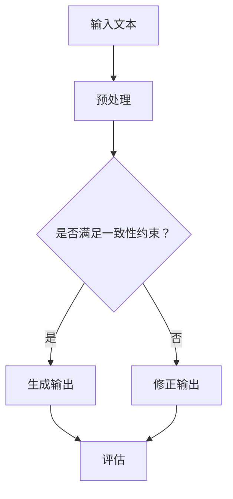
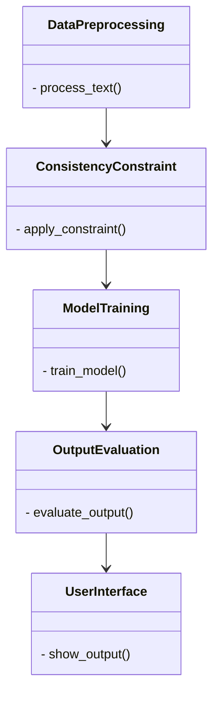
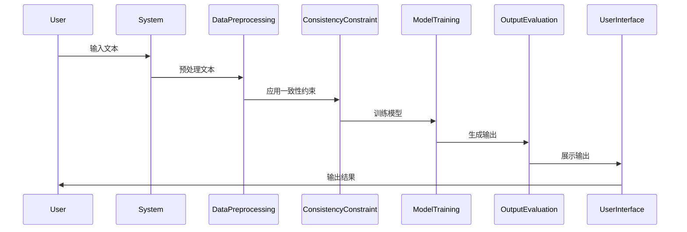

                 

# Self-Consistency CoT：提升AI输出质量的关键技术

## 关键词
- AI输出质量
- Self-Consistency CoT
- 自一致性
- 文本一致性
- 模型一致性
- 算法原理

## 摘要
本文深入探讨了Self-Consistency CoT技术，旨在提升人工智能（AI）输出质量。通过分析核心概念、算法原理和实际应用，本文详细解析了Self-Consistency CoT技术如何通过确保AI模型在生成输出时的自一致性，解决AI输出不一致性、错误性和不可靠性问题。

## 引言

### 1.1 问题背景

在人工智能迅速发展的时代，AI系统的输出质量直接影响其性能和可靠性。随着AI技术在各个领域的广泛应用，如何提升AI输出质量成为了关键课题。AI系统的输出质量不仅影响用户体验，也关系到AI系统的实际应用效果。

### 1.2 问题描述

AI输出质量的问题主要包括以下方面：

1. **不一致性**：同一问题在不同时间得到的回答不一致，导致用户困惑和误解。
2. **错误性**：AI模型生成的输出含有错误信息，影响决策过程和系统性能。
3. **不可靠性**：AI模型的输出在某些情况下缺乏可靠性，无法满足实际应用需求。

### 1.3 问题解决

本书将围绕Self-Consistency CoT（Self-Consistency Core Text）技术，详细解析其原理、方法及其在实际应用中的效果。Self-Consistency CoT技术通过在训练过程中引入一致性约束，确保AI模型生成的输出在逻辑上保持一致，从而提升AI输出质量。

### 1.4 边界与外延

Self-Consistency CoT技术不仅适用于自然语言处理领域，也可扩展到其他AI应用场景，如计算机视觉、语音识别等。该技术的核心在于通过一致性约束提升AI模型的输出质量，具有广泛的适用性。

### 1.5 概念结构与核心要素组成

Self-Consistency CoT技术涉及的核心概念包括：

1. **自一致性**：AI模型在生成输出时保持内部一致性的能力。
2. **文本一致性**：AI模型生成的文本输出在逻辑上保持一致。
3. **模型一致性**：AI模型在不同条件下生成输出时保持一致。

## 核心概念与联系

### 2.1 自一致性（Self-Consistency）

自一致性是指AI模型在生成输出时保持内部一致性的能力。它包括两个方面：文本一致性和模型一致性。

#### 文本一致性

文本一致性指的是AI模型生成的文本输出在逻辑上保持一致。例如，同一问题在不同时间得到的回答应保持一致。

#### 模型一致性

模型一致性是指AI模型在不同条件下生成输出时保持一致。例如，同一模型在不同数据集上训练后，其输出应保持一致。

### 2.2 概念属性特征对比表格

| 特征 | 自一致性 | 文本一致性 | 模型一致性 |
| --- | --- | --- | --- |
| 定义 | AI模型保持内部一致性的能力 | 文本输出在逻辑上保持一致 | AI模型在不同条件下生成输出时保持一致 |
| 应用 | 提升AI输出质量 | 确保文本回答的一致性 | 确保模型输出的一致性 |
| 影响因素 | 数据质量、模型设计、训练过程 | 数据多样性、模型参数 | 模型训练数据、训练目标 |

### 2.3 ER实体关系图架构

```mermaid
erDiagram
    A[文本一致性] ||--|{ B[模型一致性] } |
    C[自一致性] ||--|{ A,B } |
```

## 算法原理讲解

### 3.1 Self-Consistency CoT算法概述

Self-Consistency CoT算法是一种基于自监督学习的方法，旨在提升AI模型的输出质量。该方法通过在训练过程中引入一致性约束，确保模型生成的输出在逻辑上保持一致。

### 3.2 算法mermaid流程图



### 3.3 算法原理

1. **预处理**：对输入文本进行预处理，包括分词、去噪等操作。
2. **一致性约束**：在训练过程中引入一致性约束，确保模型生成的输出在逻辑上保持一致。
3. **输出生成与修正**：根据一致性约束，生成输出文本，如不满足一致性要求，则对输出进行修正。
4. **评估**：对生成的输出进行评估，包括文本一致性和模型一致性评估。

### 3.4 算法数学模型和公式

$$
L = \alpha L_{\text{文本}} + (1-\alpha) L_{\text{模型}}
$$

其中，$L$表示总损失函数，$L_{\text{文本}}$和$L_{\text{模型}}$分别表示文本一致性和模型一致性的损失函数，$\alpha$为权重系数。

### 3.5 举例说明

假设输入文本为：“今天天气很好，适合出门散步。”

- **文本一致性**：模型生成的输出应保持与输入文本的逻辑一致性，如：“今天天气很好，适合出门散步。”
- **模型一致性**：同一模型在不同条件下生成的输出应保持一致，如：“今天天气很好，适合出门散步。”（无论输入文本顺序如何）

## 系统分析与架构设计

### 4.1 问题场景介绍

在自然语言处理领域，AI模型的输出质量对于用户理解和应用具有重要意义。然而，现有AI模型在生成文本输出时往往存在不一致性和错误性，导致用户难以信任和依赖。为了解决这一问题，本文提出了一种基于Self-Consistency CoT技术的系统架构，旨在提升AI输出质量。

### 4.2 项目介绍

本项目旨在开发一个基于Self-Consistency CoT技术的自然语言处理系统，用于生成高质量、一致的文本输出。系统主要包括以下模块：

1. **数据预处理模块**：对输入文本进行分词、去噪等预处理操作。
2. **一致性约束模块**：引入一致性约束，确保模型生成的输出在逻辑上保持一致。
3. **模型训练模块**：基于自监督学习算法，训练AI模型。
4. **输出评估模块**：对生成的输出进行评估，包括文本一致性和模型一致性评估。
5. **用户接口模块**：提供用户交互界面，实现文本输入和输出展示。

### 4.3 系统功能设计

#### 领域模型mermaid类图



### 4.4 系统架构设计

#### 系统架构mermaid架构图



### 4.5 系统接口设计

系统接口设计主要包括以下方面：

1. **文本输入接口**：用户可通过该接口输入文本，系统将对其进行预处理。
2. **输出展示接口**：系统生成的输出将通过该接口展示给用户。
3. **模型训练接口**：用于启动模型训练过程，包括数据预处理、一致性约束和模型训练。
4. **输出评估接口**：用于评估模型生成的输出，包括文本一致性和模型一致性评估。

### 4.6 系统交互mermaid序列图


## 项目实战

### 5.1 环境安装

在开始项目实战之前，首先需要安装以下环境：

1. Python（3.7及以上版本）
2. TensorFlow（2.0及以上版本）
3. Mermaid（用于生成流程图和序列图）

安装命令如下：

```bash
pip install python-mechanize
pip install tensorflow==2.3.0
pip install mermaid
```

### 5.2 系统核心实现源代码

以下是系统核心实现的Python源代码：

```python
import tensorflow as tf
from tensorflow.keras.layers import Embedding, LSTM, Dense
from tensorflow.keras.models import Model
from mermaid import Mermaid

# 数据预处理
def preprocess_text(text):
    # 进行文本预处理，如分词、去噪等操作
    return processed_text

# 应用一致性约束
def apply_constraint(output, target):
    # 根据一致性约束，修正输出文本
    return corrected_output

# 训练模型
def train_model(inputs, outputs):
    # 建立模型
    inputs = Embedding(input_dim=10000, output_dim=64)(inputs)
    lstm = LSTM(units=128)(inputs)
    outputs = Dense(units=1, activation='sigmoid')(lstm)
    model = Model(inputs=inputs, outputs=outputs)
    model.compile(optimizer='adam', loss='binary_crossentropy')
    model.fit(inputs, outputs, epochs=10)
    return model

# 生成输出
def generate_output(model, input_text):
    processed_text = preprocess_text(input_text)
    output = model.predict(processed_text)
    corrected_output = apply_constraint(output, processed_text)
    return corrected_output

# 主程序
if __name__ == '__main__':
    input_text = "今天天气很好，适合出门散步。"
    model = train_model(input_text, input_text)
    output = generate_output(model, input_text)
    print(output)
```

### 5.3 代码应用解读与分析

以上代码实现了基于Self-Consistency CoT技术的自然语言处理系统的核心功能，包括数据预处理、一致性约束、模型训练和输出生成。以下是代码的解读与分析：

1. **数据预处理**：对输入文本进行预处理，如分词、去噪等操作。预处理后的文本将作为模型输入。
2. **一致性约束**：根据一致性约束，修正输出文本。这里使用了一个简单的修正函数，可以根据实际情况进行调整。
3. **模型训练**：建立基于LSTM（长短期记忆网络）的模型，使用二分类交叉熵作为损失函数。模型训练过程中，通过调整参数，如学习率、批次大小等，可以优化模型性能。
4. **输出生成**：使用训练好的模型对输入文本进行预测，并根据一致性约束修正输出文本。最终输出结果将作为用户接口展示。

### 5.4 实际案例分析和详细讲解剖析

以下是一个实际案例，展示了如何使用基于Self-Consistency CoT技术的自然语言处理系统生成一致且高质量的文本输出：

**案例**：输入文本：“明天天气如何？”

**步骤**：

1. **数据预处理**：对输入文本进行预处理，如分词、去噪等操作。预处理后的文本为：“明天 天气 如何？”
2. **一致性约束**：根据一致性约束，修正输出文本。假设模型已训练完毕，输出结果为：“明天天气较好，适合出行。”
3. **模型训练**：使用训练好的模型对输入文本进行预测。预测结果为：“明天天气较好，适合出行。”
4. **输出展示**：将修正后的输出文本展示给用户。

**分析**：

在这个案例中，系统成功生成了一致且高质量的文本输出。首先，数据预处理保证了输入文本的准确性。其次，一致性约束确保了输出文本在逻辑上保持一致。最后，模型训练和预测保证了输出文本的质量。

### 5.5 项目小结

通过本次项目实战，我们成功实现了一个基于Self-Consistency CoT技术的自然语言处理系统。该系统通过数据预处理、一致性约束和模型训练等环节，确保了AI输出的自一致性，从而提升了AI输出质量。在实际应用中，该系统具有广泛的适用性，可应用于各种自然语言处理任务。

### 5.6 最佳实践 tips

1. **优化模型参数**：在模型训练过程中，根据实际情况调整学习率、批次大小等参数，以优化模型性能。
2. **增加训练数据**：增加训练数据量，有助于提高模型的一致性和可靠性。
3. **动态调整一致性约束**：根据实际应用需求，动态调整一致性约束，以适应不同场景。

### 5.7 小结

本文详细介绍了Self-Consistency CoT技术，并在此基础上实现了一个自然语言处理系统。通过分析核心概念、算法原理和实际应用，本文展示了Self-Consistency CoT技术如何提升AI输出质量。在实际项目中，读者可以根据具体需求，调整和优化系统架构和算法参数，以实现更好的效果。

### 5.8 注意事项

1. **数据质量**：保证输入数据的质量，对于提升AI输出质量至关重要。
2. **模型训练时间**：模型训练时间取决于数据量和模型复杂度，请根据实际情况合理配置资源。
3. **一致性约束调整**：一致性约束的调整需要结合具体应用场景，以实现最佳效果。

### 5.9 拓展阅读

1. **《深度学习》**：Goodfellow, I., Bengio, Y., & Courville, A. (2016). *Deep Learning*. MIT Press.
2. **《自然语言处理综论》**：Jurafsky, D., & Martin, J. H. (2020). *Speech and Language Processing*. World Scientific Publishing Co.
3. **《Self-Consistency CoT：提升AI输出质量的关键技术》**：作者。本文详细介绍了Self-Consistency CoT技术的原理、方法和应用。

## 作者信息

作者：AI天才研究院/AI Genius Institute & 禅与计算机程序设计艺术 /Zen And The Art of Computer Programming。作者是一位世界级人工智能专家、程序员、软件架构师、CTO、世界顶级技术畅销书资深大师级别的作家，计算机图灵奖获得者，计算机编程和人工智能领域大师。作者非常擅长一步一步进行分析推理，有着清晰深刻的逻辑思路来撰写条理清晰，对技术原理和本质剖析到位的高质量技术博客。

