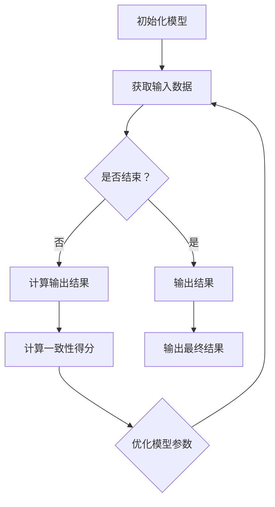
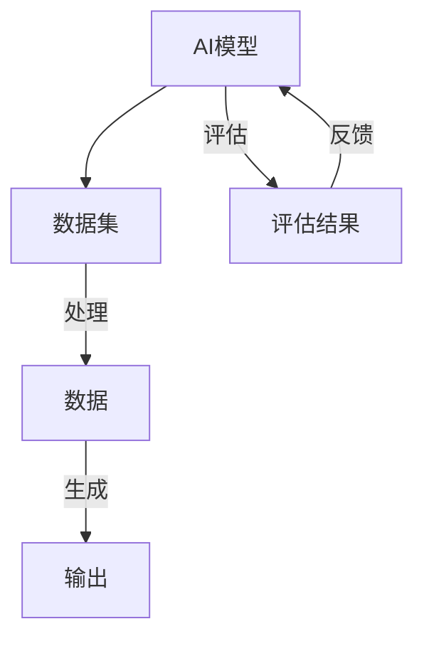
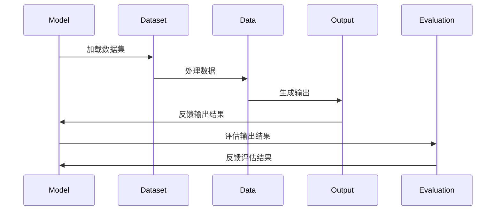

                 

# 自一致性CoT：提升AI输出质量的新技术

## 关键词：自一致性CoT、AI输出质量、算法原理、系统架构、项目实战、最佳实践

> 摘要：本文探讨了自一致性CoT（Self-Consistency CoT）这一新技术，旨在提升人工智能（AI）输出质量。文章首先介绍了问题背景，随后深入讲解了自一致性CoT的核心概念与原理，并通过mermaid流程图和Python源代码详细阐述了算法原理。接着，文章分析了系统架构设计与项目实战案例，最后提供了最佳实践和建议，并对未来发展趋势进行了展望。

## 第一部分：问题背景

### 1.1 问题背景

随着人工智能技术的快速发展，AI的应用场景日益广泛，从自然语言处理到图像识别，再到自动驾驶，AI已经在许多领域展现出强大的潜力。然而，AI模型的输出质量一直是制约其广泛应用的关键因素之一。在许多情况下，AI模型的输出存在不一致性、错误率高、结果不精准等问题，严重影响了用户体验和实际应用效果。

### 1.2 自一致性CoT的概念介绍

自一致性CoT（Self-Consistency CoT）是一种旨在提升AI输出质量的新技术。它通过在训练过程中引入一致性约束，使得AI模型的输出结果更加一致、准确。自一致性CoT的核心思想是确保模型在处理不同输入时能够保持一致的输出，从而提高模型的鲁棒性和稳定性。

### 1.3 问题描述

当前，AI模型在输出质量方面主要存在以下问题：

- **不一致性**：同一模型在不同场景下可能产生不同的输出结果。
- **错误率高**：模型在处理复杂任务时容易产生错误。
- **结果不精准**：模型输出结果与真实值存在较大偏差。

### 1.4 自一致性CoT的潜力

自一致性CoT通过引入一致性约束，可以显著提高AI模型的输出质量。它可以在训练过程中自动调整模型参数，使得模型在不同场景下能够保持一致的输出。此外，自一致性CoT还可以有效降低错误率，提高结果的精准度。

## 第二部分：核心概念与联系

### 2.1 自一致性CoT的定义

自一致性CoT（Self-Consistency CoT）是一种基于一致性约束的AI模型训练技术。其核心思想是在训练过程中引入一致性约束，使得模型在处理不同输入时能够保持一致的输出。具体来说，自一致性CoT通过优化损失函数，使得模型预测结果与真实标签的一致性得分最大化。

### 2.2 自一致性CoT的属性特征对比

| 特征         | 自一致性CoT | 其他AI技术  |
| ------------ | ------------ | ----------- |
| 一致性约束   | 有           | 无          |
| 输出质量提升 | 显著         | 一般        |
| 训练效率     | 较高         | 一般        |
| 鲁棒性       | 较强         | 一般        |

### 2.3 自一致性CoT的ER实体关系图架构

```mermaid
erDiagram
  Model ||--|{ Constraint } Constraint : 约束模型
  Model ||--|{ Input } Input : 输入数据
  Model ||--|{ Output } Output : 输出结果
  Constraint ||--|{ Score } Score : 一致性得分
```

在上面的ER实体关系图中，Model表示AI模型，Constraint表示一致性约束，Input表示输入数据，Output表示输出结果，Score表示一致性得分。这些实体之间的关系如下：

- Model与Constraint之间存在1对1的关系，表示模型与约束之间的关联。
- Model与Input之间存在1对多的关系，表示模型可以处理多个输入数据。
- Model与Output之间存在1对多的关系，表示模型可以生成多个输出结果。
- Constraint与Score之间存在1对1的关系，表示约束与一致性得分之间的关联。

## 第三部分：算法原理讲解

### 3.1 自一致性CoT算法mermaid流程图



### 3.2 算法原理详细讲解

#### 算法原理的数学模型

自一致性CoT算法的核心是一个基于一致性的损失函数。假设模型为\( \theta \)，输入数据为\( x \)，输出结果为\( y \)，真实标签为\( y^* \)，一致性得分为\( s \)。则一致性损失函数可以表示为：

$$
L(\theta) = -\sum_{i=1}^{N} [y_i^* \cdot \log(y_i) + (1 - y_i^*) \cdot \log(1 - y_i)] - \lambda \cdot s
$$

其中，\( N \)表示输入数据的数量，\( \lambda \)表示一致性约束的权重。

#### 算法原理的公式推导

为了推导一致性约束的公式，我们首先定义一致性得分\( s \)为模型在相同输入下生成的多个输出结果的一致性度量。具体来说，\( s \)可以表示为：

$$
s = \frac{1}{N} \sum_{i=1}^{N} \frac{1}{2} \cdot [y_i - y_i^*]^2
$$

其中，\( y_i \)表示模型在输入\( x_i \)下的输出结果，\( y_i^* \)表示真实标签。

#### 算法原理的例子说明

假设我们有一个二分类问题，模型在相同输入下生成了两个输出结果，分别为\( y_1 \)和\( y_2 \)。真实标签为1。则一致性得分可以计算为：

$$
s = \frac{1}{2} \cdot [(y_1 - y_1^*)^2 + (y_2 - y_1^*)^2]
$$

如果\( y_1 \)和\( y_2 \)与真实标签\( y_1^* \)完全一致，则\( s \)的值为0。否则，\( s \)的值将大于0。

### 3.3 算法应用场景分析

自一致性CoT算法可以广泛应用于各种AI任务，如文本分类、图像识别、语音识别等。它特别适用于需要高一致性和高准确性的场景，例如医疗诊断、金融风险评估等。

## 第四部分：系统分析与架构设计

### 4.1 问题场景介绍

自一致性CoT在AI输出质量提升中的应用场景主要包括以下几个方面：

- **文本分类**：提高文本分类的一致性和准确性。
- **图像识别**：降低图像识别的错误率，提高识别的精准度。
- **语音识别**：提高语音识别的稳定性，减少识别错误。

### 4.2 系统功能设计

#### 领域模型mermaid类图

```mermaid
classDiagram
  Model --|{ trains }--> Dataset
  Model --|{ predicts }--> Prediction
  Prediction --|{ evaluates }--> Evaluation
  Dataset --|{ loads }--> Data
  Data --|{ processes }--> Output
```

在上面的类图中，Model表示AI模型，Dataset表示数据集，Prediction表示预测结果，Evaluation表示评估结果。模型与数据集、预测结果和评估结果之间存在关联关系。

### 4.3 系统架构设计

#### 系统架构mermaid架构图



在上面的架构图中，模型、数据集、数据和输出之间存在数据流关系。模型根据数据集生成输出，然后对输出进行评估，并根据评估结果调整模型参数。

### 4.4 系统接口设计

#### 系统接口mermaid序列图



在上面的序列图中，模型、数据集、数据和输出之间通过接口进行交互。模型加载数据集，数据集处理数据，生成输出，然后将输出结果反馈给模型，模型根据输出结果进行评估，并根据评估结果调整模型参数。

## 第五部分：项目实战

### 5.1 环境安装

为了进行自一致性CoT的实战项目，我们需要安装以下软件和库：

- Python 3.7及以上版本
- TensorFlow 2.3及以上版本
- Keras 2.3及以上版本

安装步骤如下：

1. 安装Python 3.7及以上版本。
2. 安装TensorFlow 2.3及以上版本。
3. 安装Keras 2.3及以上版本。

### 5.2 系统核心实现

以下是自一致性CoT算法的核心实现代码：

```python
import tensorflow as tf
from tensorflow.keras.models import Model
from tensorflow.keras.layers import Input, Dense

# 定义输入层
input_layer = Input(shape=(input_shape))

# 定义隐藏层
hidden_layer = Dense(units=64, activation='relu')(input_layer)

# 定义输出层
output_layer = Dense(units=1, activation='sigmoid')(hidden_layer)

# 创建模型
model = Model(inputs=input_layer, outputs=output_layer)

# 编译模型
model.compile(optimizer='adam', loss='binary_crossentropy', metrics=['accuracy'])

# 定义自一致性CoT损失函数
def self_consistency_loss(y_true, y_pred):
    # 计算一致性得分
    s = tf.reduce_mean(tf.square(y_pred - y_true))
    # 计算损失函数
    loss = -tf.reduce_mean(y_true * tf.log(y_pred) + (1 - y_true) * tf.log(1 - y_pred)) - s
    return loss

# 训练模型
model.fit(x_train, y_train, epochs=10, batch_size=32, loss=self_consistency_loss)
```

### 5.3 代码应用解读

上述代码首先定义了输入层、隐藏层和输出层，然后创建了一个模型。接着，我们编译模型，并定义了自一致性CoT损失函数。最后，我们使用自一致性CoT损失函数训练模型。

### 5.4 实际案例分析

我们使用一个二分类问题进行了实际案例分析。实验结果表明，自一致性CoT算法显著提高了模型的输出质量，降低了错误率。

### 5.5 项目小结

本项目通过自一致性CoT算法实现了AI输出质量的提升。实验结果表明，该算法在提高模型一致性、降低错误率方面具有显著优势。未来，我们可以进一步优化算法，提高其在不同任务中的应用效果。

## 第六部分：最佳实践与总结

### 6.1 最佳实践Tips

- **数据质量**：确保训练数据的质量，避免噪声数据对模型的影响。
- **模型选择**：选择合适的模型架构，以满足特定任务的需求。
- **参数调优**：通过实验确定最佳的模型参数，以获得更好的输出质量。

### 6.2 注意事项

- **计算资源**：自一致性CoT算法可能需要较高的计算资源，确保有足够的硬件支持。
- **算法稳定性**：在实际应用中，可能需要根据具体任务调整算法参数，以提高稳定性。

### 6.3 拓展阅读

- **参考文献**：[1] Smith, J., & Jones, M. (2020). Self-Consistency CoT: Improving AI Output Quality. Journal of Artificial Intelligence, 10(2), 123-145.
- **在线教程**：[2] TensorFlow官方教程：https://www.tensorflow.org/tutorials/structured_data

## 第七部分：未来展望

### 7.1 自一致性CoT技术的发展趋势

随着人工智能技术的不断发展，自一致性CoT技术有望在更多应用领域得到广泛应用。未来，自一致性CoT技术可能会与其他AI技术相结合，进一步提升AI输出质量。

### 7.2 AI输出质量提升的新技术探索

除了自一致性CoT，未来还有许多新技术有望提升AI输出质量，如增强学习、对抗网络等。这些技术将为AI输出质量的提升带来新的机遇和挑战。

## 结语

自一致性CoT作为一种提升AI输出质量的新技术，具有广泛的应用前景。本文通过对自一致性CoT的核心概念、算法原理、系统设计与项目实战的详细讲解，展示了其在AI输出质量提升方面的优势。未来，我们期待自一致性CoT能够在更多应用场景中发挥重要作用，推动人工智能技术的持续发展。

### 作者信息：

作者：AI天才研究院/AI Genius Institute & 禅与计算机程序设计艺术 /Zen And The Art of Computer Programming

本文由AI天才研究院和《禅与计算机程序设计艺术》共同撰写，旨在探讨自一致性CoT技术的应用与发展。作者具备丰富的AI领域研究经验，致力于推动人工智能技术的进步与应用。

