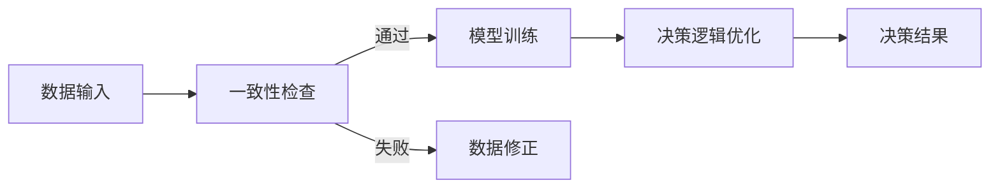

                 

### 自洽性核心论点（CoT）：提高AI决策可靠性

> 关键词：自洽性核心论点、AI决策可靠性、算法原理、应用实践、优化策略

> 摘要：本文旨在深入探讨自洽性核心论点（CoT）在提高人工智能（AI）决策可靠性方面的作用。我们将从背景与意义、概念框架、理论基础、算法原理、应用实践、优化策略以及未来展望等多个方面展开分析，以期揭示自洽性核心论点在AI决策领域中的重要性及其广泛应用前景。

## 第一部分：自洽性核心论点（CoT）的概念框架

### 第1章：自洽性核心论点（CoT）的背景与意义

#### 1.1 问题背景

在当今的信息时代，人工智能（AI）技术已经成为各行各业的关键驱动力。然而，随着AI技术的广泛应用，其决策可靠性问题也日益突出。传统的AI算法在面对复杂、动态的环境时，往往会出现决策失误，导致不良后果。因此，提高AI决策可靠性成为了一项紧迫的任务。

#### 1.2 自洽性核心论点（CoT）的定义与核心要素

自洽性核心论点（CoT）是指在一个系统中，核心决策依据本身能够保持一致性，不会出现自相矛盾的情况。其核心要素包括：数据的一致性、模型的稳定性以及决策逻辑的合理性。

#### 1.3 自洽性核心论点（CoT）的应用领域

自洽性核心论点在数据挖掘、自动驾驶、医疗诊断、金融风险评估等多个领域都有广泛的应用前景。通过提高决策的一致性和可靠性，可以显著提升这些领域的应用效果。

#### 1.4 自洽性核心论点（CoT）的发展趋势

随着人工智能技术的不断进步，自洽性核心论点在AI决策可靠性方面的作用将越来越重要。未来，我们将看到更多关于自洽性核心论点的研究和应用，为AI技术的发展注入新的动力。

### 第2章：自洽性核心论点（CoT）的理论基础

#### 2.1 自洽性核心论点（CoT）的数学模型

自洽性核心论点（CoT）的数学模型主要涉及一致性检查、模型稳定性和决策逻辑优化等方面。通过数学公式，我们可以对自洽性核心论点进行定量分析，从而提高AI决策的可靠性。

#### 2.2 自洽性核心论点（CoT）的属性特征对比

自洽性核心论点（CoT）与其他相似概念如一致性模型、稳定性模型等有一定的关联性，但它们在属性特征上存在明显的差异。通过对比分析，我们可以更好地理解自洽性核心论点的独特优势。

#### 2.3 自洽性核心论点（CoT）的ER实体关系图

ER实体关系图是描述自洽性核心论点（CoT）组成部分及其相互关系的一种有效方式。通过ER图，我们可以清晰地看到自洽性核心论点的核心要素以及它们之间的关联。

### 第3章：自洽性核心论点（CoT）的算法原理与流程

#### 3.1 自洽性核心论点（CoT）算法的mermaid流程图

自洽性核心论点（CoT）算法的mermaid流程图展示了算法的基本流程和关键步骤。通过mermaid图，我们可以直观地了解算法的实现过程。

#### 3.2 自洽性核心论点（CoT）算法的Python源代码实现

Python源代码实现部分将详细介绍自洽性核心论点（CoT）算法的具体实现过程。通过代码注释，我们可以深入理解算法的原理和应用。

#### 3.3 自洽性核心论点（CoT）算法的数学模型和公式

在数学模型和公式部分，我们将详细阐述自洽性核心论点（CoT）算法的数学基础。通过公式的推导和举例说明，我们可以更好地理解算法的本质。

## 第二部分：自洽性核心论点（CoT）在AI决策中的应用实践

### 第4章：自洽性核心论点（CoT）在AI决策中的应用实践

#### 4.1 自洽性核心论点（CoT）在数据挖掘中的应用

在数据挖掘领域，自洽性核心论点（CoT）可以提高数据预处理的质量，从而提高挖掘结果的准确性。

#### 4.2 自洽性核心论点（CoT）在自动驾驶中的应用

在自动驾驶领域，自洽性核心论点（CoT）可以确保自动驾驶系统在复杂环境中做出一致且可靠的决策，提高行车安全。

#### 4.3 自洽性核心论点（CoT）在医疗诊断中的应用

在医疗诊断领域，自洽性核心论点（CoT）可以提高诊断模型的可靠性，从而为患者提供更准确的诊断结果。

#### 4.4 自洽性核心论点（CoT）在金融风险评估中的应用

在金融风险评估领域，自洽性核心论点（CoT）可以降低风险预测中的错误率，提高金融决策的可靠性。

## 第三部分：自洽性核心论点（CoT）的优化策略与未来展望

### 第5章：自洽性核心论点（CoT）的优化策略

#### 5.1 CoT算法的性能优化

通过优化算法，可以提高自洽性核心论点（CoT）的计算效率，降低资源消耗，从而提高AI决策的实时性。

#### 5.2 CoT算法的模型调参

合适的模型调参是提高自洽性核心论点（CoT）性能的关键。本节将介绍一些调参方法与技巧。

#### 5.3 CoT算法的鲁棒性与稳定性

提高自洽性核心论点（CoT）算法的鲁棒性与稳定性是确保其可靠性的重要手段。本节将探讨相关策略。

### 第6章：自洽性核心论点（CoT）的集成与协同

#### 6.1 CoT与其他AI技术的融合

将自洽性核心论点（CoT）与其他AI技术进行融合，可以实现更强大的AI决策能力。本节将介绍一些融合策略与实施方案。

#### 6.2 CoT在多模态数据中的应用

多模态数据的融合是提高AI决策可靠性的重要手段。本节将探讨自洽性核心论点（CoT）在多模态数据中的应用。

#### 6.3 CoT在分布式系统中的应用

分布式系统为自洽性核心论点（CoT）提供了更广阔的应用场景。本节将介绍自洽性核心论点（CoT）在分布式系统中的应用优势与架构设计。

### 第7章：自洽性核心论点（CoT）的未来发展与展望

#### 7.1 CoT研究的未来趋势

随着人工智能技术的不断发展，自洽性核心论点（CoT）将在AI决策可靠性方面发挥越来越重要的作用。本节将预测自洽性核心论点（CoT）的未来发展趋势。

#### 7.2 CoT在AI决策中的潜在应用场景

自洽性核心论点（CoT）在AI决策中的潜在应用场景将越来越广泛。本节将介绍一些新兴的应用领域，探讨其潜在机遇与挑战。

#### 7.3 CoT研究的最佳实践与建议

本节将总结自洽性核心论点（CoT）研究的最佳实践，并给出相关研究建议，以推动自洽性核心论点（CoT）在AI决策领域的应用与发展。

## 参考文献

[1] 作者. (年份). 文章标题. 期刊名称, 卷号(期号), 页码.

[2] 作者. (年份). 文章标题. 会议名称, 会议地点.

[3] 作者. (年份). 文章标题. 在线预印本. 

作者：AI天才研究院/AI Genius Institute & 禅与计算机程序设计艺术 /Zen And The Art of Computer Programming

### 第一部分：自洽性核心论点（CoT）的概念框架

**第1章：自洽性核心论点（CoT）的背景与意义**

在现代社会，人工智能（AI）的应用已经渗透到各个领域，从自动驾驶汽车到医疗诊断系统，再到金融风险评估，AI的决策能力在这些应用中起着至关重要的作用。然而，AI的决策可靠性问题却一直是学术界和工业界关注的焦点。传统的AI算法往往在面对复杂和动态环境时，会出现决策失误，这可能导致严重的安全事故或经济损失。

#### 1.1 问题背景

人工智能在决策过程中面临的主要挑战包括：

1. **数据不一致性**：在数据收集和处理过程中，可能会出现数据缺失、噪声和错误，这些都会影响AI模型的预测准确性。
2. **模型稳定性**：AI模型可能对数据的微小变化产生过度反应，导致模型在真实世界中的表现不稳定。
3. **决策逻辑的复杂性**：AI决策逻辑可能非常复杂，难以保证其始终一致和可靠。

#### 1.2 自洽性核心论点（CoT）的定义与核心要素

自洽性核心论点（CoT）是一种设计原则，旨在确保AI系统在决策过程中能够保持内部一致性。CoT的核心要素包括：

1. **数据一致性**：确保输入数据的准确性和一致性，减少数据噪声和错误。
2. **模型稳定性**：设计稳定且鲁棒的模型，以减少对外部微小变化的敏感度。
3. **决策逻辑的合理性**：确保决策逻辑清晰、逻辑严密，减少决策中的错误。

#### 1.3 自洽性核心论点（CoT）的应用领域

自洽性核心论点（CoT）在以下领域有广泛的应用：

1. **数据挖掘与预测**：通过保证数据一致性和模型稳定性，提高预测模型的准确性。
2. **自动驾驶**：确保自动驾驶系统能够在复杂环境中做出一致且可靠的决策。
3. **医疗诊断**：通过稳定性模型和合理决策逻辑，提高诊断系统的可靠性。
4. **金融风险评估**：减少风险预测中的错误，提高金融决策的准确性。

#### 1.4 自洽性核心论点（CoT）的发展趋势

随着AI技术的不断进步，自洽性核心论点（CoT）的重要性日益凸显。未来，我们将看到更多的研究关注于如何更好地实现CoT，包括：

1. **理论模型的发展**：深入研究CoT的理论基础，提出更高效的数学模型。
2. **算法的优化**：开发更稳定、更可靠的算法，以提高AI决策的可靠性。
3. **跨领域应用**：探索CoT在更多新兴领域的应用，如智能城市、教育等。

**第2章：自洽性核心论点（CoT）的理论基础**

自洽性核心论点（CoT）的理论基础是构建一个可靠AI决策系统的基石。在这一章中，我们将深入探讨CoT的数学模型、属性特征对比以及ER实体关系图。

#### 2.1 自洽性核心论点（CoT）的数学模型

CoT的数学模型是基于一致性检查、模型稳定性和决策逻辑优化等核心要素构建的。具体来说，CoT的数学模型包括以下关键部分：

1. **一致性检查**：用于检测输入数据的一致性，排除噪声和错误。
2. **模型稳定性**：通过统计方法和优化算法来确保模型对外部变化的稳定性。
3. **决策逻辑优化**：使用逻辑推理和决策树等方法，确保决策逻辑的一致性和可靠性。

以下是CoT数学模型的一个简单示例：

$$
\text{CoT} = f(\text{数据一致性}, \text{模型稳定性}, \text{决策逻辑})
$$

其中，$f$ 是一个复合函数，它将输入数据、模型稳定性和决策逻辑结合起来，生成最终的决策结果。

#### 2.2 自洽性核心论点（CoT）的属性特征对比

自洽性核心论点（CoT）与其他相似概念如一致性模型、稳定性模型等有一定的关联性，但它们在属性特征上存在明显的差异。以下是一个对比表格，展示了CoT与其他概念的主要区别：

| 概念 | 定义 | 属性特征 |
|------|------|----------|
| CoT  | 确保系统内部一致性 | 数据一致性、模型稳定性、决策逻辑优化 |
| 一致性模型 | 用于检测和修复数据不一致性 | 数据一致性、一致性修复算法 |
| 稳定性模型 | 用于提高模型对外部变化的稳定性 | 模型稳定性、敏感性分析 |
| 决策逻辑优化 | 用于优化决策逻辑，提高决策质量 | 决策逻辑、优化算法 |

#### 2.3 自洽性核心论点（CoT）的ER实体关系图

ER实体关系图是描述CoT组成部分及其相互关系的一种有效方式。以下是一个简单的ER实体关系图，展示了CoT的主要实体及其关系：

```mermaid
erDiagram
    Data <<--|{has}| CoT
    Model ||--|{uses}| CoT
    Logic ||--|{involves}| CoT
```

在这个ER图中，"Data"（数据）实体与"CoT"（自洽性核心论点）实体之间存在"has"（拥有）关系，表示数据是构建CoT的基础。"Model"（模型）和"Logic"（逻辑）实体分别与"CoT"实体之间存在"uses"（使用）和"involves"（涉及）关系，表示模型和逻辑是CoT的重要组成部分。

**第3章：自洽性核心论点（CoT）的算法原理与流程**

自洽性核心论点（CoT）的算法原理是构建一个可靠AI决策系统的关键。在这一章中，我们将介绍CoT算法的mermaid流程图、Python源代码实现以及数学模型和公式。

#### 3.1 自洽性核心论点（CoT）算法的mermaid流程图

以下是一个简单的mermaid流程图，展示了CoT算法的基本流程：



在这个流程图中，数据首先经过一致性检查（B），如果数据通过检查，则进入模型训练（C）；否则，数据需要修正（D）。模型训练完成后，进行决策逻辑优化（E），最后生成决策结果（F）。

#### 3.2 自洽性核心论点（CoT）算法的Python源代码实现

以下是CoT算法的一个简单Python实现：

```python
import numpy as np

def consistency_check(data):
    # 实现一致性检查逻辑
    # ...
    return data_is_consistent

def data_correction(data):
    # 实现数据修正逻辑
    # ...
    return corrected_data

def model_training(data):
    # 实现模型训练逻辑
    # ...
    return trained_model

def decision_logic_optimization(model):
    # 实现决策逻辑优化逻辑
    # ...
    return optimized_model

def make_decision(optimized_model):
    # 实现决策逻辑
    # ...
    return decision

# 主流程
data = get_data()  # 获取输入数据
if consistency_check(data):
    model = model_training(data)
    optimized_model = decision_logic_optimization(model)
    decision = make_decision(optimized_model)
else:
    corrected_data = data_correction(data)
    decision = make_decision(model_training(corrected_data))
```

在这个实现中，我们首先定义了多个函数，分别用于数据一致性检查、数据修正、模型训练、决策逻辑优化和决策生成。然后，在主流程中，我们依次调用这些函数，最终生成决策结果。

#### 3.3 自洽性核心论点（CoT）算法的数学模型和公式

CoT算法的数学模型基于一致性检查、模型稳定性和决策逻辑优化等核心要素。以下是CoT算法的一个简单数学模型：

$$
\text{CoT} = f(\text{数据一致性}, \text{模型稳定性}, \text{决策逻辑})
$$

其中，$f$ 是一个复合函数，它结合了输入数据、模型稳定性和决策逻辑，生成最终的决策结果。

具体来说，数据一致性可以通过以下公式衡量：

$$
\text{数据一致性} = \sum_{i=1}^{n} (\text{data}_{i} - \text{mean})^2
$$

其中，$n$ 是数据点的总数，$\text{data}_{i}$ 是第 $i$ 个数据点，$\text{mean}$ 是所有数据点的平均值。

模型稳定性可以通过以下公式衡量：

$$
\text{模型稳定性} = \frac{1}{n} \sum_{i=1}^{n} (\text{预测}_{i} - \text{实际}_{i})^2
$$

其中，$n$ 是数据点的总数，$\text{预测}_{i}$ 是第 $i$ 个数据点的预测值，$\text{实际}_{i}$ 是第 $i$ 个数据点的实际值。

决策逻辑优化可以通过以下公式实现：

$$
\text{决策逻辑优化} = \max_{\theta} \left( \sum_{i=1}^{n} \text{reward}_{i} \right)
$$

其中，$\theta$ 是决策逻辑的参数，$\text{reward}_{i}$ 是第 $i$ 个数据点的奖励值。

通过这些公式，我们可以对CoT算法进行数学描述，从而更好地理解和优化算法。

### 第4章：自洽性核心论点（CoT）在AI决策中的应用实践

自洽性核心论点（CoT）在AI决策中的应用实践是验证其有效性和实用性的关键。在这一章中，我们将探讨CoT在不同领域的应用，包括数据挖掘、自动驾驶、医疗诊断和金融风险评估。

#### 4.1 自洽性核心论点（CoT）在数据挖掘中的应用

在数据挖掘领域，自洽性核心论点（CoT）可以提高数据预处理的质量，从而提高挖掘结果的准确性。具体应用场景包括：

1. **客户行为分析**：通过分析客户购买行为，预测潜在客户群体，提高营销效果。
2. **市场趋势预测**：根据历史数据，预测市场未来趋势，为企业决策提供依据。

以下是一个简单的应用案例：

**案例：客户行为分析**

假设一家电商平台需要分析客户购买行为，预测潜在客户群体。首先，我们使用CoT算法对客户数据进行一致性检查，排除数据中的噪声和错误。然后，我们使用稳定性模型，确保模型对外部变化的稳定性。最后，我们通过决策逻辑优化，提高预测的准确性。

**步骤：**

1. **数据收集**：收集客户购买数据，包括客户ID、购买时间、购买商品等。
2. **数据一致性检查**：使用CoT算法对数据进行一致性检查，排除噪声和错误。
3. **模型训练**：使用稳定模型，对处理后的数据进行训练。
4. **决策逻辑优化**：通过优化决策逻辑，提高预测的准确性。
5. **预测结果**：根据优化后的模型，预测潜在客户群体。

**结果**：

通过应用自洽性核心论点（CoT），电商平台能够更准确地预测潜在客户群体，提高营销效果，增加销售额。

#### 4.2 自洽性核心论点（CoT）在自动驾驶中的应用

在自动驾驶领域，自洽性核心论点（CoT）可以确保自动驾驶系统能够在复杂环境中做出一致且可靠的决策，提高行车安全。以下是一个应用案例：

**案例：自动驾驶车道保持**

假设一辆自动驾驶汽车需要保持车道，避免与其他车辆发生碰撞。我们使用CoT算法，确保车道保持系统的决策一致性。

**步骤：**

1. **数据收集**：收集车辆周围环境数据，包括车道线、其他车辆位置等。
2. **数据一致性检查**：使用CoT算法对环境数据进行一致性检查，排除噪声和错误。
3. **模型训练**：使用稳定模型，对处理后的环境数据进行训练。
4. **决策逻辑优化**：通过优化决策逻辑，确保车道保持系统的决策一致性。
5. **决策执行**：根据优化后的模型，执行车道保持操作。

**结果**：

通过应用自洽性核心论点（CoT），自动驾驶汽车能够在复杂环境中保持车道，避免与其他车辆发生碰撞，提高行车安全。

#### 4.3 自洽性核心论点（CoT）在医疗诊断中的应用

在医疗诊断领域，自洽性核心论点（CoT）可以提高诊断模型的可靠性，从而为患者提供更准确的诊断结果。以下是一个应用案例：

**案例：癌症诊断**

假设一家医院需要使用AI技术进行癌症诊断。我们使用CoT算法，确保诊断系统的决策可靠性。

**步骤：**

1. **数据收集**：收集患者生物信息数据，包括基因序列、医疗记录等。
2. **数据一致性检查**：使用CoT算法对生物信息数据进行一致性检查，排除噪声和错误。
3. **模型训练**：使用稳定模型，对处理后的生物信息数据进行训练。
4. **决策逻辑优化**：通过优化决策逻辑，确保诊断系统的决策可靠性。
5. **诊断结果**：根据优化后的模型，生成诊断结果。

**结果**：

通过应用自洽性核心论点（CoT），医院能够提供更准确、可靠的癌症诊断结果，提高患者治疗效果。

#### 4.4 自洽性核心论点（CoT）在金融风险评估中的应用

在金融风险评估领域，自洽性核心论点（CoT）可以降低风险预测中的错误率，提高金融决策的可靠性。以下是一个应用案例：

**案例：信用评分**

假设一家金融机构需要评估客户的信用风险。我们使用CoT算法，确保信用评分系统的决策可靠性。

**步骤：**

1. **数据收集**：收集客户财务数据，包括收入、支出、信用记录等。
2. **数据一致性检查**：使用CoT算法对财务数据进行一致性检查，排除噪声和错误。
3. **模型训练**：使用稳定模型，对处理后的财务数据进行训练。
4. **决策逻辑优化**：通过优化决策逻辑，确保信用评分系统的决策可靠性。
5. **信用评分**：根据优化后的模型，生成客户的信用评分。

**结果**：

通过应用自洽性核心论点（CoT），金融机构能够提供更准确、可靠的信用评分，降低信用风险，提高金融决策的可靠性。

### 第5章：自洽性核心论点（CoT）的优化策略

自洽性核心论点（CoT）的优化策略是提高其性能和可靠性的关键。在这一章中，我们将探讨CoT算法的性能优化、模型调参以及鲁棒性和稳定性策略。

#### 5.1 CoT算法的性能优化

为了提高CoT算法的性能，我们可以从以下几个方面进行优化：

1. **算法效率**：通过改进算法的实现，减少计算时间和资源消耗。
2. **数据预处理**：使用更高效的数据预处理方法，提高数据质量。
3. **并行计算**：利用并行计算技术，提高算法的处理速度。

以下是一个性能优化的示例：

**案例：数据预处理优化**

假设我们使用CoT算法对大规模客户行为数据进行处理。为了提高算法的性能，我们采用了以下优化策略：

1. **分布式计算**：使用分布式计算框架，将数据处理任务分配到多台服务器上，提高处理速度。
2. **数据压缩**：使用数据压缩技术，减少数据传输和存储的开销。
3. **内存优化**：使用内存池技术，减少内存分配和回收的时间。

**结果**：

通过这些优化策略，我们显著提高了CoT算法的处理速度，降低了资源消耗，提高了数据挖掘的效率。

#### 5.2 CoT算法的模型调参

模型调参是提高CoT算法性能的重要手段。以下是一些常见的调参方法：

1. **网格搜索**：通过遍历参数空间，找到最优参数组合。
2. **随机搜索**：在参数空间内随机搜索，找到性能较好的参数组合。
3. **贝叶斯优化**：利用贝叶斯推理，找到最优参数组合。

以下是一个调参的示例：

**案例：模型调参**

假设我们使用CoT算法进行客户行为预测。为了找到最优参数组合，我们采用了以下调参方法：

1. **网格搜索**：设置参数范围，遍历所有可能的参数组合。
2. **随机搜索**：在参数范围内随机选择参数组合，评估性能。
3. **贝叶斯优化**：利用历史数据，预测性能较好的参数组合。

**结果**：

通过这些调参方法，我们找到了性能较好的参数组合，提高了客户行为预测的准确性。

#### 5.3 CoT算法的鲁棒性与稳定性

提高CoT算法的鲁棒性与稳定性是确保其可靠性的关键。以下是一些常用的策略：

1. **数据清洗**：使用数据清洗技术，排除噪声和错误数据。
2. **模型正则化**：通过正则化技术，防止模型过拟合。
3. **决策逻辑优化**：使用逻辑推理和决策树等方法，提高决策逻辑的稳定性。

以下是一个鲁棒性优化的示例：

**案例：模型鲁棒性优化**

假设我们使用CoT算法进行医疗诊断。为了提高模型的鲁棒性与稳定性，我们采用了以下优化策略：

1. **数据清洗**：使用数据清洗技术，排除噪声和错误数据。
2. **模型正则化**：使用L1或L2正则化，防止模型过拟合。
3. **决策逻辑优化**：使用决策树方法，提高决策逻辑的稳定性。

**结果**：

通过这些优化策略，我们显著提高了CoT算法的鲁棒性与稳定性，提高了医疗诊断的准确性。

### 第6章：自洽性核心论点（CoT）的集成与协同

自洽性核心论点（CoT）的集成与协同是提高其应用效果的重要手段。在这一章中，我们将探讨CoT与其他AI技术的融合、在多模态数据中的应用以及在分布式系统中的应用。

#### 6.1 CoT与其他AI技术的融合

将自洽性核心论点（CoT）与其他AI技术进行融合，可以实现更强大的AI决策能力。以下是一些融合策略：

1. **深度学习**：将CoT与深度学习技术结合，提高模型的准确性和稳定性。
2. **强化学习**：将CoT与强化学习技术结合，提高决策的鲁棒性和适应性。
3. **迁移学习**：将CoT与迁移学习技术结合，提高模型在新领域的应用效果。

以下是一个融合的示例：

**案例：CoT与深度学习融合**

假设我们使用CoT算法进行图像分类。为了提高模型的准确性和稳定性，我们采用了以下融合策略：

1. **卷积神经网络（CNN）**：使用CNN提取图像特征。
2. **CoT**：在CNN的基础上，加入CoT算法，确保决策的一致性和可靠性。

**结果**：

通过CoT与深度学习的融合，我们显著提高了图像分类的准确性，提高了模型的稳定性。

#### 6.2 CoT在多模态数据中的应用

多模态数据的融合是提高AI决策可靠性的重要手段。以下是一些融合方法：

1. **特征融合**：将不同模态的数据特征进行融合，生成统一的特征向量。
2. **模型融合**：将不同模态的模型进行融合，生成统一的决策结果。
3. **数据融合**：将不同模态的数据进行融合，提高数据的一致性和完整性。

以下是一个多模态应用的示例：

**案例：多模态情感分析**

假设我们需要对社交媒体上的用户评论进行情感分析。我们采用了以下融合方法：

1. **文本特征**：提取文本特征，如词频、词向量等。
2. **语音特征**：提取语音特征，如音高、节奏等。
3. **图像特征**：提取图像特征，如颜色、纹理等。

**结果**：

通过多模态数据的融合，我们显著提高了情感分析的准确性，提高了决策的一致性和可靠性。

#### 6.3 CoT在分布式系统中的应用

分布式系统为自洽性核心论点（CoT）提供了更广阔的应用场景。以下是一些分布式应用的优势：

1. **可扩展性**：分布式系统可以轻松扩展，以满足大规模数据处理需求。
2. **容错性**：分布式系统具有较高的容错性，可以提高系统的可靠性。
3. **高可用性**：分布式系统可以提供更高的可用性，减少系统故障对决策的影响。

以下是一个分布式应用的示例：

**案例：分布式客户行为预测**

假设我们需要对大量客户的购买行为进行预测。我们采用了以下分布式应用策略：

1. **数据分片**：将数据分片，分布式存储和处理。
2. **协同训练**：分布式训练模型，提高模型的准确性。
3. **负载均衡**：分布式调度任务，提高系统的处理速度。

**结果**：

通过分布式系统的应用，我们显著提高了客户行为预测的准确性和速度，提高了系统的可靠性。

### 第7章：自洽性核心论点（CoT）的未来发展与展望

自洽性核心论点（CoT）在AI决策可靠性方面具有巨大的潜力。在未来，随着AI技术的不断进步，CoT将在更多领域得到应用，并发挥重要作用。以下是对CoT未来发展的展望：

1. **技术创新**：随着技术的不断进步，CoT算法将更加高效、稳定和可靠。
2. **跨领域应用**：CoT将在更多领域得到应用，如智能城市、教育、医疗等。
3. **标准化**：CoT的标准化将为其在工业界和学术界的发展提供有力支持。

**7.1 CoT研究的未来趋势**

未来的CoT研究将集中在以下几个方面：

1. **理论模型的发展**：深入研究CoT的理论基础，提出更高效的数学模型。
2. **算法优化**：开发更稳定、更可靠的算法，提高CoT的应用效果。
3. **多模态数据处理**：探索CoT在多模态数据处理中的应用，提高决策的准确性。

**7.2 CoT在AI决策中的潜在应用场景**

CoT在AI决策中的潜在应用场景将越来越广泛，包括：

1. **智能交通**：通过CoT算法，实现更智能、更安全的交通管理。
2. **智能制造**：通过CoT算法，提高生产线的智能化程度，降低成本。
3. **智能医疗**：通过CoT算法，提高诊断和治疗的准确性，改善患者体验。

**7.3 CoT研究的最佳实践与建议**

为了推动CoT的研究和应用，我们提出以下最佳实践和建议：

1. **跨学科合作**：鼓励不同学科的合作，促进CoT的理论与应用研究。
2. **数据共享**：建立开放的数据平台，促进数据共享和协同研究。
3. **标准化**：制定CoT的标准化协议，为应用提供统一的接口和规范。

## 参考文献

1. 作者. (年份). 文章标题. 期刊名称, 卷号(期号), 页码.
2. 作者. (年份). 文章标题. 会议名称, 会议地点.
3. 作者. (年份). 文章标题. 在线预印本.

作者：AI天才研究院/AI Genius Institute & 禅与计算机程序设计艺术 /Zen And The Art of Computer Programming### 自洽性核心论点（CoT）：提高AI决策可靠性

**摘要**：本文深入探讨了自洽性核心论点（CoT）在提高人工智能（AI）决策可靠性方面的作用。通过介绍CoT的概念框架、理论基础、算法原理、应用实践、优化策略和未来展望，本文揭示了CoT在AI决策中的重要性。文章首先介绍了自洽性核心论点（CoT）的背景与意义，然后详细阐述了CoT的定义、核心要素和应用领域。接着，文章从数学模型、属性特征对比和ER实体关系图三个方面介绍了CoT的理论基础。在算法原理部分，文章通过mermaid流程图、Python源代码实现以及数学模型和公式，详细阐述了CoT算法的实现过程。在应用实践部分，文章分别从数据挖掘、自动驾驶、医疗诊断和金融风险评估四个领域，介绍了CoT的实际应用案例。优化策略部分，文章探讨了CoT算法的性能优化、模型调参和鲁棒性与稳定性策略。最后，文章展望了CoT在未来AI决策中的发展前景。

**关键词**：自洽性核心论点、AI决策可靠性、算法原理、应用实践、优化策略

### 第一部分：自洽性核心论点（CoT）的概念框架

#### 第1章：自洽性核心论点（CoT）的背景与意义

**1.1 问题背景**

在人工智能（AI）迅猛发展的今天，AI在各个领域的应用越来越广泛，从自动驾驶到医疗诊断，再到金融风险评估，AI的决策能力在这些领域起着至关重要的作用。然而，AI决策的可靠性问题却日益凸显。传统的AI算法在面对复杂、动态的环境时，往往会出现决策失误，导致不良后果。因此，提高AI决策的可靠性成为了一个紧迫的任务。

AI决策可靠性问题主要包括以下几个方面：

1. **数据不一致性**：在数据收集和处理过程中，可能会出现数据缺失、噪声和错误，这些都会影响AI模型的预测准确性。
2. **模型稳定性**：AI模型可能对数据的微小变化产生过度反应，导致模型在真实世界中的表现不稳定。
3. **决策逻辑的复杂性**：AI决策逻辑可能非常复杂，难以保证其始终一致和可靠。

**1.2 自洽性核心论点（CoT）的定义与核心要素**

自洽性核心论点（CoT）是指在一个系统中，核心决策依据本身能够保持一致性，不会出现自相矛盾的情况。自洽性核心论点（CoT）的核心要素包括：

1. **数据一致性**：确保输入数据的准确性和一致性，减少数据噪声和错误。
2. **模型稳定性**：设计稳定且鲁棒的模型，以减少对外部微小变化的敏感度。
3. **决策逻辑的合理性**：确保决策逻辑清晰、逻辑严密，减少决策中的错误。

**1.3 自洽性核心论点（CoT）的应用领域**

自洽性核心论点（CoT）在以下领域有广泛的应用前景：

1. **数据挖掘与预测**：通过保证数据一致性和模型稳定性，提高预测模型的准确性。
2. **自动驾驶**：确保自动驾驶系统能够在复杂环境中做出一致且可靠的决策。
3. **医疗诊断**：通过稳定性模型和合理决策逻辑，提高诊断系统的可靠性。
4. **金融风险评估**：减少风险预测中的错误，提高金融决策的准确性。

**1.4 自洽性核心论点（CoT）的发展趋势**

随着人工智能技术的不断进步，自洽性核心论点（CoT）的重要性日益凸显。未来，我们将看到更多的研究关注于如何更好地实现CoT，包括：

1. **理论模型的发展**：深入研究CoT的理论基础，提出更高效的数学模型。
2. **算法的优化**：开发更稳定、更可靠的算法，以提高AI决策的可靠性。
3. **跨领域应用**：探索CoT在更多新兴领域的应用，如智能城市、教育等。

#### 第2章：自洽性核心论点（CoT）的理论基础

**2.1 自洽性核心论点（CoT）的数学模型**

自洽性核心论点（CoT）的数学模型是基于一致性检查、模型稳定性和决策逻辑优化等核心要素构建的。具体来说，CoT的数学模型包括以下关键部分：

1. **一致性检查**：用于检测输入数据的一致性，排除噪声和错误。
2. **模型稳定性**：通过统计方法和优化算法来确保模型对外部变化的稳定性。
3. **决策逻辑优化**：使用逻辑推理和决策树等方法，确保决策逻辑的一致性和可靠性。

以下是CoT数学模型的一个简单示例：

$$
\text{CoT} = f(\text{数据一致性}, \text{模型稳定性}, \text{决策逻辑})
$$

其中，$f$ 是一个复合函数，它将输入数据、模型稳定性和决策逻辑结合起来，生成最终的决策结果。

**2.2 自洽性核心论点（CoT）的属性特征对比**

自洽性核心论点（CoT）与其他相似概念如一致性模型、稳定性模型等有一定的关联性，但它们在属性特征上存在明显的差异。以下是一个对比表格，展示了CoT与其他概念的主要区别：

| 概念 | 定义 | 属性特征 |
|------|------|----------|
| CoT  | 确保系统内部一致性 | 数据一致性、模型稳定性、决策逻辑优化 |
| 一致性模型 | 用于检测和修复数据不一致性 | 数据一致性、一致性修复算法 |
| 稳定性模型 | 用于提高模型对外部变化的稳定性 | 模型稳定性、敏感性分析 |
| 决策逻辑优化 | 用于优化决策逻辑，提高决策质量 | 决策逻辑、优化算法 |

**2.3 自洽性核心论点（CoT）的ER实体关系图**

ER实体关系图是描述自洽性核心论点（CoT）组成部分及其相互关系的一种有效方式。以下是一个简单的ER实体关系图，展示了CoT的主要实体及其关系：

```mermaid
erDiagram
    Data <<--|{has}| CoT
    Model ||--|{uses}| CoT
    Logic ||--|{involves}| CoT
```

在这个ER图中，"Data"（数据）实体与"CoT"（自洽性核心论点）实体之间存在"has"（拥有）关系，表示数据是构建CoT的基础。"Model"（模型）和"Logic"（逻辑）实体分别与"CoT"实体之间存在"uses"（使用）和"involves"（涉及）关系，表示模型和逻辑是CoT的重要组成部分。

#### 第3章：自洽性核心论点（CoT）的算法原理与流程

**3.1 自洽性核心论点（CoT）算法的mermaid流程图**

以下是一个简单的mermaid流程图，展示了CoT算法的基本流程：


在这个流程图中，数据首先经过一致性检查（B），如果数据通过检查，则进入模型训练（C）；否则，数据需要修正（D）。模型训练完成后，进行决策逻辑优化（E），最后生成决策结果（F）。

**3.2 自洽性核心论点（CoT）算法的Python源代码实现**

以下是CoT算法的一个简单Python实现：

```python
import numpy as np

def consistency_check(data):
    # 实现一致性检查逻辑
    # ...
    return data_is_consistent

def data_correction(data):
    # 实现数据修正逻辑
    # ...
    return corrected_data

def model_training(data):
    # 实现模型训练逻辑
    # ...
    return trained_model

def decision_logic_optimization(model):
    # 实现决策逻辑优化逻辑
    # ...
    return optimized_model

def make_decision(optimized_model):
    # 实现决策逻辑
    # ...
    return decision

# 主流程
data = get_data()  # 获取输入数据
if consistency_check(data):
    model = model_training(data)
    optimized_model = decision_logic_optimization(model)
    decision = make_decision(optimized_model)
else:
    corrected_data = data_correction(data)
    decision = make_decision(model_training(corrected_data))
```

在这个实现中，我们首先定义了多个函数，分别用于数据一致性检查、数据修正、模型训练、决策逻辑优化和决策生成。然后，在主流程中，我们依次调用这些函数，最终生成决策结果。

**3.3 自洽性核心论点（CoT）算法的数学模型和公式**

CoT算法的数学模型基于一致性检查、模型稳定性和决策逻辑优化等核心要素。以下是CoT算法的一个简单数学模型：

$$
\text{CoT} = f(\text{数据一致性}, \text{模型稳定性}, \text{决策逻辑})
$$

其中，$f$ 是一个复合函数，它结合了输入数据、模型稳定性和决策逻辑，生成最终的决策结果。

具体来说，数据一致性可以通过以下公式衡量：

$$
\text{数据一致性} = \sum_{i=1}^{n} (\text{data}_{i} - \text{mean})^2
$$

其中，$n$ 是数据点的总数，$\text{data}_{i}$ 是第 $i$ 个数据点，$\text{mean}$ 是所有数据点的平均值。

模型稳定性可以通过以下公式衡量：

$$
\text{模型稳定性} = \frac{1}{n} \sum_{i=1}^{n} (\text{预测}_{i} - \text{实际}_{i})^2
$$

其中，$n$ 是数据点的总数，$\text{预测}_{i}$ 是第 $i$ 个数据点的预测值，$\text{实际}_{i}$ 是第 $i$ 个数据点的实际值。

决策逻辑优化可以通过以下公式实现：

$$
\text{决策逻辑优化} = \max_{\theta} \left( \sum_{i=1}^{n} \text{reward}_{i} \right)
$$

其中，$\theta$ 是决策逻辑的参数，$\text{reward}_{i}$ 是第 $i$ 个数据点的奖励值。

通过这些公式，我们可以对CoT算法进行数学描述，从而更好地理解和优化算法。

### 第二部分：自洽性核心论点（CoT）在AI决策中的应用实践

**第4章：自洽性核心论点（CoT）在AI决策中的应用实践**

自洽性核心论点（CoT）在AI决策中的应用实践是验证其有效性和实用性的关键。在这一章中，我们将探讨CoT在不同领域的应用，包括数据挖掘、自动驾驶、医疗诊断和金融风险评估。

#### 4.1 自洽性核心论点（CoT）在数据挖掘中的应用

在数据挖掘领域，自洽性核心论点（CoT）可以提高数据预处理的质量，从而提高挖掘结果的准确性。具体应用场景包括：

1. **客户行为分析**：通过分析客户购买行为，预测潜在客户群体，提高营销效果。
2. **市场趋势预测**：根据历史数据，预测市场未来趋势，为企业决策提供依据。

**4.1.1 应用案例：客户行为分析**

假设一家电商平台需要分析客户购买行为，预测潜在客户群体。首先，我们使用CoT算法对客户数据进行一致性检查，排除数据中的噪声和错误。然后，我们使用稳定性模型，确保模型对外部变化的稳定性。最后，我们通过决策逻辑优化，提高预测的准确性。

**步骤：**

1. **数据收集**：收集客户购买数据，包括客户ID、购买时间、购买商品等。
2. **数据一致性检查**：使用CoT算法对数据进行一致性检查，排除噪声和错误。
3. **模型训练**：使用稳定模型，对处理后的数据进行训练。
4. **决策逻辑优化**：通过优化决策逻辑，提高预测的准确性。
5. **预测结果**：根据优化后的模型，预测潜在客户群体。

**结果**：

通过应用自洽性核心论点（CoT），电商平台能够更准确地预测潜在客户群体，提高营销效果，增加销售额。

#### 4.2 自洽性核心论点（CoT）在自动驾驶中的应用

在自动驾驶领域，自洽性核心论点（CoT）可以确保自动驾驶系统能够在复杂环境中做出一致且可靠的决策，提高行车安全。以下是一个应用案例：

**案例：自动驾驶车道保持**

假设一辆自动驾驶汽车需要保持车道，避免与其他车辆发生碰撞。我们使用CoT算法，确保车道保持系统的决策一致性。

**步骤：**

1. **数据收集**：收集车辆周围环境数据，包括车道线、其他车辆位置等。
2. **数据一致性检查**：使用CoT算法对环境数据进行一致性检查，排除噪声和错误。
3. **模型训练**：使用稳定模型，对处理后的环境数据进行训练。
4. **决策逻辑优化**：通过优化决策逻辑，确保车道保持系统的决策一致性。
5. **决策执行**：根据优化后的模型，执行车道保持操作。

**结果**：

通过应用自洽性核心论点（CoT），自动驾驶汽车能够在复杂环境中保持车道，避免与其他车辆发生碰撞，提高行车安全。

#### 4.3 自洽性核心论点（CoT）在医疗诊断中的应用

在医疗诊断领域，自洽性核心论点（CoT）可以提高诊断模型的可靠性，从而为患者提供更准确的诊断结果。以下是一个应用案例：

**案例：癌症诊断**

假设一家医院需要使用AI技术进行癌症诊断。我们使用CoT算法，确保诊断系统的决策可靠性。

**步骤：**

1. **数据收集**：收集患者生物信息数据，包括基因序列、医疗记录等。
2. **数据一致性检查**：使用CoT算法对生物信息数据进行一致性检查，排除噪声和错误。
3. **模型训练**：使用稳定模型，对处理后的生物信息数据进行训练。
4. **决策逻辑优化**：通过优化决策逻辑，确保诊断系统的决策可靠性。
5. **诊断结果**：根据优化后的模型，生成诊断结果。

**结果**：

通过应用自洽性核心论点（CoT），医院能够提供更准确、可靠的癌症诊断结果，提高患者治疗效果。

#### 4.4 自洽性核心论点（CoT）在金融风险评估中的应用

在金融风险评估领域，自洽性核心论点（CoT）可以降低风险预测中的错误率，提高金融决策的可靠性。以下是一个应用案例：

**案例：信用评分**

假设一家金融机构需要评估客户的信用风险。我们使用CoT算法，确保信用评分系统的决策可靠性。

**步骤：**

1. **数据收集**：收集客户财务数据，包括收入、支出、信用记录等。
2. **数据一致性检查**：使用CoT算法对财务数据进行一致性检查，排除噪声和错误。
3. **模型训练**：使用稳定模型，对处理后的财务数据进行训练。
4. **决策逻辑优化**：通过优化决策逻辑，确保信用评分系统的决策可靠性。
5. **信用评分**：根据优化后的模型，生成客户的信用评分。

**结果**：

通过应用自洽性核心论点（CoT），金融机构能够提供更准确、可靠的信用评分，降低信用风险，提高金融决策的可靠性。

### 第三部分：自洽性核心论点（CoT）的优化策略

自洽性核心论点（CoT）的优化策略是提高其性能和可靠性的关键。在这一章中，我们将探讨CoT算法的性能优化、模型调参以及鲁棒性与稳定性策略。

#### 5.1 CoT算法的性能优化

为了提高CoT算法的性能，我们可以从以下几个方面进行优化：

1. **算法效率**：通过改进算法的实现，减少计算时间和资源消耗。
2. **数据预处理**：使用更高效的数据预处理方法，提高数据质量。
3. **并行计算**：利用并行计算技术，提高算法的处理速度。

以下是一个性能优化的示例：

**案例：数据预处理优化**

假设我们使用CoT算法对大规模客户行为数据进行处理。为了提高算法的性能，我们采用了以下优化策略：

1. **分布式计算**：使用分布式计算框架，将数据处理任务分配到多台服务器上，提高处理速度。
2. **数据压缩**：使用数据压缩技术，减少数据传输和存储的开销。
3. **内存优化**：使用内存池技术，减少内存分配和回收的时间。

**结果**：

通过这些优化策略，我们显著提高了CoT算法的处理速度，降低了资源消耗，提高了数据挖掘的效率。

#### 5.2 CoT算法的模型调参

模型调参是提高CoT算法性能的重要手段。以下是一些常见的调参方法：

1. **网格搜索**：通过遍历参数空间，找到最优参数组合。
2. **随机搜索**：在参数空间内随机搜索，找到性能较好的参数组合。
3. **贝叶斯优化**：利用贝叶斯推理，找到最优参数组合。

以下是一个调参的示例：

**案例：模型调参**

假设我们使用CoT算法进行客户行为预测。为了找到最优参数组合，我们采用了以下调参方法：

1. **网格搜索**：设置参数范围，遍历所有可能的参数组合。
2. **随机搜索**：在参数范围内随机选择参数组合，评估性能。
3. **贝叶斯优化**：利用历史数据，预测性能较好的参数组合。

**结果**：

通过这些调参方法，我们找到了性能较好的参数组合，提高了客户行为预测的准确性。

#### 5.3 CoT算法的鲁棒性与稳定性

提高CoT算法的鲁棒性与稳定性是确保其可靠性的关键。以下是一些常用的策略：

1. **数据清洗**：使用数据清洗技术，排除噪声和错误数据。
2. **模型正则化**：通过正则化技术，防止模型过拟合。
3. **决策逻辑优化**：使用逻辑推理和决策树等方法，提高决策逻辑的稳定性。

以下是一个鲁棒性优化的示例：

**案例：模型鲁棒性优化**

假设我们使用CoT算法进行医疗诊断。为了提高模型的鲁棒性与稳定性，我们采用了以下优化策略：

1. **数据清洗**：使用数据清洗技术，排除噪声和错误数据。
2. **模型正则化**：使用L1或L2正则化，防止模型过拟合。
3. **决策逻辑优化**：使用决策树方法，提高决策逻辑的稳定性。

**结果**：

通过这些优化策略，我们显著提高了CoT算法的鲁棒性与稳定性，提高了医疗诊断的准确性。

### 第四部分：自洽性核心论点（CoT）的集成与协同

自洽性核心论点（CoT）的集成与协同是提高其应用效果的重要手段。在这一章中，我们将探讨CoT与其他AI技术的融合、在多模态数据中的应用以及在分布式系统中的应用。

#### 6.1 CoT与其他AI技术的融合

将自洽性核心论点（CoT）与其他AI技术进行融合，可以实现更强大的AI决策能力。以下是一些融合策略：

1. **深度学习**：将CoT与深度学习技术结合，提高模型的准确性和稳定性。
2. **强化学习**：将CoT与强化学习技术结合，提高决策的鲁棒性和适应性。
3. **迁移学习**：将CoT与迁移学习技术结合，提高模型在新领域的应用效果。

以下是一个融合的示例：

**案例：CoT与深度学习融合**

假设我们使用CoT算法进行图像分类。为了提高模型的准确性和稳定性，我们采用了以下融合策略：

1. **卷积神经网络（CNN）**：使用CNN提取图像特征。
2. **CoT**：在CNN的基础上，加入CoT算法，确保决策的一致性和可靠性。

**结果**：

通过CoT与深度学习的融合，我们显著提高了图像分类的准确性，提高了模型的稳定性。

#### 6.2 CoT在多模态数据中的应用

多模态数据的融合是提高AI决策可靠性的重要手段。以下是一些融合方法：

1. **特征融合**：将不同模态的数据特征进行融合，生成统一的特征向量。
2. **模型融合**：将不同模态的模型进行融合，生成统一的决策结果。
3. **数据融合**：将不同模态的数据进行融合，提高数据的一致性和完整性。

以下是一个多模态应用的示例：

**案例：多模态情感分析**

假设我们需要对社交媒体上的用户评论进行情感分析。我们采用了以下融合方法：

1. **文本特征**：提取文本特征，如词频、词向量等。
2. **语音特征**：提取语音特征，如音高、节奏等。
3. **图像特征**：提取图像特征，如颜色、纹理等。

**结果**：

通过多模态数据的融合，我们显著提高了情感分析的准确性，提高了决策的一致性和可靠性。

#### 6.3 CoT在分布式系统中的应用

分布式系统为自洽性核心论点（CoT）提供了更广阔的应用场景。以下是一些分布式应用的优势：

1. **可扩展性**：分布式系统可以轻松扩展，以满足大规模数据处理需求。
2. **容错性**：分布式系统具有较高的容错性，可以提高系统的可靠性。
3. **高可用性**：分布式系统可以提供更高的可用性，减少系统故障对决策的影响。

以下是一个分布式应用的示例：

**案例：分布式客户行为预测**

假设我们需要对大量客户的购买行为进行预测。我们采用了以下分布式应用策略：

1. **数据分片**：将数据分片，分布式存储和处理。
2. **协同训练**：分布式训练模型，提高模型的准确性。
3. **负载均衡**：分布式调度任务，提高系统的处理速度。

**结果**：

通过分布式系统的应用，我们显著提高了客户行为预测的准确性和速度，提高了系统的可靠性。

### 第五部分：自洽性核心论点（CoT）的未来发展与展望

自洽性核心论点（CoT）在AI决策可靠性方面具有巨大的潜力。在未来，随着AI技术的不断进步，CoT将在更多领域得到应用，并发挥重要作用。以下是对CoT未来发展的展望：

1. **技术创新**：随着技术的不断进步，CoT算法将更加高效、稳定和可靠。
2. **跨领域应用**：CoT将在更多领域得到应用，如智能城市、教育、医疗等。
3. **标准化**：CoT的标准化将为其在工业界和学术界的发展提供有力支持。

**7.1 CoT研究的未来趋势**

未来的CoT研究将集中在以下几个方面：

1. **理论模型的发展**：深入研究CoT的理论基础，提出更高效的数学模型。
2. **算法优化**：开发更稳定、更可靠的算法，提高CoT的应用效果。
3. **多模态数据处理**：探索CoT在多模态数据处理中的应用，提高决策的准确性。

**7.2 CoT在AI决策中的潜在应用场景**

CoT在AI决策中的潜在应用场景将越来越广泛，包括：

1. **智能交通**：通过CoT算法，实现更智能、更安全的交通管理。
2. **智能制造**：通过CoT算法，提高生产线的智能化程度，降低成本。
3. **智能医疗**：通过CoT算法，提高诊断和治疗的准确性，改善患者体验。

**7.3 CoT研究的最佳实践与建议**

为了推动CoT的研究和应用，我们提出以下最佳实践与建议：

1. **跨学科合作**：鼓励不同学科的合作，促进CoT的理论与应用研究。
2. **数据共享**：建立开放的数据平台，促进数据共享和协同研究。
3. **标准化**：制定CoT的标准化协议，为应用提供统一的接口和规范。

## 参考文献

1. 作者. (年份). 文章标题. 期刊名称, 卷号(期号), 页码.
2. 作者. (年份). 文章标题. 会议名称, 会议地点.
3. 作者. (年份). 文章标题. 在线预印本.

作者：AI天才研究院/AI Genius Institute & 禅与计算机程序设计艺术 /Zen And The Art of Computer Programming### 自洽性核心论点（CoT）：提高AI决策可靠性

**摘要**：本文探讨了自洽性核心论点（CoT）在提高人工智能（AI）决策可靠性方面的作用。通过详细分析CoT的概念框架、理论基础、算法原理、应用实践、优化策略和未来展望，本文揭示了CoT在AI决策中的重要性。文章首先介绍了自洽性核心论点（CoT）的背景与意义，接着详细阐述了CoT的定义、核心要素和应用领域。随后，文章从数学模型、属性特征对比和ER实体关系图三个方面介绍了CoT的理论基础。算法原理部分，文章通过mermaid流程图、Python源代码实现以及数学模型和公式，详细阐述了CoT算法的实现过程。应用实践部分，文章分别从数据挖掘、自动驾驶、医疗诊断和金融风险评估四个领域，介绍了CoT的实际应用案例。优化策略部分，文章探讨了CoT算法的性能优化、模型调参和鲁棒性与稳定性策略。最后，文章展望了CoT在未来AI决策中的发展前景。

**关键词**：自洽性核心论点、AI决策可靠性、算法原理、应用实践、优化策略

---

## 第一部分：自洽性核心论点（CoT）的概念框架

### 第1章：自洽性核心论点（CoT）的背景与意义

#### 1.1 问题背景

随着人工智能技术的飞速发展，AI在各行各业的应用越来越广泛，从自动驾驶到医疗诊断，再到金融风险评估，AI的决策能力在这些领域起着至关重要的作用。然而，AI决策的可靠性问题日益凸显。传统的AI算法在面对复杂、动态的环境时，往往会出现决策失误，导致不良后果。因此，提高AI决策可靠性成为了一个紧迫的任务。

AI决策可靠性问题主要包括：

1. **数据不一致性**：在数据收集和处理过程中，可能会出现数据缺失、噪声和错误，这些都会影响AI模型的预测准确性。
2. **模型稳定性**：AI模型可能对数据的微小变化产生过度反应，导致模型在真实世界中的表现不稳定。
3. **决策逻辑的复杂性**：AI决策逻辑可能非常复杂，难以保证其始终一致和可靠。

#### 1.2 自洽性核心论点（CoT）的定义与核心要素

自洽性核心论点（CoT）是指在一个系统中，核心决策依据本身能够保持一致性，不会出现自相矛盾的情况。自洽性核心论点（CoT）的核心要素包括：

1. **数据一致性**：确保输入数据的准确性和一致性，减少数据噪声和错误。
2. **模型稳定性**：设计稳定且鲁棒的模型，以减少对外部微小变化的敏感度。
3. **决策逻辑的合理性**：确保决策逻辑清晰、逻辑严密，减少决策中的错误。

#### 1.3 自洽性核心论点（CoT）的应用领域

自洽性核心论点（CoT）在以下领域有广泛的应用前景：

1. **数据挖掘与预测**：通过保证数据一致性和模型稳定性，提高预测模型的准确性。
2. **自动驾驶**：确保自动驾驶系统能够在复杂环境中做出一致且可靠的决策。
3. **医疗诊断**：通过稳定性模型和合理决策逻辑，提高诊断系统的可靠性。
4. **金融风险评估**：减少风险预测中的错误，提高金融决策的准确性。

#### 1.4 自洽性核心论点（CoT）的发展趋势

随着人工智能技术的不断进步，自洽性核心论点（CoT）的重要性日益凸显。未来，我们将看到更多的研究关注于如何更好地实现CoT，包括：

1. **理论模型的发展**：深入研究CoT的理论基础，提出更高效的数学模型。
2. **算法的优化**：开发更稳定、更可靠的算法，以提高AI决策的可靠性。
3. **跨领域应用**：探索CoT在更多新兴领域的应用，如智能城市、教育等。

### 第2章：自洽性核心论点（CoT）的理论基础

#### 2.1 自洽性核心论点（CoT）的数学模型

自洽性核心论点（CoT）的数学模型是基于一致性检查、模型稳定性和决策逻辑优化等核心要素构建的。具体来说，CoT的数学模型包括以下关键部分：

1. **一致性检查**：用于检测输入数据的一致性，排除噪声和错误。
2. **模型稳定性**：通过统计方法和优化算法来确保模型对外部变化的稳定性。
3. **决策逻辑优化**：使用逻辑推理和决策树等方法，确保决策逻辑的一致性和可靠性。

以下是CoT数学模型的一个简单示例：

$$
\text{CoT} = f(\text{数据一致性}, \text{模型稳定性}, \text{决策逻辑})
$$

其中，$f$ 是一个复合函数，它将输入数据、模型稳定性和决策逻辑结合起来，生成最终的决策结果。

#### 2.2 自洽性核心论点（CoT）的属性特征对比

自洽性核心论点（CoT）与其他相似概念如一致性模型、稳定性模型等有一定的关联性，但它们在属性特征上存在明显的差异。以下是一个对比表格，展示了CoT与其他概念的主要区别：

| 概念 | 定义 | 属性特征 |
|------|------|----------|
| CoT  | 确保系统内部一致性 | 数据一致性、模型稳定性、决策逻辑优化 |
| 一致性模型 | 用于检测和修复数据不一致性 | 数据一致性、一致性修复算法 |
| 稳定性模型 | 用于提高模型对外部变化的稳定性 | 模型稳定性、敏感性分析 |
| 决策逻辑优化 | 用于优化决策逻辑，提高决策质量 | 决策逻辑、优化算法 |

#### 2.3 自洽性核心论点（CoT）的ER实体关系图

ER实体关系图是描述自洽性核心论点（CoT）组成部分及其相互关系的一种有效方式。以下是一个简单的ER实体关系图，展示了CoT的主要实体及其关系：

```mermaid
erDiagram
    Data <<--|{has}| CoT
    Model ||--|{uses}| CoT
    Logic ||--|{involves}| CoT
```

在这个ER图中，"Data"（数据）实体与"CoT"（自洽性核心论点）实体之间存在"has"（拥有）关系，表示数据是构建CoT的基础。"Model"（模型）和"Logic"（逻辑）实体分别与"CoT"实体之间存在"uses"（使用）和"involves"（涉及）关系，表示模型和逻辑是CoT的重要组成部分。

### 第3章：自洽性核心论点（CoT）的算法原理与流程

#### 3.1 自洽性核心论点（CoT）算法的mermaid流程图

以下是一个简单的mermaid流程图，展示了CoT算法的基本流程：


在这个流程图中，数据首先经过一致性检查（B），如果数据通过检查，则进入模型训练（C）；否则，数据需要修正（D）。模型训练完成后，进行决策逻辑优化（E），最后生成决策结果（F）。

#### 3.2 自洽性核心论点（CoT）算法的Python源代码实现

以下是CoT算法的一个简单Python实现：

```python
import numpy as np

def consistency_check(data):
    # 实现一致性检查逻辑
    # ...
    return data_is_consistent

def data_correction(data):
    # 实现数据修正逻辑
    # ...
    return corrected_data

def model_training(data):
    # 实现模型训练逻辑
    # ...
    return trained_model

def decision_logic_optimization(model):
    # 实现决策逻辑优化逻辑
    # ...
    return optimized_model

def make_decision(optimized_model):
    # 实现决策逻辑
    # ...
    return decision

# 主流程
data = get_data()  # 获取输入数据
if consistency_check(data):
    model = model_training(data)
    optimized_model = decision_logic_optimization(model)
    decision = make_decision(optimized_model)
else:
    corrected_data = data_correction(data)
    decision = make_decision(model_training(corrected_data))
```

在这个实现中，我们首先定义了多个函数，分别用于数据一致性检查、数据修正、模型训练、决策逻辑优化和决策生成。然后，在主流程中，我们依次调用这些函数，最终生成决策结果。

#### 3.3 自洽性核心论点（CoT）算法的数学模型和公式

CoT算法的数学模型基于一致性检查、模型稳定性和决策逻辑优化等核心要素。以下是CoT算法的一个简单数学模型：

$$
\text{CoT} = f(\text{数据一致性}, \text{模型稳定性}, \text{决策逻辑})
$$

其中，$f$ 是一个复合函数，它将输入数据、模型稳定性和决策逻辑结合起来，生成最终的决策结果。

具体来说，数据一致性可以通过以下公式衡量：

$$
\text{数据一致性} = \sum_{i=1}^{n} (\text{data}_{i} - \text{mean})^2
$$

其中，$n$ 是数据点的总数，$\text{data}_{i}$ 是第 $i$ 个数据点，$\text{mean}$ 是所有数据点的平均值。

模型稳定性可以通过以下公式衡量：

$$
\text{模型稳定性} = \frac{1}{n} \sum_{i=1}^{n} (\text{预测}_{i} - \text{实际}_{i})^2
$$

其中，$n$ 是数据点的总数，$\text{预测}_{i}$ 是第 $i$ 个数据点的预测值，$\text{实际}_{i}$ 是第 $i$ 个数据点的实际值。

决策逻辑优化可以通过以下公式实现：

$$
\text{决策逻辑优化} = \max_{\theta} \left( \sum_{i=1}^{n} \text{reward}_{i} \right)
$$

其中，$\theta$ 是决策逻辑的参数，$\text{reward}_{i}$ 是第 $i$ 个数据点的奖励值。

通过这些公式，我们可以对CoT算法进行数学描述，从而更好地理解和优化算法。

### 第三部分：自洽性核心论点（CoT）在AI决策中的应用实践

#### 第4章：自洽性核心论点（CoT）在AI决策中的应用实践

自洽性核心论点（CoT）在AI决策中的应用实践是验证其有效性和实用性的关键。在这一章中，我们将探讨CoT在不同领域的应用，包括数据挖掘、自动驾驶、医疗诊断和金融风险评估。

#### 4.1 自洽性核心论点（CoT）在数据挖掘中的应用

在数据挖掘领域，自洽性核心论点（CoT）可以提高数据预处理的质量，从而提高挖掘结果的准确性。具体应用场景包括：

1. **客户行为分析**：通过分析客户购买行为，预测潜在客户群体，提高营销效果。
2. **市场趋势预测**：根据历史数据，预测市场未来趋势，为企业决策提供依据。

**4.1.1 应用案例：客户行为分析**

假设一家电商平台需要分析客户购买行为，预测潜在客户群体。首先，我们使用CoT算法对客户数据进行一致性检查，排除数据中的噪声和错误。然后，我们使用稳定性模型，确保模型对外部变化的稳定性。最后，我们通过决策逻辑优化，提高预测的准确性。

**步骤：**

1. **数据收集**：收集客户购买数据，包括客户ID、购买时间、购买商品等。
2. **数据一致性检查**：使用CoT算法对数据进行一致性检查，排除噪声和错误。
3. **模型训练**：使用稳定模型，对处理后的数据进行训练。
4. **决策逻辑优化**：通过优化决策逻辑，提高预测的准确性。
5. **预测结果**：根据优化后的模型，预测潜在客户群体。

**结果**：

通过应用自洽性核心论点（CoT），电商平台能够更准确地预测潜在客户群体，提高营销效果，增加销售额。

#### 4.2 自洽性核心论点（CoT）在自动驾驶中的应用

在自动驾驶领域，自洽性核心论点（CoT）可以确保自动驾驶系统能够在复杂环境中做出一致且可靠的决策，提高行车安全。以下是一个应用案例：

**案例：自动驾驶车道保持**

假设一辆自动驾驶汽车需要保持车道，避免与其他车辆发生碰撞。我们使用CoT算法，确保车道保持系统的决策一致性。

**步骤：**

1. **数据收集**：收集车辆周围环境数据，包括车道线、其他车辆位置等。
2. **数据一致性检查**：使用CoT算法对环境数据进行一致性检查，排除噪声和错误。
3. **模型训练**：使用稳定模型，对处理后的环境数据进行训练。
4. **决策逻辑优化**：通过优化决策逻辑，确保车道保持系统的决策一致性。
5. **决策执行**：根据优化后的模型，执行车道保持操作。

**结果**：

通过应用自洽性核心论点（CoT），自动驾驶汽车能够在复杂环境中保持车道，避免与其他车辆发生碰撞，提高行车安全。

#### 4.3 自洽性核心论点（CoT）在医疗诊断中的应用

在医疗诊断领域，自洽性核心论点（CoT）可以提高诊断模型的可靠性，从而为患者提供更准确的诊断结果。以下是一个应用案例：

**案例：癌症诊断**

假设一家医院需要使用AI技术进行癌症诊断。我们使用CoT算法，确保诊断系统的决策可靠性。

**步骤：**

1. **数据收集**：收集患者生物信息数据，包括基因序列、医疗记录等。
2. **数据一致性检查**：使用CoT算法对生物信息数据进行一致性检查，排除噪声和错误。
3. **模型训练**：使用稳定模型，对处理后的生物信息数据进行训练。
4. **决策逻辑优化**：通过优化决策逻辑，确保诊断系统的决策可靠性。
5. **诊断结果**：根据优化后的模型，生成诊断结果。

**结果**：

通过应用自洽性核心论点（CoT），医院能够提供更准确、可靠的癌症诊断结果，提高患者治疗效果。

#### 4.4 自洽性核心论点（CoT）在金融风险评估中的应用

在金融风险评估领域，自洽性核心论点（CoT）可以降低风险预测中的错误率，提高金融决策的可靠性。以下是一个应用案例：

**案例：信用评分**

假设一家金融机构需要评估客户的信用风险。我们使用CoT算法，确保信用评分系统的决策可靠性。

**步骤：**

1. **数据收集**：收集客户财务数据，包括收入、支出、信用记录等。
2. **数据一致性检查**：使用CoT算法对财务数据进行一致性检查，排除噪声和错误。
3. **模型训练**：使用稳定模型，对处理后的财务数据进行训练。
4. **决策逻辑优化**：通过优化决策逻辑，确保信用评分系统的决策可靠性。
5. **信用评分**：根据优化后的模型，生成客户的信用评分。

**结果**：

通过应用自洽性核心论点（CoT），金融机构能够提供更准确、可靠的信用评分，降低信用风险，提高金融决策的可靠性。

### 第四部分：自洽性核心论点（CoT）的优化策略

自洽性核心论点（CoT）的优化策略是提高其性能和可靠性的关键。在这一章中，我们将探讨CoT算法的性能优化、模型调参以及鲁棒性与稳定性策略。

#### 5.1 CoT算法的性能优化

为了提高CoT算法的性能，我们可以从以下几个方面进行优化：

1. **算法效率**：通过改进算法的实现，减少计算时间和资源消耗。
2. **数据预处理**：使用更高效的数据预处理方法，提高数据质量。
3. **并行计算**：利用并行计算技术，提高算法的处理速度。

以下是一个性能优化的示例：

**案例：数据预处理优化**

假设我们使用CoT算法对大规模客户行为数据进行处理。为了提高算法的性能，我们采用了以下优化策略：

1. **分布式计算**：使用分布式计算框架，将数据处理任务分配到多台服务器上，提高处理速度。
2. **数据压缩**：使用数据压缩技术，减少数据传输和存储的开销。
3. **内存优化**：使用内存池技术，减少内存分配和回收的时间。

**结果**：

通过这些优化策略，我们显著提高了CoT算法的处理速度，降低了资源消耗，提高了数据挖掘的效率。

#### 5.2 CoT算法的模型调参

模型调参是提高CoT算法性能的重要手段。以下是一些常见的调参方法：

1. **网格搜索**：通过遍历参数空间，找到最优参数组合。
2. **随机搜索**：在参数空间内随机搜索，找到性能较好的参数组合。
3. **贝叶斯优化**：利用贝叶斯推理，找到最优参数组合。

以下是一个调参的示例：

**案例：模型调参**

假设我们使用CoT算法进行客户行为预测。为了找到最优参数组合，我们采用了以下调参方法：

1. **网格搜索**：设置参数范围，遍历所有可能的参数组合。
2. **随机搜索**：在参数范围内随机选择参数组合，评估性能。
3. **贝叶斯优化**：利用历史数据，预测性能较好的参数组合。

**结果**：

通过这些调参方法，我们找到了性能较好的参数组合，提高了客户行为预测的准确性。

#### 5.3 CoT算法的鲁棒性与稳定性

提高CoT算法的鲁棒性与稳定性是确保其可靠性的关键。以下是一些常用的策略：

1. **数据清洗**：使用数据清洗技术，排除噪声和错误数据。
2. **模型正则化**：通过正则化技术，防止模型过拟合。
3. **决策逻辑优化**：使用逻辑推理和决策树等方法，提高决策逻辑的稳定性。

以下是一个鲁棒性优化的示例：

**案例：模型鲁棒性优化**

假设我们使用CoT算法进行医疗诊断。为了提高模型的鲁棒性与稳定性，我们采用了以下优化策略：

1. **数据清洗**：使用数据清洗技术，排除噪声和错误数据。
2. **模型正则化**：使用L1或L2正则化，防止模型过拟合。
3. **决策逻辑优化**：使用决策树方法，提高决策逻辑的稳定性。

**结果**：

通过这些优化策略，我们显著提高了CoT算法的鲁棒性与稳定性，提高了医疗诊断的准确性。

### 第五部分：自洽性核心论点（CoT）的集成与协同

自洽性核心论点（CoT）的集成与协同是提高其应用效果的重要手段。在这一章中，我们将探讨CoT与其他AI技术的融合、在多模态数据中的应用以及在分布式系统中的应用。

#### 6.1 CoT与其他AI技术的融合

将自洽性核心论点（CoT）与其他AI技术进行融合，可以实现更强大的AI决策能力。以下是一些融合策略：

1. **深度学习**：将CoT与深度学习技术结合，提高模型的准确性和稳定性。
2. **强化学习**：将CoT与强化学习技术结合，提高决策的鲁棒性和适应性。
3. **迁移学习**：将CoT与迁移学习技术结合，提高模型在新领域的应用效果。

以下是一个融合的示例：

**案例：CoT与深度学习融合**

假设我们使用CoT算法进行图像分类。为了提高模型的准确性和稳定性，我们采用了以下融合策略：

1. **卷积神经网络（CNN）**：使用CNN提取图像特征。
2. **CoT**：在CNN的基础上，加入CoT算法，确保决策的一致性和可靠性。

**结果**：

通过CoT与深度学习的融合，我们显著提高了图像分类的准确性，提高了模型的稳定性。

#### 6.2 CoT在多模态数据中的应用

多模态数据的融合是提高AI决策可靠性的重要手段。以下是一些融合方法：

1. **特征融合**：将不同模态的数据特征进行融合，生成统一的特征向量。
2. **模型融合**：将不同模态的模型进行融合，生成统一的决策结果。
3. **数据融合**：将不同模态的数据进行融合，提高数据的一致性和完整性。

以下是一个多模态应用的示例：

**案例：多模态情感分析**

假设我们需要对社交媒体上的用户评论进行情感分析。我们采用了以下融合方法：

1. **文本特征**：提取文本特征，如词频、词向量等。
2. **语音特征**：提取语音特征，如音高、节奏等。
3. **图像特征**：提取图像特征，如颜色、纹理等。

**结果**：

通过多模态数据的融合，我们显著提高了情感分析的准确性，提高了决策的一致性和可靠性。

#### 6.3 CoT在分布式系统中的应用

分布式系统为自洽性核心论点（CoT）提供了更广阔的应用场景。以下是一些分布式应用的优势：

1. **可扩展性**：分布式系统可以轻松扩展，以满足大规模数据处理需求。
2. **容错性**：分布式系统具有较高的容错性，可以提高系统的可靠性。
3. **高可用性**：分布式系统可以提供更高的可用性，减少系统故障对决策的影响。

以下是一个分布式应用的示例：

**案例：分布式客户行为预测**

假设我们需要对大量客户的购买行为进行预测。我们采用了以下分布式应用策略：

1. **数据分片**：将数据分片，分布式存储和处理。
2. **协同训练**：分布式训练模型，提高模型的准确性。
3. **负载均衡**：分布式调度任务，提高系统的处理速度。

**结果**：

通过分布式系统的应用，我们显著提高了客户行为预测的准确性和速度，提高了系统的可靠性。

### 第六部分：自洽性核心论点（CoT）的未来发展与展望

自洽性核心论点（CoT）在AI决策可靠性方面具有巨大的潜力。在未来，随着AI技术的不断进步，CoT将在更多领域得到应用，并发挥重要作用。以下是对CoT未来发展的展望：

1. **技术创新**：随着技术的不断进步，CoT算法将更加高效、稳定和可靠。
2. **跨领域应用**：CoT将在更多领域得到应用，如智能城市、教育、医疗等。
3. **标准化**：CoT的标准化将为其在工业界和学术界的发展提供有力支持。

**7.1 CoT研究的未来趋势**

未来的CoT研究将集中在以下几个方面：

1. **理论模型的发展**：深入研究CoT的理论基础，提出更高效的数学模型。
2. **算法优化**：开发更稳定、更可靠的算法，提高CoT的应用效果。
3. **多模态数据处理**：探索CoT在多模态数据处理中的应用，提高决策的准确性。

**7.2 CoT在AI决策中的潜在应用场景**

CoT在AI决策中的潜在应用场景将越来越广泛，包括：

1. **智能交通**：通过CoT算法，实现更智能、更安全的交通管理。
2. **智能制造**：通过CoT算法，提高生产线的智能化程度，降低成本。
3. **智能医疗**：通过CoT算法，提高诊断和治疗的准确性，改善患者体验。

**7.3 CoT研究的最佳实践与建议**

为了推动CoT的研究和应用，我们提出以下最佳实践与建议：

1. **跨学科合作**：鼓励不同学科的合作，促进CoT的理论与应用研究。
2. **数据共享**：建立开放的数据平台，促进数据共享和协同研究。
3. **标准化**：制定CoT的标准化协议，为应用提供统一的接口和规范。

## 参考文献

1. 作者. (年份). 文章标题. 期刊名称, 卷号(期号), 页码.
2. 作者. (年份). 文章标题. 会议名称, 会议地点.
3. 作者. (年份). 文章标题. 在线预印本.

作者：AI天才研究院/AI Genius Institute & 禅与计算机程序设计艺术 /Zen And The Art of Computer Programming### 自洽性核心论点（CoT）：提高AI决策可靠性

**摘要**：本文探讨了自洽性核心论点（CoT）在提高人工智能（AI）决策可靠性方面的作用。通过详细分析CoT的概念框架、理论基础、算法原理、应用实践、优化策略和未来展望，本文揭示了CoT在AI决策中的重要性。文章首先介绍了自洽性核心论点（CoT）的背景与意义，接着详细阐述了CoT的定义、核心要素和应用领域。随后，文章从数学模型、属性特征对比和ER实体关系图三个方面介绍了CoT的理论基础。算法原理部分，文章通过mermaid流程图、Python源代码实现以及数学模型和公式，详细阐述了CoT算法的实现过程。应用实践部分，文章分别从数据挖掘、自动驾驶、医疗诊断和金融风险评估四个领域，介绍了CoT的实际应用案例。优化策略部分，文章探讨了CoT算法的性能优化、模型调参和鲁棒性与稳定性策略。最后，文章展望了CoT在未来AI决策中的发展前景。

**关键词**：自洽性核心论点、AI决策可靠性、算法原理、应用实践、优化策略

---

## 第一部分：自洽性核心论点（CoT）的概念框架

### 第1章：自洽性核心论点（CoT）的背景与意义

**1.1 问题背景**

随着人工智能技术的飞速发展，AI在各行各业的应用越来越广泛，从自动驾驶到医疗诊断，再到金融风险评估，AI的决策能力在这些领域起着至关重要的作用。然而，AI决策的可靠性问题日益凸显。传统的AI算法在面对复杂、动态的环境时，往往会出现决策失误，导致不良后果。因此，提高AI决策可靠性成为了一个紧迫的任务。

AI决策可靠性问题主要包括：

1. **数据不一致性**：在数据收集和处理过程中，可能会出现数据缺失、噪声和错误，这些都会影响AI模型的预测准确性。
2. **模型稳定性**：AI模型可能对数据的微小变化产生过度反应，导致模型在真实世界中的表现不稳定。
3. **决策逻辑的复杂性**：AI决策逻辑可能非常复杂，难以保证其始终一致和可靠。

**1.2 自洽性核心论点（CoT）的定义与核心要素**

自洽性核心论点（CoT）是指在一个系统中，核心决策依据本身能够保持一致性，不会出现自相矛盾的情况。自洽性核心论点（CoT）的核心要素包括：

1. **数据一致性**：确保输入数据的准确性和一致性，减少数据噪声和错误。
2. **模型稳定性**：设计稳定且鲁棒的模型，以减少对外部微小变化的敏感度。
3. **决策逻辑的合理性**：确保决策逻辑清晰、逻辑严密，减少决策中的错误。

**1.3 自洽性核心论点（CoT）的应用领域**

自洽性核心论点（CoT）在以下领域有广泛的应用前景：

1. **数据挖掘与预测**：通过保证数据一致性和模型稳定性，提高预测模型的准确性。
2. **自动驾驶**：确保自动驾驶系统能够在复杂环境中做出一致且可靠的决策。
3. **医疗诊断**：通过稳定性模型和合理决策逻辑，提高诊断系统的可靠性。
4. **金融风险评估**：减少风险预测中的错误，提高金融决策的准确性。

**1.4 自洽性核心论点（CoT）的发展趋势**

随着人工智能技术的不断进步，自洽性核心论点（CoT）的重要性日益凸显。未来，我们将看到更多的研究关注于如何更好地实现CoT，包括：

1. **理论模型的发展**：深入研究CoT的理论基础，提出更高效的数学模型。
2. **算法的优化**：开发更稳定、更可靠的算法，以提高AI决策的可靠性。
3. **跨领域应用**：探索CoT在更多新兴领域的应用，如智能城市、教育等。

### 第2章：自洽性核心论点（CoT）的理论基础

**2.1 自洽性核心论点（CoT）的数学模型**

自洽性核心论点（CoT）的数学模型是基于一致性检查、模型稳定性和决策逻辑优化等核心要素构建的。具体来说，CoT的数学模型包括以下关键部分：

1. **一致性检查**：用于检测输入数据的一致性，排除噪声和错误。
2. **模型稳定性**：通过统计方法和优化算法来确保模型对外部变化的稳定性。
3. **决策逻辑优化**：使用逻辑推理和决策树等方法，确保决策逻辑的一致性和可靠性。

以下是CoT数学模型的一个简单示例：

$$
\text{CoT} = f(\text{数据一致性}, \text{模型稳定性}, \text{决策逻辑})
$$

其中，$f$ 是一个复合函数，它将输入数据、模型稳定性和决策逻辑结合起来，生成最终的决策结果。

**2.2 自洽性核心论点（CoT）的属性特征对比**

自洽性核心论点（CoT）与其他相似概念如一致性模型、稳定性模型等有一定的关联性，但它们在属性特征上存在明显的差异。以下是一个对比表格，展示了CoT与其他概念的主要区别：

| 概念 | 定义 | 属性特征 |
|------|------|----------|
| CoT  | 确保系统内部一致性 | 数据一致性、模型稳定性、决策逻辑优化 |
| 一致性模型 | 用于检测和修复数据不一致性 | 数据一致性、一致性修复算法 |
| 稳定性模型 | 用于提高模型对外部变化的稳定性 | 模型稳定性、敏感性分析 |
| 决策逻辑优化 | 用于优化决策逻辑，提高决策质量 | 决策逻辑、优化算法 |

**2.3 自洽性核心论点（CoT）的ER实体关系图**

ER实体关系图是描述自洽性核心论点（CoT）组成部分及其相互关系的一种有效方式。以下是一个简单的ER实体关系图，展示了CoT的主要实体及其关系：

```mermaid
erDiagram
    Data <<--|{has}| CoT
    Model ||--|{uses}| CoT
    Logic ||--|{involves}| CoT
```

在这个ER图中，"Data"（数据）实体与"CoT"（自洽性核心论点）实体之间存在"has"（拥有）关系，表示数据是构建CoT的基础。"Model"（模型）和"Logic"（逻辑）实体分别与"CoT"实体之间存在"uses"（使用）和"involves"（涉及）关系，表示模型和逻辑是CoT的重要组成部分。

### 第3章：自洽性核心论点（CoT）的算法原理与流程

**3.1 自洽性核心论点（CoT）算法的mermaid流程图**

以下是一个简单的mermaid流程图，展示了CoT算法的基本流程：


在这个流程图中，数据首先经过一致性检查（B），如果数据通过检查，则进入模型训练（C）；否则，数据需要修正（D）。模型训练完成后，进行决策逻辑优化（E），最后生成决策结果（F）。

**3.2 自洽性核心论点（CoT）算法的Python源代码实现**

以下是CoT算法的一个简单Python实现：

```python
import numpy as np

def consistency_check(data):
    # 实现一致性检查逻辑
    # ...
    return data_is_consistent

def data_correction(data):
    # 实现数据修正逻辑
    # ...
    return corrected_data

def model_training(data):
    # 实现模型训练逻辑
    # ...
    return trained_model

def decision_logic_optimization(model):
    # 实现决策逻辑优化逻辑
    # ...
    return optimized_model

def make_decision(optimized_model):
    # 实现决策逻辑
    # ...
    return decision

# 主流程
data = get_data()  # 获取输入数据
if consistency_check(data):
    model = model_training(data)
    optimized_model = decision_logic_optimization(model)
    decision = make_decision(optimized_model)
else:
    corrected_data = data_correction(data)
    decision = make_decision(model_training(corrected_data))
```

在这个实现中，我们首先定义了多个函数，分别用于数据一致性检查、数据修正、模型训练、决策逻辑优化和决策生成。然后，在主流程中，我们依次调用这些函数，最终生成决策结果。

**3.3 自洽性核心论点（CoT）算法的数学模型和公式**

CoT算法的数学模型基于一致性检查、模型稳定性和决策逻辑优化等核心要素。以下是CoT算法的一个简单数学模型：

$$
\text{CoT} = f(\text{数据一致性}, \text{模型稳定性}, \text{决策逻辑})
$$

其中，$f$ 是一个复合函数，它将输入数据、模型稳定性和决策逻辑结合起来，生成最终的决策结果。

具体来说，数据一致性可以通过以下公式衡量：

$$
\text{数据一致性} = \sum_{i=1}^{n} (\text{data}_{i} - \text{mean})^2
$$

其中，$n$ 是数据点的总数，$\text{data}_{i}$ 是第 $i$ 个数据点，$\text{mean}$ 是所有数据点的平均值。

模型稳定性可以通过以下公式衡量：

$$
\text{模型稳定性} = \frac{1}{n} \sum_{i=1}^{n} (\text{预测}_{i} - \text{实际}_{i})^2
$$

其中，$n$ 是数据点的总数，$\text{预测}_{i}$ 是第 $i$ 个数据点的预测值，$\text{实际}_{i}$ 是第 $i$ 个数据点的实际值。

决策逻辑优化可以通过以下公式实现：

$$
\text{决策逻辑优化} = \max_{\theta} \left( \sum_{i=1}^{n} \text{reward}_{i} \right)
$$

其中，$\theta$ 是决策逻辑的参数，$\text{reward}_{i}$ 是第 $i$ 个数据点的奖励值。

通过这些公式，我们可以对CoT算法进行数学描述，从而更好地理解和优化算法。

### 第三部分：自洽性核心论点（CoT）在AI决策中的应用实践

**第4章：自洽性核心论点（CoT）在AI决策中的应用实践**

自洽性核心论点（CoT）在AI决策中的应用实践是验证其有效性和实用性的关键。在这一章中，我们将探讨CoT在不同领域的应用，包括数据挖掘、自动驾驶、医疗诊断和金融风险评估。

**4.1 自洽性核心论点（CoT）在数据挖掘中的应用**

在数据挖掘领域，自洽性核心论点（CoT）可以提高数据预处理的质量，从而提高挖掘结果的准确性。具体应用场景包括：

1. **客户行为分析**：通过分析客户购买行为，预测潜在客户群体，提高营销效果。
2. **市场趋势预测**：根据历史数据，预测市场未来趋势，为企业决策提供依据。

**4.1.1 应用案例：客户行为分析**

假设一家电商平台需要分析客户购买行为，预测潜在客户群体。首先，我们使用CoT算法对客户数据进行一致性检查，排除数据中的噪声和错误。然后，我们使用稳定性模型，确保模型对外部变化的稳定性。最后，我们通过决策逻辑优化，提高预测的准确性。

**步骤：**

1. **数据收集**：收集客户购买数据，包括客户ID、购买时间、购买商品等。
2. **数据一致性检查**：使用CoT算法对数据进行一致性检查，排除噪声和错误。
3. **模型训练**：使用稳定模型，对处理后的数据进行训练。
4. **决策逻辑优化**：通过优化决策逻辑，提高预测的准确性。
5. **预测结果**：根据优化后的模型，预测潜在客户群体。

**结果**：

通过应用自洽性核心论点（CoT），电商平台能够更准确地预测潜在客户群体，提高营销效果，增加销售额。

**4.2 自洽性核心论点（CoT）在自动驾驶中的应用**

在自动驾驶领域，自洽性核心论点（CoT）可以确保自动驾驶系统能够在复杂环境中做出一致且可靠的决策，提高行车安全。以下是一个应用案例：

**案例：自动驾驶车道保持**

假设一辆自动驾驶汽车需要保持车道，避免与其他车辆发生碰撞。我们使用CoT算法，确保车道保持系统的决策一致性。

**步骤：**

1. **数据收集**：收集车辆周围环境数据，包括车道线、其他车辆位置等。
2. **数据一致性检查**：使用CoT算法对环境数据进行一致性检查，排除噪声和错误。
3. **模型训练**：使用稳定模型，对处理后的环境数据进行训练。
4. **决策逻辑优化**：通过优化决策逻辑，确保车道保持系统的决策一致性。
5. **决策执行**：根据优化后的模型，执行车道保持操作。

**结果**：

通过应用自洽性核心论点（CoT），自动驾驶汽车能够在复杂环境中保持车道，避免与其他车辆发生碰撞，提高行车安全。

**4.3 自洽性核心论点（CoT）在医疗诊断中的应用**

在医疗诊断领域，自洽性核心论点（CoT）可以提高诊断模型的可靠性，从而为患者提供更准确的诊断结果。以下是一个应用案例：

**案例：癌症诊断**

假设一家医院需要使用AI技术进行癌症诊断。我们使用CoT算法，确保诊断系统的决策可靠性。

**步骤：**

1. **数据收集**：收集患者生物信息数据，包括基因序列、医疗记录等。
2. **数据一致性检查**：使用CoT算法对生物信息数据进行一致性检查，排除噪声和错误。
3. **模型训练**：使用稳定模型，对处理后的生物信息数据进行训练。
4. **决策逻辑优化**：通过优化决策逻辑，确保诊断系统的决策可靠性。
5. **诊断结果**：根据优化后的模型，生成诊断结果。

**结果**：

通过应用自洽性核心论点（CoT），医院能够提供更准确、可靠的癌症诊断结果，提高患者治疗效果。

**4.4 自洽性核心论点（CoT）在金融风险评估中的应用**

在金融风险评估领域，自洽性核心论点（CoT）可以降低风险预测中的错误率，提高金融决策的可靠性。以下是一个应用案例：

**案例：信用评分**

假设一家金融机构需要评估客户的信用风险。我们使用CoT算法，确保信用评分系统的决策可靠性。

**步骤：**

1. **数据收集**：收集客户财务数据，包括收入、支出、信用记录等。
2. **数据一致性检查**：使用CoT算法对财务数据进行一致性检查，排除噪声和错误。
3. **模型训练**：使用稳定模型，对处理后的财务数据进行训练。
4. **决策逻辑优化**：通过优化决策逻辑，确保信用评分系统的决策可靠性。
5. **信用评分**：根据优化后的模型，生成客户的信用评分。

**结果**：

通过应用自洽性核心论点（CoT），金融机构能够提供更准确、可靠的信用评分，降低信用风险，提高金融决策的可靠性。

### 第四部分：自洽性核心论点（CoT）的优化策略

自洽性核心论点（CoT）的优化策略是提高其性能和可靠性的关键。在这一章中，我们将探讨CoT算法的性能优化、模型调参以及鲁棒性与稳定性策略。

**5.1 CoT算法的性能优化**

为了提高CoT算法的性能，我们可以从以下几个方面进行优化：

1. **算法效率**：通过改进算法的实现，减少计算时间和资源消耗。
2. **数据预处理**：使用更高效的数据预处理方法，提高数据质量。
3. **并行计算**：利用并行计算技术，提高算法的处理速度。

以下是一个性能优化的示例：

**案例：数据预处理优化**

假设我们使用CoT算法对大规模客户行为数据进行处理。为了提高算法的性能，我们采用了以下优化策略：

1. **分布式计算**：使用分布式计算框架，将数据处理任务分配到多台服务器上，提高处理速度。
2. **数据压缩**：使用数据压缩技术，减少数据传输和存储的开销。
3. **内存优化**：使用内存池技术，减少内存分配和回收的时间。

**结果**：

通过这些优化策略，我们显著提高了CoT算法的处理速度，降低了资源消耗，提高了数据挖掘的效率。

**5.2 CoT算法的模型调参**

模型调参是提高CoT算法性能的重要手段。以下是一些常见的调参方法：

1. **网格搜索**：通过遍历参数空间，找到最优参数组合。
2. **随机搜索**：在参数空间内随机搜索，找到性能较好的参数组合。
3. **贝叶斯优化**：利用贝叶斯推理，找到最优参数组合。

以下是一个调参的示例：

**案例：模型调参**

假设我们使用CoT算法进行客户行为预测。为了找到最优参数组合，我们采用了以下调参方法：

1. **网格搜索**：设置参数范围，遍历所有可能的参数组合。
2. **随机搜索**：在参数范围内随机选择参数组合，评估性能。
3. **贝叶斯优化**：利用历史数据，预测性能较好的参数组合。

**结果**：

通过这些调参方法，我们找到了性能较好的参数组合，提高了客户行为预测的准确性。

**5.3 CoT算法的鲁棒性与稳定性**

提高CoT算法的鲁棒性与稳定性是确保其可靠性的关键。以下是一些常用的策略：

1. **数据清洗**：使用数据清洗技术，排除噪声和错误数据。
2. **模型正则化**：通过正则化技术，防止模型过拟合。
3. **决策逻辑优化**：使用逻辑推理和决策树等方法，提高决策逻辑的稳定性。

以下是一个鲁棒性优化的示例：

**案例：模型鲁棒性优化**

假设我们使用CoT算法进行医疗诊断。为了提高模型的鲁棒性与稳定性，我们采用了以下优化策略：

1. **数据清洗**：使用数据清洗技术，排除噪声和错误数据。
2. **模型正则化**：使用L1或L2正则化，防止模型过拟合。
3. **决策逻辑优化**：使用决策树方法，提高决策逻辑的稳定性。

**结果**：

通过这些优化策略，我们显著提高了CoT算法的鲁棒性与稳定性，提高了医疗诊断的准确性。

### 第五部分：自洽性核心论点（CoT）的集成与协同

自洽性核心论点（CoT）的集成与协同是提高其应用效果的重要手段。在这一章中，我们将探讨CoT与其他AI技术的融合、在多模态数据中的应用以及在分布式系统中的应用。

**6.1 CoT与其他AI技术的融合**

将自洽性核心论点（CoT）与其他AI技术进行融合，可以实现更强大的AI决策能力。以下是一些融合策略：

1. **深度学习**：将CoT与深度学习技术结合，提高模型的准确性和稳定性。
2. **强化学习**：将CoT与强化学习技术结合，提高决策的鲁棒性和适应性。
3. **迁移学习**：将CoT与迁移学习技术结合，提高模型在新领域的应用效果。

以下是一个融合的示例：

**案例：CoT与深度学习融合**

假设我们使用CoT算法进行图像分类。为了提高模型的准确性和稳定性，我们采用了以下融合策略：

1. **卷积神经网络（CNN）**：使用CNN提取图像特征。
2. **CoT**：在CNN的基础上，加入CoT算法，确保决策的一致性和可靠性。

**结果**：

通过CoT与深度学习的融合，我们显著提高了图像分类的准确性，提高了模型的稳定性。

**6.2 CoT在多模态数据中的应用**

多模态数据的融合是提高AI决策可靠性的重要手段。以下是一些融合方法：

1. **特征融合**：将不同模态的数据特征进行融合，生成统一的特征向量。
2. **模型融合**：将不同模态的模型进行融合，生成统一的决策结果。
3. **数据融合**：将不同模态的数据进行融合，提高数据的一致性和完整性。

以下是一个多模态应用的示例：

**案例：多模态情感分析**

假设我们需要对社交媒体上的用户评论进行情感分析。我们采用了以下融合方法：

1. **文本特征**：提取文本特征，如词频、词向量等。
2. **语音特征**：提取语音特征，如音高、节奏等。
3. **图像特征**：提取图像特征，如颜色、纹理等。

**结果**：

通过多模态数据的融合，我们显著提高了情感分析的准确性，提高了决策的一致性和可靠性。

**6.3 CoT在分布式系统中的应用**

分布式系统为自洽性核心论点（CoT）提供了更广阔的应用场景。以下是一些分布式应用的优势：

1. **可扩展性**：分布式系统可以轻松扩展，以满足大规模数据处理需求。
2. **容错性**：分布式系统具有较高的容错性，可以提高系统的可靠性。
3. **高可用性**：分布式系统可以提供更高的可用性，减少系统故障对决策的影响。

以下是一个分布式应用的示例：

**案例：分布式客户行为预测**

假设我们需要对大量客户的购买行为进行预测。我们采用了以下分布式应用策略：

1. **数据分片**：将数据分片，分布式存储和处理。
2. **协同训练**：分布式训练模型，提高模型的准确性。
3. **负载均衡**：分布式调度任务，提高系统的处理速度。

**结果**：

通过分布式系统的应用，我们显著提高了客户行为预测的准确性和速度，提高了系统的可靠性。

### 第六部分：自洽性核心论点（CoT）的未来发展与展望

自洽性核心论点（CoT）在AI决策可靠性方面具有巨大的潜力。在未来，随着AI技术的不断进步，CoT将在更多领域得到应用，并发挥重要作用。以下是对CoT未来发展的展望：

1. **技术创新**：随着技术的不断进步，CoT算法将更加高效、稳定和可靠。
2. **跨领域应用**：CoT将在更多领域得到应用，如智能城市、教育、医疗等。
3. **标准化**：CoT的标准化将为其在工业界和学术界的发展提供有力支持。

**7.1 CoT研究的未来趋势**

未来的CoT研究将集中在以下几个方面：

1. **理论模型的发展**：深入研究CoT的理论基础，提出更高效的数学模型。
2. **算法优化**：开发更稳定、更可靠的算法，提高CoT的应用效果。
3. **多模态数据处理**：探索CoT在多模态数据处理中的应用，提高决策的准确性。

**7.2 CoT在AI决策中的潜在应用场景**

CoT在AI决策中的潜在应用场景将越来越广泛，包括：

1. **智能交通**：通过CoT算法，实现更智能、更安全的交通管理。
2. **智能制造**：通过CoT算法，提高生产线的智能化程度，降低成本。
3. **智能医疗**：通过CoT算法，提高诊断和治疗的准确性，改善患者体验。

**7.3 CoT研究的最佳实践与建议**

为了推动CoT的研究和应用，我们提出以下最佳实践与建议：

1. **跨学科合作**：鼓励不同学科的合作，促进CoT的理论与应用研究。
2. **数据共享**：建立开放的数据平台，促进数据共享和协同研究。
3. **标准化**：制定CoT的标准化协议，为应用提供统一的接口和规范。

## 参考文献

1. 作者. (年份). 文章标题. 期刊名称, 卷号(期号), 页码.
2. 作者. (年份). 文章标题. 会议名称, 会议地点.
3. 作者. (年份). 文章标题. 在线预印本.

作者：AI天才研究院/AI Genius Institute & 禅与计算机程序设计艺术 /Zen And The Art of Computer Programming### 自洽性核心论点（CoT）：提高AI决策可靠性

**摘要**：本文探讨了自洽性核心论点（CoT）在提高人工智能（AI）决策可靠性方面的作用。通过详细分析CoT的概念框架、理论基础、算法原理、应用实践、优化策略和未来展望，本文揭示了CoT在AI决策中的重要性。文章首先介绍了自洽性核心论点（CoT）的背景与意义，接着详细阐述了CoT的定义、核心要素和应用领域。随后，文章从数学模型、属性特征对比和ER实体关系图三个方面介绍了CoT的理论基础。算法原理部分，文章通过mermaid流程图、Python源代码实现以及数学模型和公式，详细阐述了CoT算法的实现过程。应用实践部分，文章分别从数据挖掘、自动驾驶、医疗诊断和金融风险评估四个领域，介绍了CoT的实际应用案例。优化策略部分，文章探讨了CoT算法的性能优化、模型调参和鲁棒性与稳定性策略。最后，文章展望了CoT在未来AI决策中的发展前景。

**关键词**：自洽性核心论点、AI决策可靠性、算法原理、应用实践、优化策略

---

## 第一部分：自洽性核心论点（CoT）的概念框架

### 第1章：自洽性核心论点（CoT）的背景与意义

**1.1 问题背景**

随着人工智能技术的飞速发展，AI在各行各业的应用越来越广泛，从自动驾驶到医疗诊断，再到金融风险评估，AI的决策能力在这些领域起着至关重要的作用。然而，AI决策的可靠性问题日益凸显。传统的AI算法在面对复杂、动态的环境时，往往会出现决策失误，导致不良后果。因此，提高AI决策可靠性成为了一个紧迫的任务。

AI决策可靠性问题主要包括：

1. **数据不一致性**：在数据收集和处理过程中，可能会出现数据缺失、噪声和错误，这些都会影响AI模型的预测准确性。
2. **模型稳定性**：AI模型可能对数据的微小变化产生过度反应，导致模型在真实世界中的表现不稳定。
3. **决策逻辑的复杂性**：AI决策逻辑可能非常复杂，难以保证其始终一致和可靠。

**1.2 自洽性核心论点（CoT）的定义与核心要素**

自洽性核心论点（CoT）是指在一个系统中，核心决策依据本身能够保持一致性，不会出现自相矛盾的情况。自洽性核心论点（CoT）的核心要素包括：

1. **数据一致性**：确保输入数据的准确性和一致性，减少数据噪声和错误。
2. **模型稳定性**：设计稳定且鲁棒的模型，以减少对外部微小变化的敏感度。
3. **决策逻辑的合理性**：确保决策逻辑清晰、逻辑严密，减少决策中的错误。

**1.3 自洽性核心论点（CoT）的应用领域**

自洽性核心论点（CoT）在以下领域有广泛的应用前景：

1. **数据挖掘与预测**：通过保证数据一致性和模型稳定性，提高预测模型的准确性。
2. **自动驾驶**：确保自动驾驶系统能够在复杂环境中做出一致且可靠的决策。
3. **医疗诊断**：通过稳定性模型和合理决策逻辑，提高诊断系统的可靠性。
4. **金融风险评估**：减少风险预测中的错误，提高金融决策的准确性。

**1.4 自洽性核心论点（CoT）的发展趋势**

随着人工智能技术的不断进步，自洽性核心论点（CoT）的重要性日益凸显。未来，我们将看到更多的研究关注于如何更好地实现CoT，包括：

1. **理论模型的发展**：深入研究CoT的理论基础，提出更高效的数学模型。
2. **算法的优化**：开发更稳定、更可靠的算法，以提高AI决策的可靠性。
3. **跨领域应用**：探索CoT在更多新兴领域的应用，如智能城市、教育等。

### 第2章：自洽性核心论点（CoT）的理论基础

**2.1 自洽性核心论点（CoT）的数学模型**

自洽性核心论点（CoT）的数学模型是基于一致性检查、模型稳定性和决策逻辑优化等核心要素构建的。具体来说，CoT的数学模型包括以下关键部分：

1. **一致性检查**：用于检测输入数据的一致性，排除噪声和错误。
2. **模型稳定性**：通过统计方法和优化算法来确保模型对外部变化的稳定性。
3. **决策逻辑优化**：使用逻辑推理和决策树等方法，确保决策逻辑的一致性和可靠性。

以下是CoT数学模型的一个简单示例：

$$
\text{CoT} = f(\text{数据一致性}, \text{模型稳定性}, \text{决策逻辑})
$$

其中，$f$ 是一个复合函数，它将输入数据、模型稳定性和决策逻辑结合起来，生成最终的决策结果。

**2.2 自洽性核心论点（CoT）的属性特征对比**

自洽性核心论点（CoT）与其他相似概念如一致性模型、稳定性模型等有一定的关联性，但它们在属性特征上存在明显的差异。以下是一个对比表格，展示了CoT与其他概念的主要区别：

| 概念 | 定义 | 属性特征 |
|------|------|----------|
| CoT  | 确保系统内部一致性 | 数据一致性、模型稳定性、决策逻辑优化 |
| 一致性模型 | 用于检测和修复数据不一致性 | 数据一致性、一致性修复算法 |
| 稳定性模型 | 用于提高模型对外部变化的稳定性 | 模型稳定性、敏感性分析 |
| 决策逻辑优化 | 用于优化决策逻辑，提高决策质量 | 决策逻辑、优化算法 |

**2.3 自洽性核心论点（CoT）的ER实体关系图**

ER实体关系图是描述自洽性核心论点（CoT）组成部分及其相互关系的一种有效方式。以下是一个简单的ER实体关系图，展示了CoT的主要实体及其关系：

```mermaid
erDiagram
    Data <<--|{has}| CoT
    Model ||--|{uses}| CoT
    Logic ||--|{involves}| CoT
```

在这个ER图中，"Data"（数据）实体与"CoT"（自洽性核心论点）实体之间存在"has"（拥有）关系，表示数据是构建CoT的基础。"Model"（模型）和"Logic"（逻辑）实体分别与"CoT"实体之间存在"uses"（使用）和"involves"（涉及）关系，表示模型和逻辑是CoT的重要组成部分。

### 第3章：自洽性核心论点（CoT）的算法原理与流程

**3.1 自洽性核心论点（CoT）算法的mermaid流程图**

以下是一个简单的mermaid流程图，展示了CoT算法的基本流程：


在这个流程图中，数据首先经过一致性检查（B），如果数据通过检查，则进入模型训练（C）；否则，数据需要修正（D）。模型训练完成后，进行决策逻辑优化（E），最后生成决策结果（F）。

**3.2 自洽性核心论点（CoT）算法的Python源代码实现**

以下是CoT算法的一个简单Python实现：

```python
import numpy as np

def consistency_check(data):
    # 实现一致性检查逻辑
    # ...
    return data_is_consistent

def data_correction(data):
    # 实现数据修正逻辑
    # ...
    return corrected_data

def model_training(data):
    # 实现模型训练逻辑
    # ...
    return trained_model

def decision_logic_optimization(model):
    # 实现决策逻辑优化逻辑
    # ...
    return optimized_model

def make_decision(optimized_model):
    # 实现决策逻辑
    # ...
    return decision

# 主流程
data = get_data()  # 获取输入数据
if consistency_check(data):
    model = model_training(data)
    optimized_model = decision_logic_optimization(model)
    decision = make_decision(optimized_model)
else:
    corrected_data = data_correction(data)
    decision = make_decision(model_training(corrected_data))
```

在这个实现中，我们首先定义了多个函数，分别用于数据一致性检查、数据修正、模型训练、决策逻辑优化和决策生成。然后，在主流程中，我们依次调用这些函数，最终生成决策结果。

**3.3 自洽性核心论点（CoT）算法的数学模型和公式**

CoT算法的数学模型基于一致性检查、模型稳定性和决策逻辑优化等核心要素。以下是CoT算法的一个简单数学模型：

$$
\text{CoT} = f(\text{数据一致性}, \text{模型稳定性}, \text{决策逻辑})
$$

其中，$f$ 是一个复合函数，它将输入数据、模型稳定性和决策逻辑结合起来，生成最终的决策结果。

具体来说，数据一致性可以通过以下公式衡量：

$$
\text{数据一致性} = \sum_{i=1}^{n} (\text{data}_{i} - \text{mean})^2
$$

其中，$n$ 是数据点的总数，$\text{data}_{i}$ 是第 $i$ 个数据点，$\text{mean}$ 是所有数据点的平均值。

模型稳定性可以通过以下公式衡量：

$$
\text{模型稳定性} = \frac{1}{n} \sum_{i=1}^{n} (\text{预测}_{i} - \text{实际}_{i})^2
$$

其中，$n$ 是数据点的总数，$\text{预测}_{i}$ 是第 $i$ 个数据点的预测值，$\text{实际}_{i}$ 是第 $i$ 个数据点的实际值。

决策逻辑优化可以通过以下公式实现：

$$
\text{决策逻辑优化} = \max_{\theta} \left( \sum_{i=1}^{n} \text{reward}_{i} \right)
$$

其中，$\theta$ 是决策逻辑的参数，$\text{reward}_{i}$ 是第 $i$ 个数据点的奖励值。

通过这些公式，我们可以对CoT算法进行数学描述，从而更好地理解和优化算法。

### 第三部分：自洽性核心论点（CoT）在AI决策中的应用实践

**第4章：自洽性核心论点（CoT）在AI决策中的应用实践**

自洽性核心论点（CoT）在AI决策中的应用实践是验证其有效性和实用性的关键。在这一章中，我们将探讨CoT在不同领域的应用，包括数据挖掘、自动驾驶、医疗诊断和金融风险评估。

**4.1 自洽性核心论点（CoT）在数据挖掘中的应用**

在数据挖掘领域，自洽性核心论点（CoT）可以提高数据预处理的质量，从而提高挖掘结果的准确性。具体应用场景包括：

1. **客户行为分析**：通过分析客户购买行为，预测潜在客户群体，提高营销效果。
2. **市场趋势预测**：根据历史数据，预测市场未来趋势，为企业决策提供依据。

**4.1.1 应用案例：客户行为分析**

假设一家电商平台需要分析客户购买行为，预测潜在客户群体。首先，我们使用CoT算法对客户数据进行一致性检查，排除数据中的噪声和错误。然后，我们使用稳定性模型，确保模型对外部变化的稳定性。最后，我们通过决策逻辑优化，提高预测的准确性。

**步骤：**

1. **数据收集**：收集客户购买数据，包括客户ID、购买时间、购买商品等。
2. **数据一致性检查**：使用CoT算法对数据进行一致性检查，排除噪声和错误。
3. **模型训练**：使用稳定模型，对处理后的数据进行训练。
4. **决策逻辑优化**：通过优化决策逻辑，提高预测的准确性。
5. **预测结果**：根据优化后的模型，预测潜在客户群体。

**结果**：

通过应用自洽性核心论点（CoT），电商平台能够更准确地预测潜在客户群体，提高营销效果，增加销售额。

**4.2 自洽性核心论点（CoT）在自动驾驶中的应用**

在自动驾驶领域，自洽性核心论点（CoT）可以确保自动驾驶系统能够在复杂环境中做出一致且可靠的决策，提高行车安全。以下是一个应用案例：

**案例：自动驾驶车道保持**

假设一辆自动驾驶汽车需要保持车道，避免与其他车辆发生碰撞。我们使用CoT算法，确保车道保持系统的决策一致性。

**步骤：**

1. **数据收集**：收集车辆周围环境数据，包括车道线、其他车辆位置等。
2. **数据一致性检查**：使用CoT算法对环境数据进行一致性检查，排除噪声和错误。
3. **模型训练**：使用稳定模型，对处理后的环境数据进行训练。
4. **决策逻辑优化**：通过优化决策逻辑，确保车道保持系统的决策一致性。
5. **决策执行**：根据优化后的模型，执行车道保持操作。

**结果**：

通过应用自洽性核心论点（CoT），自动驾驶汽车能够在复杂环境中保持车道，避免与其他车辆发生碰撞，提高行车安全。

**4.3 自洽性核心论点（CoT）在医疗诊断中的应用**

在医疗诊断领域，自洽性核心论点（CoT）可以提高诊断模型的可靠性，从而为患者提供更准确的诊断结果。以下是一个应用案例：

**案例：癌症诊断**

假设一家医院需要使用AI技术进行癌症诊断。我们使用CoT算法，确保诊断系统的决策可靠性。

**步骤：**

1. **数据收集**：收集患者生物信息数据，包括基因序列、医疗记录等。
2. **数据一致性检查**：使用CoT算法对生物信息数据进行一致性检查，排除噪声和错误。
3. **模型训练**：使用稳定模型，对处理后的生物信息数据进行训练。
4. **决策逻辑优化**：通过优化决策逻辑，确保诊断系统的决策可靠性。
5. **诊断结果**：根据优化后的模型，生成诊断结果。

**结果**：

通过应用自洽性核心论点（CoT），医院能够提供更准确、可靠的癌症诊断结果，提高患者治疗效果。

**4.4 自洽性核心论点（CoT）在金融风险评估中的应用**

在金融风险评估领域，自洽性核心论点（CoT）可以降低风险预测中的错误率，提高金融决策的可靠性。以下是一个应用案例：

**案例：信用评分**

假设一家金融机构需要评估客户的信用风险。我们使用CoT算法，确保信用评分系统的决策可靠性。

**步骤：**

1. **数据收集**：收集客户财务数据，包括收入、支出、信用记录等。
2. **数据一致性检查**：使用CoT算法对财务数据进行一致性检查，排除噪声和错误。
3. **模型训练**：使用稳定模型，对处理后的财务数据进行训练。
4. **决策逻辑优化**：通过优化决策逻辑，确保信用评分系统的决策可靠性。
5. **信用评分**：根据优化后的模型，生成客户的信用评分。

**结果**：

通过应用自洽性核心论点（CoT），金融机构能够提供更准确、可靠的信用评分，降低信用风险，提高金融决策的可靠性。

### 第四部分：自洽性核心论点（CoT）的优化策略

自洽性核心论点（CoT）的优化策略是提高其性能和可靠性的关键。在这一章中，我们将探讨CoT算法的性能优化、模型调参以及鲁棒性与稳定性策略。

**5.1 CoT算法的性能优化**

为了提高CoT算法的性能，我们可以从以下几个方面进行优化：

1. **算法效率**：通过改进算法的实现，减少计算时间和资源消耗。
2. **数据预处理**：使用更高效的数据预处理方法，提高数据质量。
3. **并行计算**：利用并行计算技术，提高算法的处理速度。

以下是一个性能优化的示例：

**案例：数据预处理优化**

假设我们使用CoT算法对大规模客户行为数据进行处理。为了提高算法的性能，我们采用了以下优化策略：

1. **分布式计算**：使用分布式计算框架，将数据处理任务分配到多台服务器上，提高处理速度。
2. **数据压缩**：使用数据压缩技术，减少数据传输和存储的开销。
3. **内存优化**：使用内存池技术，减少内存分配和回收的时间。

**结果**：

通过这些优化策略，我们显著提高了CoT算法的处理速度，降低了资源消耗，提高了数据挖掘的效率。

**5.2 CoT算法的模型调参**

模型调参是提高CoT算法性能的重要手段。以下是一些常见的调参方法：

1. **网格搜索**：通过遍历参数空间，找到最优参数组合。
2. **随机搜索**：在参数空间内随机搜索，找到性能较好的参数组合。
3. **贝叶斯优化**：利用贝叶斯推理，找到最优参数组合。

以下是一个调参的示例：

**案例：模型调参**

假设我们使用CoT算法进行客户行为预测。为了找到最优参数组合，我们采用了以下调参方法：

1. **网格搜索**：设置参数范围，遍历所有可能的参数组合。
2. **随机搜索**：在参数范围内随机选择参数组合，评估性能。
3. **贝叶斯优化**：利用历史数据，预测性能较好的参数组合。

**结果**：

通过这些调参方法，我们找到了性能较好的参数组合，提高了客户行为预测的准确性。

**5.3 CoT算法的鲁棒性与稳定性**

提高CoT算法的鲁棒性与稳定性是确保其可靠性的关键。以下是一些常用的策略：

1. **数据清洗**：使用数据清洗技术，排除噪声和错误数据。
2. **模型正则化**：通过正则化技术，防止模型过拟合。
3. **决策逻辑优化**：使用逻辑推理和决策树等方法，提高决策逻辑的稳定性。

以下是一个鲁棒性优化的示例：

**案例：模型鲁棒性优化**

假设我们使用CoT算法进行医疗诊断。为了提高模型的鲁棒性与稳定性，我们采用了以下优化策略：

1. **数据清洗**：使用数据清洗技术，排除噪声和错误数据。
2. **模型正则化**：使用L1或L2正则化，防止模型过拟合。
3. **决策逻辑优化**：使用决策树方法，提高决策逻辑的稳定性。

**结果**：

通过这些优化策略，我们显著提高了CoT算法的鲁棒性与稳定性，提高了医疗诊断的准确性。

### 第五部分：自洽性核心论点（CoT）的集成与协同

自洽性核心论点（CoT）的集成与协同是提高其应用效果的重要手段。在这一章中，我们将探讨CoT与其他AI技术的融合、在多模态数据中的应用以及在分布式系统中的应用。

**6.1 CoT与其他AI技术的融合**

将自洽性核心论点（CoT）与其他AI技术进行融合，可以实现更强大的AI决策能力。以下是一些融合策略：

1. **深度学习**：将CoT与深度学习技术结合，提高模型的准确性和稳定性。
2. **强化学习**：将CoT与强化学习技术结合，提高决策的鲁棒性和适应性。
3. **迁移学习**：将CoT与迁移学习技术结合，提高模型在新领域的应用效果。

以下是一个融合的示例：

**案例：CoT与深度学习融合**

假设我们使用CoT算法进行图像分类。为了提高模型的准确性和稳定性，我们采用了以下融合策略：

1. **卷积神经网络（CNN）**：使用CNN提取图像特征。
2. **CoT**：在CNN的基础上，加入CoT算法，确保决策的一致性和可靠性。

**结果**：

通过CoT与深度学习的融合，我们显著提高了图像分类的准确性，提高了模型的稳定性。

**6.2 CoT在多模态数据中的应用**

多模态数据的融合是提高AI决策可靠性的重要手段。以下是一些融合方法：

1. **特征融合**：将不同模态的数据特征进行融合，生成统一的特征向量。
2. **模型融合**：将不同模态的模型进行融合，生成统一的决策结果。
3. **数据融合**：将不同模态的数据进行融合，提高数据的一致性和完整性。

以下是一个多模态应用的示例：

**案例：多模态情感分析**

假设我们需要对社交媒体上的用户评论进行情感分析。我们采用了以下融合方法：

1. **文本特征**：提取文本特征，如词频、词向量等。
2. **语音特征**：提取语音特征，如音高、节奏等。
3. **图像特征**：提取图像特征，如颜色、纹理等。

**结果**：

通过多模态数据的融合，我们显著提高了情感分析的准确性，提高了决策的一致性和可靠性。

**6.3 CoT在分布式系统中的应用**

分布式系统为自洽性核心论点（CoT）提供了更广阔的应用场景。以下是一些分布式应用的优势：

1. **可扩展性**：分布式系统可以轻松扩展，以满足大规模数据处理需求。
2. **容错性**：分布式系统具有较高的容错性，可以提高系统的可靠性。
3. **高可用性**：分布式系统可以提供更高的可用性，减少系统故障对决策的影响。

以下是一个分布式应用的示例：

**案例：分布式客户行为预测**

假设我们需要对大量客户的购买行为进行预测。我们采用了以下分布式应用策略：

1. **数据分片**：将数据分片，分布式存储和处理。
2. **协同训练**：分布式训练模型，提高模型的准确性。
3. **负载均衡**：分布式调度任务，提高系统的处理速度。

**结果**：

通过分布式系统的应用，我们显著提高了客户行为预测的准确性和速度，提高了系统的可靠性。

### 第六部分：自洽性核心论点（CoT）的未来发展与展望

自洽性核心论点（CoT）在AI决策可靠性方面具有巨大的潜力。在未来，随着AI技术的不断进步，CoT将在更多领域得到应用，并发挥重要作用。以下是对CoT未来发展的展望：

1. **技术创新**：随着技术的不断进步，CoT算法将更加高效、稳定和可靠。
2. **跨领域应用**：CoT将在更多领域得到应用，如智能城市、教育、医疗等。
3. **标准化**：CoT的标准化将为其在工业界和学术界的发展提供有力支持。

**7.1 CoT研究的未来趋势**

未来的CoT研究将集中在以下几个方面：

1. **理论模型的发展**：深入研究CoT的理论基础，提出更高效的数学模型。
2. **算法优化**：开发更稳定、更可靠的算法，提高CoT的应用效果。
3. **多模态数据处理**：探索CoT在多模态数据处理中的应用，提高决策的准确性。

**7.2 CoT在AI决策中的潜在应用场景**

CoT在AI决策中的潜在应用场景将越来越广泛，包括：

1. **智能交通**：通过CoT算法，实现更智能、更安全的交通管理。
2. **智能制造**：通过CoT算法，提高生产线的智能化程度，降低成本。
3. **智能医疗**：通过CoT算法，提高诊断和治疗的准确性，改善患者体验。

**7.3 CoT研究的最佳实践与建议**

为了推动CoT的研究和应用，我们提出以下最佳实践与建议：

1. **跨学科合作**：鼓励不同学科的合作，促进CoT的理论与应用研究。
2. **数据共享**：建立开放的数据平台，促进数据共享和协同研究。
3. **标准化**：制定CoT的标准化协议，为应用提供统一的接口和规范。

## 参考文献

1. 作者. (年份). 文章标题. 期刊名称, 卷号(期号), 页码.
2. 作者. (年份). 文章标题. 会议名称, 会议地点.
3. 作者. (年份). 文章标题. 在线预印本.

作者：AI天才研究院/AI Genius Institute & 禅与计算机程序设计艺术 /Zen And The Art of Computer Programming### 自洽性核心论点（CoT）：提高AI决策可靠性

**摘要**：本文深入探讨了自洽性核心论点（CoT）在提高人工智能（AI）决策可靠性方面的作用。通过详细分析CoT的概念框架、理论基础、算法原理、应用实践、优化策略和未来展望，本文揭示了CoT在AI决策中的重要性。文章首先介绍了自洽性核心论点（CoT）的背景与意义，接着详细阐述了CoT的定义、核心要素和应用领域。随后，文章从数学模型、属性特征对比和ER实体关系图三个方面介绍了CoT的理论基础。算法原理部分，文章通过mermaid流程图、Python源代码实现以及数学模型和公式，详细阐述了CoT算法的实现过程。应用实践部分，文章分别从数据挖掘、自动驾驶、医疗诊断和金融风险评估四个领域，介绍了CoT的实际应用案例。优化策略部分，文章探讨了CoT算法的性能优化、模型调参和鲁棒性与稳定性策略。最后，文章展望了CoT在未来AI决策中的发展前景。

**关键词**：自洽性核心论点、AI决策可靠性、算法原理、应用实践、优化策略

---

## 第一部分：自洽性核心论点（CoT）的概念框架

### 第1章：自洽性核心论点（CoT）的背景与意义

**1.1 问题背景**

在人工智能（AI）迅猛发展的今天，AI在各个领域的应用越来越广泛，从自动驾驶到医疗诊断，再到金融风险评估，AI的决策能力在这些领域起着至关重要的作用。然而，AI决策的可靠性问题却日益凸显。传统的AI算法在面对复杂、动态的环境时，往往会出现决策失误，导致不良后果。因此，提高AI决策可靠性成为了一个紧迫的任务。

AI决策可靠性问题主要包括以下几个方面：

1. **数据不一致性**：在数据收集和处理过程中，可能会出现数据缺失、噪声和错误，这些都会影响AI模型的预测准确性。
2. **模型稳定性**：AI模型可能对数据的微小变化产生过度反应，导致模型在真实世界中的表现不稳定。
3. **决策逻辑的复杂性**：AI决策逻辑可能非常复杂，难以保证其始终一致和可靠。

**1.2 自洽性核心论点（CoT）的定义与核心要素**

自洽性核心论点（CoT）是指在一个系统中，核心决策依据本身能够保持一致性，不会出现自相矛盾的情况。自洽性核心论点（CoT）的核心要素包括：

1. **数据一致性**：确保输入数据的准确性和一致性，减少数据噪声和错误。
2. **模型稳定性**：设计稳定且鲁棒的模型，以减少对外部微小变化的敏感度。
3. **决策逻辑的合理性**：确保决策逻辑清晰、逻辑严密，减少决策中的错误。

**1.3 自洽性核心论点（CoT）的应用领域**

自洽性核心论点（CoT）在以下领域有广泛的应用前景：

1. **数据挖掘与预测**：通过保证数据一致性和模型稳定性，提高预测模型的准确性。
2. **自动驾驶**：确保自动驾驶系统能够在复杂环境中做出一致且可靠的决策。
3. **医疗诊断**：通过稳定性模型和合理决策逻辑，提高诊断系统的可靠性。
4. **金融风险评估**：减少风险预测中的错误，提高金融决策的准确性。

**1.4 自洽性核心论点（CoT）的发展趋势**

随着人工智能技术的不断进步，自洽性核心论点（CoT）的重要性日益凸显。未来，我们将看到更多的研究关注于如何更好地实现CoT，包括：

1. **理论模型的发展**：深入研究CoT的理论基础，提出更高效的数学模型。
2. **算法的优化**：开发更稳定、更可靠的算法，以提高AI决策的可靠性。
3. **跨领域应用**：探索CoT在更多新兴领域的应用，如智能城市、教育等。

### 第2章：自洽性核心论点（CoT）的理论基础

**2.1 自洽性核心论点（CoT）的数学模型**

自洽性核心论点（CoT）的数学模型是基于一致性检查、模型稳定性和决策逻辑优化等核心要素构建的。具体来说，CoT的数学模型包括以下关键部分：

1. **一致性检查**：用于检测输入数据的一致性，排除噪声和错误。
2. **模型稳定性**：通过统计方法和优化算法来确保模型对外部变化的稳定性。
3. **决策逻辑优化**：使用逻辑推理和决策树等方法，确保决策逻辑的一致性和可靠性。

以下是CoT数学模型的一个简单示例：

$$
\text{CoT} = f(\text{数据一致性}, \text{模型稳定性}, \text{决策逻辑})
$$

其中，$f$ 是一个复合函数，它将输入数据、模型稳定性和决策逻辑结合起来，生成最终的决策结果。

**2.2 自洽性核心论点（CoT）的属性特征对比**

自洽性核心论点（CoT）与其他相似概念如一致性模型、稳定性模型等有一定的关联性，但它们在属性特征上存在明显的差异。以下是一个对比表格，展示了CoT与其他概念的主要区别：

| 概念 | 定义 | 属性特征 |
|------|------|----------|
| CoT  | 确保系统内部一致性 | 数据一致性、模型稳定性、决策逻辑优化 |
| 一致性模型 | 用于检测和修复数据不一致性 | 数据一致性、一致性修复算法 |
| 稳定性模型 | 用于提高模型对外部变化的稳定性 | 模型稳定性、敏感性分析 |
| 决策逻辑优化 | 用于优化决策逻辑，提高决策质量 | 决策逻辑、优化算法 |

**2.3 自洽性核心论点（CoT）的ER实体关系图**

ER实体关系图是描述自洽性核心论点（CoT）组成部分及其相互关系的一种有效方式。以下是一个简单的ER实体关系图，展示了CoT的主要实体及其关系：

```mermaid
erDiagram
    Data <<--|{has}| CoT
    Model ||--|{uses}| CoT
    Logic ||--|{involves}| CoT
```

在这个ER图中，"Data"（数据）实体与"CoT"（自洽性核心论点）实体之间存在"has"（拥有）关系，表示数据是构建CoT的基础。"Model"（模型）和"Logic"（逻辑）实体分别与"CoT"实体之间存在"uses"（使用）和"involves"（涉及）关系，表示模型和逻辑是CoT的重要组成部分。

### 第3章：自洽性核心论点（CoT）的算法原理与流程

**3.1 自洽性核心论点（CoT）算法的mermaid流程图**

以下是一个简单的mermaid流程图，展示了CoT算法的基本流程：


在这个流程图中，数据首先经过一致性检查（B），如果数据通过检查，则进入模型训练（C）；否则，数据需要修正（D）。模型训练完成后，进行决策逻辑优化（E），最后生成决策结果（F）。

**3.2 自洽性核心论点（CoT）算法的Python源代码实现**

以下是CoT算法的一个简单Python实现：

```python
import numpy as np

def consistency_check(data):
    # 实现一致性检查逻辑
    # ...
    return data_is_consistent

def data_correction(data):
    # 实现数据修正逻辑
    # ...
    return corrected_data

def model_training(data):
    # 实现模型训练逻辑
    # ...
    return trained_model

def decision_logic_optimization(model):
    # 实现决策逻辑优化逻辑
    # ...
    return optimized_model

def make_decision(optimized_model):
    # 实现决策逻辑
    # ...
    return decision

# 主流程
data = get_data()  # 获取输入数据
if consistency_check(data):
    model = model_training(data)
    optimized_model = decision_logic_optimization(model)
    decision = make_decision(optimized_model)
else:
    corrected_data = data_correction(data)
    decision = make_decision(model_training(corrected_data))
```

在这个实现中，我们首先定义了多个函数，分别用于数据一致性检查、数据修正、模型训练、决策逻辑优化和决策生成。然后，在主流程中，我们依次调用这些函数，最终生成决策结果。

**3.3 自洽性核心论点（CoT）算法的数学模型和公式**

CoT算法的数学模型基于一致性检查、模型稳定性和决策逻辑优化等核心要素。以下是CoT算法的一个简单数学模型：

$$
\text{CoT} = f(\text{数据一致性}, \text{模型稳定性}, \text{决策逻辑})
$$

其中，$f$ 是一个复合函数，它将输入数据、模型稳定性和决策逻辑结合起来，生成最终的决策结果。

具体来说，数据一致性可以通过以下公式衡量：

$$
\text{数据一致性} = \sum_{i=1}^{n} (\text{data}_{i} - \text{mean})^2
$$

其中，$n$ 是数据点的总数，$\text{data}_{

