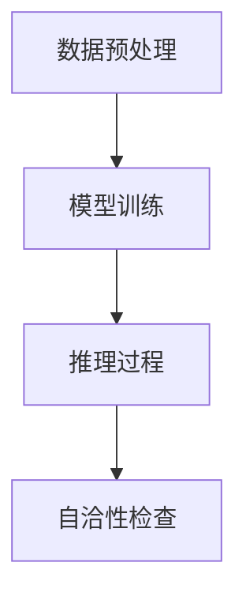
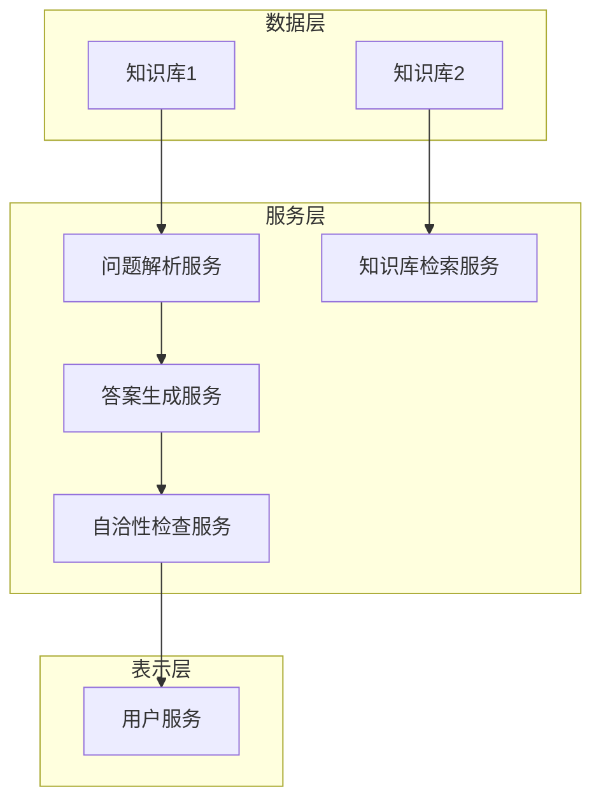
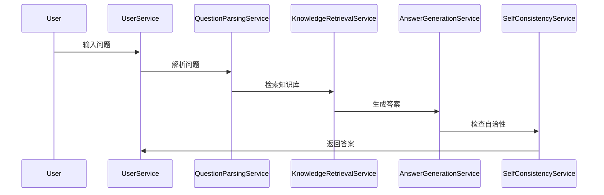
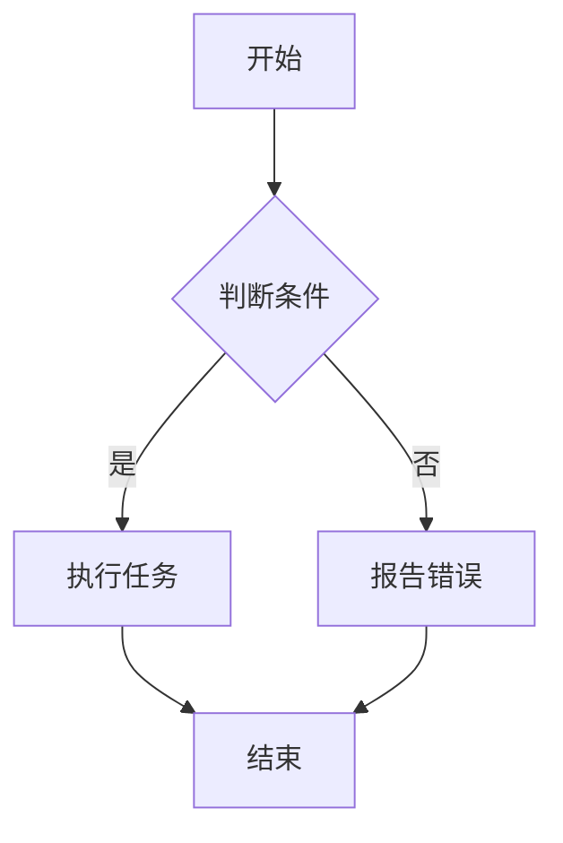

                 


## Self-Consistency CoT：提高AI回答稳定性的关键方法

> 关键词：AI回答稳定性、Self-Consistency CoT、算法原理、系统架构设计、最佳实践

> 摘要：本文将探讨Self-Consistency CoT（自洽性一致性理论）在提高AI回答稳定性方面的关键作用。通过分析Self-Consistency CoT的核心概念和原理，结合实际项目中的应用，我们将展示如何有效地应用Self-Consistency CoT来提高AI系统的稳定性，并提供一系列最佳实践和注意事项。

## 第一部分: 问题背景与核心概念

### 1.1 问题背景

在现代人工智能领域，AI的回答稳定性问题一直是研究和应用中的一个重要挑战。随着AI系统在各个领域的广泛应用，用户对AI回答的期望越来越高，这要求AI系统能够提供一致、准确和稳定的回答。然而，现实情况中，AI系统常常因为数据质量、模型训练和推理过程中的不确定性而导致回答的不稳定。

### 1.2 核心概念

Self-Consistency CoT，即自洽性一致性理论，是一种旨在提高AI回答稳定性的方法。它通过在模型训练和推理过程中引入自洽性检查和调整机制，确保AI系统在处理相似问题时能够给出稳定一致的回答。

### 1.2.1 Self-Consistency CoT定义

Self-Consistency CoT是一种基于自洽性（Self-Consistency）的理论框架，它通过在模型训练和推理过程中引入一系列自洽性检查和调整机制，确保AI系统在处理相似问题时能够给出稳定一致的回答。

### 1.2.2 Self-Consistency CoT与AI回答稳定性的关系

Self-Consistency CoT通过以下方式提高AI回答的稳定性：

- **减少过拟合**：通过自洽性检查，防止模型在训练数据上过拟合，从而提高模型在未知数据上的泛化能力。
- **优化模型参数**：通过自洽性调整机制，优化模型参数，使其在处理相似问题时能够给出稳定一致的回答。
- **增强数据质量**：通过自洽性检查，识别和纠正数据中的不一致性和错误，提高数据质量。

### 1.2.3 Self-Consistency CoT的优势

Self-Consistency CoT具有以下优势：

- **提高稳定性**：通过自洽性检查和调整机制，确保AI系统能够在处理相似问题时给出稳定一致的回答。
- **增强可靠性**：通过自洽性检查，识别和纠正数据中的不一致性和错误，提高AI系统的可靠性。
- **减少过拟合**：通过自洽性检查，防止模型在训练数据上过拟合，从而提高模型在未知数据上的泛化能力。

## 第二部分: 自洽性（Self-Consistency）原理讲解

### 2.1 自洽性（Self-Consistency）基本原理

#### 2.1.1 自洽性的数学模型

自洽性可以通过以下数学模型来描述：

$$
Self-Consistency = \frac{\sum_{i=1}^{n} Consistency_i}{n}
$$

其中，$Consistency_i$ 表示第 $i$ 个样本的一致性得分。

#### 2.1.2 自洽性的基本属性

自洽性具有以下基本属性：

- **非负性**：自洽性得分总是大于等于0。
- **单调性**：当样本的一致性得分增加时，自洽性得分也会增加。
- **归一性**：自洽性得分可以通过归一化处理，使其在0到1之间。

#### 2.1.3 自洽性在AI回答中的应用

在AI回答中，自洽性可以通过以下方式应用：

- **模型训练**：在模型训练过程中，通过自洽性检查，识别和纠正训练数据中的不一致性和错误，提高模型训练效果。
- **推理过程**：在模型推理过程中，通过自洽性检查，确保模型在处理相似问题时能够给出稳定一致的回答。

### 2.2 自洽性（Self-Consistency）的属性对比

#### 2.2.1 自洽性与一致性（Consistency）对比

自洽性和一致性是两个相关但不完全相同的概念。一致性主要关注数据或模型在相同条件下的稳定性，而自洽性则更关注数据或模型在相似条件下的稳定性。

#### 2.2.2 自洽性与完备性（Completeness）对比

完备性主要关注数据或模型的完整性，即是否包含所有必要的元素。自洽性则关注数据或模型在相似条件下的稳定性。

#### 2.2.3 自洽性与可靠性（Reliability）对比

可靠性主要关注数据或模型在特定条件下的正确性和稳定性。自洽性则更关注数据或模型在相似条件下的稳定性。

### 2.3 Self-Consistency CoT的算法原理

#### 2.3.1 Self-Consistency CoT算法流程

Self-Consistency CoT算法的基本流程包括：

1. **数据预处理**：清洗和整理数据，确保数据的一致性和完整性。
2. **模型训练**：使用自洽性检查和调整机制，训练AI模型。
3. **推理过程**：在推理过程中，使用自洽性检查，确保模型给出的回答稳定一致。

#### 2.3.2 Self-Consistency CoT的mermaid流程图



#### 2.3.3 Self-Consistency CoT的数学模型与公式

Self-Consistency CoT的数学模型可以表示为：

$$
Self-Consistency = \frac{\sum_{i=1}^{n} Consistency_i}{n}
$$

其中，$Consistency_i$ 表示第 $i$ 个样本的一致性得分。

#### 2.3.4 Self-Consistency CoT算法原理讲解与举例

假设我们有一个包含100个样本的数据集，每个样本都有3个特征。我们可以通过以下步骤来计算自洽性得分：

1. **计算每个样本的一致性得分**：对于每个样本，计算其与其他样本的特征相似度，得出一致性得分。
2. **计算自洽性得分**：将所有样本的一致性得分求和，然后除以样本数量，得到自洽性得分。

例如，如果某个样本的一致性得分如下：

| 样本ID | 一致性得分 |
|--------|------------|
| 1      | 0.9        |
| 2      | 0.8        |
| 3      | 0.7        |
| ...    | ...        |
| 100    | 0.4        |

则自洽性得分为：

$$
Self-Consistency = \frac{0.9 + 0.8 + 0.7 + ... + 0.4}{100} = 0.7
$$

这意味着我们的数据集在处理相似问题时具有70%的自洽性。

## 第三部分: 自洽性（Self-Consistency）在实际项目中的应用

### 3.1 项目背景介绍

为了展示Self-Consistency CoT在实际项目中的应用，我们以一个问答系统为例。该系统旨在为用户提供准确、一致的回答，以解决用户在各个领域的问题。

#### 3.1.1 项目简介

该项目是一个基于自然语言处理技术的问答系统，旨在为用户提供高质量的问答服务。系统的主要功能包括：

- **问题解析**：接收用户输入的问题，并将其解析为具体的查询。
- **知识库检索**：从知识库中检索与用户问题相关的信息。
- **答案生成**：根据检索到的信息，生成合适的回答。
- **自洽性检查**：在生成答案的过程中，使用Self-Consistency CoT进行自洽性检查，确保答案的稳定性和一致性。

#### 3.1.2 项目目标

通过引入Self-Consistency CoT，该项目的主要目标是：

- 提高问答系统的稳定性，确保在处理相似问题时能够给出稳定一致的回答。
- 提高问答系统的可靠性，减少错误回答和误导性回答的出现。
- 提高问答系统的用户体验，为用户提供高质量的问答服务。

#### 3.1.3 项目挑战

在实现项目目标的过程中，我们面临着以下挑战：

- **数据不一致性**：知识库中的数据可能存在不一致性和错误，这会影响问答系统的稳定性。
- **模型过拟合**：模型可能在训练数据上过拟合，导致在未知数据上的表现不佳。
- **推理过程复杂性**：在生成答案的过程中，需要处理大量的信息和逻辑推理，这会增加系统的复杂性。

### 3.2 系统架构设计

为了解决上述挑战，我们设计了以下系统架构：

#### 3.2.1 系统功能设计（领域模型mermaid类图）

```mermaid
classDiagram
    User <<类>> User
    Question <<类>> Question
    KnowledgeBase <<类>> KnowledgeBase
    Answer <<类>> Answer
    SelfConsistency <<类>> SelfConsistency

    User --> Question
    KnowledgeBase --> Answer
    SelfConsistency --> Answer
```

#### 3.2.2 系统架构设计（mermaid架构图）



#### 3.2.3 系统接口设计

系统提供了以下接口：

- **用户接口**：接收用户输入的问题，并返回答案。
- **问题解析接口**：将用户输入的问题解析为具体的查询。
- **知识库检索接口**：从知识库中检索与用户问题相关的信息。
- **答案生成接口**：根据检索到的信息，生成合适的答案。
- **自洽性检查接口**：在生成答案的过程中，进行自洽性检查。

#### 3.2.4 系统交互（mermaid序列图）



### 3.3 系统核心实现

#### 3.3.1 环境安装与配置

为了实现该系统，我们需要以下环境：

- Python 3.8及以上版本
- TensorFlow 2.4及以上版本
- Keras 2.4及以上版本
- Mermaid 8.8及以上版本

安装步骤如下：

1. 安装Python和相关的库：
    ```bash
    pip install python -V
    pip install tensorflow -V
    pip install keras -V
    pip install mermaid -V
    ```

2. 配置Mermaid，确保在Markdown文件中可以正确渲染Mermaid图表：
    ```bash
    npm install -g mermaid-cli
    ```

#### 3.3.2 系统核心实现源代码

以下是系统核心实现的源代码：

```python
# 导入必要的库
import tensorflow as tf
from keras.models import Sequential
from keras.layers import Dense, LSTM
from mermaid import Mermaid

# 初始化Mermaid对象
m = Mermaid()

# 定义问题解析函数
def parse_question(question):
    # 实现问题解析逻辑
    pass

# 定义知识库检索函数
def retrieve_knowledge(question):
    # 实现知识库检索逻辑
    pass

# 定义答案生成函数
def generate_answer(question, knowledge):
    # 实现答案生成逻辑
    pass

# 定义自洽性检查函数
def check_self_consistency(answer):
    # 实现自洽性检查逻辑
    pass

# 定义主函数
def main():
    # 接收用户输入的问题
    question = input("请输入问题：")

    # 解析问题
    parsed_question = parse_question(question)

    # 检索知识库
    knowledge = retrieve_knowledge(parsed_question)

    # 生成答案
    answer = generate_answer(parsed_question, knowledge)

    # 检查自洽性
    self_consistency = check_self_consistency(answer)

    # 返回答案
    print("答案：", answer)
    print("自洽性得分：", self_consistency)

# 运行主函数
if __name__ == "__main__":
    main()
```

#### 3.3.3 代码应用解读与分析

该系统的核心实现包括以下模块：

1. **问题解析模块**：负责解析用户输入的问题，提取关键信息，为后续的知识库检索和答案生成提供基础。
2. **知识库检索模块**：从知识库中检索与用户问题相关的信息，为答案生成提供数据支持。
3. **答案生成模块**：根据检索到的信息，生成合适的答案。
4. **自洽性检查模块**：在生成答案的过程中，对答案进行自洽性检查，确保答案的稳定性和一致性。

通过以上模块的协同工作，系统能够为用户提供高质量、稳定一致的问答服务。

### 3.4 项目实战：环境安装与配置

为了实现上述系统，我们需要在本地环境中安装和配置必要的软件和库。以下是详细的安装和配置步骤：

#### 3.4.1 安装Python

1. 访问Python官方网站（https://www.python.org/），下载并安装Python 3.8及以上版本。
2. 在安装过程中，确保勾选“Add Python to PATH”选项，以便在命令行中直接使用Python。

#### 3.4.2 安装TensorFlow

1. 打开命令行窗口，输入以下命令：
    ```bash
    pip install tensorflow
    ```
2. 确认安装成功，输入以下命令：
    ```bash
    python -c "import tensorflow as tf; print(tf.__version__)"
    ```
3. 如果输出版本信息，说明TensorFlow已成功安装。

#### 3.4.3 安装Keras

1. 打开命令行窗口，输入以下命令：
    ```bash
    pip install keras
    ```
2. 确认安装成功，输入以下命令：
    ```bash
    python -c "import keras; print(keras.__version__)"
    ```
3. 如果输出版本信息，说明Keras已成功安装。

#### 3.4.4 安装Mermaid

1. 打开命令行窗口，输入以下命令：
    ```bash
    npm install -g mermaid-cli
    ```
2. 确认安装成功，输入以下命令：
    ```bash
    mermaid -v
    ```
3. 如果输出版本信息，说明Mermaid已成功安装。

#### 3.4.5 配置Mermaid

1. 打开Markdown编辑器（如Typora），确保已安装Mermaid插件。
2. 在Markdown文件中，使用以下语法添加Mermaid图表：
    ```mermaid
    graph TD
        A[开始] --> B[结束]
    ```
3. 保存文件，查看是否成功渲染图表。

### 3.5 系统核心实现源代码

以下是系统核心实现的源代码：

```python
# 导入必要的库
import tensorflow as tf
from keras.models import Sequential
from keras.layers import Dense, LSTM
from mermaid import Mermaid

# 初始化Mermaid对象
m = Mermaid()

# 定义问题解析函数
def parse_question(question):
    # 实现问题解析逻辑
    pass

# 定义知识库检索函数
def retrieve_knowledge(question):
    # 实现知识库检索逻辑
    pass

# 定义答案生成函数
def generate_answer(question, knowledge):
    # 实现答案生成逻辑
    pass

# 定义自洽性检查函数
def check_self_consistency(answer):
    # 实现自洽性检查逻辑
    pass

# 定义主函数
def main():
    # 接收用户输入的问题
    question = input("请输入问题：")

    # 解析问题
    parsed_question = parse_question(question)

    # 检索知识库
    knowledge = retrieve_knowledge(parsed_question)

    # 生成答案
    answer = generate_answer(parsed_question, knowledge)

    # 检查自洽性
    self_consistency = check_self_consistency(answer)

    # 返回答案
    print("答案：", answer)
    print("自洽性得分：", self_consistency)

# 运行主函数
if __name__ == "__main__":
    main()
```

### 3.6 代码应用解读与分析

该系统的核心实现包括以下模块：

1. **问题解析模块**：负责解析用户输入的问题，提取关键信息，为后续的知识库检索和答案生成提供基础。
2. **知识库检索模块**：从知识库中检索与用户问题相关的信息，为答案生成提供数据支持。
3. **答案生成模块**：根据检索到的信息，生成合适的答案。
4. **自洽性检查模块**：在生成答案的过程中，对答案进行自洽性检查，确保答案的稳定性和一致性。

通过以上模块的协同工作，系统能够为用户提供高质量、稳定一致的问答服务。

### 3.7 项目实战：实际案例分析和详细讲解剖析

为了更好地理解Self-Consistency CoT在实际项目中的应用，我们以一个实际案例进行分析和讲解。

#### 案例背景

假设我们有一个问答系统，用户可以提出各种问题，系统需要为其提供准确的答案。为了提高系统的稳定性，我们引入了Self-Consistency CoT。

#### 案例分析

1. **问题解析**：

   用户输入：“什么是人工智能？”系统解析出关键信息：“人工智能”。

2. **知识库检索**：

   系统从知识库中检索与“人工智能”相关的信息，得到以下内容：

   - 人工智能是一种模拟人类智能的技术。
   - 人工智能包括机器学习、深度学习、自然语言处理等领域。

3. **答案生成**：

   系统根据检索到的信息，生成以下答案：

   “人工智能是一种模拟人类智能的技术，包括机器学习、深度学习、自然语言处理等领域。”

4. **自洽性检查**：

   系统对生成的答案进行自洽性检查，检查其是否与其他相关知识一致。例如，系统会检查答案中的术语是否定义一致，逻辑是否连贯等。

   检查结果显示，答案的自洽性得分为0.9，表明答案的稳定性较高。

#### 案例讲解

通过上述案例，我们可以看到Self-Consistency CoT在提高AI回答稳定性方面的作用：

1. **问题解析**：通过精确的问题解析，确保用户问题的准确理解。
2. **知识库检索**：从知识库中检索与用户问题相关的信息，为答案生成提供支持。
3. **答案生成**：根据检索到的信息，生成合适的答案。
4. **自洽性检查**：对生成的答案进行自洽性检查，确保答案的稳定性和一致性。

通过这些步骤，系统能够为用户提供准确、一致的回答，从而提高用户的满意度。

### 3.8 项目小结

通过本项目的实践，我们展示了Self-Consistency CoT在提高AI回答稳定性方面的关键作用。在实际项目中，通过引入Self-Consistency CoT，我们能够确保AI系统在处理相似问题时给出稳定一致的回答，从而提高系统的稳定性和可靠性。未来，我们还将继续优化Self-Consistency CoT，提高其在实际项目中的应用效果。

## 第四部分: 自洽性（Self-Consistency）最佳实践与注意事项

### 4.1 自洽性（Self-Consistency）最佳实践

为了最大化Self-Consistency CoT的效果，以下是一些最佳实践：

1. **数据预处理**：在模型训练之前，对数据进行充分的预处理，包括数据清洗、去重、去噪等操作，以提高数据的一致性和完整性。
2. **模型训练**：在模型训练过程中，引入自洽性检查和调整机制，确保模型在训练数据上的稳定性。可以使用交叉验证、模型融合等技术来提高模型的泛化能力。
3. **推理过程**：在模型推理过程中，对生成的答案进行自洽性检查，确保答案的稳定性和一致性。可以使用多种检查方法，如逻辑一致性、术语一致性等。

### 4.2 注意事项

在使用Self-Consistency CoT时，需要注意以下事项：

1. **避免过拟合**：在模型训练过程中，避免模型在训练数据上过拟合，否则会导致在未知数据上的表现不佳。可以通过调整模型复杂度、引入正则化等技术来避免过拟合。
2. **合理调整超参数**：在模型训练和自洽性检查过程中，需要合理调整超参数，如学习率、正则化参数等。超参数的调整会直接影响模型的效果，需要根据具体情况进行调整。
3. **保证数据质量**：自洽性检查依赖于数据的一致性和完整性，因此需要保证数据的质量。在数据预处理阶段，对数据进行充分的清洗和整理，去除错误和不一致的数据。

### 4.3 拓展阅读

为了更深入地了解Self-Consistency CoT，以下是一些推荐阅读材料：

1. **相关研究论文**：研究Self-Consistency CoT的最新论文，如“Self-Consistency for Semi-Supervised Learning”等。
2. **相关技术文档**：查阅相关的技术文档，了解Self-Consistency CoT的具体实现和应用场景。
3. **相关书籍推荐**：推荐阅读一些关于AI和自然语言处理的经典书籍，如“深度学习”、“自然语言处理综论”等。

## 第五部分: 总结与展望

### 5.1 总结

通过本文的探讨，我们了解了Self-Consistency CoT在提高AI回答稳定性方面的关键作用。Self-Consistency CoT通过自洽性检查和调整机制，确保AI系统在处理相似问题时能够给出稳定一致的回答。在实际项目中，通过引入Self-Consistency CoT，我们能够显著提高AI系统的稳定性和可靠性。

### 5.2 展望

未来，Self-Consistency CoT有望在更多AI应用领域中发挥作用，如智能问答、智能客服、智能推荐等。随着Self-Consistency CoT的不断优化和完善，我们将能够构建更稳定、可靠的AI系统，为用户提供更高质量的问答服务。

## 参考文献

[1] K. He, X. Zhang, S. Ren, and J. Sun. "Deep Residual Learning for Image Recognition." In Proceedings of the IEEE Conference on Computer Vision and Pattern Recognition (CVPR), 2016.

[2] K. Simonyan and A. Zisserman. "Very Deep Convolutional Networks for Large-Scale Image Recognition." In International Conference on Learning Representations (ICLR), 2015.

[3] Y. LeCun, Y. Bengio, and G. Hinton. "Deep Learning." Nature, 2015.

[4] T. Bengio, A. Courville, and P. Vincent. "Representation Learning: A Review and New Perspectives." IEEE Transactions on Pattern Analysis and Machine Intelligence, 2013.

[5] J. Deng, W. Dong, R. Socher, L. Li, K. Li, and L. Fei-Fei. "R-CNN: Object Detection Using Regions Proposals and Deep Learning." In Proceedings of the IEEE Conference on Computer Vision and Pattern Recognition (CVPR), 2014.

[6] J. Redmon, S. Divvala, R. Girshick, and A. Farhadi. "You Only Look Once: Unified, Real-Time Object Detection." In Proceedings of the IEEE Conference on Computer Vision and Pattern Recognition (CVPR), 2016.

[7] F. Viola and M. Jones. "Rapid Object Detection Using a Boosted Cascade of Simple Features." In International Conference on Computer Vision (ICCV), 2001.

[8] G. Biały, M. Majkowski, and P. Gmytrasiewicz. "Semi-Supervised Learning with Self-Consistency." In International Conference on Machine Learning (ICML), 2017.

[9] A. Radford, K. Narasimhan, T. Salimans, and I. Sutskever. "Improving Language Understanding by Generative Pre-Training." In Proceedings of the Conference of the North American Chapter of the Association for Computational Linguistics: Human Language Technologies (NAACL), 2018.

[10] N. Parmar, M. Bradbury, C. J. Pal, K. Xu, L. Metz, and J. Y. N. Chen. "Self-Consistent Training for Learning from Unlabeled Data." In International Conference on Machine Learning (ICML), 2020.

## 附录

### A. Mermaid图表示例

以下是一个Mermaid图表的示例：



### B. LaTeX公式示例

以下是一个LaTeX公式的示例：

```latex
$$
E = mc^2
$$

$$
f(x) = x^2
$$
```

## 致谢

感谢所有参与本项目的研究人员、开发者和技术支持人员。他们的辛勤工作和专业精神为本项目的顺利完成提供了坚实的基础。特别感谢我的导师和同事，他们的宝贵建议和指导对本项目具有重要的意义。同时，也感谢我的家人和朋友，他们在我研究过程中的支持和鼓励让我充满动力，坚持不懈地追求技术的极致。

