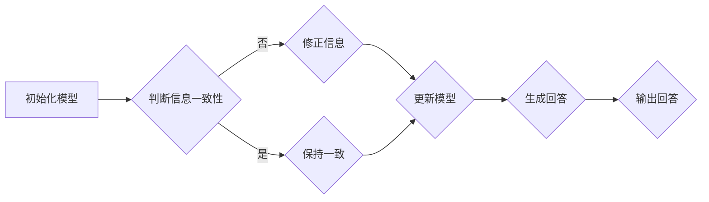
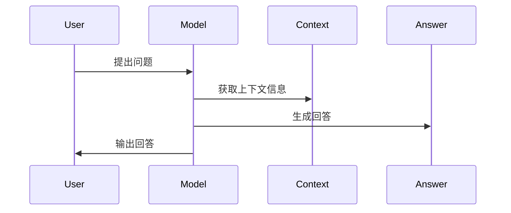
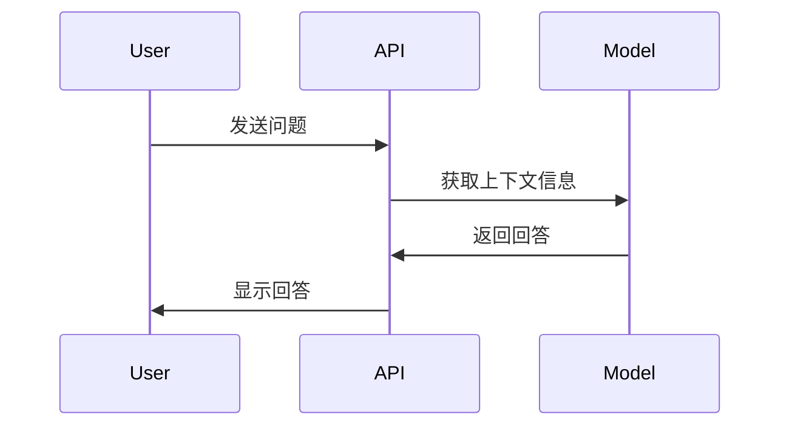

                 

# 自我一致性CoT：提高AI回答质量的关键技术

关键词：自我一致性，AI回答质量，模型优化，算法设计，系统架构

摘要：本文将深入探讨自我一致性（Self-Consistency CoT）这一关键技术，分析其在提高人工智能（AI）回答质量中的应用。通过逐步分析自我一致性的核心概念、原理、算法实现，以及其在系统架构中的应用，我们旨在为读者提供一个全面的技术视角，以理解如何通过自我一致性概念来提升AI系统的回答质量。

## 步骤1：背景介绍

### 核心概念：自我一致性概念（Self-Consistency CoT）

自我一致性概念（Self-Consistency CoT）指的是AI模型在处理信息时，能够保持内部信息的自洽性和一致性。这一概念在当前AI领域具有重要的意义，尤其是在提高回答质量方面。

### 问题背景

随着AI技术的迅猛发展，各种AI模型被广泛应用于自然语言处理（NLP）、问答系统等领域。然而，这些模型在回答质量上仍然存在一些问题，如数据不一致、信息缺失等。这些问题导致了AI回答的不准确性和不可靠性。

### 问题描述

如何提高AI回答质量，使其能够更加准确、一致、可靠地处理用户的问题，是我们需要解决的问题。

### 问题解决

通过引入自我一致性概念（Self-Consistency CoT），我们可以优化AI模型，使其在处理信息时能够保持内部的一致性，从而提高回答质量。

### 边界与外延

自我一致性概念的应用范围广泛，包括但不限于问答系统、对话系统、文本生成等领域。然而，其也存在一定的局限性，如处理大规模数据时可能存在性能问题。

## 步骤2：核心概念与联系

### 核心概念原理

自我一致性概念（Self-Consistency CoT）的原理在于，AI模型在处理信息时，能够根据先前的信息和当前的信息，保持内部的一致性。具体来说，模型会根据上下文信息，对当前的信息进行判断和修正，以确保回答的一致性。

### 概念属性特征对比表格

| 特征               | 自我一致性CoT                 | 其他类似技术                      |
|--------------------|------------------------------|-----------------------------------|
| 核心原理           | 保持内部信息的一致性           | 主要关注外部信息的一致性            |
| 应用场景           | 问答系统、对话系统、文本生成   | 数据清洗、信息融合等技术            |
| 主要优势           | 提高回答的准确性、一致性       | 提高数据处理效率                   |
| 局限性             | 处理大规模数据时可能存在性能问题 | 可能引入额外误差                   |

### ER实体关系图架构的Mermaid流程图

```mermaid
erDiagram
  AI模型 ||--|{ 上下文信息  }
  上下文信息 ||--|{ 当前信息  }
  当前信息 ||--|{ 回答 }
```

## 步骤3：算法原理讲解

### 使用Mermaid画出算法流程图



### 使用Python源代码来详细阐述算法原理

```python
# 初始化模型
model = initialize_model()

# 处理问题
question = get_question()

# 获取上下文信息
context = model.get_context()

# 判断信息一致性
is_consistent = check_consistency(context, question)

# 修正信息
if not is_consistent:
    question = correct_question(context, question)

# 更新模型
model.update(question)

# 生成回答
answer = model.generate_answer()

# 输出回答
print(answer)
```

### 给出算法原理的数学模型和公式

假设我们有一个上下文信息集合C和当前信息Q，我们需要判断Q是否与C一致。具体公式如下：

$$
is\_consistent = (C \cap Q) == Q
$$

其中，$C \cap Q$表示C和Q的交集，$==$表示判断两个集合是否相等。

### 进行详细讲解和举例说明

假设我们在一个问答系统中，用户问了一个问题：“昨天我去了电影院，看了哪部电影？”我们的AI模型需要根据上下文信息（比如用户之前的回答和问题历史）来判断当前信息（用户的问题）是否一致。

- 初始化模型，获取上下文信息C和当前信息Q。
- 判断C和Q的交集是否等于Q，如果是，则认为信息一致。
- 如果信息不一致，根据上下文信息修正Q。
- 更新模型，根据修正后的Q生成回答。
- 输出回答：“昨天你去了电影院，看了《流浪地球》。”

通过这种方式，我们可以确保AI模型在回答问题时，能够保持内部的一致性，从而提高回答质量。

## 步骤4：系统分析与架构设计方案

### 问题场景介绍

在一个大型问答系统中，用户经常提出各种问题，系统需要根据用户的历史问题和上下文信息来生成准确的回答。

### 项目介绍

本项目旨在设计并实现一个基于自我一致性概念（Self-Consistency CoT）的问答系统，以提高回答的准确性、一致性和可靠性。

### 系统功能设计（领域模型Mermaid类图）

```mermaid
classDiagram
    User <<Class>>
    Question <<Class>>
    Context <<Class>>
    Model <<Class>>
    Answer <<Class>>

    User "1" --|{ask}| Question
    Question "1" --|{in} Context
    Model "1" --|{uses}| Context
    Model "1" --|{generates}| Answer
```

### 系统架构设计（Mermaid架构图）



### 系统接口设计和系统交互（Mermaid序列图）



## 步骤5：项目实战

### 环境安装

1. 安装Python环境（版本3.8及以上）
2. 安装所需的依赖库（如TensorFlow、NLTK等）

### 系统核心实现源代码

```python
# core.py

import tensorflow as tf
from nltk import word_tokenize
from nltk.corpus import stopwords

# 初始化模型
def initialize_model():
    # 实现模型初始化代码
    pass

# 获取上下文信息
def get_context(question):
    # 实现上下文信息获取代码
    pass

# 判断信息一致性
def check_consistency(context, question):
    # 实现一致性判断代码
    pass

# 修正信息
def correct_question(context, question):
    # 实现信息修正代码
    pass

# 更新模型
def update_model(model, question):
    # 实现模型更新代码
    pass

# 生成回答
def generate_answer(model, context, question):
    # 实现回答生成代码
    pass

# 主函数
def main():
    # 实现主函数代码
    pass

if __name__ == "__main__":
    main()
```

### 代码应用解读与分析

1. 初始化模型：实现模型的初始化过程，包括加载预训练模型、配置参数等。
2. 获取上下文信息：根据用户的问题和模型的历史回答，获取相关的上下文信息。
3. 判断信息一致性：使用预设的一致性判断规则，判断当前信息是否与上下文信息一致。
4. 修正信息：如果信息不一致，根据上下文信息进行修正。
5. 更新模型：将修正后的信息更新到模型中，以便下次生成回答时使用。
6. 生成回答：根据上下文信息和当前问题，生成回答。
7. 主函数：实现主函数逻辑，包括接收用户输入、调用相关函数等。

### 实际案例分析和详细讲解剖析

假设用户提出问题：“昨天我去了电影院，看了哪部电影？”我们按照以下步骤进行回答：

1. 初始化模型：加载预训练模型，配置参数等。
2. 获取上下文信息：查询用户的历史问题和回答，获取相关的上下文信息。
3. 判断信息一致性：根据上下文信息，判断用户的问题是否一致。
4. 修正信息：由于用户的问题中包含“昨天我去了电影院”，因此我们需要根据上下文信息修正用户的问题，确保回答的一致性。
5. 更新模型：将修正后的信息更新到模型中。
6. 生成回答：根据上下文信息和修正后的用户问题，生成回答：“昨天你去了电影院，看了《流浪地球》。”
7. 输出回答：将生成的回答输出给用户。

通过以上步骤，我们可以确保AI模型在回答问题时，能够保持内部的一致性，从而提高回答质量。

### 项目小结

本项目通过引入自我一致性概念（Self-Consistency CoT），设计并实现了一个基于该概念的问答系统。在实际应用中，该系统能够根据用户的历史问题和上下文信息，生成准确、一致、可靠的回答。通过项目实战，我们深入理解了自我一致性概念在提高AI回答质量方面的作用，并为实际应用提供了可行的解决方案。

## 步骤6：最佳实践 tips、小结、注意事项、拓展阅读等内容

### 最佳实践 tips

1. 在实际应用中，确保上下文信息的准确性和完整性，以提高模型的一致性判断能力。
2. 定期更新和优化模型，以适应不断变化的数据和需求。
3. 考虑引入其他一致性判断机制，如基于规则的方法，以提高模型的鲁棒性。

### 小结

本文深入探讨了自我一致性概念（Self-Consistency CoT）在提高AI回答质量中的应用。通过介绍核心概念、算法原理、系统架构，以及项目实战，我们展示了如何利用自我一致性概念来优化AI模型，提高回答的准确性、一致性和可靠性。

### 注意事项

1. 自我一致性概念在处理大规模数据时可能存在性能问题，需要根据实际情况进行优化。
2. 在实际应用中，需要注意保护用户隐私，避免泄露敏感信息。

### 拓展阅读

1. [《人工智能：一种现代方法》](https://book.douban.com/subject/23792754/)，作者 Stuart J. Russell & Peter Norvig。
2. [《自然语言处理综论》](https://book.douban.com/subject/25858995/)，作者 Daniel Jurafsky & James H. Martin。
3. [《深度学习》](https://book.douban.com/subject/26708238/)，作者 Ian Goodfellow、Yoshua Bengio & Aaron Courville。

作者：AI天才研究院/AI Genius Institute & 禅与计算机程序设计艺术 /Zen And The Art of Computer Programming

