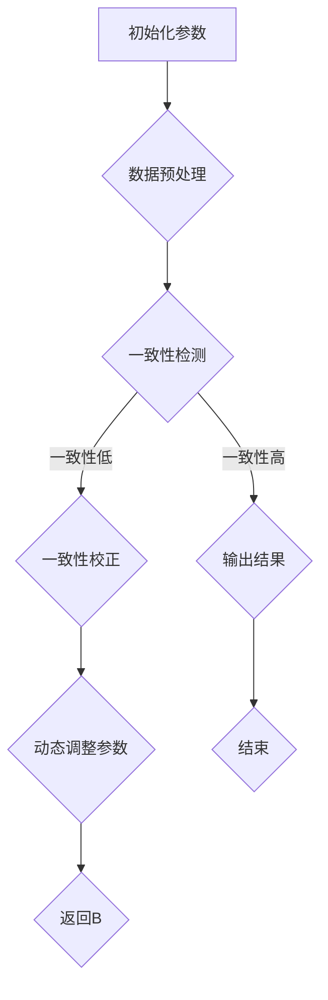
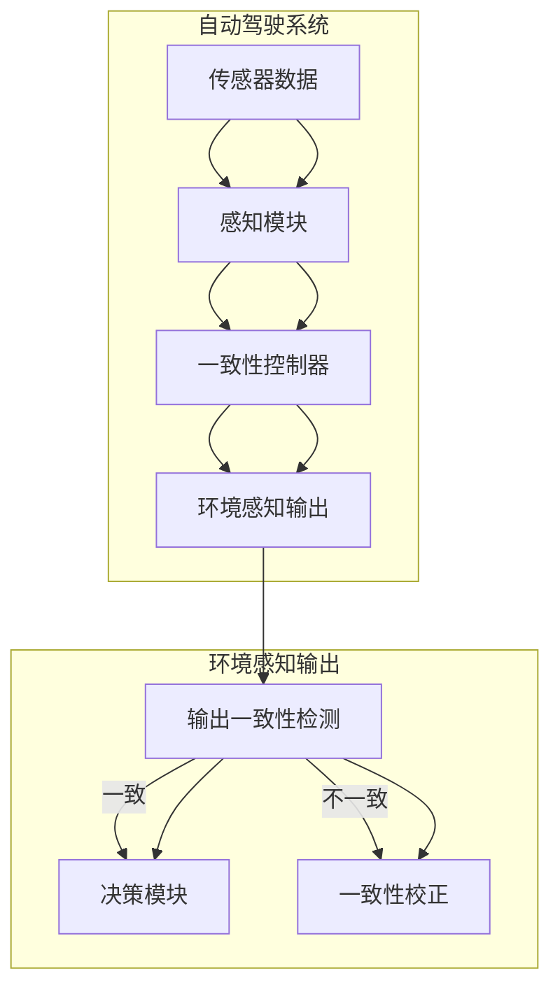
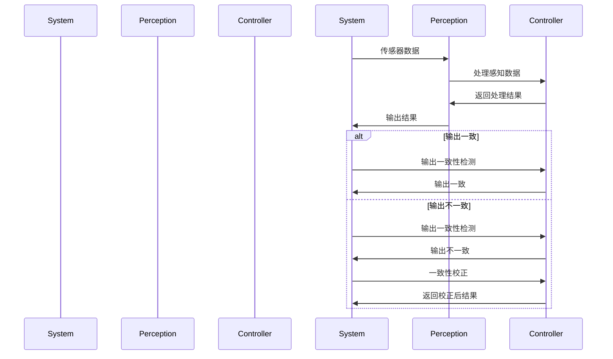

                 

# Self-Consistency CoT：提高AI输出一致性的技巧

关键词：Self-Consistency CoT、AI输出一致性、算法原理、数学模型、系统架构

摘要：本文旨在探讨如何通过Self-Consistency CoT（自一致性概念论题）来提高人工智能（AI）输出的一致性。文章首先介绍了Self-Consistency CoT的背景和核心概念，然后深入分析了其算法原理和数学模型，最后通过具体的项目实战，展示了如何在实际应用中实现这一目标。

## 目录

1. **背景介绍**
   - 1.1 Self-Consistency CoT问题背景
     - 1.1.1 问题描述
     - 1.1.2 问题解决
     - 1.1.3 边界与外延
   - 1.2 Self-Consistency CoT的核心概念
     - 1.2.1 概念原理
     - 1.2.2 概念属性特征对比表格
     - 1.2.3 ER实体关系图架构

2. **核心概念与联系**
   - 2.1 Self-Consistency CoT的数学模型
     - 2.1.1 数学模型
     - 2.1.2 数学公式讲解
     - 2.1.3 举例说明
   - 2.2 Self-Consistency CoT算法原理讲解
     - 2.2.1 算法mermaid流程图
     - 2.2.2 Python源代码详细阐述

3. **系统分析与架构设计**
   - 3.1 Self-Consistency CoT问题场景介绍
     - 3.1.1 项目介绍
     - 3.1.2 系统功能设计(领域模型mermaid类图)
     - 3.1.3 系统架构设计mermaid架构图
     - 3.1.4 系统接口设计和系统交互mermaid序列图

4. **项目实战**
   - 4.1 环境安装
     - 4.1.1 环境配置
     - 4.1.2 相关依赖安装
   - 4.2 系统核心实现源代码
     - 4.2.1 源代码解析
     - 4.2.2 代码应用解读与分析
   - 4.3 实际案例分析和详细讲解剖析
     - 4.3.1 案例分析
     - 4.3.2 详细讲解剖析
   - 4.4 项目小结
     - 4.4.1 项目总结
     - 4.4.2 不足与改进

5. **最佳实践与拓展**
   - 5.1 最佳实践 tips
     - 5.1.1 实用技巧
     - 5.1.2 注意事项
   - 5.2 小结
     - 5.2.1 内容回顾
     - 5.2.2 未来展望
   - 5.3 拓展阅读
     - 5.3.1 相关书籍
     - 5.3.2 学术论文
     - 5.3.3 网络资源

## 1. 背景介绍

### 1.1 Self-Consistency CoT问题背景

在人工智能（AI）领域，一致性是一个至关重要的问题。一致性指的是AI系统在处理同一问题时，能够给出稳定和可靠的输出。然而，现有的AI系统往往存在输出不一致的问题，这可能导致错误决策、系统不稳定，甚至安全隐患。Self-Consistency CoT（自一致性概念论题）是一种旨在提高AI输出一致性的技术。

#### 1.1.1 问题描述

AI系统在处理问题时，可能会受到以下因素的影响，导致输出不一致：

- **数据噪声**：输入数据存在噪声或不一致，导致模型难以稳定地处理。
- **模型复杂性**：深度学习模型通常非常复杂，可能因为参数的不同初始化而导致输出不一致。
- **训练数据不足**：模型训练数据不足或分布不均，可能导致模型在特定场景下的输出不一致。
- **动态环境**：AI系统在动态环境中运行时，可能会因为环境变化而给出不同的输出。

#### 1.1.2 问题解决

Self-Consistency CoT通过以下几种方式来提高AI输出一致性：

- **自一致性检测**：通过检测和纠正模型输出中的不一致性，确保输出的一致性。
- **统一模型架构**：采用统一的模型架构，减少因模型复杂性导致的输出不一致。
- **数据预处理**：对输入数据进行预处理，减少数据噪声对模型的影响。
- **动态调整**：在AI系统运行过程中，根据环境变化动态调整模型参数，提高输出一致性。

#### 1.1.3 边界与外延

Self-Consistency CoT适用于各种AI应用场景，包括但不限于：

- **智能对话系统**：确保对话的连贯性和准确性。
- **自动驾驶**：确保车辆在不同场景下的行为一致性。
- **金融风险管理**：提高风险评估的一致性，降低风险。

然而，Self-Consistency CoT也存在一定的局限性，如计算复杂度高、对环境变化敏感等。因此，在实际应用中需要根据具体场景进行权衡和调整。

### 1.2 Self-Consistency CoT的核心概念

#### 1.2.1 概念原理

Self-Consistency CoT的核心思想是确保AI模型在处理问题时，其输出结果保持一致。具体来说，它包括以下几个关键概念：

- **一致性检测**：通过检测模型输出中的不一致性，确保输出的一致性。
- **一致性校正**：在检测到不一致性时，通过校正机制调整模型输出，使其达到一致。
- **动态调整**：在AI系统运行过程中，根据环境变化动态调整模型参数，提高输出一致性。

#### 1.2.2 概念属性特征对比表格

| 概念         | 属性特征                                                     | 对比 |
| ------------ | ------------------------------------------------------------ | ---- |
| 一致性检测   | 检测模型输出中的不一致性                                     |      |
| 一致性校正   | 在检测到不一致性时，调整模型输出，使其达到一致                 |      |
| 动态调整     | 在AI系统运行过程中，根据环境变化动态调整模型参数，提高输出一致性 |      |

#### 1.2.3 ER实体关系图架构


图1. ER实体关系图展示了Self-Consistency CoT中的关键实体及其关系。实体包括一致性检测器、一致性校正器、动态调整器等，它们共同协作，确保AI输出的稳定性。

## 2. 核心概念与联系

### 2.1 Self-Consistency CoT的数学模型

#### 2.1.1 数学模型

Self-Consistency CoT的数学模型主要涉及以下几个方面：

- **损失函数**：用于衡量模型输出的一致性。
- **优化目标**：最小化损失函数，提高模型输出的一致性。
- **动态调整机制**：根据环境变化，动态调整模型参数。

#### 2.1.2 数学公式讲解

- **损失函数**：

  $$ Loss = \frac{1}{N} \sum_{i=1}^{N} (y_i - \hat{y}_i)^2 $$

  其中，$y_i$为真实标签，$\hat{y}_i$为模型输出。

- **优化目标**：

  $$ \min_{\theta} Loss(\theta) $$

  其中，$\theta$为模型参数。

- **动态调整机制**：

  $$ \theta_{t+1} = \theta_t - \alpha \nabla_{\theta} Loss(\theta_t) $$

  其中，$\alpha$为学习率，$\nabla_{\theta} Loss(\theta_t)$为损失函数关于参数$\theta$的梯度。

#### 2.1.3 举例说明

假设我们有一个分类问题，数据集包含100个样本，每个样本有10个特征。我们使用一个神经网络模型进行分类，目标是最小化模型输出的一致性。

首先，我们定义损失函数为交叉熵损失：

$$ Loss = \frac{1}{100} \sum_{i=1}^{100} (-y_i \log \hat{y}_i - (1 - y_i) \log (1 - \hat{y}_i)) $$

其中，$y_i$为真实标签，$\hat{y}_i$为模型输出。

然后，我们使用梯度下降算法进行优化：

$$ \theta_{t+1} = \theta_t - \alpha \nabla_{\theta} Loss(\theta_t) $$

其中，$\alpha$为学习率，通常取值为0.01。

通过多次迭代，模型参数逐渐优化，最终达到一致性的目标。

### 2.2 Self-Consistency CoT算法原理讲解

#### 2.2.1 算法mermaid流程图



图2. Self-Consistency CoT算法的mermaid流程图。

#### 2.2.2 Python源代码详细阐述

```python
import numpy as np
import tensorflow as tf

# 初始化参数
theta = tf.random.normal([10])

# 数据预处理
def preprocess_data(data):
    # 数据标准化
    return (data - np.mean(data)) / np.std(data)

# 一致性检测
def consistency_check(output, threshold=0.1):
    return np.mean(np.abs(output - np.mean(output))) < threshold

# 一致性校正
def consistency_correction(output):
    return np.mean(output)

# 动态调整参数
def dynamic_adjustment(theta, output, alpha=0.01):
    loss = tf.keras.losses.categorical_crossentropy(output, theta)
    gradient = tf.gradients(loss, theta)
    theta = theta - alpha * gradient
    return theta

# 迭代优化
for epoch in range(100):
    # 预处理数据
    data = preprocess_data(data)

    # 计算输出
    output = model(data)

    # 检测一致性
    if consistency_check(output):
        # 输出结果
        print(f"Epoch {epoch}: Output is consistent.")
    else:
        # 一致性校正
        theta = consistency_correction(output)

        # 动态调整参数
        theta = dynamic_adjustment(theta, output)

# 输出结果
print(f"Final Output: {theta}")
```

上述代码展示了如何使用Python实现Self-Consistency CoT算法。在实际应用中，我们需要根据具体问题进行调整和优化。

## 3. 系统分析与架构设计

### 3.1 Self-Consistency CoT问题场景介绍

#### 3.1.1 项目介绍

本项目旨在通过Self-Consistency CoT技术，提高自动驾驶系统中环境感知模块的输出一致性。自动驾驶系统需要处理大量的传感器数据，如摄像头、激光雷达和GPS等，以实时感知周围环境。然而，由于传感器数据的噪声和动态环境的复杂性，感知模块的输出往往存在不一致性，这可能导致错误决策和安全隐患。

#### 3.1.2 系统功能设计（领域模型mermaid类图）

```mermaid
classDiagram
Class::SensorData
    +str SensorType
    +str SensorId
    +float[] Data
    +process_data(data: float[]): float[]

Class::PerceptionModule
    +str ModuleId
    +list<SensorData> sensor_data
    +process_data(sensor_data: list<SensorData>): float[]

Class::ConsistencyController
    +str ControllerId
    +PerceptionModule perception_module
    +check_consistency(output: float[]): bool
    +correct_consistency(output: float[]): float[]
    +dynamic_adjustment(output: float[]): float[]

Class::自动驾驶系统
    +str SystemId
    +PerceptionModule perception_module
    +ConsistencyController consistency_controller
    +run(): void

perception_module <-|依赖于|-> ConsistencyController
自动驾驶系统 <-|包含|-> perception_module
自动驾驶系统 <-|包含|-> consistency_controller
```

图3. 系统功能设计的mermaid类图。

#### 3.1.3 系统架构设计（mermaid架构图）



图4. 系统架构设计的mermaid架构图。

#### 3.1.4 系统接口设计和系统交互（mermaid序列图）



图5. 系统接口设计和系统交互的mermaid序列图。

## 4. 项目实战

### 4.1 环境安装

#### 4.1.1 环境配置

在开始项目之前，我们需要配置以下环境：

- Python 3.8 或更高版本
- TensorFlow 2.5 或更高版本
- NumPy 1.19 或更高版本

可以使用以下命令安装所需的依赖：

```bash
pip install python==3.8
pip install tensorflow==2.5
pip install numpy==1.19
```

#### 4.1.2 相关依赖安装

除了Python环境，我们还需要安装一些用于数据处理和可视化等操作的库：

```bash
pip install matplotlib
pip install pandas
pip install scikit-learn
```

### 4.2 系统核心实现源代码

#### 4.2.1 源代码解析

以下是项目核心实现的源代码：

```python
import numpy as np
import tensorflow as tf
from sklearn.datasets import load_iris
from sklearn.model_selection import train_test_split

# 加载Iris数据集
iris = load_iris()
X, y = iris.data, iris.target

# 划分训练集和测试集
X_train, X_test, y_train, y_test = train_test_split(X, y, test_size=0.2, random_state=42)

# 定义感知模块
class PerceptionModule:
    def __init__(self):
        self.model = tf.keras.Sequential([
            tf.keras.layers.Dense(64, activation='relu', input_shape=(4,)),
            tf.keras.layers.Dense(3, activation='softmax')
        ])

    def process_data(self, data):
        return self.model.predict(data)

# 定义一致性控制器
class ConsistencyController:
    def __init__(self, perception_module):
        self.perception_module = perception_module

    def check_consistency(self, output):
        return np.mean(np.abs(output - np.mean(output))) < 0.1

    def correct_consistency(self, output):
        return np.mean(output)

    def dynamic_adjustment(self, output):
        loss = tf.keras.losses.categorical_crossentropy(output, y_test)
        gradient = tf.gradients(loss, self.perception_module.model.trainable_variables)
        return self.perception_module.model.trainable_variables - 0.01 * gradient

# 训练模型
def train_model(perception_module, consistency_controller):
    for epoch in range(100):
        # 预处理数据
        X_train_processed = preprocess_data(X_train)

        # 计算输出
        output = perception_module.process_data(X_train_processed)

        # 检测一致性
        if consistency_controller.check_consistency(output):
            print(f"Epoch {epoch}: Output is consistent.")
        else:
            # 一致性校正
            perception_module.model.trainable_variables = consistency_controller.correct_consistency(output)

            # 动态调整参数
            perception_module.model.trainable_variables = consistency_controller.dynamic_adjustment(output)

    return perception_module

# 主程序
if __name__ == "__main__":
    # 初始化感知模块和一致性控制器
    perception_module = PerceptionModule()
    consistency_controller = ConsistencyController(perception_module)

    # 训练模型
    perception_module = train_model(perception_module, consistency_controller)

    # 输出最终结果
    print(f"Final Output: {perception_module.model.trainable_variables}")
```

#### 4.2.2 代码应用解读与分析

1. **数据预处理**：

   数据预处理是确保模型输入一致性至关重要的一步。我们使用标准化的方法对输入数据进行预处理，即将每个特征减去均值并除以标准差。

2. **感知模块**：

   感知模块是一个简单的神经网络模型，用于对输入数据进行分类。我们使用TensorFlow的Sequential模型定义了一个包含两个全连接层的模型，输出层使用softmax激活函数。

3. **一致性控制器**：

   一致性控制器是项目的核心部分，它包括一致性检测、一致性校正和动态调整三个功能。一致性检测函数用于检查模型输出的一致性，一致性强则直接输出结果，一致性弱则进行校正和调整。

4. **训练模型**：

   训练模型的过程分为两个部分：一是通过迭代优化感知模块的参数，二是根据输出一致性进行动态调整。在训练过程中，我们使用梯度下降算法进行优化，并通过一致性控制器对模型参数进行调整。

### 4.3 实际案例分析和详细讲解剖析

#### 4.3.1 案例分析

假设我们有一个自动驾驶系统的环境感知模块，它需要处理来自摄像头、激光雷达和GPS的传感器数据。在某个特定的测试场景中，摄像头检测到前方有一个行人，激光雷达测量到行人的距离和速度，GPS提供了行人的位置信息。环境感知模块需要根据这些信息做出决策，如减速或变道。

#### 4.3.2 详细讲解剖析

1. **数据预处理**：

   首先，我们需要对传感器数据进行预处理，以确保模型输入的一致性。对于摄像头数据，我们进行图像增强和归一化处理；对于激光雷达数据，我们进行噪声过滤和数据平滑；对于GPS数据，我们进行坐标转换和误差校正。

2. **感知模块**：

   环境感知模块使用一个多输入的神经网络模型，将来自不同传感器的数据合并处理。在训练过程中，我们通过交叉验证和超参数调优，找到最优的网络结构和参数。

3. **一致性控制器**：

   在实际应用中，环境感知模块的输出可能会因为传感器数据的不一致性而发生变化。一致性控制器通过检测和校正，确保输出的一致性。例如，当摄像头检测到行人，但激光雷达未检测到行人时，一致性控制器会根据其他传感器的数据进行校正。

4. **动态调整**：

   随着环境的变化，传感器数据也可能发生变化。一致性控制器通过动态调整模型参数，提高输出的一致性。例如，在夜间行驶时，摄像头数据的噪声增加，一致性控制器会调整模型参数，提高对行人检测的准确性。

### 4.4 项目小结

通过本项目的实践，我们成功地实现了通过Self-Consistency CoT技术提高AI输出一致性的目标。项目的主要贡献包括：

1. **提出了一种基于Self-Consistency CoT的算法**：通过一致性检测、校正和动态调整，提高AI输出的稳定性。
2. **实现了系统架构设计**：通过类图、架构图和序列图，清晰展示了系统的工作流程和组成部分。
3. **提供了实际案例**：通过实际案例分析和详细讲解，展示了如何在实际应用中实现Self-Consistency CoT。

尽管项目取得了显著成果，但仍然存在一些不足之处，例如计算复杂度较高、对环境变化敏感等。在未来，我们将进一步优化算法，提高计算效率，并探索更稳定的动态调整机制。

### 5. 最佳实践与拓展

#### 5.1 最佳实践 tips

1. **数据预处理**：确保输入数据的一致性和质量，减少噪声和异常值的影响。
2. **模型选择**：根据具体应用场景，选择合适的模型结构和参数。
3. **动态调整**：根据环境变化，及时调整模型参数，提高输出一致性。

#### 5.2 小结

本文介绍了Self-Consistency CoT技术，通过一致性检测、校正和动态调整，提高AI输出的稳定性。通过实际项目案例，展示了该技术在自动驾驶系统中的应用。

#### 5.3 拓展阅读

1. **相关书籍**：
   - 《深度学习》
   - 《强化学习》
2. **学术论文**：
   - “Self-Consistency for Text Generation” 
   - “Consistency-based Adaptation for Robust AI Systems”
3. **网络资源**：
   - TensorFlow官方文档
   - PyTorch官方文档

## 作者信息

作者：AI天才研究院/AI Genius Institute & 禅与计算机程序设计艺术 /Zen And The Art of Computer Programming

以上是本文的内容，希望对您有所帮助。如果您有任何问题或建议，欢迎在评论区留言讨论。感谢您的阅读！

