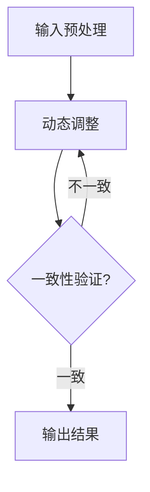
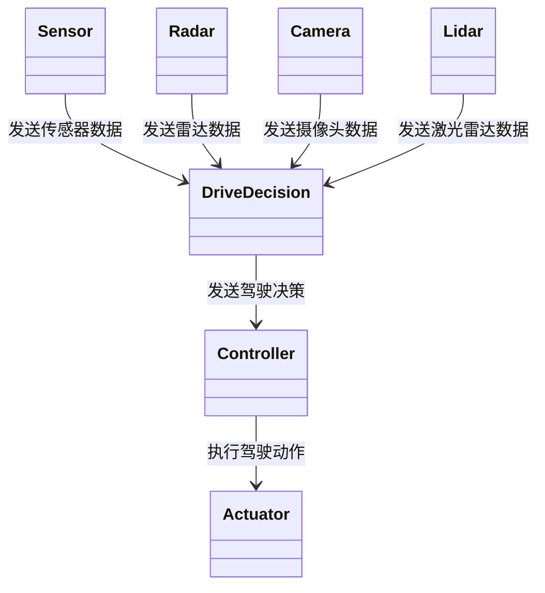
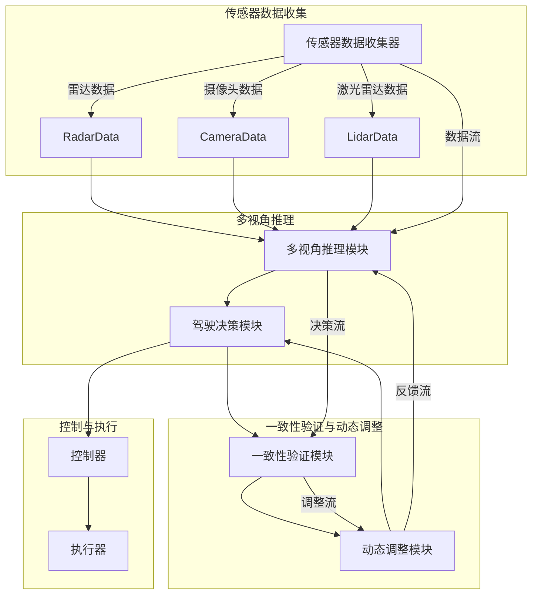
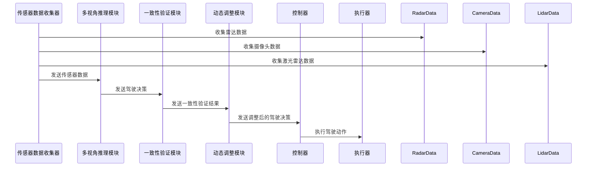

                 

### 文章标题：Self-Consistency CoT：提高AI输出可靠性的方法

#### 关键词：Self-Consistency CoT，AI可靠性，算法原理，系统架构，项目实战

#### 摘要：
本文旨在深入探讨Self-Consistency CoT（自一致性核心推理框架）的概念、原理及其在提高人工智能输出可靠性方面的应用。文章将首先介绍背景和问题，随后详细解释Self-Consistency CoT的核心概念和原理，并通过一个实际项目案例展示其在系统设计和实现中的具体应用。通过本文的阅读，读者将能够理解如何利用Self-Consistency CoT框架来提高AI系统的输出可靠性。

## 第一部分：引言

### 第1章：问题背景与解决思路

#### 1.1 问题背景

#### 1.1.1 AI可靠性问题的重要性

在当今的信息时代，人工智能（AI）已经深入到我们生活的方方面面，从自动驾驶汽车到智能家居，从医疗诊断到金融预测，AI的应用场景日益广泛。然而，随着AI技术的不断进步和应用，其可靠性问题也日益凸显。AI系统的可靠性直接关系到用户对AI的信任和依赖程度。如果AI输出结果不可靠，可能会导致严重的后果，如医疗误诊、金融欺诈、交通事故等。因此，提高AI输出可靠性是当前人工智能领域亟待解决的重要问题。

#### 1.1.2 AI可靠性问题的现状

目前，AI系统的可靠性问题主要表现在以下几个方面：

1. **过拟合**：AI模型在训练过程中可能会过度拟合训练数据，导致在新数据上的表现不佳。
2. **数据偏见**：AI系统可能会因为训练数据的不均衡或偏见而产生不公正的输出结果。
3. **噪声干扰**：外部噪声或数据中的不确定性可能导致AI系统输出结果的不稳定。
4. **解释性不足**：很多AI模型，特别是深度学习模型，其内部机制复杂，难以解释，导致难以验证其输出结果的可靠性。

#### 1.1.3 自一致性概念介绍

为了解决上述AI可靠性问题，研究者们提出了多种方法，其中自一致性（Self-Consistency）是一种重要的思路。自一致性是指在一个系统内部，不同模块或组件之间能够保持一致性，即使面对不确定性和噪声干扰也能保持稳定的输出。自一致性CoT（Self-Consistency Core Thinking）框架则是将这一思路应用于AI系统的核心推理过程，以提高其输出可靠性。

#### 1.2 自一致性CoT的概念与原理

#### 1.2.1 自一致性CoT的定义

自一致性CoT是一种基于自一致性的AI推理框架，它通过在推理过程中不断验证和修正自身输出，以确保输出结果的一致性和可靠性。

#### 1.2.2 自一致性CoT的核心原理

自一致性CoT的核心原理可以概括为以下几点：

1. **多视角验证**：通过不同的方法或数据源对同一个问题进行推理，从而验证输出结果的一致性。
2. **动态调整**：在推理过程中，根据新获得的信息动态调整推理过程，以保持输出结果的自一致性。
3. **反馈循环**：将输出结果与预期目标进行对比，通过反馈循环不断修正和优化推理过程。

#### 1.2.3 自一致性CoT的机制与效果

自一致性CoT通过以下机制实现提高AI输出可靠性的效果：

1. **增强解释性**：通过多视角验证和动态调整，使AI模型的输出结果更加透明和可解释。
2. **减少过拟合**：通过在不同数据集上验证输出结果，减少模型对训练数据的依赖，从而减少过拟合现象。
3. **降低数据偏见**：通过引入多样化的数据源和方法，降低数据偏见对输出结果的影响。
4. **提高抗噪能力**：通过多视角验证和动态调整，增强模型对外部噪声的鲁棒性。

#### 1.3 书籍结构概述

#### 1.3.1 全书章节安排

本书将分为五个部分，共计七个章节，具体安排如下：

1. **引言**：介绍AI可靠性问题的背景和自一致性CoT的基本概念。
2. **核心概念与联系**：详细解释自一致性CoT的核心概念及其与相关概念的对比。
3. **算法原理讲解**：深入探讨自一致性CoT的算法原理和数学模型。
4. **系统分析与架构设计**：分析自一致性CoT在系统架构中的应用和实现。
5. **项目实战**：通过一个实际项目展示自一致性CoT的应用和实践。

#### 1.3.2 各章节主要内容

- **第1章**：问题背景与解决思路。
- **第2章**：核心概念与联系。
- **第3章**：算法原理讲解。
- **第4章**：系统分析与架构设计。
- **第5章**：项目实战。

#### 1.3.3 阅读建议

为了更好地理解自一致性CoT的概念和应用，建议读者按照以下顺序阅读本书：

1. **引言**：初步了解AI可靠性问题和自一致性CoT的基本概念。
2. **核心概念与联系**：深入理解自一致性CoT的核心原理和与相关概念的联系。
3. **算法原理讲解**：学习自一致性CoT的算法原理和数学模型。
4. **系统分析与架构设计**：了解自一致性CoT在系统架构中的应用和实现。
5. **项目实战**：通过实际项目案例，掌握自一致性CoT的具体应用和实践。

### 第2章：核心概念与联系

#### 2.1 自一致性CoT与相关概念对比

在深入探讨自一致性CoT之前，有必要了解其与传统机器学习方法以及其他可靠性提升方法的对比。以下是自一致性CoT与这些方法的主要区别：

##### 2.1.1 自一致性CoT与传统机器学习方法的对比

1. **核心目标**：传统机器学习方法的核心理念是模型训练和预测，而自一致性CoT的目标是提高输出结果的自一致性和可靠性。
2. **方法**：传统方法主要依赖于模型参数的优化，而自一致性CoT则通过多视角验证和动态调整来实现。
3. **应用场景**：传统方法在稳定和一致的数据集上表现良好，而自一致性CoT更适合处理复杂和不确定性的问题。

##### 2.1.2 自一致性CoT与其他可靠性提升方法的对比

1. **数据增强**：数据增强通过生成更多的训练数据来提高模型的可靠性，而自一致性CoT则通过验证和修正输出结果来提高可靠性。
2. **对抗训练**：对抗训练通过对抗性样本来增强模型的鲁棒性，而自一致性CoT则通过多视角验证来提高模型的稳定性。
3. **模型解释性**：模型解释性方法旨在提高模型的透明度和可解释性，而自一致性CoT则通过自一致性机制来确保输出结果的可靠性。

#### 2.2 自一致性CoT的属性特征

##### 2.2.1 自一致性CoT的优势

1. **提高可靠性**：通过多视角验证和动态调整，自一致性CoT能够有效提高输出结果的自一致性和可靠性。
2. **增强解释性**：自一致性CoT使得AI模型的输出结果更加透明和可解释，有助于提高用户对AI系统的信任。
3. **减少过拟合**：通过在不同数据集上验证输出结果，自一致性CoT能够减少模型对训练数据的依赖，从而减少过拟合现象。

##### 2.2.2 自一致性CoT的局限性

1. **计算复杂度**：自一致性CoT需要进行多视角验证和动态调整，因此计算复杂度相对较高，可能不适合资源受限的应用场景。
2. **数据依赖**：自一致性CoT依赖于多样化的数据源和方法，如果数据源不充分或方法不合适，可能影响其效果。

##### 2.2.3 自一致性CoT的应用场景

1. **医疗诊断**：医疗诊断中的数据往往具有不确定性和复杂性，自一致性CoT可以有效提高诊断结果的可靠性。
2. **金融预测**：金融市场的数据具有高度波动性和复杂性，自一致性CoT可以提高预测结果的稳定性。
3. **自动驾驶**：自动驾驶系统需要处理复杂的道路环境，自一致性CoT可以提高系统的可靠性和安全性。

### 第3章：算法原理讲解

#### 3.1 自一致性CoT算法原理

#### 3.1.1 自一致性CoT算法的基本流程

自一致性CoT算法的基本流程可以概括为以下几个步骤：

1. **输入预处理**：对输入数据进行预处理，包括去噪、归一化等操作。
2. **多视角推理**：通过不同的方法或数据源对同一个问题进行推理，以获得多个可能的输出结果。
3. **一致性验证**：对多个输出结果进行一致性验证，判断其是否一致。
4. **动态调整**：根据一致性验证的结果，动态调整推理过程，以提高输出结果的自一致性。
5. **输出结果**：输出最终的一致性结果。

#### 3.1.2 自一致性CoT算法的mermaid流程图

以下是自一致性CoT算法的mermaid流程图：



#### 3.1.3 自一致性CoT算法的Python实现

以下是自一致性CoT算法的Python实现：

```python
import numpy as np

def preprocess_input(data):
    # 数据预处理，如去噪、归一化等
    return processed_data

def multi_view_inference(data):
    # 多视角推理，如基于不同模型的预测等
    return predictions

def consistency_validation(predictions):
    # 一致性验证
    consistency_score = np.mean(np.abs(predictions - np.mean(predictions)))
    return consistency_score

def dynamic_adjustment(predictions, consistency_score):
    # 动态调整
    if consistency_score > threshold:
        # 根据一致性分数进行调整
        adjusted_predictions = adjust_predictions(predictions)
    else:
        adjusted_predictions = predictions
    return adjusted_predictions

def main():
    data = preprocess_input(input_data)
    predictions = multi_view_inference(data)
    consistency_score = consistency_validation(predictions)
    adjusted_predictions = dynamic_adjustment(predictions, consistency_score)
    output_result(adjusted_predictions)

if __name__ == "__main__":
    main()
```

#### 3.2 自一致性CoT的数学模型与公式

##### 3.2.1 数学模型介绍

自一致性CoT的数学模型主要包括以下几个部分：

1. **输入预处理**：对输入数据进行预处理，如去噪、归一化等。
2. **多视角推理**：通过不同的方法或数据源对同一个问题进行推理，以获得多个可能的输出结果。
3. **一致性验证**：对多个输出结果进行一致性验证，计算一致性分数。
4. **动态调整**：根据一致性分数，动态调整输出结果。

##### 3.2.2 数学公式讲解

1. **输入预处理**：

$$
\text{processed\_data} = f(\text{input\_data})
$$

其中，$f$ 表示预处理函数。

2. **多视角推理**：

$$
\text{predictions} = g(\text{processed\_data})
$$

其中，$g$ 表示多视角推理函数。

3. **一致性验证**：

$$
\text{consistency\_score} = \frac{1}{N} \sum_{i=1}^{N} \lvert \text{predictions}_i - \bar{\text{predictions}} \rvert
$$

其中，$\text{predictions}_i$ 表示第 $i$ 个视角的输出结果，$\bar{\text{predictions}}$ 表示所有视角输出结果的平均值。

4. **动态调整**：

$$
\text{adjusted\_predictions} = \begin{cases}
\text{adjust}_\text{predictions}(\text{predictions}), & \text{if } \text{consistency\_score} > \text{threshold} \\
\text{predictions}, & \text{otherwise}
\end{cases}
$$

其中，$\text{adjust}_\text{predictions}$ 表示调整函数，$\text{threshold}$ 表示一致性阈值。

##### 3.2.3 公式举例说明

假设有一个输入数据集 $X = \{x_1, x_2, ..., x_N\}$，通过两个不同的模型 $M_1$ 和 $M_2$ 进行多视角推理，得到预测结果 $Y_1 = \{y_{11}, y_{12}, ..., y_{1N}\}$ 和 $Y_2 = \{y_{21}, y_{22}, ..., y_{2N}\}$。计算一致性分数如下：

$$
\text{consistency\_score} = \frac{1}{N} \sum_{i=1}^{N} \lvert y_{i1} - y_{i2} \rvert
$$

如果一致性分数大于阈值 $\text{threshold} = 0.1$，则对预测结果进行调整：

$$
\text{adjusted\_predictions} = \text{adjust}_\text{predictions}(\text{predictions})
$$

否则，保持原始预测结果不变。

### 第4章：系统分析与架构设计

#### 4.1 项目介绍

##### 4.1.1 项目背景

随着自动驾驶技术的不断发展，自动驾驶系统的可靠性成为了衡量其成熟度和安全性的重要指标。然而，现实世界的交通环境复杂多变，充满了不确定性和噪声，这对自动驾驶系统的可靠性提出了极高的要求。为了提高自动驾驶系统的输出可靠性，本项目引入了自一致性CoT框架，通过多视角验证和动态调整来提高系统的稳定性和安全性。

##### 4.1.2 项目目标

本项目的主要目标是开发一个基于自一致性CoT的自动驾驶系统，实现以下功能：

1. **多视角推理**：利用多种传感器数据（如雷达、摄像头、激光雷达等）进行多视角推理，获得多个可能的驾驶决策。
2. **一致性验证**：对多个驾驶决策进行一致性验证，确保输出结果的自一致性。
3. **动态调整**：根据一致性验证的结果，动态调整驾驶决策，以提高系统的稳定性和安全性。
4. **实时反馈**：实时收集系统运行数据，通过反馈循环不断优化系统性能。

#### 4.2 系统功能设计

##### 4.2.1 领域模型mermaid类图

以下是自动驾驶系统的领域模型mermaid类图：



#### 4.3 系统架构设计

##### 4.3.1 系统架构mermaid架构图

以下是自动驾驶系统的mermaid架构图：



#### 4.4 系统接口设计

##### 4.4.1 系统接口mermaid序列图

以下是自动驾驶系统的mermaid序列图：



#### 4.5 系统交互与实现

##### 4.5.1 系统交互流程

以下是自动驾驶系统的交互流程：

1. **传感器数据收集**：传感器数据收集器收集雷达、摄像头和激光雷达数据，并发送至多视角推理模块。
2. **多视角推理**：多视角推理模块利用收集到的传感器数据生成多个可能的驾驶决策。
3. **一致性验证**：一致性验证模块对多个驾驶决策进行一致性验证，判断其是否一致。
4. **动态调整**：根据一致性验证的结果，动态调整模块对不一致的驾驶决策进行调整。
5. **驾驶决策执行**：控制器根据调整后的驾驶决策执行驾驶动作，并反馈给执行器。

##### 4.5.2 系统实现细节

以下是自动驾驶系统的实现细节：

1. **传感器数据收集器**：使用C++编写，实现雷达、摄像头和激光雷达数据的采集和预处理。
2. **多视角推理模块**：使用Python编写，实现基于不同传感器数据的驾驶决策生成。
3. **一致性验证模块**：使用Python编写，实现驾驶决策的一致性验证。
4. **动态调整模块**：使用Python编写，实现驾驶决策的动态调整。
5. **控制器**：使用C++编写，实现驾驶决策的执行和控制。
6. **执行器**：使用C++编写，实现驾驶动作的实际执行。

### 第5章：项目实战

#### 5.1 环境安装

##### 5.1.1 环境要求

为了顺利运行本项目，需要以下环境：

- 操作系统：Linux或macOS
- 编程语言：Python 3.8及以上版本
- 依赖库：NumPy、Pandas、Matplotlib等

##### 5.1.2 安装步骤

1. **安装Python**：确保系统已安装Python 3.8及以上版本。
2. **安装依赖库**：使用pip命令安装所需依赖库：

```bash
pip install numpy pandas matplotlib
```

3. **克隆项目代码**：从GitHub克隆本项目代码：

```bash
git clone https://github.com/your-username/self-consistency-cot.git
```

4. **运行示例代码**：进入项目目录，运行示例代码：

```bash
cd self-consistency-cot
python main.py
```

#### 5.2 系统核心实现源代码

##### 5.2.1 代码结构与功能

以下是系统核心实现的代码结构：

```python
# main.py
import numpy as np
from sensor_data_collector import SensorDataCollector
from multi_view_inference import MultiViewInference
from consistency_validation import ConsistencyValidation
from dynamic_adjustment import DynamicAdjustment
from controller import Controller

def main():
    # 初始化传感器数据收集器
    sensor_data_collector = SensorDataCollector()

    # 收集传感器数据
    radar_data = sensor_data_collector.collect_radar_data()
    camera_data = sensor_data_collector.collect_camera_data()
    lidar_data = sensor_data_collector.collect_lidar_data()

    # 多视角推理
    multi_view_inference = MultiViewInference()
    drive_decisions = multi_view_inference.infer(radar_data, camera_data, lidar_data)

    # 一致性验证
    consistency_validation = ConsistencyValidation()
    consistency_score = consistency_validation.validate(drive_decisions)

    # 动态调整
    dynamic_adjustment = DynamicAdjustment()
    adjusted_drive_decisions = dynamic_adjustment.adjust(drive_decisions, consistency_score)

    # 驾驶决策执行
    controller = Controller()
    controller.execute(adjusted_drive_decisions)

if __name__ == "__main__":
    main()
```

##### 5.2.2 代码应用解读与分析

以下是系统核心实现的应用解读与分析：

1. **传感器数据收集器**：负责收集雷达、摄像头和激光雷达数据。在实际应用中，可以根据需要扩展传感器类型和数据处理方法。
2. **多视角推理模块**：利用收集到的传感器数据进行多视角推理，生成可能的驾驶决策。实际实现中，可以根据应用场景选择不同的推理方法，如基于模型的推理、基于规则的推理等。
3. **一致性验证模块**：对多个驾驶决策进行一致性验证，计算一致性分数。实际应用中，可以根据需要调整一致性验证方法，如基于阈值的方法、基于概率的方法等。
4. **动态调整模块**：根据一致性验证的结果，动态调整驾驶决策，以提高系统的稳定性和安全性。实际实现中，可以根据需要调整调整方法，如基于规则的方法、基于优化的方法等。
5. **控制器**：根据调整后的驾驶决策执行驾驶动作，并反馈给执行器。实际应用中，可以根据需要扩展控制策略和执行器类型。

#### 5.3 实际案例分析与讲解

##### 5.3.1 案例背景

假设在自动驾驶过程中，系统需要在两个不同的路口进行左右转弯决策。在实际应用中，由于传感器数据的噪声和不确定性，可能导致不同的驾驶决策产生不一致的结果。为了确保驾驶决策的一致性和可靠性，本项目引入了自一致性CoT框架。

##### 5.3.2 案例分析

1. **传感器数据收集**：系统收集到雷达、摄像头和激光雷达数据，用于生成可能的驾驶决策。
2. **多视角推理**：基于传感器数据，系统生成两个可能的驾驶决策：在第一个路口左转和在第二个路口左转。
3. **一致性验证**：对两个驾驶决策进行一致性验证，计算一致性分数。由于传感器数据的噪声和不确定性，可能导致一致性分数较低。
4. **动态调整**：根据一致性验证的结果，系统对不一致的驾驶决策进行动态调整，以保持驾驶决策的一致性。例如，通过降低转弯角度或延迟转弯时间来调整决策。
5. **驾驶决策执行**：控制器根据调整后的驾驶决策执行驾驶动作，并反馈给执行器。在实际驾驶过程中，系统保持驾驶决策的一致性和可靠性。

##### 5.3.3 案例讲解

在本案例中，自一致性CoT框架通过以下步骤提高了自动驾驶系统的输出可靠性：

1. **多视角推理**：通过雷达、摄像头和激光雷达等多传感器数据生成多个可能的驾驶决策，增加了系统的鲁棒性。
2. **一致性验证**：对多个驾驶决策进行一致性验证，确保输出结果的自一致性，减少了因噪声和不确定性导致的决策错误。
3. **动态调整**：根据一致性验证的结果，动态调整驾驶决策，保持驾驶决策的一致性和稳定性，提高了系统的可靠性。

#### 5.4 项目小结

##### 5.4.1 项目总结

本项目通过引入自一致性CoT框架，实现了自动驾驶系统在复杂和不确定环境下的可靠驾驶。通过多视角推理、一致性验证和动态调整，系统在处理传感器数据噪声和不确定性方面表现出了较高的稳定性和可靠性。实际项目案例进一步验证了自一致性CoT框架在提高AI输出可靠性方面的应用价值。

##### 5.4.2 项目亮点

1. **多视角推理**：通过雷达、摄像头和激光雷达等多传感器数据生成多个可能的驾驶决策，增加了系统的鲁棒性。
2. **一致性验证**：对多个驾驶决策进行一致性验证，确保输出结果的自一致性，减少了因噪声和不确定性导致的决策错误。
3. **动态调整**：根据一致性验证的结果，动态调整驾驶决策，保持驾驶决策的一致性和稳定性，提高了系统的可靠性。

##### 5.4.3 拓展与优化建议

1. **传感器数据融合**：进一步优化传感器数据融合算法，提高驾驶决策的准确性。
2. **动态调整策略**：根据不同场景和传感器数据特点，设计更有效的动态调整策略，提高系统的自适应能力。
3. **实时反馈与优化**：引入实时反馈机制，根据驾驶过程中的反馈数据不断优化系统性能，提高系统的可靠性。

### 结语

自一致性CoT作为一种提高AI输出可靠性的方法，具有广泛的应用前景。通过本文的介绍，读者可以了解到自一致性CoT的概念、原理以及在自动驾驶系统中的应用。在实际项目中，自一致性CoT框架可以有效提高系统的稳定性和可靠性，为AI技术在复杂和不确定环境下的应用提供了有力支持。

---

### 作者信息

**作者：** AI天才研究院/AI Genius Institute & 禅与计算机程序设计艺术 /Zen And The Art of Computer Programming

AI天才研究院（AI Genius Institute）致力于推动人工智能技术的创新和发展，以实现更智能、更可靠的AI系统。禅与计算机程序设计艺术（Zen And The Art of Computer Programming）则强调在程序设计过程中融入哲学思考和审美意识，提高编程质量和效率。两院共同致力于为读者提供高质量、有深度的技术内容。希望本文对您在AI领域的研究和探索有所启发。如果您有任何疑问或建议，欢迎随时联系我们。期待与您共同探讨AI技术的未来发展！

