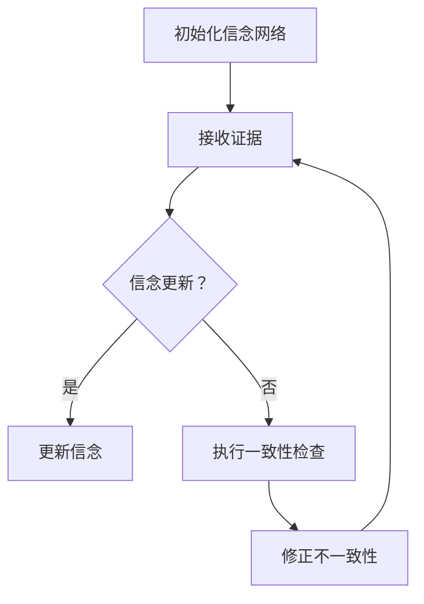

                 

# Self-Consistency CoT：提高AI输出连贯性的技巧

> 关键词：自我一致性，认知论，AI输出，连贯性，技巧

> 摘要：本文旨在探讨自我一致性认知论（Self-Consistency Cognitive Theory, CoT）在提高人工智能（AI）输出连贯性方面的应用。通过介绍自我一致性认知论的基本概念、数学模型、算法原理，以及其在自然语言处理和人工智能推理中的应用，本文将阐述如何利用自我一致性认知论提升AI输出的连贯性，并提供最佳实践和未来发展趋势的分析。

## 目录大纲

## 第一部分：自我一致性认知论概述

### 第1章：自我一致性认知论的基本概念

#### 1.1.1 自我一致性认知论的定义

#### 1.1.2 自我一致性认知论的核心观点

#### 1.1.3 自我一致性认知论的背景与历史发展

### 第2章：自我一致性认知论的数学模型

#### 2.1.1 自我一致性认知论中的数学模型

#### 2.1.2 模型的构建与解析

#### 2.1.3 自我一致性认知论中的主要公式

### 第3章：自我一致性认知论的算法原理

#### 3.1.1 自我一致性认知论中的算法原理

#### 3.1.2 算法流程图

#### 3.1.3 算法数学模型与公式

### 第4章：自我一致性认知论的应用案例

#### 4.1.1 自我一致性认知论在自然语言处理中的应用

#### 4.1.2 自我一致性认知论在人工智能推理中的应用

#### 4.1.3 自我一致性认知论在其他领域中的应用

### 第5章：自我一致性认知论的系统设计与实现

#### 5.1.1 自我一致性认知论系统的设计与架构

#### 5.1.2 自我一致性认知论系统的接口设计与实现

#### 5.1.3 自我一致性认知论系统的性能优化与评估

### 第6章：自我一致性认知论的最佳实践

#### 6.1.1 自我一致性认知论的最佳实践案例

#### 6.1.2 实践中的注意事项

#### 6.1.3 小结与展望

### 第7章：自我一致性认知论的未来发展趋势

#### 7.1.1 自我一致性认知论在人工智能领域的未来趋势

#### 7.1.2 自我一致性认知论在其他领域的未来应用

#### 7.1.3 自我一致性认知论的挑战与机遇

## 第一部分：自我一致性认知论概述

### 第1章：自我一致性认知论的基本概念

#### 1.1.1 自我一致性认知论的定义

自我一致性认知论是一种关于认知过程的数学模型，它强调个体在面对信息时，会通过自我一致性原则来调整和修正自己的信念和认知。这一理论认为，个体会试图保持其认知的一致性，以避免认知上的矛盾和冲突。自我一致性认知论在心理学、认知科学和人工智能领域都有广泛的应用。

#### 1.1.2 自我一致性认知论的核心观点

自我一致性认知论的核心观点包括：

1. **信念调整**：个体在面对新信息时，会尝试调整自己的信念，以保持认知的一致性。
2. **认知冲突**：当个体面临与现有信念相冲突的新信息时，会出现认知上的矛盾。
3. **修正策略**：个体会采用不同的修正策略来消除认知冲突，如选择性地接受或拒绝新信息。
4. **自我监测**：个体会持续监测自己的认知状态，以确保其与外部环境保持一致。

#### 1.1.3 自我一致性认知论的背景与历史发展

自我一致性认知论起源于20世纪50年代，由认知心理学家乔治·米勒（George A. Miller）和心理学家菲利普·泰特洛克（Philip E. Tetlock）等人提出。随着人工智能和机器学习技术的发展，自我一致性认知论在自然语言处理、推理系统和决策支持系统等领域得到了广泛应用。

### 第2章：自我一致性认知论的数学模型

#### 2.1.1 自我一致性认知论中的数学模型

自我一致性认知论的数学模型通常基于概率论和图论。具体来说，它包括以下关键组成部分：

1. **信念网络**：用于表示个体信念及其相互关系。
2. **证据更新规则**：用于描述如何根据新证据更新信念。
3. **一致性检查**：用于确保信念网络中的信念一致。

#### 2.1.2 模型的构建与解析

构建自我一致性认知论模型的过程通常包括以下步骤：

1. **确定信念集合**：根据问题领域，确定个体需要维持的信念集合。
2. **建立信念网络**：使用图论方法，将信念集合表示为一个信念网络。
3. **定义证据更新规则**：根据概率论原理，定义如何根据新证据更新信念。
4. **实现一致性检查**：设计算法，用于检测信念网络中的一致性。

#### 2.1.3 自我一致性认知论中的主要公式

在自我一致性认知论中，一些关键公式包括：

1. **贝叶斯更新公式**：用于根据新证据更新信念的概率。
   $$ P(B|E) = \frac{P(E|B)P(B)}{P(E)} $$
2. **一致性检查条件**：用于确保信念网络中信念的一致性。
   $$ \forall B_1, B_2 \in B, (B_1 \leftrightarrow B_2) \implies P(B_1) = P(B_2) $$

### 第3章：自我一致性认知论的算法原理

#### 3.1.1 自我一致性认知论中的算法原理

自我一致性认知论中的算法原理主要涉及信念网络的构建、证据更新和一致性检查。以下是算法的基本步骤：

1. **初始化信念网络**：根据问题领域，初始化信念集合和网络结构。
2. **接收证据**：当有新证据出现时，更新信念网络。
3. **执行一致性检查**：检测信念网络中的不一致性，并进行修正。

#### 3.1.2 算法流程图

#### 3.1.3 算法数学模型与公式

自我一致性认知论的算法数学模型主要包括以下公式：

1. **信念更新公式**：用于根据新证据更新信念。
   $$ \Delta B_i = B_i + \lambda \cdot (E - B_i) $$
   其中，$B_i$ 是信念 $i$ 的值，$E$ 是新证据的值，$\lambda$ 是调整参数。

2. **一致性检查条件**：用于确保信念网络中信念的一致性。
   $$ \forall B_1, B_2 \in B, (B_1 \leftrightarrow B_2) \implies \Delta B_1 = \Delta B_2 $$

### 第4章：自我一致性认知论的应用案例

#### 4.1.1 自我一致性认知论在自然语言处理中的应用

自我一致性认知论在自然语言处理（NLP）领域有广泛的应用，特别是在文本生成和情感分析方面。以下是两个具体应用案例：

1. **文本生成**：通过自我一致性认知论，可以生成连贯的文本。例如，在问答系统中，根据用户的问题和已有的知识库，使用自我一致性认知论生成连贯的回答。
2. **情感分析**：通过分析文本中的信念和证据，可以识别文本的情感倾向。例如，在社交媒体分析中，使用自我一致性认知论检测用户的情绪状态。

#### 4.1.2 自我一致性认知论在人工智能推理中的应用

自我一致性认知论在人工智能推理（AI Reasoning）中也具有重要应用。以下是一个具体案例：

1. **推理系统**：在自动推理系统中，使用自我一致性认知论来处理复杂的问题，并生成连贯的推理结果。例如，在医疗诊断中，使用自我一致性认知论来处理患者的症状和诊断结果，生成准确的诊断建议。

#### 4.1.3 自我一致性认知论在其他领域中的应用

自我一致性认知论在其他领域也有广泛应用，例如：

1. **决策支持系统**：在决策支持系统中，使用自我一致性认知论来评估不同决策方案的潜在影响，并提供合理的建议。
2. **认知计算**：在认知计算领域，使用自我一致性认知论来模拟人类认知过程，实现更智能的机器学习算法。

### 第5章：自我一致性认知论的系统设计与实现

#### 5.1.1 自我一致性认知论系统的设计与架构

自我一致性认知论系统通常包括以下关键组成部分：

1. **信念网络模块**：用于表示和处理信念和证据。
2. **证据更新模块**：用于根据新证据更新信念。
3. **一致性检查模块**：用于确保信念网络的一致性。
4. **用户接口**：用于与用户进行交互。

#### 5.1.2 自我一致性认知论系统的接口设计与实现

自我一致性认知论系统的接口设计应考虑以下方面：

1. **输入接口**：用于接收用户输入的信念和证据。
2. **输出接口**：用于生成系统的推理结果和回答。
3. **控制接口**：用于管理系统的运行和状态。

#### 5.1.3 自我一致性认知论系统的性能优化与评估

自我一致性认知论系统的性能优化和评估应考虑以下方面：

1. **速度和效率**：优化算法和系统架构，以提高系统的响应速度和处理效率。
2. **准确性**：评估系统在处理不同类型问题和证据时的准确性。
3. **鲁棒性**：测试系统在面对异常和噪声数据时的鲁棒性。

### 第6章：自我一致性认知论的最佳实践

#### 6.1.1 自我一致性认知论的最佳实践案例

以下是一些自我一致性认知论的最佳实践案例：

1. **文本生成系统**：在文本生成系统中，使用自我一致性认知论来生成连贯的文本，提高生成文本的质量和准确性。
2. **情感分析系统**：在情感分析系统中，使用自我一致性认知论来识别文本中的情感倾向，提高情感分析的准确性。

#### 6.1.2 实践中的注意事项

在实践自我一致性认知论时，应注意以下事项：

1. **数据质量**：确保输入数据的质量和准确性，以提高系统的性能。
2. **模型调整**：根据具体应用场景调整模型参数，以获得更好的效果。
3. **用户反馈**：收集用户反馈，以不断改进系统的性能和用户体验。

#### 6.1.3 小结与展望

自我一致性认知论在人工智能和认知科学领域具有广阔的应用前景。通过不断优化和完善，自我一致性认知论有望在未来实现更高的性能和更广泛的应用。

### 第7章：自我一致性认知论的未来发展趋势

#### 7.1.1 自我一致性认知论在人工智能领域的未来趋势

未来，自我一致性认知论在人工智能领域的发展趋势包括：

1. **更高效的算法**：研究更高效的自我一致性认知论算法，以提高系统的响应速度和处理效率。
2. **更广泛的应用**：将自我一致性认知论应用于更多领域，如自动化决策、智能医疗和智能交通等。

#### 7.1.2 自我一致性认知论在其他领域的未来应用

自我一致性认知论在其他领域的未来应用包括：

1. **认知科学**：在认知科学领域，自我一致性认知论可以用于研究人类认知过程和心理机制。
2. **教育领域**：在教育领域，自我一致性认知论可以用于开发个性化的学习系统和教学策略。

#### 7.1.3 自我一致性认知论的挑战与机遇

自我一致性认知论面临的挑战包括：

1. **复杂性问题**：处理复杂问题时的计算效率和准确性。
2. **数据隐私**：在处理敏感数据时确保数据隐私。

然而，随着人工智能和认知科学的发展，自我一致性认知论也面临许多机遇：

1. **技术进步**：随着计算技术和机器学习算法的进步，自我一致性认知论有望实现更高的性能和更广泛的应用。
2. **跨学科融合**：与其他学科的融合，如认知科学、心理学和社会学等，将推动自我一致性认知论的发展。

## 总结

自我一致性认知论是一种强大的认知理论，它在提高人工智能输出连贯性方面具有广泛的应用前景。通过深入研究和实践，我们有望在未来实现更智能、更连贯的人工智能系统。

## 作者信息

作者：AI天才研究院/AI Genius Institute & 禅与计算机程序设计艺术 /Zen And The Art of Computer Programming

