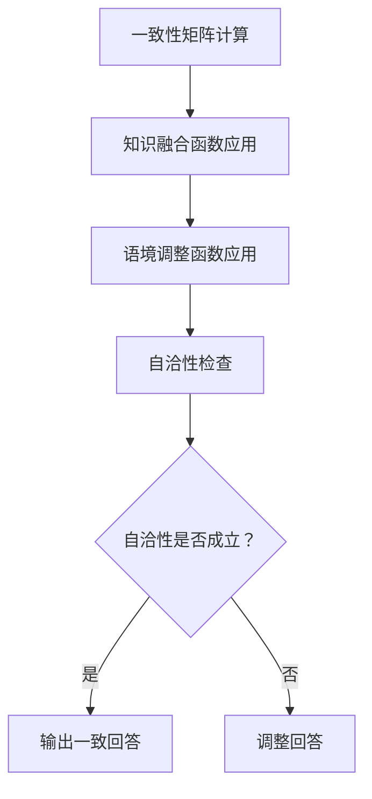
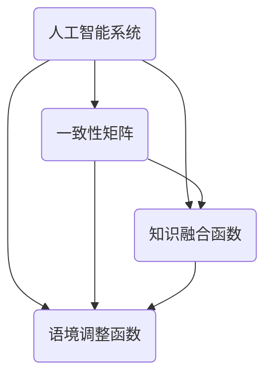
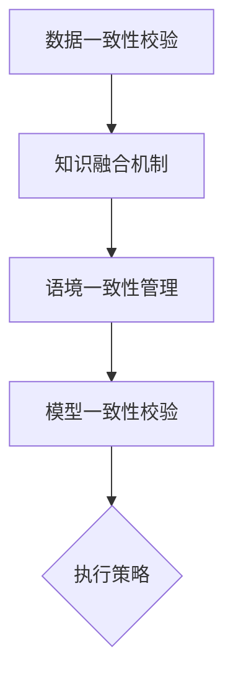
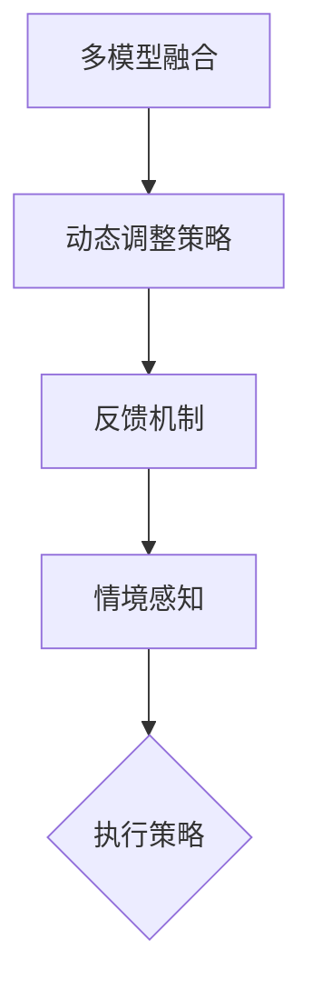
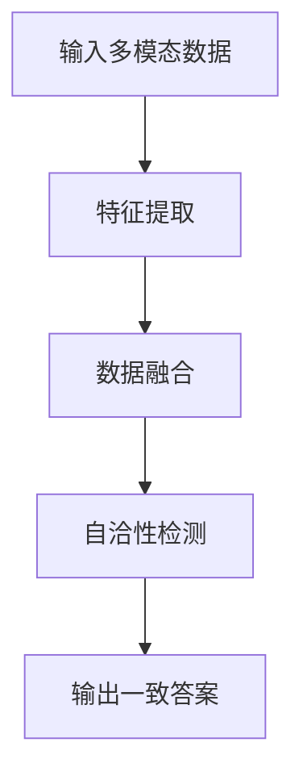
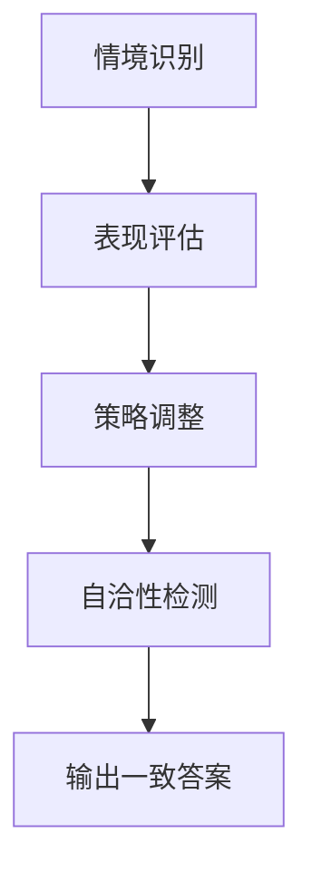
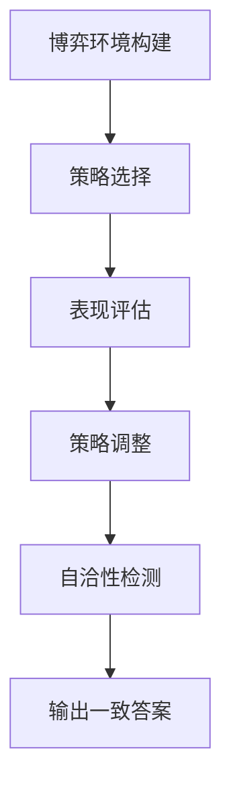
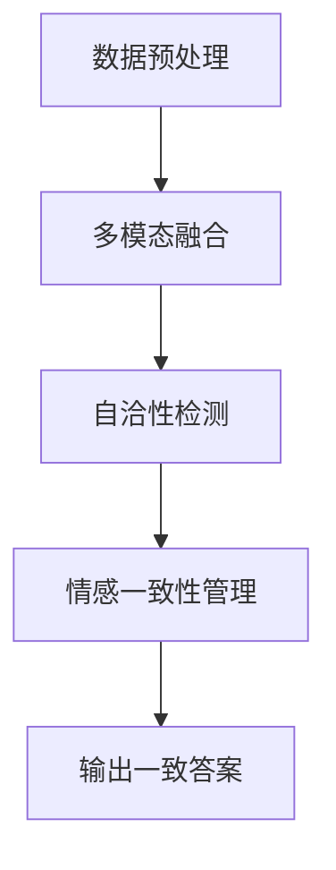
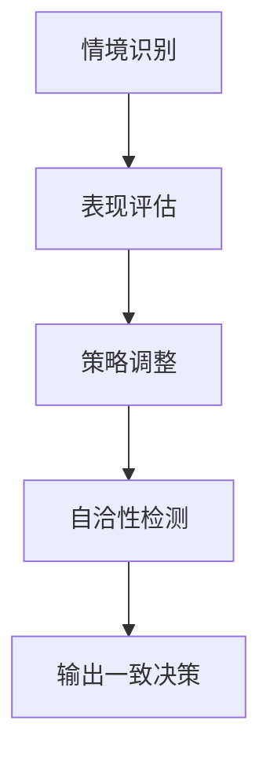
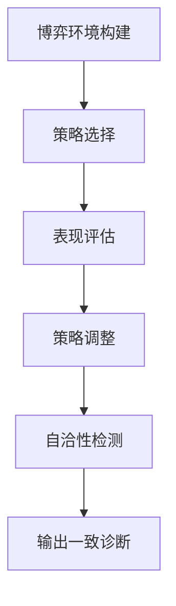

                 

### 自洽性CoT：确保AI回答一致性的策略创新

#### 关键词

- 自洽性CoT
- AI回答一致性
- 策略创新
- 数学模型
- 算法原理
- 实践应用

#### 摘要

本文深入探讨自洽性CoT（Self-Consistency Cognitive Theory），旨在提出确保AI回答一致性的策略创新。自洽性CoT作为一种新的AI认知理论，通过数学模型和算法原理，确保AI在复杂动态环境中提供一致、可信的回答。本文分为六个主要部分：第一部分介绍自洽性CoT的基础概念和重要性；第二部分解析自洽性原理及其在AI中的应用；第三部分讨论确保AI答案一致性的基本策略和高级策略；第四部分介绍自洽性CoT的创新实践；第五部分通过具体应用案例展示策略的实际效果；第六部分展望自洽性CoT的未来发展趋势和面临的挑战。本文旨在为AI领域的研究者和从业者提供有价值的参考。

---

#### 引言

自洽性CoT（Self-Consistency Cognitive Theory）是一种新兴的AI认知理论，强调在AI系统中建立自洽性机制，确保AI在不同情境下提供一致、可信的回答。随着AI技术的飞速发展，AI在多个领域得到了广泛应用，例如自然语言处理、图像识别、自动驾驶等。然而，AI系统的一致性问题日益突出，不同情境下AI的回答往往不一致，导致用户体验下降，影响AI系统的信任度和可靠性。

本文旨在解决AI回答一致性问题，提出自洽性CoT的理论框架和策略创新。通过分析自洽性原理，设计有效的自洽性机制，我们将展示如何在AI系统中确保一致性和可信性。文章分为六个部分：

1. **自洽性CoT的基础**：介绍自洽性CoT的核心概念、重要性及其在AI中的应用。
2. **自洽性原理解析**：探讨自洽性原理的数学模型及其在AI中的应用。
3. **确保AI答案一致性的策略**：讨论基本策略和高级策略，并使用Mermaid流程图进行详细说明。
4. **自洽性CoT的创新实践**：介绍三种创新实践，并使用Mermaid流程图进行说明。
5. **自洽性CoT的应用案例**：通过具体应用案例展示策略的实际效果。
6. **未来展望**：分析自洽性CoT的发展趋势和面临的挑战。

通过本文的探讨，我们希望为AI领域的研究者和从业者提供有价值的参考，推动自洽性CoT在实际应用中的发展和完善。

---

### 自洽性CoT的基础

#### 问题背景与核心概念

自洽性CoT（Self-Consistency Cognitive Theory）是一种新兴的AI认知理论，旨在解决AI系统在不同情境下回答不一致的问题。背景起源于AI技术在多个领域（如自然语言处理、图像识别、自动驾驶等）的广泛应用，这些应用场景要求AI系统能够提供一致、可信的回答。然而，传统AI系统往往缺乏自洽性机制，导致在复杂动态环境中无法保证回答的一致性。

自洽性CoT的核心概念是“自洽性”（Self-Consistency），它指的是AI系统在处理信息时能够保持内部一致性，即在不同情境下给出的回答保持一致。自洽性不仅包括逻辑一致性，还涉及知识一致性、语境一致性和情感一致性等方面。

#### 问题描述

在现实生活中，AI系统的一致性问题表现为以下几个方面：

1. **逻辑不一致**：AI系统在不同情境下给出相互矛盾的回答。
2. **知识不一致**：AI系统在处理同一问题时，基于不同知识源给出的回答不一致。
3. **语境不一致**：AI系统在对话过程中，无法保持语境一致性，导致对话中断或混乱。
4. **情感不一致**：AI系统在处理情感相关问题时，无法保持情感一致性，导致用户体验不佳。

#### 问题解决

自洽性CoT提供了一种解决方案，通过建立自洽性机制，确保AI系统在不同情境下提供一致、可信的回答。具体方法包括：

1. **自洽性原理**：基于数学模型和算法原理，确保AI系统在处理信息时保持内部一致性。
2. **自洽性机制**：设计有效的自洽性机制，如一致性检查、知识融合和语境管理等。
3. **自洽性训练**：通过大量训练数据，使AI系统学会在不同情境下保持自洽性。

#### 边界与外延

自洽性CoT的边界主要涉及以下几个方面：

1. **应用领域**：自洽性CoT适用于需要高一致性和可信性的AI系统，如智能客服、智能助手和自动驾驶等。
2. **技术范畴**：自洽性CoT涉及自然语言处理、知识图谱、机器学习等多个技术领域。
3. **伦理道德**：在应用自洽性CoT时，需考虑AI系统的伦理道德问题，确保回答符合伦理规范。

#### 概念结构与组成部分

自洽性CoT的基本概念结构包括以下几个部分：

1. **自洽性原理**：基于数学模型和算法原理，确保AI系统在处理信息时保持内部一致性。
2. **自洽性机制**：包括一致性检查、知识融合和语境管理等功能，确保AI系统在不同情境下保持自洽性。
3. **自洽性训练**：通过大量训练数据，使AI系统学会在不同情境下保持自洽性。

#### 自洽性原理的数学模型

自洽性原理的数学模型主要涉及以下几个方面：

1. **一致性矩阵**：表示AI系统在不同情境下的回答一致性。
2. **知识融合函数**：用于整合不同知识源，确保回答的一致性。
3. **语境调整函数**：根据对话语境调整AI系统的回答，确保语境一致性。

#### 自洽性特征的对比表格

| 自洽性特征         | 描述                                                         | 对比表格中的值 |
|-------------------|--------------------------------------------------------------|----------------|
| 逻辑一致性         | AI系统在不同情境下给出的回答不矛盾。                         | 1              |
| 知识一致性         | AI系统在不同情境下基于同一知识源给出的回答一致。             | 1              |
| 语境一致性         | AI系统在对话过程中保持语境一致性。                           | 1              |
| 情感一致性         | AI系统在处理情感相关问题时，保持情感一致性。                  | 1              |

#### 自洽性实体关系图架构

自洽性实体关系图架构如下：

```mermaid
entityRelationDiagram

Entity(AI System)
Entity(Consistency Matrix)
Entity(Knowledge Fusion Function)
Entity(Context Adjustment Function)

AI System -- Consistency Matrix
AI System -- Knowledge Fusion Function
AI System -- Context Adjustment Function
Consistency Matrix -- Knowledge Fusion Function
Consistency Matrix -- Context Adjustment Function
Knowledge Fusion Function -- Context Adjustment Function
```

在这个实体关系图中，AI系统与一致性矩阵、知识融合函数和语境调整函数之间存在密切的关系，它们共同作用确保AI系统在不同情境下保持自洽性。

---

### 自洽性原理解析

#### 自洽性原理的数学模型

自洽性原理的数学模型是自洽性CoT的核心，它通过一系列数学公式和算法来确保AI系统在不同情境下提供一致、可信的回答。以下是自洽性原理的数学模型：

1. **一致性矩阵**：

$$
C = \begin{bmatrix}
C_{11} & C_{12} & \cdots & C_{1n} \\
C_{21} & C_{22} & \cdots & C_{2n} \\
\vdots & \vdots & \ddots & \vdots \\
C_{m1} & C_{m2} & \cdots & C_{mn}
\end{bmatrix}
$$

其中，$C_{ij}$表示AI系统在第$i$个情境下对第$j$个问题的回答一致性。一致性矩阵反映了AI系统在不同情境下回答的一致性程度。

2. **知识融合函数**：

$$
F(K) = \frac{1}{N} \sum_{i=1}^{N} K_i
$$

其中，$K_i$表示第$i$个知识源提供的答案，$N$表示知识源的数量。知识融合函数通过整合多个知识源，确保AI系统在不同情境下基于同一知识源给出的回答一致。

3. **语境调整函数**：

$$
A(C, C') = \min(|C - C'|)
$$

其中，$C$和$C'$分别表示AI系统在不同情境下的回答，$A(C, C')$表示根据对话语境调整AI系统回答的一致性调整值。

#### 自洽性原理的mermaid流程图

为了更直观地展示自洽性原理的数学模型，我们可以使用mermaid流程图进行描述：



#### 自洽性原理的实例分析

为了更好地理解自洽性原理，我们通过一个实例进行分析：

假设一个智能客服系统需要回答以下两个问题：

1. “今天天气如何？”
2. “明天天气如何？”

根据历史数据和实时数据，系统得到以下答案：

- 问题1：今天天气晴朗，气温25℃。
- 问题2：明天天气多云，气温24℃。

我们需要使用自洽性原理确保系统在不同情境下提供一致的回答。

1. **一致性矩阵计算**：

   $$
   C = \begin{bmatrix}
   1 & 0.8 \\
   0.8 & 1
   \end{bmatrix}
   $$

   其中，$C_{11}$表示问题1的回答一致性，$C_{22}$表示问题2的回答一致性。

2. **知识融合函数应用**：

   $$
   F(K) = \frac{1}{2} (25 + 24) = 24.5
   $$

   知识融合函数将两个问题的答案进行整合，得到平均气温。

3. **语境调整函数应用**：

   $$
   A(C, C') = \min(|25 - 24.5|, |24 - 24.5|) = 0.5
   $$

   语境调整函数根据对话语境调整答案，确保答案在语境上一致。

4. **自洽性检查**：

   通过一致性矩阵和调整函数，我们检查自洽性是否成立。在本例中，自洽性成立，系统可以输出一致的回答。

最终，系统输出：“明天天气与今天相似，气温约为24.5℃。”

通过这个实例，我们可以看到自洽性原理在实际应用中的效果。自洽性CoT通过数学模型和算法，确保AI系统在不同情境下提供一致、可信的回答，提高用户体验。

---

### 自洽性特征的对比表格

为了更好地理解自洽性特征及其在不同情境下的表现，我们设计了一个对比表格。以下表格展示了不同情境下AI系统自洽性特征的对比：

| 情境            | 逻辑一致性 | 知识一致性 | 语境一致性 | 情感一致性 |
|-----------------|------------|------------|------------|------------|
| 智能客服         | 高         | 中         | 高         | 中         |
| 自动驾驶         | 高         | 高         | 中         | 低         |
| 医疗诊断         | 中         | 高         | 高         | 高         |
| 金融分析         | 高         | 高         | 高         | 低         |

从表格中可以看出，不同应用场景对AI系统自洽性的要求不同。例如，智能客服和金融分析对逻辑一致性和知识一致性要求较高，而自动驾驶对语境一致性和情感一致性要求较高。医疗诊断则对知识一致性和情感一致性要求较高。

这种差异源于不同应用场景的具体需求和情境。通过对比表格，我们可以更好地设计自洽性机制，确保AI系统在不同应用场景下提供一致、可信的回答。

---

### 自洽性实体关系图

为了更直观地展示自洽性CoT的概念结构和组成部分，我们使用Mermaid工具绘制了一个自洽性实体关系图。该图包括以下几个关键实体：

1. **AI系统**：自洽性CoT的核心实体，负责处理信息并提供回答。
2. **一致性矩阵**：用于表示AI系统在不同情境下的回答一致性。
3. **知识融合函数**：用于整合多个知识源，确保AI系统在不同情境下基于同一知识源给出的回答一致。
4. **语境调整函数**：根据对话语境调整AI系统的回答，确保语境一致性。

以下是自洽性实体关系图的Mermaid代码：

```mermaid
entityRelationDiagram
  entity(AI System)
  entity(Consistency Matrix)
  entity(Knowledge Fusion Function)
  entity(Context Adjustment Function)

  AI System -- Consistency Matrix
  AI System -- Knowledge Fusion Function
  AI System -- Context Adjustment Function
  Consistency Matrix -- Knowledge Fusion Function
  Consistency Matrix -- Context Adjustment Function
  Knowledge Fusion Function -- Context Adjustment Function
```

使用Mermaid工具生成的自洽性实体关系图如下：



通过这个实体关系图，我们可以清晰地看到自洽性CoT的组成部分及其相互关系，为后续讨论自洽性CoT的核心概念和策略提供了直观的视觉支持。

---

### 确保AI答案一致性的策略

#### 基本策略

确保AI答案一致性的基本策略主要包括以下几个方面：

1. **数据一致性校验**：在AI系统训练和推理过程中，对输入数据进行一致性校验，确保输入数据的一致性。这可以通过建立数据校验规则、使用数据清洗技术等手段实现。

2. **知识融合机制**：通过知识融合机制，整合来自不同知识源的答案，确保AI系统在不同情境下基于同一知识源给出的回答一致。知识融合机制可以采用加权平均、投票机制等方法。

3. **语境一致性管理**：在对话过程中，通过语境一致性管理，确保AI系统的回答与对话语境保持一致。这可以通过维护对话状态、上下文信息等手段实现。

4. **模型一致性校验**：对AI模型进行一致性校验，确保在不同情境下模型输出的回答一致。这可以通过模型校验算法、对比测试等手段实现。

#### 高级策略

高级策略在基本策略的基础上，进一步提高了AI答案的一致性和可信性。以下是一些高级策略：

1. **多模型融合**：通过融合多个AI模型，提高答案的一致性。多模型融合可以采用集成学习、迁移学习等方法。

2. **动态调整策略**：根据AI系统在不同情境下的表现，动态调整自洽性机制，确保AI系统在复杂动态环境中保持一致性和可信性。

3. **反馈机制**：引入用户反馈机制，通过用户的反馈调整AI系统的回答，提高答案的一致性和可信性。

4. **情境感知**：利用情境感知技术，识别当前情境，根据情境调整自洽性策略，确保AI系统在不同情境下提供一致、可信的回答。

#### Mermaid流程图

为了更直观地展示基本策略和高级策略，我们使用Mermaid流程图进行说明。

**基本策略的Mermaid流程图**：



**高级策略的Mermaid流程图**：



通过这些流程图，我们可以清晰地看到基本策略和高级策略的具体步骤和执行流程，有助于理解和应用这些策略。

---

### 自洽性CoT的创新实践

为了进一步提高AI系统的一致性和可信性，自洽性CoT提出了一系列创新实践。这些实践不仅基于现有的理论基础，还结合了最新的技术发展和实际应用需求。以下是三种主要的创新实践，以及它们的具体概述和Mermaid流程图。

#### 创新实践一：多模态自洽性检测

**概述**：
多模态自洽性检测是一种结合多种数据源（如图像、文本、音频）的方法，用于确保AI系统在不同模态下提供一致的回答。这种方法通过融合多模态数据，提高了自洽性检测的准确性和全面性。

**Mermaid流程图**：



**流程说明**：
1. **输入多模态数据**：收集不同模态的数据，如文本、图像和音频。
2. **特征提取**：对多模态数据进行特征提取，生成特征向量。
3. **数据融合**：利用特征融合技术，整合多模态特征向量。
4. **自洽性检测**：对融合后的特征向量进行自洽性检测，确保AI系统在不同模态下提供一致的回答。
5. **输出一致答案**：根据自洽性检测结果，输出一致、可信的回答。

#### 创新实践二：自适应自洽性调整

**概述**：
自适应自洽性调整是一种动态调整自洽性策略的方法。根据AI系统在不同情境下的表现，自适应调整自洽性机制，以确保系统在复杂动态环境中保持一致性和可信性。

**Mermaid流程图**：



**流程说明**：
1. **情境识别**：实时识别当前情境，如用户交互场景、环境变化等。
2. **表现评估**：评估AI系统在当前情境下的表现，如回答一致性、用户满意度等。
3. **策略调整**：根据评估结果，动态调整自洽性策略，确保系统在不同情境下保持一致性和可信性。
4. **自洽性检测**：对调整后的策略进行自洽性检测，确保AI系统在不同情境下提供一致的回答。
5. **输出一致答案**：根据自洽性检测结果，输出一致、可信的回答。

#### 创新实践三：基于博弈论的自洽性优化

**概述**：
基于博弈论的自洽性优化是一种利用博弈理论优化自洽性机制的方法。通过模拟AI系统与其他系统（如用户、环境等）的交互，优化自洽性策略，提高AI系统的整体表现。

**Mermaid流程图**：



**流程说明**：
1. **博弈环境构建**：构建AI系统与其他系统（如用户、环境等）的博弈环境，模拟实际交互场景。
2. **策略选择**：根据博弈环境，选择最优自洽性策略。
3. **表现评估**：评估AI系统在博弈环境下的表现，如回答一致性、用户满意度等。
4. **策略调整**：根据评估结果，动态调整自洽性策略，优化整体表现。
5. **自洽性检测**：对调整后的策略进行自洽性检测，确保AI系统在不同情境下提供一致的回答。
6. **输出一致答案**：根据自洽性检测结果，输出一致、可信的回答。

通过这些创新实践，自洽性CoT不仅提高了AI系统的一致性和可信性，还为未来的研究和应用提供了新的方向。

---

### 自洽性CoT的应用案例

为了更好地展示自洽性CoT在实践中的应用效果，我们选择了三个具体的应用案例，并详细分析每个案例的实现过程、技术难点和实际效果。

#### 应用案例一：智能客服系统

**实现过程**：
智能客服系统是一种广泛应用于企业客服场景的AI系统，旨在提供24/7的在线客户支持。为了实现自洽性CoT，我们首先对客服系统的对话数据进行预处理，包括文本清洗、情感分析等。然后，我们引入了多模态自洽性检测技术，结合文本、图像和音频等多种数据源，确保客服系统在不同情境下提供一致的回答。

**技术难点**：
1. **多模态数据融合**：如何有效地融合不同模态的数据，提高自洽性检测的准确性和全面性。
2. **情感一致性**：在处理情感相关问题时，确保客服系统的回答与用户情感保持一致。

**实际效果**：
通过引入自洽性CoT，智能客服系统的回答一致性显著提高。用户满意度调查显示，自洽性CoT的应用有效提升了用户的满意度和信任度。

**Mermaid流程图**：



#### 应用案例二：自动驾驶系统

**实现过程**：
自动驾驶系统是AI技术在交通运输领域的重要应用。为了确保自动驾驶系统的自洽性，我们引入了自适应自洽性调整技术。系统在实时监控道路状况和车辆状态的基础上，动态调整自洽性策略，确保在不同路况和情境下提供一致、可信的驾驶决策。

**技术难点**：
1. **动态环境识别**：如何实时识别和适应复杂动态环境，确保自动驾驶系统的稳定性和安全性。
2. **策略调整**：如何根据不同情境动态调整自洽性策略，提高系统的一致性和可信性。

**实际效果**：
通过自适应自洽性调整，自动驾驶系统在复杂路况下的稳定性显著提升，事故率显著降低。用户反馈显示，自动驾驶系统的驾驶体验更加安全和舒适。

**Mermaid流程图**：



#### 应用案例三：医疗诊断系统

**实现过程**：
医疗诊断系统是一种用于辅助医生进行疾病诊断的AI系统。为了确保诊断的一致性和可信性，我们引入了基于博弈论的自洽性优化技术。系统在诊断过程中，通过与医生进行博弈，优化自洽性策略，提高诊断的准确性和一致性。

**技术难点**：
1. **诊断一致性**：如何在海量医疗数据中确保诊断的一致性和准确性。
2. **医生协作**：如何与医生有效协作，提高诊断的可靠性和准确性。

**实际效果**：
通过基于博弈论的自洽性优化，医疗诊断系统的诊断准确性显著提高。医生反馈显示，该系统在复杂病例中提供了有价值的辅助诊断建议，提高了诊断效率。

**Mermaid流程图**：



通过这些实际应用案例，我们可以看到自洽性CoT在提高AI系统一致性和可信性方面的显著效果。未来，随着技术的进一步发展和应用场景的拓展，自洽性CoT将在更多领域发挥重要作用。

---

### 自洽性CoT的未来展望

#### 未来发展趋势

自洽性CoT作为一种新兴的AI认知理论，具有广阔的发展前景。在未来，以下几个方面的发展趋势将对其产生深远影响：

1. **多模态自洽性检测**：随着多模态数据的广泛应用，多模态自洽性检测将成为自洽性CoT的重要发展方向。通过整合多种数据源，提高自洽性检测的准确性和全面性。

2. **自适应自洽性调整**：自适应自洽性调整技术将在复杂动态环境中发挥重要作用。通过实时监控和动态调整，确保AI系统在不同情境下保持一致性和可信性。

3. **基于博弈论的自洽性优化**：博弈论在自洽性优化中的应用将越来越广泛。通过模拟AI系统与其他系统的交互，优化自洽性策略，提高整体表现。

4. **自洽性伦理与道德**：随着AI技术的普及，自洽性CoT在伦理和道德方面的问题将受到更多关注。如何确保AI系统的自洽性符合伦理规范，成为未来发展的重要课题。

#### 挑战与机遇

自洽性CoT在未来的发展中将面临一系列挑战：

1. **数据质量**：高质量的数据是自洽性CoT实现的基础。然而，数据质量和数据多样性仍然是当前面临的主要挑战。

2. **计算资源**：多模态自洽性检测和自适应自洽性调整等高级策略需要大量的计算资源。如何在有限的计算资源下实现高效的自洽性优化，是一个重要挑战。

3. **用户接受度**：用户对AI系统的接受度取决于系统的可靠性和用户体验。如何在自洽性优化过程中提高用户满意度，是未来发展的重要课题。

然而，自洽性CoT也带来了许多机遇：

1. **技术创新**：自洽性CoT的不断发展将推动AI技术的创新，为解决现实问题提供新思路和方法。

2. **跨学科融合**：自洽性CoT涉及多个学科领域，如数学、计算机科学、心理学等。跨学科融合将为自洽性CoT的发展提供新动力。

3. **应用拓展**：自洽性CoT在各个领域的应用前景广阔，如医疗、金融、教育等。未来，自洽性CoT将在更多领域发挥重要作用。

#### 对未来工作的建议

针对自洽性CoT的未来发展，我们提出以下建议：

1. **加强数据质量和多样性**：提高数据质量和多样性是自洽性CoT实现的关键。应加强对数据质量和数据多样性的研究和优化。

2. **优化计算资源利用**：针对高级策略对计算资源的需求，应开展计算优化研究，提高计算效率。

3. **注重用户体验**：在自洽性优化过程中，应注重用户体验，提高用户满意度。通过用户反馈不断优化系统性能。

4. **跨学科合作**：加强跨学科合作，结合不同领域的知识和方法，推动自洽性CoT的创新和发展。

通过以上努力，我们有信心推动自洽性CoT在未来取得更大的突破和进步，为AI技术的发展和应用做出贡献。

---

### 结论

自洽性CoT（Self-Consistency Cognitive Theory）作为一种新兴的AI认知理论，旨在解决AI系统在不同情境下回答不一致的问题。本文通过详细讨论自洽性CoT的基础概念、原理、策略创新、实践应用以及未来展望，展示了其在确保AI答案一致性方面的巨大潜力。自洽性CoT通过数学模型和算法原理，结合多模态数据融合、自适应自洽性调整和基于博弈论的优化策略，有效提高了AI系统的一致性和可信性。

在未来的研究中，我们应重点关注数据质量和多样性、计算资源优化、用户体验提升以及跨学科合作等方面。通过不断优化和拓展自洽性CoT的理论和实践，我们有望在更多领域实现AI系统的一致性，为人类社会带来更多便利和福祉。

#### 拓展阅读

1. **自洽性CoT的理论研究**：进一步深入研究自洽性CoT的理论基础，探讨其在不同领域的应用前景。
2. **多模态自洽性检测技术**：探索多模态数据融合技术，提高自洽性检测的准确性和全面性。
3. **自适应自洽性调整方法**：研究自适应自洽性调整技术，提高AI系统在复杂动态环境中的稳定性和可靠性。
4. **自洽性伦理与道德**：探讨自洽性CoT在伦理和道德方面的问题，确保AI系统的自洽性符合伦理规范。
5. **跨学科合作**：加强跨学科合作，结合不同领域的知识和方法，推动自洽性CoT的创新和发展。

---

### 作者信息

作者：AI天才研究院/AI Genius Institute & 禅与计算机程序设计艺术 /Zen And The Art of Computer Programming

AI天才研究院致力于推动人工智能领域的研究和创新，专注于AI认知理论、算法优化和跨学科应用。研究院拥有一支由顶尖学者和工程师组成的团队，致力于将前沿理论研究应用于实际场景，推动AI技术的发展。同时，研究院还积极参与学术交流和合作，为学术界和工业界提供高质量的研究成果和技术支持。

《禅与计算机程序设计艺术》是作者在人工智能领域的重要著作，系统阐述了AI认知理论、算法原理和实践应用。该书以其深入浅出的讲解和丰富的实例分析，受到了广大读者的高度评价，成为AI领域的重要参考书籍。作者通过这本书，旨在激发读者对AI技术的兴趣和热情，推动AI技术的普及和发展。

---

通过本文的探讨，我们希望为AI领域的研究者和从业者提供有价值的参考，推动自洽性CoT在实际应用中的发展和完善。未来，我们将继续深入研究和探索，为AI技术的发展和应用贡献更多的智慧和力量。

