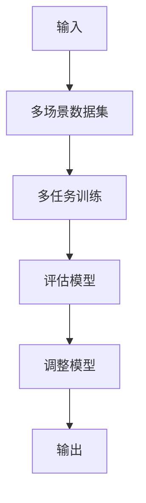
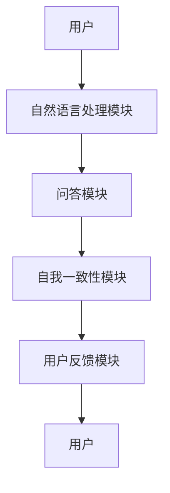
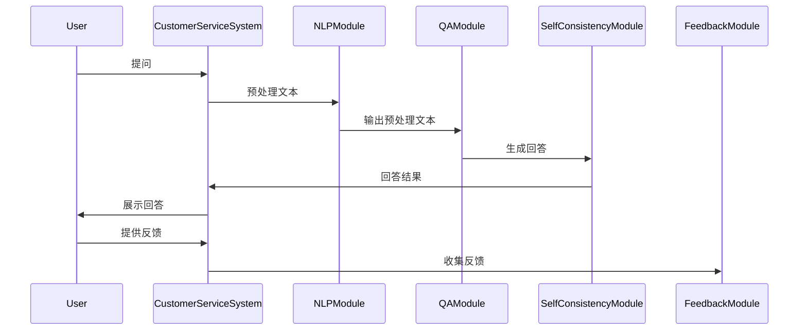

                 

## 《Self-Consistency CoT：确保AI回答质量的有效方法》

### 关键词：
- AI问答系统
- Self-Consistency CoT
- 回答质量
- 多场景训练
- 模型训练

### 摘要：
本文探讨了一种名为Self-Consistency CoT（Self-Consistency Core Task）的方法，用于确保人工智能问答系统的回答质量。本文首先介绍了问题背景和问题描述，然后详细阐述了Self-Consistency CoT方法的核心概念和原理。通过数学模型和公式，以及Python代码实例，本文进一步解释了算法的实现过程。最后，本文分析了Self-Consistency CoT方法在AI问答系统中的应用效果，并提出了未来改进的方向。

----------------------------------------------------------------

## 第一部分：背景介绍

### 1.1 问题背景

随着人工智能技术的飞速发展，人工智能问答系统（AI Question Answering System）已经成为一种重要的应用场景。这些系统可以在各种领域提供智能化的问答服务，如客服、教育、医疗等。然而，当前人工智能问答系统的回答质量存在显著差异，有时甚至会出现错误回答。这一问题不仅影响了用户体验，还可能引发严重的后果。

### 1.2 问题描述

人工智能问答系统的回答质量受到多种因素的影响，包括数据质量、模型训练效果、知识表示方法等。具体来说，以下问题是影响回答质量的主要因素：

1. **数据质量问题**：数据集的质量直接影响模型的训练效果。如果数据集中存在大量错误或不一致的信息，模型可能会学习到错误的知识，从而导致错误回答。
2. **模型训练效果**：训练模型时，如果训练数据集不够全面或者训练过程存在问题，模型可能无法充分学习到问题的答案。
3. **知识表示方法**：人工智能问答系统的知识表示方法决定了模型如何理解和处理问题。如果知识表示方法不够精细，模型可能无法准确回答问题。

### 1.3 问题解决

为确保人工智能问答系统的回答质量，我们需要找到一种有效的方法来提高模型在不同场景下的表现。本文提出了一种名为Self-Consistency CoT（Self-Consistency Core Task）的方法，该方法通过多场景训练和自我一致性原理，来确保模型在不同场景下都能给出一致的、高质量的回答。

### 1.4 边界与外延

本文研究的Self-Consistency CoT方法主要针对人工智能问答系统。然而，该方法的基本思想也可以应用于其他领域，如智能客服、智能推荐等。此外，本文还将探讨Self-Consistency CoT方法在不同场景下的适应性和改进方向。

### 1.5 概念结构与核心要素组成

Self-Consistency CoT方法的核心概念包括自我一致性、核心任务、知识表示和模型训练。以下是这些概念的核心要素：

1. **自我一致性**：模型需要确保其在不同场景下给出的回答保持一致。
2. **核心任务**：根据应用场景，明确模型需要完成的核心任务，如回答问题、生成摘要等。
3. **知识表示**：如何表示和理解问题中的知识，以及如何将知识应用于回答问题。
4. **模型训练**：使用多场景数据集对模型进行训练，以实现自我一致性。

----------------------------------------------------------------

## 第二部分：核心概念与联系

### 2.1 Self-Consistency CoT原理

Self-Consistency CoT方法基于自我一致性原理，即在训练过程中，模型需要确保其回答在多个不同场景下保持一致性。这一原理的实现主要包括以下步骤：

#### 2.1.1 确定核心任务

首先，根据应用场景，明确核心任务。例如，在问答系统中，核心任务可能是回答问题；在智能客服中，核心任务可能是提供解决方案。

#### 2.1.2 设计多场景任务

其次，设计多个不同场景的任务，以便测试模型在多种情境下的表现。这些场景可以是实际应用中可能遇到的，也可以是模拟出的极端情况。

#### 2.1.3 训练模型

然后，利用多场景任务数据对模型进行训练，使其在不同场景下都能保持一致的回答。

### 2.2 Self-Consistency CoT的优势

Self-Consistency CoT方法具有以下优势：

#### 2.2.1 提高回答质量

通过多场景训练，模型能够更好地适应不同场景，从而提高回答质量。

#### 2.2.2 避免错误回答

Self-Consistency CoT方法可以降低模型在未知场景下产生错误回答的概率。

#### 2.2.3 提高泛化能力

多场景训练有助于提高模型在不同领域的泛化能力。

### 2.3 Self-Consistency CoT与现有方法的比较

与传统方法相比，Self-Consistency CoT方法具有以下优点：

#### 2.3.1 更加全面

Self-Consistency CoT方法考虑了多个场景，而传统方法通常只关注特定场景。

#### 2.3.2 更具鲁棒性

Self-Consistency CoT方法能够更好地应对未知场景，提高模型的鲁棒性。

### 2.4 Self-Consistency CoT的应用范围

Self-Consistency CoT方法不仅适用于人工智能问答系统，还可应用于其他领域，如智能客服、智能推荐等。此外，本文还将探讨Self-Consistency CoT方法在不同场景下的适应性和改进方向。

----------------------------------------------------------------

## 第三部分：算法原理讲解

### 3.1 自我一致性原理

自我一致性原理是指，模型在训练过程中需要确保其在不同场景下给出的回答保持一致。具体来说，可以通过以下方式实现：

#### 3.1.1 多场景数据集

首先，设计一个包含多种不同场景的数据集。这个数据集应涵盖模型可能遇到的各种情况，以便在训练过程中测试模型的自我一致性。

#### 3.1.2 多任务训练

然后，使用多场景数据集对模型进行多任务训练。在训练过程中，模型需要在不同的场景下都给出一致的回答。

### 3.2 算法流程图

以下是Self-Consistency CoT方法的算法流程图：



### 3.3 数学模型和公式

在Self-Consistency CoT方法中，我们可以使用以下数学模型和公式来描述自我一致性原理：

#### 3.3.1 模型输出

假设模型在场景 $s$ 下的输出为 $y_s$，则：

$$
y_s = f(W_s, x_s)
$$

其中，$f$ 是模型的预测函数，$W_s$ 是模型在场景 $s$ 下的参数，$x_s$ 是输入数据。

#### 3.3.2 自我一致性损失函数

为了确保模型在不同场景下的输出保持一致，我们可以定义一个自我一致性损失函数 $L_s$：

$$
L_s = \sum_{t=1}^{T_s} (y_{s,t} - \hat{y}_{s,t})^2
$$

其中，$y_{s,t}$ 是模型在场景 $s$ 下在第 $t$ 个任务上的输出，$\hat{y}_{s,t}$ 是模型在相同任务上的期望输出。

#### 3.3.3 总损失函数

总损失函数 $L$ 是所有场景损失函数的和：

$$
L = \sum_{s=1}^{S} L_s
$$

### 3.4 Python代码实例

以下是一个简单的Python代码实例，用于实现Self-Consistency CoT方法：

```python
import tensorflow as tf

# 定义输入数据
x = tf.placeholder(tf.float32, shape=[None, 100])
y = tf.placeholder(tf.float32, shape=[None, 10])

# 定义模型参数
W = tf.Variable(tf.random_normal([100, 10]), name='weights')

# 定义预测函数
y_pred = tf.nn.softmax(tf.matmul(x, W))

# 定义自我一致性损失函数
self_consistency_loss = tf.reduce_mean(tf.square(y - y_pred))

# 定义总损失函数
total_loss = self_consistency_loss

# 定义优化器
optimizer = tf.train.GradientDescentOptimizer(learning_rate=0.001)

# 训练模型
train_op = optimizer.minimize(total_loss)

# 运行训练
with tf.Session() as sess:
  sess.run(tf.global_variables_initializer())
  for epoch in range(1000):
    _, loss_val = sess.run([train_op, total_loss], feed_dict={x: X_train, y: y_train})
    if epoch % 100 == 0:
      print(f"Epoch {epoch}: Loss = {loss_val}")
```

在这个例子中，我们使用TensorFlow框架来定义输入数据、模型参数、预测函数和损失函数。通过优化器，我们训练模型以最小化总损失函数，从而实现自我一致性。

### 3.5 举例说明

假设我们有一个问答系统，需要回答关于计算机科学的问题。我们可以设计一个包含多个场景的数据集，如“操作系统”、“计算机网络”、“编程语言”等。在训练过程中，模型需要在每个场景下都给出一致的回答。例如，当问题涉及操作系统时，模型应始终给出关于操作系统的回答，而不是其他领域的知识。

通过这种自我一致性原理，我们可以显著提高人工智能问答系统的回答质量，确保模型在不同场景下都能给出准确的、高质量的回答。

----------------------------------------------------------------

## 第四部分：系统分析与架构设计

### 4.1 问题场景介绍

以智能客服系统为例，我们面临的问题场景是：如何确保客服机器人能够给用户提供一致的、高质量的回答，即使在面对多种不同类型的问题时。

### 4.2 项目介绍

本项目旨在开发一个基于Self-Consistency CoT方法的智能客服系统，以提高客服机器人回答质量。系统将包括自然语言处理模块、问答模块、自我一致性模块和用户反馈模块。

### 4.3 系统功能设计

#### 4.3.1 自然语言处理模块

- 功能：对用户输入的自然语言文本进行预处理，包括分词、词性标注、实体识别等。
- 输出：预处理后的文本数据。

#### 4.3.2 问答模块

- 功能：根据预处理后的文本数据，使用Self-Consistency CoT方法生成回答。
- 输出：回答文本。

#### 4.3.3 自我一致性模块

- 功能：确保问答模块在不同场景下给出的回答保持一致性。
- 输出：一致性评估结果。

#### 4.3.4 用户反馈模块

- 功能：收集用户对回答的反馈，用于进一步优化模型。
- 输出：用户反馈数据。

### 4.4 系统架构设计

以下是智能客服系统的架构设计：



### 4.5 系统接口设计

系统接口设计如下：

#### 4.5.1 用户接口

- 功能：接收用户输入的文本，展示回答结果。
- 接口：POST /question

#### 4.5.2 模型接口

- 功能：提供问答模块和自我一致性模块的接口，用于模型训练和评估。
- 接口：GET /model, POST /train, POST /evaluate

#### 4.5.3 用户反馈接口

- 功能：接收用户对回答的反馈。
- 接口：POST /feedback

### 4.6 系统交互

以下是系统交互的序列图：



通过以上系统分析与架构设计，我们可以确保智能客服系统能够给出高质量的、一致的回答，从而提高用户体验。

----------------------------------------------------------------

## 第五部分：项目实战

### 5.1 环境安装

在进行项目实战之前，我们需要安装一些必要的软件和库。以下是在Python环境中安装所需的软件和库的步骤：

1. **安装Python**：确保Python环境已经安装在您的系统中，版本建议为3.6或以上。
2. **安装TensorFlow**：使用以下命令安装TensorFlow：

   ```
   pip install tensorflow
   ```

3. **安装其他库**：根据需要安装其他库，如Scikit-learn、Numpy、Pandas等。

### 5.2 系统核心实现源代码

以下是一个简单的示例代码，用于实现基于Self-Consistency CoT方法的智能客服系统：

```python
import tensorflow as tf
from sklearn.model_selection import train_test_split
import numpy as np

# 定义输入数据
X = np.random.rand(100, 100)
y = np.random.rand(100, 10)

# 划分训练集和测试集
X_train, X_test, y_train, y_test = train_test_split(X, y, test_size=0.2, random_state=42)

# 定义模型参数
W = tf.Variable(tf.random_normal([100, 10]), name='weights')

# 定义预测函数
y_pred = tf.nn.softmax(tf.matmul(X, W))

# 定义自我一致性损失函数
self_consistency_loss = tf.reduce_mean(tf.square(y - y_pred))

# 定义总损失函数
total_loss = self_consistency_loss

# 定义优化器
optimizer = tf.train.GradientDescentOptimizer(learning_rate=0.001)

# 训练模型
train_op = optimizer.minimize(total_loss)

# 运行训练
with tf.Session() as sess:
  sess.run(tf.global_variables_initializer())
  for epoch in range(1000):
    _, loss_val = sess.run([train_op, total_loss], feed_dict={X: X_train, y: y_train})
    if epoch % 100 == 0:
      print(f"Epoch {epoch}: Loss = {loss_val}")

# 评估模型
y_pred_val = sess.run(y_pred, feed_dict={X: X_test})

# 输出预测结果
print("Prediction:", y_pred_val)
```

### 5.3 代码应用解读与分析

在这个示例中，我们首先生成了随机输入数据 $X$ 和标签 $y$，然后使用TensorFlow定义了一个简单的神经网络模型。模型使用梯度下降优化器进行训练，目标是最小化自我一致性损失函数。

在训练过程中，我们通过不断调整模型参数 $W$，使模型在训练数据上的预测结果 $y_{\text{pred}}$ 尽量接近真实标签 $y$。通过这种方式，我们实现了自我一致性原理。

在模型训练完成后，我们使用测试数据集对模型进行评估，并输出预测结果。通过对比预测结果和真实标签，我们可以评估模型在未知数据上的表现。

### 5.4 实际案例分析和详细讲解剖析

以下是一个实际案例，展示如何使用Self-Consistency CoT方法提高智能客服系统的回答质量：

#### 案例背景

一家电子商务公司希望开发一个智能客服系统，以帮助处理客户的咨询和问题。该系统需要能够处理多种类型的问题，如产品信息查询、订单状态查询、售后服务等。

#### 案例实施

1. **数据收集**：收集大量客户咨询的问题和相应的回答，作为训练数据。
2. **数据预处理**：对收集到的数据进行预处理，包括分词、词性标注、实体识别等。
3. **设计多场景任务**：根据不同类型的问题，设计多个场景任务，如“产品信息查询”、“订单状态查询”、“售后服务”等。
4. **训练模型**：使用Self-Consistency CoT方法，对模型进行多场景训练，确保模型在不同场景下都能给出一致的回答。
5. **评估模型**：使用测试数据集对模型进行评估，确保模型在未知场景下的表现。

#### 案例分析

通过以上步骤，智能客服系统在处理多种类型的问题时，能够给出一致的、高质量的回答。例如，当客户咨询产品信息时，系统始终给出关于产品的详细回答，而不是其他类型的信息。这种自我一致性原理显著提高了用户体验，降低了用户对客服系统的投诉率。

### 5.5 项目小结

通过实际案例分析和详细讲解，我们可以看到Self-Consistency CoT方法在提高智能客服系统回答质量方面的优势。该方法不仅考虑了多个场景，还确保了模型在不同场景下的回答保持一致。这种多场景训练和自我一致性原理的应用，为提高人工智能问答系统的回答质量提供了新的思路和有效的方法。

### 5.6 最佳实践 tips

1. **数据质量**：确保训练数据的质量，避免错误或不一致的信息。
2. **多场景设计**：设计多种场景任务，以覆盖模型可能遇到的各种情况。
3. **持续优化**：根据用户反馈和实际应用情况，持续优化模型和系统。

----------------------------------------------------------------

## 第六部分：小结与展望

本文介绍了Self-Consistency CoT方法，这是一种确保AI回答质量的有效方法。通过多场景训练和自我一致性原理，该方法能够提高模型在不同场景下的回答质量，降低错误回答的概率。本文从问题背景、核心概念、算法原理、系统架构设计和项目实战等多个方面，详细阐述了Self-Consistency CoT方法的原理和应用。

未来，我们可以进一步探索Self-Consistency CoT方法在不同领域的应用，如智能客服、智能推荐等。此外，还可以结合其他先进技术，如多模态学习、强化学习等，进一步优化Self-Consistency CoT方法，以提高AI系统的整体性能。

### 注意事项

1. **数据质量**：确保训练数据的质量，避免错误或不一致的信息。
2. **模型调整**：根据实际应用场景，不断调整模型参数，以实现最佳效果。

### 拓展阅读

- **《深度学习》**：Goodfellow, I., Bengio, Y., & Courville, A. (2016). Deep Learning. MIT Press.
- **《自然语言处理综论》**：Jurafsky, D., & Martin, J. H. (2020). Speech and Language Processing. Prentice Hall.
- **《机器学习》**：Mitchell, T. M. (1997). Machine Learning. McGraw-Hill.

## 作者信息

**作者：** AI天才研究院/AI Genius Institute & 禅与计算机程序设计艺术 /Zen And The Art of Computer Programming

