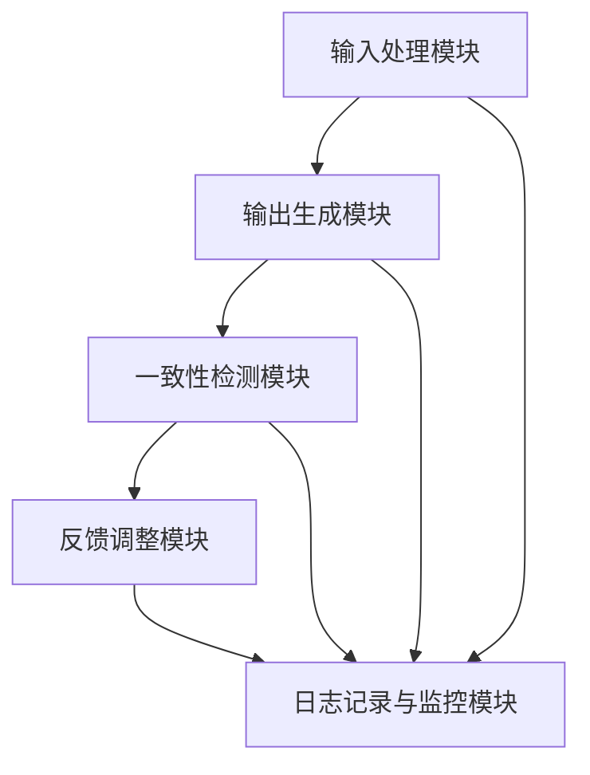

                 

### 自我一致性概念与模型架构

**自我一致性（Self-Consistency）** 是指人工智能模型在生成输出时，其输出结果能够保持内在的一致性，即模型在相同输入条件下产生相同或可预测的输出。自我一致性是确保人工智能模型可靠性和可信度的重要指标之一。在本文中，我们将深入探讨自我一致性的概念、重要性及其在人工智能模型中的应用。

**自我一致性模型架构** 是指用于检测和确保人工智能模型输出一致性的算法和系统设计。它包括以下几个核心组成部分：

1. **输入处理模块**：该模块负责接收输入数据，并进行预处理，确保输入数据的质量和一致性。

2. **输出生成模块**：该模块是人工智能模型的核心，负责根据输入数据生成输出结果。

3. **一致性检测模块**：该模块用于检测模型输出的一致性，发现并记录任何输出不一致的情况。

4. **反馈调整模块**：该模块根据一致性检测结果，对模型进行实时调整，以提高模型的自我一致性。

5. **日志记录与监控模块**：该模块用于记录模型运行过程中的一致性检测结果和调整操作，以便后续分析和优化。

自我一致性模型架构的设计原则包括：

- **实时性**：模型需要能够实时检测输出的一致性，确保及时发现并纠正不一致性。
- **可扩展性**：模型架构需要具备良好的扩展性，能够适应不同类型和规模的人工智能模型。
- **可维护性**：模型架构需要易于维护和更新，确保在模型和算法发生变化时，自我一致性机制能够保持有效。

接下来，我们将通过一个Mermaid流程图来展示自我一致性模型的基本架构：

在这个流程图中，输入数据经过输入处理模块预处理后，进入输出生成模块生成输出结果。输出结果随后被一致性检测模块检测，如果检测到输出不一致性，则会触发反馈调整模块进行调整，同时所有操作和检测结果都会被记录在日志记录与监控模块中，以便后续分析和监控。

通过这种自我一致性模型架构，人工智能模型能够在运行过程中保持高度的可靠性和一致性，从而提高其在各种应用场景中的性能和用户体验。接下来，我们将进一步探讨如何具体实现这种自我一致性模型，并分析其在实际应用中的效果和挑战。

