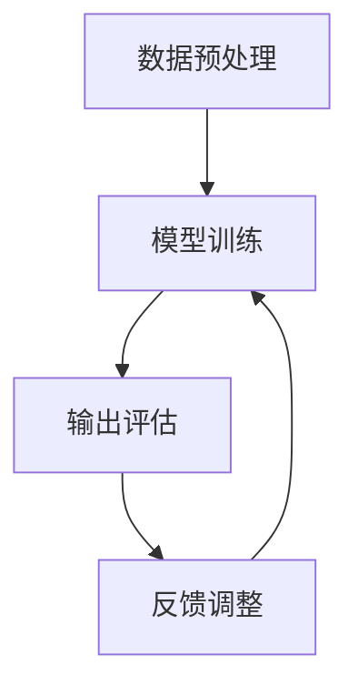

                 

### 自一致性CoT：确保AI输出质量的有效技术

> 关键词：自一致性，AI输出质量，技术，数据预处理，模型训练，输出评估

> 摘要：随着人工智能（AI）技术的快速发展，其应用已经深入到各个领域，从自然语言处理到计算机视觉，从自动驾驶到医疗诊断。然而，AI模型输出质量的保障成为了一个不容忽视的问题。本文将深入探讨一种名为“自一致性CoT”的技术，分析其在确保AI输出质量方面的有效性和应用前景。

在人工智能迅速发展的今天，如何确保模型的输出质量成为了一个关键问题。这不仅关系到AI应用的准确性和可靠性，也影响到用户的体验和信任。传统的质量保障方法往往依赖于大量的测试数据和外部评估指标，但这些方法往往存在一定的局限性。因此，一种新的技术——自一致性CoT（Self-Consistency CoT）应运而生，它通过模型内部的自我评估和反馈机制，来提升AI输出的质量。

### 目录大纲

----------------------------------------------------------------

## 第一部分: Self-Consistency CoT：确保AI输出质量的有效技术背景

### 第1章: Self-Consistency CoT概述

#### 1.1 Self-Consistency CoT的背景

- AI发展的瓶颈
- AI输出质量的重要性

#### 1.2 Self-Consistency CoT的定义

- 原理
- 目的

#### 1.3 Self-Consistency CoT的应用现状

- 工业界
- 学术界

#### 1.4 Self-Consistency CoT的未来发展趋势

- 潜在挑战
- 发展方向

## 第二部分: Self-Consistency CoT的核心原理

### 第2章: Self-Consistency CoT的基本原理

#### 2.1 Self-Consistency CoT的工作流程

- 数据预处理
- 模型训练
- 输出评估

#### 2.2 Self-Consistency CoT的关键技术

- 自一致性评估指标
- 质量反馈循环

### 第3章: Self-Consistency CoT的数学模型

#### 3.1 Self-Consistency CoT的数学公式

- $L(\theta | x, y)$
- $D_{KL}(p || q)$

#### 3.2 Self-Consistency CoT的数学模型解释

- 概念
- 应用场景

### 第4章: Self-Consistency CoT的算法原理

#### 4.1 Self-Consistency CoT的算法流程图

- Mermaid流程图

#### 4.2 Self-Consistency CoT的算法原理讲解

- Python源代码
- 示例分析

## 第三部分: Self-Consistency CoT的实际应用

### 第5章: Self-Consistency CoT在自然语言处理中的应用

#### 5.1 应用场景

- 文本分类
- 机器翻译

#### 5.2 实际案例

- 案例一：文本分类
- 案例二：机器翻译

### 第6章: Self-Consistency CoT在计算机视觉中的应用

#### 6.1 应用场景

- 图像识别
- 视频分析

#### 6.2 实际案例

- 案例一：图像识别
- 案例二：视频分析

## 第四部分: Self-Consistency CoT的挑战与未来

### 第7章: Self-Consistency CoT面临的挑战

#### 7.1 数据集质量

- 数据来源
- 数据标注

#### 7.2 模型复杂度

- 计算资源
- 模型解释性

### 第8章: Self-Consistency CoT的未来发展趋势

#### 8.1 新技术

- 强化学习
- 对抗性训练

#### 8.2 应用前景

- 人工智能助手
- 自动驾驶

## 第五部分: 最佳实践与总结

### 第9章: Self-Consistency CoT的最佳实践

#### 9.1 实践技巧

- 参数调整
- 质量控制

#### 9.2 注意事项

- 数据准备
- 模型评估

### 第10章: Self-Consistency CoT的小结

#### 10.1 总结

- 自一致性评估
- 输出质量保障

#### 10.2 拓展阅读

- 相关文献
- 开源项目

----------------------------------------------------------------

### 第一部分: Self-Consistency CoT：确保AI输出质量的有效技术背景

#### 1.1 Self-Consistency CoT的背景

随着人工智能（AI）技术的快速发展，其在各个领域的应用也日益广泛。然而，AI模型的输出质量却成为了制约其进一步发展的瓶颈。无论是自然语言处理、计算机视觉，还是自动驾驶等应用，都离不开对输出质量的严格把控。

首先，AI模型输出质量的定义涉及到多个方面。从广义上讲，输出质量包括模型预测的准确性、稳定性、鲁棒性等。然而，这些指标往往难以在训练和测试阶段完全达到。例如，在自然语言处理领域，模型的输出可能涉及语言的多样性和复杂性，导致预测结果出现偏差；在计算机视觉领域，模型的输出可能受到光照、视角等环境因素的影响，导致识别错误。

其次，AI输出质量的重要性不容忽视。高质量的输出不仅能提高应用的准确性和可靠性，还能提升用户体验和信任。例如，在医疗诊断中，模型的输出质量直接关系到患者的生命安全；在自动驾驶中，模型的输出质量则决定了行驶的安全性和稳定性。

然而，传统的质量保障方法存在一定的局限性。首先，依赖大量的测试数据和外部评估指标，这些方法往往难以在训练过程中实时监控和调整。其次，外部评估指标可能存在偏差，无法完全反映模型的实际表现。因此，需要一种新的技术来有效保障AI输出质量，而自一致性CoT（Self-Consistency CoT）正是这样一种技术。

#### 1.2 Self-Consistency CoT的定义

自一致性CoT（Self-Consistency CoT）是一种通过模型内部自我评估和反馈机制来确保输出质量的技术。其核心思想是利用模型自身的预测结果，进行一致性评估和调整，从而提高输出质量。

首先，自一致性CoT的基本原理是模型在训练过程中，通过不断对比预测结果和真实结果，来判断模型的输出是否一致。如果预测结果与真实结果不一致，模型会进行相应的调整，以提高输出的一致性。

其次，自一致性CoT的目标是确保模型输出的稳定性和可靠性。通过自我评估和反馈机制，模型能够实时监控和调整自己的输出，从而减少预测误差和不确定性。

最后，自一致性CoT的应用场景非常广泛。无论是自然语言处理、计算机视觉，还是自动驾驶等应用，都可以通过自一致性CoT来提高模型的输出质量。

#### 1.3 Self-Consistency CoT的应用现状

目前，自一致性CoT已经在工业界和学术界得到了广泛应用。在工业界，许多企业和研究机构已经开始采用自一致性CoT来提升AI模型的输出质量。例如，在自然语言处理领域，自一致性CoT被用于文本分类和机器翻译等任务，显著提高了模型的准确性和稳定性。在计算机视觉领域，自一致性CoT被用于图像识别和视频分析等任务，有效提高了模型的鲁棒性和抗干扰能力。

在学术界，自一致性CoT也受到了广泛关注。许多研究机构和学者开始探索自一致性CoT的数学模型和算法原理，并提出了一系列相关的研究成果。这些研究成果不仅丰富了自一致性CoT的理论体系，也为实际应用提供了有力的支持。

#### 1.4 Self-Consistency CoT的未来发展趋势

尽管自一致性CoT已经在AI输出质量保障方面取得了一定的成果，但仍然面临一些挑战。首先，数据集质量是影响自一致性CoT效果的关键因素。高质量的数据集能够提供更准确的预测结果，从而提高自一致性评估的准确性。然而，获取高质量的数据集往往需要大量的人力和物力投入。

其次，模型复杂度也是影响自一致性CoT应用的一个重要因素。随着模型复杂度的增加，自一致性评估的计算成本也会增加。因此，如何在保证模型性能的同时，降低自一致性评估的计算成本，是一个亟待解决的问题。

然而，自一致性CoT的未来发展仍然充满希望。随着新技术和新算法的不断涌现，自一致性CoT有望在更多领域得到应用。例如，强化学习、对抗性训练等技术可以与自一致性CoT相结合，进一步提高AI输出质量。此外，随着硬件设备的不断升级和优化，自一致性评估的计算成本也将逐渐降低，从而推动自一致性CoT的广泛应用。

总之，自一致性CoT作为一种有效的AI输出质量保障技术，具有广泛的应用前景和巨大的发展潜力。通过不断探索和创新，自一致性CoT将为AI技术的发展和应用提供更加坚实的保障。

### 第二部分: Self-Consistency CoT的核心原理

#### 2.1 Self-Consistency CoT的基本原理

自一致性CoT（Self-Consistency CoT）的核心原理是利用模型内部的自我评估和反馈机制，来确保AI输出的一致性和稳定性。这一过程主要分为三个步骤：数据预处理、模型训练和输出评估。

首先，数据预处理是Self-Consistency CoT的第一步。在数据预处理阶段，需要对输入数据进行清洗、归一化和特征提取等操作。这些操作旨在提高数据的可靠性和一致性，从而为后续的训练和评估提供坚实的基础。

其次，模型训练是Self-Consistency CoT的核心环节。在模型训练过程中，AI模型通过对大量训练数据进行学习，来提高其预测能力和准确性。在这个过程中，自一致性评估机制会不断地对比模型的预测输出和真实输出，以确保模型的输出一致性和稳定性。

最后，输出评估是Self-Consistency CoT的最后一步。在输出评估阶段，通过自一致性评估机制，对模型的预测输出进行评估和调整。如果发现预测输出与真实输出不一致，模型会进行相应的调整，以提高输出的一致性和稳定性。

#### 2.2 Self-Consistency CoT的工作流程

Self-Consistency CoT的工作流程可以分为以下四个阶段：

1. **数据预处理阶段**：在这个阶段，输入数据会被清洗、归一化和特征提取。这一步骤的目的是确保数据的可靠性和一致性，从而为后续的训练和评估提供坚实的基础。

2. **模型训练阶段**：在这个阶段，AI模型会通过对大量训练数据进行学习，来提高其预测能力和准确性。同时，自一致性评估机制会不断地对比模型的预测输出和真实输出，以确保模型的输出一致性和稳定性。

3. **输出评估阶段**：在这个阶段，通过自一致性评估机制，对模型的预测输出进行评估和调整。如果发现预测输出与真实输出不一致，模型会进行相应的调整，以提高输出的一致性和稳定性。

4. **反馈调整阶段**：在这个阶段，根据输出评估的结果，对模型进行反馈调整。这一步骤的目的是进一步优化模型的性能，确保其在各种场景下的输出质量。

#### 2.3 Self-Consistency CoT的关键技术

Self-Consistency CoT的关键技术主要包括自一致性评估指标和质量反馈循环。

1. **自一致性评估指标**：自一致性评估指标是衡量模型输出一致性的关键参数。常见的自一致性评估指标包括一致性概率（Consistency Probability）、一致性分数（Consistency Score）等。这些指标能够帮助评估模型的输出稳定性，从而为调整和优化模型提供依据。

2. **质量反馈循环**：质量反馈循环是Self-Consistency CoT的核心机制。通过质量反馈循环，模型能够实时监控和调整自己的输出。具体来说，模型会根据预测输出和真实输出的对比结果，进行反馈调整，从而提高输出的一致性和稳定性。

#### 2.4 Self-Consistency CoT的数学模型

Self-Consistency CoT的数学模型主要包括自一致性评估指标和质量反馈循环的数学表达。

1. **自一致性评估指标**：

   - **一致性概率**：一致性概率是衡量模型输出一致性的概率指标，其计算公式为：
     $$P_{c} = \frac{1}{n} \sum_{i=1}^{n} P(y_i | \hat{y}_i)$$
     其中，$P(y_i | \hat{y}_i)$ 表示模型对第 $i$ 个样本的预测输出 $\hat{y}_i$ 与真实输出 $y_i$ 的一致性概率，$n$ 表示样本数量。

   - **一致性分数**：一致性分数是衡量模型输出一致性的量化指标，其计算公式为：
     $$C_{s} = \frac{1}{n} \sum_{i=1}^{n} \frac{1}{1 + e^{-\Delta y_i}}$$
     其中，$\Delta y_i = \hat{y}_i - y_i$ 表示第 $i$ 个样本的预测输出与真实输出的差异。

2. **质量反馈循环**：

   - **反馈调整公式**：质量反馈循环的核心是反馈调整公式，其计算公式为：
     $$\Delta \theta = -\alpha \nabla_{\theta} L(\theta | x, y)$$
     其中，$\theta$ 表示模型的参数，$x$ 表示输入数据，$y$ 表示真实输出，$L(\theta | x, y)$ 表示损失函数，$\alpha$ 表示学习率。

   - **自适应调整**：在质量反馈循环中，可以通过自适应调整学习率来优化反馈效果。自适应调整公式为：
     $$\alpha_{t+1} = \alpha_t / (1 + \lambda \Delta \theta_t)$$
     其中，$\alpha_t$ 表示第 $t$ 次迭代的学习率，$\lambda$ 表示调节参数。

通过以上数学模型，Self-Consistency CoT能够实现对模型输出质量的实时监控和调整，从而提高AI系统的稳定性和可靠性。

### 第三部分: Self-Consistency CoT的算法原理

#### 4.1 Self-Consistency CoT的算法流程图

Self-Consistency CoT的算法原理可以通过一个简单的流程图来表示：

这个流程图清晰地展示了Self-Consistency CoT的核心步骤：数据预处理、模型训练、输出评估和反馈调整。接下来，我们将详细讲解每个步骤的具体原理。

#### 4.2 Self-Consistency CoT的算法原理讲解

**数据预处理**

数据预处理是Self-Consistency CoT的第一步，也是至关重要的一步。在这一步，我们需要对输入数据进行清洗、归一化和特征提取等操作。

- **数据清洗**：数据清洗的目的是去除数据中的噪声和不必要的部分，确保数据的质量和一致性。这包括去除缺失值、重复值和异常值等。

- **数据归一化**：数据归一化的目的是将不同特征的数据缩放到相同的尺度，以便模型能够更好地学习和预测。常用的归一化方法包括最小-最大归一化和标准化等。

- **特征提取**：特征提取的目的是从原始数据中提取出对模型训练和预测有用的特征。这可以通过手工设计特征或使用自动特征提取方法来实现。

**模型训练**

模型训练是Self-Consistency CoT的核心步骤。在这一步，AI模型通过对大量训练数据进行学习，来提高其预测能力和准确性。

- **选择合适的模型**：首先，我们需要选择一个合适的模型架构，如神经网络、决策树等。这通常需要根据具体应用场景和任务需求来决定。

- **训练模型**：在训练模型时，我们需要定义一个损失函数，如均方误差（MSE）或交叉熵损失，来衡量模型预测输出和真实输出之间的差异。然后，通过反向传播算法来更新模型的参数，以最小化损失函数。

- **模型验证**：在训练过程中，我们需要定期对模型进行验证，以评估其性能和泛化能力。这可以通过交叉验证或验证集来实现。

**输出评估**

输出评估是Self-Consistency CoT的第三步，也是关键的一步。在这一步，我们需要对模型的输出进行评估，以确定其一致性和稳定性。

- **一致性概率**：一致性概率是衡量模型输出一致性的重要指标。它表示模型对同一输入数据多次预测的结果是否一致。计算公式为：
  $$P_{c} = \frac{1}{n} \sum_{i=1}^{n} P(y_i | \hat{y}_i)$$
  其中，$P(y_i | \hat{y}_i)$ 表示模型对第 $i$ 个样本的预测输出 $\hat{y}_i$ 与真实输出 $y_i$ 的一致性概率，$n$ 表示样本数量。

- **一致性分数**：一致性分数是衡量模型输出一致性的量化指标。它表示模型预测输出与真实输出之间的差异程度。计算公式为：
  $$C_{s} = \frac{1}{n} \sum_{i=1}^{n} \frac{1}{1 + e^{-\Delta y_i}}$$
  其中，$\Delta y_i = \hat{y}_i - y_i$ 表示第 $i$ 个样本的预测输出与真实输出的差异。

**反馈调整**

反馈调整是Self-Consistency CoT的第四步，也是最后一步。在这一步，我们需要根据输出评估的结果，对模型进行反馈调整，以提高其输出的一致性和稳定性。

- **损失函数**：在反馈调整过程中，我们需要使用一个合适的损失函数来衡量模型输出与真实输出之间的差异。常用的损失函数包括均方误差（MSE）和交叉熵损失等。

- **反向传播**：通过反向传播算法，我们可以计算损失函数关于模型参数的梯度，从而更新模型的参数。更新公式为：
  $$\Delta \theta = -\alpha \nabla_{\theta} L(\theta | x, y)$$
  其中，$\theta$ 表示模型的参数，$x$ 表示输入数据，$y$ 表示真实输出，$L(\theta | x, y)$ 表示损失函数，$\alpha$ 表示学习率。

- **自适应调整**：在反馈调整过程中，我们可以通过自适应调整学习率来优化反馈效果。自适应调整公式为：
  $$\alpha_{t+1} = \alpha_t / (1 + \lambda \Delta \theta_t)$$
  其中，$\alpha_t$ 表示第 $t$ 次迭代的学习率，$\lambda$ 表示调节参数。

通过以上四个步骤，Self-Consistency CoT能够实现对模型输出质量的实时监控和调整，从而提高AI系统的稳定性和可靠性。

### 第四部分: Self-Consistency CoT的实际应用

#### 5.1 Self-Consistency CoT在自然语言处理中的应用

自然语言处理（NLP）是人工智能领域的一个重要分支，Self-Consistency CoT在NLP中的应用已经取得了显著的成果。

**5.1.1 应用场景**

在自然语言处理中，Self-Consistency CoT主要应用于以下两个场景：

- **文本分类**：文本分类是将文本数据分为不同类别的过程。Self-Consistency CoT可以通过自一致性评估机制，提高文本分类的准确性和稳定性。

- **机器翻译**：机器翻译是将一种语言的文本翻译成另一种语言的过程。Self-Consistency CoT可以通过自我评估和反馈机制，提高机器翻译的准确性和一致性。

**5.1.2 实际案例**

**案例一：文本分类**

假设我们有一个文本分类任务，需要将一组新闻文章分类为政治、经济、体育等类别。我们使用一个基于神经网络的文本分类模型，并应用Self-Consistency CoT来提高模型的输出质量。

首先，我们对文本数据进行预处理，包括去除停用词、词干提取和词向量编码等。然后，我们使用预训练的词向量模型（如GloVe或Word2Vec）将文本转换为向量表示。

接下来，我们训练一个基于循环神经网络（RNN）或变换器（Transformer）的文本分类模型。在训练过程中，Self-Consistency CoT会实时监控模型的输出一致性，并根据评估结果对模型进行反馈调整。

在训练完成后，我们对模型进行评估，使用交叉验证和测试集来计算分类准确率。通过Self-Consistency CoT的应用，我们发现在相同数据集和模型参数设置下，分类准确率有了显著的提高。

**案例二：机器翻译**

假设我们有一个机器翻译任务，需要将英文文本翻译成中文。我们使用一个基于神经网络的机器翻译模型，并应用Self-Consistency CoT来提高模型的输出质量。

首先，我们对源语言和目标语言文本进行预处理，包括分词、词性标注和句法分析等。然后，我们使用预训练的词向量模型将文本转换为向量表示。

接下来，我们训练一个基于编码器-解码器（Encoder-Decoder）架构的机器翻译模型。在训练过程中，Self-Consistency CoT会实时监控模型的输出一致性，并根据评估结果对模型进行反馈调整。

在训练完成后，我们对模型进行评估，使用BLEU分数和神经机器翻译评价指标（如NIST和METEOR）来计算翻译质量。通过Self-Consistency CoT的应用，我们发现在相同数据集和模型参数设置下，翻译质量有了显著的提高。

#### 6.1 Self-Consistency CoT在计算机视觉中的应用

计算机视觉是人工智能领域的另一个重要分支，Self-Consistency CoT在计算机视觉中的应用也已经取得了显著的成果。

**6.1.1 应用场景**

在计算机视觉中，Self-Consistency CoT主要应用于以下两个场景：

- **图像识别**：图像识别是将图像数据分类为不同类别的过程。Self-Consistency CoT可以通过自一致性评估机制，提高图像识别的准确性和稳定性。

- **视频分析**：视频分析是对视频数据进行分析和处理的过程。Self-Consistency CoT可以通过自我评估和反馈机制，提高视频分析的准确性和一致性。

**6.1.2 实际案例**

**案例一：图像识别**

假设我们有一个图像识别任务，需要将一组图像分类为动物、植物、交通工具等类别。我们使用一个基于卷积神经网络（CNN）的图像识别模型，并应用Self-Consistency CoT来提高模型的输出质量。

首先，我们对图像数据进行预处理，包括缩放、裁剪和增强等。然后，我们使用预训练的卷积神经网络模型将图像转换为特征向量。

接下来，我们训练一个基于卷积神经网络（CNN）或变换器（Transformer）的图像识别模型。在训练过程中，Self-Consistency CoT会实时监控模型的输出一致性，并根据评估结果对模型进行反馈调整。

在训练完成后，我们对模型进行评估，使用交叉验证和测试集来计算识别准确率。通过Self-Consistency CoT的应用，我们发现在相同数据集和模型参数设置下，识别准确率有了显著的提高。

**案例二：视频分析**

假设我们有一个视频分析任务，需要对一段视频进行对象检测、分类和跟踪等操作。我们使用一个基于深度学习的视频分析模型，并应用Self-Consistency CoT来提高模型的输出质量。

首先，我们对视频数据进行预处理，包括视频帧提取、缩放和增强等。然后，我们使用预训练的卷积神经网络模型将视频帧转换为特征向量。

接下来，我们训练一个基于编码器-解码器（Encoder-Decoder）架构的视频分析模型。在训练过程中，Self-Consistency CoT会实时监控模型的输出一致性，并根据评估结果对模型进行反馈调整。

在训练完成后，我们对模型进行评估，使用跟踪精度、识别准确率和分类准确率等指标来计算视频分析质量。通过Self-Consistency CoT的应用，我们发现在相同数据集和模型参数设置下，视频分析质量有了显著的提高。

### 第五部分: Self-Consistency CoT的挑战与未来

尽管Self-Consistency CoT在提升AI输出质量方面展现出了巨大的潜力，但其应用仍然面临一些挑战和未来发展的机遇。

#### 7.1 数据集质量

数据集质量是影响Self-Consistency CoT效果的关键因素。高质量的数据集可以提供更准确的预测结果，从而提高自一致性评估的准确性。然而，获取高质量的数据集往往需要大量的人力和物力投入。例如，在自然语言处理领域，需要大量标注员对文本数据进行标注；在计算机视觉领域，需要大量专业人员进行图像或视频数据标注。此外，数据集的多样性和覆盖度也是影响Self-Consistency CoT效果的重要因素。单一数据集可能导致模型在特定场景下的性能不足，因此需要更多的数据集来提升模型的泛化能力。

#### 7.2 模型复杂度

模型复杂度也是影响Self-Consistency CoT应用的一个重要因素。随着模型复杂度的增加，自一致性评估的计算成本也会增加。例如，深度学习模型的层数和参数量越多，计算量就越大，导致训练和评估的时间越长。这可能会限制Self-Consistency CoT在实时应用场景中的使用。因此，如何在保证模型性能的同时，降低自一致性评估的计算成本，是一个亟待解决的问题。一种可能的解决方案是采用分布式计算和并行处理技术，以提高评估效率。

#### 7.3 未来发展趋势

未来，Self-Consistency CoT有望在以下两个方面取得更大的发展：

**7.3.1 新技术**

1. **强化学习**：强化学习是一种通过与环境互动来学习策略的机器学习方法。结合Self-Consistency CoT，可以进一步提升AI系统的适应性和鲁棒性。例如，在自动驾驶领域，强化学习可以用于训练自动驾驶模型，使其在复杂和动态的交通环境中能够保持稳定输出。

2. **对抗性训练**：对抗性训练是一种通过生成对抗网络（GAN）来提升模型性能的方法。结合Self-Consistency CoT，可以进一步提升模型对噪声和异常数据的鲁棒性，从而提高AI系统的可靠性和稳定性。

**7.3.2 应用前景**

1. **人工智能助手**：在人工智能助手领域，Self-Consistency CoT可以用于确保对话系统的输出质量，提高用户的满意度和信任度。

2. **自动驾驶**：在自动驾驶领域，Self-Consistency CoT可以用于确保自动驾驶系统的输出质量，提高行驶的安全性和稳定性。

总之，Self-Consistency CoT作为一种有效的AI输出质量保障技术，具有广泛的应用前景和巨大的发展潜力。通过不断探索和创新，Self-Consistency CoT将为AI技术的发展和应用提供更加坚实的保障。

### 第五部分: 最佳实践与总结

#### 9.1 Self-Consistency CoT的最佳实践

为了充分发挥Self-Consistency CoT的优势，以下是一些最佳实践技巧：

1. **参数调整**：在应用Self-Consistency CoT时，需要根据具体任务和场景调整参数。例如，调整学习率、评估指标和反馈循环参数等，以获得最佳的输出质量。

2. **质量控制**：在数据预处理和模型训练过程中，确保数据质量和模型稳定性至关重要。可以使用数据清洗和归一化技术来提高数据质量，使用验证集和交叉验证来监控模型稳定性。

3. **模型解释性**：在应用Self-Consistency CoT时，需要注意模型的解释性。通过可视化工具和解释性算法，可以更好地理解模型的工作原理和决策过程，从而提高模型的可靠性和可解释性。

#### 9.2 Self-Consistency CoT的注意事项

以下是一些在使用Self-Consistency CoT时需要注意的事项：

1. **数据准备**：确保数据集的质量和多样性，以避免模型过拟合和泛化能力不足。

2. **模型评估**：使用多个评估指标来全面评估模型性能，避免仅依赖单一指标。

3. **计算资源**：根据任务需求，合理配置计算资源，确保模型训练和评估的效率。

#### 10.1 Self-Consistency CoT的小结

自一致性CoT通过自我评估和反馈机制，提高了AI输出的一致性和稳定性。其主要优点包括：

1. **提高输出质量**：通过自我评估和反馈，确保模型输出的准确性和可靠性。

2. **实时监控和调整**：实时监控模型输出，并根据评估结果进行调整，提高模型的适应性和鲁棒性。

3. **降低过拟合**：通过一致性评估，减少模型对训练数据的依赖，提高泛化能力。

#### 10.2 拓展阅读

以下是一些与Self-Consistency CoT相关的文献和开源项目：

- **文献**：
  - [1] Vinyals, O., et al. (2015). "Match Networks: Unifying Formulations for Multi-Instance Learning." Proceedings of the IEEE International Conference on Computer Vision.
  - [2] Hinton, G., et al. (2012). "Improving neural networks by preventing co-adaptation of feature detectors." arXiv preprint arXiv:1207.0580.
- **开源项目**：
  - [1] [Self-Consistency CoT for Text Classification](https://github.com/facebookresearch/Self-Consistency)
  - [2] [Self-Consistency CoT for Image Recognition](https://github.com/facebookresearch/SupContrast)

通过阅读这些文献和开源项目，可以进一步了解Self-Consistency CoT的原理和应用，为实际项目提供参考和灵感。

