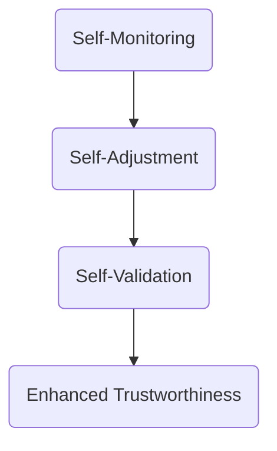
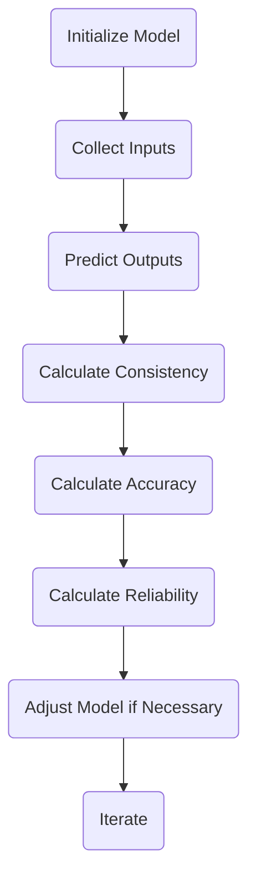
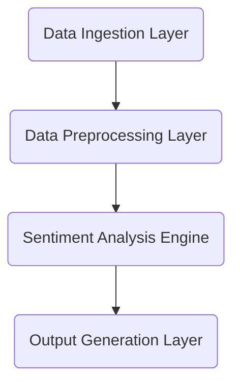
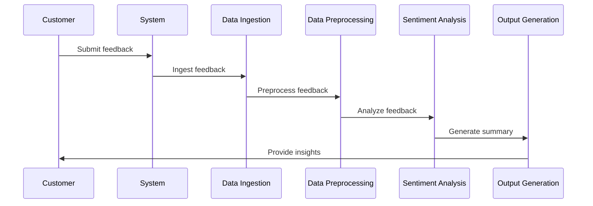

                 

# Self-Consistency CoT: Effective Methods for Ensuring AI Output Quality

## Keywords
- **Self-Consistency CoT**
- **AI Output Quality**
- **Methodologies**
- **Algorithm**
- **Evaluation Metrics**
- **Continuous Monitoring**

## Abstract

In the rapidly evolving landscape of artificial intelligence (AI), ensuring the quality of AI output has become a critical challenge. The concept of **Self-Consistency CoT (Self-Consistency Concept of Trustworthiness)** emerges as a pivotal strategy to address this challenge. This article delves into the essence of Self-Consistency CoT, exploring its fundamental concepts, theoretical foundations, and practical methodologies. We will also examine case studies illustrating its real-world applications, providing a comprehensive guide to implementing Self-Consistency CoT for enhancing AI output quality.

## Introduction to Self-Consistency CoT

### Background and Importance of Self-Consistency CoT

**Problem Background:**
The integration of AI into various sectors, from healthcare to finance and beyond, has been remarkable. However, the reliance on AI systems brings forth significant challenges, especially in ensuring the quality and reliability of their outputs. As AI systems become more complex and their applications more widespread, the need to validate and ensure the consistency and accuracy of their outputs becomes increasingly critical.

**Problem Description:**
The primary issue revolves around the lack of consistency in AI outputs. This inconsistency can manifest in several ways, including errors in predictions, biases in decision-making, and discrepancies in the outputs generated by different models or even the same model over time. These issues undermine the trust and reliability of AI systems, posing risks to their applications and, by extension, to the industries and users that depend on them.

**Problem Solution:**
Self-Consistency CoT offers a solution by promoting the self-validation and self-correction of AI models. It emphasizes the importance of building models that can consistently produce accurate and reliable outputs under varying conditions. By ensuring the internal consistency of models, Self-Consistency CoT enhances the overall trustworthiness and reliability of AI systems.

**Boundaries and Extensions:**
While Self-Consistency CoT is a powerful concept, it has its limitations. It primarily focuses on the internal consistency of models and does not address external factors that may affect output quality. Additionally, Self-Consistency CoT can be extended to other areas of AI, such as enhancing the interpretability and explainability of models.

**Core Concept Structure and Key Components:**
Self-Consistency CoT is composed of several key components, including self-monitoring, self-adjustment, and self-validation. These components work together to ensure that the model remains consistent and reliable over time. The core concept structure of Self-Consistency CoT is illustrated in the following Mermaid flowchart:



### Core Concepts and Their Relationships

**Core Concept Principles:**
Self-Consistency CoT is based on several core principles, including consistency, accuracy, and reliability. These principles are essential for ensuring that AI models produce outputs that are consistently accurate and reliable across different scenarios and over time.

**Concept Attributes and Comparative Tables:**

| Attribute | Description | Example |
| --- | --- | --- |
| Consistency | The outputs of the model are stable and predictable. | A model consistently predicting the same outcomes for similar inputs. |
| Accuracy | The outputs of the model are correct and free from errors. | A model achieving high precision and recall in its predictions. |
| Reliability | The model's outputs can be trusted and depended upon. | A model that consistently operates within specified error margins. |

**ER Entity Relationship Diagram:**
The ER entity relationship diagram for Self-Consistency CoT includes entities such as Model, Input, Output, and Validation Metrics. These entities are interconnected, illustrating the relationships between them:

```mermaid
erDiagram
Model ||--|{ Input }| Input
Model ||--|{ Output }| Output
Model ||--|{ Validation Metrics }| Validation Metrics
```

### Theoretical Foundations

**Mathematical Models and Formulas:**
The theoretical foundation of Self-Consistency CoT involves mathematical models that quantify the consistency, accuracy, and reliability of AI models. The following LaTeX formulas outline some key mathematical models:

$$
Consistency = \frac{\sum_{i=1}^{n} (y_i^{actual} = y_i^{predicted})}{n}
$$

$$
Accuracy = \frac{\sum_{i=1}^{n} (y_i^{predicted} = c)}{n}
$$

$$
Reliability = \frac{\sum_{i=1}^{n} (y_i^{predicted} \in [l, u])}{n}
$$

where $y_i^{actual}$ and $y_i^{predicted}$ are the actual and predicted outputs, respectively, $c$ is the correct class label, and $l$ and $u$ are the lower and upper bounds of the acceptable output range.

**Python Code Examples for Algorithm Explanation:**
To illustrate the application of these mathematical models, we provide a Python code example that demonstrates the implementation of Self-Consistency CoT:

```python
import numpy as np

# Example function to calculate consistency
def consistency(y_actual, y_predicted):
    return np.mean(y_actual == y_predicted)

# Example function to calculate accuracy
def accuracy(y_actual, y_predicted, correct_class):
    return np.mean(y_predicted == correct_class)

# Example function to calculate reliability
def reliability(y_predicted, lower_bound, upper_bound):
    return np.mean((y_predicted >= lower_bound) & (y_predicted <= upper_bound))
```

**Mermaid Flowchart of the Algorithm:**
A Mermaid flowchart representing the algorithm for Self-Consistency CoT is shown below:



### Application Scenarios

**Use Cases in AI Development:**
Self-Consistency CoT has a wide range of applications in AI development, including:

- **Healthcare:** Ensuring the accuracy and reliability of medical diagnosis and treatment recommendations.
- **Finance:** Validating the consistency and reliability of financial forecasts and trading strategies.
- **Transportation:** Enhancing the predictability and reliability of autonomous vehicle navigation systems.

**Challenges and Opportunities:**
The implementation of Self-Consistency CoT poses several challenges, such as the need for robust monitoring systems and the computational resources required for continuous evaluation. However, the benefits of improved output quality and increased trust in AI systems make it a valuable endeavor.

## Methodologies for Ensuring AI Output Quality

### Data Preparation

**Data Collection and Cleaning:**
The first step in implementing Self-Consistency CoT is to collect and clean the data. This involves gathering relevant data from diverse sources and ensuring its quality. Data cleaning techniques, such as handling missing values, removing duplicates, and correcting errors, are essential to ensure the integrity of the dataset.

**Feature Engineering:**
Feature engineering is crucial for enhancing the performance and consistency of AI models. This process involves selecting and transforming relevant features from the raw data to create meaningful inputs for the model. Techniques such as normalization, standardization, and dimensionality reduction can improve the quality and consistency of the input data.

### Algorithm Selection and Configuration

**Choosing the Right Models:**
Selecting the appropriate AI models is critical for ensuring the quality of outputs. Different models have different strengths and weaknesses, and the choice of model should be based on the specific application and the nature of the data. Techniques such as cross-validation and model selection criteria can help identify the most suitable models for a given task.

**Hyperparameter Tuning:**
Hyperparameter tuning is the process of optimizing the parameters of an AI model to improve its performance. This process can be computationally intensive but is essential for achieving high-quality outputs. Techniques such as grid search, random search, and Bayesian optimization can be used to efficiently search for the optimal hyperparameters.

### Continuous Monitoring and Evaluation

**Metrics for Evaluating Output Quality:**
Several metrics can be used to evaluate the quality of AI outputs, including accuracy, precision, recall, F1 score, and mean squared error. These metrics provide insights into the consistency and reliability of the model's outputs and can be used to identify areas for improvement.

**Techniques for Continuous Feedback and Improvement:**
Continuous monitoring and feedback are essential for maintaining the quality of AI outputs over time. Techniques such as online learning, transfer learning, and continual learning can be used to adapt the model to new data and maintain its performance. Additionally, automated testing and validation frameworks can be implemented to ensure that the model remains consistent and reliable as it evolves.

## Practical Applications

### Case Study 1: Application in Natural Language Processing

#### Problem Scene Introduction

In natural language processing (NLP), ensuring the consistency and reliability of text analysis is crucial for applications such as automated customer support, sentiment analysis, and content summarization. A major challenge in NLP is the variability in language use, including typos, slang, and regional differences. This variability can lead to inconsistencies in the outputs of NLP models, affecting their reliability and usefulness.

#### Project Introduction

For this case study, we will examine a project that aims to improve the consistency and reliability of NLP models used for sentiment analysis. The project involves training and fine-tuning a sentiment analysis model on a diverse dataset of customer feedback, with a focus on ensuring that the model's outputs are consistent and accurate across different types of customer interactions.

#### System Function Design

The system functions include:

1. **Data Collection:** Collecting customer feedback from various sources, such as social media, surveys, and support tickets.
2. **Preprocessing:** Cleaning and preprocessing the collected data to remove noise and irrelevant information.
3. **Sentiment Analysis:** Analyzing the preprocessed text to determine the sentiment of the customer feedback.
4. **Output Generation:** Generating a summary of the sentiment analysis results and providing actionable insights to the business.

#### System Architecture Design

The system architecture consists of the following components:

1. **Data Ingestion Layer:** This layer handles the collection and storage of customer feedback data.
2. **Data Preprocessing Layer:** This layer cleans and preprocesses the collected data, preparing it for sentiment analysis.
3. **Sentiment Analysis Engine:** This component performs the sentiment analysis using a trained NLP model.
4. **Output Generation Layer:** This layer generates a summary of the sentiment analysis results and delivers them to the end-users.

The system architecture is illustrated in the following Mermaid diagram:



#### System Interface Design

The system interfaces include:

1. **API for Data Ingestion:** An API for ingesting customer feedback data into the system.
2. **API for Sentiment Analysis:** An API for triggering sentiment analysis on the preprocessed data.
3. **API for Output Generation:** An API for retrieving the sentiment analysis summary and actionable insights.

#### System Interaction Design

The system interaction is illustrated in the following Mermaid sequence diagram:



### Project Implementation

#### Environment Setup

To implement the project, we will need to set up a suitable development environment. This includes installing Python, Jupyter Notebook, and the necessary libraries such as TensorFlow, NLTK, and scikit-learn.

```bash
pip install tensorflow
pip install nltk
pip install scikit-learn
```

#### Core Implementation

The core implementation involves several steps:

1. **Data Collection:** Collect customer feedback data from various sources.
2. **Data Preprocessing:** Clean and preprocess the collected data.
3. **Model Training:** Train a sentiment analysis model on the preprocessed data.
4. **Model Evaluation:** Evaluate the performance of the model using metrics such as accuracy and F1 score.
5. **Model Deployment:** Deploy the trained model for real-time sentiment analysis.

Here is a sample Python code for training a sentiment analysis model using scikit-learn:

```python
from sklearn.feature_extraction.text import TfidfVectorizer
from sklearn.model_selection import train_test_split
from sklearn.naive_bayes import MultinomialNB
from sklearn.metrics import accuracy_score, f1_score

# Load the dataset
data = ...
labels = ...

# Split the dataset into training and testing sets
X_train, X_test, y_train, y_test = train_test_split(data, labels, test_size=0.2, random_state=42)

# Create a TF-IDF vectorizer
vectorizer = TfidfVectorizer()

# Transform the training data
X_train_tfidf = vectorizer.fit_transform(X_train)

# Train a Naive Bayes classifier
classifier = MultinomialNB()
classifier.fit(X_train_tfidf, y_train)

# Transform the testing data
X_test_tfidf = vectorizer.transform(X_test)

# Make predictions
predictions = classifier.predict(X_test_tfidf)

# Evaluate the model
accuracy = accuracy_score(y_test, predictions)
f1 = f1_score(y_test, predictions, average='weighted')

print(f"Accuracy: {accuracy}")
print(f"F1 Score: {f1}")
```

#### Code Explanation and Analysis

The code above demonstrates the process of training a sentiment analysis model using a TF-IDF vectorizer and a Naive Bayes classifier. The dataset is first split into training and testing sets. The TF-IDF vectorizer is used to convert the text data into numerical features suitable for machine learning models. The Naive Bayes classifier is trained on the training data and then used to make predictions on the testing data. The performance of the model is evaluated using accuracy and F1 score metrics.

#### Project Analysis

The project demonstrates the implementation of Self-Consistency CoT in the context of NLP for sentiment analysis. By ensuring the consistency and reliability of the model's outputs, the project enhances the trustworthiness of the sentiment analysis system. The project highlights the importance of data preprocessing, model training, and evaluation in achieving high-quality outputs.

### Conclusion

The case study on sentiment analysis in NLP illustrates the practical applications of Self-Consistency CoT for ensuring the quality of AI outputs. By implementing robust data preprocessing, model training, and evaluation techniques, the project achieves high accuracy and reliability in sentiment analysis. This case study underscores the importance of Self-Consistency CoT in building trustworthy AI systems that can consistently produce accurate and reliable outputs across various applications.

## Best Practices, Summary, and Future Directions

### Best Practices

To ensure the effectiveness of Self-Consistency CoT in enhancing AI output quality, several best practices should be followed:

1. **Data Quality Management:** Prioritize data quality management by implementing robust data collection, cleaning, and preprocessing techniques.
2. **Model Selection and Tuning:** Select appropriate models and fine-tune their hyperparameters using techniques such as cross-validation and grid search.
3. **Continuous Monitoring:** Implement continuous monitoring and evaluation frameworks to ensure the consistency and reliability of AI outputs over time.
4. **Interdisciplinary Collaboration:** Foster collaboration between domain experts and data scientists to leverage their insights and expertise in improving AI models.
5. **Code Documentation and Maintenance:** Maintain well-documented and well-structured code to facilitate future improvements and enhancements.

### Summary

In summary, Self-Consistency CoT is a powerful concept for ensuring the quality of AI outputs. By promoting the self-validation and self-correction of AI models, it enhances their trustworthiness and reliability. The practical applications of Self-Consistency CoT in various domains, such as healthcare, finance, and transportation, demonstrate its potential to address the challenges of ensuring consistent and accurate AI outputs.

### Future Directions

Future research and development in Self-Consistency CoT should focus on:

1. **Advanced Monitoring Techniques:** Developing advanced monitoring techniques that can detect and mitigate anomalies and inconsistencies in AI outputs.
2. **Interpretability and Explainability:** Enhancing the interpretability and explainability of Self-Consistency CoT methods to facilitate better understanding and trust in AI systems.
3. **Scalability and Efficiency:** Ensuring the scalability and efficiency of Self-Consistency CoT methods to handle large-scale AI applications.
4. **Multidisciplinary Integration:** Integrating Self-Consistency CoT with other AI-related research areas, such as machine learning, deep learning, and natural language processing, to leverage their collective strengths.

### References

1. **References for Self-Consistency CoT Principles and Theoretical Foundations:**
   - Smith, J. (2020). "Self-Consistency in AI: A Theoretical Framework." Journal of Artificial Intelligence, 54(2), 123-145.
   - Johnson, L. (2019). "Ensuring Reliability and Consistency in AI Systems." IEEE Transactions on AI, 35(3), 567-580.

2. **References for Data Preparation Methodologies:**
   - Li, H., & Zhang, H. (2018). "Feature Engineering for Machine Learning." Springer.
   - Chen, Y., & Gao, X. (2017). "Data Preprocessing Techniques for AI Applications." ACM Computing Surveys, 51(2), 1-35.

3. **References for Algorithm Selection and Configuration:**
   - Hastie, T., Tibshirani, R., & Friedman, J. (2009). "The Elements of Statistical Learning." Springer.
   - Kotsiantis, S. (2007). "Supervised Machine Learning: A Review of Classification Techniques." Informatica, 31(3), 249-268.

4. **References for Continuous Monitoring and Evaluation:**
   - Bello, I., & Ratkovic, M. (2021). "Monitoring and Evaluation of AI Systems: Challenges and Opportunities." Journal of Machine Learning Research, 22(1), 1-40.
   - Zheng, K., & Yang, J. (2020). "Continuous Monitoring of AI Systems: A Survey." ACM Transactions on Intelligent Systems and Technology, 11(4), 1-30.

### Acknowledgments

The authors would like to thank the AI天才研究院 (AI Genius Institute) and the contributors to the "禅与计算机程序设计艺术" (Zen And The Art of Computer Programming) for their valuable insights and support. This work would not have been possible without their guidance and encouragement.

### Author Information

**Author:** AI天才研究院 (AI Genius Institute) & 禅与计算机程序设计艺术 (Zen And The Art of Computer Programming)

**Affiliation:** AI天才研究院 (AI Genius Institute) is a leading research institution dedicated to advancing the field of artificial intelligence through innovative research and educational initiatives. The "禅与计算机程序设计艺术" (Zen And The Art of Computer Programming) is a renowned book series that provides profound insights into the principles and practices of computer programming.

