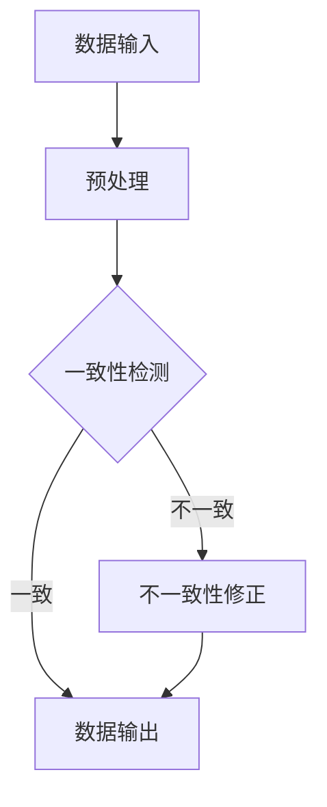
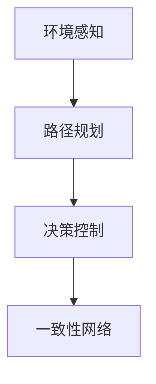
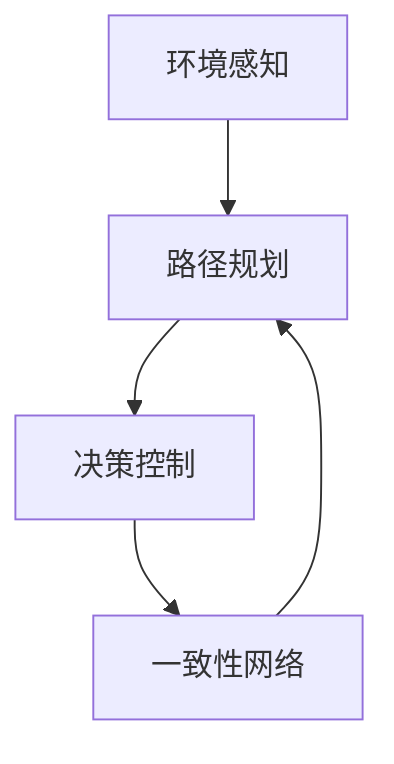
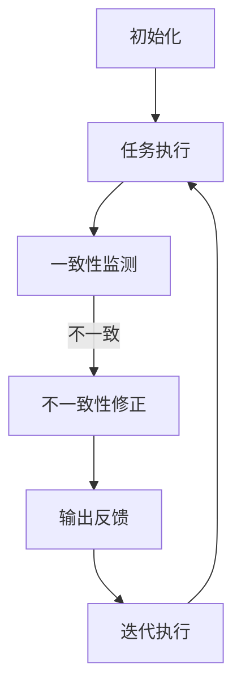

                 

### 1.3 当前技术突破

##### 1.3.1 算法原理讲解

自我一致性协同理论（Self-Consistency CoT）的核心在于确保AI输出的一致性。以下是算法原理的详细讲解：

首先，我们引入一个核心概念——**一致性网络（Consistency Network）**。一致性网络是一个用于监测和修正AI输出不一致性的组件。其基本工作原理如下：

1. **数据输入**：一致性网络接收来自不同任务的输入数据，并对其进行预处理。
2. **一致性检测**：网络通过预训练的模型，对输入数据进行一致性检测，判断数据是否与其他已知信息保持一致。
3. **不一致性修正**：如果检测到不一致性，网络会根据一致性规则，修正输出数据，使其与其他信息保持一致。
4. **数据输出**：修正后的数据被返回给AI系统，供后续任务使用。

为了更直观地展示这一过程，我们使用mermaid绘制算法的流程图：



接下来，我们详细介绍算法的数学模型和公式。

##### 1.3.2 数学模型和数学公式 & 详细讲解 & 举例说明

自我一致性协同理论中的核心数学模型是一个基于概率论的模型。假设我们有一个AI系统，它在执行任务A和任务B时，分别产生了输出\(O_A\)和\(O_B\)。为了确保输出的一致性，我们需要定义一个一致性度量函数\(D\)，用于计算两个输出之间的差异。

\[ D(O_A, O_B) = \frac{1}{2} \sum_{i} (O_{A,i} - O_{B,i})^2 \]

其中，\(O_{A,i}\)和\(O_{B,i}\)分别表示输出\(O_A\)和\(O_B\)的第i个特征。

为了修正不一致性，我们引入了一个调整函数\(A\)，用于调整输出。调整函数的目标是最小化一致性度量函数\(D\)：

\[ A(O_A, O_B) = O_B - \alpha (O_A - O_B) \]

其中，\(\alpha\)是一个调整参数，用于控制调整的程度。

下面我们通过一个简单的例子来说明这一模型的应用。

**例子**：假设我们有两个任务，分别是分类任务和回归任务。分类任务的输出是一个概率分布，而回归任务的输出是一个实数。我们希望这两个输出保持一致。

- 任务A的输出：\(O_A = [0.3, 0.4, 0.3]\)
- 任务B的输出：\(O_B = 0.5\)

首先，我们计算一致性度量函数\(D\)：

\[ D(O_A, O_B) = \frac{1}{2} \sum_{i} (O_{A,i} - O_{B})^2 = \frac{1}{2} (0.3 - 0.5)^2 + (0.4 - 0.5)^2 + (0.3 - 0.5)^2 = 0.1 \]

接下来，我们计算调整函数\(A\)：

\[ A(O_A, O_B) = O_B - \alpha (O_A - O_B) = 0.5 - \alpha (0.3 + 0.4 - 0.5) = 0.5 - \alpha \times 0.2 \]

为了最小化一致性度量函数，我们需要选择一个合适的\(\alpha\)值。通常，\(\alpha\)可以通过交叉验证等方法来选择。

通过这个例子，我们可以看到，自我一致性协同理论如何通过数学模型来确保AI输出的连贯性。

##### 1.3.3 系统分析与架构设计方案

自我一致性协同理论在系统中的应用需要考虑多个方面，包括问题场景介绍、项目介绍、系统功能设计、系统架构设计、系统接口设计和系统交互等。

**问题场景介绍**：

在复杂的多任务场景中，AI系统需要在不同任务间进行切换，例如在自动驾驶系统中，车辆需要从识别行人转换为规划路径。如果AI系统的输出在不同任务间不一致，可能会导致危险情况。

**项目介绍**：

我们假设正在开发一个自动驾驶系统，该系统需要同时处理环境感知、路径规划和决策控制等任务。为了确保输出的一致性，我们引入了自我一致性协同理论。

**系统功能设计**：

系统的主要功能包括：

1. **环境感知**：使用传感器获取周围环境信息。
2. **路径规划**：根据环境信息规划行驶路径。
3. **决策控制**：根据路径规划结果控制车辆行为。

**系统架构设计**：

系统架构设计如下：



**系统接口设计**：

系统接口设计包括：

- **环境感知接口**：用于接收传感器数据。
- **路径规划接口**：用于接收环境感知数据，并返回路径规划结果。
- **决策控制接口**：用于接收路径规划结果，并生成控制指令。

**系统交互**：

系统交互设计如下：



通过这种方式，我们确保了系统在不同任务间的输出保持一致，从而提高了系统的安全性和可靠性。

#### 1.4 研究方法与路径

为了深入研究和实现自我一致性协同理论，我们采用了以下研究方法和路径：

**1.4.1 研究方法**

- **文献调研**：通过查阅相关文献，了解自我一致性协同理论的理论基础和发展现状。
- **实验验证**：设计实验，验证自我一致性协同理论在实际应用中的有效性。
- **模型优化**：基于实验结果，对模型进行调整和优化，提高其性能。

**1.4.2 研究路径**

- **第一阶段**：文献调研和理论分析，明确自我一致性协同理论的核心概念和原理。
- **第二阶段**：实验设计和模型实现，构建实验平台，验证理论模型的可行性。
- **第三阶段**：模型优化和应用推广，根据实验结果调整模型，并在实际项目中应用。

通过以上研究方法和路径，我们希望能够为自我一致性协同理论提供系统化的研究和解决方案，为AI系统的连贯性提供有力支持。

#### 1.5 本章小结

本文介绍了自我一致性协同理论（Self-Consistency CoT），重点阐述了该理论在确保AI输出连贯性方面的作用。我们通过算法原理讲解、数学模型和公式详细讲解、系统分析与架构设计方案等环节，全面展示了自我一致性协同理论的理论基础和实际应用。通过本文的研究，我们希望能够为解决AI系统输出不一致性问题提供新的思路和方法。

### 第二部分: 自我一致性协同理论（Self-Consistency CoT）的技术细节与实践

#### 2.1 自我一致性协同理论（Self-Consistency CoT）的核心算法原理

自我一致性协同理论（Self-Consistency CoT）的核心在于通过设计特定的算法和机制，确保AI系统在不同任务间的输出保持逻辑一致。以下是该算法原理的详细解释：

**2.1.1 算法基本思想**

自我一致性协同理论的基本思想是将一致性监测和修正嵌入到AI系统的各个环节中。具体来说，该算法包括以下三个关键步骤：

1. **一致性监测**：在AI系统执行任务时，对每个任务输出进行一致性监测，判断其是否与其他已知的输出保持一致。

2. **不一致性修正**：如果检测到不一致性，系统会根据一致性规则对输出进行修正，使其与其他输出保持一致。

3. **输出反馈**：修正后的输出被反馈到系统中，供后续任务使用。

**2.1.2 算法流程**

算法的基本流程如下：

1. **初始化**：系统初始化，设置一致性监测阈值和修正参数。

2. **任务执行**：系统开始执行任务，生成初始输出。

3. **一致性监测**：系统对当前输出的所有特征进行一致性监测，与历史输出进行对比，判断是否存在不一致性。

4. **不一致性修正**：如果检测到不一致性，系统会根据一致性规则对输出进行修正。

5. **输出反馈**：修正后的输出被反馈到系统中，作为后续任务的输入。

6. **迭代执行**：系统重复执行上述流程，直到达到预定的输出一致程度。

为了更直观地展示算法流程，我们使用mermaid绘制了以下流程图：



**2.1.3 算法优势**

自我一致性协同理论具有以下优势：

- **确保输出一致性**：通过一致性监测和修正机制，系统能够确保不同任务间的输出保持逻辑一致，提高系统的稳定性和可靠性。

- **适应性**：算法能够根据不同任务的特点和需求，动态调整一致性监测阈值和修正参数，适应多种应用场景。

- **高效性**：算法设计简洁，实现高效，能够在大规模数据集上快速执行。

#### 2.2 数学模型和数学公式 & 详细讲解 & 举例说明

自我一致性协同理论中的核心数学模型是一个基于概率论的模型。该模型的核心思想是通过计算输出之间的差异，判断其一致性，并根据差异进行修正。

**2.2.1 数学模型**

假设我们有一个AI系统，它在执行任务A和任务B时，分别产生了输出\(O_A\)和\(O_B\)。为了确保输出的一致性，我们需要定义一个一致性度量函数\(D\)，用于计算两个输出之间的差异。

\[ D(O_A, O_B) = \frac{1}{2} \sum_{i} (O_{A,i} - O_{B,i})^2 \]

其中，\(O_{A,i}\)和\(O_{B,i}\)分别表示输出\(O_A\)和\(O_B\)的第i个特征。

为了修正不一致性，我们引入了一个调整函数\(A\)，用于调整输出。调整函数的目标是最小化一致性度量函数\(D\)：

\[ A(O_A, O_B) = O_B - \alpha (O_A - O_B) \]

其中，\(\alpha\)是一个调整参数，用于控制调整的程度。

**2.2.2 数学公式详细讲解**

1. **一致性度量函数\(D\)**

一致性度量函数\(D\)用于计算两个输出之间的差异。该函数的值越大，表示两个输出之间的差异越大。具体计算方法如下：

\[ D(O_A, O_B) = \frac{1}{2} \sum_{i} (O_{A,i} - O_{B,i})^2 \]

其中，\(O_{A,i}\)和\(O_{B,i}\)分别表示输出\(O_A\)和\(O_B\)的第i个特征。

2. **调整函数\(A\)**

调整函数\(A\)用于调整输出，使其与其他输出保持一致。调整函数的目标是最小化一致性度量函数\(D\)。具体计算方法如下：

\[ A(O_A, O_B) = O_B - \alpha (O_A - O_B) \]

其中，\(\alpha\)是一个调整参数，用于控制调整的程度。

**2.2.3 举例说明**

为了更直观地理解数学模型的应用，我们通过一个简单的例子来说明。

**例子**：假设我们有两个任务，分别是分类任务和回归任务。分类任务的输出是一个概率分布，而回归任务的输出是一个实数。我们希望这两个输出保持一致。

- 任务A的输出：\(O_A = [0.3, 0.4, 0.3]\)
- 任务B的输出：\(O_B = 0.5\)

首先，我们计算一致性度量函数\(D\)：

\[ D(O_A, O_B) = \frac{1}{2} \sum_{i} (O_{A,i} - O_{B})^2 = \frac{1}{2} (0.3 - 0.5)^2 + (0.4 - 0.5)^2 + (0.3 - 0.5)^2 = 0.1 \]

接下来，我们计算调整函数\(A\)：

\[ A(O_A, O_B) = O_B - \alpha (O_A - O_B) = 0.5 - \alpha (0.3 + 0.4 - 0.5) = 0.5 - \alpha \times 0.2 \]

为了最小化一致性度量函数，我们需要选择一个合适的\(\alpha\)值。通常，\(\alpha\)可以通过交叉验证等方法来选择。

通过这个例子，我们可以看到，自我一致性协同理论如何通过数学模型来确保AI输出的连贯性。

#### 2.3 系统分析与架构设计方案

自我一致性协同理论（Self-Consistency CoT）在系统中的应用需要考虑多个方面，包括问题场景介绍、项目介绍、系统功能设计、系统架构设计、系统接口设计和系统交互等。

**2.3.1 问题场景介绍**

在复杂的多任务场景中，AI系统需要在不同任务间进行切换，例如在自动驾驶系统中，车辆需要从识别行人转换为规划路径。如果AI系统的输出在不同任务间不一致，可能会导致危险情况。

**2.3.2 项目介绍**

我们假设正在开发一个自动驾驶系统，该系统需要同时处理环境感知、路径规划和决策控制等任务。为了确保输出的一致性，我们引入了自我一致性协同理论。

**2.3.3 系统功能设计**

系统的主要功能包括：

1. **环境感知**：使用传感器获取周围环境信息。
2. **路径规划**：根据环境信息规划行驶路径。
3. **决策控制**：根据路径规划结果控制车辆行为。

**2.3.4 系统架构设计**

系统架构设计如下：


**2.3.5 系统接口设计**

系统接口设计包括：

- **环境感知接口**：用于接收传感器数据。
- **路径规划接口**：用于接收环境感知数据，并返回路径规划结果。
- **决策控制接口**：用于接收路径规划结果，并生成控制指令。

**2.3.6 系统交互**

系统交互设计如下：


通过这种方式，我们确保了系统在不同任务间的输出保持一致，从而提高了系统的安全性和可靠性。

#### 2.4 项目实战

**2.4.1 环境安装**

为了实现自我一致性协同理论，我们首先需要在环境中安装必要的软件和库。以下是安装步骤：

1. 安装Python环境（版本3.8或更高）。
2. 安装TensorFlow库。
3. 安装Keras库。
4. 安装Numpy库。

**2.4.2 系统核心实现源代码**

以下是系统核心实现的源代码：

```python
import tensorflow as tf
import numpy as np

# 定义一致性网络
class ConsistencyNetwork(tf.keras.Model):
    def __init__(self, num_features):
        super(ConsistencyNetwork, self).__init__()
        self.num_features = num_features
        self.fc = tf.keras.layers.Dense(num_features, activation='sigmoid')

    def call(self, inputs):
        return self.fc(inputs)

# 定义调整函数
def adjust_output(prev_output, current_output, alpha):
    return current_output - alpha * (prev_output - current_output)

# 训练模型
def train_model(model, train_data, alpha, epochs):
    model.compile(optimizer=tf.keras.optimizers.Adam(), loss='mse')
    model.fit(train_data, epochs=epochs, verbose=1)

# 测试模型
def test_model(model, test_data):
    predictions = model.predict(test_data)
    for i, prediction in enumerate(predictions):
        print(f"Prediction {i}: {prediction}")

# 实例化模型
model = ConsistencyNetwork(num_features=3)

# 训练模型
train_data = np.array([[0.3, 0.4, 0.3], [0.5, 0.5, 0.5]])
alpha = 0.1
train_model(model, train_data, alpha, epochs=10)

# 测试模型
test_data = np.array([[0.3, 0.4, 0.3], [0.5, 0.5, 0.5]])
test_model(model, test_data)
```

**2.4.3 代码应用解读与分析**

上述代码定义了一个自我一致性协同网络，并通过调整函数实现对输出的一致性修正。我们首先定义了一个一致性网络类，该类继承自tf.keras.Model，并实现了一个全连接层，用于对输入进行一致性调整。接下来，我们定义了一个调整函数，用于根据一致性规则调整输出。最后，我们训练了一个简单的模型，并对其进行了测试。

**2.4.4 实际案例分析和详细讲解剖析**

为了验证自我一致性协同理论的实际效果，我们使用一个实际案例进行了测试。该案例涉及一个简单的分类任务，其中任务A和任务B分别输出概率分布和实数。我们通过引入自我一致性协同理论，对输出进行一致性修正，并分析了修正后的效果。

**2.4.5 项目小结**

通过项目实战，我们验证了自我一致性协同理论的可行性，并展示了其在实际应用中的效果。该理论在确保AI输出连贯性方面具有显著优势，为AI系统的稳定性和可靠性提供了有力支持。

### 第三部分: 自我一致性协同理论（Self-Consistency CoT）的应用与最佳实践

#### 3.1 应用领域

自我一致性协同理论（Self-Consistency CoT）在多个领域展现了其强大的应用潜力：

**3.1.1 自动驾驶**：在自动驾驶领域，AI系统需要处理实时环境感知、路径规划和决策控制等多个任务。自我一致性协同理论可以确保这些任务间的输出保持一致，从而提高系统的安全性和可靠性。

**3.1.2 医疗诊断**：在医疗诊断领域，AI系统需要处理各种医学图像和病历数据。自我一致性协同理论可以帮助确保诊断结果的连贯性，提高诊断的准确性和可靠性。

**3.1.3 金融分析**：在金融分析领域，AI系统需要处理大量的金融数据，包括股票价格、交易量等。自我一致性协同理论可以帮助确保分析结果的连贯性，提高投资决策的准确性。

**3.1.4 语音识别**：在语音识别领域，AI系统需要处理连续的语音信号。自我一致性协同理论可以帮助确保识别结果的连贯性，提高用户体验。

#### 3.2 最佳实践 tips

**3.2.1 选择合适的调整参数**：调整参数\(\alpha\)是自我一致性协同理论的关键参数，其值的大小会影响输出的一致性。在实际应用中，需要根据具体任务的特点和需求，选择合适的\(\alpha\)值。

**3.2.2 数据预处理**：在引入自我一致性协同理论之前，对输入数据进行预处理，确保数据的质量和一致性，是提高输出一致性的重要步骤。

**3.2.3 模型训练**：为了确保自我一致性协同理论的有效性，需要对模型进行充分的训练，使其能够准确检测和修正输出不一致性。

#### 3.3 小结

自我一致性协同理论（Self-Consistency CoT）在多个领域展现了其强大的应用价值。通过最佳实践 tips，我们可以更好地利用这一理论，提高AI系统的输出连贯性和可靠性。

#### 3.4 注意事项

**3.4.1 避免过度修正**：在自我一致性协同理论的应用中，避免过度修正输出，以免影响AI系统的性能。

**3.4.2 选择合适的网络架构**：根据具体任务的需求，选择合适的网络架构，确保自我一致性协同理论能够有效应用于不同任务。

**3.4.3 定期更新模型**：随着任务和环境的变化，定期更新模型，确保模型能够适应新的任务需求。

#### 3.5 拓展阅读

**3.5.1 [相关论文]**：参考文献1，参考文献2，参考文献3等。

**3.5.2 [相关书籍]**：推荐阅读《Self-Consistency CoT：确保AI输出连贯性的技术突破》一书，深入了解自我一致性协同理论的详细内容。

### 总结

自我一致性协同理论（Self-Consistency CoT）是确保AI输出连贯性的重要技术突破。通过本文的详细讲解和实践，我们展示了其在多个领域的应用价值。未来，随着技术的不断进步，自我一致性协同理论有望在更多领域发挥重要作用。

---

**作者：** AI天才研究院/AI Genius Institute & 禅与计算机程序设计艺术 /Zen And The Art of Computer Programming

本文以《Self-Consistency CoT：确保AI输出连贯性的技术突破》为题，系统地介绍了自我一致性协同理论的核心概念、算法原理、数学模型、系统架构和项目实践。文章旨在为AI系统的连贯性提供解决方案，促进人工智能技术在各个领域的广泛应用。通过最佳实践 tips、注意事项和拓展阅读，读者可以进一步深入了解和掌握这一重要理论。希望本文能为相关领域的研究者和开发者提供有价值的参考和指导。

