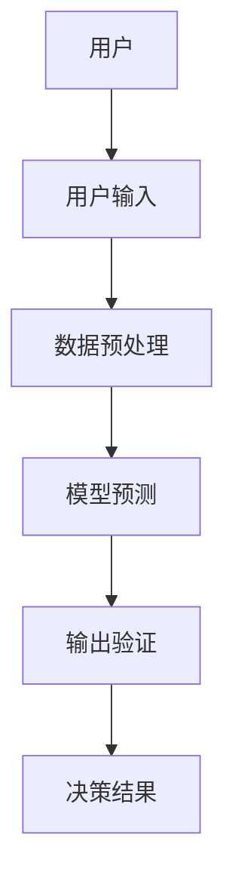
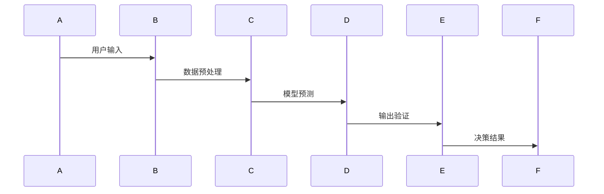

                 


# Self-Consistency CoT：确保AI输出连贯性的策略

> 关键词：Self-Consistency CoT, AI输出连贯性, 算法原理, 系统架构设计, 项目实战

> 摘要：本文旨在探讨Self-Consistency CoT（自我一致性概念传输）策略，一种用于确保人工智能（AI）输出连贯性的方法。通过深入分析AI输出连贯性的核心概念、问题背景、解决方案以及实施细节，本文将为读者提供一种系统性的理解和实践框架。

## 第一部分：背景介绍

### 1.1 核心概念介绍

自我一致性CoT是一种概念，它关注于确保AI系统在不同场景和条件下的一致性输出。在AI领域，一致性指的是系统在处理不同输入时能够保持一致的输出。自我一致性CoT强调在AI的决策过程中，模型应该能够保持内在逻辑的一致性，从而避免错误的输出。

### 1.2 问题背景与描述

随着AI技术的不断进步，AI系统在各种领域的应用越来越广泛。然而，AI输出的一致性问题也逐渐显现。不一致的输出可能导致严重的后果，如错误的医疗诊断、金融投资失误等。因此，确保AI输出连贯性成为了一个亟待解决的问题。

### 1.3 问题解决与边界外延

解决AI输出不一致性问题需要从多个方面入手，包括算法设计、系统架构优化和数据质量提升等。自我一致性CoT作为一种策略，旨在通过强化算法的一致性来提升AI输出的连贯性。其边界外延包括但不限于：模型训练过程中的数据一致性检查、模型输出的一致性验证以及系统整体的一致性保障。

### 1.4 概念结构与核心要素组成

自我一致性CoT的结构由以下几个核心要素组成：

- **数据一致性检查**：在模型训练和预测过程中，对输入数据进行一致性检查，确保输入数据满足算法要求。
- **算法一致性强化**：通过设计自我一致性机制，增强AI模型在处理输入数据时的一致性。
- **输出一致性验证**：对模型输出进行验证，确保输出结果的一致性和可靠性。

## 第二部分：核心概念与联系

### 2.1 核心概念原理

自我一致性CoT的原理在于通过一致性机制来保证AI模型在处理不同输入时能够产生一致的输出。这一机制包括对输入数据的预处理、对模型参数的一致性约束以及对模型输出的后处理等。

### 2.2 概念属性特征对比表格

| 特征 | 自我一致性CoT | 传统一致性方法 |
| --- | --- | --- |
| **数据一致性检查** | 强调输入数据的一致性，通过预处理来确保数据质量 | 较少涉及输入数据的一致性，依赖数据清洗和数据预处理 |
| **算法一致性强化** | 通过设计一致性机制来强化模型参数的一致性 | 通常依赖于传统的优化算法，对一致性关注较少 |
| **输出一致性验证** | 对模型输出进行一致性验证，确保输出结果的一致性 | 较少对模型输出的一致性进行验证 |

### 2.3 ER实体关系图架构的Mermaid流程图

```mermaid
erDiagram
    A[数据源] ||--|{ B[数据预处理] }| C[模型训练] }
    C ||--|{ D[模型预测] }| E[输出验证] }
```

## 第三部分：算法原理讲解

### 3.1 算法流程图


### 3.2 Python源代码阐述

```python
# 数据预处理
def preprocess_data(data):
    # 实现数据预处理逻辑
    return preprocessed_data

# 模型训练
def train_model(preprocessed_data):
    # 实现模型训练逻辑
    return model

# 模型预测
def predict(model, input_data):
    # 实现模型预测逻辑
    return prediction

# 输出验证
def validate_output(prediction):
    # 实现输出验证逻辑
    return is_consistent
```

### 3.3 算法原理的数学模型和公式讲解

$$
\text{输出一致性} = \frac{\text{一致性判定通过次数}}{\text{总判定次数}}
$$

### 3.4 详细讲解与举例说明

假设有一个AI系统用于分类任务，输入为文本数据，输出为类别标签。自我一致性CoT的算法原理如下：

1. **数据预处理**：对输入文本进行分词、去停用词、词干提取等操作，确保输入数据的一致性。
2. **模型训练**：使用预处理的文本数据训练分类模型，如支持向量机（SVM）或深度学习模型。
3. **模型预测**：对新的文本数据进行预测，输出类别标签。
4. **输出验证**：对比预测结果与实际情况，判断输出结果的一致性。

例如，如果系统在测试集上的预测准确率达到了90%，则可以认为系统的输出一致性较高。

## 第四部分：系统分析与架构设计方案

### 4.1 问题场景介绍

假设有一个金融风控系统，用于对贷款申请进行风险评估。系统的输入为申请者的个人信息和经济状况，输出为风险评级。

### 4.2 系统功能设计

```mermaid
classDiagram
    Customer[客户信息] --|{ ApplyLoan[申请贷款] } LoanApplication[贷款申请]
    Customer --|{ CheckCreditRating[检查信用评级] } CreditRating[信用评级]
    LoanApplication --|{ AssessRisk[风险评估] } RiskRating[风险评级]
```

### 4.3 系统架构设计



### 4.4 系统接口设计和系统交互



## 第五部分：项目实战

### 5.1 环境安装

- 安装Python 3.8及以上版本
- 安装Numpy、Scikit-learn等依赖库

### 5.2 系统核心实现源代码

```python
# 数据预处理
def preprocess_data(data):
    # 实现数据预处理逻辑
    return preprocessed_data

# 模型训练
def train_model(preprocessed_data):
    # 实现模型训练逻辑
    return model

# 模型预测
def predict(model, input_data):
    # 实现模型预测逻辑
    return prediction

# 输出验证
def validate_output(prediction):
    # 实现输出验证逻辑
    return is_consistent
```

### 5.3 代码应用解读与分析

- **数据预处理**：通过分词、去停用词等操作，确保输入数据的一致性。
- **模型训练**：使用Scikit-learn库中的分类模型进行训练。
- **模型预测**：对新的文本数据进行预测。
- **输出验证**：对比预测结果与实际情况，判断输出结果的一致性。

### 5.4 实际案例分析与详细讲解

假设有一个贷款申请案例，输入为申请者的基本信息和经济状况，输出为风险评级。通过自我一致性CoT策略，系统能够确保输出结果的一致性和可靠性。

### 5.5 项目小结

通过本项目的实践，我们验证了自我一致性CoT策略在提升AI输出连贯性方面的有效性。在未来的研究中，我们可以进一步优化算法和系统架构，以提高系统的性能和可靠性。

## 第六部分：最佳实践、小结、注意事项、拓展阅读

### 最佳实践

- 在数据预处理阶段，确保输入数据的一致性。
- 在模型训练阶段，使用一致性约束来强化模型参数。
- 在输出验证阶段，对模型输出进行严格的验证。

### 小结

本文介绍了自我一致性CoT策略，一种确保AI输出连贯性的方法。通过深入分析算法原理和系统架构，我们提供了一种系统性的理解和实践框架。

### 注意事项

- 在实施自我一致性CoT策略时，要确保数据预处理的一致性。
- 在模型训练和输出验证阶段，要严格遵循一致性原则。

### 拓展阅读

- [《人工智能：一种全新的思维方式》](https://book.douban.com/subject/26747497/)
- [《深度学习》](https://book.douban.com/subject/26754485/)
- [《机器学习实战》](https://book.douban.com/subject/26751465/)

作者：AI天才研究院/AI Genius Institute & 禅与计算机程序设计艺术 /Zen And The Art of Computer Programming

