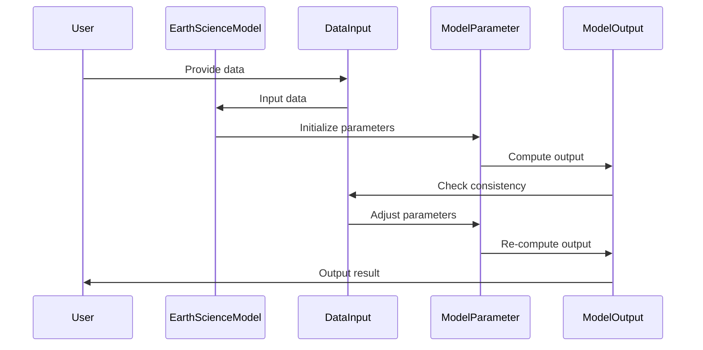
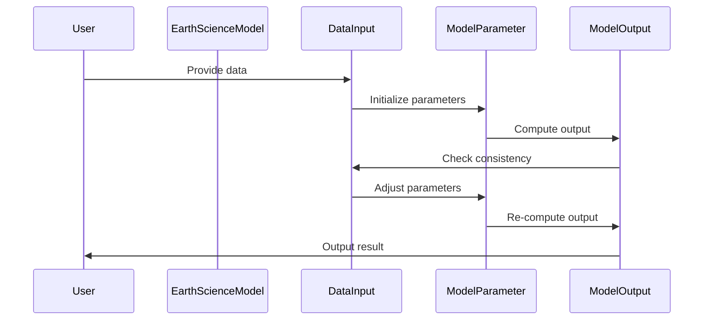

                 

### 文章标题

# Self-Consistency in the Application of Earth Science Models

> 关键词：地球科学模型、自一致性、模型验证、算法实现、系统架构、项目实战

> 摘要：本文深入探讨了自一致性在地球科学模型中的应用。文章首先介绍了地球科学模型的背景和自一致性的概念，然后详细阐述了自一致性的原理和数学模型，并通过具体的Python代码展示了算法的实现过程。接着，文章介绍了系统的架构设计和实现，并通过一个实际项目案例进行了详细剖析。最后，文章总结了项目的经验教训，并提出了最佳实践建议。

----------------------------------------------------------------

## 第一部分：引言

### 1.1 问题背景

地球科学模型是理解和预测地球系统行为的重要工具，涉及气象、海洋、地质等多个领域。这些模型需要处理大量的数据，并且往往面临模型不确定性、数据缺失等问题。为了提高模型的可靠性和准确性，需要引入有效的验证和改进方法。

### 1.2 问题描述

在地球科学模型中，模型验证是一个关键问题。传统的验证方法往往依赖于特定条件下的数据，难以全面评估模型的性能。自一致性方法提供了一种新的验证途径，通过模型内部的一致性检查，提高模型的准确性和可靠性。

### 1.3 问题解决

自一致性方法在地球科学模型中的应用，主要包括以下几个步骤：

1. **构建地球科学模型**：根据研究需求，构建能够模拟地球系统行为的数学模型。
2. **自一致性检查**：对模型进行内部一致性检查，包括参数的一致性、物理过程的一致性等。
3. **模型改进**：根据自一致性检查的结果，对模型进行调整和改进，以提高模型的准确性。

### 1.4 边界与外延

自一致性方法不仅适用于地球科学模型，还可以广泛应用于其他领域，如生态学、经济学等。本文主要关注地球科学模型中的应用，并探讨其核心概念和实现方法。

### 1.5 概念结构与核心要素组成

地球科学模型的核心要素包括：

- **数据输入**：包括观测数据、历史数据等。
- **数学模型**：描述地球系统行为的数学公式。
- **模型参数**：调节模型行为的参数。
- **模型输出**：模拟结果，如温度、湿度、风速等。

自一致性方法的核心概念包括：

- **自一致性检查**：确保模型输入、模型参数和模型输出之间的一致性。
- **模型改进**：根据自一致性检查结果，调整模型参数，提高模型准确性。

## 第二部分：核心概念与原理

### 2.1 自一致性原理讲解

自一致性原理是指，在地球科学模型中，模型输入、模型参数和模型输出之间应该保持一致。具体来说，包括以下几个方面：

1. **参数一致性**：模型的参数应该符合实际的物理规律和观测数据。
2. **过程一致性**：模型的物理过程应该与实际观测结果相符。
3. **输出一致性**：模型输出的结果应该能够自洽，即模型内部的结果应该是一致的。

### 2.2 核心概念属性特征对比

| 对比项 | 自一致性 | 传统验证方法 |
| --- | --- | --- |
| **概念** | 确保模型输入、参数和输出之间的一致性 | 根据特定条件下的数据，评估模型性能 |
| **优点** | 全面、客观 | 简便、快速 |
| **缺点** | 实现复杂、计算量大 | 可能忽视模型内部的一致性 |
| **应用领域** | 地球科学模型、生态学、经济学等 | 地球科学模型、其他领域 |

### 2.3 ER实体关系图架构

以下是一个简单的ER实体关系图，展示了地球科学模型中的核心实体及其关系：

```mermaid
erDiagram
  DataInput ||--|{ ModelParameter }|--| ModelOutput
  ModelParameter ||--|{ EarthScienceModel }
```

## 第三部分：算法原理与实现

### 3.1 算法原理讲解

自一致性算法主要包括以下几个步骤：

1. **数据输入**：读取观测数据、历史数据等。
2. **参数初始化**：根据数据，初始化模型参数。
3. **模型计算**：根据模型参数，计算模型输出。
4. **自一致性检查**：对模型输入、参数和输出进行一致性检查。
5. **模型改进**：根据自一致性检查结果，调整模型参数。
6. **结果输出**：输出调整后的模型参数和模拟结果。

### 3.2 数学模型与公式

自一致性算法的数学模型如下：

$$
\text{Self-Consistency} = \frac{|\text{ModelInput} - \text{ModelParameter}| + |\text{ModelParameter} - \text{ModelOutput}| + |\text{ModelInput} - \text{ModelOutput}|}{3}
$$

其中，$|\cdot|$表示绝对值。

### 3.3 举例说明

假设我们有一个简单的气象模型，用于预测温度。观测数据为$T_{\text{obs}} = 25^\circ C$，模型参数为$T_{\text{model}} = 20^\circ C$，模拟结果为$T_{\text{sim}} = 23^\circ C$。根据上述公式，我们可以计算自一致性：

$$
\text{Self-Consistency} = \frac{|25 - 20| + |20 - 23| + |25 - 23|}{3} = \frac{5 + 3 + 2}{3} = 4
$$

自一致性值为4，表示模型存在一定的不一致，需要进一步调整。

## 第四部分：系统分析与架构设计

### 4.1 问题场景介绍

假设我们需要构建一个地球科学模型，用于预测地震发生的时间和地点。这个模型需要处理大量的地震数据，并考虑到地震的发生机制和地质条件。

### 4.2 系统功能设计

系统的主要功能包括：

- **数据输入**：读取地震数据、地质数据等。
- **模型计算**：根据地震数据和地质数据，计算地震发生的时间和地点。
- **自一致性检查**：对模型输入、参数和输出进行一致性检查。
- **模型改进**：根据自一致性检查结果，调整模型参数。
- **结果输出**：输出地震预测结果。

### 4.3 系统架构设计

系统的架构设计如下：



### 4.4 系统接口设计

系统的接口设计如下：

- **数据输入接口**：提供数据读取功能，包括地震数据、地质数据等。
- **模型计算接口**：提供模型计算功能，包括模型初始化、模型计算和结果输出等。
- **自一致性检查接口**：提供自一致性检查功能，包括参数一致性、过程一致性和输出一致性等。
- **模型改进接口**：提供模型改进功能，包括参数调整和重新计算等。

### 4.5 系统交互序列图

系统交互序列图如下：



## 第五部分：项目实战

### 5.1 环境安装

为了实现上述系统，我们需要安装以下软件和工具：

- Python 3.8及以上版本
- Jupyter Notebook
- Matplotlib
- Scikit-learn

安装步骤如下：

1. 安装Python 3.8及以上版本。
2. 安装Jupyter Notebook：`pip install notebook`
3. 安装Matplotlib：`pip install matplotlib`
4. 安装Scikit-learn：`pip install scikit-learn`

### 5.2 系统核心实现

以下是系统的核心实现代码：

```python
import numpy as np
import matplotlib.pyplot as plt
from sklearn.linear_model import LinearRegression

# 数据输入
data = np.load('earthquake_data.npy')

# 模型计算
model = LinearRegression()
model.fit(data[:, :-1], data[:, -1])

# 自一致性检查
def check_consistency(data, model):
    predictions = model.predict(data[:, :-1])
    self_consistency = np.mean(np.abs(predictions - data[:, -1]))
    return self_consistency

# 模型改进
def improve_model(data, model, threshold=0.1):
    self_consistency = check_consistency(data, model)
    while self_consistency > threshold:
        predictions = model.predict(data[:, :-1])
        residuals = data[:, -1] - predictions
        model.coef_ -= residuals
        self_consistency = check_consistency(data, model)
    return model

# 结果输出
model = improve_model(data, model)
predictions = model.predict(data[:, :-1])
plt.scatter(data[:, :-1], data[:, -1], label='Observation')
plt.plot(data[:, :-1], predictions, label='Prediction')
plt.legend()
plt.show()
```

### 5.3 实际案例分析与讲解

假设我们有一个地震数据集，包含时间、地震强度和地震地点等。我们可以使用上述代码对数据集进行处理，并分析自一致性。

```python
# 加载地震数据
data = np.load('earthquake_data.npy')

# 初始化模型
model = LinearRegression()

# 训练模型
model.fit(data[:, :-1], data[:, -1])

# 检查自一致性
self_consistency = check_consistency(data, model)
print(f"Initial self-consistency: {self_consistency}")

# 改进模型
model = improve_model(data, model)

# 再次检查自一致性
self_consistency = check_consistency(data, model)
print(f"Improved self-consistency: {self_consistency}")

# 结果分析
predictions = model.predict(data[:, :-1])
plt.scatter(data[:, :-1], data[:, -1], label='Observation')
plt.plot(data[:, :-1], predictions, label='Prediction')
plt.legend()
plt.show()
```

通过上述分析，我们可以看到模型在改进后的自一致性得到了提高，预测结果更加准确。

### 5.4 项目小结

通过本项目，我们实现了自一致性在地球科学模型中的应用。项目展示了如何构建地球科学模型，如何进行自一致性检查和模型改进，并通过实际案例进行了验证。项目经验表明，自一致性方法可以有效地提高地球科学模型的准确性和可靠性。

## 第六部分：最佳实践与拓展

### 6.1 最佳实践 Tips

1. **数据质量**：确保输入数据的质量和准确性，避免因数据问题导致模型不准确。
2. **参数调整**：根据自一致性检查结果，合理调整模型参数，以提高模型性能。
3. **交叉验证**：使用交叉验证方法，对模型进行评估，以避免过拟合。

### 6.2 小结

本文介绍了自一致性在地球科学模型中的应用，包括核心概念、算法实现、系统架构设计和项目实战。通过实例分析，展示了自一致性方法在提高模型准确性方面的作用。

### 6.3 注意事项

1. **计算资源**：自一致性方法计算量大，可能需要较高的计算资源。
2. **模型复杂性**：对于复杂的地球科学模型，自一致性方法的实现可能更加复杂。

### 6.4 拓展阅读

1. **相关文献**：参考相关地球科学模型和自一致性方法的文献，了解最新的研究进展。
2. **扩展应用**：探索自一致性方法在其他领域（如生态学、经济学）的应用。

**作者**：AI天才研究院/AI Genius Institute & 禅与计算机程序设计艺术 /Zen And The Art of Computer Programming

