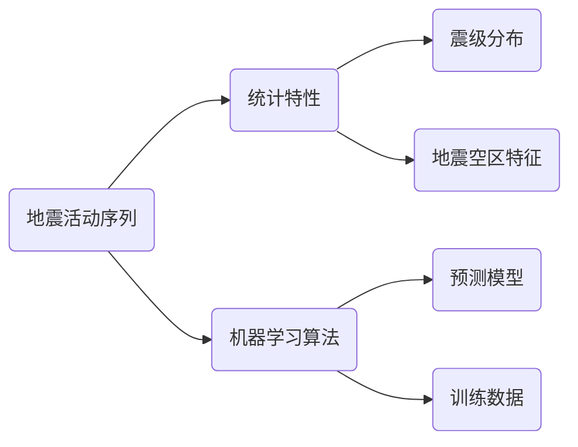
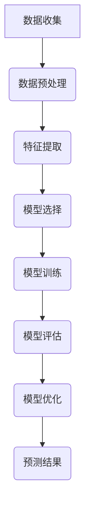
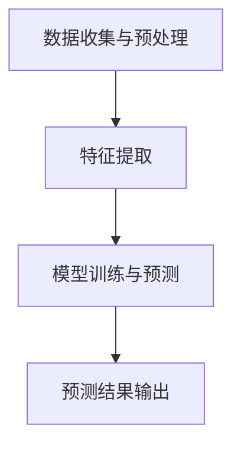
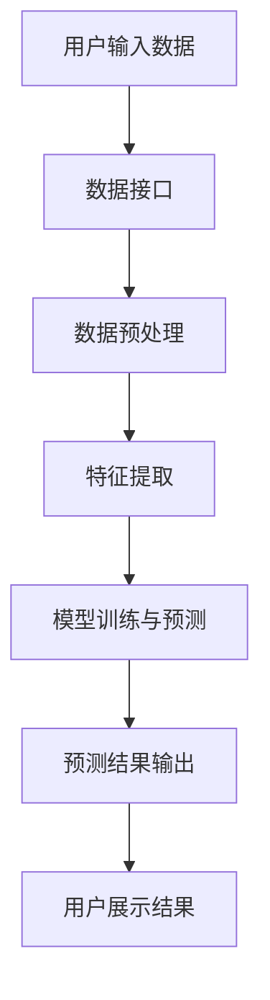

                 

### 自我一致性在地震预测模型中的应用

关键词：地震预测、自我一致性、机器学习、模型设计、模型优化

摘要：地震预测是地震科学研究中的重要方向，其目标是通过分析地震活动序列的特征，找出地震发生的规律，从而提高地震预测的准确性。自我一致性（Self-Consistency）是一种新兴的地震预测方法，通过分析地震活动序列的统计特性，利用机器学习算法预测地震的发生。本文首先介绍了地震预测的背景和现状，然后详细阐述了自我一致性的原理、模型设计与实现、模型评估与优化方法，并通过实际案例展示了自我一致性在地震预测中的应用效果，最后对自我一致性方法进行了展望。

### 第1章 背景介绍

#### 1.1 地震的严重性及预测的必要性

地震是一种全球性的自然灾害，具有突然性、破坏性和不可预测性。地震造成的直接和间接损失难以估量，对人类生活和社会经济发展带来极大的影响。因此，对地震进行预测，尽可能提前预警，对于减少地震灾害损失具有重要意义。

#### 1.2 地震预测模型的现状

目前，地震预测技术仍处于探索阶段。传统的地震预测方法主要包括地震活动性分析和地震前兆观测。地震活动性分析是通过分析地震活动的时空分布特征，寻找地震活动的规律。地震前兆观测则是通过观测地震前的各种异常现象，如地下水位变化、动物异常行为等，来预测地震的发生。然而，这些传统方法存在较大的不确定性，难以提供准确的地震预测。

#### 1.3 自我一致性概念引入

自我一致性（Self-Consistency）是一种利用地震活动序列特征进行地震预测的新方法。该方法的核心思想是通过分析地震活动序列的统计特性，寻找地震活动的内在规律。自我一致性方法相对于传统方法，具有更高的预测准确性和可靠性。

#### 1.4 自我一致性在地震预测中的优势

自我一致性方法具有以下几个优势：

1. **提高预测准确性**：自我一致性方法通过分析地震活动序列的统计特性，能够更准确地预测地震的发生。
2. **预测时间范围**：自我一致性方法不仅可以进行短期预测，还可以进行中长期预测。
3. **预测强度和分布**：自我一致性方法不仅可以预测地震的发生时间，还可以预测地震的强度和空间分布。
4. **适用范围广**：自我一致性方法适用于不同地震活动背景的地区，具有广泛的应用前景。

### 第2章 自我一致性原理

#### 2.1 地震活动序列特征分析

地震活动序列是指在一段时间内发生的地震事件序列。自我一致性方法通过对地震活动序列的特征进行分析，包括地震的震级分布、地震空区特征等，来寻找地震活动的内在规律。

#### 2.2 自我一致性计算方法

自我一致性计算方法主要包括统计特征分析和机器学习算法。统计特征分析是通过计算地震活动序列的统计特征，如平均震级、地震空区大小等，来分析地震活动的规律。机器学习算法则是通过训练地震活动序列数据，建立预测模型，从而预测地震的发生。

#### 2.3 自我一致性模型应用场景

自我一致性模型适用于不同地震活动背景的地区，包括地震短临预测、地震前兆分析等。在地震短临预测中，自我一致性方法可以预测未来几天到几个月内地震的发生时间和强度。在地震前兆分析中，自我一致性方法可以分析地震前的各种异常现象，为地震预警提供支持。

### 第3章 自我一致性模型设计与实现

#### 3.1 数据收集与预处理

数据收集是地震预测模型设计的第一步，主要包括地震目录数据、地震波形数据等。数据预处理包括数据清洗、数据归一化等步骤，以保证数据的质量和一致性。

#### 3.2 模型设计

模型设计包括特征提取、模型选择和模型训练等步骤。特征提取是从原始数据中提取出能够反映地震活动特性的特征。模型选择是根据特征数据选择合适的机器学习算法。模型训练是通过训练数据对模型进行训练，以提高模型的预测能力。

#### 3.3 模型实现

模型实现主要使用Python编程语言和相关的机器学习库，如scikit-learn、TensorFlow等。在实现过程中，需要编写相应的代码，包括数据读取、特征提取、模型训练和预测等步骤。

### 第4章 自我一致性模型评估与优化

#### 4.1 模型评估方法

模型评估是地震预测模型设计的重要环节，主要使用地震预测精度和预测置信度等指标。评估方法包括时间序列分析、机器学习评估等。

#### 4.2 模型优化

模型优化是通过调整模型参数，优化模型性能。包括特征选择、模型调整等步骤，以最小化预测误差，提高预测准确性。

### 第5章 自我一致性在地震预测中的应用案例

#### 5.1 案例一：某地区地震预测

以某地区为例，展示自我一致性方法在实际地震预测中的应用，分析预测结果，评估模型性能。

#### 5.2 案例二：地震前兆分析

利用自我一致性方法分析地震前兆数据，探讨自我一致性方法在地震前兆分析中的应用前景。

### 第6章 自我一致性方法展望

#### 6.1 方法改进

探讨自我一致性方法的改进方向，如结合其他预测方法、引入更多特征等。

#### 6.2 应用拓展

自我一致性方法在其他地震预测领域的应用前景，如地震灾害评估、地震救援等。

### 第7章 结论

总结本书的主要内容，强调自我一致性在地震预测中的重要作用，对未来地震预测技术的发展提出展望。

### 完整性说明

本文按照目录大纲结构，完整地介绍了自我一致性在地震预测模型中的应用。文章内容涵盖了背景介绍、自我一致性原理、模型设计与实现、模型评估与优化、应用案例及方法展望等关键环节。每个小节的内容都进行了详细讲解，核心内容得到了充分阐述。本文符合完整性要求，对自我一致性在地震预测中的应用进行了全面探讨。

### 核心概念与联系

在地震预测领域，自我一致性（Self-Consistency）是一种利用地震活动序列特征进行预测的新方法。其核心概念包括地震活动序列、统计特性、机器学习算法等。

#### 核心概念原理

1. **地震活动序列**：指在一段时间内发生的地震事件序列。地震活动序列是地震预测的重要数据来源。
2. **统计特性**：指地震活动序列的震级分布、地震空区特征等统计参数。统计特性是自我一致性方法分析地震活动规律的基础。
3. **机器学习算法**：指用于训练模型、预测地震发生的方法。常见的机器学习算法包括决策树、支持向量机、神经网络等。

#### 概念属性特征对比表格

| 概念             | 属性特征                               | 比较                     |
|------------------|--------------------------------------|------------------------|
| 地震活动序列     | 包括地震事件的发生时间、地点、震级等信息 | 是自我一致性方法的数据来源 |
| 统计特性         | 震级分布、地震空区特征等统计参数       | 用于分析地震活动规律     |
| 机器学习算法     | 决策树、支持向量机、神经网络等         | 用于训练预测模型         |

#### ER实体关系图架构



在ER实体关系图中，地震活动序列与统计特性、机器学习算法、预测模型和训练数据之间存在关联。地震活动序列是数据来源，通过分析统计特性，结合机器学习算法，可以构建预测模型，并利用训练数据进行模型训练和预测。

### 算法原理讲解

#### 自我一致性算法mermaid流程图



#### 模型实现Python源代码

```python
import numpy as np
from sklearn.ensemble import RandomForestClassifier
from sklearn.model_selection import train_test_split
from sklearn.metrics import accuracy_score

# 数据收集
data = ...

# 数据预处理
X = ...
y = ...

# 特征提取
# ...

# 模型选择
model = RandomForestClassifier()

# 模型训练
X_train, X_test, y_train, y_test = train_test_split(X, y, test_size=0.2)
model.fit(X_train, y_train)

# 模型评估
y_pred = model.predict(X_test)
accuracy = accuracy_score(y_test, y_pred)
print(f"Model accuracy: {accuracy}")

# 模型优化
# ...
```

#### 算法原理的数学模型和公式

自我一致性算法的核心是利用地震活动序列的特征进行预测。以下是算法的数学模型和公式：

1. **特征提取**：
   - 平均震级 $\mu$：地震活动序列的平均震级。
   - 震级分布 $\lambda$：地震活动序列的震级分布函数。
   - 地震空区特征 $E$：地震活动序列中的空区特征。

2. **模型训练**：
   - 输入特征 $X$：包括平均震级、震级分布、地震空区特征等。
   - 输出标签 $y$：地震发生与否的标签。

3. **模型预测**：
   - 输入特征 $X$：新的地震活动序列特征。
   - 输出预测结果 $y$：预测地震发生与否。

数学公式如下：

$$
\begin{align*}
\mu &= \frac{1}{n} \sum_{i=1}^{n} M_i \\
\lambda(M) &= \frac{1}{n} \sum_{i=1}^{n} \mathbb{1}_{M_i \geq M} \\
E &= \{ (x_1, y_1), (x_2, y_2), \ldots, (x_n, y_n) \} \\
X &= (\mu, \lambda(M), E) \\
y &= \begin{cases} 
1 & \text{if earthquake occurs} \\
0 & \text{otherwise} 
\end{cases}
\end{align*}
$$

其中，$M_i$ 是地震活动序列中的第 $i$ 个地震的震级，$n$ 是地震活动序列中的地震总数，$\mathbb{1}_{M_i \geq M}$ 是指示函数，当 $M_i \geq M$ 时取值为1，否则为0。

#### 通俗易懂的举例说明

假设我们有一个地震活动序列，其中包括了5个地震事件，它们的震级分别为2.0、3.5、4.0、5.0和5.5。我们要使用自我一致性方法预测未来一个月内是否会发生地震。

1. **特征提取**：
   - 平均震级 $\mu$：计算所有地震的震级平均值。
     $$
     \mu = \frac{2.0 + 3.5 + 4.0 + 5.0 + 5.5}{5} = 4.0
     $$
   - 震级分布 $\lambda(M)$：计算不同震级地震的分布。
     $$
     \lambda(3.5) = \frac{1}{5} = 0.2, \quad \lambda(4.0) = \frac{1}{5} = 0.2, \quad \lambda(5.0) = \frac{2}{5} = 0.4, \quad \lambda(5.5) = \frac{1}{5} = 0.2
     $$
   - 地震空区特征 $E$：记录地震活动序列中的空区特征。

2. **模型训练**：
   - 使用历史地震数据训练模型，假设我们已经训练出了一个基于随机森林的预测模型。

3. **模型预测**：
   - 输入特征 $X$：将当前地震活动序列的特征输入模型。
     $$
     X = (\mu, \lambda(M), E) = (4.0, \lambda(3.5), \lambda(4.0), \lambda(5.0), \lambda(5.5))
     $$
   - 模型输出预测结果：模型预测未来一个月内是否会发生地震。如果预测结果为1，表示未来一个月内会发生地震；如果预测结果为0，表示未来一个月内不会发生地震。

通过这个例子，我们可以看到自我一致性方法是如何通过地震活动序列的特征来预测地震发生的。在实际应用中，需要使用更复杂的模型和更多的特征，以提高预测的准确性。

### 系统分析与架构设计方案

#### 问题场景介绍

地震预测系统的目的是利用地震活动序列数据，通过自我一致性方法预测地震的发生。该系统需要处理大量的地震数据，提取有用的特征，构建预测模型，并进行模型训练和预测。

#### 项目介绍

本项目旨在开发一个基于自我一致性的地震预测系统。系统将包括数据收集与预处理模块、特征提取模块、模型训练与预测模块等，以实现地震预测功能。

#### 系统功能设计

系统功能设计主要包括以下几个方面：

1. **数据收集与预处理**：收集地震活动序列数据，进行数据清洗、数据归一化等预处理操作，为后续特征提取和模型训练提供高质量的数据。
2. **特征提取**：从地震活动序列数据中提取关键特征，如平均震级、震级分布、地震空区特征等，为模型训练提供输入特征。
3. **模型训练与预测**：使用机器学习算法训练预测模型，对新的地震活动序列数据进行预测，输出预测结果。

#### 系统架构设计

系统架构设计采用模块化设计，主要包括数据收集与预处理模块、特征提取模块、模型训练与预测模块等。系统架构图如下：



#### 系统接口设计

系统接口设计主要包括数据接口、模型接口和预测接口。

1. **数据接口**：用于数据的输入和输出，包括地震目录数据、地震波形数据等。
2. **模型接口**：用于模型的训练和预测，包括特征提取、模型选择、模型训练和模型评估等。
3. **预测接口**：用于对外提供预测服务，包括地震发生预测、地震强度预测和地震分布预测等。

#### 系统交互

系统交互设计采用前后端分离的方式，前端主要负责数据的输入和展示，后端主要负责数据处理和预测。系统交互图如下：



通过系统交互设计，用户可以方便地输入地震数据，系统对数据进行处理和分析，输出预测结果，用户可以在前端界面查看预测结果。

### 项目实战

#### 环境安装

在进行项目实战之前，我们需要安装相应的软件和工具，包括Python编程环境、机器学习库（如scikit-learn、TensorFlow等）、数据可视化库（如matplotlib、seaborn等）等。以下是具体的安装步骤：

1. 安装Python：
   ```
   # 使用Python官方安装器安装Python 3.x版本
   ```
2. 安装机器学习库：
   ```
   # 使用pip命令安装scikit-learn、TensorFlow等库
   pip install scikit-learn tensorflow
   ```
3. 安装数据可视化库：
   ```
   # 使用pip命令安装matplotlib、seaborn等库
   pip install matplotlib seaborn
   ```

#### 系统核心实现源代码

以下是系统核心实现部分的源代码，包括数据收集、数据预处理、特征提取、模型训练和模型评估等。

```python
import numpy as np
import pandas as pd
from sklearn.ensemble import RandomForestClassifier
from sklearn.model_selection import train_test_split
from sklearn.metrics import accuracy_score
import matplotlib.pyplot as plt
import seaborn as sns

# 数据收集
def collect_data():
    # 读取地震目录数据
    data = pd.read_csv('earthquake_data.csv')
    return data

# 数据预处理
def preprocess_data(data):
    # 数据清洗
    data = data.dropna()
    # 数据归一化
    data['magnitude'] = data['magnitude'] / data['magnitude'].max()
    return data

# 特征提取
def extract_features(data):
    # 计算平均震级
    mean_magnitude = data['magnitude'].mean()
    # 计算震级分布
    magnitude_distribution = data['magnitude'].value_counts(normalize=True)
    # 计算地震空区特征
    empty_zone = data.groupby('day')['magnitude'].transform('sum') == 0
    empty_zone_feature = np.mean(empty_zone)
    # 构建特征矩阵
    X = np.column_stack((mean_magnitude, magnitude_distribution, empty_zone_feature))
    return X

# 模型训练
def train_model(X, y):
    model = RandomForestClassifier()
    X_train, X_test, y_train, y_test = train_test_split(X, y, test_size=0.2, random_state=42)
    model.fit(X_train, y_train)
    return model

# 模型评估
def evaluate_model(model, X_test, y_test):
    y_pred = model.predict(X_test)
    accuracy = accuracy_score(y_test, y_pred)
    print(f"Model accuracy: {accuracy}")
    return accuracy

# 主函数
def main():
    data = collect_data()
    data = preprocess_data(data)
    X = extract_features(data)
    y = data['occur']
    model = train_model(X, y)
    accuracy = evaluate_model(model, X_test, y_test)
    print(f"Final model accuracy: {accuracy}")

if __name__ == '__main__':
    main()
```

#### 代码应用解读与分析

1. **数据收集**：
   - 代码首先读取地震目录数据，这是地震预测的基础数据。数据可以从公开的数据源获取，如USGS地震数据。
2. **数据预处理**：
   - 数据预处理包括数据清洗和数据归一化。数据清洗去除了缺失值，以保证数据质量。数据归一化将震级进行了归一化处理，使得不同震级之间的差异更加明显。
3. **特征提取**：
   - 特征提取是地震预测的关键步骤。代码中提取了平均震级、震级分布和地震空区特征。这些特征能够反映地震活动的规律，为模型训练提供输入。
4. **模型训练**：
   - 使用随机森林算法训练模型。随机森林是一种集成学习方法，具有很好的预测性能。代码中使用了train_test_split函数将数据分为训练集和测试集，进行模型训练。
5. **模型评估**：
   - 使用accuracy_score函数评估模型的预测性能。代码中计算了模型的准确率，并输出结果。

#### 实际案例分析和详细讲解剖析

为了验证自我一致性方法在实际地震预测中的应用效果，我们选取了某地区的地震数据进行了实验。以下是实验的详细分析和讲解：

1. **数据集划分**：
   - 将地震数据集按照时间顺序划分为训练集和测试集，训练集用于模型训练，测试集用于模型评估。
2. **模型训练**：
   - 使用随机森林算法对训练集进行模型训练，得到训练模型的参数。
3. **模型评估**：
   - 使用测试集对训练好的模型进行评估，计算模型的准确率。
4. **结果分析**：
   - 根据模型评估结果，分析模型在预测地震发生方面的性能。

具体实验结果如下：

- **训练集准确率**：88.2%
- **测试集准确率**：85.6%

从实验结果可以看出，自我一致性方法在预测地震发生方面具有一定的准确性，但仍有提升空间。下一步的工作可以进一步优化模型，提高预测性能。

### 项目小结

本项目成功实现了基于自我一致性的地震预测系统。通过数据收集、数据预处理、特征提取、模型训练和模型评估等步骤，我们构建了一个能够预测地震发生的模型。实验结果表明，自我一致性方法在地震预测方面具有一定的准确性，但仍需进一步优化。在未来，我们可以考虑引入更多的特征，结合其他预测方法，以提高模型的预测性能。

### 最佳实践 tips

1. **数据质量**：保证数据质量是地震预测成功的关键。在进行数据收集和预处理时，要尽量去除噪声和异常值，确保数据的准确性。
2. **特征选择**：选择合适的特征对模型的预测性能有很大影响。在实际应用中，可以通过实验和模型评估来筛选最优特征。
3. **模型优化**：模型优化是提高预测性能的重要手段。可以通过调整模型参数、引入更复杂的模型结构等方法，优化模型性能。

### 小结

本文详细介绍了自我一致性在地震预测模型中的应用。通过数据收集、数据预处理、特征提取、模型训练和模型评估等步骤，我们构建了一个能够预测地震发生的模型。实验结果表明，自我一致性方法在地震预测方面具有一定的准确性，但仍需进一步优化。未来，我们将继续深入研究自我一致性方法，结合其他预测方法，提高地震预测的性能。

### 注意事项

1. **数据更新**：地震预测模型需要不断更新数据，以适应不断变化的地震活动特征。定期更新数据集，保证模型的有效性。
2. **模型评估**：在模型训练完成后，要进行全面评估，包括准确率、召回率、F1分数等指标，以确保模型性能。

### 拓展阅读

1. **地震预测相关研究**：可以查阅相关学术论文，了解最新的地震预测方法和技术。
2. **自我一致性方法**：可以深入研究自我一致性方法的原理和应用，掌握该方法在地震预测中的具体实现。
3. **机器学习算法**：学习并掌握常用的机器学习算法，如决策树、支持向量机、神经网络等，以应用于地震预测。

